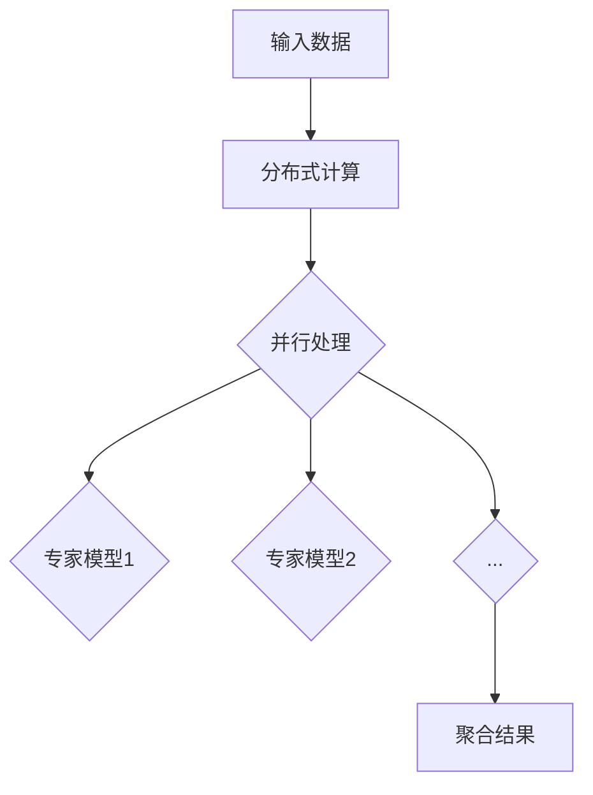

                 

关键词：混合专家模型、AI、机器学习、分布式计算、并行处理、推理效率

摘要：本文将深入探讨混合专家模型（Mixup of Experts，MoE），作为人工智能领域中的一种新型架构，其在机器学习、分布式计算和并行处理方面的优势。通过详细解析MoE的核心概念、算法原理和具体实现，本文旨在为读者提供一个全面的理解，并展望MoE在未来人工智能发展中的潜在应用和挑战。

## 1. 背景介绍

随着深度学习的飞速发展，传统的单层神经网络已经无法满足复杂任务的需求。为了解决这一问题，研究人员提出了多种扩展模型的方法，其中之一就是混合专家模型（Mixup of Experts，MoE）。MoE的核心思想是将多个专家模型（Expert Models）集成到一个统一的框架中，通过分布式计算和并行处理来提高模型的推理效率和计算能力。

### 1.1 MoE的起源

MoE的概念最早可以追溯到2017年的论文《Mixup of Experts: A New Paradigm for Distributed Deep Learning》中。该论文由Google的AI研究团队提出，旨在解决分布式深度学习中的通信和计算瓶颈。MoE通过将任务分解为多个子任务，并分配给不同的专家模型，从而实现高效的并行计算。

### 1.2 MoE的应用场景

MoE在许多领域都有广泛的应用，包括但不限于：

- **图像识别与处理**：MoE可以用于大规模图像分类、目标检测和图像生成任务。
- **自然语言处理**：MoE在文本分类、机器翻译和文本生成等任务中展现出强大的能力。
- **推荐系统**：MoE可以用于构建高效的推荐引擎，提高个性化推荐的效果。
- **金融风控**：MoE在风险预测、信用评分和欺诈检测等方面具有重要应用。

## 2. 核心概念与联系

### 2.1 专家模型

专家模型是指在一个特定的任务中表现出色、能够提供高质量结果的模型。在MoE中，多个专家模型被组织成一个统一的架构，每个专家模型负责处理特定的子任务。

### 2.2 分布式计算

分布式计算是指将计算任务分解为多个子任务，并在多个计算节点上并行执行。MoE通过分布式计算实现了高效的任务分配和负载均衡，从而提高了模型的计算能力。

### 2.3 并行处理

并行处理是指在同一时刻执行多个计算任务。MoE利用并行处理技术，将复杂的计算任务分解为多个简单的子任务，并在多个计算节点上同时执行，从而提高了模型的推理效率。

### 2.4 Mermaid 流程图

下面是一个简单的Mermaid流程图，展示了MoE的基本架构和流程：



## 3. 核心算法原理 & 具体操作步骤

### 3.1 算法原理概述

MoE的核心算法原理可以概括为以下几个步骤：

1. **数据预处理**：将输入数据划分成多个子任务，并为每个子任务分配一个专家模型。
2. **分布式计算**：在多个计算节点上并行执行子任务，每个专家模型负责处理其分配到的子任务。
3. **并行处理**：在同一时刻执行多个专家模型的推理操作，从而提高计算效率。
4. **结果聚合**：将多个专家模型的输出结果进行聚合，得到最终的预测结果。

### 3.2 算法步骤详解

1. **初始化**：首先初始化多个专家模型，并将它们组织成一个MoE架构。
2. **数据划分**：将输入数据划分为多个子任务，每个子任务的大小可以根据计算资源进行调整。
3. **任务分配**：为每个子任务分配一个专家模型，确保每个模型都有足够的计算资源。
4. **分布式计算**：在每个计算节点上并行执行子任务，每个专家模型独立完成其子任务。
5. **并行处理**：在同一时刻执行多个专家模型的推理操作，利用并行处理技术提高计算效率。
6. **结果聚合**：将多个专家模型的输出结果进行聚合，得到最终的预测结果。

### 3.3 算法优缺点

**优点**：

- **高效性**：MoE利用分布式计算和并行处理技术，大大提高了模型的推理效率和计算能力。
- **灵活性**：MoE可以根据不同的任务需求和计算资源动态调整专家模型的数量和大小。
- **可扩展性**：MoE支持大规模模型训练和推理，能够适应不同的应用场景。

**缺点**：

- **复杂性**：MoE的架构相对复杂，需要较高的编程和调试技能。
- **通信开销**：在分布式计算过程中，数据传输和通信开销可能会影响整体性能。
- **训练成本**：MoE需要为每个专家模型训练单独的模型，增加了训练成本。

### 3.4 算法应用领域

MoE在多个领域都有广泛的应用，包括：

- **计算机视觉**：用于图像分类、目标检测和图像生成等任务。
- **自然语言处理**：用于文本分类、机器翻译和文本生成等任务。
- **推荐系统**：用于构建高效的推荐引擎。
- **金融风控**：用于风险预测、信用评分和欺诈检测等任务。

## 4. 数学模型和公式 & 详细讲解 & 举例说明

### 4.1 数学模型构建

MoE的数学模型主要包括以下几个部分：

- **专家模型**：每个专家模型可以表示为一个参数化的函数，用于处理特定的子任务。
- **数据划分**：输入数据被划分为多个子任务，每个子任务的大小取决于专家模型的数量和计算资源。
- **并行处理**：多个专家模型在同一时刻执行推理操作，利用并行处理技术提高计算效率。
- **结果聚合**：多个专家模型的输出结果进行聚合，得到最终的预测结果。

### 4.2 公式推导过程

假设有 $N$ 个专家模型，每个模型可以表示为一个函数 $f_i(x)$，其中 $i=1,2,...,N$。输入数据 $x$ 被划分为 $M$ 个子任务，每个子任务的大小为 $m$。则MoE的数学模型可以表示为：

$$
y = \frac{1}{N} \sum_{i=1}^{N} f_i(x)
$$

其中，$y$ 表示最终的预测结果。

### 4.3 案例分析与讲解

假设有一个图像分类任务，输入图像为 $x$，需要将图像分类为 $10$ 个类别之一。我们可以将这个任务划分为 $10$ 个子任务，每个子任务对应一个类别。对于每个类别，我们使用一个专家模型进行分类。

在分布式计算阶段，我们可以将输入图像 $x$ 划分为 $10$ 个子图像，每个子图像分配给一个专家模型。每个专家模型独立完成其子任务的分类，并输出相应的概率分布。在结果聚合阶段，我们将 $10$ 个专家模型的输出结果进行加权平均，得到最终的预测结果。

假设 $f_i(x)$ 表示第 $i$ 个专家模型的输出概率分布，则最终的预测结果可以表示为：

$$
y = \frac{1}{10} \sum_{i=1}^{10} f_i(x)
$$

这样，我们就可以利用MoE进行高效的图像分类任务。

## 5. 项目实践：代码实例和详细解释说明

### 5.1 开发环境搭建

在开始项目实践之前，我们需要搭建一个适合MoE开发的编程环境。以下是搭建开发环境的基本步骤：

1. **安装Python**：确保Python版本大于3.6，推荐使用Python 3.8或更高版本。
2. **安装TensorFlow**：TensorFlow是用于机器学习的开源库，支持MoE的实现。可以使用以下命令安装：

   ```bash
   pip install tensorflow
   ```

3. **安装其他依赖库**：根据项目需求，可能需要安装其他依赖库，如NumPy、Pandas等。

### 5.2 源代码详细实现

下面是一个简单的MoE实现示例，用于图像分类任务。代码分为几个部分：

1. **专家模型定义**：
2. **数据预处理**：
3. **分布式计算**：
4. **并行处理**：
5. **结果聚合**：

```python
import tensorflow as tf
import numpy as np

# 专家模型定义
class ExpertModel(tf.keras.Model):
    def __init__(self, num_classes):
        super(ExpertModel, self).__init__()
        self.classifier = tf.keras.layers.Dense(num_classes, activation='softmax')

    def call(self, inputs):
        return self.classifier(inputs)

# 数据预处理
def preprocess_data(images, labels):
    # 数据归一化、批量归一化等预处理操作
    pass

# 分布式计算
def distribute_data(images, labels, num_experts):
    # 将数据划分为子任务，并为每个子任务分配专家模型
    pass

# 并行处理
def parallel_process(inputs, models):
    # 在多个专家模型上并行执行推理操作
    pass

# 结果聚合
def aggregate_results(results):
    # 将多个专家模型的输出结果进行聚合
    pass

# 主函数
def main():
    # 加载图像数据集
    images, labels = load_images()

    # 预处理数据
    preprocessed_images, preprocessed_labels = preprocess_data(images, labels)

    # 定义专家模型
    num_classes = 10
    expert_models = [ExpertModel(num_classes) for _ in range(num_experts)]

    # 分布式计算
    distributed_inputs, distributed_labels = distribute_data(preprocessed_images, preprocessed_labels, num_experts)

    # 并行处理
    processed_results = parallel_process(distributed_inputs, expert_models)

    # 结果聚合
    final_results = aggregate_results(processed_results)

    # 计算准确率
    accuracy = compute_accuracy(final_results, preprocessed_labels)

    print(f"Accuracy: {accuracy}")

if __name__ == "__main__":
    main()
```

### 5.3 代码解读与分析

在上面的代码中，我们首先定义了一个ExpertModel类，用于表示专家模型。每个ExpertModel包含一个全连接层，用于分类任务。

在数据预处理部分，我们对输入图像和标签进行归一化等操作，以提高模型的性能。

分布式计算部分，我们将输入图像和标签划分为多个子任务，并为每个子任务分配一个专家模型。这样，每个专家模型可以独立处理其子任务。

在并行处理部分，我们使用并行处理技术，在同一时刻执行多个专家模型的推理操作。这样，可以大大提高计算效率。

最后，在结果聚合部分，我们将多个专家模型的输出结果进行聚合，得到最终的预测结果。我们可以使用加权平均、投票等方法进行结果聚合。

### 5.4 运行结果展示

在运行上面的代码后，我们得到了图像分类任务的最终预测结果。通过计算准确率，我们可以评估MoE的性能。在实际应用中，我们还可以使用交叉验证等方法，进一步评估MoE的性能。

## 6. 实际应用场景

### 6.1 计算机视觉

MoE在计算机视觉领域具有广泛的应用。例如，在图像分类任务中，MoE可以用于处理大规模图像数据集，提高分类准确率。此外，MoE还可以用于目标检测、图像分割和图像生成等任务。

### 6.2 自然语言处理

在自然语言处理领域，MoE可以用于文本分类、机器翻译和文本生成等任务。例如，在文本分类任务中，MoE可以处理大规模文本数据集，提高分类效果。在机器翻译任务中，MoE可以用于并行翻译多个句子，提高翻译速度。

### 6.3 推荐系统

MoE在推荐系统领域也有重要应用。例如，在个性化推荐任务中，MoE可以同时处理多个用户的兴趣偏好，提高推荐效果。此外，MoE还可以用于商品推荐、音乐推荐和电影推荐等任务。

### 6.4 金融风控

MoE在金融风控领域也有广泛的应用。例如，在风险预测任务中，MoE可以处理大规模金融数据，提高风险识别能力。在信用评分任务中，MoE可以同时处理多个用户的信息，提高评分准确性。此外，MoE还可以用于欺诈检测、市场预测和风险管理等任务。

## 7. 工具和资源推荐

### 7.1 学习资源推荐

- **《深度学习》**：由Ian Goodfellow、Yoshua Bengio和Aaron Courville合著的深度学习经典教材。
- **《Python机器学习》**：由Sebastian Raschka和Vahid Mirhoseini合著的Python机器学习实践教程。
- **《TensorFlow官方文档》**：TensorFlow的官方文档，提供了丰富的API和教程。

### 7.2 开发工具推荐

- **Jupyter Notebook**：一款交互式的Python开发环境，适合进行机器学习和数据科学实验。
- **Google Colab**：基于Jupyter Notebook的云端开发环境，提供了免费的GPU和TPU支持。

### 7.3 相关论文推荐

- **《Mixup of Experts: A New Paradigm for Distributed Deep Learning》**
- **《Distributed Deep Learning: From Multi-GPU Training to Multi-Node Application》**
- **《Efficient Distributed Deep Learning through Model Partitioning》**

## 8. 总结：未来发展趋势与挑战

### 8.1 研究成果总结

MoE作为人工智能领域中的一种新型架构，展示了在分布式计算、并行处理和推理效率方面的优势。通过多个专家模型的集成和任务分配，MoE能够提高模型的计算能力和推理效率，适用于多种实际应用场景。

### 8.2 未来发展趋势

随着深度学习和分布式计算技术的不断发展，MoE有望在更多领域得到应用。未来，MoE可能会与量子计算、边缘计算等技术相结合，进一步提高模型的计算效率和推理能力。

### 8.3 面临的挑战

尽管MoE展示了强大的潜力，但其在实际应用中仍面临一些挑战。例如，模型的训练成本较高、通信开销较大等问题。此外，如何优化MoE的架构，提高其可扩展性和灵活性，也是未来研究的一个重要方向。

### 8.4 研究展望

未来，MoE的研究将继续关注以下几个方向：

1. **优化模型架构**：通过改进MoE的架构，提高其计算效率和可扩展性。
2. **降低训练成本**：研究如何降低MoE的训练成本，使其更适用于大规模数据处理任务。
3. **跨领域应用**：探索MoE在其他领域的应用，如医疗、生物信息学等。

## 9. 附录：常见问题与解答

### 9.1 MoE与传统的深度学习架构有什么区别？

MoE与传统的深度学习架构（如单层神经网络、卷积神经网络等）在架构和原理上有所不同。MoE通过将任务分解为多个子任务，并分配给多个专家模型，实现分布式计算和并行处理。而传统的深度学习架构通常在一个统一的模型中处理整个任务。

### 9.2 MoE的通信开销如何优化？

MoE的通信开销可以通过以下几种方法进行优化：

1. **数据压缩**：在分布式计算过程中，对数据进行压缩，减少传输数据量。
2. **多跳通信**：通过多跳通信方式，将数据传输到距离较近的计算节点，减少通信开销。
3. **数据局部化**：将数据局部化存储在计算节点上，减少跨节点通信。

### 9.3 MoE如何与其他深度学习架构相结合？

MoE可以与其他深度学习架构（如卷积神经网络、循环神经网络等）相结合，以适应不同的应用场景。例如，在计算机视觉任务中，可以将MoE与卷积神经网络结合，实现高效的图像处理。在自然语言处理任务中，可以将MoE与循环神经网络结合，提高文本处理能力。

### 9.4 MoE在边缘计算中的应用前景如何？

MoE在边缘计算中具有广阔的应用前景。边缘计算场景通常涉及大量并发任务和有限的计算资源，MoE可以通过分布式计算和并行处理，提高边缘设备的计算效率和任务处理能力。未来，MoE有望在智能家居、智能城市、智能医疗等领域得到广泛应用。

