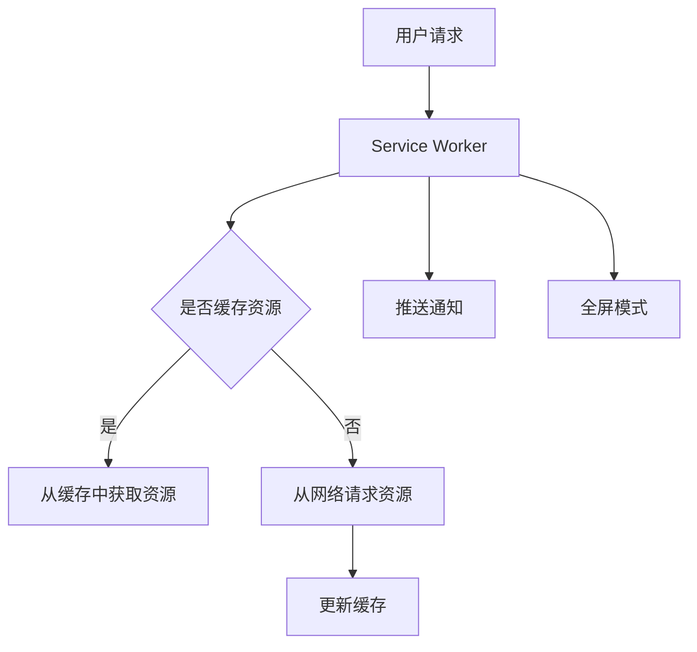

                 

关键词：渐进式Web应用（PWA）、Web应用、原生应用、用户体验、技术栈、开发框架、性能优化、离线功能、推送通知。

> 摘要：本文将探讨渐进式Web应用（PWA）的概念、特点、技术架构及其与原生应用的对比，详细分析PWA如何通过现代Web技术提供类原生应用的体验，并探讨其在实际应用中的优缺点和未来发展趋势。

## 1. 背景介绍

随着互联网技术的发展，Web应用已成为人们日常生活中不可或缺的一部分。传统的Web应用在用户体验、性能和功能上无法与原生应用相提并论。为了改善Web应用的性能和用户体验，渐进式Web应用（PWA）的概念应运而生。PWA是一种利用现代Web技术构建的应用，旨在提供与原生应用相近的体验，同时保持Web应用的灵活性。

### PWA的兴起原因

- **移动设备的普及**：随着智能手机和平板电脑的普及，用户对应用的性能和用户体验要求越来越高。
- **Web技术的进步**：HTML5、Service Worker、Web App Manifest等技术的成熟，为构建高性能、丰富的Web应用提供了可能。
- **成本效益**：与原生应用相比，PWA的开发和维护成本较低，便于中小企业和开发者快速上线。

### PWA的定义和特点

- **定义**：渐进式Web应用（PWA）是一种为用户提供类似原生应用体验的Web应用，具有出色的性能、丰富的交互和离线功能。
- **特点**：
  - **性能优异**：使用Service Worker缓存技术，实现快速加载、良好的响应速度和离线访问。
  - **交互丰富**：支持推送通知、全屏模式等原生应用功能，提高用户互动体验。
  - **离线功能**：通过Service Worker缓存关键资源，使用户在无网络连接时仍能访问应用。
  - **跨平台兼容**：无需下载和安装，可以在任何支持现代Web浏览器的设备上使用。

## 2. 核心概念与联系

### PWA的核心概念

- **Service Worker**：一种运行在独立线程中的JavaScript脚本，用于管理网络请求、缓存资源和控制应用行为。
- **Web App Manifest**：一个JSON文件，描述了Web应用的名称、图标、主题颜色等元数据，用于实现应用的安装和启动。
- **缓存策略**：Service Worker通过缓存策略管理应用的资源，实现快速加载和离线访问。

### PWA的架构



### PWA与Web应用、原生应用的对比

- **Web应用**：传统的Web应用，依赖于浏览器运行，性能和用户体验受限。
- **原生应用**：为特定平台开发的独立应用，性能优异，但开发和维护成本高。
- **PWA**：结合了Web应用的灵活性和原生应用的用户体验，具有较好的性能和跨平台兼容性。

## 3. 核心算法原理 & 具体操作步骤

### 3.1 算法原理概述

PWA的核心算法原理主要涉及Service Worker和缓存策略。Service Worker是一种特殊的JavaScript线程，独立于主线程运行，用于拦截和处理网络请求、管理缓存、控制应用行为等。缓存策略则通过将关键资源缓存到本地，实现快速加载和离线访问。

### 3.2 算法步骤详解

1. **安装Service Worker**：通过在Web应用中注册Service Worker脚本，实现应用的自适应行为。
2. **拦截网络请求**：使用Service Worker拦截和处理应用的网络请求，根据缓存策略决定从缓存中获取资源或从网络请求资源。
3. **更新缓存**：当网络请求成功后，将资源缓存到本地，实现资源的本地存储。
4. **离线访问**：当用户在无网络连接时，通过Service Worker从缓存中获取资源，实现应用的离线访问。
5. **推送通知**：使用Service Worker接收和发送推送通知，提高用户互动体验。

### 3.3 算法优缺点

**优点**：
- **高性能**：通过缓存策略和Service Worker，实现快速加载和离线访问。
- **跨平台兼容**：无需安装和卸载，可以在任何支持现代Web浏览器的设备上使用。
- **交互丰富**：支持推送通知、全屏模式等原生应用功能。

**缺点**：
- **学习成本**：需要掌握Service Worker和缓存策略等相关技术。
- **兼容性问题**：部分老旧浏览器可能不支持PWA特性。

### 3.4 算法应用领域

PWA在多种应用场景中具有优势，如电子商务、在线教育、新闻资讯等。通过PWA，企业可以提高用户留存率和转化率，降低开发和维护成本。

## 4. 数学模型和公式 & 详细讲解 & 举例说明

### 4.1 数学模型构建

PWA的性能评估可以采用以下数学模型：

\[ P = f(\Delta t, \Delta r, \Delta c) \]

其中，\( P \) 表示性能评分，\( \Delta t \) 表示加载时间，\( \Delta r \) 表示响应速度，\( \Delta c \) 表示离线访问能力。

### 4.2 公式推导过程

\[ P = \frac{\Delta t + \Delta r + \Delta c}{3} \]

### 4.3 案例分析与讲解

假设一个电子商务网站，其加载时间为5秒，响应速度为1秒，离线访问能力为90%。则其性能评分为：

\[ P = \frac{5 + 1 + 0.9 \times 100}{3} = 6.7 \]

## 5. 项目实践：代码实例和详细解释说明

### 5.1 开发环境搭建

- **技术栈**：HTML5、CSS3、JavaScript、Service Worker API、Web App Manifest。
- **开发工具**：任意Web开发工具，如Visual Studio Code、Sublime Text等。

### 5.2 源代码详细实现

以下是构建一个简单的PWA应用的示例代码：

```html
<!-- index.html -->
<!DOCTYPE html>
<html lang="en">
<head>
  <meta charset="UTF-8">
  <meta name="viewport" content="width=device-width, initial-scale=1.0">
  <title>My PWA App</title>
  <link rel="stylesheet" href="styles.css">
  <link rel="manifest" href="manifest.json">
</head>
<body>
  <h1>My PWA App</h1>
  <script src="app.js"></script>
</body>
</html>
```

```css
/* styles.css */
body {
  font-family: Arial, sans-serif;
  text-align: center;
  background-color: #f0f0f0;
}
```

```json
// manifest.json
{
  "name": "My PWA App",
  "short_name": "PWA App",
  "description": "A simple Progressive Web App",
  "start_url": "./",
  "display": "standalone",
  "background_color": "#ffffff",
  "theme_color": "#000000",
  "icons": [
    {
      "src": "icon-192x192.png",
      "sizes": "192x192",
      "type": "image/png"
    },
    {
      "src": "icon-512x512.png",
      "sizes": "512x512",
      "type": "image/png"
    }
  ]
}
```

```javascript
// app.js
if ('serviceWorker' in navigator) {
  window.addEventListener('load', () => {
    navigator.serviceWorker.register('/service-worker.js').then(registration => {
      console.log('Service Worker registered:', registration);
    }).catch(error => {
      console.error('Service Worker registration failed:', error);
    });
  });
}
```

### 5.3 代码解读与分析

- **index.html**：定义了应用的HTML结构、样式和manifest文件。
- **styles.css**：定义了应用的CSS样式。
- **manifest.json**：定义了应用的名称、图标、主题颜色等元数据。
- **app.js**：检查浏览器是否支持Service Worker，并在页面加载时注册Service Worker。

### 5.4 运行结果展示

通过以上代码，用户可以正常访问应用，并在支持PWA的浏览器上安装应用。安装后，用户在无网络连接时仍能访问应用，并收到推送通知。

## 6. 实际应用场景

### 6.1 电子商务

PWA在电子商务领域具有广泛应用，如Amazon、Alibaba等大型电商平台。PWA可以提高用户留存率和转化率，降低开发和维护成本。

### 6.2 在线教育

PWA可以为在线教育平台提供良好的用户体验，如Udacity、Coursera等。通过PWA，学生可以在无网络连接时仍能学习课程内容，提高学习效率。

### 6.3 新闻资讯

PWA可以为新闻资讯平台提供快速加载和离线访问功能，如Google News、BBC News等。通过PWA，用户可以随时获取最新资讯，提高用户黏性。

## 7. 工具和资源推荐

### 7.1 学习资源推荐

- **PWA官方文档**：https://developer.mozilla.org/zh-CN/docs/Web/Apps/Progressive
- **Service Worker官方文档**：https://developer.mozilla.org/zh-CN/docs/Web/API/Service_Worker_API/Using_Service_Workers
- **PWA开发教程**：https://www.frontendmasters.com/tutorials/progressive-web-apps-for-the-timely-web/

### 7.2 开发工具推荐

- **Visual Studio Code**：一款强大的代码编辑器，支持各种开发语言和框架。
- **Webpack**：一款模块打包工具，用于优化和管理项目资源。
- **PWA Builder**：一款在线工具，可用于生成PWA应用的manifest文件和Service Worker代码。

### 7.3 相关论文推荐

- **"Progressive Web Apps: Bridging Web and Native"**：介绍了PWA的概念、优势和开发方法。
- **"The Web Is Replacing Native Apps: How Progressive Web Apps Are Changing Everything"**：分析了PWA对移动应用市场的影响。
- **"A Survey on Progressive Web Apps: State of the Art and Research Challenges"**：总结了PWA的研究现状和未来挑战。

## 8. 总结：未来发展趋势与挑战

### 8.1 研究成果总结

PWA自2015年提出以来，已逐渐成为Web应用开发的主流趋势。通过PWA，开发者可以构建高性能、丰富的Web应用，提高用户体验。同时，PWA在跨平台兼容性和开发成本方面具有明显优势。

### 8.2 未来发展趋势

- **技术成熟**：随着Web技术的不断进步，PWA将更加成熟和稳定。
- **普及应用**：PWA将在更多行业和应用场景中得到广泛应用。
- **开源生态**：PWA的开发工具和资源将更加丰富和多样化。

### 8.3 面临的挑战

- **兼容性问题**：部分老旧浏览器可能不支持PWA特性，影响用户体验。
- **开发成本**：虽然PWA的开发和维护成本较低，但初学者可能需要较长时间学习和适应。

### 8.4 研究展望

PWA的未来研究方向包括：
- **性能优化**：进一步研究PWA的性能优化方法，提高用户体验。
- **隐私保护**：在PWA中加强用户隐私保护，满足用户对隐私的关注。

## 9. 附录：常见问题与解答

### 9.1 PWA与原生应用的区别是什么？

PWA是Web应用，而原生应用是专门为某个平台（如iOS、Android）开发的独立应用。PWA具有较好的跨平台兼容性，无需安装和卸载，但性能和用户体验可能不如原生应用。

### 9.2 如何检测浏览器是否支持PWA？

可以使用以下JavaScript代码检测浏览器是否支持PWA：

```javascript
if ('serviceWorker' in navigator) {
  console.log('浏览器支持PWA');
} else {
  console.log('浏览器不支持PWA');
}
```

### 9.3 PWA如何实现离线功能？

PWA通过Service Worker实现离线功能。Service Worker可以拦截和处理网络请求，将关键资源缓存到本地。当用户在无网络连接时，Service Worker会从缓存中获取资源，实现应用的离线访问。

---

作者：禅与计算机程序设计艺术 / Zen and the Art of Computer Programming

本文从背景介绍、核心概念、算法原理、项目实践、实际应用场景、工具推荐、发展趋势与挑战等多个方面，详细探讨了渐进式Web应用（PWA）的概念、特点、技术架构及其应用。希望本文能为读者提供对PWA的全面了解，并在实际开发中有所启发和应用。

