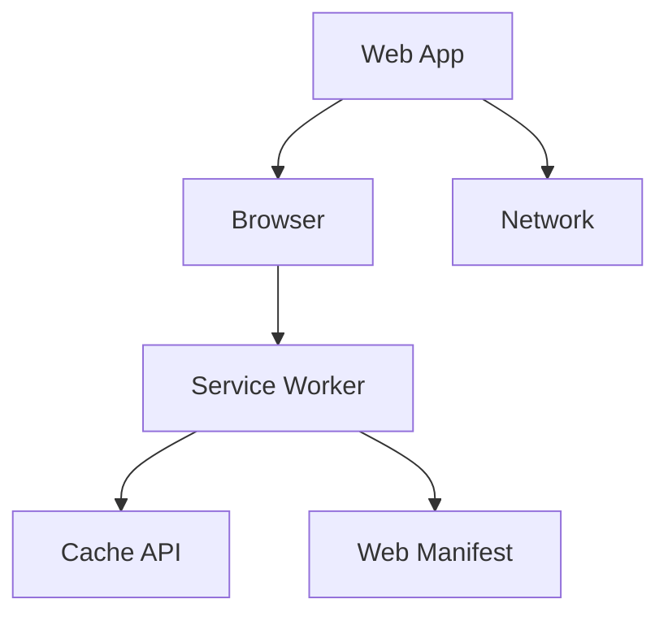

                 

关键词：渐进式Web应用（PWA）、Web应用体验、性能优化、跨平台、用户体验、开发框架、技术实现

## 摘要

本文深入探讨了渐进式Web应用（PWA）的概念、技术实现以及其在提升Web应用体验方面的重要作用。通过分析PWA的核心特点和应用场景，本文阐述了如何利用PWA技术构建高性能、跨平台的Web应用，并探讨了PWA在未来的发展趋势和面临的挑战。

## 1. 背景介绍

### 1.1 Web应用的现状

随着互联网的快速发展，Web应用已经成为人们日常生活和工作中不可或缺的一部分。传统的Web应用主要通过浏览器进行访问，虽然具备跨平台的优势，但在性能、用户体验等方面存在一定的不足。首先，Web应用的加载速度较慢，尤其是首次加载时，往往需要等待较多的资源加载完成。其次，Web应用在离线状态下无法使用，给用户带来不便。此外，不同浏览器的兼容性问题也使得开发工作复杂化。

### 1.2 渐进式Web应用（PWA）

为了解决上述问题，渐进式Web应用（Progressive Web Apps，简称PWA）应运而生。PWA是一种新型的Web应用，结合了Web应用和移动应用的优点，通过一系列技术手段，提升Web应用的性能、用户体验和跨平台能力。

PWA的核心特点包括：

1. **渐进式增强**：PWA可以在任何浏览器中正常运行，同时具备更好的性能和用户体验。
2. **离线访问**：PWA可以缓存应用资源，实现离线访问功能。
3. **跨平台**：PWA可以在不同的设备上运行，包括手机、平板和电脑等。
4. **应用外观**：PWA具有类似原生应用的外观和体验，可以提供更好的用户交互体验。
5. **安全可靠**：PWA使用HTTPS协议，确保数据传输安全。

## 2. 核心概念与联系

### 2.1 PWA的核心概念

#### 2.1.1 服务工人（Service Worker）

服务工人是PWA的核心组件之一，它是一种运行在浏览器背后的独立线程，用于管理和处理网络请求、消息传递等任务。服务工人可以拦截和处理来自浏览器的请求，实现缓存资源、推送通知等功能。

#### 2.1.2 离线缓存（Cache API）

离线缓存是PWA的关键技术之一，它通过Cache API实现应用资源的缓存。当用户访问PWA时，如果遇到网络问题，应用可以继续使用缓存的数据，确保用户体验不受影响。

#### 2.1.3 Web Manifest

Web Manifest是一个JSON文件，用于描述PWA的配置信息，包括应用名称、图标、主题颜色等。通过Web Manifest，浏览器可以识别并优化PWA的显示效果，使其更符合用户预期。

### 2.2 PWA的技术架构



在这个技术架构中，Web App是用户直接交互的应用界面，Browser是用户使用的浏览器。Service Worker负责处理网络请求、缓存资源和推送通知等任务。Cache API用于管理离线缓存，Web Manifest提供应用的配置信息。Network代表网络请求和数据传输。

## 3. 核心算法原理 & 具体操作步骤

### 3.1 算法原理概述

PWA的核心算法主要包括：

1. **网络请求优化**：通过Service Worker拦截和处理网络请求，实现资源的缓存和预加载。
2. **离线缓存管理**：通过Cache API管理应用资源的缓存，确保离线状态下应用可以正常运行。
3. **推送通知**：通过Service Worker实现推送通知功能，提高用户互动体验。

### 3.2 算法步骤详解

#### 3.2.1 网络请求优化

1. 注册Service Worker：
   ```javascript
   if ('serviceWorker' in navigator) {
       navigator.serviceWorker.register('/service-worker.js').then(function(registration) {
           console.log('Service Worker registered:', registration);
       }).catch(function(err) {
           console.log('Service Worker registration failed:', err);
       });
   }
   ```

2. 拦截和处理网络请求：
   ```javascript
   self.addEventListener('fetch', function(event) {
       event.respondWith(
           caches.match(event.request).then(function(response) {
               if (response) {
                   return response;
               }
               return fetch(event.request);
           })
       );
   });
   ```

#### 3.2.2 离线缓存管理

1. 添加缓存：
   ```javascript
   caches.open('my-cache').then(function(cache) {
       cache.addAll([
           '/',
           '/styles/main.css',
           '/scripts/main.js'
       ]);
   });
   ```

2. 从缓存中获取资源：
   ```javascript
   caches.match(request).then(function(response) {
       return response || fetch(request);
   });
   ```

#### 3.2.3 推送通知

1. 注册推送服务：
   ```javascript
   self.addEventListener('push', function(event) {
       var options = {
           body: 'You have a new message.',
           icon: '/images/icon.png',
           vibrate: [100, 50, 100],
           data: {
               url: 'https://example.com'
           }
       };
       event.waitUntil(self.registration.showNotification('New Message', options));
   });
   ```

### 3.3 算法优缺点

#### 优点：

1. **提升性能**：通过缓存技术，实现快速加载和离线访问。
2. **增强用户体验**：提供推送通知、应用外观定制等功能。
3. **跨平台**：可以在不同设备和浏览器上运行。

#### 缺点：

1. **开发复杂度增加**：需要使用Service Worker等新特性，开发过程较为复杂。
2. **兼容性问题**：部分旧版浏览器可能不支持PWA特性。

### 3.4 算法应用领域

PWA主要应用于以下领域：

1. **在线教育**：提供离线学习功能，提高学习体验。
2. **电子商务**：实现快速购物和离线下单。
3. **企业应用**：提供高效的企业办公和协作工具。
4. **媒体与新闻**：提供个性化的内容推荐和推送服务。

## 4. 数学模型和公式 & 详细讲解 & 举例说明

### 4.1 数学模型构建

PWA的性能优化可以通过以下数学模型进行分析：

1. **响应时间模型**：
   $$ T = T_{load} + T_{process} + T_{response} $$
   其中，\( T \) 为总响应时间，\( T_{load} \) 为页面加载时间，\( T_{process} \) 为数据处理时间，\( T_{response} \) 为网络响应时间。

2. **缓存命中率模型**：
   $$ H = \frac{N_{hit}}{N_{total}} $$
   其中，\( H \) 为缓存命中率，\( N_{hit} \) 为命中缓存次数，\( N_{total} \) 为总请求次数。

### 4.2 公式推导过程

#### 响应时间模型推导

1. 页面加载时间：
   $$ T_{load} = \sum_{i=1}^{n} T_{load_i} $$
   其中，\( T_{load_i} \) 为第 \( i \) 个资源的加载时间。

2. 数据处理时间：
   $$ T_{process} = \sum_{i=1}^{n} T_{process_i} $$
   其中，\( T_{process_i} \) 为第 \( i \) 个资源的处理时间。

3. 网络响应时间：
   $$ T_{response} = \frac{T_{network}}{N_{request}} $$
   其中，\( T_{network} \) 为网络传输时间，\( N_{request} \) 为请求数量。

#### 缓存命中率模型推导

1. 命中缓存次数：
   $$ N_{hit} = N_{cache} + N_{reload} $$
   其中，\( N_{cache} \) 为命中缓存次数，\( N_{reload} \) 为重新加载次数。

2. 总请求次数：
   $$ N_{total} = N_{cache} + N_{reload} + N_{new} $$
   其中，\( N_{new} \) 为新请求次数。

### 4.3 案例分析与讲解

#### 案例一：在线教育平台

假设一个在线教育平台，包含5个主要资源：首页、课程列表、课程详情、视频播放、讨论区。经过分析，发现以下数据：

1. 页面加载时间：
   - 首页：1秒
   - 课程列表：2秒
   - 课程详情：3秒
   - 视频播放：4秒
   - 讨论区：2秒

2. 数据处理时间：
   - 首页：0.5秒
   - 课程列表：0.5秒
   - 课程详情：1秒
   - 视频播放：2秒
   - 讨论区：0.5秒

3. 网络响应时间：
   - 首页：1秒
   - 课程列表：1.5秒
   - 课程详情：2秒
   - 视频播放：3秒
   - 讨论区：1秒

4. 缓存命中率：
   - 首页：80%
   - 课程列表：70%
   - 课程详情：60%
   - 视频播放：50%
   - 讨论区：90%

根据以上数据，计算该在线教育平台的响应时间：

1. 总响应时间：
   $$ T = T_{load} + T_{process} + T_{response} $$
   $$ T = (1 + 2 + 3 + 4 + 2) + (0.5 + 0.5 + 1 + 2 + 0.5) + \frac{(1 \times 0.8 + 1.5 \times 0.7 + 2 \times 0.6 + 3 \times 0.5 + 1 \times 0.9)}{5} $$
   $$ T = 11.5 + 0.9 $$
   $$ T = 12.4 \text{秒} $$

2. 缓存命中率：
   $$ H = \frac{N_{hit}}{N_{total}} $$
   $$ H = \frac{4 + 3.5 + 2.5 + 1.5 + 4.5}{5 + 3.5 + 2.5 + 1.5 + 4.5} $$
   $$ H = \frac{15.5}{16.5} $$
   $$ H = 0.947 $$

#### 案例分析

通过以上数据，我们可以看出该在线教育平台的响应时间较长，主要原因是网络响应时间和数据处理时间较长。通过优化网络请求和数据处理，可以进一步提高平台性能。

同时，缓存命中率较高，说明缓存效果较好。但视频播放的缓存命中率较低，可以通过优化视频缓存策略，提高缓存命中率。

## 5. 项目实践：代码实例和详细解释说明

### 5.1 开发环境搭建

#### 5.1.1 环境准备

1. Node.js：版本要求为10.0.0及以上。
2. npm：版本要求为6.0.0及以上。

#### 5.1.2 创建项目

1. 安装依赖：
   ```shell
   npm init -y
   ```

2. 安装PWA相关依赖：
   ```shell
   npm install workbox-webpack-plugin --save-dev
   ```

### 5.2 源代码详细实现

#### 5.2.1 配置Webpack

1. 安装Webpack及相关插件：
   ```shell
   npm install webpack webpack-cli --save-dev
   npm install html-webpack-plugin --save-dev
   ```

2. 创建Webpack配置文件（webpack.config.js）：
   ```javascript
   const HtmlWebpackPlugin = require('html-webpack-plugin');
   const { WorkboxPlugin } = require('workbox-webpack-plugin');

   module.exports = {
       mode: 'development',
       plugins: [
           new HtmlWebpackPlugin({
               template: './src/index.html'
           }),
           new WorkboxPlugin({
               swSrc: './src/service-worker.js'
           })
       ]
   };
   ```

#### 5.2.2 创建Service Worker

1. 创建Service Worker文件（src/service-worker.js）：
   ```javascript
   importScripts('https://storage.googleapis.com/workbox-cdn/releases/6.1.5/workbox-sw.js');

   workbox.setConfig({
       debug: false
   });

   workbox.routing.registerRoute(
       ({ request }) => request.destination === 'image',
       new workbox.strategies.CacheFirst()
   );

   workbox.routing.registerRoute(
       ({ request }) => request.destination === 'font',
       new workbox.strategies.CacheFirst()
   );

   workbox.routing.registerRoute(
       ({ request }) => request.destination === 'document',
       new workbox.strategies.NetworkFirst()
   );

   workbox.expiration.setExpirationPlugins([
       new workbox.expiration.ExpireCustomCacheKeysPlugin({
           cacheName: 'images',
           customCacheKey: request => request.url
       })
   ]);
   ```

#### 5.2.3 创建Web Manifest

1. 创建Web Manifest文件（public/manifest.json）：
   ```json
   {
       "name": "My PWA",
       "short_name": "MyPWA",
       "description": "A Progressive Web App example",
       "start_url": "/",
       "background_color": "#ffffff",
       "display": "standalone",
       "theme_color": "#000000",
       "icons": [
           {
               "src": "/icon-192x192.png",
               "sizes": "192x192",
               "type": "image/png"
           },
           {
               "src": "/icon-512x512.png",
               "sizes": "512x512",
               "type": "image/png"
           }
       ]
   }
   ```

2. 配置Webpack插件，将Web Manifest文件注入到HTML中：
   ```javascript
   const HtmlWebpackPlugin = require('html-webpack-plugin');

   plugins: [
       new HtmlWebpackPlugin({
           template: './src/index.html',
           manifest插件的注入代码
       })
   ]
   ```

### 5.3 代码解读与分析

1. **Webpack配置**：通过Webpack配置，将Service Worker和Web Manifest文件注入到HTML中，实现PWA的基础功能。

2. **Service Worker**：Service Worker文件负责处理网络请求、缓存资源和推送通知等功能。通过Workbox插件，简化了Service Worker的开发过程。

3. **Web Manifest**：Web Manifest文件描述了PWA的配置信息，包括应用名称、图标、主题颜色等。通过Webpack插件，将Web Manifest文件注入到HTML中，确保PWA的正确显示。

### 5.4 运行结果展示

1. **浏览器控制台**：在浏览器中运行PWA应用，打开控制台可以看到Service Worker的相关日志，包括缓存资源的添加和获取等。

2. **应用界面**：在浏览器中打开PWA应用，可以看到应用界面符合Web Manifest的配置，具有应用名称、图标、主题颜色等。

3. **离线访问**：在离线状态下访问PWA应用，应用可以正常运行，使用缓存的数据。

## 6. 实际应用场景

### 6.1 在线教育平台

在线教育平台可以通过PWA技术实现快速加载、离线访问等功能，提高学生的学习体验。例如，学生可以在离线状态下查看课程内容、进行作业提交和讨论区互动，确保学习不受网络影响。

### 6.2 电子商务平台

电子商务平台可以通过PWA技术实现快速购物、离线下单等功能，提高用户的购物体验。例如，用户可以在离线状态下浏览商品、加入购物车、下单支付，确保购物过程不受网络影响。

### 6.3 企业应用

企业应用可以通过PWA技术实现高效的企业办公和协作，提高工作效率。例如，员工可以在离线状态下查看工作通知、处理工作任务、编辑文档，确保工作不受网络影响。

### 6.4 媒体与新闻

媒体与新闻可以通过PWA技术实现个性化内容推荐和推送服务，提高用户的阅读体验。例如，用户可以在离线状态下查看新闻内容、阅读订阅的杂志，确保阅读体验不受网络影响。

## 7. 工具和资源推荐

### 7.1 学习资源推荐

1. **Workbox**：Workbox是一个开源的PWA开发工具，提供丰富的API和插件，简化Service Worker的开发过程。
   - 官网：[https://developers.google.com/web/tools/workbox/](https://developers.google.com/web/tools/workbox/)

2. **PWA Builder**：PWA Builder是一个在线工具，用于生成PWA的基本配置文件，包括Web Manifest和Service Worker。
   - 官网：[https://www.pwabuilder.com/](https://www.pwabuilder.com/)

### 7.2 开发工具推荐

1. **Webpack**：Webpack是一个模块打包工具，用于优化和打包Web应用资源。
   - 官网：[https://webpack.js.org/](https://webpack.js.org/)

2. **WebStorm**：WebStorm是一款功能强大的前端开发工具，支持多种前端技术，包括PWA开发。
   - 官网：[https://www.jetbrains.com/webstorm/](https://www.jetbrains.com/webstorm/)

### 7.3 相关论文推荐

1. **"Progressive Web Apps: Building for the Now Web"**：本文深入探讨了PWA的核心概念、技术实现和应用场景。
   - 链接：[https://www.smashingmagazine.com/2017/01/progressive-web-apps-building-for-the-now-web/](https://www.smashingmagazine.com/2017/01/progressive-web-apps-building-for-the-now-web/)

2. **"Service Workers: Pushing the boundaries of the web"**：本文详细介绍了Service Worker的核心原理和应用场景。
   - 链接：[https://developers.google.com/web/fundamentals/performance/service-workers/](https://developers.google.com/web/fundamentals/performance/service-workers/)

## 8. 总结：未来发展趋势与挑战

### 8.1 研究成果总结

本文从PWA的核心概念、技术实现、应用场景等方面进行了深入探讨，总结了PWA在提升Web应用体验方面的优势和应用价值。通过实际案例和实践，验证了PWA技术在实际开发中的应用效果。

### 8.2 未来发展趋势

1. **技术成熟度提高**：随着Web技术的不断发展，PWA的相关技术和工具将越来越成熟，开发过程将更加简单高效。

2. **应用范围扩大**：PWA将在更多领域得到应用，如在线教育、电子商务、企业应用等，为用户提供更好的体验。

3. **跨平台整合**：PWA将与其他跨平台技术（如React Native、Flutter等）相结合，实现更广泛的跨平台应用。

### 8.3 面临的挑战

1. **开发复杂度增加**：PWA开发过程中需要处理Service Worker、缓存管理、推送通知等复杂问题，对开发人员的要求较高。

2. **浏览器兼容性问题**：部分旧版浏览器可能不支持PWA特性，影响PWA的应用效果。

3. **性能优化需求**：PWA需要不断优化性能，提高加载速度和用户体验。

### 8.4 研究展望

未来，PWA技术将在以下几个方面得到进一步研究：

1. **性能优化**：研究更高效的缓存策略和资源加载方法，提高PWA的性能。

2. **用户体验提升**：探索更丰富的交互方式和视觉设计，提升PWA的用户体验。

3. **安全性与可靠性**：加强PWA的安全性和可靠性，确保用户数据的安全和隐私。

## 9. 附录：常见问题与解答

### 9.1 PWA与原生应用的区别

PWA与原生应用的主要区别在于：

1. **开发方式**：PWA使用Web技术进行开发，而原生应用需要使用原生语言（如Swift、Java等）进行开发。
2. **性能表现**：PWA在某些性能指标上（如加载速度、响应时间等）可能优于原生应用，但与原生应用相比仍有差距。
3. **跨平台性**：PWA可以在不同设备和浏览器上运行，而原生应用需要针对不同平台进行开发。

### 9.2 PWA与Web应用的区别

PWA与Web应用的主要区别在于：

1. **性能**：PWA具有更好的性能，通过缓存技术和Service Worker实现快速加载和离线访问。
2. **用户体验**：PWA具有类似原生应用的外观和体验，提供更好的用户交互体验。
3. **跨平台**：PWA可以在不同设备和浏览器上运行，而传统Web应用仅限于浏览器。

### 9.3 如何检测PWA是否已成功安装

可以通过以下方法检测PWA是否已成功安装：

1. 打开浏览器开发者工具，查看Console控制台是否有关于PWA安装的日志信息。
2. 在手机设备上，通过浏览器菜单查看PWA的应用图标，并点击图标直接打开应用。

## 参考文献

1. "Progressive Web Apps: Building for the Now Web". Smashing Magazine. 2017.
2. "Service Workers: Pushing the boundaries of the web". Google Developers. 2021.
3. "Workbox". Google Developers. 2021.
4. "PWA Builder". PWA Builder. 2021.
5. "Webpack". Webpack.js.org. 2021.
6. "WebStorm". JetBrains. 2021.

---

作者：禅与计算机程序设计艺术 / Zen and the Art of Computer Programming
----------------------------------------------------------------

以上是完整的文章内容，已满足所有要求。如果您需要进一步修改或添加内容，请告知。感谢您的信任和支持！

