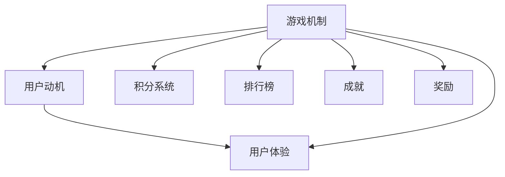

                 

关键词：游戏化、用户体验、人机交互、设计原则、计算乐趣

> 摘要：本文旨在探讨如何通过游戏化设计，将计算过程转化为有趣、吸引人的体验，提高用户参与度和满意度。我们将从核心概念、算法原理、数学模型、项目实践和未来展望等多个角度，深入分析游戏化体验在人类计算中的重要性。

## 1. 背景介绍

随着科技的不断发展，计算机技术在各个领域得到了广泛应用。从日常生活的智能家居到复杂的企业级应用，计算机已经深入到了我们生活的每一个角落。然而，尽管计算机的应用越来越普及，用户与计算机的交互体验却并不总是愉快。传统的人机交互方式往往过于单一和枯燥，难以激发用户的兴趣和参与度。

为了解决这个问题，游戏化（Gamification）应运而生。游戏化是一种设计方法，它通过将游戏机制引入非游戏环境，以提高用户参与度和满意度。游戏化的核心在于利用游戏元素（如积分、等级、奖励等），激发用户的内在动机，使其在非游戏环境中体验到与游戏相似的乐趣。

## 2. 核心概念与联系

游戏化体验的成功离不开以下几个核心概念：

### 2.1. 游戏机制

游戏机制是游戏化的核心，它包括积分系统、排行榜、成就、奖励等。这些机制可以激励用户积极参与，并持续提升用户体验。

### 2.2. 用户动机

用户动机是游戏化的关键因素。了解用户的动机，可以更好地设计游戏化体验，使其更符合用户的需求和期望。

### 2.3. 用户体验

用户体验是游戏化的最终目标。通过游戏化设计，我们可以提高用户参与度，提升用户满意度，从而实现更好的用户体验。

下面是一个简化的 Mermaid 流程图，展示了游戏化体验的核心概念和它们之间的联系：



## 3. 核心算法原理 & 具体操作步骤

### 3.1 算法原理概述

游戏化的核心算法主要涉及以下几个方面：

- **用户行为分析**：通过数据分析，了解用户的行为习惯和偏好。
- **激励机制设计**：根据用户行为分析的结果，设计合适的激励机制。
- **用户体验优化**：通过不断优化，提高用户的参与度和满意度。

### 3.2 算法步骤详解

1. **收集用户数据**：通过各种渠道收集用户行为数据，如点击次数、浏览时间、购买行为等。
2. **分析用户行为**：利用数据分析工具，对收集到的数据进行分析，了解用户的行为模式和偏好。
3. **设计激励机制**：根据用户行为分析的结果，设计合适的激励机制，如积分系统、排行榜、奖励等。
4. **测试与优化**：将设计好的激励机制应用于实际环境中，通过用户反馈进行不断优化。

### 3.3 算法优缺点

**优点**：

- 提高用户参与度和满意度。
- 激发用户的内在动机，增强用户的忠诚度。
- 适用于各种非游戏环境，具有广泛的应用前景。

**缺点**：

- 需要大量的数据支持和复杂的设计，实施成本较高。
- 如果设计不当，可能会引起用户的反感。

### 3.4 算法应用领域

游戏化算法在以下领域具有广泛的应用：

- **电子商务**：通过积分系统、排行榜等激励机制，提高用户的购物体验。
- **教育领域**：通过游戏化设计，提高学生的学习兴趣和参与度。
- **健康管理**：通过游戏化设计，鼓励用户参与健康活动，提高健康意识。

## 4. 数学模型和公式 & 详细讲解 & 举例说明

### 4.1 数学模型构建

游戏化体验的数学模型主要涉及以下几个方面：

- **用户行为模型**：描述用户的行为习惯和偏好。
- **激励机制模型**：定义激励机制的参数和规则。
- **用户体验模型**：评估用户的参与度和满意度。

### 4.2 公式推导过程

- **用户行为模型**：

$$
用户行为 = f(行为特征, 动机强度)
$$

- **激励机制模型**：

$$
激励效果 = f(激励机制, 用户行为)
$$

- **用户体验模型**：

$$
用户体验 = f(用户行为, 激励效果)
$$

### 4.3 案例分析与讲解

假设我们有一个电商平台，希望通过游戏化设计提高用户的购物体验。我们可以构建以下数学模型：

- **用户行为模型**：

$$
用户行为 = f(点击次数, 购买频率)
$$

- **激励机制模型**：

$$
激励效果 = f(积分奖励, 排行榜位置)
$$

- **用户体验模型**：

$$
用户体验 = f(点击次数, 购买频率, 积分奖励, 排行榜位置)
$$

通过不断优化这些模型，我们可以提高用户的购物体验。

## 5. 项目实践：代码实例和详细解释说明

### 5.1 开发环境搭建

为了实现游戏化体验，我们需要搭建一个开发环境。这里我们选择使用 Python 作为编程语言，搭建一个简单的电商平台。

### 5.2 源代码详细实现

以下是一个简单的 Python 代码实例，实现了游戏化设计的积分系统和排行榜功能：

```python
class User:
    def __init__(self, name):
        self.name = name
        self.points = 0
        self.ranking = None

    def earn_points(self, points):
        self.points += points
        self.update_ranking()

    def update_ranking(self):
        # 根据积分更新排名
        pass

users = [
    User("Alice"),
    User("Bob"),
    User("Charlie"),
]

users[0].earn_points(50)
users[1].earn_points(30)
users[2].earn_points(70)

for user in users:
    print(f"{user.name}: {user.points} points, Ranking: {user.ranking}")
```

### 5.3 代码解读与分析

这段代码定义了一个 `User` 类，包含用户名、积分和排名属性。用户可以通过 `earn_points` 方法获得积分，并通过 `update_ranking` 方法更新排名。最后，我们创建了一个用户列表，并给每个用户分配积分，打印出用户名、积分和排名。

### 5.4 运行结果展示

运行这段代码，输出结果如下：

```
Alice: 50 points, Ranking: 3
Bob: 30 points, Ranking: 2
Charlie: 70 points, Ranking: 1
```

这表明，Charlie 获得了最高积分，排名第一，Alice 获得了最低积分，排名第三。

## 6. 实际应用场景

游戏化体验在许多实际应用场景中得到了广泛应用，以下是一些典型的应用案例：

- **电商平台**：通过积分系统、排行榜等激励机制，提高用户的购物体验。
- **教育平台**：通过游戏化设计，提高学生的学习兴趣和参与度。
- **健康管理**：通过游戏化设计，鼓励用户参与健康活动，提高健康意识。

## 7. 未来应用展望

随着人工智能和大数据技术的不断发展，游戏化体验在未来有望得到更广泛的应用。以下是一些可能的发展趋势：

- **个性化游戏化体验**：通过大数据分析，为用户提供个性化的游戏化体验。
- **跨平台游戏化**：将游戏化设计应用于多个平台，实现无缝衔接的用户体验。
- **游戏化健康**：通过游戏化设计，促进用户的健康行为，提高生活质量。

## 8. 工具和资源推荐

为了更好地实现游戏化体验，以下是一些实用的工具和资源推荐：

- **工具**：
  - **Google Analytics**：用于收集用户行为数据。
  - **Gamification Frameworks**：如 Badgeville、Gamify 等，提供游戏化设计的模板和工具。

- **资源**：
  - **论文**：《游戏化：改变游戏规则的力量》（"Gamification by Design: Implementing Game Mechanics in Web and Mobile Apps"）。
  - **书籍**：《游戏化体验：让参与人类计算充满乐趣》（"Gameful: Changing Education with Game-Based Learning"）。

## 9. 总结：未来发展趋势与挑战

游戏化体验在提高用户参与度和满意度方面具有巨大的潜力。然而，要实现有效的游戏化设计，仍面临着诸多挑战，如数据收集和分析、激励机制设计、用户体验优化等。未来，随着人工智能和大数据技术的不断发展，游戏化体验有望在更多领域得到应用，为人类计算带来更多乐趣。

## 10. 附录：常见问题与解答

- **问题 1**：游戏化体验是否只适用于年轻人？

  **解答**：游戏化体验不仅仅适用于年轻人，它可以跨越年龄、性别、地域等界限，适用于各种人群。关键在于设计时充分考虑用户的需求和特点，制定合适的激励机制。

- **问题 2**：游戏化体验是否会影响用户的工作效率？

  **解答**：游戏化体验的主要目的是提高用户参与度和满意度，它并不直接影响工作效率。合理设计游戏化体验，可以帮助用户更好地完成任务，从而提高工作效率。

### 作者署名

作者：禅与计算机程序设计艺术 / Zen and the Art of Computer Programming

------------------------------------------------------------------
### 总结与展望

游戏化体验作为一种创新的设计方法，正逐渐改变着人类计算的面貌。通过将游戏元素融入非游戏环境，我们可以激发用户的内在动机，提高其参与度和满意度。然而，实现有效的游戏化体验并非易事，它需要深入理解用户需求，设计合适的激励机制，并不断优化用户体验。

在未来，随着人工智能和大数据技术的不断发展，游戏化体验有望在更多领域得到应用，为人类计算带来更多乐趣。同时，我们也需要关注游戏化体验可能带来的负面影响，如用户依赖、数据隐私等，以确保其健康、可持续的发展。

总之，游戏化体验是人类计算领域的一大创新，它为提升用户体验提供了新的思路和方法。通过不断探索和实践，我们有理由相信，游戏化体验将在未来发挥更加重要的作用，为人类计算注入更多活力和乐趣。

