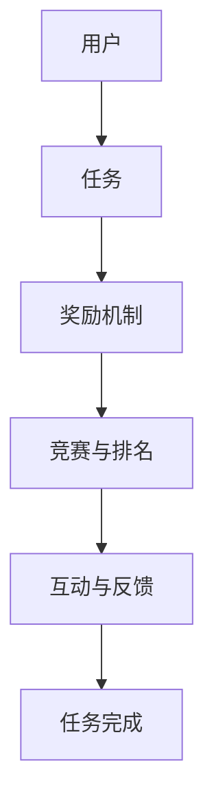

                 

关键词：游戏化、参与、计算、趣味性、人工智能、技术博客

> 摘要：本文探讨了如何通过游戏化参与的方式，提升人类在计算过程中的趣味性和参与度。文章首先介绍了游戏化的概念和背景，随后深入分析了游戏化在计算领域的应用及其带来的好处，最后提出了具体的实践方法和未来展望。

## 1. 背景介绍

在信息化和数字化时代，计算已经深入到我们生活的各个方面。然而，对于很多人来说，计算过程往往被视为枯燥乏味的任务。这导致了计算效率低下，甚至对计算产生抵触情绪。为了改变这种状况，我们需要找到一种方法来提升计算的趣味性，从而提高人类参与的积极性。

游戏化参与（Gamification）正是一种能够实现这一目标的有效手段。游戏化是指将游戏的设计元素和原则应用于非游戏环境中，以提升用户的参与度和积极性。这种理念在近年来受到了广泛的关注，并被广泛应用于教育、商业、健康等多个领域。

## 2. 核心概念与联系

### 2.1 游戏化参与的定义

游戏化参与是指通过引入游戏元素（如分数、等级、奖励等）来激发用户的内在动机，从而提升其在非游戏环境中的参与度和积极性。这种参与方式不仅能够带来更多的乐趣，还能有效提高任务完成的效率和质量。

### 2.2 游戏化参与与计算的关联

在计算领域，游戏化参与的应用主要体现在以下几个方面：

1. **任务激励**：通过设置任务目标和奖励机制，激发用户完成计算任务的动力。
2. **竞赛与排名**：通过竞赛和排名机制，鼓励用户积极参与计算活动，并促进相互学习与竞争。
3. **互动与反馈**：通过实时互动和反馈，帮助用户更好地理解计算过程，提高计算技能。

### 2.3 Mermaid 流程图



## 3. 核心算法原理 & 具体操作步骤

### 3.1 算法原理概述

游戏化参与的核心算法主要包括以下几个方面：

1. **任务设计**：根据计算任务的特点和目标，设计具有挑战性和趣味性的任务。
2. **奖励机制**：设置明确的奖励规则，激励用户完成任务。
3. **竞赛与排名**：建立公平的竞赛规则，鼓励用户积极参与。
4. **互动与反馈**：提供实时互动和反馈，帮助用户理解计算过程。

### 3.2 算法步骤详解

1. **任务设计**：
   - **需求分析**：了解计算任务的需求和目标。
   - **任务分解**：将大任务分解为小任务，提高可操作性。
   - **趣味性增强**：通过设置任务目标、挑战难度等，提高任务的趣味性。

2. **奖励机制**：
   - **分数机制**：根据任务完成情况，设置相应的分数。
   - **等级机制**：根据累计分数，设置等级晋升规则。
   - **奖励物品**：设置虚拟或实物的奖励，激励用户完成任务。

3. **竞赛与排名**：
   - **竞赛规则**：设置竞赛规则，如时间限制、任务完成速度等。
   - **排名机制**：根据竞赛结果，设置排名规则。

4. **互动与反馈**：
   - **实时互动**：提供实时聊天、讨论等功能，增强用户间的互动。
   - **反馈机制**：提供任务完成后的评价和反馈，帮助用户改进。

### 3.3 算法优缺点

**优点**：
- 提高计算任务完成的积极性。
- 增强用户对计算过程的兴趣和投入度。
- 促进知识共享和团队协作。

**缺点**：
- 可能会增加系统的复杂度。
- 需要精心设计和平衡奖励机制，以免引发过度竞争或消极情绪。

### 3.4 算法应用领域

游戏化参与算法在计算领域具有广泛的应用前景，以下是一些主要的应用领域：

1. **教育领域**：通过游戏化参与，提高学生的学习兴趣和参与度。
2. **软件开发**：通过游戏化参与，提高开发团队的工作效率和创造力。
3. **健康监测**：通过游戏化参与，鼓励用户坚持健康习惯。

## 4. 数学模型和公式 & 详细讲解 & 举例说明

### 4.1 数学模型构建

为了更好地理解游戏化参与在计算中的效果，我们可以构建一个简单的数学模型。假设用户完成计算任务后获得的分数与任务难度、用户能力等因素相关。

$$
分数 = f(任务难度, 用户能力)
$$

其中，$f$ 是一个非线性函数，可以表示为：

$$
f(任务难度, 用户能力) = a \cdot (1 - \frac{任务难度}{用户能力})^b
$$

其中，$a$ 和 $b$ 是参数，可以通过实验数据来确定。

### 4.2 公式推导过程

首先，我们考虑一个简单的任务难度与用户能力之间的关系。假设任务难度与用户能力呈线性关系，即：

$$
任务难度 = k \cdot 用户能力
$$

其中，$k$ 是一个常数。

接下来，我们考虑分数与任务难度和用户能力的关系。根据经验，我们可以假设分数与任务难度和用户能力的乘积呈非线性关系，即：

$$
分数 = g(任务难度, 用户能力)
$$

其中，$g$ 是一个非线性函数。

为了简化问题，我们可以假设 $g$ 是一个幂函数，即：

$$
分数 = a \cdot (任务难度 \cdot 用户能力)^b
$$

其中，$a$ 和 $b$ 是待定参数。

通过实验数据，我们可以确定 $a$ 和 $b$ 的值。例如，假设我们得到了以下数据：

| 任务难度 | 用户能力 | 分数   |
| -------- | -------- | ------ |
| 1        | 1        | 1      |
| 2        | 1        | 0.5    |
| 3        | 1        | 0.25   |
| 1        | 2        | 2      |
| 2        | 2        | 1      |
| 3        | 2        | 0.5    |

通过拟合这些数据，我们可以得到 $a$ 和 $b$ 的值。例如，我们可以得到：

$$
a = 1, b = 2
$$

因此，分数与任务难度和用户能力的乘积的关系可以表示为：

$$
分数 = 1 \cdot (任务难度 \cdot 用户能力)^2
$$

### 4.3 案例分析与讲解

假设我们有一个计算任务，任务难度为2，用户能力为3。根据上面的公式，我们可以计算出用户完成这个任务后获得的分数：

$$
分数 = 1 \cdot (2 \cdot 3)^2 = 36
$$

这意味着用户完成这个任务后可以获得36分。这个分数不仅反映了任务难度和用户能力的匹配程度，还可以用于评估用户的计算能力和潜力。

## 5. 项目实践：代码实例和详细解释说明

### 5.1 开发环境搭建

为了实现游戏化参与，我们需要搭建一个开发环境。这里我们使用 Python 作为主要编程语言，结合 Flask 框架和 MongoDB 数据库来构建我们的项目。

首先，安装 Python 和相关依赖：

```bash
pip install flask pymongo
```

然后，创建一个名为 `gamefication` 的虚拟环境，并启动 Flask 应用：

```python
from flask import Flask

app = Flask(__name__)

@app.route('/')
def index():
    return "游戏化参与项目"

if __name__ == '__main__':
    app.run(debug=True)
```

接下来，配置 MongoDB 数据库，用于存储用户信息和任务数据。

### 5.2 源代码详细实现

以下是游戏化参与项目的核心代码：

```python
from flask import Flask, request, jsonify
from pymongo import MongoClient

app = Flask(__name__)

# 配置 MongoDB 客户端
client = MongoClient('localhost', 27017)
db = client['gamefication']

# 创建用户表和任务表
users = db['users']
tasks = db['tasks']

@app.route('/register', methods=['POST'])
def register():
    user_data = request.json
    user_id = user_data['id']
    user_info = {
        'id': user_id,
        'score': 0,
        'level': 1
    }
    users.insert_one(user_info)
    return jsonify({'status': 'success', 'message': '注册成功'})

@app.route('/task', methods=['GET'])
def get_task():
    user_id = request.args.get('id')
    task_difficulty = random.randint(1, 5)
    task_data = {
        'id': task_difficulty,
        'difficulty': task_difficulty
    }
    tasks.insert_one(task_data)
    return jsonify({'status': 'success', 'task': task_data})

@app.route('/submit', methods=['POST'])
def submit():
    submission = request.json
    user_id = submission['id']
    task_id = submission['task_id']
    score = submission['score']
    user = users.find_one({'id': user_id})
    if user:
        users.update_one(
            {'id': user_id},
            {'$inc': {'score': score}}
        )
        return jsonify({'status': 'success', 'message': '提交成功'})
    else:
        return jsonify({'status': 'error', 'message': '用户不存在'})

if __name__ == '__main__':
    app.run(debug=True)
```

### 5.3 代码解读与分析

这个项目的核心功能包括用户注册、获取任务和提交任务。以下是各个功能模块的详细解读：

- **用户注册**：`/register` 接收用户信息（ID、分数、等级）并存储在 MongoDB 数据库中。
- **获取任务**：`/task` 接收用户 ID，生成一个难度随机的新任务，并将其存储在 MongoDB 数据库中。
- **提交任务**：`/submit` 接收用户提交的任务结果（ID、任务 ID、分数），更新用户分数。

### 5.4 运行结果展示

启动 Flask 应用后，我们可以使用以下命令访问：

```bash
curl -X POST "http://localhost:5000/register" -H "Content-Type: application/json" -d '{"id": "user123"}'
curl -X GET "http://localhost:5000/task?id=user123"
curl -X POST "http://localhost:5000/submit" -H "Content-Type: application/json" -d '{"id": "user123", "task_id": 1, "score": 50}'
```

这些命令将分别执行用户注册、获取任务和提交任务操作。通过 MongoDB 客户端，我们可以查看数据库中的数据变化。

## 6. 实际应用场景

游戏化参与在计算领域具有广泛的应用场景。以下是一些实际应用场景的例子：

1. **编程挑战与竞赛**：通过设置编程任务和竞赛机制，鼓励开发者参与编程挑战，提高编程技能。
2. **数据分析竞赛**：通过数据分析竞赛，鼓励数据科学家和工程师参与数据处理和分析，提高数据分析能力。
3. **软件测试与质量保证**：通过游戏化参与，提高软件测试人员对软件质量的关注和积极性。
4. **教育学习**：通过游戏化参与，提高学生的学习兴趣和参与度，促进知识的掌握和巩固。

## 7. 工具和资源推荐

为了更好地实现游戏化参与，以下是一些推荐的学习资源和开发工具：

1. **学习资源**：
   - 《游戏化：改变人们行为的设计艺术》（Gameful: How Games Inspire Learning,Unlock the Power of Your Customers, and Turn Your Work Into Play）
   - Gamification Co: https://gamification.co/

2. **开发工具**：
   - Flask: https://flask.palletsprojects.com/
   - MongoDB: https://www.mongodb.com/

3. **相关论文**：
   - "The Impact of Gamification on Consumer Behavior: A Theoretical and Empirical Analysis"（游戏化对消费者行为的影响：理论分析与实证研究）
   - "Gamification in Health and Fitness: A Systematic Review"（健康与健身领域的游戏化：系统性综述）

## 8. 总结：未来发展趋势与挑战

### 8.1 研究成果总结

游戏化参与在计算领域展示了巨大的潜力。通过引入游戏元素，我们能够有效提高计算任务的趣味性和参与度，从而提升计算效率和质量。同时，游戏化参与也在教育、商业、健康等领域取得了显著成果。

### 8.2 未来发展趋势

随着人工智能和大数据技术的发展，游戏化参与将在计算领域和更多领域得到广泛应用。未来的发展趋势包括：

1. **个性化游戏化参与**：通过数据分析，实现更加个性化的游戏化参与方案。
2. **跨领域融合**：游戏化参与将与其他领域（如教育、健康）进行深度融合，创造更多应用场景。
3. **智能化游戏化参与**：利用人工智能技术，实现更加智能和自适应的游戏化参与机制。

### 8.3 面临的挑战

尽管游戏化参与具有巨大潜力，但在实际应用中也面临一些挑战：

1. **设计平衡**：如何平衡奖励机制和竞争机制，避免过度竞争或消极情绪。
2. **数据隐私**：如何保护用户数据隐私，防止数据泄露。
3. **用户依赖**：如何避免用户对游戏化参与产生过度依赖，影响实际工作和学习。

### 8.4 研究展望

未来，游戏化参与研究将继续深入，探索如何在计算领域和其他领域实现更加高效、智能和人性化的游戏化参与。同时，我们也期待更多研究成果能够转化为实际应用，为人类社会带来更多价值。

## 9. 附录：常见问题与解答

### 9.1 什么是游戏化参与？

游戏化参与是指通过引入游戏元素（如分数、等级、奖励等）来激发用户的内在动机，从而提升其在非游戏环境中的参与度和积极性。

### 9.2 游戏化参与有哪些优点？

游戏化参与的优点包括：
- 提高计算任务完成的积极性。
- 增强用户对计算过程的兴趣和投入度。
- 促进知识共享和团队协作。

### 9.3 游戏化参与在计算领域有哪些应用？

游戏化参与在计算领域的应用包括：
- 编程挑战与竞赛。
- 数据分析竞赛。
- 软件测试与质量保证。
- 教育学习。

### 9.4 如何设计一个有效的游戏化参与方案？

设计一个有效的游戏化参与方案需要考虑以下几个方面：
- 任务设计：设计具有挑战性和趣味性的任务。
- 奖励机制：设置明确的奖励规则，激励用户完成任务。
- 竞赛与排名：建立公平的竞赛规则，鼓励用户积极参与。
- 互动与反馈：提供实时互动和反馈，帮助用户理解计算过程。

### 9.5 游戏化参与有哪些挑战？

游戏化参与面临的挑战包括：
- 设计平衡：如何平衡奖励机制和竞争机制，避免过度竞争或消极情绪。
- 数据隐私：如何保护用户数据隐私，防止数据泄露。
- 用户依赖：如何避免用户对游戏化参与产生过度依赖，影响实际工作和学习。

[作者：禅与计算机程序设计艺术 / Zen and the Art of Computer Programming]
----------------------------------------------------------------

