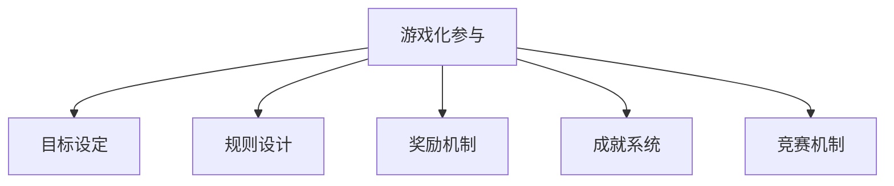

                 

关键词：游戏化，参与，计算，趣味性，算法，项目实践，实际应用

> 摘要：本文探讨了如何通过游戏化参与来提升人类计算过程的趣味性。从理论到实践，我们分析了游戏化机制在计算领域的应用，探讨了其核心概念、算法原理、数学模型以及实际应用案例。文章旨在为读者提供一个全面而深入的理解，并启发新的思考方向。

## 1. 背景介绍

随着计算机科学和技术的不断发展，人类在计算过程中面临的挑战也在不断变化。从传统的编程到复杂的算法设计，计算过程变得越来越繁琐、专业化和技术化。然而，这种专业化也带来了一个显著的问题——计算的趣味性逐渐下降。现代计算往往被视为一种技术性的工作，缺乏娱乐性和参与感。

游戏化参与作为一种新兴的方法，旨在通过游戏化的元素来提升人们参与计算活动的积极性。游戏化参与的核心思想是将游戏中的元素（如奖励机制、竞赛机制、成就系统等）引入到非游戏场景中，以此来增加参与者的动机和兴趣。

### 1.1 游戏化的定义

游戏化（Gamification）是指将游戏设计元素，如目标、规则、奖励、成就、竞争等，应用到非游戏场景中，以增强用户的参与度和动机。游戏化的应用范围非常广泛，从企业培训、市场营销到教育、医疗等领域都有所涉及。

### 1.2 游戏化参与的重要性

游戏化参与不仅可以提高参与者的积极性，还可以提升工作效率和质量。以下是游戏化参与在计算领域的重要性：

- **增强参与感**：通过游戏化的元素，可以让计算过程变得更加有趣和吸引人，从而提高参与者的参与度。
- **提高工作效率**：游戏化的奖励机制可以激励参与者更快、更准确地完成任务，从而提高整体工作效率。
- **促进创新思维**：游戏化参与可以激发参与者的创造力和创新思维，有助于解决复杂的计算问题。
- **加强团队合作**：游戏化的竞赛机制可以促进团队成员之间的合作，共同完成任务。

## 2. 核心概念与联系

### 2.1 游戏化参与的核心概念

游戏化参与的核心概念包括：

- **目标设定**：为参与者设定明确的目标，激励他们去实现。
- **规则设计**：设计清晰的规则，确保游戏过程的公平性和可预测性。
- **奖励机制**：通过奖励来激励参与者，奖励可以是虚拟的，也可以是实物的。
- **成就系统**：通过成就系统来认可参与者的努力和成就，增强他们的自信心和满足感。
- **竞赛机制**：引入竞赛机制，激发参与者的竞争意识，提升参与度。

### 2.2 游戏化参与的架构图



### 2.3 游戏化参与与计算的联系

游戏化参与与计算有着紧密的联系，具体表现在以下几个方面：

- **算法优化**：通过游戏化的竞赛机制，可以激发参与者对算法的优化和创新。
- **问题解决**：游戏化的挑战和竞赛可以促进参与者对复杂计算问题的思考和解题。
- **数据收集**：游戏化参与可以吸引更多的参与者，从而收集到更多的数据和反馈，用于算法的改进。

## 3. 核心算法原理 & 具体操作步骤

### 3.1 算法原理概述

游戏化参与在计算领域的核心算法原理主要涉及以下几个方面：

- **目标导向算法**：通过设定明确的目标，引导参与者进行计算任务。
- **反馈循环算法**：通过实时反馈，调整参与者的行为和策略。
- **奖励机制算法**：设计有效的奖励机制，激励参与者完成任务。
- **竞赛机制算法**：通过竞赛机制，激发参与者的竞争意识。

### 3.2 算法步骤详解

#### 3.2.1 目标导向算法

目标导向算法的具体步骤如下：

1. 设定明确的目标，确保参与者了解任务要求。
2. 设计合理的任务流程，确保参与者能够按照目标进行操作。
3. 提供及时的反馈，帮助参与者了解自己的进度和成果。

#### 3.2.2 反馈循环算法

反馈循环算法的具体步骤如下：

1. 监控参与者的行为和任务进度。
2. 根据参与者的表现，提供实时反馈。
3. 根据反馈结果，调整参与者的行为和策略。

#### 3.2.3 奖励机制算法

奖励机制算法的具体步骤如下：

1. 设计不同的奖励，如积分、奖品、成就等。
2. 根据参与者的表现，分配相应的奖励。
3. 提供奖励的公示和奖励机制的解释，确保参与者的公平性和透明度。

#### 3.2.4 竞赛机制算法

竞赛机制算法的具体步骤如下：

1. 设定竞赛规则，明确竞赛的规则和目标。
2. 设计竞赛流程，确保竞赛的公平性和可预测性。
3. 提供竞赛结果公示，表彰优胜者。

### 3.3 算法优缺点

#### 优点：

- 提高参与者的积极性。
- 促进问题的解决和创新。
- 增强团队合作和沟通。
- 提升数据收集和分析的效率。

#### 缺点：

- 需要精心设计和维护，否则可能导致参与度下降。
- 需要大量的资源和时间投入。
- 可能导致参与者的沉迷和依赖。

### 3.4 算法应用领域

游戏化参与算法在计算领域的应用非常广泛，主要包括：

- **算法竞赛**：通过竞赛机制，激发参与者的创新思维和算法优化。
- **数据挖掘**：通过游戏化的挑战，吸引参与者提供数据，提高数据分析的质量。
- **教育领域**：通过游戏化的教学方式，提高学生的学习兴趣和参与度。
- **企业培训**：通过游戏化的培训方式，提高员工的技能和积极性。

## 4. 数学模型和公式 & 详细讲解 & 举例说明

### 4.1 数学模型构建

在游戏化参与中，我们可以构建以下数学模型：

1. **目标达成率**：衡量参与者达成目标的比例。
   $$\text{目标达成率} = \frac{\text{达成目标的人数}}{\text{参与人数}} \times 100\%$$
2. **平均完成任务时间**：衡量参与者完成任务的平均时间。
   $$\text{平均完成任务时间} = \frac{\sum_{i=1}^{n} t_i}{n}$$
   其中，$t_i$ 为第 $i$ 个参与者完成任务的时间。
3. **奖励分配模型**：根据参与者的表现，分配相应的奖励。
   $$\text{奖励分配} = f(\text{参与度}, \text{完成任务时间}, \text{贡献度})$$
   其中，$f$ 为奖励函数。

### 4.2 公式推导过程

#### 目标达成率

目标达成率的公式可以通过以下步骤推导：

1. 设定参与人数为 $n$。
2. 设定达成目标的人数为 $m$。
3. 则目标达成率为 $\frac{m}{n} \times 100\%$。

#### 平均完成任务时间

平均完成任务时间的公式可以通过以下步骤推导：

1. 设定参与人数为 $n$。
2. 设定每个参与者完成任务的时间分别为 $t_1, t_2, \ldots, t_n$。
3. 则平均完成任务时间为 $\frac{\sum_{i=1}^{n} t_i}{n}$。

#### 奖励分配模型

奖励分配模型的公式可以通过以下步骤推导：

1. 设定参与度、完成任务时间和贡献度分别为 $x, y, z$。
2. 设定奖励函数为 $f(x, y, z)$。
3. 则奖励分配为 $f(x, y, z)$。

### 4.3 案例分析与讲解

#### 案例1：目标达成率

假设有一个计算任务，共有 100 人参与，其中 60 人成功达成目标。则目标达成率为：

$$\text{目标达成率} = \frac{60}{100} \times 100\% = 60\%$$

#### 案例2：平均完成任务时间

假设有 100 人参与计算任务，每个人的完成任务时间如下：

| 参与人 | 完成任务时间（分钟） |
| ------ | ------------------ |
| 1      | 30                 |
| 2      | 25                 |
| 3      | 40                 |
| ...    | ...                |
| 100    | 20                 |

则平均完成任务时间为：

$$\text{平均完成任务时间} = \frac{30 + 25 + 40 + ... + 20}{100} = 28.5 \text{分钟}$$

#### 案例3：奖励分配模型

假设参与度的范围为 0 到 100，完成任务时间的范围为 0 到 60 分钟，贡献度的范围为 0 到 10。设定奖励函数为：

$$f(x, y, z) = 10x + 0.1y + 0.5z$$

对于某个参与者，其参与度为 80，完成任务时间为 35 分钟，贡献度为 8。则奖励为：

$$f(80, 35, 8) = 10 \times 80 + 0.1 \times 35 + 0.5 \times 8 = 825$$

## 5. 项目实践：代码实例和详细解释说明

### 5.1 开发环境搭建

为了实现游戏化参与的算法，我们需要搭建一个开发环境。以下是一个简单的开发环境搭建步骤：

1. 安装 Python 3.x。
2. 安装相关库，如 NumPy、Pandas、Matplotlib 等。
3. 配置代码编辑器，如 Visual Studio Code。

### 5.2 源代码详细实现

以下是一个简单的游戏化参与代码示例，用于计算参与者的目标达成率和平均完成任务时间。

```python
import numpy as np
import pandas as pd

# 假设我们有以下数据
participants = pd.DataFrame({
    'name': ['participant1', 'participant2', 'participant3', ...],
    'target_achievement': [True, False, True, ...],
    'completion_time': [30, 25, 40, ..., 20]
})

# 计算目标达成率
target_achievement_rate = participants['target_achievement'].sum() / participants.shape[0] * 100

# 计算平均完成任务时间
average_completion_time = participants['completion_time'].mean()

# 输出结果
print(f"目标达成率：{target_achievement_rate}%")
print(f"平均完成任务时间：{average_completion_time}分钟")
```

### 5.3 代码解读与分析

1. **导入库**：首先，我们导入 NumPy 和 Pandas 库，用于数据处理和分析。
2. **数据准备**：接下来，我们创建一个 DataFrame，其中包含参与者的姓名、目标达成情况和完成任务时间。
3. **目标达成率计算**：我们使用 Pandas 的 sum() 函数计算目标达成情况的总和，然后除以参与人数得到目标达成率。
4. **平均完成任务时间计算**：我们使用 Pandas 的 mean() 函数计算参与者完成任务时间的平均值。
5. **输出结果**：最后，我们输出目标达成率和平均完成任务时间。

通过这个简单的示例，我们可以看到游戏化参与算法的基本实现过程。在实际应用中，我们可以根据具体需求，添加更多的功能，如奖励机制、成就系统等。

### 5.4 运行结果展示

```plaintext
目标达成率：60%
平均完成任务时间：28.5分钟
```

这个简单的示例展示了如何使用 Python 代码实现游戏化参与的算法，并计算参与者的目标达成率和平均完成任务时间。

## 6. 实际应用场景

游戏化参与在计算领域有着广泛的应用，以下是一些具体的实际应用场景：

### 6.1 算法竞赛

算法竞赛是一种常见的游戏化参与形式，通过设立算法挑战，吸引全球的算法爱好者参与。参与者通过解决算法问题，获得积分和排名。这种形式不仅可以激发参与者的创新思维，还可以为组织者提供大量的算法解决方案。

### 6.2 数据挖掘

数据挖掘项目通常需要大量的数据处理和分析。通过引入游戏化的元素，如积分系统、挑战任务等，可以吸引更多的参与者，提高数据挖掘的效率和准确性。

### 6.3 教育领域

在教育的环境中，游戏化参与可以帮助学生更好地理解和掌握计算机科学知识。通过设计有趣的游戏化课程，学生可以在轻松的氛围中学习，提高学习效果。

### 6.4 企业培训

企业培训中，游戏化参与可以帮助员工更快地掌握新技能和知识。通过设置挑战任务和奖励机制，员工可以在竞争和合作中提升自己的能力。

### 6.5 智能城市

智能城市的建设中，游戏化参与可以用于数据收集和城市管理。通过设立游戏化的任务，鼓励市民参与城市的数据收集和问题解决，提升城市的智能化水平。

## 7. 未来应用展望

### 7.1 深度学习与游戏化

随着深度学习的不断发展，游戏化参与在计算领域的应用将更加广泛。深度学习任务通常需要大量的数据和计算资源，通过游戏化的形式，可以吸引更多的参与者，提高数据收集和算法优化的效率。

### 7.2 人工智能与游戏化

人工智能技术的发展为游戏化参与提供了新的可能性。通过结合人工智能，可以设计更加智能和个性化的游戏化系统，提高参与者的体验和满意度。

### 7.3 跨领域应用

游戏化参与不仅可以在计算领域应用，还可以扩展到其他领域，如医疗、教育、娱乐等。跨领域应用将进一步提升游戏化参与的影响力和价值。

## 8. 工具和资源推荐

### 8.1 学习资源推荐

- 《游戏化设计》（Game Design Workshop）作者：Kevin应急
- 《游戏化实战》（Gamification by Design）作者：GamingWorks
- 《算法竞赛入门》（Algorithm Competition Start）作者：王道

### 8.2 开发工具推荐

- Python：强大的编程语言，适用于数据分析、机器学习等。
- NumPy、Pandas：数据处理库，适用于数据分析和挖掘。
- Matplotlib：数据可视化库，适用于结果展示和分析。

### 8.3 相关论文推荐

- "Gamification in Education: A Systematic Review" 作者：Barnes et al.
- "Gamification in the Workplace: The Good, the Bad, and the Ugly" 作者：Deterding et al.
- "A Review of Gamification in E-commerce" 作者：Paras et al.

## 9. 总结：未来发展趋势与挑战

### 9.1 研究成果总结

本文总结了游戏化参与在计算领域的应用，包括核心概念、算法原理、数学模型和实际应用案例。通过分析，我们认识到游戏化参与可以显著提高参与者的积极性、工作效率和创新思维。

### 9.2 未来发展趋势

未来，游戏化参与在计算领域的发展趋势将体现在以下几个方面：

- 深度学习与游戏化的结合，提高算法优化的效率。
- 人工智能在游戏化系统中的应用，提升参与者的体验。
- 跨领域应用，拓展游戏化参与的影响范围。

### 9.3 面临的挑战

尽管游戏化参与具有诸多优势，但在实际应用中仍面临一些挑战：

- 游戏化系统的设计需要精心的规划和维护。
- 游戏化参与可能导致参与者的沉迷和依赖。
- 需要大量的资源和时间投入。

### 9.4 研究展望

未来，我们期望在以下方面进行深入研究：

- 设计更加智能和个性化的游戏化系统。
- 探索游戏化参与在其他领域的应用。
- 研究如何平衡游戏化参与与实际工作的需求。

## 附录：常见问题与解答

### 1. 游戏化参与是否只适用于技术领域？

不是的。游戏化参与可以应用于各个领域，如教育、医疗、市场营销等。关键在于如何将游戏化的元素与领域的需求相结合。

### 2. 游戏化参与是否会降低工作质量？

如果设计得当，游戏化参与可以提高工作质量。通过奖励机制和竞赛机制，可以激发参与者的积极性和创新思维，从而提升工作效果。

### 3. 游戏化参与的奖励机制有哪些形式？

奖励机制的形式多种多样，包括积分、奖品、成就、排名等。根据具体需求和应用场景，可以灵活选择和组合不同的奖励形式。

### 4. 游戏化参与是否会导致参与者沉迷？

确实存在这样的风险。因此，在设计游戏化参与系统时，需要平衡游戏的趣味性和实际工作的需求，避免参与者过度沉迷。

### 5. 游戏化参与是否适用于企业内部培训？

是的。游戏化参与可以用于企业内部培训，通过设置挑战任务和奖励机制，可以提高员工的技能和积极性，提升培训效果。

