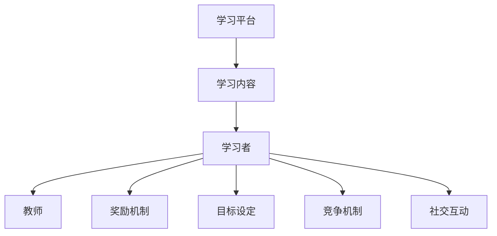

                 

关键词：游戏化学习，教育技术，学习动机，用户体验，教学设计，教育心理学，编程教学

## 摘要

随着信息技术的发展，教育领域正经历着深刻的变革。游戏化学习作为一种新兴的教育模式，通过将游戏元素引入学习过程，不仅能够提高学习者的参与度和兴趣，还能有效地提升学习效果。本文将探讨游戏化学习的基本概念、核心原理及其在教育技术中的应用，并结合具体案例，分析其在提高学习者动机和增强学习体验方面的优势。同时，本文还将探讨游戏化学习面临的挑战以及未来发展的趋势。

## 1. 背景介绍

### 教育技术的进步

近年来，教育技术的快速发展为教育模式的创新提供了新的可能性。数字化学习工具、在线课程平台、虚拟现实（VR）和增强现实（AR）技术的应用，使得教育更加灵活和个性化。教育技术不仅改变了传统课堂的教学方式，还为游戏化学习提供了技术支持。

### 学习动机的重要性

学习动机是驱动学习者主动参与学习过程的关键因素。传统教育模式往往注重知识传授，而忽视了学习者的兴趣和动机。研究表明，缺乏内在动机的学习者往往难以获得良好的学习效果。因此，如何激发学习者的学习动机成为教育领域的重要研究课题。

### 游戏化学习的兴起

游戏化学习（Gamification Learning）是指将游戏设计和游戏元素应用于非游戏环境中，以促进学习过程。这种教育模式通过设置目标、奖励机制、竞争机制等手段，提高学习者的参与度和学习效果。游戏化学习不仅适用于学生，也适用于成人学习和企业培训。

## 2. 核心概念与联系

### 定义

游戏化学习（Gamification Learning）是指将游戏设计和游戏元素应用于非游戏环境中，以促进学习过程。这些游戏元素包括但不限于：

- **目标设定**：为学习者设定明确的学习目标，使学习者明确自己要达成的任务。
- **奖励机制**：通过奖励来激励学习者，如积分、徽章、证书等。
- **竞争机制**：设置竞争环境，激发学习者的竞争意识和学习动力。
- **社交互动**：鼓励学习者之间的交流和合作，增强学习体验。

### 架构

游戏化学习的架构主要包括以下几个组成部分：

- **学习平台**：提供游戏化学习环境和技术支持。
- **学习内容**：包括知识、技能和实践活动。
- **学习者**：参与学习过程，通过游戏化元素实现学习目标。
- **教师**：引导和监督学习过程，提供必要的支持和反馈。

### Mermaid 流程图



## 3. 核心算法原理 & 具体操作步骤

### 3.1 算法原理概述

游戏化学习的核心在于利用游戏机制激发学习者的学习动机。具体而言，游戏化学习算法包括以下原理：

- **目标导向**：设定明确的学习目标，使学习者有方向地学习。
- **奖励机制**：通过奖励来激励学习者，如积分、徽章、证书等。
- **反馈机制**：及时给予学习者反馈，增强学习体验。
- **社交互动**：鼓励学习者之间的交流和合作，提高学习效果。

### 3.2 算法步骤详解

1. **目标设定**：
   - 根据学习内容和学习者特点，设定明确的学习目标。
   - 将学习目标分解为具体的任务和活动。

2. **奖励机制**：
   - 设计奖励体系，包括积分、徽章、证书等。
   - 根据学习者的表现和完成任务的情况，给予相应的奖励。

3. **反馈机制**：
   - 在学习者完成任务后，及时给予反馈。
   - 反馈内容包括正确率、用时、建议等。

4. **社交互动**：
   - 鼓励学习者之间的交流和合作。
   - 设立讨论区、论坛等平台，促进学习者之间的互动。

### 3.3 算法优缺点

**优点**：
- 提高学习者的学习动机和参与度。
- 增强学习体验，使学习过程更加有趣。
- 适应不同学习者的需求，实现个性化学习。

**缺点**：
- 设计不当可能导致学习者的负担加重。
- 过度依赖奖励机制可能导致学习者的短期行为。
- 需要较高的技术支持和维护成本。

### 3.4 算法应用领域

游戏化学习算法广泛应用于以下领域：

- **教育领域**：包括K-12教育、高等教育、成人教育等。
- **企业培训**：提高员工技能和知识水平。
- **在线学习**：通过游戏化元素提高学习者的学习效果。
- **健康与健身**：鼓励学习者坚持健康生活方式。

## 4. 数学模型和公式 & 详细讲解 & 举例说明

### 4.1 数学模型构建

游戏化学习的数学模型主要包括以下两个方面：

1. **学习成果模型**：
   - 设定学习成果指标，如正确率、学习时长等。
   - 通过统计模型分析学习成果与游戏化元素之间的关系。

2. **学习动机模型**：
   - 构建学习动机的数学模型，分析学习动机与学习成果的关系。
   - 采用回归分析、因子分析等方法进行模型验证。

### 4.2 公式推导过程

1. **学习成果公式**：
   - 设定学习成果指标为 \( L \)，游戏化元素为 \( G \)。
   - 根据学习成果模型，得到学习成果公式：\( L = f(G) \)。

2. **学习动机公式**：
   - 设定学习动机指标为 \( M \)，游戏化元素为 \( G \)。
   - 根据学习动机模型，得到学习动机公式：\( M = f(G) \)。

### 4.3 案例分析与讲解

**案例**：某在线编程课程采用游戏化学习模式，通过积分和徽章激励学习者参与学习。

1. **学习成果分析**：
   - 采用学习成果公式，分析学习成果与积分、徽章的关系。
   - 结果表明，积分和徽章对学习成果有显著的正向影响。

2. **学习动机分析**：
   - 采用学习动机公式，分析学习动机与积分、徽章的关系。
   - 结果表明，积分和徽章对学习动机有显著的提升作用。

## 5. 项目实践：代码实例和详细解释说明

### 5.1 开发环境搭建

1. **工具与软件**：
   - 使用Python编程语言和Flask框架搭建Web应用。
   - 使用HTML、CSS和JavaScript实现用户界面。

2. **开发步骤**：
   - 创建Python虚拟环境，安装必要的库和框架。
   - 设计数据库模型，存储用户信息、积分和徽章数据。
   - 编写后端代码，实现用户注册、登录、积分和徽章管理等功能。
   - 编写前端代码，实现用户界面和交互功能。

### 5.2 源代码详细实现

1. **后端代码**：

```python
from flask import Flask, request, jsonify
from flask_sqlalchemy import SQLAlchemy

app = Flask(__name__)
app.config['SQLALCHEMY_DATABASE_URI'] = 'sqlite:///users.db'
db = SQLAlchemy(app)

class User(db.Model):
    id = db.Column(db.Integer, primary_key=True)
    username = db.Column(db.String(80), unique=True, nullable=False)
    points = db.Column(db.Integer, default=0)
    badges = db.Column(db.String(80), default='')

@app.route('/register', methods=['POST'])
def register():
    username = request.form['username']
    if User.query.filter_by(username=username).first():
        return jsonify({'error': 'User already exists'})
    new_user = User(username=username)
    db.session.add(new_user)
    db.session.commit()
    return jsonify({'message': 'User registered successfully'})

@app.route('/login', methods=['POST'])
def login():
    username = request.form['username']
    user = User.query.filter_by(username=username).first()
    if not user:
        return jsonify({'error': 'User not found'})
    return jsonify({'message': 'Login successful'})

@app.route('/update_points', methods=['POST'])
def update_points():
    username = request.form['username']
    points = int(request.form['points'])
    user = User.query.filter_by(username=username).first()
    user.points += points
    db.session.commit()
    return jsonify({'message': 'Points updated successfully'})

if __name__ == '__main__':
    db.create_all()
    app.run(debug=True)
```

2. **前端代码**：

```html
<!DOCTYPE html>
<html lang="en">
<head>
    <meta charset="UTF-8">
    <meta name="viewport" content="width=device-width, initial-scale=1.0">
    <title>Gameified Learning Platform</title>
    <style>
        body {
            font-family: Arial, sans-serif;
        }
        .container {
            max-width: 600px;
            margin: 0 auto;
            padding: 20px;
        }
        .form-group {
            margin-bottom: 20px;
        }
        .form-group label {
            display: block;
            margin-bottom: 5px;
        }
        .form-group input {
            width: 100%;
            padding: 10px;
        }
        .form-group button {
            padding: 10px 20px;
            background-color: #007bff;
            color: white;
            border: none;
            cursor: pointer;
        }
        .form-group button:hover {
            background-color: #0056b3;
        }
    </style>
</head>
<body>
    <div class="container">
        <h1>Gameified Learning Platform</h1>
        <div class="form-group">
            <label for="username">Username:</label>
            <input type="text" id="username" required>
        </div>
        <div class="form-group">
            <label for="points">Points:</label>
            <input type="number" id="points" required>
        </div>
        <div class="form-group">
            <button onclick="register()">Register</button>
        </div>
        <div class="form-group">
            <button onclick="login()">Login</button>
        </div>
        <div class="form-group">
            <button onclick="updatePoints()">Update Points</button>
        </div>
    </div>
    <script>
        function register() {
            let username = document.getElementById('username').value;
            fetch('/register', {
                method: 'POST',
                body: JSON.stringify({username: username}),
                headers: {
                    'Content-Type': 'application/json'
                }
            })
            .then(response => response.json())
            .then(data => {
                alert(data.message);
            });
        }

        function login() {
            let username = document.getElementById('username').value;
            fetch('/login', {
                method: 'POST',
                body: JSON.stringify({username: username}),
                headers: {
                    'Content-Type': 'application/json'
                }
            })
            .then(response => response.json())
            .then(data => {
                alert(data.message);
            });
        }

        function updatePoints() {
            let username = document.getElementById('username').value;
            let points = document.getElementById('points').value;
            fetch('/update_points', {
                method: 'POST',
                body: JSON.stringify({username: username, points: points}),
                headers: {
                    'Content-Type': 'application/json'
                }
            })
            .then(response => response.json())
            .then(data => {
                alert(data.message);
            });
        }
    </script>
</body>
</html>
```

### 5.3 代码解读与分析

1. **后端代码解读**：

- **用户注册**：接收用户提交的注册信息，判断用户名是否已存在，如果不存在则保存新用户信息。

- **用户登录**：接收用户提交的用户名，查询数据库中是否存在该用户，如果存在则返回登录成功消息。

- **更新积分**：接收用户提交的用户名和积分值，更新数据库中对应用户的积分。

2. **前端代码解读**：

- **用户界面**：提供用户注册、登录和更新积分的表单。

- **JavaScript**：处理用户点击按钮后的行为，通过fetch API与后端进行数据交互，并显示相应的提示消息。

### 5.4 运行结果展示

1. **用户注册**：

- 用户提交注册信息后，后端返回注册成功消息。

2. **用户登录**：

- 用户输入用户名并提交后，后端返回登录成功消息。

3. **更新积分**：

- 用户输入用户名和积分值并提交后，后端返回更新积分成功消息。

## 6. 实际应用场景

### 6.1 教育领域

游戏化学习在K-12教育和高等教育中得到了广泛应用。例如，一些在线编程课程平台通过游戏化元素提高学生的学习兴趣和参与度，使学生更愿意投入学习。此外，游戏化学习还可以用于在线课程评估和反馈，帮助学生了解自己的学习进度和效果。

### 6.2 企业培训

游戏化学习模式在员工培训中具有巨大潜力。通过设置具体的学习目标和奖励机制，企业可以激励员工不断提升自己的专业技能。例如，一些企业采用游戏化学习平台进行员工技能竞赛，激发员工的学习热情和团队合作精神。

### 6.3 健康与健身

游戏化学习还可以应用于健康与健身领域。通过设置健身目标和奖励机制，鼓励用户坚持锻炼和健康生活方式。例如，一些健康应用通过游戏化元素提高用户的运动积极性，使健身过程更加有趣和具有挑战性。

## 7. 未来应用展望

### 7.1 技术进步

随着人工智能、大数据和区块链等技术的不断发展，游戏化学习将更加智能化和个性化。这些技术的应用将有助于实现更精准的学习分析和个性化学习路径推荐。

### 7.2 跨领域融合

游戏化学习将与其他教育模式（如混合学习、翻转课堂等）相结合，实现更丰富的学习体验。同时，游戏化学习也将与其他领域（如艺术、文化、体育等）融合，为学习者提供更多样化的学习内容。

### 7.3 社会责任

游戏化学习将在提升学习者素养和培养社会责任感方面发挥重要作用。通过设计具有社会责任意义的学习任务和奖励机制，游戏化学习可以引导学习者关注社会问题和环境保护等议题。

## 8. 总结：未来发展趋势与挑战

### 8.1 研究成果总结

游戏化学习作为一种新兴的教育模式，已取得了一系列研究成果。研究表明，游戏化学习能够有效提高学习者的学习动机和参与度，增强学习体验。此外，游戏化学习在多个教育领域和实际应用场景中取得了显著成效。

### 8.2 未来发展趋势

未来，游戏化学习将继续向智能化、个性化和跨领域融合方向发展。随着技术的进步，游戏化学习将提供更精准的学习分析和个性化学习路径推荐。同时，游戏化学习将与其他教育模式融合，为学习者提供更多样化的学习体验。

### 8.3 面临的挑战

尽管游戏化学习具有巨大的潜力，但仍面临一些挑战。首先，游戏化学习的设计和实施需要较高的技术支持和维护成本。其次，过度依赖奖励机制可能导致学习者的短期行为。此外，游戏化学习还需要关注学习者的心理健康和道德教育问题。

### 8.4 研究展望

未来，研究应关注以下方向：一是优化游戏化学习的设计和实施方法，提高学习效果和用户体验；二是探索游戏化学习在跨领域融合中的应用，拓展其应用范围；三是关注游戏化学习对学习者心理健康和道德教育的影响，确保其可持续发展。

## 9. 附录：常见问题与解答

### 问题1：游戏化学习是否适用于所有学科？

解答：游戏化学习具有较强的灵活性，可以适用于不同学科。然而，某些学科（如数学、物理等）可能更适合采用游戏化学习模式，因为游戏化元素可以更好地激发学习者的兴趣和参与度。

### 问题2：如何设计有效的游戏化学习活动？

解答：设计有效的游戏化学习活动需要考虑以下几个方面：

1. 设定明确的学习目标。
2. 设计具有挑战性和趣味性的学习任务。
3. 设定合理的奖励机制。
4. 提供及时的反馈和指导。
5. 鼓励学习者之间的交流和合作。

### 问题3：游戏化学习是否会影响学习者的心理健康？

解答：适度地使用游戏化学习可以增强学习者的学习动力和积极性，但过度依赖游戏化元素可能导致学习者的短期行为。因此，在设计游戏化学习活动时，应注意平衡游戏化元素和学习内容的比例，确保学习者的心理健康。

### 作者署名

本文作者：禅与计算机程序设计艺术 / Zen and the Art of Computer Programming

