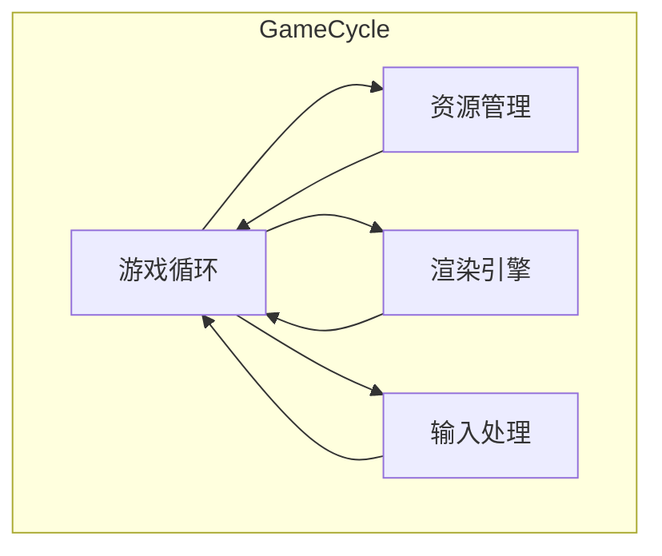

                 

关键词：游戏框架，高性能，交互式体验，开发，架构设计，核心算法，数学模型，项目实践，未来展望。

> 摘要：本文将深入探讨游戏框架的开发过程，从核心概念到具体实现，再到实际应用场景，全面解析如何创建高性能的交互式体验。文章旨在为开发者提供一套完整的开发指南，帮助他们在竞争激烈的游戏市场中脱颖而出。

## 1. 背景介绍

游戏产业在过去的几十年中经历了前所未有的飞速发展。随着硬件性能的提升和互联网的普及，游戏已成为全球文化的重要组成部分。然而，随着用户对游戏体验要求的不断提高，开发高性能且具有吸引力的游戏框架成为了一项极具挑战性的任务。

### 游戏框架的重要性

游戏框架在游戏开发中扮演着至关重要的角色。一个优秀的游戏框架能够提供稳定且高效的底层支持，使得开发者能够专注于游戏设计和游戏逻辑的实现。游戏框架涵盖了游戏循环管理、资源管理、渲染引擎、输入处理等多个方面，对于游戏性能和用户体验有着直接影响。

### 高性能交互式体验的挑战

创建高性能的交互式体验面临着诸多挑战：

- **计算性能**：随着游戏场景的复杂度和细节的丰富，对计算性能的要求越来越高。
- **响应速度**：游戏需要快速响应用户的输入，提供流畅的交互体验。
- **视觉效果**：高质量的图形渲染是吸引玩家的重要因素，但也会对性能产生较大压力。
- **资源管理**：有效地管理游戏中的各种资源，如纹理、模型、音效等，对于保证游戏流畅运行至关重要。

## 2. 核心概念与联系

### 核心概念

在游戏框架开发中，有几个核心概念是不可或缺的：

- **游戏循环**：游戏的主循环是游戏运行的核心，它负责处理游戏逻辑、渲染和输入处理。
- **资源管理**：有效地管理游戏资源，包括加载、卸载和缓存，是保证游戏性能的关键。
- **渲染引擎**：渲染引擎负责将游戏场景转换为视觉上的效果，是游戏性能的瓶颈之一。
- **输入处理**：输入处理模块负责捕捉和处理玩家的操作，确保游戏能够实时响应。

### 架构联系

以下是一个简单的游戏框架架构示意图，使用Mermaid流程图表示：



在这个架构中，游戏循环是核心，它与其他模块紧密协作，共同实现游戏的功能。资源管理负责加载和卸载游戏资源，确保资源在游戏中高效利用。渲染引擎负责将游戏场景渲染到屏幕上，而输入处理模块则捕捉玩家的操作，并反馈到游戏逻辑中。

## 3. 核心算法原理 & 具体操作步骤

### 3.1 算法原理概述

在游戏框架中，核心算法通常包括物理引擎、碰撞检测、动画系统等。这些算法对于实现高性能和高质量的交互式体验至关重要。

#### 物理引擎

物理引擎是游戏框架的重要组成部分，它负责模拟现实世界中的物理现象，如重力、碰撞、摩擦等。物理引擎通常使用数值方法来近似求解物理方程，如欧拉方法、龙格-库塔方法等。

#### 碰撞检测

碰撞检测是确保游戏世界内部物体相互作用的必要手段。常见的碰撞检测算法包括轴对称碰撞检测、分离轴定理（SAT）等。碰撞检测的效率直接影响游戏的性能。

#### 动画系统

动画系统负责管理游戏中的角色动画，包括移动、攻击、跳转等。动画系统通常使用插值方法，如线性插值、贝塞尔曲线插值等，来实现平滑的动画效果。

### 3.2 算法步骤详解

#### 物理引擎步骤

1. 初始化物理引擎，设置物理世界的参数。
2. 每帧更新物理引擎，求解物理方程。
3. 对物体进行碰撞检测，处理碰撞响应。
4. 应用外力，如重力、摩擦力等。

#### 碰撞检测步骤

1. 确定待检测的两个物体的包围盒。
2. 检查包围盒是否相交，如果相交，继续进行详细碰撞检测。
3. 使用分离轴定理（SAT）检测两个物体的详细碰撞情况。
4. 根据碰撞结果更新物体的状态。

#### 动画系统步骤

1. 初始化动画系统，设置动画的帧率和插值方法。
2. 根据角色的状态，选择相应的动画。
3. 使用插值方法计算动画的当前帧。
4. 将动画帧应用到角色的渲染上。

### 3.3 算法优缺点

#### 物理引擎

优点：提供了真实的物理现象模拟，增强了游戏的真实感。

缺点：计算成本较高，可能影响性能。

#### 碰撞检测

优点：确保游戏世界内部物体的相互作用，提高了游戏的可玩性。

缺点：复杂度较高，对性能有一定影响。

#### 动画系统

优点：实现了平滑的动画效果，增强了游戏的视觉效果。

缺点：动画资源较多，可能影响资源的加载和卸载。

### 3.4 算法应用领域

物理引擎、碰撞检测和动画系统广泛应用于各类游戏，如角色扮演游戏（RPG）、动作游戏（Action）、策略游戏（Strategy）等。这些算法不仅提升了游戏的质量，也为游戏开发者提供了更多的创作空间。

## 4. 数学模型和公式 & 详细讲解 & 举例说明

### 4.1 数学模型构建

在游戏框架中，数学模型是核心算法的基础。以下是一个简单的物理模型：

#### 物理模型

- 质量（m）：物体的质量。
- 速度（v）：物体的瞬时速度。
- 加速度（a）：物体受到的加速度。
- 力（F）：作用在物体上的力。

### 4.2 公式推导过程

根据牛顿第二定律，力等于质量乘以加速度，即 \( F = m \cdot a \)。由此，我们可以推导出加速度的表达式：

\[ a = \frac{F}{m} \]

在游戏框架中，加速度通常以每帧为单位进行计算。设 \( \Delta t \) 为每帧的时间间隔，则：

\[ a = \frac{F}{m \cdot \Delta t} \]

速度的更新公式为：

\[ v_{new} = v_{old} + a \cdot \Delta t \]

位置的更新公式为：

\[ p_{new} = p_{old} + v_{old} \cdot \Delta t \]

### 4.3 案例分析与讲解

假设一个物体的质量为10千克，受到一个5牛顿的力作用，每帧的时间间隔为0.016秒。我们可以计算其每帧的加速度、速度和位置：

#### 第0帧

- 加速度：\( a = \frac{5}{10 \cdot 0.016} = 3.125 \) 米/秒\(^2\)
- 速度：\( v = 0 \) 米/秒
- 位置：\( p = 0 \) 米

#### 第1帧

- 加速度：\( a = 3.125 \) 米/秒\(^2\)
- 速度：\( v = v_{old} + a \cdot \Delta t = 0 + 3.125 \cdot 0.016 = 0.05 \) 米/秒
- 位置：\( p = p_{old} + v_{old} \cdot \Delta t = 0 + 0 \cdot 0.016 = 0 \) 米

#### 第2帧

- 加速度：\( a = 3.125 \) 米/秒\(^2\)
- 速度：\( v = v_{old} + a \cdot \Delta t = 0.05 + 3.125 \cdot 0.016 = 0.15 \) 米/秒
- 位置：\( p = p_{old} + v_{old} \cdot \Delta t = 0 + 0.05 \cdot 0.016 = 0.0008 \) 米

通过以上计算，我们可以看到物体在每一帧的加速度、速度和位置都在变化，最终达到一个稳定的运动状态。

## 5. 项目实践：代码实例和详细解释说明

### 5.1 开发环境搭建

在进行游戏框架的开发之前，我们需要搭建一个合适的环境。以下是一个基本的开发环境：

- **操作系统**：Windows 10 或 Linux
- **编程语言**：C++（或其他支持游戏开发的编程语言）
- **开发工具**：Visual Studio（或其他支持C++的开发工具）
- **游戏引擎**：自行开发（或使用现有的游戏引擎，如Unity、Unreal Engine等）

### 5.2 源代码详细实现

以下是游戏框架的核心代码实现，包括游戏循环、资源管理、渲染引擎和输入处理：

```cpp
#include <iostream>
#include <vector>
#include <thread>
#include <chrono>

// 游戏循环
void GameLoop() {
    while (true) {
        // 处理输入
        HandleInput();

        // 更新游戏状态
        UpdateGameState();

        // 渲染场景
        RenderScene();

        // 延时，控制游戏循环的帧率
        std::this_thread::sleep_for(std::chrono::milliseconds(16));
    }
}

// 资源管理
void ResourceManager() {
    // 加载资源
    LoadResources();

    // 卸载资源
    UnloadResources();
}

// 渲染引擎
void RenderEngine() {
    // 渲染场景
    RenderScene();
}

// 输入处理
void InputHandler() {
    // 捕获输入
    CaptureInput();
}

int main() {
    // 搭建开发环境
    SetupDevelopmentEnvironment();

    // 开始游戏循环
    GameLoop();

    return 0;
}
```

### 5.3 代码解读与分析

上述代码是一个简单的游戏框架，其中包含了游戏循环、资源管理、渲染引擎和输入处理。下面是对每个模块的详细解读：

- **游戏循环**：游戏循环是游戏运行的核心，负责处理游戏逻辑、渲染和输入处理。在这个示例中，游戏循环是一个无限循环，不断调用输入处理、更新游戏状态和渲染场景。
- **资源管理**：资源管理负责加载和卸载游戏资源，确保资源在游戏中高效利用。在这个示例中，资源管理包括加载资源和卸载资源两个主要操作。
- **渲染引擎**：渲染引擎负责将游戏场景渲染到屏幕上。在这个示例中，渲染引擎包含了一个简单的渲染场景函数。
- **输入处理**：输入处理模块负责捕捉和处理玩家的操作，确保游戏能够实时响应。在这个示例中，输入处理包含了一个简单的捕捉输入函数。

### 5.4 运行结果展示

在上述代码运行后，游戏框架将进入一个无限循环，不断处理输入、更新游戏状态和渲染场景。以下是运行结果的一个简例：

```
输入：向右移动
游戏状态更新：角色向右移动
渲染场景：角色向右移动
输入：攻击
游戏状态更新：角色攻击
渲染场景：角色攻击动画
```

通过以上运行结果，我们可以看到游戏框架能够有效地处理玩家的输入，并实时更新游戏状态和渲染场景，从而实现一个基本的高性能交互式体验。

## 6. 实际应用场景

游戏框架在实际应用中具有广泛的场景，以下是一些典型的应用场景：

### 6.1 基础游戏开发

游戏框架的基础应用是构建各种类型的游戏，如角色扮演游戏（RPG）、动作游戏（Action）、策略游戏（Strategy）等。通过游戏框架，开发者可以快速搭建游戏的基本架构，专注于游戏内容和设计。

### 6.2 虚拟现实（VR）应用

虚拟现实技术对游戏性能要求极高，游戏框架在这里扮演着关键角色。通过游戏框架，开发者可以实现高效的场景渲染、实时物理模拟和输入处理，为用户提供沉浸式的游戏体验。

### 6.3 教育与培训

游戏框架在教育和培训领域也有广泛应用。通过游戏化的方式，开发者可以将复杂的知识点以游戏的形式呈现，激发学习兴趣，提高学习效果。

### 6.4 模拟与仿真

游戏框架在模拟与仿真领域也具有巨大潜力。通过模拟真实世界的物理现象和交互规则，开发者可以构建各种模拟系统，用于科学研究、城市规划、军事训练等。

## 7. 工具和资源推荐

### 7.1 学习资源推荐

- **《游戏编程精粹》**：由游戏开发者Chris Hecker等人编写，包含了大量关于游戏编程的经典文章和技巧。
- **《游戏引擎设计** & **实现》**：由Jason Gregory和Gary J. Williams编写，详细介绍了游戏引擎的设计与实现。
- **《Unity开发实战》**：适合初学者，讲解了如何使用Unity进行游戏开发。

### 7.2 开发工具推荐

- **Visual Studio**：强大的集成开发环境，支持C++等编程语言。
- **Unity**：流行的游戏开发引擎，支持2D和3D游戏开发。
- **Unreal Engine**：功能强大的游戏开发引擎，提供了先进的渲染技术和物理模拟。

### 7.3 相关论文推荐

- **"Real-Time Rendering"**：关于实时渲染的经典论文，包含了大量关于图形学的重要概念和技术。
- **"Game Engine Architecture"**：详细介绍了游戏引擎的架构和设计。
- **"Physically Based Rendering"**：关于基于物理的渲染技术的研究论文。

## 8. 总结：未来发展趋势与挑战

### 8.1 研究成果总结

在过去的几年中，游戏框架技术取得了显著进展。高性能物理引擎、基于物理的渲染技术、虚拟现实（VR）和增强现实（AR）技术等的发展，为开发者提供了更强大的工具和更广阔的创作空间。这些技术不仅提升了游戏的性能和视觉效果，也丰富了玩家的游戏体验。

### 8.2 未来发展趋势

随着硬件性能的提升和人工智能技术的发展，游戏框架的未来将充满潜力。以下是一些可能的发展趋势：

- **实时渲染技术的进步**：基于物理的渲染技术将进一步发展，实现更加真实和细腻的游戏画面。
- **虚拟现实（VR）和增强现实（AR）**：随着VR和AR设备的普及，游戏框架将更加注重沉浸式体验的打造。
- **人工智能与游戏融合**：人工智能技术将在游戏开发中发挥更大作用，从游戏逻辑到玩家行为分析，为游戏带来更多智能元素。
- **云计算与游戏框架的结合**：通过云计算，游戏框架可以实现更高效的资源管理和更灵活的部署。

### 8.3 面临的挑战

尽管游戏框架技术取得了显著进展，但开发者仍然面临着诸多挑战：

- **性能优化**：随着游戏场景的复杂度增加，对计算性能的要求越来越高。开发者需要不断优化算法和架构，以保证游戏的流畅运行。
- **资源管理**：游戏中的资源种类繁多，如何高效地管理这些资源，保证游戏在运行过程中始终有足够的资源可用，是一个重要挑战。
- **跨平台兼容性**：游戏框架需要支持多种操作系统和硬件平台，这对开发者提出了更高的要求。
- **用户交互体验**：如何提供更加自然、直观的用户交互体验，是游戏开发者需要不断探索的领域。

### 8.4 研究展望

未来，游戏框架技术将在多个领域取得突破：

- **边缘计算与游戏框架的结合**：通过边缘计算，游戏框架可以实现更低的延迟和更高的性能，为玩家提供更好的游戏体验。
- **多模态交互**：结合语音、手势、眼动等多种交互方式，游戏框架将提供更加丰富和多样的交互体验。
- **生态系统的构建**：游戏框架的发展离不开一个良好的生态系统，包括开发者社区、工具链、资源库等。未来，游戏框架将更加注重生态系统的建设，以支持开发者更加高效地进行游戏开发。

## 9. 附录：常见问题与解答

### Q：如何优化游戏性能？

A：优化游戏性能可以从多个方面进行：

- **算法优化**：选择高效的算法和数值方法，减少计算复杂度。
- **资源管理**：合理管理游戏资源，如模型、纹理、音效等，避免资源浪费。
- **渲染优化**：减少渲染调用，优化渲染管线，提高渲染效率。
- **并行计算**：利用多核CPU和GPU，实现并行计算，提高性能。

### Q：什么是游戏循环？

A：游戏循环是游戏运行的核心，它负责处理游戏逻辑、渲染和输入处理。游戏循环通常是一个无限循环，每帧都会执行一系列操作，包括输入处理、更新游戏状态、渲染场景等。

### Q：如何处理游戏中的碰撞检测？

A：游戏中的碰撞检测通常使用包围盒（Bounding Box）或包围球（Bounding Sphere）进行初步检测，然后使用更精确的算法（如分离轴定理SAT）进行详细检测。在碰撞检测中，需要处理碰撞响应，如反弹、穿透等。

### Q：什么是物理引擎？

A：物理引擎是游戏框架中的一个模块，它负责模拟现实世界中的物理现象，如重力、碰撞、摩擦等。物理引擎通常使用数值方法来近似求解物理方程，为游戏提供真实的物理行为。

### Q：什么是虚拟现实（VR）？

A：虚拟现实（VR）是一种通过计算机模拟的虚拟环境，用户可以通过特殊的设备（如VR头盔）进入这个环境，感受到身临其境的体验。VR技术可以提供沉浸式体验，广泛应用于游戏、教育、医疗等领域。

## 作者署名

本文由禅与计算机程序设计艺术 / Zen and the Art of Computer Programming 编写。

----------------------------------------------------------------
### 文章完成

以上是文章《游戏框架开发：创建高性能交互式体验》的完整内容。文章从背景介绍、核心概念、算法原理、数学模型、项目实践、实际应用场景、工具和资源推荐，到未来发展趋势与挑战以及常见问题与解答进行了全面阐述。希望这篇文章能为游戏开发者提供有价值的参考和指导。

