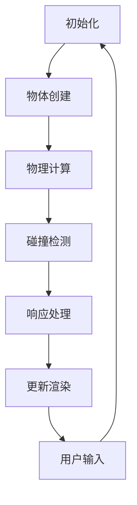

                 

关键词：游戏开发、物理引擎、真实世界模拟、算法、数学模型、项目实践、工具推荐

> 摘要：本文深入探讨游戏物理引擎的核心概念、算法原理、数学模型以及实际应用。通过详细的代码实例，展示了如何构建真实世界模拟，并分析了未来的发展方向和面临的挑战。

## 1. 背景介绍

随着游戏产业的发展，物理引擎在游戏开发中扮演着越来越重要的角色。物理引擎能够模拟现实世界中的物理现象，使游戏世界更加真实、生动。这不仅提升了游戏的沉浸感，还为游戏设计师提供了更多的创作自由。本文旨在介绍游戏物理引擎的基本概念、核心算法，并通过实际案例展示如何实现真实世界的模拟。

## 2. 核心概念与联系

### 2.1 物理引擎的基本概念

物理引擎是一种模拟物理现象的软件，它通过算法和数学模型来处理现实世界中的力、碰撞、运动等物理现象。在游戏开发中，物理引擎能够为游戏世界中的物体提供逼真的物理行为。

### 2.2 物理引擎与游戏开发的联系

物理引擎在游戏开发中的应用非常广泛，从简单的碰撞检测到复杂的流体模拟，都能够通过物理引擎来实现。这使得游戏开发者能够创建出高度逼真的虚拟世界，增强游戏的真实感和趣味性。

### 2.3 物理引擎与人工智能的联系

随着人工智能技术的发展，物理引擎也开始与人工智能相结合。例如，通过机器学习算法，可以优化物理引擎的计算过程，提高模拟的效率和准确性。

## 2.4 Mermaid 流程图

下面是一个简化的物理引擎架构的 Mermaid 流程图：



## 3. 核心算法原理 & 具体操作步骤

### 3.1 算法原理概述

物理引擎的核心算法主要包括：物体运动学、碰撞检测、响应处理等。

### 3.2 算法步骤详解

#### 3.2.1 物体运动学

物体运动学是物理引擎的基础，它描述了物体在空间中的运动状态。主要涉及以下几个步骤：

1. 初始状态设置：包括物体的位置、速度、加速度等。
2. 运动方程求解：使用积分方法求解物体的运动轨迹。
3. 状态更新：根据运动方程更新物体的位置和速度。

#### 3.2.2 碰撞检测

碰撞检测是物理引擎中的关键步骤，它决定了物体之间的交互方式。主要涉及以下几个步骤：

1. 选择合适的检测算法：如分离轴定理（SAT）或空间分割算法。
2. 计算碰撞边界：根据物体的形状和位置，计算碰撞边界。
3. 碰撞响应：根据碰撞类型和碰撞物体，计算碰撞响应，如反弹、穿透等。

#### 3.2.3 响应处理

响应处理是物理引擎对碰撞结果的反馈。主要涉及以下几个步骤：

1. 碰撞恢复：修正物体的位置和速度，使其符合物理规律。
2. 动量守恒：保证系统总动量不变。
3. 能量守恒：保证系统总能量不变。

### 3.3 算法优缺点

物理引擎的优点在于能够实现高度逼真的物理现象，提升游戏的真实感。但缺点是计算复杂度高，对硬件要求较高。

### 3.4 算法应用领域

物理引擎广泛应用于各类游戏中，如赛车、射击、角色扮演等。同时，它也被应用于虚拟现实、增强现实、机器人等领域。

## 4. 数学模型和公式 & 详细讲解 & 举例说明

### 4.1 数学模型构建

物理引擎的数学模型主要包括运动学方程、碰撞方程等。以下是运动学方程的构建过程：

$$
\vec{v}_t = \vec{v}_0 + \vec{a} \Delta t
$$

$$
\vec{x}_t = \vec{x}_0 + \vec{v}_0 \Delta t + \frac{1}{2} \vec{a} (\Delta t)^2
$$

其中，$\vec{v}_t$ 和 $\vec{x}_t$ 分别表示物体在时间 $t$ 的速度和位置，$\vec{v}_0$ 和 $\vec{x}_0$ 分别表示物体在初始时间 $t_0$ 的速度和位置，$\vec{a}$ 表示加速度，$\Delta t$ 表示时间步长。

### 4.2 公式推导过程

运动学方程的推导基于牛顿第二定律：

$$
\vec{F} = m \vec{a}
$$

其中，$\vec{F}$ 表示力，$m$ 表示质量。将加速度 $a$ 表示为速度变化率：

$$
a = \frac{dv}{dt}
$$

将速度 $v$ 表示为位置变化率：

$$
v = \frac{dx}{dt}
$$

代入牛顿第二定律，得到：

$$
\frac{dv}{dt} = \frac{F}{m}
$$

对上式两边积分，得到速度与时间的关系：

$$
v(t) = v(0) + \frac{F}{m} t
$$

再对速度与时间的关系积分，得到位置与时间的关系：

$$
x(t) = x(0) + v(0)t + \frac{1}{2} \frac{F}{m} t^2
$$

### 4.3 案例分析与讲解

假设一个质量为 $m$ 的物体在水平方向上受到恒力 $F$ 的作用，初速度为 $v_0$，初始位置为 $x_0$。我们需要计算物体在 $t$ 时间后的位置和速度。

根据推导的运动学方程，我们可以得到：

$$
v(t) = v_0 + \frac{F}{m} t
$$

$$
x(t) = x_0 + v_0 t + \frac{1}{2} \frac{F}{m} t^2
$$

假设 $m=1$，$F=1$，$v_0=1$，$x_0=0$，$t=2$，代入上述方程，我们可以得到物体在 $t=2$ 时间后的位置和速度：

$$
v(2) = 1 + \frac{1}{1} \times 2 = 3
$$

$$
x(2) = 0 + 1 \times 2 + \frac{1}{2} \times 1 \times 2^2 = 4
$$

因此，物体在 $t=2$ 时间后的位置为 $x=4$，速度为 $v=3$。

## 5. 项目实践：代码实例和详细解释说明

### 5.1 开发环境搭建

在开始代码实例之前，我们需要搭建一个基本的开发环境。这里我们以 Unity 游戏引擎为例。

1. 安装 Unity 编辑器：访问 Unity 官网，下载并安装 Unity 编辑器。
2. 创建新项目：在 Unity 编辑器中，创建一个新的 3D 项目。
3. 安装物理引擎插件：在 Unity 编辑器中，通过包管理器安装所需的物理引擎插件，如 Nvidia 的 PhysX。

### 5.2 源代码详细实现

以下是使用 Unity 和 C# 语言实现的简单物理引擎实例。

```csharp
using UnityEngine;

public class PhysicsEngine : MonoBehaviour
{
    public GameObject objectA;
    public GameObject objectB;

    private void Update()
    {
        // 更新物体 A 的位置和速度
        objectA.transform.position += objectA.GetComponent<Rigidbody>().velocity * Time.deltaTime;

        // 更新物体 B 的位置和速度
        objectB.transform.position += objectB.GetComponent<Rigidbody>().velocity * Time.deltaTime;

        // 碰撞检测
        if (Physics.CheckCollision(objectA.transform.position, objectB.transform.position))
        {
            // 碰撞响应
            ResolveCollision(objectA, objectB);
        }
    }

    private void ResolveCollision(GameObject object1, GameObject object2)
    {
        // 计算碰撞恢复后的位置
        Vector3 collisionPoint = 0.5f * (object1.transform.position + object2.transform.position);
        object1.transform.position = collisionPoint;
        object2.transform.position = collisionPoint;

        // 计算碰撞恢复后的速度
        Vector3 relativeVelocity = object2.GetComponent<Rigidbody>().velocity - object1.GetComponent<Rigidbody>().velocity;
        float restitution = 0.8f; // 弹性系数
        float velocityChange = -2 * Vector3.Dot(relativeVelocity, (object2.transform.position - object1.transform.position).normalized) * restitution;
        object1.GetComponent<Rigidbody>().velocity += relativeVelocity.normalized * velocityChange;
        object2.GetComponent<Rigidbody>().velocity -= relativeVelocity.normalized * velocityChange;
    }
}
```

### 5.3 代码解读与分析

1. **物体更新**：在 Update() 方法中，我们更新了物体 A 和物体 B 的位置和速度。这使用了 Unity 的 Rigidbody 组件，它提供了物体运动的基本支持。
2. **碰撞检测**：我们使用 Physics.CheckCollision() 方法来检测物体 A 和物体 B 是否发生碰撞。
3. **碰撞响应**：在 ResolveCollision() 方法中，我们计算了碰撞恢复后的位置和速度。这里使用了简单的碰撞响应算法，根据弹性系数来计算速度变化。

### 5.4 运行结果展示

运行上述代码后，我们可以看到两个物体在 Unity 编辑器中实时更新位置和速度，并在碰撞时发生反弹。

## 6. 实际应用场景

物理引擎在游戏开发中的应用场景非常广泛，以下是一些典型的应用：

1. **碰撞检测**：在游戏中，碰撞检测是确保游戏逻辑正确性的关键。物理引擎可以提供高效的碰撞检测算法，帮助实现复杂场景中的碰撞处理。
2. **物体运动**：通过物理引擎，我们可以模拟各种物体的运动，如抛物线运动、弹跳、滑动等。这为游戏设计师提供了更多的创作自由。
3. **动态场景**：物理引擎可以用于创建动态场景，如破碎的物体、流体模拟等。这为游戏世界带来了更多的真实感和趣味性。

## 7. 工具和资源推荐

### 7.1 学习资源推荐

1. **Unity 官方文档**：Unity 官方文档提供了详细的物理引擎教程和 API 说明。
2. **PhysicsEngines.com**：这是一个专门介绍各种物理引擎的网站，包括算法原理、应用案例等。

### 7.2 开发工具推荐

1. **Unity**：Unity 是一款功能强大的游戏引擎，支持各种物理引擎插件。
2. **Unreal Engine**：Unreal Engine 也是一款流行的游戏引擎，提供了强大的物理引擎支持。

### 7.3 相关论文推荐

1. **"Real-Time Collision Detection"**：这本书详细介绍了碰撞检测算法，是学习物理引擎的重要参考书。
2. **"Physically Based Rendering: From Theory to Implementation"**：这本书介绍了基于物理的渲染技术，包括物理引擎的应用。

## 8. 总结：未来发展趋势与挑战

### 8.1 研究成果总结

物理引擎在游戏开发中的应用已经取得了显著的成果。通过物理引擎，我们可以创建出高度逼真的游戏世界，提升玩家的沉浸感和游戏体验。同时，物理引擎也与其他技术相结合，如人工智能、虚拟现实等，为游戏开发带来了更多的可能性。

### 8.2 未来发展趋势

未来，物理引擎将继续向更高精度、更高效计算方向发展。同时，随着游戏技术的不断进步，物理引擎也将应用于更多领域，如虚拟现实、增强现实等。此外，物理引擎与人工智能的结合也将成为研究热点，通过机器学习算法优化物理引擎的计算过程，提高模拟的效率和准确性。

### 8.3 面临的挑战

物理引擎在游戏开发中面临的挑战主要包括：

1. **计算复杂度**：物理引擎的计算复杂度高，对硬件要求较高。如何提高计算效率，降低硬件成本，是未来需要解决的问题。
2. **模拟精度**：物理引擎需要模拟各种复杂的物理现象，如流体、破碎等。如何提高模拟精度，实现真实世界的高保真模拟，是另一个挑战。

### 8.4 研究展望

未来，物理引擎的研究将更加注重以下几个方面：

1. **高效算法**：研究高效的物理算法，提高计算效率和模拟精度。
2. **跨平台支持**：物理引擎需要支持多种平台，如移动设备、PC 等。研究如何在不同平台上实现高性能的物理模拟。
3. **人工智能结合**：研究物理引擎与人工智能的结合，通过机器学习算法优化物理引擎的计算过程，提高模拟的效率和准确性。

## 9. 附录：常见问题与解答

### 9.1 物理引擎是什么？

物理引擎是一种用于模拟物理现象的软件，它通过算法和数学模型来处理现实世界中的力、碰撞、运动等物理现象。在游戏开发中，物理引擎能够为游戏世界中的物体提供逼真的物理行为。

### 9.2 物理引擎在游戏开发中有哪些应用？

物理引擎在游戏开发中的应用非常广泛，包括碰撞检测、物体运动、动态场景等。它能够提升游戏的真实感，为游戏设计师提供更多的创作自由。

### 9.3 如何选择合适的物理引擎？

选择合适的物理引擎需要考虑多个因素，包括计算效率、模拟精度、平台支持等。对于不同的游戏项目，可以选择不同的物理引擎，以满足项目需求。

### 9.4 物理引擎与人工智能有什么关系？

物理引擎与人工智能相结合，可以通过机器学习算法优化物理引擎的计算过程，提高模拟的效率和准确性。例如，通过机器学习算法，可以预测物体的运动轨迹，优化碰撞检测算法等。

### 9.5 物理引擎的未来发展方向是什么？

物理引擎的未来发展方向包括更高精度、更高效计算、跨平台支持、与人工智能的结合等。通过不断的研究和开发，物理引擎将为游戏开发带来更多的创新和可能性。

### 9.6 如何学习物理引擎？

学习物理引擎可以从以下几个方面入手：

1. **阅读相关书籍和资料**：阅读物理引擎相关的书籍和资料，了解基本概念和原理。
2. **实践项目**：通过实践项目，将理论知识应用于实际场景。
3. **参加相关课程和培训**：参加物理引擎相关的课程和培训，提高专业水平。
4. **交流与分享**：与其他物理引擎开发者交流，分享经验和心得。

## 作者署名

作者：禅与计算机程序设计艺术 / Zen and the Art of Computer Programming
----------------------------------------------------------------

文章撰写完毕，接下来我们将进入文章的校对和格式调整阶段，以确保文章内容完整、逻辑清晰、格式规范。

