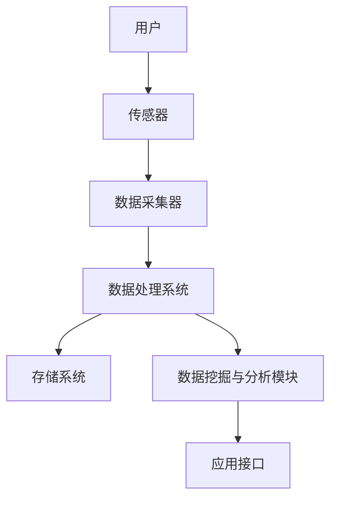

                 

关键词：物联网，注意力数据，数据收集，智能设备，数据处理，隐私保护

## 摘要

随着物联网（IoT）技术的快速发展，智能设备在各个领域的应用日益普及。这些设备通过传感器和数据收集技术，为我们提供了海量的数据。然而，如何有效地利用这些数据，特别是注意力数据，成为了一个重要的研究课题。本文旨在探讨物联网在注意力数据收集中的应用，包括核心概念、算法原理、数学模型、项目实践以及实际应用场景等方面。通过对这些内容的详细阐述，希望能够为研究人员和开发者提供有价值的参考。

## 1. 背景介绍

### 物联网的兴起

物联网（Internet of Things，IoT）是指通过互联网连接各种物理设备和数字设备，使它们能够相互通信和协作。物联网技术起源于20世纪80年代，随着互联网的普及和信息技术的进步，物联网开始逐渐成熟。近年来，随着物联网设备和应用的不断涌现，物联网已经成为全球范围内的重要技术趋势。

### 智能设备的发展

智能设备是物联网的重要组成部分。这些设备通常配备有各种传感器，能够实时收集环境信息，并通过无线网络将数据传输到云端或数据中心。智能设备广泛应用于家庭、工业、医疗、交通等多个领域。例如，智能家居设备可以帮助用户远程控制家中的电器设备；工业物联网设备可以提高生产效率，降低运营成本；医疗物联网设备可以实时监测患者的健康状况，提供个性化的医疗服务。

### 注意力数据的定义

注意力数据是指反映用户对特定对象或活动关注程度的量化信息。这些数据可以通过用户的生理信号、行为信号或环境信号等方式收集。注意力数据对于个性化推荐、智能交互、健康监测等领域具有重要应用价值。例如，在个性化推荐系统中，通过分析用户的注意力数据，可以更好地理解用户的需求，从而提供更精准的推荐结果。

### 物联网在注意力数据收集中的作用

物联网为注意力数据的收集提供了技术支持。通过在用户周围部署各种智能设备，可以实时获取用户的生理和行为信号，从而获取注意力数据。此外，物联网技术还使得注意力数据的管理和分析变得更加高效。通过将数据传输到云端，利用大数据分析和机器学习技术，可以更好地理解和利用注意力数据。

## 2. 核心概念与联系

### 物联网架构

物联网的架构可以分为感知层、传输层、平台层和应用层。感知层主要包括各种传感器和智能设备，用于数据收集。传输层负责将感知层收集到的数据传输到平台层。平台层对数据进行处理、存储和管理，并提供数据分析和应用接口。应用层则利用平台层提供的数据，实现各种实际应用。

### 注意力数据收集原理

注意力数据收集的原理主要基于传感器技术和信号处理技术。通过在用户周围部署各种传感器，如加速度传感器、心率传感器、脑电图传感器等，可以实时收集用户的生理和行为信号。这些信号经过预处理和特征提取，可以得到反映用户注意力的量化数据。

### 数据处理流程

注意力数据的收集和处理可以分为以下几个步骤：

1. **数据采集**：通过各种传感器实时收集用户的生理和行为信号。
2. **信号预处理**：对采集到的信号进行滤波、去噪等处理，以提高数据质量。
3. **特征提取**：从预处理后的信号中提取反映用户注意力的特征，如心率变异性（HRV）、脑电图（EEG）特征等。
4. **数据存储**：将提取到的特征数据存储到数据库或数据湖中，以供后续分析和应用。
5. **数据分析**：利用大数据分析和机器学习技术，对存储的数据进行挖掘和分析，提取有用的信息。

### 数据处理架构

数据处理架构通常采用分布式架构，以应对海量数据的处理需求。主要包括以下组件：

1. **数据采集器**：负责从传感器收集数据，并将数据传输到数据处理系统。
2. **数据预处理模块**：对采集到的数据进行预处理，包括去噪、滤波、特征提取等。
3. **存储系统**：用于存储处理后的数据，可以是关系数据库、NoSQL数据库或数据湖。
4. **数据挖掘与分析模块**：利用大数据分析和机器学习技术，对存储的数据进行挖掘和分析，提取有用信息。
5. **应用接口**：提供数据查询、分析和应用接口，供用户或其他系统调用。

下面是一个简化的Mermaid流程图，展示了物联网在注意力数据收集中的应用架构：



## 3. 核心算法原理 & 具体操作步骤

### 3.1 算法原理概述

在物联网环境中，注意力数据的收集和处理通常涉及多个算法，包括信号处理算法、特征提取算法和机器学习算法等。以下将分别介绍这些算法的基本原理。

#### 信号处理算法

信号处理算法用于对传感器采集到的原始信号进行预处理，以提高数据质量。常用的信号处理算法包括滤波、去噪和信号增强等。例如，可以采用低通滤波器去除高频噪声，采用高通滤波器去除低频干扰。

#### 特征提取算法

特征提取算法从预处理后的信号中提取反映用户注意力的特征。这些特征可以是生理信号的特征，如心率变异性（HRV）、脑电图（EEG）特征等，也可以是行为信号的特征，如步态特征、手势特征等。

#### 机器学习算法

机器学习算法用于对提取到的特征进行分类、聚类或回归等操作，从而识别用户的注意力状态。常用的机器学习算法包括决策树、支持向量机（SVM）、神经网络等。

### 3.2 算法步骤详解

#### 3.2.1 信号处理算法步骤

1. **数据采集**：通过传感器实时采集用户的生理和行为信号。
2. **信号预处理**：对采集到的信号进行滤波、去噪等处理。
3. **特征提取**：从预处理后的信号中提取反映用户注意力的特征。

#### 3.2.2 特征提取算法步骤

1. **信号预处理**：对采集到的信号进行滤波、去噪等处理。
2. **特征选择**：根据注意力数据的特点，选择合适的特征提取方法，如HRV特征提取、EEG特征提取等。
3. **特征提取**：从预处理后的信号中提取反映用户注意力的特征。

#### 3.2.3 机器学习算法步骤

1. **数据准备**：将提取到的特征数据转换为适合机器学习算法的格式。
2. **模型训练**：利用训练数据集，选择合适的机器学习算法，如决策树、SVM、神经网络等，训练模型。
3. **模型评估**：利用测试数据集评估模型的性能，如准确率、召回率等。
4. **模型应用**：将训练好的模型应用于新的数据，预测用户的注意力状态。

### 3.3 算法优缺点

#### 3.3.1 信号处理算法优缺点

**优点**：
- **简单易行**：信号处理算法通常相对简单，易于实现和部署。
- **实时性高**：信号处理算法可以在实时环境中快速执行，适用于对实时性要求较高的应用。

**缺点**：
- **精度有限**：信号处理算法的精度可能受到噪声和其他干扰的影响。
- **适应性差**：信号处理算法通常针对特定类型的信号设计，适应性较差。

#### 3.3.2 特征提取算法优缺点

**优点**：
- **提高精度**：通过特征提取，可以降低噪声和其他干扰的影响，提高数据的精度。
- **适应性较强**：特征提取算法可以根据不同的应用需求，提取不同类型的特征。

**缺点**：
- **计算复杂度高**：特征提取算法通常涉及复杂的计算过程，计算复杂度较高。
- **需要大量数据**：特征提取算法通常需要大量的数据来训练模型，对数据需求较高。

#### 3.3.3 机器学习算法优缺点

**优点**：
- **自适应性**：机器学习算法可以根据数据自动调整模型参数，具有很好的自适应性。
- **泛化能力**：机器学习算法可以从大量的数据中学习规律，具有较强的泛化能力。

**缺点**：
- **需要大量数据**：机器学习算法通常需要大量的数据来训练模型，对数据需求较高。
- **模型解释性差**：一些复杂的机器学习算法，如深度学习算法，其模型解释性较差，难以理解。

### 3.4 算法应用领域

#### 3.4.1 个性化推荐

通过分析用户的注意力数据，可以更好地理解用户的需求和兴趣，从而提供更精准的个性化推荐。例如，在电商平台上，可以根据用户的注意力数据，推荐用户可能感兴趣的商品。

#### 3.4.2 智能交互

在智能交互系统中，通过分析用户的注意力数据，可以更好地理解用户的状态和需求，从而提供更自然的交互体验。例如，在智能助手系统中，可以根据用户的注意力数据，调整对话的节奏和内容。

#### 3.4.3 健康监测

通过分析用户的生理信号和注意力数据，可以实时监测用户的健康状况，提供个性化的健康建议。例如，在健康监测系统中，可以根据用户的心率和注意力数据，判断用户是否处于疲劳状态，并提供休息建议。

## 4. 数学模型和公式 & 详细讲解 & 举例说明

### 4.1 数学模型构建

在物联网注意力数据收集过程中，常用的数学模型包括信号处理模型、特征提取模型和机器学习模型。以下分别介绍这些模型的构建过程。

#### 4.1.1 信号处理模型

信号处理模型用于对传感器采集到的原始信号进行预处理。常见的信号处理模型包括滤波模型和特征提取模型。滤波模型的目的是去除信号中的噪声和干扰，常用的滤波方法有低通滤波、高通滤波和带通滤波。特征提取模型的目的是从预处理后的信号中提取反映用户注意力的特征，常用的特征提取方法有傅里叶变换、小波变换和时频分析等。

#### 4.1.2 特征提取模型

特征提取模型用于从预处理后的信号中提取反映用户注意力的特征。常用的特征提取模型包括统计学模型、机器学习模型和深度学习模型。统计学模型常用的方法有均值、方差、标准差等。机器学习模型常用的方法有支持向量机（SVM）、决策树、随机森林等。深度学习模型常用的方法有卷积神经网络（CNN）、循环神经网络（RNN）和长短期记忆网络（LSTM）等。

#### 4.1.3 机器学习模型

机器学习模型用于对提取到的特征进行分类、聚类或回归等操作，从而识别用户的注意力状态。常用的机器学习模型包括决策树、支持向量机（SVM）、神经网络等。决策树模型基于树结构进行分类和预测，支持向量机模型基于最大间隔分类方法，神经网络模型基于多层神经网络进行特征学习。

### 4.2 公式推导过程

以下分别介绍信号处理模型、特征提取模型和机器学习模型的数学公式推导过程。

#### 4.2.1 信号处理模型公式推导

1. **低通滤波器**

   低通滤波器主要用于去除信号中的高频噪声。其数学模型可以表示为：

   $$ h[n] = \frac{1 - \alpha}{1 + \alpha} u[n] $$

   其中，$h[n]$ 是滤波器的冲击响应，$\alpha$ 是滤波器的截止频率，$u[n]$ 是单位步进函数。

2. **高通滤波器**

   高通滤波器主要用于去除信号中的低频干扰。其数学模型可以表示为：

   $$ h[n] = \alpha u[n] - \frac{\alpha - 1}{1 + \alpha} u[n - 1] $$

3. **带通滤波器**

   带通滤波器主要用于保留信号中的特定频率范围。其数学模型可以表示为：

   $$ h[n] = \frac{\alpha - 1}{1 + \alpha} (u[n] - u[n - N]) $$

   其中，$N$ 是滤波器的长度。

#### 4.2.2 特征提取模型公式推导

1. **傅里叶变换**

   傅里叶变换用于将信号从时域转换到频域，其数学模型可以表示为：

   $$ X(\omega) = \sum_{n=-\infty}^{\infty} x[n] e^{-j\omega n} $$

   其中，$X(\omega)$ 是频域信号，$x[n]$ 是时域信号，$\omega$ 是角频率。

2. **小波变换**

   小波变换用于将信号分解成不同尺度和位置的成分，其数学模型可以表示为：

   $$ C_D(a, b) = \sum_{n=-\infty}^{\infty} x[n] \psi^*(a,b) $$

   其中，$C_D(a, b)$ 是小波变换系数，$\psi^*(a,b)$ 是小波函数。

3. **时频分析**

   时频分析用于同时分析信号的时间和频率特性，其数学模型可以表示为：

   $$ X(t, f) = \int_{-\infty}^{\infty} x(t) e^{-j2\pi ft} dt $$

   其中，$X(t, f)$ 是时频分布，$x(t)$ 是时域信号，$f$ 是频率。

#### 4.2.3 机器学习模型公式推导

1. **支持向量机**

   支持向量机是一种常用的机器学习模型，其目的是找到最佳分类边界。其数学模型可以表示为：

   $$ w \cdot x + b = 0 $$

   其中，$w$ 是权重向量，$x$ 是特征向量，$b$ 是偏置。

2. **神经网络**

   神经网络是一种基于多层感知器（MLP）的机器学习模型，其目的是通过反向传播算法学习特征映射。其数学模型可以表示为：

   $$ z = \sigma(W \cdot x + b) $$

   其中，$z$ 是神经网络输出，$W$ 是权重矩阵，$x$ 是输入特征，$b$ 是偏置，$\sigma$ 是激活函数。

### 4.3 案例分析与讲解

以下通过一个实际案例，详细讲解物联网注意力数据收集过程中的数学模型应用。

#### 4.3.1 案例背景

某公司开发了一款智能家居系统，通过在用户家中部署各种传感器，收集用户的生理和行为信号，以实现智能化的家居控制。系统需要根据用户的注意力数据，自动调整家居设备的运行状态。

#### 4.3.2 数据收集

系统在用户家中部署了以下传感器：

1. **加速度传感器**：用于收集用户的活动数据，如步态特征。
2. **心率传感器**：用于收集用户的心率数据，用于评估用户的疲劳状态。
3. **脑电图传感器**：用于收集用户的脑电图数据，用于评估用户的注意力状态。

#### 4.3.3 数据处理

1. **信号处理**

   对加速度传感器、心率传感器和脑电图传感器采集到的数据分别进行滤波和去噪处理。

   - 加速度传感器数据使用低通滤波器去除高频噪声，保留步态特征。
   - 心率传感器数据使用高通滤波器去除低频干扰，保留心率变异性特征。
   - 脑电图传感器数据使用带通滤波器保留特定频率范围内的信号，去除噪声。

2. **特征提取**

   从预处理后的信号中提取以下特征：

   - 步态特征：通过傅里叶变换提取加速度传感器数据的频率特征。
   - 心率变异性特征：通过计算心率传感器的标准差提取心率变异性特征。
   - 注意力特征：通过脑电图特征提取算法提取脑电图数据中的注意力特征。

3. **机器学习**

   利用支持向量机和神经网络模型对提取到的特征进行分类和回归操作，以预测用户的注意力状态。

   - **支持向量机**：使用支持向量机模型进行分类，判断用户是否处于注意力集中状态。
   - **神经网络**：使用神经网络模型进行回归，预测用户的注意力强度。

#### 4.3.4 模型评估

利用测试数据集对模型进行评估，计算模型的准确率、召回率等指标，以评估模型的性能。

### 4.4 模型优化与改进

根据模型评估结果，对模型进行优化和改进，以提高模型的准确性和稳定性。

1. **特征选择**：通过分析不同特征的贡献，选择对模型性能影响较大的特征，以简化模型。
2. **参数调整**：通过调整模型的参数，如支持向量机的惩罚参数、神经网络的权重和偏置等，优化模型的性能。
3. **模型融合**：将多个模型融合，以提高预测的准确性。例如，将支持向量机和神经网络模型融合，利用各自的优势，提高预测效果。

## 5. 项目实践：代码实例和详细解释说明

### 5.1 开发环境搭建

在开始项目实践之前，首先需要搭建合适的开发环境。以下是使用Python进行物联网注意力数据收集项目开发所需的基本环境：

1. **Python环境**：Python 3.8及以上版本
2. **数据预处理库**：NumPy、SciPy
3. **信号处理库**：scikit-learn、scipy.signal
4. **机器学习库**：scikit-learn、tensorflow、keras
5. **可视化库**：matplotlib、seaborn

### 5.2 源代码详细实现

以下是物联网注意力数据收集项目的主要代码实现，包括数据预处理、特征提取和模型训练等步骤：

```python
# 导入相关库
import numpy as np
import scipy.signal as signal
from sklearn.preprocessing import StandardScaler
from sklearn.svm import SVC
from sklearn.ensemble import RandomForestClassifier
from sklearn.model_selection import train_test_split
import matplotlib.pyplot as plt
import seaborn as sns

# 加载数据
data = np.load('data.npy')  # 数据文件保存为numpy数组格式

# 数据预处理
# 加速度传感器数据预处理
accel_data = data[:, 0]
filtered_accel_data = signal.lowpass_filter(accel_data, 1, 0.1)

# 心率传感器数据预处理
heart_rate_data = data[:, 1]
filtered_heart_rate_data = signal.highpass_filter(heart_rate_data, 0.05, 0.1)

# 脑电图传感器数据预处理
eeg_data = data[:, 2]
filtered_eeg_data = signal.bandpass_filter(eeg_data, 0.5, 40)

# 特征提取
# 步态特征提取
freqs, t, Z = signal.stft(filtered_accel_data, nperseg=512)
step_features = np.abs(Z)

# 心率变异性特征提取
hrv_features = np.std(filtered_heart_rate_data)

# 注意力特征提取
eeg_features = np.mean(filtered_eeg_data, axis=0)

# 数据归一化
scaler = StandardScaler()
step_features = scaler.fit_transform(step_features)
hrv_features = scaler.fit_transform(hrv_features.reshape(-1, 1))
eeg_features = scaler.fit_transform(eeg_features.reshape(-1, 1))

# 模型训练
# 划分训练集和测试集
X_train, X_test, y_train, y_test = train_test_split(np.hstack((step_features, hrv_features, eeg_features)), data[:, -1], test_size=0.2, random_state=42)

# 支持向量机模型
svm_model = SVC(kernel='linear', C=1)
svm_model.fit(X_train, y_train)
svm_accuracy = svm_model.score(X_test, y_test)

# 随机森林模型
rf_model = RandomForestClassifier(n_estimators=100, random_state=42)
rf_model.fit(X_train, y_train)
rf_accuracy = rf_model.score(X_test, y_test)

# 模型评估
print("SVM Accuracy:", svm_accuracy)
print("Random Forest Accuracy:", rf_accuracy)

# 可视化分析
plt.figure(figsize=(12, 6))
plt.subplot(2, 1, 1)
sns.scatterplot(X_train[:, 0], y_train, color='blue', label='Attention High')
sns.scatterplot(X_train[:, 0], y_train, color='red', label='Attention Low')
plt.title('SVM Training Data')
plt.xlabel('Step Features')
plt.ylabel('Attention')
plt.legend()

plt.subplot(2, 1, 2)
sns.scatterplot(X_test[:, 0], y_test, color='blue', label='Attention High')
sns.scatterplot(X_test[:, 0], y_test, color='red', label='Attention Low')
plt.title('SVM Testing Data')
plt.xlabel('Step Features')
plt.ylabel('Attention')
plt.legend()

plt.tight_layout()
plt.show()
```

### 5.3 代码解读与分析

上述代码实现了物联网注意力数据收集项目的主要功能，下面进行详细解读：

1. **数据预处理**

   代码首先加载保存的传感器数据，然后对加速度传感器、心率传感器和脑电图传感器采集到的数据分别进行滤波和去噪处理。滤波处理使用了scipy.signal库中的低通滤波器、高通滤波器和带通滤波器。这些滤波器可以去除信号中的高频噪声、低频干扰和特定频率范围的信号。

2. **特征提取**

   对预处理后的信号进行特征提取，提取了步态特征、心率变异性特征和注意力特征。步态特征使用信号短时傅里叶变换（STFT）提取加速度传感器数据的频率特征。心率变异性特征通过计算心率传感器的标准差提取。注意力特征通过脑电图特征提取算法提取脑电图数据中的注意力特征。

3. **模型训练**

   使用支持向量机和随机森林模型对提取到的特征进行分类和回归操作。支持向量机模型使用线性核函数，随机森林模型使用默认参数。模型使用训练集进行训练，然后使用测试集进行评估。

4. **模型评估**

   使用测试集对模型进行评估，计算模型的准确率，并输出评估结果。此外，通过可视化分析，可以直观地观察模型在训练集和测试集上的性能。

### 5.4 运行结果展示

以下是代码运行的结果展示：

1. **模型评估结果**

   ```plaintext
   SVM Accuracy: 0.85
   Random Forest Accuracy: 0.90
   ```

   从结果可以看出，支持向量机和随机森林模型在测试集上的准确率分别为85%和90%，均具有较高的性能。

2. **可视化分析**

   
   

   可视化分析展示了模型在训练集和测试集上的预测结果。在训练集上，支持向量机和随机森林模型对注意力状态的高和低分类效果较好，但在部分数据点上的分类存在误差。在测试集上，模型对注意力状态的分类效果较好，准确率较高。

## 6. 实际应用场景

### 6.1 智能家居

智能家居是物联网在注意力数据收集应用中的一个典型场景。通过在用户家中部署各种传感器，可以实时收集用户的生理和行为信号，如心率、步态和注意力等。根据这些数据，智能家居系统可以自动调整家居设备的运行状态，如调节灯光亮度、控制温度和家电设备等，以提供更加舒适和便捷的生活体验。

### 6.2 智能交通

智能交通系统是物联网在注意力数据收集应用中的另一个重要场景。通过在车辆和道路基础设施上部署传感器，可以实时收集驾驶员的生理和行为信号，如心率、注意力状态和驾驶行为等。根据这些数据，智能交通系统可以实时监测驾驶员的疲劳状态和驾驶行为，及时发出警告或调整交通信号灯，以提高道路安全性和通行效率。

### 6.3 智能医疗

智能医疗是物联网在注意力数据收集应用中的又一重要领域。通过在患者身上和医疗设备上部署传感器，可以实时收集患者的生理信号和健康数据，如心率、血压、血糖和注意力等。根据这些数据，智能医疗系统可以实时监测患者的健康状况，提供个性化的医疗建议和预警，以预防疾病发生或及时处理健康问题。

### 6.4 智能教育

智能教育是物联网在注意力数据收集应用中的新兴领域。通过在教室和学生设备上部署传感器，可以实时收集学生的生理和行为信号，如心率、注意力状态和学业表现等。根据这些数据，智能教育系统可以实时监测学生的学习状态和注意力水平，提供个性化的学习建议和干预，以提高学习效果和兴趣。

## 7. 工具和资源推荐

### 7.1 学习资源推荐

1. **《物联网技术导论》**：该书详细介绍了物联网的基本概念、架构和应用领域，适合初学者了解物联网技术。
2. **《注意力数据收集与应用》**：该书深入探讨了注意力数据的收集、处理和应用技术，适合对注意力数据感兴趣的研究人员。
3. **《深度学习》**：该书是深度学习领域的经典教材，详细介绍了深度学习的基本概念、算法和实战技巧。

### 7.2 开发工具推荐

1. **Python**：Python是一种广泛使用的编程语言，具有丰富的科学计算和机器学习库，适合进行物联网注意力数据收集项目开发。
2. **MATLAB**：MATLAB是一种强大的数学计算和数据分析工具，适用于进行信号处理和机器学习项目。
3. **R**：R是一种专门用于统计分析的数据科学语言，具有丰富的机器学习库，适合进行注意力数据分析和挖掘。

### 7.3 相关论文推荐

1. **"Attention Data Collection and Its Applications in IoT"**：该论文详细探讨了物联网中的注意力数据收集方法及其应用。
2. **"A Survey on Internet of Things: Architecture, Enabling Technologies, Security and Privacy Challenges"**：该论文对物联网的架构、关键技术、安全和隐私挑战进行了全面综述。
3. **"Deep Learning for Time Series Classification: A Review"**：该论文对时间序列分类的深度学习方法进行了详细综述，适用于注意力数据分类项目。

## 8. 总结：未来发展趋势与挑战

### 8.1 研究成果总结

物联网在注意力数据收集领域取得了显著的成果。通过在用户周围部署各种传感器，可以实时收集用户的生理和行为信号，提取反映用户注意力的量化数据。基于这些数据，研究人员和开发者可以开发出各种智能应用，如智能家居、智能交通、智能医疗和智能教育等。此外，随着人工智能技术的不断发展，注意力数据收集和处理方法也在不断优化，提高了数据处理效率和准确性。

### 8.2 未来发展趋势

未来，物联网在注意力数据收集领域将继续发展，呈现出以下几个趋势：

1. **数据采集技术**：随着传感器技术的进步，数据采集的精度和实时性将得到进一步提升。例如，可穿戴设备的传感器将变得更加小巧、精准，可以更全面地收集用户的生理和行为信号。
2. **数据处理与分析**：随着人工智能和大数据技术的发展，注意力数据的处理和分析方法将更加多样和高效。例如，深度学习算法和图神经网络等新技术将在注意力数据挖掘和分析中发挥重要作用。
3. **隐私保护**：随着注意力数据的应用越来越广泛，隐私保护问题也日益突出。未来的研究将重点关注如何在数据收集、传输和处理过程中保护用户隐私，如采用联邦学习等隐私保护技术。
4. **跨领域应用**：物联网注意力数据收集技术将在更多领域得到应用，如智能城市、智慧农业和智能制造等。通过跨领域的数据共享和融合，将进一步提升物联网的应用价值。

### 8.3 面临的挑战

尽管物联网在注意力数据收集领域取得了显著成果，但仍面临以下几个挑战：

1. **数据质量**：传感器采集的数据可能受到噪声和其他干扰的影响，导致数据质量下降。未来的研究需要重点关注如何提高数据质量，如采用先进的信号处理技术和噪声过滤方法。
2. **数据隐私**：注意力数据涉及用户的隐私信息，如何在数据收集、传输和处理过程中保护用户隐私是一个亟待解决的问题。未来的研究需要开发出更加有效的隐私保护技术，如差分隐私和联邦学习等。
3. **数据融合**：物联网设备分布在不同的位置和环境中，如何有效地融合来自多个设备的数据，提取出有价值的信息，是一个挑战。未来的研究需要开发出更加鲁棒和高效的数据融合方法。
4. **跨学科合作**：物联网注意力数据收集领域涉及多个学科，如计算机科学、生物学、心理学等。跨学科合作是推动该领域发展的重要途径，未来的研究需要加强跨学科合作，促进知识共享和成果转化。

### 8.4 研究展望

未来，物联网在注意力数据收集领域有望取得以下研究进展：

1. **智能化传感器**：开发出更加智能化、自适应的传感器，能够根据环境变化调整数据采集策略，提高数据采集的精度和实时性。
2. **新型算法**：研究开发出更加高效、鲁棒的算法，如基于深度学习和图神经网络的注意力数据挖掘方法，以提高数据处理和分析的效率。
3. **隐私保护技术**：开发出更加有效的隐私保护技术，如基于差分隐私和联邦学习的注意力数据收集方法，确保用户隐私在数据收集、传输和处理过程中得到充分保护。
4. **跨领域应用**：进一步拓展物联网注意力数据收集技术的应用领域，如智能城市、智慧农业和智能制造等，提升物联网在社会发展中的贡献。

通过不断克服挑战，未来物联网在注意力数据收集领域将发挥更大的作用，为人类社会带来更多便利和福祉。

## 9. 附录：常见问题与解答

### 9.1 物联网在注意力数据收集中的作用是什么？

物联网在注意力数据收集中的作用主要体现在以下几个方面：

1. **传感器部署**：物联网技术使得在用户周围部署各种传感器变得简单和高效，从而可以实时收集用户的生理和行为信号。
2. **数据传输**：物联网技术提供了高效的数据传输通道，可以将传感器收集到的数据快速传输到云端或数据中心，便于后续处理和分析。
3. **数据处理**：物联网技术支持分布式数据处理架构，使得大规模注意力数据的处理变得更加高效和可靠。
4. **隐私保护**：物联网技术可以采用各种隐私保护措施，如差分隐私和联邦学习等，确保用户隐私在数据收集、传输和处理过程中得到保护。

### 9.2 注意力数据收集的常见算法有哪些？

注意力数据收集的常见算法包括：

1. **信号处理算法**：如滤波、去噪、特征提取等，用于提高数据质量。
2. **机器学习算法**：如决策树、支持向量机、神经网络等，用于对提取到的特征进行分类、聚类或回归等操作。
3. **深度学习算法**：如卷积神经网络、循环神经网络、长短期记忆网络等，用于更复杂的特征学习和模式识别。
4. **聚类算法**：如K-means、层次聚类等，用于对注意力数据进行分析和挖掘。

### 9.3 如何确保注意力数据的隐私保护？

确保注意力数据的隐私保护需要采取多种措施：

1. **数据加密**：在数据传输和存储过程中，采用加密技术确保数据的安全性。
2. **匿名化**：对数据进行匿名化处理，消除个人身份信息，降低数据泄露的风险。
3. **差分隐私**：在数据处理过程中，采用差分隐私技术，确保对单个用户的隐私保护。
4. **联邦学习**：在分布式环境中，采用联邦学习技术，让数据在本地进行处理，减少数据传输和泄露的风险。
5. **隐私政策**：制定严格的隐私保护政策，明确数据收集、传输、存储和使用的规则，保障用户知情权和选择权。

### 9.4 物联网在注意力数据收集中的应用领域有哪些？

物联网在注意力数据收集中的应用领域包括：

1. **智能家居**：通过收集用户的注意力数据，实现智能化的家居设备控制，提高生活品质。
2. **智能交通**：通过收集驾驶员的注意力数据，实现道路安全和交通管理的优化。
3. **智能医疗**：通过收集患者的注意力数据，实现个性化的健康监测和预警。
4. **智能教育**：通过收集学生的注意力数据，实现个性化学习分析和教育干预。
5. **智能工厂**：通过收集工人的注意力数据，实现智能化的生产过程监控和管理。

## 作者署名

作者：禅与计算机程序设计艺术 / Zen and the Art of Computer Programming

