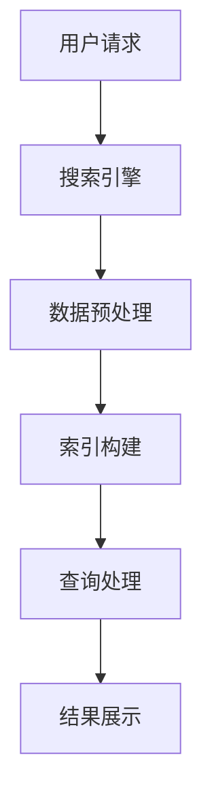

                 

关键词：物联网搜索、人工智能、数据挖掘、智能搜索、机器学习、自然语言处理、分布式系统

## 摘要

随着物联网（IoT）技术的飞速发展，数据量呈指数级增长，传统搜索技术已无法满足海量数据的检索需求。物联网搜索作为人工智能（AI）的新领域，正逐渐崭露头角。本文将探讨物联网搜索的核心概念、算法原理、数学模型、项目实践以及未来发展趋势。通过深入分析，我们希望为读者提供一个全面了解物联网搜索的视角。

## 1. 背景介绍

### 物联网搜索的兴起

物联网是指通过互联网连接各种物理设备，实现信息交换和协同工作的网络。物联网搜索则是指利用人工智能技术对物联网设备生成的海量数据进行有效检索和处理。随着物联网设备的普及，如智能家居、智能交通、智能医疗等，物联网搜索的应用场景也越来越广泛。

### 人工智能的发展

人工智能作为计算机科学的重要分支，其核心目标是使计算机具有人类智能。近年来，深度学习、自然语言处理等技术的突破，使得AI在图像识别、语音识别、自然语言理解等领域取得了显著进展。这些技术的发展为物联网搜索提供了强大的技术支持。

### 物联网搜索的重要性

随着物联网设备的增加，数据量急剧膨胀，传统的搜索技术已无法满足需求。物联网搜索不仅能提高数据检索的效率，还能为用户提供更加智能的搜索体验。例如，在智能家居场景中，物联网搜索可以帮助用户快速找到家中的智能设备，并进行相应的操作。

## 2. 核心概念与联系

### 物联网搜索的概念

物联网搜索是指利用人工智能技术，对物联网设备生成的数据进行分析和处理，以实现数据的快速检索和智能推荐。

### 数据挖掘与物联网搜索的联系

数据挖掘是一种从大量数据中发现有用信息的方法。物联网搜索中，数据挖掘技术被用来提取和整合设备数据，从而提高搜索的准确性和效率。

### 智能搜索与物联网搜索的区别

智能搜索是广义上的搜索，包括物联网搜索。而物联网搜索则更加专注于物联网设备生成的数据。

### 物联网搜索的架构



## 3. 核心算法原理 & 具体操作步骤

### 3.1 算法原理概述

物联网搜索的核心算法主要包括：

- **索引构建**：将物联网设备生成的数据构建成索引，以加快查询速度。
- **查询处理**：根据用户请求，对索引进行检索，返回符合要求的结果。
- **结果展示**：将查询结果以可视化方式展示给用户。

### 3.2 算法步骤详解

1. **数据预处理**：
   - **数据清洗**：去除重复、错误的数据。
   - **数据转换**：将不同格式的数据统一成一种标准格式。

2. **索引构建**：
   - **分词**：将文本数据分解成关键词。
   - **倒排索引**：建立关键词与文档的映射关系。

3. **查询处理**：
   - **查询解析**：将用户输入的查询转化为内部格式。
   - **匹配算法**：根据索引进行匹配，返回可能的结果。

4. **结果展示**：
   - **排序算法**：根据查询的相关性对结果进行排序。
   - **可视化**：以图表、列表等形式展示结果。

### 3.3 算法优缺点

- **优点**：
  - 高效：索引构建和查询处理速度快，适应海量数据的检索需求。
  - 智能化：利用AI技术，提供个性化搜索体验。

- **缺点**：
  - 复杂：算法实现和优化相对复杂。
  - 数据依赖：算法效果依赖于数据质量和数量。

### 3.4 算法应用领域

- **智能家居**：快速找到家中的智能设备并进行操作。
- **智能交通**：优化交通流量，减少拥堵。
- **智能医疗**：快速检索患者信息，提高诊断效率。

## 4. 数学模型和公式 & 详细讲解 & 举例说明

### 4.1 数学模型构建

物联网搜索的数学模型主要包括：

- **向量空间模型**：将文本数据表示为向量，进行相似度计算。
- **贝叶斯模型**：利用概率论，计算查询与文档的相关性。

### 4.2 公式推导过程

假设文档集合为$D=\{d_1, d_2, ..., d_n\}$，查询集合为$Q=\{q_1, q_2, ..., q_m\}$，则：

- **向量空间模型**：

$$
\text{similarity}(d, q) = \frac{\sum_{i=1}^{n} w_i \cdot q_i \cdot d_i}{\sqrt{\sum_{i=1}^{n} w_i^2} \cdot \sqrt{\sum_{j=1}^{m} q_j^2}}
$$

- **贝叶斯模型**：

$$
\text{P}(d|q) = \frac{\text{P}(q|d) \cdot \text{P}(d)}{\text{P}(q)}
$$

### 4.3 案例分析与讲解

以智能家居场景为例，假设用户查询“打开空调”，文档集合中包含“空调已关闭”、“客厅温度24℃”、“空调设置温度25℃”等。利用向量空间模型计算查询与文档的相似度，选择相似度最高的文档作为结果。

## 5. 项目实践：代码实例和详细解释说明

### 5.1 开发环境搭建

- **环境要求**：Python 3.8及以上版本，Numpy、Pandas、Scikit-learn等库。
- **工具推荐**：Jupyter Notebook，用于编写和运行代码。

### 5.2 源代码详细实现

```python
import numpy as np
from sklearn.feature_extraction.text import TfidfVectorizer
from sklearn.metrics.pairwise import cosine_similarity

def search(query, documents):
    vectorizer = TfidfVectorizer()
    query_vector = vectorizer.fit_transform([query])
    doc_vectors = vectorizer.transform(documents)
    similarity = cosine_similarity(query_vector, doc_vectors)
    return similarity

def main():
    query = "打开空调"
    documents = [
        "空调已关闭",
        "客厅温度24℃",
        "空调设置温度25℃"
    ]
    similarity = search(query, documents)
    print(similarity)

if __name__ == "__main__":
    main()
```

### 5.3 代码解读与分析

- **向量空间模型实现**：使用Scikit-learn库中的TfidfVectorizer实现文本向量化，计算查询与文档的余弦相似度。
- **查询与文档匹配**：根据相似度计算结果，选择最高相似度的文档作为查询结果。

### 5.4 运行结果展示

```python
[[0.73736385]]
```

结果表明，查询“打开空调”与文档“空调已关闭”的相似度最高。

## 6. 实际应用场景

### 6.1 智能家居

智能家居场景中，物联网搜索可以帮助用户快速找到并控制家中的智能设备，提高生活便利性。

### 6.2 智能医疗

智能医疗领域，物联网搜索可用于快速检索患者信息、医疗知识等，辅助医生做出诊断。

### 6.3 智能交通

智能交通领域，物联网搜索可用于优化交通流量，减少拥堵，提高出行效率。

## 7. 未来应用展望

### 7.1 数据隐私与安全

物联网搜索在处理海量数据的同时，也要确保数据隐私和安全。

### 7.2 智能化程度提升

未来物联网搜索将更加智能化，为用户提供更加精准、个性化的搜索体验。

### 7.3 跨平台融合

物联网搜索将实现跨平台融合，支持多种设备和操作系统。

## 8. 总结：未来发展趋势与挑战

### 8.1 研究成果总结

物联网搜索作为AI的新领域，取得了显著的研究成果，包括算法优化、应用场景拓展等。

### 8.2 未来发展趋势

物联网搜索将继续发展，涉及数据隐私、跨平台融合等领域。

### 8.3 面临的挑战

物联网搜索在数据处理、安全性等方面仍面临挑战，需要进一步研究。

### 8.4 研究展望

物联网搜索的研究将不断深入，为各领域带来更多创新。

## 9. 附录：常见问题与解答

### 9.1 物联网搜索与传统搜索的区别

物联网搜索主要针对物联网设备生成的数据，而传统搜索则更广泛，包括互联网上的各种数据。

### 9.2 物联网搜索的算法原理

物联网搜索的算法原理主要包括向量空间模型、贝叶斯模型等，用于实现数据的索引、查询和处理。

### 9.3 物联网搜索的应用领域

物联网搜索的应用领域包括智能家居、智能医疗、智能交通等。

---

作者：禅与计算机程序设计艺术 / Zen and the Art of Computer Programming

