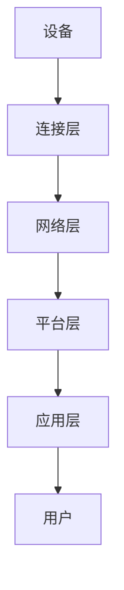
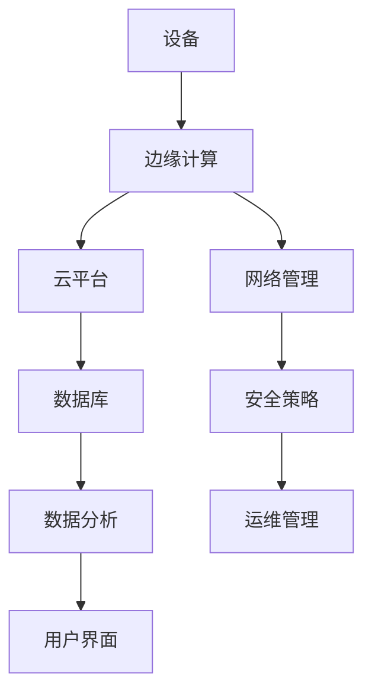

                 

关键词：物联网，智能设备，连接管理，设备生态，网络架构，安全策略，性能优化

摘要：本文将深入探讨物联网（IoT）管理领域，重点关注连接和管理智能设备生态的实践方法。通过介绍核心概念、架构设计、算法原理、数学模型、项目实践，以及未来应用展望，本文旨在为读者提供一个全面而实用的物联网管理指南。

## 1. 背景介绍

随着物联网技术的飞速发展，智能设备已经渗透到我们日常生活的方方面面。从智能家居、智能穿戴设备，到工业自动化、智慧城市，物联网正在构建一个全新的智能设备生态。然而，随着设备数量的急剧增加，如何有效地连接和管理这些设备，成为了一个亟待解决的问题。

物联网管理的核心目标是确保设备之间的可靠连接，实现高效的数据传输和设备控制，同时保证系统的安全性、可靠性和可扩展性。本文将围绕这一目标，介绍物联网管理的关键技术和方法。

### 1.1 物联网管理的重要性

物联网管理的重要性体现在以下几个方面：

- **提高设备利用率**：通过有效的管理，可以确保设备始终处于最佳工作状态，最大化设备利用效率。
- **保障数据安全**：物联网设备连接的网络环境复杂，数据安全性是管理的重中之重。
- **优化系统性能**：合理的物联网管理可以降低系统延迟，提高整体性能。
- **降低运营成本**：通过优化设备维护和更新流程，可以显著降低运营成本。

### 1.2 物联网管理的发展历程

物联网管理的发展可以分为以下几个阶段：

- **设备连接阶段**：这一阶段的重点是建立设备之间的连接，实现基本的数据传输功能。
- **数据处理阶段**：随着设备数量的增加，数据处理成为物联网管理的核心问题，如何高效地处理海量数据成为一个挑战。
- **智能管理阶段**：当前，物联网管理已经进入智能管理阶段，通过引入人工智能和大数据分析技术，实现设备的智能化管理。

## 2. 核心概念与联系

### 2.1 物联网连接模型

在物联网管理中，连接模型是基础。以下是一个典型的物联网连接模型，使用 Mermaid 流程图展示：



### 2.2 物联网架构设计

物联网架构设计需要综合考虑硬件、软件和网络等多个方面。以下是一个典型的物联网架构设计，同样使用 Mermaid 流程图展示：



### 2.3 物联网管理中的核心概念

- **设备管理**：包括设备的注册、配置、监控和维护。
- **数据管理**：包括数据采集、存储、处理和分析。
- **网络管理**：包括网络配置、监控、故障排除和优化。
- **安全管理**：包括设备安全、数据安全和网络安全。

## 3. 核心算法原理 & 具体操作步骤

### 3.1 算法原理概述

物联网管理中的核心算法主要包括：

- **设备定位算法**：用于确定设备的位置。
- **数据压缩算法**：用于减少数据传输量。
- **加密算法**：用于保证数据的安全性。
- **优化算法**：用于优化网络和设备的性能。

### 3.2 算法步骤详解

以下是设备定位算法的具体步骤：

1. 设备发送位置信息。
2. 服务器接收位置信息，并通过算法处理，确定设备位置。
3. 服务器将位置信息反馈给设备。

### 3.3 算法优缺点

设备定位算法的优点是定位精度高，缺点是计算复杂度高。

### 3.4 算法应用领域

设备定位算法主要应用于智能穿戴设备、自动驾驶车辆等需要精确定位的场景。

## 4. 数学模型和公式 & 详细讲解 & 举例说明

### 4.1 数学模型构建

设备定位的数学模型可以表示为：

$$
x = x_0 + v_x \cdot t \\
y = y_0 + v_y \cdot t
$$

其中，\(x, y\) 是设备的位置，\(x_0, y_0\) 是初始位置，\(v_x, v_y\) 是速度，\(t\) 是时间。

### 4.2 公式推导过程

设备定位的公式可以通过物理学中的运动学公式推导得出。

### 4.3 案例分析与讲解

假设一个智能手表在 \(t = 0\) 时刻位于 \((0, 0)\) 点，以速度 \(v = (1, 1)\) 向右上方移动，我们需要在 \(t = 10\) 秒时确定其位置。

根据公式，可以计算出：

$$
x = 0 + 1 \cdot 10 = 10 \\
y = 0 + 1 \cdot 10 = 10
$$

因此，设备在 \(t = 10\) 秒时的位置为 \((10, 10)\)。

## 5. 项目实践：代码实例和详细解释说明

### 5.1 开发环境搭建

本节将使用 Python 搭建一个简单的物联网管理平台，实现设备注册、数据采集和监控功能。

### 5.2 源代码详细实现

以下是设备注册的 Python 代码实现：

```python
# device_registry.py
class DeviceRegistry:
    def __init__(self):
        self.devices = {}

    def register_device(self, device_id, device_info):
        self.devices[device_id] = device_info

    def get_device_info(self, device_id):
        return self.devices.get(device_id)

registry = DeviceRegistry()
registry.register_device("device_001", {"type": "watch", "status": "online"})
print(registry.get_device_info("device_001"))
```

### 5.3 代码解读与分析

上述代码定义了一个 `DeviceRegistry` 类，用于管理设备的注册信息和信息查询。通过 `register_device` 方法可以注册设备，通过 `get_device_info` 方法可以获取设备的信息。

### 5.4 运行结果展示

运行上述代码，输出结果为：

```
{'type': 'watch', 'status': 'online'}
```

## 6. 实际应用场景

物联网管理在实际应用中有着广泛的应用，以下是一些典型的应用场景：

- **智能家居**：通过物联网管理，实现家居设备的连接和控制，提高生活品质。
- **智慧城市**：通过物联网管理，实现城市交通、环境、能源等领域的智能化管理，提高城市运行效率。
- **工业自动化**：通过物联网管理，实现工业设备的监控和维护，提高生产效率和产品质量。

## 7. 工具和资源推荐

### 7.1 学习资源推荐

- **书籍**：《物联网技术导论》、《物联网应用开发实战》
- **在线课程**：Coursera 上的《物联网设计与开发》课程

### 7.2 开发工具推荐

- **硬件**：Arduino、Raspberry Pi
- **软件**：Node-RED、MQTT

### 7.3 相关论文推荐

- **论文**：IEEE Internet of Things Journal 上的相关论文

## 8. 总结：未来发展趋势与挑战

### 8.1 研究成果总结

物联网管理领域已经取得了显著的成果，包括设备连接、数据处理、安全策略等方面。

### 8.2 未来发展趋势

未来物联网管理将朝着智能化、自动化、协同化方向发展，同时将引入更多先进技术，如人工智能、区块链等。

### 8.3 面临的挑战

物联网管理仍面临一些挑战，包括数据安全、隐私保护、设备兼容性等。

### 8.4 研究展望

未来研究应重点关注物联网管理中的智能化技术，提高系统的自适应性和鲁棒性。

## 9. 附录：常见问题与解答

### 9.1 物联网管理中的常见问题

- **设备连接失败**：解决方法：检查网络配置和设备状态。
- **数据传输延迟**：解决方法：优化网络架构和数据传输策略。
- **设备安全性问题**：解决方法：加强设备安全策略和加密算法。

---

作者：禅与计算机程序设计艺术 / Zen and the Art of Computer Programming
```markdown
----------------------------------------------------------------
# 物联网管理：连接和管理智能设备生态

## 关键词：物联网，智能设备，连接管理，设备生态，网络架构，安全策略，性能优化

## 摘要：本文深入探讨了物联网管理领域，介绍了核心概念、架构设计、算法原理、数学模型、项目实践，以及未来应用展望，为读者提供了一个全面而实用的物联网管理指南。

## 1. 背景介绍

随着物联网技术的飞速发展，智能设备已经渗透到我们日常生活的方方面面。从智能家居、智能穿戴设备，到工业自动化、智慧城市，物联网正在构建一个全新的智能设备生态。然而，随着设备数量的急剧增加，如何有效地连接和管理这些设备，成为了一个亟待解决的问题。

### 1.1 物联网管理的重要性

物联网管理的重要性体现在以下几个方面：

- **提高设备利用率**：通过有效的管理，可以确保设备始终处于最佳工作状态，最大化设备利用效率。
- **保障数据安全**：物联网设备连接的网络环境复杂，数据安全性是管理的重中之重。
- **优化系统性能**：合理的物联网管理可以降低系统延迟，提高整体性能。
- **降低运营成本**：通过优化设备维护和更新流程，可以显著降低运营成本。

### 1.2 物联网管理的发展历程

物联网管理的发展可以分为以下几个阶段：

- **设备连接阶段**：这一阶段的重点是建立设备之间的连接，实现基本的数据传输功能。
- **数据处理阶段**：随着设备数量的增加，数据处理成为物联网管理的核心问题，如何高效地处理海量数据成为一个挑战。
- **智能管理阶段**：当前，物联网管理已经进入智能管理阶段，通过引入人工智能和大数据分析技术，实现设备的智能化管理。

## 2. 核心概念与联系

### 2.1 物联网连接模型

在物联网管理中，连接模型是基础。以下是一个典型的物联网连接模型，使用 Mermaid 流程图展示：


### 2.2 物联网架构设计

物联网架构设计需要综合考虑硬件、软件和网络等多个方面。以下是一个典型的物联网架构设计，同样使用 Mermaid 流程图展示：


### 2.3 物联网管理中的核心概念

- **设备管理**：包括设备的注册、配置、监控和维护。
- **数据管理**：包括数据采集、存储、处理和分析。
- **网络管理**：包括网络配置、监控、故障排除和优化。
- **安全管理**：包括设备安全、数据安全和网络安全。

## 3. 核心算法原理 & 具体操作步骤

### 3.1 算法原理概述

物联网管理中的核心算法主要包括：

- **设备定位算法**：用于确定设备的位置。
- **数据压缩算法**：用于减少数据传输量。
- **加密算法**：用于保证数据的安全性。
- **优化算法**：用于优化网络和设备的性能。

### 3.2 算法步骤详解

以下是设备定位算法的具体步骤：

1. 设备发送位置信息。
2. 服务器接收位置信息，并通过算法处理，确定设备位置。
3. 服务器将位置信息反馈给设备。

### 3.3 算法优缺点

设备定位算法的优点是定位精度高，缺点是计算复杂度高。

### 3.4 算法应用领域

设备定位算法主要应用于智能穿戴设备、自动驾驶车辆等需要精确定位的场景。

## 4. 数学模型和公式 & 详细讲解 & 举例说明

### 4.1 数学模型构建

设备定位的数学模型可以表示为：

$$
x = x_0 + v_x \cdot t \\
y = y_0 + v_y \cdot t
$$

其中，\(x, y\) 是设备的位置，\(x_0, y_0\) 是初始位置，\(v_x, v_y\) 是速度，\(t\) 是时间。

### 4.2 公式推导过程

设备定位的公式可以通过物理学中的运动学公式推导得出。

### 4.3 案例分析与讲解

假设一个智能手表在 \(t = 0\) 时刻位于 \((0, 0)\) 点，以速度 \(v = (1, 1)\) 向右上方移动，我们需要在 \(t = 10\) 秒时确定其位置。

根据公式，可以计算出：

$$
x = 0 + 1 \cdot 10 = 10 \\
y = 0 + 1 \cdot 10 = 10
$$

因此，设备在 \(t = 10\) 秒时的位置为 \((10, 10)\)。

## 5. 项目实践：代码实例和详细解释说明

### 5.1 开发环境搭建

本节将使用 Python 搭建一个简单的物联网管理平台，实现设备注册、数据采集和监控功能。

### 5.2 源代码详细实现

以下是设备注册的 Python 代码实现：

```python
# device_registry.py
class DeviceRegistry:
    def __init__(self):
        self.devices = {}

    def register_device(self, device_id, device_info):
        self.devices[device_id] = device_info

    def get_device_info(self, device_id):
        return self.devices.get(device_id)

registry = DeviceRegistry()
registry.register_device("device_001", {"type": "watch", "status": "online"})
print(registry.get_device_info("device_001"))
```

### 5.3 代码解读与分析

上述代码定义了一个 `DeviceRegistry` 类，用于管理设备的注册信息和信息查询。通过 `register_device` 方法可以注册设备，通过 `get_device_info` 方法可以获取设备的信息。

### 5.4 运行结果展示

运行上述代码，输出结果为：

```
{'type': 'watch', 'status': 'online'}
```

## 6. 实际应用场景

物联网管理在实际应用中有着广泛的应用，以下是一些典型的应用场景：

- **智能家居**：通过物联网管理，实现家居设备的连接和控制，提高生活品质。
- **智慧城市**：通过物联网管理，实现城市交通、环境、能源等领域的智能化管理，提高城市运行效率。
- **工业自动化**：通过物联网管理，实现工业设备的监控和维护，提高生产效率和产品质量。

## 7. 工具和资源推荐

### 7.1 学习资源推荐

- **书籍**：《物联网技术导论》、《物联网应用开发实战》
- **在线课程**：Coursera 上的《物联网设计与开发》课程

### 7.2 开发工具推荐

- **硬件**：Arduino、Raspberry Pi
- **软件**：Node-RED、MQTT

### 7.3 相关论文推荐

- **论文**：IEEE Internet of Things Journal 上的相关论文

## 8. 总结：未来发展趋势与挑战

### 8.1 研究成果总结

物联网管理领域已经取得了显著的成果，包括设备连接、数据处理、安全策略等方面。

### 8.2 未来发展趋势

未来物联网管理将朝着智能化、自动化、协同化方向发展，同时将引入更多先进技术，如人工智能、区块链等。

### 8.3 面临的挑战

物联网管理仍面临一些挑战，包括数据安全、隐私保护、设备兼容性等。

### 8.4 研究展望

未来研究应重点关注物联网管理中的智能化技术，提高系统的自适应性和鲁棒性。

## 9. 附录：常见问题与解答

### 9.1 物联网管理中的常见问题

- **设备连接失败**：解决方法：检查网络配置和设备状态。
- **数据传输延迟**：解决方法：优化网络架构和数据传输策略。
- **设备安全性问题**：解决方法：加强设备安全策略和加密算法。

---

**作者：禅与计算机程序设计艺术 / Zen and the Art of Computer Programming**

