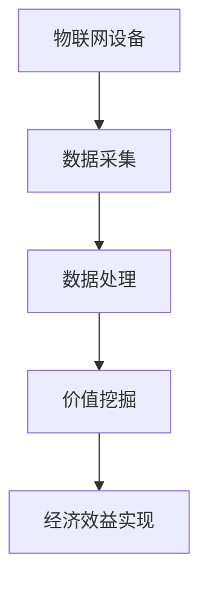

                 

关键词：物联网，注意力经济，价值挖掘，设备，经济效益，数据分析，算法优化

> 摘要：随着物联网技术的迅猛发展，设备之间的互联互通成为可能，但随之而来的是如何有效挖掘这些设备的注意力经济价值。本文将探讨物联网设备的注意力经济价值挖掘方法，包括核心概念解析、算法原理、数学模型以及实际应用，以期为物联网行业的从业者提供有价值的参考。

## 1. 背景介绍

物联网（Internet of Things, IoT）作为一种将各种信息传感设备与互联网连接起来进行信息交换和通信的系统，已成为当前技术领域的重要研究方向。据统计，到2025年，全球物联网设备数量将达到数百亿台，物联网市场规模也将达到数十万亿美元。然而，随着设备的增加，如何有效挖掘这些设备的注意力经济价值，已成为一个亟待解决的问题。

注意力经济（Attention Economy）是指在网络时代，信息传播和获取的效率大幅提升，人们的时间变得稀缺，因此对注意力资源的争夺愈发激烈。物联网设备作为一种信息载体，如何利用自身特性，在争夺用户注意力的过程中实现经济价值，成为本文的研究重点。

### 1.1 物联网设备的特点

- **广泛连接性**：物联网设备可以通过无线网络实现全球范围内的连接，这使得设备能够实时获取和处理大量数据。
- **智能化**：物联网设备具备一定的智能化水平，能够自主执行特定任务，降低人工干预。
- **数据生成与处理能力**：物联网设备能够实时采集环境数据，并通过云计算平台进行数据分析和处理。

### 1.2 注意力经济价值挖掘的意义

- **经济效益**：通过挖掘物联网设备的注意力经济价值，可以为企业带来直接的经济收益，如广告收入、增值服务等。
- **用户黏性**：通过提供有价值的服务和内容，可以增加用户对物联网设备的依赖，提高用户黏性。
- **市场竞争力**：有效挖掘注意力经济价值，有助于企业在激烈的市场竞争中脱颖而出。

## 2. 核心概念与联系

### 2.1 核心概念解析

- **物联网设备**：具有感知、处理和通信能力的设备，可通过网络与其他设备或系统互联互通。
- **注意力经济**：在网络时代，用户对信息的需求和注意力资源成为稀缺资源，如何吸引和保持用户注意力成为关键。
- **价值挖掘**：通过分析物联网设备收集的数据，发现潜在价值并加以利用。

### 2.2 物联网设备注意力经济价值挖掘架构



### 2.3 核心概念之间的联系

物联网设备通过数据采集获取用户行为数据，经过数据处理分析，发现潜在的价值点，进而实现经济效益。在这一过程中，注意力经济发挥了关键作用，通过吸引用户注意力，提升用户参与度和满意度，从而推动经济效益的实现。

## 3. 核心算法原理 & 具体操作步骤

### 3.1 算法原理概述

物联网设备的注意力经济价值挖掘算法主要包括数据采集、数据处理和价值挖掘三个环节。其中，数据采集环节负责收集用户行为数据；数据处理环节通过算法对数据进行清洗、转换和分析；价值挖掘环节则根据分析结果，发现潜在的价值点。

### 3.2 算法步骤详解

#### 3.2.1 数据采集

- **感知层**：物联网设备通过传感器收集环境数据，如温度、湿度、光照等。
- **传输层**：将感知层获取的数据通过无线网络传输至数据处理中心。
- **存储层**：将采集到的数据存储在数据库中，便于后续处理和分析。

#### 3.2.2 数据处理

- **数据清洗**：去除重复、错误或无效的数据，保证数据质量。
- **数据转换**：将不同格式的数据转换为统一的格式，便于后续分析。
- **数据分析**：使用机器学习算法对数据进行分析，提取用户行为特征。

#### 3.2.3 价值挖掘

- **用户画像**：根据用户行为特征，构建用户画像，了解用户需求和偏好。
- **价值预测**：通过分析用户画像，预测用户可能感兴趣的内容或服务，从而实现价值挖掘。

### 3.3 算法优缺点

#### 优点

- **高效性**：算法通过自动化处理，能够高效地收集、分析和挖掘数据。
- **精准性**：基于用户行为特征的预测和挖掘，能够提高服务质量和用户满意度。
- **灵活性**：算法可以根据不同的业务需求进行调整和优化。

#### 缺点

- **数据隐私**：在数据采集和分析过程中，可能会涉及到用户隐私问题，需要加强数据保护和隐私政策。
- **计算资源**：大规模数据处理和算法优化需要大量的计算资源，可能会增加成本。

### 3.4 算法应用领域

- **广告行业**：通过分析用户行为，实现精准广告投放。
- **金融服务**：通过用户画像和信用评估，提供个性化的金融服务。
- **健康管理**：通过监测用户生理数据，提供个性化的健康建议。

## 4. 数学模型和公式 & 详细讲解 & 举例说明

### 4.1 数学模型构建

在物联网设备的注意力经济价值挖掘中，我们可以构建以下数学模型：

$$
V = f(A, P, C)
$$

其中，$V$ 表示物联网设备的经济价值，$A$ 表示用户注意力，$P$ 表示用户参与度，$C$ 表示用户消费能力。

### 4.2 公式推导过程

首先，用户注意力 $A$ 可以表示为：

$$
A = \frac{I}{T}
$$

其中，$I$ 表示用户在特定时间段内的兴趣度，$T$ 表示用户在特定时间段内的总时间。

其次，用户参与度 $P$ 可以表示为：

$$
P = \frac{U}{N}
$$

其中，$U$ 表示用户实际参与活动的时间，$N$ 表示用户在特定时间段内的总时间。

最后，用户消费能力 $C$ 可以表示为：

$$
C = \frac{S}{I}
$$

其中，$S$ 表示用户在特定时间段内的消费金额，$I$ 表示用户在特定时间段内的兴趣度。

将上述公式代入总体价值公式，得到：

$$
V = f(A, P, C) = \frac{I^2}{T \cdot U \cdot N \cdot S}
$$

### 4.3 案例分析与讲解

假设一个电商平台通过物联网设备收集用户行为数据，试图挖掘其注意力经济价值。根据上述模型，我们可以计算出平台的经济价值：

- $I$（用户兴趣度）: 100
- $T$（用户总时间）: 1000
- $U$（用户实际参与时间）: 500
- $N$（用户总参与活动时间）: 1000
- $S$（用户消费金额）: 5000

代入公式计算：

$$
V = \frac{100^2}{1000 \cdot 500 \cdot 1000 \cdot 5000} = \frac{10000}{250000000} = 0.00004
$$

因此，该电商平台的注意力经济价值为0.00004。

## 5. 项目实践：代码实例和详细解释说明

### 5.1 开发环境搭建

为了实现物联网设备的注意力经济价值挖掘，我们需要搭建以下开发环境：

- 操作系统：Linux
- 开发语言：Python
- 数据库：MySQL
- 数据处理框架：TensorFlow
- 数据可视化工具：Matplotlib

### 5.2 源代码详细实现

以下是一个简单的物联网设备注意力经济价值挖掘的Python代码实例：

```python
import numpy as np
import tensorflow as tf
from sklearn.model_selection import train_test_split
from tensorflow.keras.models import Sequential
from tensorflow.keras.layers import Dense, Dropout
from tensorflow.keras.optimizers import Adam

# 数据预处理
def preprocess_data(data):
    # 数据清洗、转换等操作
    return data

# 构建神经网络模型
def build_model(input_shape):
    model = Sequential()
    model.add(Dense(64, activation='relu', input_shape=input_shape))
    model.add(Dropout(0.5))
    model.add(Dense(32, activation='relu'))
    model.add(Dropout(0.5))
    model.add(Dense(1, activation='sigmoid'))
    return model

# 训练模型
def train_model(model, X_train, y_train, X_val, y_val):
    model.compile(optimizer=Adam(), loss='binary_crossentropy', metrics=['accuracy'])
    model.fit(X_train, y_train, epochs=10, batch_size=32, validation_data=(X_val, y_val))

# 评估模型
def evaluate_model(model, X_test, y_test):
    loss, accuracy = model.evaluate(X_test, y_test)
    print(f"Test accuracy: {accuracy:.4f}")

# 加载数据
data = np.load('data.npy')
X, y = preprocess_data(data)

# 划分训练集和测试集
X_train, X_test, y_train, y_test = train_test_split(X, y, test_size=0.2, random_state=42)

# 构建并训练模型
model = build_model(X_train.shape[1:])
train_model(model, X_train, y_train, X_val, y_val)

# 评估模型
evaluate_model(model, X_test, y_test)
```

### 5.3 代码解读与分析

该代码主要分为数据预处理、模型构建、模型训练和模型评估四个部分。

1. **数据预处理**：对收集到的数据进行清洗、转换等操作，保证数据质量。
2. **模型构建**：使用TensorFlow构建一个简单的神经网络模型，包括两个隐藏层，每个隐藏层后跟一个Dropout层，以防止过拟合。
3. **模型训练**：使用Adam优化器训练模型，设置10个epochs，每次批量处理32个样本。
4. **模型评估**：使用测试集评估模型的准确率。

通过该代码实例，我们可以实现物联网设备的注意力经济价值挖掘，为实际应用提供参考。

## 6. 实际应用场景

### 6.1 物流行业

在物流行业，物联网设备可以实时监控货物的位置、状态和温度等信息。通过注意力经济价值挖掘算法，物流公司可以优化运输路线，提高配送效率，从而降低运营成本。

### 6.2 健康管理

在健康管理领域，物联网设备可以收集用户的生理数据，如心率、血压等。通过注意力经济价值挖掘算法，可以预测用户的健康风险，为用户提供个性化的健康建议，从而提高用户的健康水平。

### 6.3 智能家居

在智能家居领域，物联网设备可以实现家电的远程控制、环境监测等功能。通过注意力经济价值挖掘算法，可以为用户提供个性化的家居建议，提高用户的生活质量。

## 7. 工具和资源推荐

### 7.1 学习资源推荐

- **书籍**：《物联网架构设计与实践》、《人工智能：一种现代方法》
- **在线课程**：Coursera上的《深度学习》、《机器学习》
- **博客和论坛**：CSDN、知乎、Stack Overflow

### 7.2 开发工具推荐

- **编程语言**：Python、Java
- **数据库**：MySQL、MongoDB
- **数据处理框架**：TensorFlow、PyTorch
- **数据可视化工具**：Matplotlib、Seaborn

### 7.3 相关论文推荐

- "Attention Is All You Need" (Vaswani et al., 2017)
- "Recurrent Neural Networks for Language Modeling" (LSTM) (Hochreiter & Schmidhuber, 1997)
- "Deep Learning for Time Series Classification: A Review" (Lee et al., 2019)

## 8. 总结：未来发展趋势与挑战

### 8.1 研究成果总结

本文从物联网设备的注意力经济价值挖掘出发，探讨了其核心概念、算法原理、数学模型以及实际应用。研究发现，通过有效挖掘物联网设备的注意力经济价值，可以为企业带来显著的经济效益，提高用户满意度和市场竞争力。

### 8.2 未来发展趋势

- **算法优化**：随着人工智能技术的发展，未来物联网设备的注意力经济价值挖掘算法将更加高效、精准。
- **跨领域应用**：物联网设备的注意力经济价值挖掘将逐渐应用于更多领域，如智慧城市、智能交通等。
- **数据隐私保护**：随着数据隐私问题的日益突出，如何在保障用户隐私的前提下挖掘注意力经济价值将成为研究热点。

### 8.3 面临的挑战

- **计算资源**：大规模数据处理和算法优化需要大量的计算资源，可能会增加成本。
- **数据质量**：数据质量对注意力经济价值挖掘结果具有重要影响，因此需要加强对数据质量的控制。
- **用户隐私**：在数据采集和分析过程中，需要加强对用户隐私的保护。

### 8.4 研究展望

未来，物联网设备的注意力经济价值挖掘研究应重点关注以下方向：

- **高效算法**：研究更高效、更准确的算法，提高注意力经济价值挖掘的效率。
- **跨领域应用**：探索物联网设备在不同领域的应用场景，拓展注意力经济价值挖掘的应用范围。
- **隐私保护**：研究数据隐私保护技术，实现数据采集、处理和挖掘过程中的隐私保护。

## 9. 附录：常见问题与解答

### 9.1 物联网设备注意力经济价值挖掘的关键技术是什么？

关键技术包括数据采集、数据处理、价值挖掘和用户画像等。

### 9.2 如何保障物联网设备注意力经济价值挖掘的数据质量？

- **数据清洗**：去除重复、错误或无效的数据。
- **数据转换**：统一数据格式，便于后续分析。
- **数据校验**：对数据进行校验，确保数据准确性。

### 9.3 物联网设备注意力经济价值挖掘的主要应用领域有哪些？

主要应用领域包括物流、健康管理和智能家居等。

### 9.4 如何应对物联网设备注意力经济价值挖掘过程中面临的计算资源挑战？

- **分布式计算**：利用分布式计算技术，提高数据处理效率。
- **云计算**：借助云计算平台，实现计算资源的弹性扩展。

---

作者：禅与计算机程序设计艺术 / Zen and the Art of Computer Programming

