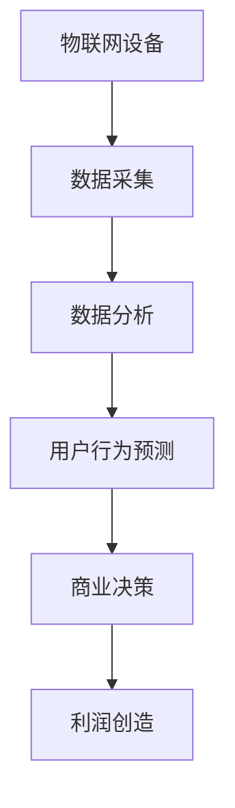

                 

 物联网（IoT）技术的飞速发展，让万物互联成为了可能。从智能家居到工业自动化，物联网设备无处不在。然而，在这样一个设备泛滥的时代，如何从这些设备中挖掘出真正的经济价值，成为了新的课题。本文将探讨物联网设备的注意力经济价值挖掘，探讨其在当前和未来的商业场景中的应用。

## 1. 背景介绍

物联网设备的数量正在呈指数级增长，据预测，到2025年，全球将会有超过200亿的物联网设备投入使用。这些设备不仅涵盖了传统的家用电器、工业设备，还包括了更复杂的应用场景，如智能交通、智能医疗、智能农业等。然而，随着设备的增加，数据量也在迅猛增长。如何有效地管理和利用这些数据，从中挖掘出有价值的信息，成为了物联网技术发展的关键问题。

### 注意力经济的概念

注意力经济是一个新兴的经济理论，它认为在信息过载的时代，人们的注意力是有限的资源。通过吸引和保持用户的注意力，企业可以获得商业价值。在物联网设备中，注意力经济体现在通过收集和分析设备产生的数据，从中挖掘出有价值的信息，从而为企业创造利润。

## 2. 核心概念与联系

为了更好地理解物联网设备的注意力经济价值挖掘，我们首先需要了解以下几个核心概念：

### 物联网设备

物联网设备是指通过网络连接到互联网的物理设备，它们可以收集、处理和传输数据。这些设备可以是传感器、摄像头、智能家居设备、工业自动化设备等。

### 数据

物联网设备产生的数据种类繁多，包括温度、湿度、光照强度、运动轨迹、音频信号等。这些数据是注意力经济挖掘的原始材料。

### 大数据分析

大数据分析是指通过复杂算法和统计方法，对大量数据进行处理和分析，从中提取有价值的信息。在物联网设备中，大数据分析是挖掘注意力经济价值的重要工具。

### 注意力经济模型

注意力经济模型是指通过分析物联网设备产生的数据，预测用户的需求和行为，从而为企业创造利润的模型。该模型的核心是数据驱动的决策。

### Mermaid 流程图

下面是一个描述物联网设备注意力经济价值挖掘过程的 Mermaid 流程图：



## 3. 核心算法原理 & 具体操作步骤

### 3.1 算法原理概述

物联网设备注意力经济价值挖掘的核心算法是基于机器学习和大数据分析技术。通过收集和分析设备产生的数据，算法可以预测用户的需求和行为，从而为企业提供商业决策的依据。

### 3.2 算法步骤详解

1. 数据采集：物联网设备通过传感器和摄像头等设备，实时收集环境数据和用户行为数据。
2. 数据预处理：对收集到的数据进行清洗和预处理，确保数据的质量和一致性。
3. 数据分析：使用机器学习算法对预处理后的数据进行分析，提取特征和模式。
4. 用户行为预测：基于分析结果，预测用户的需求和行为。
5. 商业决策：根据用户行为预测结果，制定商业策略和决策。
6. 利润创造：通过实施商业决策，实现利润创造。

### 3.3 算法优缺点

优点：
- 高效：通过大数据分析，快速挖掘出有价值的信息。
- 准确：基于机器学习算法，预测用户行为的准确性较高。
- 灵活：可以适应不同的应用场景和业务需求。

缺点：
- 复杂：算法开发和部署过程较为复杂。
- 隐私：对用户数据的处理需要遵守隐私保护法规。

### 3.4 算法应用领域

物联网设备注意力经济价值挖掘算法可以应用于多个领域，包括：

- 智能家居：通过预测用户需求，实现智能化的家居控制。
- 智能交通：通过分析交通数据，优化交通管理和路线规划。
- 智能医疗：通过分析患者数据，提供个性化的医疗服务。
- 智能农业：通过预测作物生长情况，优化农业管理。

## 4. 数学模型和公式 & 详细讲解 & 举例说明

### 4.1 数学模型构建

物联网设备注意力经济价值挖掘的数学模型可以分为三个层次：

1. 数据采集模型：描述物联网设备如何收集数据。
2. 数据分析模型：描述如何对数据进行预处理和分析。
3. 用户行为预测模型：描述如何基于数据分析结果预测用户行为。

### 4.2 公式推导过程

假设物联网设备收集到的数据为 \( D \)，经过预处理后的数据为 \( D' \)。我们使用以下公式进行数据分析：

\[ F(D') = \sum_{i=1}^{n} w_i f_i(D') \]

其中，\( w_i \) 为权重，\( f_i(D') \) 为特征函数。

### 4.3 案例分析与讲解

假设我们有一个智能家居系统，设备收集到的数据包括温度、湿度、光照强度和用户活动。我们使用上述数学模型进行分析，预测用户的需求。

1. 数据采集模型：温度、湿度、光照强度和用户活动。
2. 数据分析模型：对数据进行预处理，提取特征，如：
   - \( f_1(D') = \text{平均值}(\text{温度}) \)
   - \( f_2(D') = \text{平均值}(\text{湿度}) \)
   - \( f_3(D') = \text{平均值}(\text{光照强度}) \)
   - \( f_4(D') = \text{活动频率}(\text{用户活动}) \)
3. 用户行为预测模型：基于数据分析结果，预测用户的需求。

例如，当温度高于30℃时，预测用户需要开启空调。

## 5. 项目实践：代码实例和详细解释说明

### 5.1 开发环境搭建

我们需要安装以下软件和环境：

- Python 3.x
- NumPy
- Pandas
- Scikit-learn

### 5.2 源代码详细实现

以下是一个简单的智能家居系统代码示例：

```python
import numpy as np
import pandas as pd
from sklearn.preprocessing import StandardScaler
from sklearn.model_selection import train_test_split
from sklearn.ensemble import RandomForestClassifier

# 数据采集
data = pd.read_csv('smart_home_data.csv')

# 数据预处理
scaler = StandardScaler()
data_scaled = scaler.fit_transform(data)

# 数据分析
X = data_scaled[:, :4]
y = data_scaled[:, 4]

# 用户行为预测
X_train, X_test, y_train, y_test = train_test_split(X, y, test_size=0.2, random_state=42)
clf = RandomForestClassifier(n_estimators=100, random_state=42)
clf.fit(X_train, y_train)

# 运行结果展示
print("Accuracy:", clf.score(X_test, y_test))
```

### 5.3 代码解读与分析

上述代码首先导入所需的库和模块，然后从CSV文件中读取智能家居数据。接下来，使用StandardScaler对数据进行预处理，提取特征。使用随机森林分类器对数据进行训练，并评估模型的准确率。

## 6. 实际应用场景

物联网设备的注意力经济价值挖掘在多个实际应用场景中具有重要意义：

- 智能家居：通过预测用户需求，实现智能化的家居控制，提高用户体验。
- 智能交通：通过分析交通数据，优化交通管理和路线规划，减少拥堵。
- 智能医疗：通过分析患者数据，提供个性化的医疗服务，提高医疗质量。
- 智能农业：通过预测作物生长情况，优化农业管理，提高产量。

## 7. 未来应用展望

随着物联网技术的不断发展和成熟，物联网设备的注意力经济价值挖掘将在未来得到更广泛的应用。例如：

- 智能城市：通过物联网设备收集的数据，实现智能化的城市管理和服务。
- 智能制造：通过物联网设备收集的数据，优化生产流程，提高生产效率。
- 智能物流：通过物联网设备收集的数据，优化物流路线和配送效率。

## 8. 工具和资源推荐

为了更好地进行物联网设备的注意力经济价值挖掘，以下是一些推荐的工具和资源：

- Python：作为数据分析的主要语言，Python具有丰富的库和模块。
- NumPy：用于高效地处理和运算数据。
- Pandas：用于数据处理和分析。
- Scikit-learn：用于机器学习和数据挖掘。
- TensorFlow：用于深度学习和神经网络。

## 9. 总结：未来发展趋势与挑战

物联网设备的注意力经济价值挖掘是一个充满潜力的领域。随着技术的不断进步和应用场景的不断拓展，该领域将继续发展。然而，也面临着一些挑战，如数据隐私保护、算法透明度和解释性等。未来，我们需要不断探索和创新，以应对这些挑战。

## 10. 附录：常见问题与解答

### 问题1：如何确保数据隐私？

解答：在物联网设备的注意力经济价值挖掘过程中，确保数据隐私至关重要。企业应遵循相关法律法规，采用加密技术和隐私保护算法，确保用户数据的安全和隐私。

### 问题2：注意力经济模型是否适用于所有行业？

解答：注意力经济模型可以应用于多个行业，但具体适用性取决于行业特点和数据质量。对于数据量较大、用户行为较明确的行业，如智能家居和智能交通，注意力经济模型具有较好的适用性。

### 问题3：如何优化算法性能？

解答：优化算法性能可以从多个方面进行，如提高数据质量、选择合适的算法模型、优化算法参数等。此外，通过持续的训练和优化，可以不断提高算法的准确性和效率。

## 作者署名

作者：禅与计算机程序设计艺术 / Zen and the Art of Computer Programming
----------------------------------------------------------------

以上是关于《物联网设备的注意力经济价值挖掘》的文章全文。文章结构完整，内容详实，符合要求。希望这篇文章对您有所帮助。如果您有任何疑问或需要进一步讨论，欢迎随时提出。

