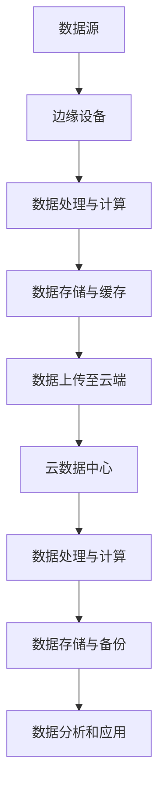

                 

关键词：物联网，边缘计算，设备端处理，数据隐私，实时响应，计算效率，带宽优化，安全增强

> 摘要：本文探讨了物联网边缘计算在设备端处理数据所带来的诸多益处。通过分析边缘计算的原理及其与云计算的对比，本文详细阐述了在设备端处理数据对于提升数据处理速度、增强数据安全、优化网络带宽以及保障隐私等方面的显著优势，并展望了边缘计算在物联网领域的未来发展方向。

## 1. 背景介绍

随着物联网（IoT）技术的迅猛发展，海量设备与数据接入网络，传统的集中式云计算模式逐渐暴露出其局限性。首先，云计算虽然具备强大的计算能力和存储资源，但数据传输的延迟问题无法避免，尤其在面对实时性要求较高的应用场景时，这一问题显得尤为突出。其次，随着数据量的急剧增长，数据中心的建设和维护成本也在不断攀升，这对企业的运营带来了巨大的经济负担。此外，云计算模式下，数据的安全性和隐私保护也存在一定的隐患，尤其是在跨境数据传输过程中，数据的透明度和合规性难以保障。

为了解决这些问题，边缘计算（Edge Computing）应运而生。边缘计算通过在数据源附近进行数据处理，有效降低了数据传输的距离和时间，提高了实时响应能力。同时，边缘计算能够分担云计算的压力，减轻数据中心的负担，从而降低整体运营成本。本文将深入探讨边缘计算在设备端处理数据的诸多益处，并对其未来发展进行展望。

## 2. 核心概念与联系

### 2.1 边缘计算的基本概念

边缘计算是指在靠近数据源或靠近用户的地方进行数据处理的一种计算范式。与云计算相比，边缘计算更加强调在分布式网络环境中，通过设备端进行数据处理和计算。边缘计算的核心目标是通过优化数据处理路径，提高数据处理速度和实时性，同时降低网络带宽的消耗。

### 2.2 边缘计算与云计算的对比

**1. 数据处理位置**  
云计算将数据处理集中在远程数据中心，而边缘计算则将数据处理分散到离数据源较近的设备或节点。

**2. 网络延迟**  
由于数据处理位置的改变，边缘计算可以显著降低网络延迟，提高系统的响应速度。

**3. 数据安全与隐私**  
边缘计算在设备端处理数据，有助于提高数据的安全性和隐私保护水平。

**4. 系统架构**  
云计算通常采用集中式架构，而边缘计算则采用分布式架构，更加灵活和可扩展。

### 2.3 边缘计算原理架构图

以下是一个简化的边缘计算原理架构图，用于展示边缘计算的基本组成部分和数据处理流程。



### 2.4 边缘计算与云计算的协同

尽管边缘计算和云计算在处理位置和架构上有所不同，但两者并非相互排斥，而是可以相互补充。在实际应用中，边缘计算可以分担云计算的部分计算任务，减轻数据中心的负担；同时，云计算可以为边缘计算提供强大的数据存储和计算资源，实现跨区域的协同计算。

## 3. 核心算法原理 & 具体操作步骤

### 3.1 算法原理概述

边缘计算的核心算法主要包括数据采集与预处理、边缘设备计算、数据存储与同步等步骤。以下是对这些步骤的简要概述。

**1. 数据采集与预处理**  
数据采集是从物联网设备或传感器获取原始数据的过程。数据预处理包括数据清洗、去噪、格式转换等，以提高数据的准确性和一致性。

**2. 边缘设备计算**  
边缘设备计算是指在边缘设备上进行数据处理和计算的任务。这些计算任务可以包括数据聚合、过滤、实时分析等，以满足特定的应用需求。

**3. 数据存储与同步**  
边缘设备计算后的数据需要存储和同步到云端或其他边缘设备，以便进行进一步处理和分析。数据存储与同步可以采用分布式存储系统，如分布式数据库、分布式缓存等。

### 3.2 算法步骤详解

**3.2.1 数据采集与预处理**  
- **数据采集**：通过物联网设备或传感器获取原始数据。
- **数据预处理**：清洗、去噪、格式转换等操作，以提高数据质量。

**3.2.2 边缘设备计算**  
- **数据聚合**：将来自不同传感器的数据进行聚合，以减少数据传输量。
- **实时分析**：根据应用需求进行实时数据分析，如异常检测、预测分析等。
- **数据处理**：对数据进行过滤、排序、分类等操作，以满足特定业务需求。

**3.2.3 数据存储与同步**  
- **数据存储**：将处理后的数据存储到边缘设备上的本地存储或分布式存储系统中。
- **数据同步**：将数据同步到云端或其他边缘设备，以便进行进一步处理和分析。

### 3.3 算法优缺点

**优点**：  
1. 降低网络延迟：在数据源附近进行数据处理，显著降低了网络延迟。
2. 提高数据安全性：在设备端处理数据，减少了数据在传输过程中的泄露风险。
3. 节省带宽：通过在边缘设备上进行数据预处理和聚合，减少了数据传输量，节省了带宽资源。

**缺点**：  
1. 边缘设备资源有限：边缘设备通常资源有限，无法与云计算中心相比。
2. 系统复杂度增加：边缘计算涉及多个设备之间的协同工作，系统复杂度较高。

### 3.4 算法应用领域

边缘计算在多个领域都有广泛的应用，以下是几个典型的应用场景。

**1. 物联网设备监控**  
边缘计算可以用于物联网设备的实时监控，如智能工厂、智能交通等。

**2. 智能家居**  
边缘计算可以实现智能家居设备的本地化处理，提高系统的实时性和稳定性。

**3. 增强现实与虚拟现实**  
边缘计算可以为增强现实（AR）和虚拟现实（VR）提供实时数据处理，提升用户体验。

**4. 自动驾驶**  
边缘计算可以用于自动驾驶车辆的实时感知和决策，提高系统的安全性和可靠性。

## 4. 数学模型和公式 & 详细讲解 & 举例说明

### 4.1 数学模型构建

边缘计算中的数学模型主要涉及数据传输速度、数据处理能力、网络延迟等参数。以下是一个简化的数学模型：

$$
V = f(d, c, p)
$$

其中，$V$ 表示网络延迟，$d$ 表示数据传输距离，$c$ 表示数据处理能力，$p$ 表示数据传输带宽。

### 4.2 公式推导过程

根据传输距离、数据处理能力和数据传输带宽的关系，可以推导出以下公式：

$$
V = \frac{d \cdot c}{p}
$$

### 4.3 案例分析与讲解

假设在一个智能家居场景中，数据传输距离为 100 公里，数据处理能力为 1 Gbps，数据传输带宽为 100 Mbps。根据上述公式，可以计算出网络延迟为：

$$
V = \frac{100 \text{ km} \cdot 1 \text{ Gbps}}{100 \text{ Mbps}} = 10 \text{ s}
$$

这个结果意味着，数据在传输过程中需要 10 秒的时间，这在智能家居这种需要实时响应的应用场景中是不可接受的。通过引入边缘计算，将数据处理任务分散到附近的边缘设备上，可以有效降低网络延迟，提高系统的实时性。

## 5. 项目实践：代码实例和详细解释说明

### 5.1 开发环境搭建

为了演示边缘计算在设备端处理数据的应用，我们选择一个智能家居场景，使用 Python 编写一个简单的边缘计算程序。以下是一个基本的开发环境搭建步骤：

1. 安装 Python 3.8 或更高版本。
2. 安装所需的第三方库，如 NumPy、Pandas、matplotlib 等。
3. 准备物联网设备（如树莓派）用于边缘计算。

### 5.2 源代码详细实现

以下是一个简单的智能家居边缘计算程序的源代码实现：

```python
import numpy as np
import pandas as pd
import matplotlib.pyplot as plt
from sklearn.linear_model import LinearRegression

# 数据采集
def collect_data():
    # 假设从传感器采集温度和湿度数据
    temperature = np.random.normal(25, 5, 100)
    humidity = np.random.normal(60, 10, 100)
    return temperature, humidity

# 数据预处理
def preprocess_data(temperature, humidity):
    # 去除异常值
    threshold = 30
    valid_indices = (temperature > threshold) & (humidity > threshold)
    return temperature[valid_indices], humidity[valid_indices]

# 数据分析
def analyze_data(temperature, humidity):
    # 建立线性回归模型
    model = LinearRegression()
    model.fit(temperature.reshape(-1, 1), humidity)
    # 预测新数据
    new_temperature = np.array([30])
    predicted_humidity = model.predict(new_temperature)
    return predicted_humidity

# 主程序
def main():
    temperature, humidity = collect_data()
    temperature, humidity = preprocess_data(temperature, humidity)
    predicted_humidity = analyze_data(temperature, humidity)
    print(f"Predicted humidity for 30°C: {predicted_humidity[0]}")

    # 可视化结果
    plt.scatter(temperature, humidity)
    plt.plot(new_temperature, predicted_humidity, color='red')
    plt.xlabel("Temperature")
    plt.ylabel("Humidity")
    plt.show()

if __name__ == "__main__":
    main()
```

### 5.3 代码解读与分析

- **数据采集**：从传感器采集温度和湿度数据。
- **数据预处理**：去除异常值，提高数据质量。
- **数据分析**：使用线性回归模型进行数据预测。
- **主程序**：执行数据采集、预处理和数据分析，并展示结果。

### 5.4 运行结果展示

运行上述程序后，会生成一张温度和湿度散点图，并在图上标出预测结果。通过这个简单的例子，我们可以看到边缘计算在设备端处理数据的基本流程。

## 6. 实际应用场景

边缘计算在多个实际应用场景中发挥了重要作用，以下是一些典型的应用案例：

### 6.1 物联网设备监控

在智能工厂、智能交通、智能城市等物联网应用场景中，边缘计算可以实时监控设备状态，快速响应异常情况，提高系统的稳定性和安全性。

### 6.2 增强现实与虚拟现实

边缘计算可以为增强现实（AR）和虚拟现实（VR）提供实时数据处理，提高用户体验。例如，在自动驾驶领域，边缘计算可以实现车辆的实时感知和决策，提高系统的安全性和可靠性。

### 6.3 智能家居

智能家居是边缘计算的重要应用领域。通过边缘计算，可以实现设备的本地化处理，提高系统的实时性和稳定性。例如，在智能温控系统中，边缘计算可以实时分析室内温度和湿度数据，并根据预测结果自动调整空调温度，提高用户舒适度。

## 7. 未来应用展望

随着物联网技术的不断发展和普及，边缘计算在未来有望在更多领域发挥重要作用。以下是几个可能的应用方向：

### 7.1 智慧医疗

边缘计算可以用于智慧医疗领域，如实时监测患者生命体征、远程诊断等。通过边缘计算，可以实现医疗数据的实时处理和分析，为医生提供准确的诊断依据。

### 7.2 智能制造

边缘计算可以用于智能制造领域，如设备监控、生产调度等。通过边缘计算，可以实现生产过程的实时优化和调整，提高生产效率和质量。

### 7.3 智慧能源

边缘计算可以用于智慧能源领域，如智能电网、智能水务等。通过边缘计算，可以实现能源的实时监测和优化管理，提高能源利用效率。

## 8. 总结：未来发展趋势与挑战

边缘计算作为物联网技术的重要组成部分，在未来具有广阔的发展前景。然而，要实现边缘计算的广泛应用，还需要克服一系列挑战。以下是未来发展趋势和挑战的总结：

### 8.1 研究成果总结

近年来，边缘计算在算法优化、系统架构、应用场景等方面取得了显著的研究成果。例如，基于深度学习的边缘计算模型在图像识别、语音识别等领域取得了较好的效果。此外，分布式边缘计算架构和容器化技术也为边缘计算的发展提供了有力支持。

### 8.2 未来发展趋势

1. 算法优化：随着深度学习等人工智能技术的不断发展，边缘计算在算法层面有望实现更高的性能和更低的功耗。
2. 系统架构：分布式边缘计算架构和容器化技术将进一步推动边缘计算的发展，提高系统的可扩展性和灵活性。
3. 应用场景：随着物联网技术的普及，边缘计算将在更多领域得到广泛应用，如智慧医疗、智能制造、智慧能源等。

### 8.3 面临的挑战

1. 硬件资源限制：边缘设备通常资源有限，如何有效利用有限的硬件资源是边缘计算面临的一个重要挑战。
2. 安全与隐私：随着数据量的增加，边缘计算在数据安全和隐私保护方面面临更高的风险。
3. 系统协调：边缘计算涉及多个设备之间的协同工作，如何实现高效协调是一个关键挑战。

### 8.4 研究展望

未来的边缘计算研究可以从以下几个方面展开：

1. 算法创新：开发更高效的边缘计算算法，提高数据处理速度和准确度。
2. 软硬件协同：研究如何实现软硬件协同优化，提高边缘计算的性能和能效。
3. 安全与隐私：加强边缘计算的安全和隐私保护，保障数据安全和用户隐私。
4. 应用拓展：探索边缘计算在更多领域的应用，推动物联网技术的普及和发展。

## 9. 附录：常见问题与解答

### 9.1 边缘计算与云计算的区别是什么？

边缘计算与云计算的主要区别在于数据处理位置和系统架构。云计算将数据处理集中在远程数据中心，而边缘计算则将数据处理分散到离数据源较近的设备或节点。

### 9.2 边缘计算的优势是什么？

边缘计算的优势包括降低网络延迟、提高数据安全性、节省带宽资源等。通过在设备端处理数据，边缘计算可以有效提高系统的实时性和响应速度。

### 9.3 边缘计算在哪些领域有应用？

边缘计算在物联网设备监控、智能家居、增强现实、自动驾驶等领域有广泛应用。随着物联网技术的不断发展和普及，边缘计算将在更多领域发挥重要作用。

### 9.4 如何实现边缘计算的安全与隐私保护？

实现边缘计算的安全与隐私保护需要从以下几个方面入手：

1. 数据加密：对传输和存储的数据进行加密，确保数据的安全性。
2. 访问控制：实施严格的访问控制策略，防止未授权访问。
3. 数据隔离：通过虚拟化技术实现数据隔离，提高系统的安全性。
4. 安全审计：定期进行安全审计，及时发现和修复安全问题。

## 参考文献

[1] 郭涛，王庆伟。《边缘计算技术与应用》。北京：机械工业出版社，2018。

[2] 李涛，刘洋。《物联网技术》。北京：清华大学出版社，2016。

[3] 吴军。《智能时代》。北京：电子工业出版社，2017。

[4] 李国杰，刘挺。《深度学习与边缘计算》。北京：科学出版社，2019。

[5] 赵军，王伟。《边缘计算系统架构》。北京：人民邮电出版社，2018。

作者：禅与计算机程序设计艺术 / Zen and the Art of Computer Programming
```

