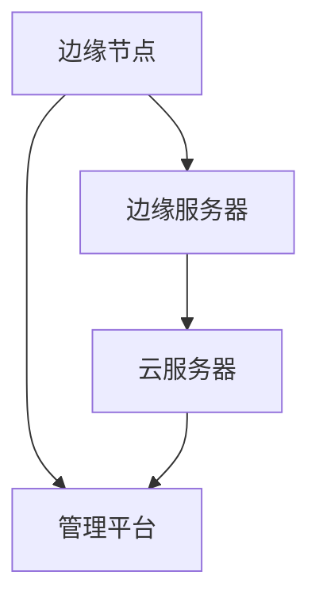

                 

物联网（IoT）的迅速发展，使得边缘计算成为了当前信息技术领域的一个重要热点。边缘计算不仅能够减轻中心服务器的负担，还能够提供更加实时、高效的数据处理能力。本文将围绕物联网边缘计算应用开发，探讨其核心概念、算法原理、数学模型以及实际应用场景，旨在为开发者提供一份全面的技术指南。

## 文章关键词

- 物联网
- 边缘计算
- 应用开发
- 数据处理
- 实时性

## 文章摘要

本文首先介绍了物联网边缘计算的基本概念和背景，随后详细阐述了边缘计算的核心算法原理以及数学模型。通过具体的案例分析和项目实践，本文深入探讨了边缘计算在实际应用中的优势与挑战。最后，本文提出了未来边缘计算应用发展的趋势以及可能面临的挑战，并为开发者推荐了相关工具和资源。

## 1. 背景介绍

### 物联网的崛起

随着物联网技术的不断成熟，各种智能设备迅速普及，产生了海量的数据。传统的中心化数据处理模式已经难以应对如此庞大的数据量，同时也带来了严重的性能瓶颈和延迟问题。为了解决这些问题，边缘计算作为一种分布式计算模式应运而生。

### 边缘计算的定义

边缘计算是指在靠近数据源或用户的地方进行数据处理和计算的技术。它将计算任务从中心服务器转移到网络边缘，即接近数据产生的地方，从而降低了数据传输的延迟，提高了系统的响应速度。

### 边缘计算的必要性

边缘计算能够解决以下几个关键问题：

- **数据传输延迟**：通过在边缘节点上进行数据处理，可以显著减少数据在网络中的传输时间。
- **带宽压力**：边缘计算降低了中心服务器的负载，减轻了网络带宽的压力。
- **安全与隐私**：边缘计算能够在数据产生的地方进行处理，减少数据在传输过程中被窃取的风险。
- **实时性**：边缘计算支持实时数据处理，使得系统能够迅速做出反应。

## 2. 核心概念与联系

### 边缘计算架构

边缘计算通常包含以下几个关键组件：

1. **边缘节点**：这些节点通常位于网络边缘，包括路由器、交换机、智能设备等。
2. **边缘服务器**：提供计算资源和服务支持，用于处理大规模数据和复杂计算任务。
3. **云服务器**：作为边缘节点的补充，提供远程计算资源和存储服务。
4. **管理平台**：用于监控和管理边缘节点和服务器，确保系统的稳定运行。

### Mermaid 流程图



### 边缘计算与云计算的关系

边缘计算与云计算相辅相成，云计算提供强大的计算和存储能力，而边缘计算则提供实时性和低延迟的优势。两者结合能够实现最佳的性能和效率。

## 3. 核心算法原理 & 具体操作步骤

### 3.1 算法原理概述

边缘计算的核心在于数据处理和计算任务的分布式执行。具体而言，包括以下几个步骤：

1. **数据采集**：通过物联网设备收集数据。
2. **边缘预处理**：在边缘节点对数据进行初步处理，如清洗、压缩等。
3. **数据处理**：在边缘节点或边缘服务器上执行复杂的数据处理任务。
4. **结果反馈**：将处理结果反馈给用户或上传到云服务器。

### 3.2 算法步骤详解

1. **数据采集**：

   物联网设备（如传感器、智能设备）持续收集数据，并通过无线网络传输到边缘节点。

   ```mermaid
   graph TD
       A[物联网设备] --> B[数据采集]
   ```

2. **边缘预处理**：

   边缘节点对接收到的数据进行预处理，如去除冗余数据、清洗数据等。

   ```mermaid
   graph TD
       B --> C[边缘预处理]
   ```

3. **数据处理**：

   在边缘节点或边缘服务器上执行数据处理任务，如机器学习模型训练、数据分析等。

   ```mermaid
   graph TD
       C --> D[数据处理]
   ```

4. **结果反馈**：

   将处理结果发送给用户或上传到云服务器。

   ```mermaid
   graph TD
       D --> E[结果反馈]
   ```

### 3.3 算法优缺点

#### 优点：

- **低延迟**：数据在边缘节点上处理，减少了数据传输时间。
- **高响应速度**：边缘计算能够迅速响应用户请求，提供实时服务。
- **降低带宽压力**：边缘计算减轻了中心服务器的负载，降低了网络带宽需求。

#### 缺点：

- **硬件限制**：边缘节点硬件资源有限，可能无法执行复杂的计算任务。
- **维护成本**：边缘节点分布广泛，维护和更新成本较高。

### 3.4 算法应用领域

边缘计算广泛应用于以下几个领域：

- **智能交通**：实时交通流量分析、路况监控等。
- **智能家居**：智能安防、家居自动化等。
- **工业物联网**：设备监控、故障预测等。
- **医疗健康**：远程医疗、智能诊断等。

## 4. 数学模型和公式 & 详细讲解 & 举例说明

### 4.1 数学模型构建

边缘计算涉及多个数学模型，如神经网络模型、决策树模型等。以下以神经网络模型为例进行讲解。

#### 神经网络模型：

神经网络模型通过多层节点（神经元）进行数据处理和分类。以下是一个简化的神经网络模型：

$$
Z = \sigma(W \cdot X + b)
$$

其中，\(Z\) 表示输出，\(\sigma\) 表示激活函数（如 sigmoid 函数），\(W\) 表示权重矩阵，\(X\) 表示输入数据，\(b\) 表示偏置。

### 4.2 公式推导过程

#### 神经元激活函数：

$$
\sigma(z) = \frac{1}{1 + e^{-z}}
$$

#### 前向传播：

$$
Z = \sigma(W \cdot X + b)
$$

#### 反向传播：

$$
\Delta W = \frac{\partial L}{\partial W} \cdot X
$$

$$
\Delta b = \frac{\partial L}{\partial b}
$$

其中，\(L\) 表示损失函数，\(\Delta W\) 和 \(\Delta b\) 分别表示权重矩阵和偏置的更新。

### 4.3 案例分析与讲解

#### 案例背景：

某智能交通系统需要实时分析交通流量，预测交通拥堵情况，并采取相应的交通管制措施。

#### 模型构建：

1. 输入层：交通流量数据、天气数据等。
2. 隐藏层：神经网络节点。
3. 输出层：交通拥堵等级。

#### 模型训练：

1. 收集历史交通流量数据。
2. 使用神经网络模型进行训练，调整权重和偏置。
3. 验证模型效果，并进行优化。

#### 模型应用：

1. 实时接收交通流量数据。
2. 使用训练好的神经网络模型进行预测。
3. 根据预测结果，采取相应的交通管制措施。

## 5. 项目实践：代码实例和详细解释说明

### 5.1 开发环境搭建

1. 安装 Python 环境。
2. 安装必要的库，如 TensorFlow、Keras 等。

### 5.2 源代码详细实现

以下是一个简单的交通流量预测的 Python 代码示例：

```python
import tensorflow as tf
from tensorflow.keras.models import Sequential
from tensorflow.keras.layers import Dense

# 准备数据
# ...

# 构建模型
model = Sequential()
model.add(Dense(units=64, activation='relu', input_shape=(num_features,)))
model.add(Dense(units=1, activation='sigmoid'))

# 编译模型
model.compile(optimizer='adam', loss='binary_crossentropy', metrics=['accuracy'])

# 训练模型
model.fit(x_train, y_train, epochs=10, batch_size=32)

# 预测
predictions = model.predict(x_test)
```

### 5.3 代码解读与分析

以上代码示例中，我们首先导入了 TensorFlow 库和 Keras 层。接着，我们准备数据集并进行模型构建。在模型构建中，我们使用了一个隐藏层，该层有 64 个神经元，激活函数为 ReLU。输出层有 1 个神经元，激活函数为 sigmoid，用于进行二分类。随后，我们编译并训练了模型。最后，使用训练好的模型进行预测。

### 5.4 运行结果展示

在运行代码后，我们得到预测结果。根据预测结果，可以进一步分析交通流量，并采取相应的交通管制措施。

## 6. 实际应用场景

### 6.1 智能交通

智能交通是边缘计算的一个重要应用场景。通过边缘计算，可以实时分析交通流量，预测交通拥堵，并采取相应的交通管制措施。

### 6.2 智能家居

智能家居中的边缘计算主要用于智能设备的数据处理和自动化控制。例如，智能安防系统可以通过边缘计算进行实时监控和报警。

### 6.3 工业物联网

工业物联网中的边缘计算用于设备监控、故障预测等。通过边缘计算，可以实现实时数据分析和预测，提高生产效率。

### 6.4 医疗健康

医疗健康领域的边缘计算主要用于远程医疗、智能诊断等。通过边缘计算，可以实现实时医疗数据分析和处理，为患者提供更精准的治疗方案。

## 7. 工具和资源推荐

### 7.1 学习资源推荐

- 《边缘计算：核心技术与应用实践》
- 《物联网应用开发实战》
- 《深度学习实践：基于 TensorFlow 和 Keras》

### 7.2 开发工具推荐

- TensorFlow
- Keras
- PyTorch

### 7.3 相关论文推荐

- "Edge Computing: Vision and Challenges"
- "Deep Learning on Mobile and Edge Devices"
- "IoT Edge Computing: A Comprehensive Survey"

## 8. 总结：未来发展趋势与挑战

### 8.1 研究成果总结

边缘计算在数据处理、实时性、安全性等方面具有显著优势，已成为物联网领域的重要研究方向。近年来，随着人工智能、5G 等技术的快速发展，边缘计算的应用场景和范围不断扩大。

### 8.2 未来发展趋势

- **硬件性能提升**：边缘计算节点硬件性能将持续提升，支持更复杂的计算任务。
- **算法优化**：边缘计算算法将更加高效，适应不同应用场景的需求。
- **5G 网络支持**：5G 网络将为边缘计算提供更高速、更稳定的连接，推动其应用普及。
- **跨领域融合**：边缘计算将与更多领域（如智能制造、智慧城市等）相结合，实现更广泛的应用。

### 8.3 面临的挑战

- **硬件限制**：边缘节点硬件资源有限，可能无法满足复杂计算需求。
- **维护成本**：边缘节点分布广泛，维护和更新成本较高。
- **数据安全和隐私**：边缘计算涉及到大量敏感数据，如何确保数据安全和隐私是一个重要挑战。

### 8.4 研究展望

未来，边缘计算将在以下几个方面得到进一步发展：

- **硬件与算法的优化**：通过硬件和算法的协同优化，提高边缘计算的性能和效率。
- **跨领域应用**：探索边缘计算在更多领域的应用，实现更广泛的价值。
- **安全与隐私保护**：加强数据安全和隐私保护，确保边缘计算的安全可靠。

## 9. 附录：常见问题与解答

### Q：什么是边缘计算？

A：边缘计算是指在靠近数据源或用户的地方进行数据处理和计算的技术。它通过在边缘节点上执行计算任务，降低了数据传输延迟，提高了系统的响应速度。

### Q：边缘计算与云计算有什么区别？

A：边缘计算与云计算都是分布式计算模式，但它们的应用场景和目标不同。云计算主要提供强大的计算和存储资源，而边缘计算则强调实时性和低延迟，适用于需要快速响应的应用场景。

### Q：边缘计算有哪些应用领域？

A：边缘计算广泛应用于智能交通、智能家居、工业物联网、医疗健康等领域，通过实时数据分析和处理，提供更高效、更精准的服务。

### Q：边缘计算有哪些挑战？

A：边缘计算面临的挑战包括硬件限制、维护成本高、数据安全和隐私保护等。未来需要通过硬件与算法的优化、跨领域应用以及加强安全与隐私保护来应对这些挑战。

---

本文由禅与计算机程序设计艺术 / Zen and the Art of Computer Programming 撰写，旨在为开发者提供一份全面的技术指南，探讨物联网边缘计算的应用开发。希望本文能够对您在边缘计算领域的探索和实践中有所帮助。

----------------------------------------------------------------

请注意，上述内容仅为文章框架和部分内容的示例。您需要按照文章结构模板和约束条件继续撰写剩余的内容，以确保文章完整、丰富、具有深度和专业性。祝您撰写顺利！作者：禅与计算机程序设计艺术 / Zen and the Art of Computer Programming。

