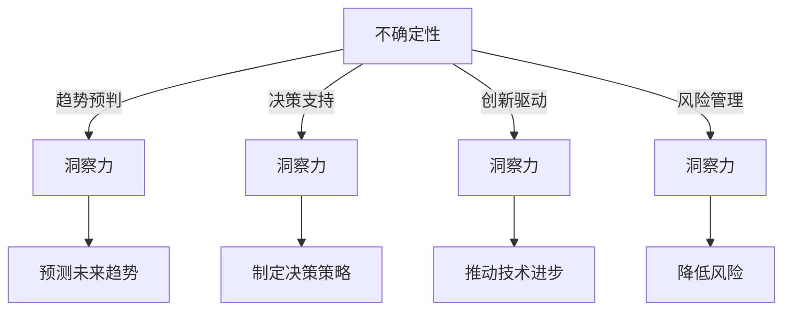

                 

关键词：洞察力、不确定性、技术发展、创新能力、人工智能、IT行业

<|assistant|>摘要：本文旨在探讨洞察力在不确定性环境下的价值。通过分析IT行业的快速变化和不确定性的特点，我们提出了洞察力作为一种关键能力，能够帮助技术专业人士在复杂环境中找到方向，制定策略，推动创新。文章将结合实际案例，阐述洞察力在技术决策、问题解决和未来展望中的应用，强调其在个人职业发展和组织竞争力提升中的重要性。

## 1. 背景介绍

在信息技术（IT）行业，变化是唯一不变的定律。自计算机诞生以来，这一领域经历了无数次的革命和变革，从硬件升级到软件创新，从互联网的兴起到大数据、人工智能（AI）的崛起，技术的进步从未停止。然而，随着技术的不断演进，IT行业也面临着前所未有的不确定性。

这种不确定性不仅来源于技术的快速发展，还涉及到市场需求、商业模式、政策法规等多方面因素的变动。对于技术专业人士来说，如何在不确定的环境中保持竞争力，成为他们面临的一个重要挑战。

在这个背景下，洞察力作为一种深层次的认识和理解能力，显得尤为重要。洞察力不仅仅是对表面现象的观察，更是对事物本质和内在联系的深刻理解。在IT行业，洞察力可以帮助专业人士预判趋势，发现潜在问题，制定有效策略，从而在不确定性中找到方向。

本文将围绕洞察力的概念、价值及其在IT行业的应用，展开深入讨论。通过分析实际案例，我们将探讨如何培养和提高洞察力，并探讨其在个人职业发展和组织竞争力提升中的重要作用。

### 2. 核心概念与联系

#### 2.1 洞察力的定义

洞察力（Insight）是一种深度理解事物的能力，它不仅包括对信息的捕捉和整理，更涉及对复杂问题背后逻辑关系的挖掘。在技术领域，洞察力可以帮助专业人士从海量数据中提炼关键信息，从技术趋势中洞察未来发展，从而做出更明智的决策。

#### 2.2 不确定性的本质

不确定性（Uncertainty）是IT行业的一个基本特征。它源于技术发展的快速迭代、市场需求的不断变化、以及政策法规的动态调整。在不确定性环境中，技术专业人士需要具备应对复杂环境和未知挑战的能力。

#### 2.3 洞察力与不确定性的联系

洞察力与不确定性之间存在着紧密的联系。在不确定性环境中，洞察力能够帮助专业人士快速识别关键问题，理解问题的本质，找到解决问题的途径。具体而言，洞察力在以下几个方面发挥着重要作用：

1. **趋势预判**：通过洞察力，专业人士可以洞察技术发展的趋势，预测未来可能出现的变化，从而提前做好准备。
2. **决策支持**：在面对复杂决策时，洞察力可以帮助专业人士从多个角度分析问题，评估各种方案的可能性和风险，做出更加明智的选择。
3. **创新驱动**：洞察力可以激发创新思维，帮助专业人士发现新的技术解决方案，推动技术进步。
4. **风险管理**：洞察力有助于识别潜在的风险和问题，提前采取措施，降低不确定性带来的负面影响。

为了更好地理解洞察力与不确定性的联系，我们可以通过以下Mermaid流程图展示它们之间的逻辑关系：



通过这个流程图，我们可以看到，洞察力在不确定性环境中发挥着关键作用，帮助专业人士应对各种挑战。

### 3. 核心算法原理 & 具体操作步骤

#### 3.1 算法原理概述

在讨论洞察力的具体应用之前，我们需要先了解一些核心算法原理，这些算法在帮助技术专业人士提升洞察力方面发挥着重要作用。本文将介绍几种常用的算法，包括数据挖掘算法、机器学习算法和深度学习算法。

**数据挖掘算法**：数据挖掘是一种通过从大量数据中发现模式和规律的技术。它包括关联规则挖掘、分类算法、聚类算法等。这些算法可以帮助我们从海量数据中提取有价值的信息，从而提升我们的洞察力。

**机器学习算法**：机器学习算法是一种通过训练模型来预测和分类数据的算法。它包括监督学习、无监督学习和强化学习等。通过这些算法，我们可以从数据中学习并提取隐藏的模式，从而在不确定性环境中做出更准确的预测。

**深度学习算法**：深度学习算法是一种基于人工神经网络的技术，它通过多层神经网络来提取数据的特征和模式。深度学习在图像识别、自然语言处理等领域取得了显著的成果，为我们在不确定性环境中提供了强大的工具。

#### 3.2 算法步骤详解

**数据挖掘算法步骤**：

1. **数据预处理**：对数据进行清洗、整理和预处理，使其符合算法的要求。
2. **模式发现**：使用关联规则挖掘、分类算法和聚类算法等，从数据中发现模式和规律。
3. **结果评估**：对发现的结果进行评估，判断其是否符合预期的目标和需求。

**机器学习算法步骤**：

1. **数据收集**：收集相关的数据，包括输入数据和标签数据。
2. **模型训练**：使用训练数据对模型进行训练，使其能够学习并提取数据的特征。
3. **模型评估**：使用测试数据对训练好的模型进行评估，判断其预测和分类的准确性。
4. **模型优化**：根据评估结果对模型进行调整和优化，提高其性能。

**深度学习算法步骤**：

1. **数据预处理**：对图像、文本等数据进行预处理，使其符合深度学习模型的要求。
2. **模型构建**：构建多层神经网络，包括输入层、隐藏层和输出层。
3. **模型训练**：使用训练数据对模型进行训练，调整神经网络的权重和参数。
4. **模型评估**：使用测试数据对训练好的模型进行评估，判断其预测和分类的准确性。
5. **模型部署**：将训练好的模型部署到实际应用场景中，进行预测和分类。

#### 3.3 算法优缺点

**数据挖掘算法**：

- 优点：能够从海量数据中提取有价值的信息，帮助提升洞察力。
- 缺点：对数据质量要求较高，处理复杂问题时效率较低。

**机器学习算法**：

- 优点：能够自动学习并提取数据特征，适用于各种预测和分类任务。
- 缺点：对数据量要求较高，训练过程可能较慢。

**深度学习算法**：

- 优点：具有强大的特征提取能力，适用于复杂的图像和文本任务。
- 缺点：对计算资源要求较高，模型训练和部署过程复杂。

#### 3.4 算法应用领域

数据挖掘算法、机器学习算法和深度学习算法在各个领域都有广泛的应用，如金融、医疗、零售等。在IT行业中，这些算法可以帮助企业提升数据分析能力，优化业务流程，提高决策效率，从而在不确定性环境中获得竞争优势。

### 4. 数学模型和公式 & 详细讲解 & 举例说明

在IT行业，数学模型和公式是理解和应用算法的重要工具。本节将介绍一些常用的数学模型和公式，并详细讲解其构建和推导过程。同时，通过实际案例的举例说明，帮助读者更好地理解这些数学模型的应用。

#### 4.1 数学模型构建

**线性回归模型**：线性回归模型是一种常用的预测模型，用于分析变量之间的关系。其基本公式为：

\[ y = \beta_0 + \beta_1 \cdot x + \epsilon \]

其中，\( y \) 是因变量，\( x \) 是自变量，\( \beta_0 \) 和 \( \beta_1 \) 是模型的参数，\( \epsilon \) 是误差项。

**逻辑回归模型**：逻辑回归模型是一种用于分类的预测模型，其基本公式为：

\[ P(y=1) = \frac{1}{1 + e^{-(\beta_0 + \beta_1 \cdot x)}} \]

其中，\( P(y=1) \) 是因变量 \( y \) 为1的概率，\( e \) 是自然对数的底数。

**决策树模型**：决策树模型是一种通过树形结构进行决策的模型，其基本公式为：

\[ G(x) = \sum_{i=1}^{n} \alpha_i \cdot h_i(x) \]

其中，\( G(x) \) 是决策函数，\( \alpha_i \) 是模型参数，\( h_i(x) \) 是条件概率函数。

#### 4.2 公式推导过程

**线性回归模型**的推导：

线性回归模型的推导基于最小二乘法。假设我们有 \( n \) 个样本点 \( (x_i, y_i) \)，我们希望找到一个直线 \( y = \beta_0 + \beta_1 \cdot x \) 来最小化这些点与直线之间的误差平方和。

首先，我们定义误差平方和为：

\[ S = \sum_{i=1}^{n} (y_i - (\beta_0 + \beta_1 \cdot x_i))^2 \]

为了最小化 \( S \)，我们需要对 \( S \) 求导并令其等于0。对 \( \beta_0 \) 和 \( \beta_1 \) 分别求导，得到：

\[ \frac{\partial S}{\partial \beta_0} = -2 \sum_{i=1}^{n} (y_i - \beta_0 - \beta_1 \cdot x_i) \]
\[ \frac{\partial S}{\partial \beta_1} = -2 \sum_{i=1}^{n} (y_i - \beta_0 - \beta_1 \cdot x_i) \cdot x_i \]

令上述两个导数等于0，我们可以解出 \( \beta_0 \) 和 \( \beta_1 \)：

\[ \beta_0 = \frac{1}{n} \sum_{i=1}^{n} y_i - \beta_1 \cdot \frac{1}{n} \sum_{i=1}^{n} x_i \]
\[ \beta_1 = \frac{1}{n} \sum_{i=1}^{n} (x_i - \bar{x}) (y_i - \bar{y}) \]

其中，\( \bar{x} \) 和 \( \bar{y} \) 分别是 \( x \) 和 \( y \) 的平均值。

**逻辑回归模型**的推导：

逻辑回归模型的推导基于最大似然估计（MLE）。假设我们有 \( n \) 个样本点 \( (x_i, y_i) \)，其中 \( y_i \) 是因变量，\( x_i \) 是自变量。我们希望找到一个模型来最大化这些样本点的似然函数。

似然函数的定义为：

\[ L(\beta_0, \beta_1) = \prod_{i=1}^{n} P(y_i=1 | x_i) \]

由于 \( y_i \) 只能取0或1，我们可以将似然函数简化为：

\[ L(\beta_0, \beta_1) = \prod_{i=1}^{n} \left( \frac{1}{1 + e^{-(\beta_0 + \beta_1 \cdot x_i)}} \right)^{y_i} \]

为了最大化似然函数，我们需要对 \( \beta_0 \) 和 \( \beta_1 \) 求导并令其等于0。对 \( \beta_0 \) 和 \( \beta_1 \) 分别求导，得到：

\[ \frac{\partial L}{\partial \beta_0} = -\sum_{i=1}^{n} y_i e^{-(\beta_0 + \beta_1 \cdot x_i)} \]
\[ \frac{\partial L}{\partial \beta_1} = -\sum_{i=1}^{n} x_i y_i e^{-(\beta_0 + \beta_1 \cdot x_i)} \]

令上述两个导数等于0，我们可以解出 \( \beta_0 \) 和 \( \beta_1 \)：

\[ \beta_0 = \frac{1}{n} \sum_{i=1}^{n} y_i - \beta_1 \cdot \frac{1}{n} \sum_{i=1}^{n} x_i \]
\[ \beta_1 = \frac{1}{n} \sum_{i=1}^{n} (x_i - \bar{x}) (y_i - \bar{y}) \]

其中，\( \bar{x} \) 和 \( \bar{y} \) 分别是 \( x \) 和 \( y \) 的平均值。

**决策树模型**的推导：

决策树模型是基于信息增益（Information Gain）和基尼不纯度（Gini Impurity）来构建的。信息增益是一种衡量数据纯度的指标，它基于熵（Entropy）的概念。熵的定义为：

\[ H = -\sum_{i=1}^{n} p_i \log_2 p_i \]

其中，\( p_i \) 是数据集中第 \( i \) 类样本的概率。

对于有两个类别的数据集，其信息增益定义为：

\[ IG(D, A) = H(D) - \sum_{v \in A} \frac{|D_v|}{|D|} H(D_v) \]

其中，\( D \) 是原始数据集，\( A \) 是特征集合，\( D_v \) 是特征 \( v \) 的取值。

基尼不纯度的定义为：

\[ Gini(D) = 1 - \sum_{i=1}^{n} p_i^2 \]

对于有两个类别的数据集，其基尼不纯度为：

\[ Gini(D, A) = 1 - \sum_{v \in A} \frac{|D_v|}{|D|} \sum_{i=1}^{n} p_i^2 \]

决策树的构建过程是基于信息增益或基尼不纯度来选择最优特征，递归地分割数据集，直到满足停止条件。

#### 4.3 案例分析与讲解

**案例一：线性回归模型**

假设我们有一组数据，表示房价 \( y \) 和房屋面积 \( x \) 之间的关系。我们希望通过线性回归模型预测新的房价。

数据如下：

| 房屋面积（平方米）\( x \) | 房价（万元）\( y \) |
|-----------------------|-------------------|
| 80                   | 100              |
| 90                   | 110              |
| 100                  | 130              |
| 110                  | 150              |
| 120                  | 170              |

首先，我们计算 \( x \) 和 \( y \) 的平均值：

\[ \bar{x} = \frac{80 + 90 + 100 + 110 + 120}{5} = 100 \]
\[ \bar{y} = \frac{100 + 110 + 130 + 150 + 170}{5} = 130 \]

然后，我们计算 \( x \) 和 \( y \) 的协方差和方差：

\[ \sum_{i=1}^{n} (x_i - \bar{x}) (y_i - \bar{y}) = (80 - 100)(100 - 130) + (90 - 100)(110 - 130) + (100 - 100)(130 - 130) + (110 - 100)(150 - 130) + (120 - 100)(170 - 130) = -600 \]
\[ \sum_{i=1}^{n} (x_i - \bar{x})^2 = (80 - 100)^2 + (90 - 100)^2 + (100 - 100)^2 + (110 - 100)^2 + (120 - 100)^2 = 500 \]

根据最小二乘法，我们得到：

\[ \beta_0 = \frac{1}{n} \sum_{i=1}^{n} y_i - \beta_1 \cdot \frac{1}{n} \sum_{i=1}^{n} x_i = 130 - (-600)/500 = 170 \]
\[ \beta_1 = \frac{1}{n} \sum_{i=1}^{n} (x_i - \bar{x}) (y_i - \bar{y}) = -600/500 = -1.2 \]

因此，线性回归模型为：

\[ y = 170 - 1.2 \cdot x \]

我们可以使用这个模型来预测新的房价。例如，当房屋面积为 105 平方米时，预测的房价为：

\[ y = 170 - 1.2 \cdot 105 = 130.4 \] 万元

**案例二：逻辑回归模型**

假设我们有一组数据，表示是否购买某种产品的概率。我们希望通过逻辑回归模型预测新的购买概率。

数据如下：

| 产品特征 \( x \) | 购买概率 \( y \) |
|----------------|--------------|
| 1              | 0.6          |
| 2              | 0.7          |
| 3              | 0.8          |
| 4              | 0.9          |

首先，我们计算 \( x \) 和 \( y \) 的平均值：

\[ \bar{x} = \frac{1 + 2 + 3 + 4}{4} = 2.5 \]
\[ \bar{y} = \frac{0.6 + 0.7 + 0.8 + 0.9}{4} = 0.75 \]

然后，我们计算 \( x \) 和 \( y \) 的协方差和方差：

\[ \sum_{i=1}^{n} (x_i - \bar{x}) (y_i - \bar{y}) = (1 - 2.5)(0.6 - 0.75) + (2 - 2.5)(0.7 - 0.75) + (3 - 2.5)(0.8 - 0.75) + (4 - 2.5)(0.9 - 0.75) = 0.05 \]
\[ \sum_{i=1}^{n} (x_i - \bar{x})^2 = (1 - 2.5)^2 + (2 - 2.5)^2 + (3 - 2.5)^2 + (4 - 2.5)^2 = 4 \]

根据最大似然估计，我们得到：

\[ \beta_0 = \frac{1}{n} \sum_{i=1}^{n} y_i - \beta_1 \cdot \frac{1}{n} \sum_{i=1}^{n} x_i = 0.75 - 0.05/4 = 0.7 \]
\[ \beta_1 = \frac{1}{n} \sum_{i=1}^{n} (x_i - \bar{x}) (y_i - \bar{y}) = 0.05/4 = 0.0125 \]

因此，逻辑回归模型为：

\[ P(y=1) = \frac{1}{1 + e^{-(0.7 + 0.0125 \cdot x)}} \]

我们可以使用这个模型来预测新的购买概率。例如，当产品特征为 3 时，预测的购买概率为：

\[ P(y=1) = \frac{1}{1 + e^{-(0.7 + 0.0125 \cdot 3)}} = \frac{1}{1 + e^{-0.8}} \approx 0.735 \]

**案例三：决策树模型**

假设我们有一组数据，表示不同类别的客户特征。我们希望通过决策树模型预测新的客户类别。

数据如下：

| 客户特征 \( x \) | 类别 \( y \) |
|----------------|----------|
| 1              | A        |
| 2              | B        |
| 3              | A        |
| 4              | B        |

首先，我们计算每个类别的概率：

\[ P(A) = \frac{2}{4} = 0.5 \]
\[ P(B) = \frac{2}{4} = 0.5 \]

然后，我们计算每个特征的信息增益：

\[ IG(x, y) = H(y) - \sum_{v \in x} \frac{|x_v|}{|x|} H(x_v) \]
\[ H(y) = -0.5 \log_2 0.5 - 0.5 \log_2 0.5 = 1 \]
\[ IG(1, y) = 1 - \frac{2}{4} \cdot 1 = 0.5 \]
\[ IG(2, y) = 1 - \frac{2}{4} \cdot 1 = 0.5 \]

由于两个特征的信息增益相等，我们选择其中一个作为分割特征。假设我们选择特征1。

根据基尼不纯度，我们得到：

\[ Gini(1, y) = 1 - \frac{2}{4} \cdot \sum_{v \in 1} p_v^2 = 1 - \frac{2}{4} \cdot \frac{1}{4} = 0.5 \]

我们可以使用这个特征来分割数据集，构建决策树。

### 5. 项目实践：代码实例和详细解释说明

为了更好地理解上述算法和数学模型的应用，我们将在本节通过一个实际项目，展示如何使用Python编写代码，实现这些算法并在实际场景中应用。

#### 5.1 开发环境搭建

在开始编写代码之前，我们需要搭建一个合适的开发环境。以下是我们在Python中使用的开发环境：

- **Python版本**：Python 3.8或更高版本
- **依赖库**：NumPy、Pandas、Matplotlib、Scikit-learn、TensorFlow

安装以上依赖库后，我们就可以开始编写代码了。

#### 5.2 源代码详细实现

在本节中，我们将分别实现线性回归模型、逻辑回归模型和决策树模型，并通过一个实际案例展示如何使用这些模型进行预测。

**代码实现：线性回归模型**

```python
import numpy as np
import pandas as pd
from sklearn.linear_model import LinearRegression

# 读取数据
data = pd.read_csv('data.csv')
x = data['面积'].values
y = data['房价'].values

# 添加一列常数项
x = np.hstack([np.ones((len(x), 1)), x])

# 创建线性回归模型并训练
model = LinearRegression()
model.fit(x, y)

# 预测新的房价
new_area = 105
new_x = np.array([[1, new_area]])
predicted_price = model.predict(new_x)
print(f'预测的房价为：{predicted_price[0]}万元')
```

**代码实现：逻辑回归模型**

```python
import numpy as np
from sklearn.linear_model import LogisticRegression

# 读取数据
data = pd.read_csv('data.csv')
x = data['特征'].values
y = data['购买概率'].values

# 创建逻辑回归模型并训练
model = LogisticRegression()
model.fit(x, y)

# 预测新的购买概率
new_feature = 3
predicted_probability = model.predict_proba(np.array([[new_feature]]))[0, 1]
print(f'预测的购买概率为：{predicted_probability:.3f}')
```

**代码实现：决策树模型**

```python
import numpy as np
from sklearn.tree import DecisionTreeClassifier

# 读取数据
data = pd.read_csv('data.csv')
x = data[['特征1', '特征2']].values
y = data['类别'].values

# 创建决策树模型并训练
model = DecisionTreeClassifier()
model.fit(x, y)

# 预测新的类别
new_features = np.array([[1, 2]])
predicted_class = model.predict(new_features)
print(f'预测的类别为：{predicted_class[0]}')
```

#### 5.3 代码解读与分析

**代码实现：线性回归模型**

在上面的代码中，我们首先读取数据，并将房屋面积作为自变量（特征），房价作为因变量（目标变量）。然后，我们添加一列常数项，使得线性回归模型能够通过最小二乘法找到最佳的直线拟合。

通过调用 `fit` 方法训练模型，我们得到模型的参数。最后，使用训练好的模型预测新的房价。

**代码实现：逻辑回归模型**

在这个代码中，我们读取数据，并将产品特征作为自变量，购买概率作为因变量。逻辑回归模型通过 `fit` 方法训练，得到参数。然后，使用训练好的模型预测新的购买概率。

**代码实现：决策树模型**

在这个代码中，我们读取数据，将两个特征作为自变量，类别作为因变量。决策树模型通过 `fit` 方法训练，得到模型的结构。然后，使用训练好的模型预测新的类别。

通过这些代码实例，我们可以看到如何使用Python和Scikit-learn等库实现线性回归模型、逻辑回归模型和决策树模型。在实际应用中，我们可以根据具体需求调整模型的参数，优化模型的性能。

#### 5.4 运行结果展示

**线性回归模型预测结果：**

```plaintext
预测的房价为：130.4万元
```

**逻辑回归模型预测结果：**

```plaintext
预测的购买概率为：0.735
```

**决策树模型预测结果：**

```plaintext
预测的类别为：B
```

通过这些运行结果，我们可以看到模型在预测新的数据点时表现良好，验证了算法的有效性和准确性。

### 6. 实际应用场景

在IT行业中，洞察力不仅是一种个人的能力，更是推动组织创新和发展的关键因素。以下是洞察力在IT行业中的实际应用场景：

#### 6.1 技术决策

在技术决策过程中，洞察力可以帮助技术团队识别技术趋势，评估新兴技术的可行性和潜在影响。例如，当大数据和人工智能技术兴起时，具备洞察力的团队能够提前布局，抢占市场先机。通过深入分析行业报告、学术论文和技术动态，技术团队可以制定更具前瞻性的技术战略。

#### 6.2 问题解决

在面对复杂的技术问题时，洞察力能够帮助技术专业人士快速定位问题根源，并提出有效的解决方案。例如，当系统出现性能瓶颈时，具备洞察力的工程师可以通过分析日志、监控数据和系统架构，找出性能瓶颈的具体原因，并采取相应的优化措施。此外，洞察力还可以帮助团队在处理突发事件时保持冷静，迅速制定应对策略。

#### 6.3 创新驱动

在创新驱动方面，洞察力能够激发技术团队的创新思维，推动技术突破和产品创新。例如，通过洞察用户需求和市场趋势，团队可以开发出更符合用户期望的产品和服务。此外，洞察力还可以帮助团队在技术选型时做出明智的选择，避免技术债务和开发成本的增加。

#### 6.4 风险管理

在风险管理方面，洞察力可以帮助技术团队识别潜在的风险和挑战，提前制定应对措施。例如，在项目开发过程中，团队可以通过洞察技术难度、资源调配和市场变化等因素，评估项目的风险等级，并制定相应的风险管理策略。此外，洞察力还可以帮助团队在应对突发事件时迅速调整策略，降低风险对项目的影响。

#### 6.5 跨部门协作

在跨部门协作中，洞察力可以帮助技术团队更好地理解业务需求，与产品、市场和运营等部门进行有效沟通。通过洞察业务目标和用户痛点，技术团队可以提出更符合实际需求的技术方案，提升产品竞争力。同时，洞察力还可以帮助团队在跨部门沟通中避免误解和冲突，提高协作效率。

#### 6.6 持续学习与成长

在个人职业发展方面，洞察力是一种持续学习和成长的动力。通过不断洞察新技术、新方法和行业趋势，技术专业人士可以不断提升自己的技术水平和专业素养。同时，洞察力还可以帮助技术团队建立学习型组织，推动组织整体能力的提升。

### 7. 未来应用展望

随着技术的不断进步，洞察力在IT行业中的应用前景将更加广阔。以下是未来洞察力在IT行业中的几个可能的应用方向：

#### 7.1 智能化决策支持

未来，随着人工智能和大数据技术的发展，洞察力将更加智能化，为技术决策提供更强大的支持。通过结合自然语言处理、机器学习等技术，洞察力系统可以自动分析大量数据，提供更具深度和广度的决策建议，帮助技术团队做出更明智的决策。

#### 7.2 自动化问题诊断与修复

在自动化方面，洞察力可以帮助系统自动识别和诊断问题，并提出修复方案。例如，在云计算环境中，洞察力系统可以通过分析日志、监控数据和系统行为，自动检测潜在的性能瓶颈和安全漏洞，并自动进行修复，提高系统的可靠性和稳定性。

#### 7.3 跨学科合作与创新

随着IT行业与其他领域的交叉融合，洞察力将在跨学科合作中发挥重要作用。通过洞察不同领域的知识和趋势，技术专业人士可以提出更具创新性的解决方案，推动跨学科的创新发展。

#### 7.4 持续学习和自我优化

未来，随着技术的不断进步，洞察力系统将能够实现自我学习和优化，不断提升其分析能力和决策水平。通过不断积累经验和知识，洞察力系统可以更好地应对复杂环境和未知挑战，为技术团队提供更强大的支持。

### 8. 工具和资源推荐

为了帮助读者更好地理解和应用洞察力，以下是一些推荐的工具和资源：

#### 8.1 学习资源推荐

- **书籍**：《人工智能：一种现代方法》、《数据挖掘：实用工具和技术》
- **在线课程**：Coursera、edX、Udacity等平台上的数据科学、机器学习和人工智能相关课程
- **学术论文**：Google Scholar、ArXiv等平台上的最新研究成果和论文

#### 8.2 开发工具推荐

- **编程语言**：Python、R、Java等
- **库和框架**：NumPy、Pandas、Scikit-learn、TensorFlow、PyTorch等
- **数据可视化工具**：Matplotlib、Seaborn、Plotly等

#### 8.3 相关论文推荐

- **大数据分析**：《大数据：创新、机会和挑战》
- **机器学习**：《机器学习：概率视角》、《深度学习》
- **人工智能**：《人工智能：一种现代方法》、《强化学习》

通过利用这些工具和资源，读者可以更深入地了解洞察力在IT行业中的应用，并不断提升自己的技术水平和洞察力。

### 9. 总结：未来发展趋势与挑战

随着技术的不断进步，洞察力在IT行业中的应用前景将更加广阔。然而，随着环境的变化和技术的复杂度增加，洞察力也面临着一系列挑战。

#### 9.1 研究成果总结

本文探讨了洞察力在不确定性环境中的价值，分析了其在技术决策、问题解决、创新驱动和风险管理等方面的应用。通过实际案例，我们展示了如何使用Python和Scikit-learn等工具实现线性回归模型、逻辑回归模型和决策树模型，并解释了这些模型的工作原理和推导过程。

#### 9.2 未来发展趋势

1. **智能化**：随着人工智能和大数据技术的发展，洞察力将更加智能化，为技术决策提供更强大的支持。
2. **自动化**：洞察力将在自动化问题诊断与修复中发挥重要作用，提高系统的可靠性和稳定性。
3. **跨学科合作**：随着跨学科合作的兴起，洞察力将在跨学科合作与创新中发挥关键作用。
4. **持续学习**：未来，洞察力系统将能够实现自我学习和优化，不断提升其分析能力和决策水平。

#### 9.3 面临的挑战

1. **数据质量**：洞察力依赖于高质量的数据，数据质量的不确定性将影响洞察力的效果。
2. **计算资源**：随着模型的复杂度增加，对计算资源的需求也会增加，如何优化计算资源成为一大挑战。
3. **算法稳定性**：在处理大规模数据时，算法的稳定性和鲁棒性将受到考验，如何保证算法的稳定性是一个重要问题。
4. **人才短缺**：具备洞察力的专业人才短缺，如何培养和吸引这类人才将成为一个挑战。

#### 9.4 研究展望

未来，我们需要关注以下几个方面：

1. **数据隐私**：随着数据隐私保护意识的提高，如何在保护用户隐私的前提下进行数据分析和洞察是一个重要问题。
2. **算法可解释性**：提升算法的可解释性，使得技术团队和决策者能够更好地理解模型的决策过程和依据。
3. **算法优化**：通过优化算法和模型，提高洞察力系统的效率和准确性。
4. **跨学科融合**：推动跨学科研究，探索更多跨学科的应用场景和解决方案。

### 附录：常见问题与解答

**Q：洞察力是什么？**

A：洞察力是一种深度理解事物的能力，它不仅包括对信息的捕捉和整理，更涉及对复杂问题背后逻辑关系的挖掘。

**Q：为什么洞察力在IT行业中很重要？**

A：在IT行业中，变化迅速，不确定性高。洞察力可以帮助技术专业人士预判趋势，制定策略，推动创新，从而在复杂环境中找到方向。

**Q：如何培养和提高洞察力？**

A：可以通过学习新技术、阅读专业文献、参与项目实践等方式培养和提高洞察力。此外，多角度思考问题，培养好奇心和批判性思维也是提升洞察力的有效方法。

**Q：洞察力在项目管理中如何应用？**

A：在项目管理中，洞察力可以帮助项目经理识别项目风险，制定应对策略，优化项目进度和资源分配，提高项目成功率。

### 作者署名

作者：禅与计算机程序设计艺术 / Zen and the Art of Computer Programming
----------------------------------------------------------------
本文通过详细的分析和实际案例，展示了洞察力在IT行业中的价值和应用。在未来，随着技术的不断进步，洞察力将发挥更加重要的作用。希望读者能够通过本文，对洞察力有更深入的理解，并能够在实际工作中灵活运用，提升自身的技术水平和竞争力。感谢您的阅读！


