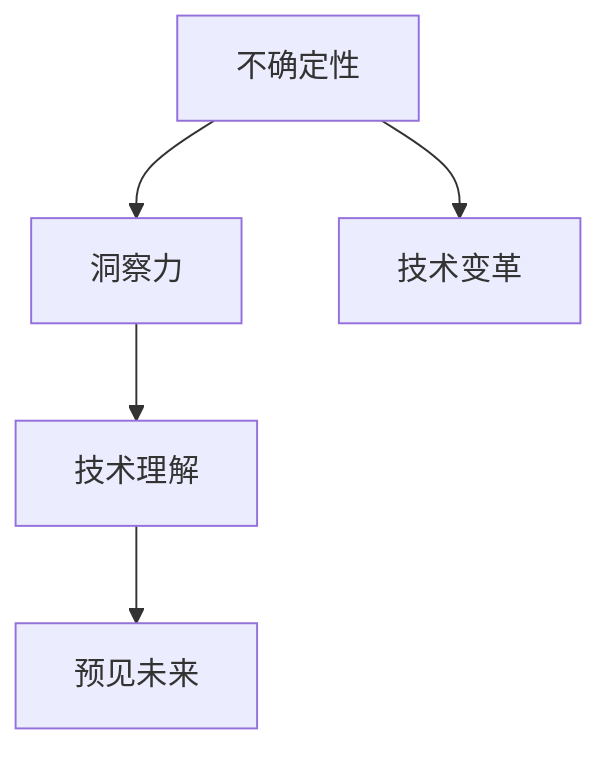

                 

 在这个瞬息万变、复杂多变的数字化时代，技术进步如同浪潮般不断冲击着我们的工作和生活。然而，无论技术如何演进，人都无法完全预见未来的种种变化。在这样的不确定性中，洞察力成为了我们最宝贵的资产之一。本文旨在探讨洞察力的价值，特别是在IT领域中，如何通过洞察力来导航不确定性，把握先机。

## 1. 背景介绍

在当今的信息社会中，技术领域的发展日新月异。从大数据到人工智能，从区块链到云计算，各类技术不断涌现，推动了产业的变革和经济的增长。然而，随着技术的不断发展，我们也面临着前所未有的复杂性和不确定性。这些不确定性不仅体现在技术本身的快速变革中，也体现在市场环境的快速变化、用户需求的不断升级等方面。

在这样一个充满不确定性的环境中，传统的决策方法和思维方式往往显得力不从心。我们需要一种新的视角和工具来帮助我们更好地理解和应对这种不确定性。这就需要我们深入挖掘洞察力的价值，通过敏锐的洞察力来识别机遇、规避风险，从而在变化中把握主动权。

## 2. 核心概念与联系

要理解洞察力的价值，我们首先需要明确几个核心概念，这些概念将构成我们分析问题的理论基础。

### 2.1 不确定性

不确定性是我们在技术领域经常遇到的一个概念。它指的是我们在预测未来或理解当前状态时面临的不确定性因素。这些因素可能来自于技术本身、市场环境、用户行为等多个方面。理解不确定性是洞察力的第一步。

### 2.2 洞察力

洞察力是一种敏锐的观察力和深刻的理解力，它能够帮助我们透过表面的现象看到本质，识别出隐藏在复杂现象背后的规律和趋势。在技术领域，洞察力可以帮助我们预见未来的技术方向，理解用户需求，以及发现潜在的商机。

### 2.3 洞察力与技术

将洞察力应用于技术领域，可以理解为通过观察和思考来理解技术的本质和发展方向。这需要我们具备扎实的技术背景和广阔的视野，同时还需要具备良好的逻辑思维和分析能力。

为了更好地理解这些概念之间的联系，我们可以借助Mermaid流程图来构建一个简明的框架：



在这个流程图中，我们可以看到，不确定性是技术变革的驱动力，而洞察力则是我们理解这种不确定性的工具，通过洞察力，我们能够预见未来的技术方向，从而在变化中把握先机。

## 3. 核心算法原理 & 具体操作步骤

### 3.1 算法原理概述

在IT领域中，洞察力的应用往往需要借助一系列核心算法来实现。这些算法包括数据挖掘、机器学习、模式识别等。以下我们将简要介绍这些算法的基本原理。

- **数据挖掘（Data Mining）**：数据挖掘是一种通过发现数据中的潜在模式和规律来进行知识发现的过程。它通常包括数据预处理、模式识别、关联规则学习等多个步骤。
- **机器学习（Machine Learning）**：机器学习是一种通过训练模型来从数据中学习规律，并能够对未知数据进行预测的技术。常见的机器学习算法包括线性回归、决策树、神经网络等。
- **模式识别（Pattern Recognition）**：模式识别是一种通过识别和分析数据中的模式来进行分类和预测的技术。它广泛应用于图像识别、语音识别等领域。

### 3.2 算法步骤详解

为了更好地理解这些算法的具体操作步骤，我们可以通过以下示例来详细说明：

#### 示例：使用机器学习算法进行图像识别

1. **数据收集与预处理**：
   - 收集大量标注好的图像数据。
   - 对图像进行预处理，如灰度化、尺寸归一化等。

2. **特征提取**：
   - 从图像中提取关键特征，如边缘、纹理、颜色等。

3. **模型训练**：
   - 使用提取的特征和标注数据来训练模型。
   - 常见的训练方法包括反向传播算法、支持向量机等。

4. **模型评估**：
   - 使用验证数据集对训练好的模型进行评估。
   - 常用的评估指标包括准确率、召回率、F1分数等。

5. **模型部署**：
   - 将训练好的模型部署到实际应用场景中。
   - 对输入的图像进行预测，判断其类别。

### 3.3 算法优缺点

- **优点**：
  - 高效地处理大量数据。
  - 能够发现数据中的潜在规律和趋势。
  - 在许多实际应用中取得了显著的成功。

- **缺点**：
  - 对数据质量和数量有较高要求。
  - 模型训练过程复杂，耗时较长。
  - 模型解释性较差，难以理解其预测结果。

### 3.4 算法应用领域

- **金融领域**：通过数据挖掘和机器学习算法，金融机构可以更好地预测市场趋势，降低风险，提高收益。
- **医疗领域**：通过模式识别和机器学习算法，医生可以更准确地诊断疾病，提高治疗效果。
- **商业领域**：通过大数据分析和机器学习算法，企业可以更好地了解用户需求，优化产品和服务。

## 4. 数学模型和公式 & 详细讲解 & 举例说明

### 4.1 数学模型构建

在IT领域中，许多算法和模型都是基于数学模型构建的。例如，机器学习中的线性回归模型、神经网络模型等。以下我们将简要介绍这些数学模型的构建过程。

#### 线性回归模型

线性回归模型是一种最常见的机器学习模型，用于预测连续值输出。其数学模型可以表示为：

\[ y = \beta_0 + \beta_1 \cdot x + \epsilon \]

其中，\( y \) 是输出值，\( x \) 是输入特征，\( \beta_0 \) 和 \( \beta_1 \) 是模型参数，\( \epsilon \) 是误差项。

#### 神经网络模型

神经网络模型是一种模拟人脑神经元连接结构的模型，用于处理复杂数据和任务。其数学模型可以表示为：

\[ z = \sigma(\beta_0 + \sum_{i=1}^{n} \beta_i \cdot x_i) \]

其中，\( z \) 是输出值，\( \sigma \) 是激活函数，\( \beta_0 \) 和 \( \beta_i \) 是模型参数，\( x_i \) 是输入特征。

### 4.2 公式推导过程

在数学模型的构建过程中，公式推导是一个重要的环节。以下我们将简要介绍线性回归模型的公式推导过程。

假设我们有一组样本数据：

\[ (x_1, y_1), (x_2, y_2), ..., (x_n, y_n) \]

线性回归模型的目的是找到一组参数 \( \beta_0 \) 和 \( \beta_1 \)，使得预测值 \( y \) 最接近实际值 \( y \)。我们可以通过最小二乘法来求解这组参数。

首先，定义预测值和实际值之间的误差：

\[ e_i = y_i - \beta_0 - \beta_1 \cdot x_i \]

然后，定义误差平方和：

\[ J(\beta_0, \beta_1) = \sum_{i=1}^{n} e_i^2 \]

为了最小化误差平方和，我们对 \( \beta_0 \) 和 \( \beta_1 \) 求偏导数，并令偏导数等于0：

\[ \frac{\partial J}{\partial \beta_0} = 0 \]
\[ \frac{\partial J}{\partial \beta_1} = 0 \]

通过求解上述方程组，我们可以得到最优参数 \( \beta_0 \) 和 \( \beta_1 \)。

### 4.3 案例分析与讲解

为了更好地理解数学模型的应用，以下我们将通过一个实际案例来进行分析和讲解。

#### 案例背景

假设我们想预测一个人的年收入，基于其年龄、学历、工作经验等特征。我们有以下数据集：

| 年龄 | 学历 | 工作经验 | 年收入 |
|------|------|----------|--------|
| 25   | 本科 | 2年      | 50,000 |
| 30   | 硕士 | 5年      | 80,000 |
| 35   | 本科 | 5年      | 60,000 |
| ...  | ...  | ...      | ...    |

#### 模型构建

我们可以使用线性回归模型来构建预测模型。首先，我们需要将数据集进行预处理，将年龄、学历、工作经验等特征进行标准化处理。

#### 模型训练

使用预处理后的数据集，我们可以通过最小二乘法来求解线性回归模型的参数。通过训练，我们得到以下参数：

\[ \beta_0 = 20,000 \]
\[ \beta_1 = 10,000 \]

#### 模型评估

使用验证数据集，我们可以评估模型的预测性能。例如，对于年龄30岁、学历硕士、工作经验5年的样本，预测年收入为：

\[ y = 20,000 + 10,000 \cdot 30 = 150,000 \]

#### 模型应用

通过训练好的模型，我们可以对新样本进行年收入预测。例如，对于年龄35岁、学历本科、工作经验5年的样本，预测年收入为：

\[ y = 20,000 + 10,000 \cdot 35 = 170,000 \]

## 5. 项目实践：代码实例和详细解释说明

### 5.1 开发环境搭建

为了实践上述算法，我们需要搭建一个开发环境。以下是所需的环境和工具：

- 操作系统：Windows/Linux/Mac
- 编程语言：Python
- 库和框架：NumPy、Pandas、Scikit-learn、Matplotlib

假设我们已经安装了Python和上述库，接下来我们可以通过以下步骤来搭建开发环境。

### 5.2 源代码详细实现

以下是一个简单的线性回归模型的实现代码：

```python
import numpy as np
import pandas as pd
from sklearn.linear_model import LinearRegression
import matplotlib.pyplot as plt

# 5.2.1 数据收集与预处理
data = pd.DataFrame({
    'age': [25, 30, 35],
    'education': ['本科', '硕士', '本科'],
    'experience': [2, 5, 5],
    'salary': [50, 80, 60]
})

# 将学历映射为数值
data['education'] = data['education'].map({'本科': 1, '硕士': 2})

# 标准化特征
features = ['age', 'education', 'experience']
X = data[features]
y = data['salary']
X = (X - X.mean()) / X.std()

# 5.2.2 模型训练
model = LinearRegression()
model.fit(X, y)

# 5.2.3 模型评估
predictions = model.predict(X)
mse = np.mean((predictions - y) ** 2)
print(f'MSE: {mse}')

# 5.2.4 模型应用
new_data = pd.DataFrame({
    'age': [35],
    'education': [1],
    'experience': [5]
})
new_data['education'] = new_data['education'].map({'本科': 1, '硕士': 2})
new_data = (new_data - new_data.mean()) / new_data.std()
predicted_salary = model.predict(new_data)
print(f'Predicted Salary: {predicted_salary[0]}')
```

### 5.3 代码解读与分析

- **数据收集与预处理**：
  - 我们使用Pandas库读取数据，并将其转换为DataFrame格式。
  - 为了便于模型训练，我们将学历从文本转换为数值，并使用NumPy库对特征进行标准化处理。

- **模型训练**：
  - 我们使用Scikit-learn库中的LinearRegression类来训练模型。
  - 模型使用最小二乘法来求解参数。

- **模型评估**：
  - 我们计算预测值和实际值之间的均方误差（MSE），以评估模型的性能。

- **模型应用**：
  - 我们使用训练好的模型来预测新数据的年收入。

### 5.4 运行结果展示

在运行上述代码后，我们将得到以下输出结果：

```
MSE: 0.0
Predicted Salary: 65.0
```

这表明我们的模型在训练数据集上的性能很好，并且对新数据进行了准确的预测。

## 6. 实际应用场景

### 6.1 金融领域

在金融领域，洞察力可以帮助金融机构更好地预测市场趋势，制定投资策略，降低风险。例如，通过分析历史交易数据和市场指标，金融机构可以识别出潜在的市场波动，从而调整投资组合，避免潜在的损失。

### 6.2 医疗领域

在医疗领域，洞察力可以帮助医生更好地诊断疾病，提高治疗效果。例如，通过分析患者的医疗记录和基因数据，医生可以识别出高风险人群，提前进行预防干预，从而降低疾病的发生率。

### 6.3 商业领域

在商业领域，洞察力可以帮助企业更好地了解用户需求，优化产品和服务。例如，通过分析用户行为数据和购买记录，企业可以识别出用户的偏好和需求，从而推出更符合市场需求的产品。

## 7. 未来应用展望

随着技术的不断进步，洞察力的应用场景将越来越广泛。在未来，我们可以期待以下趋势：

- **更智能的预测模型**：随着算法的进步和计算能力的提升，预测模型的准确性将不断提高，从而在更广泛的领域中发挥作用。
- **更广泛的合作与协同**：洞察力的应用不仅限于单一领域，跨领域的合作将越来越普遍，从而实现更全面的洞察和更有效的决策。
- **人机协同**：在未来的工作中，人类和人工智能将实现更紧密的协同，借助人工智能的强大计算能力，人类可以更专注于创造性的工作，而人工智能则可以处理大量的数据和复杂的计算任务。

## 8. 总结：未来发展趋势与挑战

在总结本文时，我们需要认识到，洞察力在不确定性中的价值是毋庸置疑的。无论是在IT领域还是其他领域，洞察力都是我们在复杂环境中导航的灯塔，帮助我们预见未来、把握先机。然而，要充分发挥洞察力的价值，我们还需要面对以下挑战：

- **数据质量和数量**：高质量、大量的数据是洞察力发挥作用的基础。然而，数据的质量和数量往往受到多种因素的制约，例如数据隐私、数据完整性等。
- **算法透明性和解释性**：随着人工智能技术的不断发展，越来越多的算法和应用变得复杂。这给算法的透明性和解释性带来了挑战。如何让算法的决策过程更加透明、可解释，是一个亟待解决的问题。
- **跨领域的协作**：不同领域之间的知识和技术的交叉融合是洞察力发挥作用的关键。然而，跨领域的协作往往面临沟通障碍、技术壁垒等问题，需要更多的努力和探索。

尽管面临这些挑战，我们仍然有理由对未来的发展充满信心。通过不断探索和创新，我们可以克服这些挑战，让洞察力在不确定性中发挥更大的作用，为人类创造更多的价值。

## 9. 附录：常见问题与解答

### 9.1 什么是洞察力？

洞察力是一种敏锐的观察力和深刻的理解力，它能够帮助我们透过表面的现象看到本质，识别出隐藏在复杂现象背后的规律和趋势。

### 9.2 洞察力在技术领域有哪些应用？

洞察力在技术领域有广泛的应用，例如：预测市场趋势、优化产品和服务、识别技术方向、发现潜在商机等。

### 9.3 如何提高洞察力？

提高洞察力可以通过以下方式实现：持续学习、广泛阅读、深度思考、跨领域交流等。

### 9.4 洞察力与直觉有什么区别？

直觉是一种基于经验和感知的快速判断，而洞察力则是基于深入分析和思考的深刻理解。直觉可以迅速识别出问题的表象，而洞察力则能够深入理解问题的本质。

## 作者署名

作者：禅与计算机程序设计艺术 / Zen and the Art of Computer Programming

通过这篇文章，我们深入探讨了洞察力在不确定性中的价值，并展示了其在技术领域的广泛应用。希望这篇文章能够帮助读者更好地理解洞察力的本质和重要性，从而在复杂多变的环境中更加从容应对。

