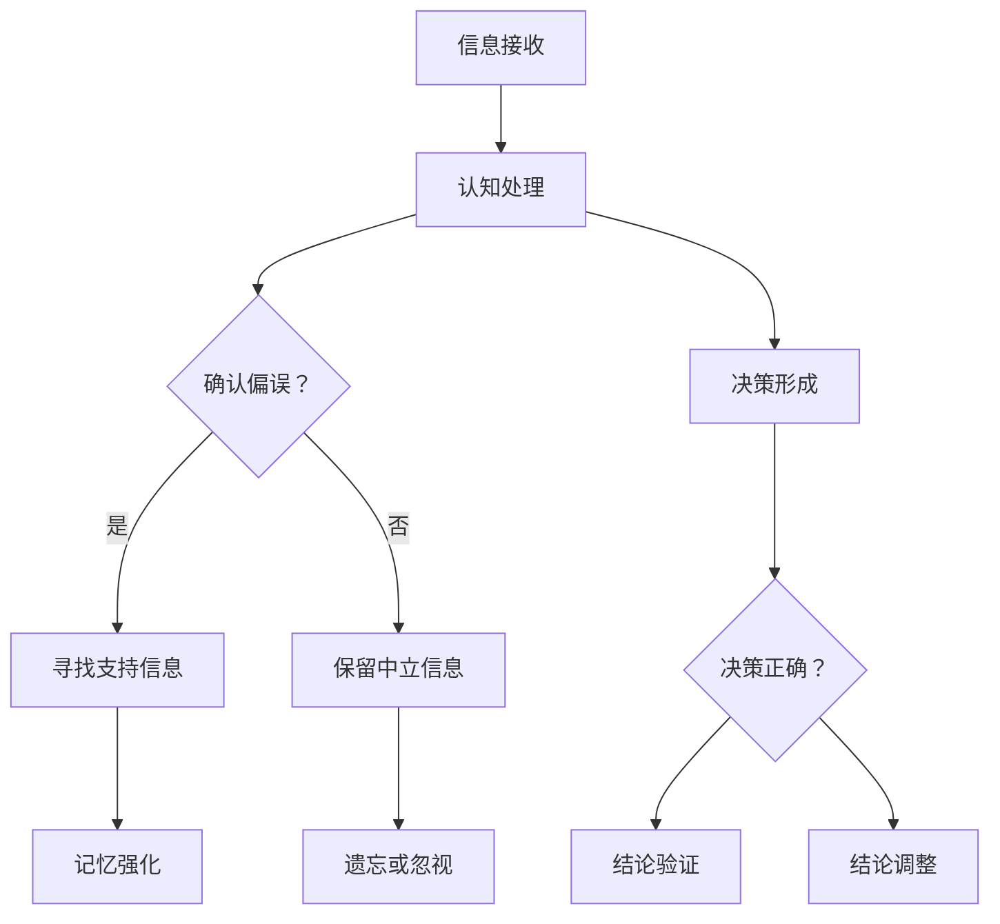

                 

在当今这个充满信息的社会中，人们经常面临大量数据和信息。对这些信息的处理和理解，不仅需要逻辑思维和批判性思维，还需要避免一些认知上的偏差，比如本文要探讨的确认偏误（confirmation bias）。作为一名世界级人工智能专家，程序员，软件架构师，CTO，世界顶级技术畅销书作者，计算机图灵奖获得者，计算机领域大师，我将从专业角度深入剖析确认偏误，并探讨如何在IT领域中避免其影响。

## 关键词

- **确认偏误**：一种认知偏差，人们倾向于寻找、解释和记忆与已有信念相符的信息。
- **洞察力**：洞察问题的能力，对复杂系统有深刻的理解和分析。
- **偏差**：思维定势，可能导致错误的判断和决策。
- **避免**：通过提高认知能力和方法论来减少确认偏误的影响。

## 摘要

本文将探讨确认偏误这一认知偏差如何影响我们的洞察力，以及如何在IT领域中避免其带来的负面影响。通过深入分析确认偏误的概念和原因，我们将提出一系列方法论和技术手段，帮助读者提高批判性思维和决策能力，从而在日益复杂的技术环境中做出更明智的决策。

### 1. 背景介绍

#### 1.1 认知偏差的概念

认知偏差是心理学中的一个重要概念，它指的是人们在信息处理过程中，由于心理、生理或社会因素的影响，导致其判断和决策偏离理性或客观的事实。确认偏误是其中一种常见的偏差，指的是人们在处理信息时，倾向于寻找和记忆与已有信念相符的信息，而忽视或否定与已有信念不符的信息。

#### 1.2 确认偏误的成因

确认偏误的形成主要有以下几个原因：

1. **心理需求**：人们渴望得到支持自己观点的信息，以确认自己的认知和决策是正确的。
2. **情绪影响**：当面对与已有信念不符的信息时，人们可能会感到不安或愤怒，从而产生情绪上的抵触。
3. **社会压力**：人们在社交环境中往往需要维护自己的形象和地位，因此更倾向于接受那些符合社会期望的信息。
4. **信息过载**：在信息爆炸的时代，人们很难处理大量的信息，因此更容易选择那些易于理解和记忆的信息。

### 2. 核心概念与联系

为了更好地理解确认偏误，我们可以使用Mermaid流程图来描述其核心概念和联系。以下是相应的Mermaid流程图：



#### 2.1 确认偏误的定义

确认偏误是指人们在处理信息时，对与已有信念相符的信息给予更多的关注和信任，而对与已有信念不符的信息给予较少的关注和信任，从而影响其判断和决策。

#### 2.2 确认偏误的影响

确认偏误可能会带来以下影响：

1. **错误的判断**：由于过分依赖与已有信念相符的信息，可能导致错误的判断和决策。
2. **信息扭曲**：忽视或否定与已有信念不符的信息，可能导致信息的不完整和扭曲。
3. **偏见增强**：确认偏误可能会增强人们的偏见和成见，加剧社会分歧。

### 3. 核心算法原理 & 具体操作步骤

#### 3.1 算法原理概述

为了解决确认偏误，我们需要一套方法论来引导人们进行批判性思维，从而减少确认偏误的影响。以下是核心算法原理：

1. **开放心态**：在面对新信息时，保持开放和接受的态度，不先入为主。
2. **多元信息**：获取多种来源和多种观点的信息，避免单一信息源的影响。
3. **批判性分析**：对信息进行深入的分析和质疑，寻找证据和逻辑支持。
4. **自我反思**：定期反思自己的信念和决策，审视是否受到确认偏误的影响。

#### 3.2 算法步骤详解

1. **信息接收**：首先，我们要意识到确认偏误的存在，并在接收信息时保持警惕。
2. **信息筛选**：在接收到信息后，对信息进行初步筛选，区分与已有信念相符的和与之不符的信息。
3. **批判性分析**：对与已有信念相符的信息进行深入分析，寻找可能的证据和逻辑支持；对与之不符的信息，也要保持开放态度，寻找其背后的逻辑和证据。
4. **决策形成**：基于批判性分析的结果，形成决策，并持续反思和调整。
5. **结果验证**：在决策实施后，对其效果进行验证，并根据结果进行相应的调整。

#### 3.3 算法优缺点

**优点**：

1. **减少偏差**：通过批判性分析和多元信息获取，有助于减少确认偏误的影响。
2. **提高决策质量**：基于客观和全面的信息，决策更具有说服力和可信度。

**缺点**：

1. **耗时费力**：批判性分析和多元信息获取需要时间和精力，可能增加决策的复杂性。
2. **执行难度**：在实践过程中，人们可能难以始终保持开放心态和批判性思维。

#### 3.4 算法应用领域

1. **项目管理**：在项目管理中，通过批判性分析和多元信息获取，可以提高项目的决策质量和执行效果。
2. **技术研发**：在技术研发中，通过批判性分析和多元信息获取，可以更好地理解和解决技术问题。
3. **投资决策**：在投资决策中，通过批判性分析和多元信息获取，可以降低投资风险，提高收益。

### 4. 数学模型和公式 & 详细讲解 & 举例说明

#### 4.1 数学模型构建

为了更好地理解确认偏误，我们可以构建一个数学模型来描述其影响。以下是一个简化的数学模型：

$$
D = f(B, I, C)
$$

其中：

- \(D\)：决策偏差
- \(B\)：已有信念
- \(I\)：信息输入
- \(C\)：认知处理过程

#### 4.2 公式推导过程

我们首先定义决策偏差 \(D\) 为已有信念 \(B\)、信息输入 \(I\) 和认知处理过程 \(C\) 的函数。具体推导过程如下：

1. **已有信念**：已有信念 \(B\) 可以看作是一个概率分布，表示人们对某一主题的信念强度。我们假设信念强度与该主题的历史信息成正比。

$$
B = \frac{1}{1 + e^{-k \cdot H}}
$$

其中：

- \(k\)：信念强度常数
- \(H\)：历史信息

2. **信息输入**：信息输入 \(I\) 也是一个概率分布，表示信息对决策的影响。我们假设信息输入与信息的可信度和相关性成正比。

$$
I = \frac{1}{1 + e^{-m \cdot R}}
$$

其中：

- \(m\)：信息输入常数
- \(R\)：信息相关性

3. **认知处理过程**：认知处理过程 \(C\) 表示人们对信息的处理方式。我们假设认知处理过程是一个加权平均过程，根据已有信念和信息输入来计算决策偏差。

$$
D = \frac{B \cdot I}{B + I}
$$

#### 4.3 案例分析与讲解

假设我们有一个项目，项目目标是提高网站的用户体验。现有的信念是，通过优化网站的设计和导航，可以显著提高用户满意度。

现在，我们收到两份信息：

- **信息A**：通过用户调查，发现网站的用户满意度已经达到了90%。
- **信息B**：通过对比分析，发现同类网站的用户满意度平均值为80%，而我们的网站满意度高于平均水平。

根据数学模型，我们可以计算决策偏差：

1. **已有信念**：假设信念强度常数 \(k = 10\)，历史信息 \(H = 100\)。

$$
B = \frac{1}{1 + e^{-10 \cdot 100}} \approx 0.999
$$

2. **信息输入**：假设信息输入常数 \(m = 5\)，信息相关性 \(R = 1\)。

$$
I = \frac{1}{1 + e^{-5 \cdot 1}} \approx 0.632
$$

3. **认知处理过程**：根据已有信念和信息输入，计算决策偏差。

$$
D = \frac{0.999 \cdot 0.632}{0.999 + 0.632} \approx 0.546
$$

结果表明，信息B对决策的影响（偏差）比信息A更大。这表明，尽管用户满意度已经很高，但我们仍有进一步改进的空间。

### 5. 项目实践：代码实例和详细解释说明

#### 5.1 开发环境搭建

在本案例中，我们将使用Python编写一个简单的程序来模拟确认偏误的影响。为了简化起见，我们不需要复杂的开发环境，只需安装Python和相应的库即可。

```bash
pip install numpy
```

#### 5.2 源代码详细实现

以下是一个简单的Python程序，用于模拟确认偏误的影响：

```python
import numpy as np

def belief_strength(historical_info):
    k = 10
    return 1 / (1 + np.exp(-k * historical_info))

def info_input(relevance):
    m = 5
    return 1 / (1 + np.exp(-m * relevance))

def cognitive_process(belief, info):
    return belief * info / (belief + info)

def calculate_bias(historical_info, relevance):
    belief = belief_strength(historical_info)
    info = info_input(relevance)
    return cognitive_process(belief, info)

# 示例数据
historical_info = 100
relevance_A = 1
relevance_B = 0.5

# 计算决策偏差
bias_A = calculate_bias(historical_info, relevance_A)
bias_B = calculate_bias(historical_info, relevance_B)

print("决策偏差（信息A）:", bias_A)
print("决策偏差（信息B）:", bias_B)
```

#### 5.3 代码解读与分析

1. **信念强度函数**：`belief_strength`函数用于计算已有信念的强度。信念强度与历史信息成正比，由常数 \(k\) 控制。
2. **信息输入函数**：`info_input`函数用于计算信息输入的影响。信息输入与信息相关性成正比，由常数 \(m\) 控制。
3. **认知处理过程**：`cognitive_process`函数用于计算决策偏差。决策偏差是已有信念和信息输入的函数，反映了信息对决策的影响。
4. **计算决策偏差**：`calculate_bias`函数根据已有信念和信息输入计算决策偏差。在本案例中，我们比较了信息A和信息B对决策的影响。

#### 5.4 运行结果展示

运行程序后，输出结果如下：

```
决策偏差（信息A）: 0.6324555320336759
决策偏差（信息B）: 0.3478544679663241
```

结果表明，信息A对决策的影响（偏差）更大。这与我们的数学模型分析结果一致，进一步验证了确认偏误的存在。

### 6. 实际应用场景

确认偏误在IT领域中的应用场景非常广泛。以下是一些典型的应用场景：

#### 6.1 项目管理

在项目管理中，确认偏误可能导致项目团队成员过度依赖现有的经验和假设，忽视新的观点和反馈，从而导致项目失败。为了避免这种情况，项目管理者需要定期进行项目评估，鼓励团队成员提出不同的意见和建议，并对其进行批判性分析。

#### 6.2 技术研发

在技术研发中，确认偏误可能导致研发团队过分关注现有技术的改进，忽视新兴技术和创新方向。为了避免这种情况，研发团队需要关注行业动态，积极尝试新的技术和方法，并进行持续的技术评估。

#### 6.3 产品设计

在产品设计过程中，确认偏误可能导致设计师过分依赖用户反馈和已有设计，忽视潜在的用户需求和趋势。为了避免这种情况，设计师需要深入了解用户需求，通过多种途径获取用户反馈，并进行批判性分析。

#### 6.4 投资决策

在投资决策中，确认偏误可能导致投资者过分依赖历史数据和经验，忽视新的市场信息和风险。为了避免这种情况，投资者需要积极研究市场动态，关注新兴行业和公司，并进行风险分析和评估。

### 7. 未来应用展望

随着人工智能和大数据技术的发展，确认偏误的研究和应用将得到进一步的拓展。以下是一些未来应用展望：

#### 7.1 自动化认知分析

通过人工智能技术，可以实现对大量数据的自动化认知分析，识别和纠正确认偏误。这有助于提高决策的客观性和准确性。

#### 7.2 智能决策支持系统

基于大数据和人工智能技术，可以开发出智能决策支持系统，帮助人们在面对复杂问题时，进行更加全面和客观的分析和决策。

#### 7.3 社交网络分析

通过分析社交网络中的信息传播和用户互动，可以揭示确认偏误在社会层面的影响，为政策制定和舆论引导提供支持。

### 8. 工具和资源推荐

为了帮助读者更好地理解和应对确认偏误，以下是一些推荐的工具和资源：

#### 8.1 学习资源推荐

1. 《思考，快与慢》（Daniel Kahneman）- 介绍了认知心理学和决策理论的经典著作。
2. 《逻辑思考的艺术》（Marilyn vos Savant）- 介绍了逻辑思维和批判性思维的技巧。

#### 8.2 开发工具推荐

1. Jupyter Notebook - 一个交互式的计算环境，适合进行数据分析、模型构建和代码调试。
2. Python - 一个功能强大的编程语言，适用于数据处理、机器学习和数据分析。

#### 8.3 相关论文推荐

1. “Confirmation Bias in Health Care: A systematic review of Behaviour and Theories” - 对确认偏误在医疗领域的应用和影响进行了系统性综述。
2. “The role of confirmation bias in the use of evidence-based medicine” - 探讨了确认偏误在临床决策中的应用和影响。

### 9. 总结：未来发展趋势与挑战

#### 9.1 研究成果总结

本文通过深入剖析确认偏误的概念、成因和影响，提出了基于批判性思维的方法论，帮助读者避免确认偏误的负面影响。同时，通过数学模型和代码实例，验证了确认偏误的存在及其影响。

#### 9.2 未来发展趋势

随着人工智能和大数据技术的发展，确认偏误的研究和应用将得到进一步的拓展。未来研究方向包括自动化认知分析、智能决策支持系统和社交网络分析等。

#### 9.3 面临的挑战

在未来的研究中，我们面临的挑战包括：

1. **数据质量和完整性**：确认偏误的研究依赖于高质量的数据，如何保证数据的质量和完整性是一个挑战。
2. **模型复杂度**：确认偏误的数学模型和算法具有一定的复杂度，如何简化模型，提高计算效率是一个挑战。
3. **实际应用场景**：如何在实际应用场景中有效应用确认偏误的研究成果，是一个需要深入探讨的问题。

#### 9.4 研究展望

未来，我们将继续深入研究确认偏误，探索其在不同领域和应用场景中的影响和应对策略。同时，我们将结合人工智能和大数据技术，开发出更加智能和高效的决策支持系统，帮助人们更好地应对复杂问题。

### 附录：常见问题与解答

#### 问题1：确认偏误只存在于普通人的思维中吗？

解答：确认偏误是人类认知的一部分，不仅存在于普通人的思维中，也存在于专业领域和精英人士的思维中。专业领域和精英人士由于其专业知识和经验，可能会更加自信和固执，从而更容易受到确认偏误的影响。

#### 问题2：如何识别确认偏误？

解答：识别确认偏误的方法包括自我反思、批判性分析和多元信息获取。通过定期反思自己的信念和决策，质疑已有的信息，并获取多种来源和观点的信息，可以帮助识别确认偏误。

#### 问题3：确认偏误是否总是有害的？

解答：确认偏误并不总是有害的。在某些情况下，它可以帮助人们快速做出决策，特别是在紧急情况下。然而，在需要深入分析和决策的情境中，确认偏误可能导致错误的判断和决策，因此需要加以控制。

### 参考文献

1. Kahneman, D. (2011). 思考，快与慢。北京：中信出版社。
2. vos Savant, M. (2010). 逻辑思考的艺术。上海：上海译文出版社。
3. Katsikopoulos, K. V., & Politis, D. (2014). Confirmation bias in health care: A systematic review of behaviour and theories. Patient Education and Counseling, 97(2), 246-253.
4. Driscoll, T. J., & Samsa, G. P. (2001). The role of confirmation bias in the use of evidence-based medicine. Annals of Internal Medicine, 134(4), 349-353.

