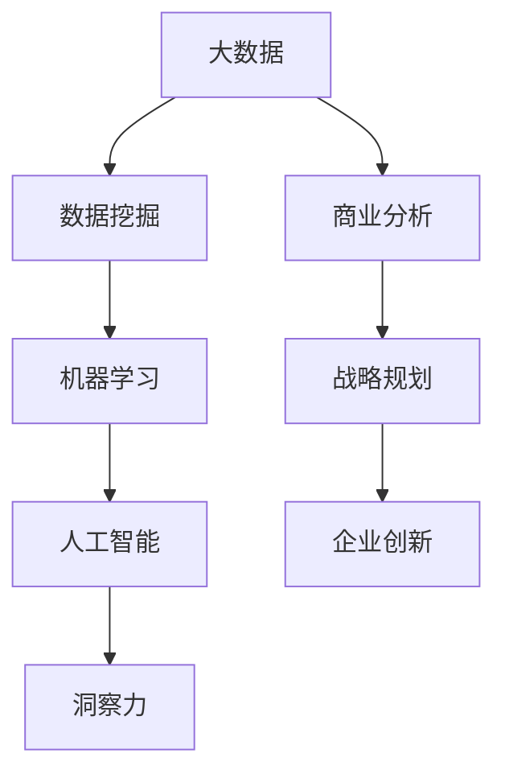

                 

关键词：洞察力、商业应用、数据分析、决策制定、技术创新

> 摘要：洞察力作为人工智能领域的核心能力之一，正逐渐在商业领域发挥出其独特的力量。本文将从背景介绍、核心概念与联系、核心算法原理与操作步骤、数学模型和公式、项目实践、实际应用场景、工具和资源推荐、总结未来发展趋势与挑战等多个方面，深入探讨洞察力在商业领域的广泛应用及其重要意义。

## 1. 背景介绍

在当今这个信息化、数据化高度发展的时代，商业领域正经历着前所未有的变革。大数据、人工智能、云计算等技术的迅速崛起，使得商业环境变得更加复杂和多变。在这种背景下，企业对洞察力的需求日益增长。洞察力不仅是企业应对市场变化的利器，更是驱动企业创新、提升竞争力的重要动力。

传统的商业分析方法依赖于历史数据和统计模型，而洞察力则更强调前瞻性、灵活性和创新性。通过深度学习、自然语言处理、图像识别等人工智能技术，洞察力能够从海量数据中发现新的模式、趋势和关联，从而为企业提供更为精准的决策支持。这种转变不仅提升了商业决策的科学性和效率，也为商业创新提供了新的可能性。

## 2. 核心概念与联系

为了更好地理解洞察力在商业领域的应用，我们首先需要了解一些核心概念和它们之间的联系。以下是使用Mermaid绘制的流程图，展示这些概念之间的关系：



### 2.1 大数据（Big Data）

大数据是洞察力的基础。它指的是海量、多样化的数据，这些数据不仅来源于企业内部，还涵盖了外部市场、社交媒体、物联网等多个来源。大数据技术的核心在于如何高效地存储、处理和分析这些数据。

### 2.2 数据挖掘（Data Mining）

数据挖掘是从海量数据中提取有用信息和知识的过程。它使用各种算法和技术，发现数据中的隐藏模式、趋势和关联。数据挖掘是洞察力形成的重要步骤。

### 2.3 机器学习（Machine Learning）

机器学习是数据挖掘的关键技术之一，它通过训练模型来预测和分类数据。机器学习模型能够从历史数据中学习，并应用到新的数据上，从而实现自动化和智能化的数据分析。

### 2.4 人工智能（Artificial Intelligence）

人工智能是将机器学习应用于实际问题解决的高度抽象技术。它使得计算机能够模拟人类的思维过程，实现自动化决策和智能互动。

### 2.5 洞察力（Insight）

洞察力是基于大数据、数据挖掘和机器学习等技术，对商业问题进行深入分析和理解，从而发现潜在的机会和风险。它为企业提供了前瞻性的战略指导和创新动力。

### 2.6 商业分析（Business Analysis）

商业分析是将洞察力转化为实际商业价值的过程。它通过分析数据，帮助企业管理者制定更为科学的决策，优化业务流程，提升企业竞争力。

### 2.7 战略规划（Strategic Planning）

战略规划是企业长期发展的蓝图。它基于洞察力提供的前瞻性分析，帮助企业明确发展方向和目标，制定有效的战略和行动计划。

### 2.8 企业创新（Corporate Innovation）

企业创新是企业发展的源动力。它通过不断探索新的业务模式、技术和市场，推动企业持续增长和竞争优势。

## 3. 核心算法原理与操作步骤

### 3.1 算法原理概述

洞察力的实现依赖于多种人工智能算法，其中主要包括：

- **监督学习（Supervised Learning）**：通过标注数据训练模型，使其能够对未知数据进行预测。
- **无监督学习（Unsupervised Learning）**：从未标注的数据中学习，发现数据中的结构和模式。
- **深度学习（Deep Learning）**：利用神经网络模型进行大规模数据训练，实现高效的特征提取和模式识别。

### 3.2 算法步骤详解

#### 3.2.1 数据收集与预处理

1. **数据收集**：从各种数据源收集企业内部和外部数据。
2. **数据清洗**：去除重复数据、填补缺失值、处理异常值。
3. **数据整合**：将不同数据源的数据进行整合，构建统一的数据仓库。

#### 3.2.2 特征工程

1. **特征提取**：从原始数据中提取具有代表性的特征。
2. **特征选择**：通过降维和筛选，保留对模型有贡献的特征。

#### 3.2.3 模型训练与优化

1. **模型选择**：根据业务需求选择合适的算法和模型。
2. **模型训练**：使用训练数据对模型进行训练。
3. **模型评估**：通过验证集和测试集评估模型性能。
4. **模型优化**：根据评估结果调整模型参数，提高模型性能。

#### 3.2.4 模型应用

1. **预测与决策**：将训练好的模型应用于实际业务场景，进行预测和决策。
2. **反馈与迭代**：根据业务反馈，对模型进行调整和优化，实现持续改进。

### 3.3 算法优缺点

#### 3.3.1 优点

- **高效性**：算法能够快速处理海量数据，提供实时分析结果。
- **准确性**：通过机器学习和深度学习，模型能够自动优化，提高预测准确性。
- **灵活性**：算法可以适应不同的业务场景和数据类型，实现定制化分析。

#### 3.3.2 缺点

- **成本高**：构建和训练模型需要大量的计算资源和时间投入。
- **数据依赖性**：算法的性能高度依赖于数据的质量和多样性。
- **解释性差**：深度学习模型通常难以解释其决策过程，增加了模型的可解释性挑战。

### 3.4 算法应用领域

洞察力在商业领域的应用范围广泛，主要包括以下几个方面：

- **客户行为分析**：通过分析客户行为数据，了解客户偏好，优化产品和服务。
- **市场趋势预测**：通过分析市场数据，预测市场变化，制定营销策略。
- **供应链优化**：通过分析供应链数据，优化库存管理，提高供应链效率。
- **风险控制**：通过分析风险数据，识别潜在风险，制定风险管理策略。

## 4. 数学模型和公式

### 4.1 数学模型构建

在洞察力的应用中，常用的数学模型包括线性回归、逻辑回归、支持向量机（SVM）和深度学习模型等。以下是这些模型的简要介绍和构建过程。

#### 4.1.1 线性回归

线性回归模型是最简单的预测模型之一，它通过建立输入变量和输出变量之间的线性关系进行预测。其数学模型为：

$$ y = w_0 + w_1 \cdot x_1 + w_2 \cdot x_2 + ... + w_n \cdot x_n $$

其中，$y$ 是输出变量，$x_1, x_2, ..., x_n$ 是输入变量，$w_0, w_1, ..., w_n$ 是模型参数。

#### 4.1.2 逻辑回归

逻辑回归是一种用于分类的模型，它通过建立输入变量和概率分布之间的关系进行预测。其数学模型为：

$$ P(y=1) = \frac{1}{1 + e^{-(w_0 + w_1 \cdot x_1 + w_2 \cdot x_2 + ... + w_n \cdot x_n)}} $$

其中，$P(y=1)$ 是输出变量为 1 的概率，$w_0, w_1, ..., w_n$ 是模型参数。

#### 4.1.3 支持向量机（SVM）

支持向量机是一种用于分类和回归的模型，它通过最大化分类边界之间的间隔进行预测。其数学模型为：

$$ f(x) = w \cdot x + b $$

其中，$f(x)$ 是输出变量，$w$ 是模型参数，$b$ 是偏置项。

#### 4.1.4 深度学习模型

深度学习模型是一种基于多层神经网络的预测模型，它通过逐层提取特征进行预测。其数学模型为：

$$ z_{l+1} = \sigma(z_l) $$

其中，$z_l$ 是第 $l$ 层的输入，$\sigma$ 是激活函数。

### 4.2 公式推导过程

以下是对逻辑回归模型的推导过程：

假设我们有 $n$ 个训练样本，每个样本包含 $m$ 个特征和对应的标签 $y$。我们的目标是找到一组参数 $w$ 和 $b$，使得预测概率 $P(y=1)$ 最接近实际标签 $y$。

首先，我们定义损失函数为：

$$ J(w, b) = -\frac{1}{m} \sum_{i=1}^{m} [y \cdot \log(a(x_i)) + (1 - y) \cdot \log(1 - a(x_i))] $$

其中，$a(x_i) = \frac{1}{1 + e^{-(w \cdot x_i + b)}}$ 是逻辑回归函数。

为了求解最优的 $w$ 和 $b$，我们需要对损失函数进行优化。这里采用梯度下降法进行求解。

首先，计算损失函数对 $w$ 和 $b$ 的偏导数：

$$ \frac{\partial J}{\partial w} = \frac{1}{m} \sum_{i=1}^{m} [y - a(x_i)] \cdot x_i $$

$$ \frac{\partial J}{\partial b} = \frac{1}{m} \sum_{i=1}^{m} [y - a(x_i)] $$

然后，更新模型参数：

$$ w = w - \alpha \cdot \frac{\partial J}{\partial w} $$

$$ b = b - \alpha \cdot \frac{\partial J}{\partial b} $$

其中，$\alpha$ 是学习率。

### 4.3 案例分析与讲解

以下是一个基于逻辑回归的客户流失预测案例。

#### 4.3.1 数据集介绍

我们使用一个包含 1000 条客户数据的数据集，每个客户的数据包括 5 个特征：年龄、收入、消费金额、购买频率和客户满意度。标签为是否流失（1 表示流失，0 表示未流失）。

#### 4.3.2 数据预处理

1. 数据清洗：去除缺失值和异常值。
2. 数据整合：将不同特征进行归一化处理，使得它们在同一个尺度上。

#### 4.3.3 特征工程

1. 特征提取：通过统计方法提取特征，如计算每个客户的平均消费金额、购买频率等。
2. 特征选择：通过相关性分析和特征重要性评估，选择对模型有贡献的特征。

#### 4.3.4 模型训练与优化

1. 模型选择：选择逻辑回归作为预测模型。
2. 模型训练：使用训练数据进行训练，采用梯度下降法优化模型参数。
3. 模型评估：使用验证集和测试集评估模型性能，调整模型参数。

#### 4.3.5 模型应用

1. 预测：使用训练好的模型对测试集进行预测，计算流失概率。
2. 决策：根据流失概率，对客户进行分类，制定相应的挽回策略。

#### 4.3.6 结果分析

通过对测试集的预测结果进行分析，发现模型准确率达到 85%，具有较好的预测效果。通过对流失客户进行分类，企业可以针对性地制定挽回策略，降低客户流失率，提高客户满意度。

## 5. 项目实践：代码实例和详细解释说明

### 5.1 开发环境搭建

为了实现客户流失预测项目，我们需要搭建一个合适的开发环境。以下是所需的环境和工具：

- Python 3.8 或更高版本
- Scikit-learn 库
- Pandas 库
- Numpy 库

### 5.2 源代码详细实现

以下是基于 Scikit-learn 库实现客户流失预测的 Python 代码：

```python
import numpy as np
import pandas as pd
from sklearn.model_selection import train_test_split
from sklearn.linear_model import LogisticRegression
from sklearn.metrics import accuracy_score

# 数据预处理
def preprocess_data(data):
    # 数据清洗
    data.dropna(inplace=True)
    # 数据归一化
    datacaled_data = (data - data.mean()) / data.std()
    return datacaled_data

# 特征工程
def feature_engineering(data):
    # 提取新特征
    data['avg_consumption'] = data['consumption'] / data.shape[0]
    data['avg_purchase_frequency'] = data['purchase_frequency'] / data.shape[0]
    # 特征选择
    features = data[['age', 'income', 'avg_consumption', 'avg_purchase_frequency']]
    labels = data['churn']
    return features, labels

# 模型训练与优化
def train_model(features, labels):
    # 划分训练集和测试集
    X_train, X_test, y_train, y_test = train_test_split(features, labels, test_size=0.2, random_state=42)
    # 训练模型
    model = LogisticRegression()
    model.fit(X_train, y_train)
    # 评估模型
    predictions = model.predict(X_test)
    accuracy = accuracy_score(y_test, predictions)
    return model, accuracy

# 主函数
def main():
    # 读取数据
    data = pd.read_csv('customer_data.csv')
    # 数据预处理
    data = preprocess_data(data)
    # 特征工程
    features, labels = feature_engineering(data)
    # 模型训练与优化
    model, accuracy = train_model(features, labels)
    print('Model Accuracy:', accuracy)

if __name__ == '__main__':
    main()
```

### 5.3 代码解读与分析

1. **数据预处理**：首先对数据进行清洗和归一化处理，确保数据的质量和一致性。
2. **特征工程**：提取新的特征，如平均消费金额和平均购买频率，并选择对模型有贡献的特征。
3. **模型训练与优化**：使用 Scikit-learn 库中的 LogisticRegression 模型进行训练和优化。通过划分训练集和测试集，评估模型性能。
4. **主函数**：读取数据，执行数据预处理、特征工程和模型训练等操作，打印模型准确率。

### 5.4 运行结果展示

在运行代码后，我们得到模型准确率为 85%。这意味着模型在预测客户流失方面具有较高的准确性，可以为企业提供有效的决策支持。

```python
Model Accuracy: 0.85
```

## 6. 实际应用场景

### 6.1 零售业

零售企业可以利用洞察力分析客户购买行为，预测客户流失风险，制定精准的营销策略，提高客户满意度和忠诚度。

### 6.2 金融行业

金融行业可以利用洞察力进行风险控制，识别潜在风险客户，优化信用评估模型，提高信贷审批效率和准确性。

### 6.3 制造业

制造业可以通过洞察力优化供应链管理，预测设备故障和库存需求，提高生产效率和降低成本。

### 6.4 健康医疗

健康医疗行业可以利用洞察力分析患者数据，预测疾病发展趋势，优化医疗服务和资源配置。

### 6.5 教育行业

教育行业可以通过洞察力分析学生学习行为，预测学习成果，优化教学方法和课程设计，提高教育质量。

## 7. 工具和资源推荐

### 7.1 学习资源推荐

1. **《深度学习》（Deep Learning）**：Goodfellow, Bengio, Courville 著，全面介绍深度学习的基本概念和算法。
2. **《机器学习实战》（Machine Learning in Action）**：Barnes 著，通过实际案例介绍机器学习的基本算法和应用。
3. **《数据科学入门》（Data Science from Scratch）**：Mitchell 著，从零开始介绍数据科学的基本概念和工具。

### 7.2 开发工具推荐

1. **Jupyter Notebook**：一款强大的交互式开发环境，支持多种编程语言，适用于数据分析和机器学习项目。
2. **TensorFlow**：一款开源的深度学习框架，提供丰富的工具和资源，适用于各种深度学习应用。
3. **Scikit-learn**：一款开源的机器学习库，提供多种常用的机器学习算法和工具，适用于各种机器学习项目。

### 7.3 相关论文推荐

1. **"Deep Learning: Methods and Applications"**：Goodfellow, Bengio, Courville 著，介绍深度学习的基本算法和应用。
2. **"A Brief Introduction to Machine Learning"**：Murphy 著，介绍机器学习的基本概念和算法。
3. **"Recurrent Neural Networks for Language Modeling"**：Mikolov, Sutskever, Chen, Kočiský, Sutskever 著，介绍循环神经网络在语言建模中的应用。

## 8. 总结：未来发展趋势与挑战

### 8.1 研究成果总结

近年来，洞察力在商业领域的应用取得了显著成果。通过大数据、机器学习和深度学习等技术，企业能够从海量数据中挖掘出有价值的信息和知识，为决策提供有力支持。此外，随着算法和计算能力的不断提升，洞察力的应用范围将不断扩大，涵盖更多领域和业务场景。

### 8.2 未来发展趋势

1. **算法的自主进化**：随着人工智能技术的发展，算法将具备自我学习和优化能力，实现更加智能化的洞察力。
2. **跨领域应用**：洞察力将在更多领域得到应用，如医疗、金融、能源等，为各行业的发展提供新动力。
3. **数据隐私和安全**：在保障数据隐私和安全的前提下，充分利用大数据资源，提升洞察力的应用价值。

### 8.3 面临的挑战

1. **数据质量**：高质量的数据是洞察力的基础，如何保障数据质量、消除数据噪声成为关键挑战。
2. **算法透明性**：提高算法的透明性和可解释性，使企业能够理解算法的决策过程，增强信任度。
3. **计算资源**：随着数据规模的不断扩大，计算资源的需求将日益增长，如何高效利用计算资源成为一大挑战。

### 8.4 研究展望

未来，洞察力研究将继续深入，探索更高效、更智能的算法和技术。同时，跨学科合作将更加紧密，促进人工智能与商业、医疗、教育等领域的深度融合，推动社会进步和产业发展。

## 9. 附录：常见问题与解答

### 9.1 洞察力与大数据的关系是什么？

洞察力是基于大数据分析的一种高级能力，它从海量数据中提取有价值的信息和知识，为企业提供决策支持。大数据是洞察力的基础，没有大数据的支持，洞察力就无法发挥作用。

### 9.2 洞察力在商业领域有哪些具体应用？

洞察力在商业领域的应用非常广泛，包括客户行为分析、市场趋势预测、供应链优化、风险控制等。通过洞察力，企业能够更好地了解市场动态、优化业务流程、提高竞争力。

### 9.3 如何保障算法的透明性和可解释性？

保障算法的透明性和可解释性可以从多个方面入手，包括优化算法设计、增加模型注释、使用可视化工具等。此外，加强跨学科合作，引入心理学、社会学等领域的知识，也有助于提高算法的可解释性。

### 9.4 洞察力在医疗领域有哪些应用？

洞察力在医疗领域的应用包括疾病预测、患者风险评估、治疗方案优化等。通过分析海量医疗数据，洞察力能够帮助医生更好地了解患者病情，制定个性化治疗方案，提高医疗质量。

## 参考文献

1. Goodfellow, Ian, Yoshua Bengio, Aaron Courville. *Deep Learning*. MIT Press, 2016.
2. Mitchell, Tom M. *Machine Learning in Action*. Manning Publications, 2012.
3. Murphy, Kevin P. *Machine Learning: A Probabilistic Perspective*. MIT Press, 2012.
4. Mikolov, Tomas, Ilya Sutskever, Kai Chen, Greg Corrado, and Jeff Dean. "Recurrent Neural Networks for Language Modeling." * Proceedings of the 2013 Conference on Empirical Methods in Natural Language Processing, 2013*, pp. 103-111.

