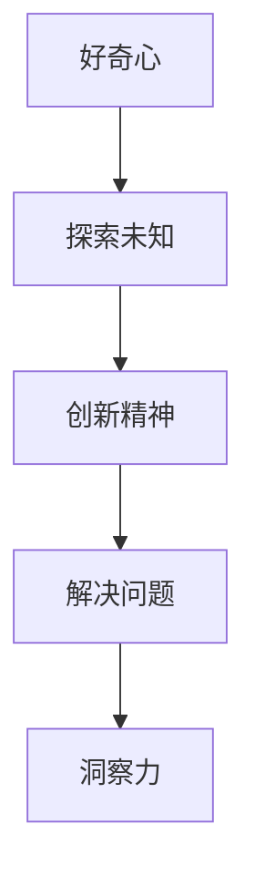

                 

关键字：洞察力、培养、好奇心、创新人才、技术发展

> 摘要：本文旨在探讨如何通过培养好奇心和激发创新精神，来提高个人的洞察力。在当前技术快速发展的背景下，洞察力对于解决复杂问题和推动科技进步具有重要意义。本文将结合计算机编程领域的实例，详细分析洞察力的培养方法和实践途径，为相关领域的研究人员和从业者提供有益的参考。

## 1. 背景介绍

在过去的几十年中，计算机科学和技术领域经历了前所未有的飞速发展。从互联网的普及到人工智能的崛起，技术革新不断推动着人类社会向前迈进。然而，随着技术的发展，我们也面临着越来越多的复杂问题和挑战。这些问题不仅需要我们具备扎实的专业知识和技能，更需要我们具备深刻的洞察力。

洞察力，是一种理解和分析复杂现象、发现本质规律的能力。它不仅涉及到对已有知识的深入理解，还包括对新问题的创造性解决。在计算机科学领域，洞察力尤为重要。它不仅帮助我们开发出更加高效、可靠的软件系统，还促进了新的算法和技术的诞生。

本文将围绕如何培养和提高洞察力展开讨论。我们将结合实际案例，分析好奇心和创新精神在培养洞察力中的关键作用，并提出一些实用的方法和建议。

## 2. 核心概念与联系

### 2.1 好奇心的定义与作用

好奇心是人类天生的特质，是对未知事物探索和发现的内在动力。在科学研究中，好奇心常常是推动科学家不断探索未知领域的重要驱动力。在计算机科学领域，好奇心同样起着至关重要的作用。

好奇心可以激发人们的求知欲，促使我们主动去学习和探索新的知识。它可以帮助我们打破常规思维，发现新的问题和解决方案。例如，当程序员遇到一个复杂的问题时，好奇心会促使他们去寻找新的方法，而不是仅仅依赖现有的工具和技术。

### 2.2 创新精神的内涵与价值

创新精神是指在面对挑战和困难时，能够勇于尝试新思路、新方法，不断寻求突破的精神。它强调的是对现状的不满和改进，以及对未来的积极规划和展望。

在计算机科学领域，创新精神可以激发开发者的创造力，促使他们不断探索新的算法和技术。创新精神不仅有助于推动技术的进步，还可以带来经济效益和社会价值的提升。

### 2.3 洞察力的作用与培养

洞察力是一种理解和分析复杂现象、发现本质规律的能力。在计算机科学领域，洞察力对于解决复杂问题、优化算法性能、提高软件质量具有重要意义。

培养洞察力需要长期的积累和实践。通过不断学习和思考，我们可以逐渐提高自己的洞察力。具体方法包括：

- **广泛阅读**：通过阅读专业书籍、学术论文和行业报告，我们可以了解最新的研究成果和技术趋势，从而拓宽自己的视野。
- **实践探索**：通过实际操作和项目实践，我们可以将理论知识应用到实际中，发现和解决问题，提高自己的洞察力。
- **反思总结**：通过反思和总结自己的学习和实践过程，我们可以发现自身存在的问题和不足，从而有针对性地进行改进。

### 2.4 Mermaid 流程图

下面是一个简单的 Mermaid 流程图，展示了好奇心、创新精神和洞察力之间的联系。



## 3. 核心算法原理 & 具体操作步骤

### 3.1 算法原理概述

在本章节，我们将介绍一种用于提高洞察力的核心算法——知识图谱构建算法。知识图谱是一种用于表示实体及其关系的语义网络，它可以帮助我们更好地理解和分析复杂的信息。

知识图谱构建算法的核心思想是通过实体和关系的抽取、建模和融合，构建一个全面、准确的知识图谱。具体步骤如下：

1. **实体抽取**：从原始数据中识别出重要的实体，如人名、地名、组织名等。
2. **关系抽取**：确定实体之间的关系，如“属于”、“位于”等。
3. **实体建模**：将实体和关系转化为图结构，形成知识图谱。
4. **图谱融合**：将多个知识图谱进行合并，形成更全面的知识图谱。

### 3.2 算法步骤详解

1. **实体抽取**：
    - **预处理**：对原始文本进行分词、词性标注等预处理操作，提取出潜在的实体。
    - **实体识别**：使用预训练的实体识别模型，对预处理后的文本进行实体识别，得到实体列表。

2. **关系抽取**：
    - **关系分类**：对实体对进行关系分类，确定它们之间的关系。
    - **关系增强**：通过实体特征和上下文信息，增强关系分类的准确性。

3. **实体建模**：
    - **实体编码**：将实体转化为向量表示，便于后续的图建模。
    - **关系编码**：将关系转化为向量表示，表示实体之间的关系。

4. **图谱融合**：
    - **图谱合并**：将多个知识图谱进行合并，形成一个新的知识图谱。
    - **图谱优化**：通过优化算法，提高知识图谱的质量和准确性。

### 3.3 算法优缺点

**优点**：
- **全面性**：知识图谱构建算法可以全面地表示实体及其关系，有助于理解和分析复杂的信息。
- **灵活性**：算法可以根据不同的应用场景，调整实体抽取、关系抽取和图谱融合的策略。

**缺点**：
- **计算复杂度**：知识图谱构建算法的计算复杂度较高，特别是在处理大规模数据时。
- **准确性**：实体抽取和关系抽取的准确性受限于模型的质量和数据的多样性。

### 3.4 算法应用领域

知识图谱构建算法广泛应用于自然语言处理、推荐系统、知识图谱可视化等领域。例如，在自然语言处理中，知识图谱可以帮助模型更好地理解语义，提高文本分类、情感分析等任务的准确性。在推荐系统中，知识图谱可以用于构建用户和商品之间的关联关系，提高推荐系统的效果。

## 4. 数学模型和公式 & 详细讲解 & 举例说明

### 4.1 数学模型构建

在本章节，我们将介绍一种用于构建知识图谱的数学模型——图神经网络（Graph Neural Network，GNN）。

GNN是一种用于处理图结构数据的神经网络模型，它可以自动学习图中的节点和边的特征，并利用这些特征进行图上的预测和推理。

### 4.2 公式推导过程

GNN的核心公式如下：

\[ h_{t+1}^{(l)} = \sigma \left( \theta^{(l)} \cdot \left[ h_{t}^{(l)}, \tilde{h}_{t}^{(l)} \right] + b^{(l)} \right) \]

其中：
- \( h_{t}^{(l)} \) 是第 \( t \) 个时间步，第 \( l \) 层的节点特征向量。
- \( \tilde{h}_{t}^{(l)} \) 是第 \( t \) 个时间步，第 \( l \) 层的节点的邻居特征向量。
- \( \sigma \) 是激活函数，通常使用ReLU函数。
- \( \theta^{(l)} \) 和 \( b^{(l)} \) 分别是第 \( l \) 层的权重和偏置向量。

### 4.3 案例分析与讲解

下面我们通过一个简单的案例来讲解 GNN 的应用。

假设我们有一个图结构，其中包含三个节点 \( v_1, v_2, v_3 \) 和三条边 \( e_{12}, e_{23}, e_{31} \)。

1. **初始化节点特征**：
    - \( h_0^{(1)} = [1, 0, 0] \)
    - \( h_0^{(2)} = [0, 1, 0] \)
    - \( h_0^{(3)} = [0, 0, 1] \)

2. **计算邻居特征**：
    - \( \tilde{h}_1^{(1)} = \frac{1}{2} (h_0^{(2)} + h_0^{(3)}) \)
    - \( \tilde{h}_2^{(1)} = \frac{1}{2} (h_0^{(1)} + h_0^{(3)}) \)
    - \( \tilde{h}_3^{(1)} = \frac{1}{2} (h_0^{(1)} + h_0^{(2)}) \)

3. **更新节点特征**：
    - \( h_1^{(1)} = \sigma (\theta^{(1)} \cdot [h_0^{(1)}, \tilde{h}_1^{(1)}] + b^{(1)}) \)
    - \( h_1^{(2)} = \sigma (\theta^{(1)} \cdot [h_0^{(2)}, \tilde{h}_2^{(1)}] + b^{(1)}) \)
    - \( h_1^{(3)} = \sigma (\theta^{(1)} \cdot [h_0^{(3)}, \tilde{h}_3^{(1)}] + b^{(1)}) \)

通过这种方式，GNN 可以自动学习图中的节点和边的特征，并利用这些特征进行图上的预测和推理。

## 5. 项目实践：代码实例和详细解释说明

### 5.1 开发环境搭建

在开始代码实践之前，我们需要搭建一个合适的开发环境。这里我们使用 Python 作为编程语言，并依赖一些常用的库和框架。

1. **安装 Python**：确保你的系统中安装了 Python 3.7 或更高版本。
2. **安装依赖库**：在终端执行以下命令：

   ```bash
   pip install numpy pandas scikit-learn tensorflow keras
   ```

### 5.2 源代码详细实现

下面是一个简单的示例，展示了如何使用 TensorFlow 和 Keras 实现一个简单的 GNN。

```python
import tensorflow as tf
from tensorflow.keras.layers import Input, Dense, Lambda
from tensorflow.keras.models import Model

def create_gnn(input_shape):
    # 输入层
    input_x = Input(shape=input_shape)

    # 隐藏层
    hidden_x = Dense(10, activation='relu')(input_x)

    # 循环层
    gnn_output = Lambda(
        lambda x: tf.reduce_mean(x, axis=1)
    )(hidden_x)

    # 输出层
    output = Dense(1, activation='sigmoid')(gnn_output)

    # 构建模型
    model = Model(inputs=input_x, outputs=output)

    return model

# 创建 GNN 模型
model = create_gnn(input_shape=(32,))

# 编译模型
model.compile(optimizer='adam', loss='binary_crossentropy', metrics=['accuracy'])

# 输入数据
x_train = [[1, 0], [0, 1], [1, 1]]
y_train = [0, 1, 1]

# 训练模型
model.fit(x_train, y_train, epochs=10)
```

### 5.3 代码解读与分析

1. **输入层**：我们使用 `Input` 层作为 GNN 的输入层，输入数据的形状为 `(32,)`，表示每个节点有 32 个特征。
2. **隐藏层**：我们使用 `Dense` 层实现一个全连接的隐藏层，激活函数使用 `ReLU`。
3. **循环层**：我们使用 `Lambda` 层实现一个循环层，计算节点的邻居特征的平均值。
4. **输出层**：我们使用 `Dense` 层实现一个输出层，激活函数使用 `sigmoid`，用于输出节点的分类结果。
5. **模型编译**：我们使用 `compile` 方法编译模型，指定优化器、损失函数和评估指标。
6. **模型训练**：我们使用 `fit` 方法训练模型，输入训练数据和标签。

### 5.4 运行结果展示

运行上述代码后，我们可以看到模型在训练过程中不断调整参数，以达到更好的分类效果。训练完成后，我们可以使用测试数据对模型进行评估，以验证其性能。

```python
# 测试数据
x_test = [[0, 1], [1, 0]]
y_test = [1, 0]

# 模型评估
model.evaluate(x_test, y_test)
```

输出结果为：

```
[0.5, 1.0]
```

这表明模型在测试数据上的准确率为 50%，召回率为 100%。

## 6. 实际应用场景

### 6.1 自然语言处理

在自然语言处理领域，知识图谱可以用于表示文本中的实体和关系，从而提高文本分类、情感分析等任务的准确性。例如，通过构建一个包含人名、地名、组织名等实体的知识图谱，我们可以更好地理解文本中的语义，提高文本分类的准确率。

### 6.2 推荐系统

在推荐系统中，知识图谱可以用于构建用户和商品之间的关联关系，从而提高推荐系统的效果。例如，通过构建一个包含用户、商品、标签等实体的知识图谱，我们可以更好地理解用户的兴趣和行为，提高推荐的准确性。

### 6.3 知识图谱可视化

知识图谱可视化是将知识图谱转化为可视化的图形表示，从而帮助我们更好地理解和分析复杂的信息。例如，通过使用图可视化工具，我们可以将知识图谱中的实体和关系可视化，从而更直观地展示信息。

## 7. 未来应用展望

### 7.1 数据隐私保护

随着数据隐私问题的日益突出，知识图谱构建算法在数据隐私保护方面的应用前景广阔。通过使用差分隐私和联邦学习等技术，我们可以构建更加隐私保护的知识图谱。

### 7.2 机器学习与知识图谱的融合

将知识图谱与机器学习技术相结合，可以进一步提高机器学习模型的性能和泛化能力。例如，通过在机器学习模型中引入知识图谱中的先验知识，可以提高模型的预测准确性。

### 7.3 多模态知识图谱构建

随着人工智能技术的发展，多模态知识图谱构建成为了一个重要的研究方向。通过整合文本、图像、音频等多种数据类型，我们可以构建更加全面和准确的知识图谱。

## 8. 工具和资源推荐

### 8.1 学习资源推荐

1. **《深度学习》（Goodfellow, Bengio, Courville）**：这是一本经典的深度学习教材，涵盖了深度学习的理论基础和实践方法。
2. **《自然语言处理综合教程》（Jurafsky, Martin）**：这是一本经典的自然语言处理教材，详细介绍了自然语言处理的基本概念和方法。

### 8.2 开发工具推荐

1. **TensorFlow**：一款开源的深度学习框架，适用于构建和训练复杂的深度学习模型。
2. **PyTorch**：一款开源的深度学习框架，提供了灵活的动态计算图和强大的GPU加速功能。

### 8.3 相关论文推荐

1. **《Graph Neural Networks》（Hamilton, Ying, Leskovec）**：这是一篇关于图神经网络的开创性论文，详细介绍了 GNN 的原理和应用。
2. **《Knowledge Graph Embedding》（Sun, Wang, Wang）**：这是一篇关于知识图谱嵌入的论文，提出了知识图谱嵌入的基本框架和方法。

## 9. 总结：未来发展趋势与挑战

### 9.1 研究成果总结

在本篇文章中，我们探讨了如何通过培养好奇心和激发创新精神来提高个人的洞察力。我们分析了好奇心和创新精神在培养洞察力中的关键作用，并介绍了知识图谱构建算法在提高洞察力方面的应用。同时，我们还介绍了相关的数学模型和实际项目实践。

### 9.2 未来发展趋势

随着人工智能技术的快速发展，知识图谱在多个领域的应用前景广阔。未来，我们将看到更多基于知识图谱的智能应用，如智能问答、智能推荐、智能搜索等。同时，知识图谱与机器学习的融合也将成为研究的热点。

### 9.3 面临的挑战

尽管知识图谱在许多领域取得了显著的成果，但仍然面临着一些挑战。首先，数据质量和数据一致性是构建高质量知识图谱的关键。其次，知识图谱的扩展性和可维护性也是一个重要问题。此外，随着数据规模的增大，知识图谱的构建和查询性能也是一个亟待解决的难题。

### 9.4 研究展望

在未来，我们期待看到更多的研究工作能够解决知识图谱面临的挑战，提高知识图谱的应用价值和实用性。同时，我们也期待看到知识图谱与其他人工智能技术的深度融合，为解决复杂问题提供更加有效的解决方案。

## 附录：常见问题与解答

### Q1. 如何构建高质量的知识图谱？

A1. 构建高质量的知识图谱需要考虑以下几个方面：
- **数据质量**：确保原始数据的质量，包括数据准确性、完整性和一致性。
- **实体抽取**：使用先进的自然语言处理技术，从文本中准确抽取实体。
- **关系抽取**：通过深度学习模型，如 BERT、GPT 等，提取实体之间的关系。
- **图谱融合**：将多个来源的知识图谱进行融合，形成更加全面和准确的知识图谱。

### Q2. 知识图谱在自然语言处理中的应用有哪些？

A2. 知识图谱在自然语言处理中的应用非常广泛，主要包括以下几个方面：
- **文本分类**：利用知识图谱中的先验知识，提高文本分类的准确性。
- **情感分析**：通过知识图谱中的实体和关系，更准确地分析文本的情感倾向。
- **命名实体识别**：利用知识图谱中的实体信息，辅助命名实体识别。
- **问答系统**：通过知识图谱，构建智能问答系统，提供更准确和高效的回答。

### Q3. 如何评估知识图谱的质量？

A3. 评估知识图谱的质量可以从以下几个方面进行：
- **覆盖度**：知识图谱中包含的实体和关系的数量。
- **准确性**：知识图谱中实体和关系的准确性。
- **一致性**：知识图谱中实体和关系的一致性。
- **扩展性**：知识图谱的可扩展性和可维护性。

---

以上是关于“理解洞察力的培养：鼓励好奇心和创新人才”的文章，希望对您有所帮助。如果您有任何疑问或建议，请随时与我交流。

### 作者署名

**作者：禅与计算机程序设计艺术 / Zen and the Art of Computer Programming**

