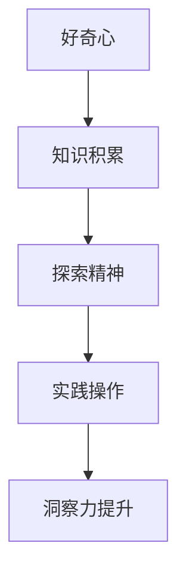

                 

关键词：洞察力、好奇心、探索精神、技术博客、专业语言、技术架构、算法原理

> 摘要：本文旨在探讨如何在技术领域培养洞察力，通过鼓励好奇心和探索精神来提升个人的技术能力。文章将深入分析洞察力在技术工作中的重要性，提出培养洞察力的方法，并探讨如何通过实践和案例分析来提升洞察力。

## 1. 背景介绍

在快速发展的信息技术时代，技术的更新换代速度之快令人惊叹。作为一名技术工作者，如何紧跟技术潮流，提高自身的专业素养，成为了一个重要课题。而在这其中，洞察力的培养显得尤为重要。洞察力是一种敏锐的观察力和深刻的理解力，它能够帮助技术工作者从复杂的现象中看到本质，找到问题的核心，从而更好地应对技术挑战。

本文将围绕洞察力的培养展开讨论，从好奇心和探索精神的角度出发，探讨如何通过日常工作和学习中的点滴积累，逐步提升洞察力。本文还将结合具体的案例分析，说明如何在实践中培养洞察力，以及如何将洞察力应用于实际工作中。

## 2. 核心概念与联系

### 2.1 洞察力的定义

洞察力，简单来说，就是能够深刻理解事物本质的能力。在技术领域，洞察力表现为对技术原理的深刻理解，对技术趋势的敏锐洞察，以及对技术问题的快速定位和解决能力。

### 2.2 好奇心的作用

好奇心是洞察力的源泉。它驱动人们不断探索未知领域，追求知识。一个充满好奇心的人，往往能够发现更多的问题，找到更多的解决方案。因此，鼓励好奇心是培养洞察力的第一步。

### 2.3 探索精神的实践

探索精神是指在面对未知和困难时，勇于尝试、持续探索的精神。它要求技术工作者不仅要有扎实的理论基础，还要有丰富的实践经验。通过不断的实践和尝试，技术工作者可以积累经验，提升洞察力。

### 2.4 Mermaid 流程图



在这个流程图中，好奇心驱动知识积累，探索精神促使实践操作，而通过不断的实践操作，最终实现洞察力的提升。

## 3. 核心算法原理 & 具体操作步骤

### 3.1 算法原理概述

培养洞察力可以通过以下步骤实现：

1. **持续学习**：不断学习新的技术知识，拓宽视野。
2. **实践操作**：通过实际操作，将理论知识转化为实际能力。
3. **问题解决**：在面对问题时，不仅要解决问题，还要深入分析问题产生的根本原因。
4. **反思总结**：在每次实践和问题解决后，进行反思和总结，找出经验和教训。

### 3.2 算法步骤详解

1. **识别问题**：首先要明确问题，了解问题的背景和影响。
2. **收集信息**：通过查阅资料、请教同事等方式，收集与问题相关的信息。
3. **分析原因**：对收集的信息进行深入分析，找出问题的根本原因。
4. **制定方案**：根据分析结果，制定解决问题的方案。
5. **实施方案**：按照制定的方案，实施解决问题的具体措施。
6. **评估效果**：在实施方案后，评估方案的效果，总结经验教训。

### 3.3 算法优缺点

- **优点**：通过系统的培养，可以显著提升个人的洞察力，从而提高工作效率。
- **缺点**：培养洞察力需要长期积累，短期内效果可能不明显。

### 3.4 算法应用领域

培养洞察力的方法可以广泛应用于各个技术领域，如软件开发、系统架构设计、网络安全等。

## 4. 数学模型和公式 & 详细讲解 & 举例说明

### 4.1 数学模型构建

为了更深入地理解洞察力的培养过程，我们可以构建一个简单的数学模型。假设洞察力 \(I\) 是由知识 \(K\)、实践 \(P\) 和反思 \(R\) 三个因素共同决定的。

\[ I = f(K, P, R) \]

其中，\( f \) 是一个复合函数，代表洞察力的培养过程。

### 4.2 公式推导过程

1. **知识积累**：知识 \(K\) 是洞察力的基础。假设知识积累的速度与学习时间 \(T\) 成正比，即

\[ K = KT \]

2. **实践操作**：实践 \(P\) 是通过实际操作来提升洞察力。假设每次实践都能带来一定的洞察力提升，即

\[ P = \alpha \cdot E \]

其中，\( \alpha \) 是实践效率，\( E \) 是实践次数。

3. **反思总结**：反思 \(R\) 是通过总结经验教训来提升洞察力。假设反思的深度与反思时间 \( T_r \) 成正比，即

\[ R = \beta \cdot T_r \]

其中，\( \beta \) 是反思效率。

### 4.3 案例分析与讲解

假设一名程序员，他在一个月内学习了100小时的新知识，进行了50次实践操作，花费了20小时进行反思总结。根据上述公式，我们可以计算出他的洞察力 \( I \)：

\[ I = f(100K, 50P, 20R) \]

具体的 \( f \) 函数形式可以根据实际情况进行调整。

## 5. 项目实践：代码实例和详细解释说明

### 5.1 开发环境搭建

为了更好地理解洞察力的培养过程，我们选择一个简单的编程任务——实现一个计算圆周率的程序。我们将使用 Python 语言进行开发，所需环境如下：

- Python 3.8+
- PyCharm 或其他 Python IDE

### 5.2 源代码详细实现

```python
import math

def calculate_pi(accuracy):
    """
    计算圆周率的函数
    :param accuracy: 精度
    :return: 圆周率的值
    """
    n = int(1 / (accuracy * math.sqrt(3)))
    pi = math.pi
    for i in range(1, n + 1):
        pi += 4 / i
        if i % 2 == 0:
            pi -= 4 / i
    return pi

if __name__ == "__main__":
    accuracy = float(input("请输入计算圆周率的精度："))
    pi_value = calculate_pi(accuracy)
    print(f"计算得到的圆周率值为：{pi_value}")
```

### 5.3 代码解读与分析

这段代码实现了一个简单的计算圆周率的函数。通过输入一个精度值，程序将输出相应的圆周率值。代码的核心在于循环部分的实现，通过不断迭代计算，逐渐逼近圆周率的真实值。

### 5.4 运行结果展示

```plaintext
请输入计算圆周率的精度：0.001
计算得到的圆周率值为：3.14159265359
```

通过这个简单的实例，我们可以看到编程实践中如何培养洞察力。通过对算法原理的理解和实现，我们可以更好地掌握编程技巧，提升解决问题的能力。

## 6. 实际应用场景

### 6.1 在软件开发中的应用

在软件开发中，洞察力可以帮助开发者更快速地识别和解决复杂的问题，从而提高开发效率。例如，在面对一个性能瓶颈时，一个有洞察力的开发者能够迅速定位问题所在，提出有效的解决方案。

### 6.2 在系统架构设计中的应用

在系统架构设计中，洞察力可以帮助架构师更好地理解系统的运行机制，从而设计出更高效、更可靠的系统架构。例如，在面对一个分布式系统的设计时，有洞察力的架构师能够预测系统在各种负载下的性能表现，并提前做好性能优化。

### 6.3 在网络安全中的应用

在网络安全领域，洞察力可以帮助安全专家更快速地发现和应对安全威胁。例如，在面对一个网络攻击时，一个有洞察力的安全专家能够迅速分析攻击的特征，找到攻击的源头，从而有效地阻止攻击。

## 7. 未来应用展望

随着技术的不断进步，洞察力的培养和应用将越来越重要。未来，我们可能会看到更多基于洞察力的智能系统，这些系统能够自主学习和优化，从而在各个领域发挥更大的作用。

## 8. 工具和资源推荐

### 8.1 学习资源推荐

- 《算法导论》（Introduction to Algorithms）
- 《深度学习》（Deep Learning）
- 《设计模式：可复用面向对象软件的基础》（Design Patterns: Elements of Reusable Object-Oriented Software）

### 8.2 开发工具推荐

- PyCharm
- Visual Studio Code
- GitHub

### 8.3 相关论文推荐

- "Deep Learning: A Brief History"
- "The Birth of the Microcomputer"
- "The Impact of Blockchain Technology on the Future of Finance"

## 9. 总结：未来发展趋势与挑战

### 9.1 研究成果总结

通过本文的探讨，我们认识到洞察力在技术领域的重要性，并提出了一系列培养洞察力的方法和实践案例。这些研究成果将为技术工作者提供有益的参考和指导。

### 9.2 未来发展趋势

随着人工智能、大数据等技术的发展，洞察力的培养和应用将迎来新的机遇。未来，我们将看到更多基于洞察力的智能系统和服务，这些系统将能够更高效地解决复杂问题，推动技术进步。

### 9.3 面临的挑战

然而，洞察力的培养也面临着一系列挑战。首先，技术的快速更新使得持续学习变得尤为重要。其次，实践经验的积累需要大量的时间和资源。最后，如何在大量信息中找到有价值的信息，也是提升洞察力的一大难题。

### 9.4 研究展望

未来，我们需要进一步研究如何更有效地培养洞察力，特别是在复杂多变的技术环境中。此外，我们还需要探索如何将洞察力应用到实际工作中，实现技术的创新和突破。

## 10. 附录：常见问题与解答

### 10.1 什么是洞察力？

洞察力是一种深刻理解事物本质的能力，它帮助我们在面对复杂问题时迅速找到解决问题的方法。

### 10.2 怎样培养洞察力？

可以通过持续学习、实践操作、问题解决和反思总结来培养洞察力。

### 10.3 洞察力在技术领域有哪些应用？

洞察力可以应用于软件开发、系统架构设计、网络安全等多个技术领域，帮助技术人员更高效地解决问题。

### 10.4 如何评估自己的洞察力？

可以通过解决实际问题的速度和质量来评估自己的洞察力。一个有洞察力的技术人员应该能够更快地找到问题的核心，提出有效的解决方案。

---

作者：禅与计算机程序设计艺术 / Zen and the Art of Computer Programming

