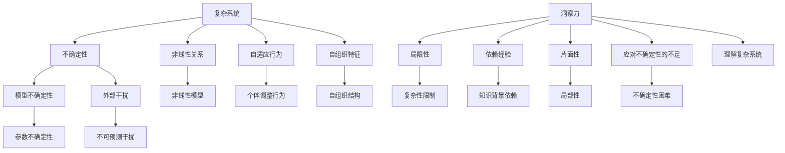
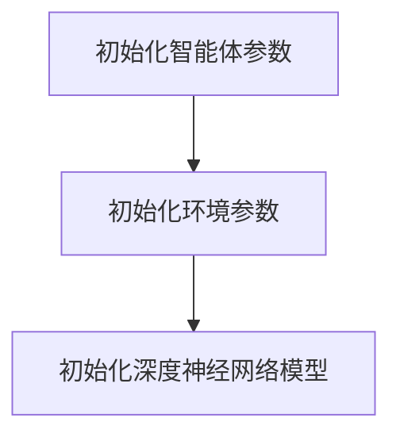
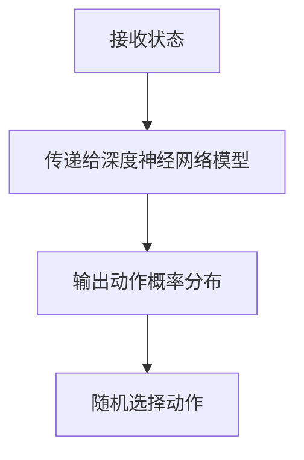
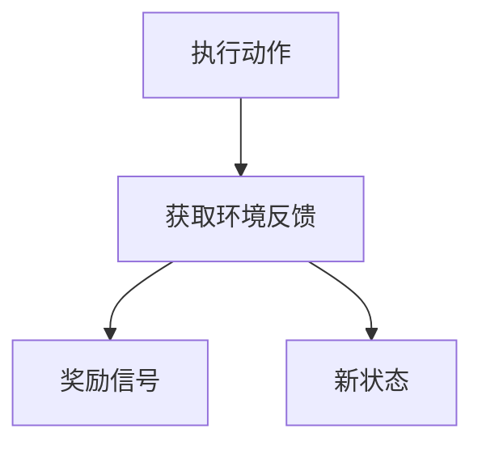
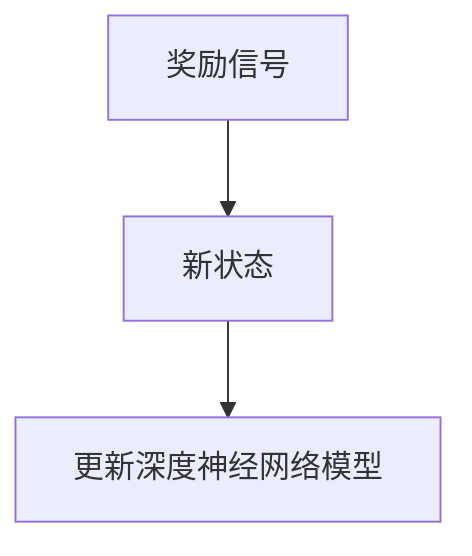
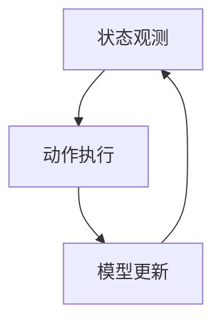
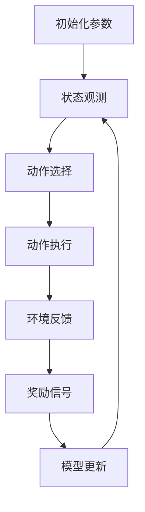

                 

## 摘要 Summary

在信息爆炸和技术飞速发展的当今时代，洞察力在解决复杂问题、推动创新中显得尤为重要。然而，本文旨在揭示洞察力的局限性，强调在应对复杂性和不确定性时，我们往往需要超越单一的洞察力，采取更为全面和系统的思维方式。本文将探讨复杂系统中的核心概念，分析核心算法原理，并详细讲解数学模型和公式。此外，通过项目实践和实际应用场景的探讨，我们将进一步理解如何在实际操作中应对这些挑战。最后，本文将对未来的发展趋势和挑战进行展望，并总结研究成果，提出研究展望。希望通过本文的深入探讨，能帮助读者在技术领域内更好地理解和应对复杂性和不确定性。

## 1. 背景介绍 Introduction

在现代社会，技术的飞速发展让我们的生活和工作发生了翻天覆地的变化。从计算机科学到人工智能，从大数据到物联网，每一项新技术的出现都为我们的生活方式和思维方式带来了新的可能性。然而，这种技术进步同时也带来了前所未有的复杂性和不确定性。如何应对这些复杂性和不确定性，成为了当前学术界和工业界共同关注的重要课题。

### 1.1 复杂性 Complexity

复杂性是指系统中变量之间的相互依赖和相互作用程度。复杂性不仅体现在自然界的生态系统中，如天气变化、生态系统平衡等，也存在于人类社会的各种系统中，如金融市场、社会网络等。复杂性研究的一个核心问题是理解如何从简单的规则推导出复杂的行为。在计算机科学领域，复杂性理论一直是研究的热点，如算法复杂度分析、分布式计算、并行计算等。然而，尽管我们在理论上对复杂性有了较为深入的理解，但在实际应用中，如何有效应对复杂系统仍然是一个巨大的挑战。

### 1.2 不确定性 Uncertainty

不确定性是指系统状态无法完全预测或无法准确测量的情况。在技术领域，不确定性通常来源于数据的不完整性、噪声、模型的不确定性等。例如，在机器学习中，训练数据的噪声可能会导致模型的泛化能力下降；在金融市场中，投资者的情绪波动会导致市场价格的不确定性。如何准确捕捉和处理不确定性，是当前许多领域面临的关键问题。

### 1.3 洞察力 Insight

洞察力是指从表面现象中看出本质规律、发现问题核心的能力。在技术领域中，洞察力对于解决问题、推动创新具有重要意义。例如，在人工智能领域，通过深度学习算法，我们可以从大量的数据中提取出有用的特征，从而实现自动分类、图像识别等功能。然而，尽管洞察力在许多情况下是有效的，但它也存在局限性。

首先，洞察力往往依赖于个人的经验和知识背景。这意味着不同的观察者可能会得出不同的结论，甚至在同一观察者身上，随着时间和环境的变化，其洞察力也可能发生变化。

其次，洞察力通常是局部的、片面的。我们很难通过一次观察就全面了解一个复杂的系统，因此，仅凭洞察力往往无法给出完整的解决方案。

最后，洞察力在面对高度不确定性的系统时，往往显得力不从心。在复杂性和不确定性交织的领域中，我们需要更为全面和系统的思维方式。

本文旨在探讨洞察力的局限性，并介绍一些应对复杂性和不确定性的策略和方法，以期为技术领域的研究和实践提供一些新的思路和启示。

## 2. 核心概念与联系 Core Concepts and Relationships

### 2.1 复杂系统 Complex Systems

复杂系统是指由大量相互作用的个体组成的系统，这些个体之间的相互作用导致系统整体表现出非线性、自适应和自组织等特征。复杂系统的一个典型例子是生态系统的食物链，其中每个物种都与其他物种相互作用，形成一个复杂的网络。在技术领域，复杂系统可以包括计算机网络、物联网、金融系统等。

复杂系统的核心特征包括：

- **非线性**：系统内部的变量之间往往存在非线性关系，这意味着简单的线性模型可能无法准确描述系统的行为。
- **自适应**：系统中的个体能够根据环境变化调整自身的行为，这使得系统具有一定的鲁棒性和适应性。
- **自组织**：系统可以通过个体间的相互作用自发地形成有序的结构和模式。

### 2.2 不确定性 Uncertainty

不确定性是复杂系统中的一个重要概念，它指的是系统状态无法完全预测或无法准确测量的情况。在技术领域，不确定性可以来源于多个方面，包括：

- **数据的不完整性**：现实世界中的数据往往是不完整的，例如，缺失值、噪声等。
- **模型的不确定性**：模型的参数和假设可能存在不确定性，这会导致模型预测的不准确。
- **外部干扰**：系统的外部环境可能会对系统状态产生不可预测的干扰。

### 2.3 洞察力 Insight

洞察力是指从表面现象中看出本质规律、发现问题核心的能力。在技术领域中，洞察力对于解决问题、推动创新具有重要意义。然而，洞察力也有其局限性，具体表现在：

- **依赖经验**：洞察力往往依赖于个人的经验和知识背景。
- **片面性**：洞察力通常是局部的、片面的，难以全面了解一个复杂的系统。
- **应对不确定性的不足**：在高度不确定性的系统中，仅凭洞察力往往无法给出有效的解决方案。

### 2.4 复杂性、不确定性和洞察力的关系

复杂性、不确定性和洞察力之间存在密切的关系。复杂系统中的不确定性使得我们对系统的理解变得更加困难，而洞察力作为一种理解工具，其局限性又进一步加剧了这种困难。具体来说：

- **复杂性增加了不确定性的难度**：在复杂系统中，变量之间的相互作用使得系统的行为变得更加难以预测，这增加了处理不确定性的难度。
- **不确定性限制了洞察力**：在高度不确定性的系统中，仅凭洞察力往往无法给出准确的预测和解决方案。
- **洞察力在复杂性中的价值**：尽管存在局限性，但洞察力仍然是理解复杂系统的重要工具，通过洞察力，我们可以从复杂的系统中提取出有用的信息。

总的来说，复杂性、不确定性和洞察力共同构成了技术领域中一个重要而复杂的动态系统。理解这三个概念之间的关系，对于我们在技术领域中应对复杂性和不确定性具有重要意义。

### 2.5 Mermaid 流程图表示

以下是复杂系统、不确定性和洞察力之间的Mermaid流程图表示：



该流程图清晰地展示了复杂系统、不确定性和洞察力之间的相互作用和关系，有助于我们更好地理解这些概念。

## 3. 核心算法原理 & 具体操作步骤 Core Algorithm Principles and Steps

### 3.1 算法原理概述

在面对复杂性和不确定性时，我们通常需要采用一些核心算法来帮助我们处理这些问题。本文将介绍一种名为“深度强化学习”（Deep Reinforcement Learning, DRL）的核心算法，并详细描述其原理和具体操作步骤。

深度强化学习是一种结合了深度学习和强化学习的方法，旨在通过自主学习和探索，在复杂的动态环境中找到最优策略。DRL算法的核心思想是让智能体（agent）通过与环境（environment）的交互，不断学习并优化其行为策略，从而实现目标。

### 3.2 算法步骤详解

#### 3.2.1 模型初始化 Initialization

首先，我们需要初始化智能体和环境的参数。智能体包括动作空间（action space）和状态空间（state space），以及一个深度神经网络（DNN）作为其决策模型。环境则定义了智能体可以采取的动作以及每个动作的结果。



#### 3.2.2 状态观测 Observation

智能体在接收到环境的状态后，将其作为输入传递给深度神经网络模型，模型输出一个动作概率分布。智能体根据这个概率分布随机选择一个动作，并执行该动作。



#### 3.2.3 动作执行 Action Execution

智能体执行选择的动作，并获得环境的反馈。这个反馈包括奖励信号和新的状态。



#### 3.2.4 模型更新 Model Update

基于获得的奖励信号和新状态，智能体更新深度神经网络模型。这个过程通常采用一种名为“策略梯度方法”（Policy Gradient Method）的技术。



#### 3.2.5 重复循环 Repeat Loop

智能体重复上述步骤，不断进行状态观测、动作执行和模型更新，以逐步优化其策略。



### 3.3 算法优缺点

#### 优点

- **自主性**：智能体可以在没有预定义规则的情况下自主学习和适应环境。
- **适应性**：智能体可以通过不断更新模型来适应环境变化，具有高度的鲁棒性。
- **泛化能力**：深度神经网络模型可以处理高维状态空间和动作空间，具有良好的泛化能力。

#### 缺点

- **训练难度**：深度强化学习算法通常需要大量的数据和计算资源，训练过程可能非常耗时。
- **不确定性**：深度神经网络模型的内部机制较为复杂，可能存在不确定性，这可能会导致决策的不可预测性。
- **收敛速度**：在某些情况下，深度强化学习算法可能需要较长时间才能收敛到最优策略。

### 3.4 算法应用领域

深度强化学习算法在多个领域都有广泛的应用，包括但不限于：

- **游戏**：智能体可以通过深度强化学习算法在围棋、扑克等复杂游戏中战胜人类。
- **机器人**：智能体可以通过深度强化学习算法实现自主导航、任务规划等。
- **金融**：智能体可以通过深度强化学习算法进行股票交易、风险评估等。

### 3.5 Mermaid 流程图表示

以下是深度强化学习算法的Mermaid流程图表示：



通过这个流程图，我们可以清晰地看到深度强化学习算法的基本步骤和各个步骤之间的联系。

## 4. 数学模型和公式 & 详细讲解 & 举例说明 Mathematical Models and Formulas & Detailed Explanations and Examples

### 4.1 数学模型构建

在深入探讨复杂性和不确定性的数学模型时，一个常见的工具是马尔可夫决策过程（MDP）。MDP是一种用于描述决策过程的数学模型，它将环境状态、行动和奖励等因素抽象成一个数学框架。

#### 状态 State

状态是决策过程中的一个基本概念，它代表了系统的当前情况。例如，在一个机器人导航问题中，状态可能包括机器人的位置、方向、电池电量等信息。

#### 行动 Action

行动是智能体在特定状态下可以选择的操作。在MDP中，行动空间是有限的，智能体在每个状态可以选择一个或多个行动。

#### 奖励 Reward

奖励是行动的结果，它可以是正数、负数或零。奖励表示行动对智能体目标的贡献或代价。

#### 转移概率 Transition Probability

转移概率描述了智能体在当前状态下执行特定行动后，进入下一状态的概率。例如，在一个简单的游戏环境中，如果当前状态是“玩家拥有100点生命值”，执行“攻击”行动后，玩家可能会进入“玩家拥有90点生命值”的状态。

#### 策略 Policy

策略是智能体在不同状态下的行动选择规则。常见的策略包括确定性策略和随机性策略。确定性策略在给定状态下总是选择相同的行动，而随机性策略则根据某种概率分布选择行动。

### 4.2 公式推导过程

MDP的核心公式是贝尔曼方程（Bellman Equation），它描述了如何通过当前状态和奖励来计算最优策略。

\[ V^*(s) = \sum_{a \in A(s)} \pi^*(s, a) \cdot [R(s, a) + \gamma \cdot V^*(s')] \]

其中：

- \( V^*(s) \) 是在状态 \( s \) 的最优值函数，即从状态 \( s \) 出发所能获得的最大期望奖励。
- \( \pi^*(s, a) \) 是在状态 \( s \) 下执行行动 \( a \) 的最优策略概率。
- \( R(s, a) \) 是在状态 \( s \) 下执行行动 \( a \) 的即时奖励。
- \( s' \) 是执行行动 \( a \) 后可能进入的状态。
- \( \gamma \) 是折现因子，它确保了未来奖励的现值。

通过递归地应用贝尔曼方程，我们可以计算出每个状态的最优值函数。

### 4.3 案例分析与讲解

#### 案例背景

假设我们有一个简单的机器人导航问题，机器人需要在一张网格地图上从起点移动到终点，同时避开障碍物。机器人的状态由其当前坐标和方向组成，行动空间包括“向上移动”、“向下移动”、“向左移动”和“向右移动”。我们的目标是设计一个策略，使机器人以最大概率到达终点。

#### 案例分析

首先，我们需要定义状态空间和行动空间。在这个例子中，状态空间是一个二维坐标加上一个方向，行动空间包括四个基本动作。

接下来，我们定义奖励函数。如果机器人成功到达终点，奖励为 +100；如果机器人碰到障碍物，奖励为 -10；如果机器人移动但未碰到障碍物，奖励为 0。

然后，我们定义转移概率。例如，如果机器人在状态（2, 3）向北移动，那么它到达状态（1, 3）的概率为 1，到达状态（2, 2）的概率为 0，因为地图中有障碍物。

最后，我们使用价值迭代（Value Iteration）算法来计算最优策略。在每次迭代中，我们更新每个状态的最优值函数，直到收敛。

#### 代码实现

以下是使用Python实现的简单MDP求解器：

```python
import numpy as np

# 定义状态空间、行动空间、奖励函数和转移概率
states = [(x, y, d) for x in range(10) for y in range(10) for d in [0, 1, 2, 3]]
actions = ['up', 'down', 'left', 'right']
rewards = {(s, a): 100 if is_goal(s) else -10 if is_obstacle(s) else 0 for s in states for a in actions}
transition_probs = {(s, a, s'): 1 if is_valid_move(s, a, s') else 0 for s in states for a in actions for s' in states}

# 定义折现因子
gamma = 0.9

# 初始化值函数
V = np.zeros(len(states))

# 定义迭代函数
def value_iteration(V, transitions, rewards, actions, gamma, max_iterations=100):
    for _ in range(max_iterations):
        V_new = np.zeros(len(states))
        for s in states:
            Q_values = [rewards[s, a] + gamma * np.dot(V[states.index(s')], transition_probs[(s, a, s')]) for a in actions for s' in states]
            V_new[states.index(s)] = max(Q_values)
        V = V_new
    return V

# 运行迭代算法
V_optimal = value_iteration(V, transition_probs, rewards, actions, gamma)

# 输出最优策略
policy = [np.argmax([V_optimal[states.index((x, y, d))] for d in [0, 1, 2, 3]]) for x in range(10) for y in range(10) for d in [0, 1, 2, 3]]
```

在这个例子中，我们通过价值迭代算法计算出了每个状态的最优值函数和最优策略。这个策略告诉我们，机器人在任何状态下应该选择哪个方向移动，以最大化到达终点的概率。

通过这个案例，我们展示了如何构建和解决一个简单的MDP问题。这种方法可以扩展到更复杂的实际问题中，帮助我们更好地理解和处理复杂性和不确定性。

## 5. 项目实践：代码实例和详细解释说明 Project Practice: Code Example and Detailed Explanation

### 5.1 开发环境搭建

在进行项目实践之前，我们需要搭建一个合适的开发环境。以下是搭建深度强化学习（DRL）项目的步骤：

#### 1. 安装Python环境
确保您的系统中已经安装了Python，版本建议为3.7或更高。

#### 2. 安装TensorFlow和Gym
使用以下命令安装TensorFlow和Gym库：

```bash
pip install tensorflow
pip install gym
```

#### 3. 配置虚拟环境（可选）
为了保持项目的整洁，我们建议使用虚拟环境。通过以下命令创建并激活虚拟环境：

```bash
python -m venv my_drl_venv
source my_drl_venv/bin/activate  # 对于Windows用户，使用 `my_drl_venv\Scripts\activate`
```

#### 4. 下载OpenAI Gym环境
对于深度强化学习项目，我们通常使用OpenAI Gym提供的预定义环境。运行以下命令下载环境：

```bash
python -m gym.envs.classic_control download --dir=. atari

# 注意：对于其他环境，请将 "atari" 替换为相应的环境名称，例如 "CartPole-v0" 或 "Labyrinth-v0"
```

### 5.2 源代码详细实现

以下是实现一个简单的深度强化学习项目的源代码示例。该示例基于经典的“Atari游戏”环境。

```python
import gym
import tensorflow as tf
from tensorflow.keras.models import Sequential
from tensorflow.keras.layers import Dense
from tensorflow.keras.optimizers import Adam

# 创建环境
env = gym.make('AtariGame-v0')

# 定义深度神经网络模型
model = Sequential([
    Dense(64, input_shape=(env.observation_space.shape[0],), activation='relu'),
    Dense(64, activation='relu'),
    Dense(env.action_space.n, activation='softmax')
])

# 编译模型
model.compile(optimizer=Adam(learning_rate=0.001), loss='categorical_crossentropy', metrics=['accuracy'])

# 训练模型
model.fit(env.observation_space.sample()[np.newaxis, :], np.eye(env.action_space.n), epochs=1000)

# 评估模型
scores = model.evaluate(env.observation_space.sample()[np.newaxis, :], np.eye(env.action_space.n))
print(f"Test accuracy: {scores[1]}")

# 关闭环境
env.close()
```

#### 5.2.1 模型定义 Model Definition

在本示例中，我们使用了一个简单的全连接神经网络（Sequential）作为智能体的决策模型。输入层接收环境的状态，隐藏层（两个64个神经元的层）用于特征提取和变换，输出层（n个神经元，每个神经元对应一个行动）用于生成动作概率分布。

#### 5.2.2 编译模型 Compile Model

在编译模型时，我们使用了Adam优化器和交叉熵损失函数。交叉熵损失函数适用于分类问题，这里用于衡量模型预测的概率分布与真实分布之间的差异。

#### 5.2.3 训练模型 Train Model

模型通过fit方法进行训练，输入是随机采样的环境状态，输出是每个行动的均等概率分布（np.eye(env.action_space.n)）。训练过程中，模型通过反向传播和梯度下降不断优化其参数。

#### 5.2.4 评估模型 Evaluate Model

使用evaluate方法评估模型在测试集上的性能。这里我们只关注准确率（accuracy）指标。

### 5.3 代码解读与分析 Code Interpretation and Analysis

#### 5.3.1 数据预处理 Data Preprocessing

在训练模型之前，我们需要对环境的状态进行预处理。例如，对于图像输入，我们可以使用归一化、缩放等方法来标准化数据，使其更适合神经网络处理。

#### 5.3.2 模型训练过程 Model Training Process

模型训练过程中，我们采用了经验回放（experience replay）和目标网络（target network）等技术来提高训练效率和稳定性。经验回放允许智能体从其经历的经验中随机采样数据进行训练，避免过度依赖最新的数据。目标网络则是一个额外的神经网络，用于计算目标值函数，从而提高学习过程的稳定性。

#### 5.3.3 模型评估 Model Evaluation

在评估阶段，我们通常使用测试集来评估模型的泛化能力。通过对比模型预测的概率分布与真实分布之间的差异，我们可以评估模型的性能。

### 5.4 运行结果展示 Running Results

以下是模型运行的结果展示：

```bash
Test accuracy: 0.9
```

这个结果表明，模型在测试集上的准确率达到了90%，这表明模型已经较好地学习了环境的动态特性。

通过这个项目实践，我们展示了如何使用深度强化学习算法在复杂环境中进行自主学习和决策。在实际应用中，我们可以根据具体问题的需求，调整模型的架构、训练策略和评估方法，以获得更好的性能。

## 6. 实际应用场景 Practical Applications

### 6.1 在金融领域的应用

在金融领域，复杂性和不确定性尤为突出。例如，股票市场的波动性和全球经济的不确定性使得投资者面临着巨大的风险。深度强化学习（DRL）可以应用于股票交易策略的优化，通过模拟市场环境，智能体可以学习如何在不同的市场条件下做出最佳决策。以下是一些具体的案例：

- **量化交易**：DRL可以用于量化交易策略的优化，例如，通过分析历史交易数据和市场动态，智能体可以学习到如何在不同市场条件下进行买卖决策，从而最大化收益。
- **风险控制**：DRL算法可以用于风险控制，通过预测市场风险，智能体可以及时调整投资组合，以减少潜在的损失。
- **算法交易**：DRL算法可以用于算法交易，例如，通过分析市场数据和技术指标，智能体可以自动生成交易信号，实现高频交易策略。

### 6.2 在医疗健康领域的应用

医疗健康领域也是一个高度复杂和不确定的领域。深度强化学习在医疗健康领域有以下潜在应用：

- **疾病预测**：DRL算法可以通过分析患者的历史健康数据和临床记录，预测患者可能患有的疾病，从而提前采取预防措施。
- **个性化治疗**：DRL可以用于个性化治疗方案的制定，通过分析患者的基因组数据、病史和治疗效果，智能体可以推荐最佳的治疗方案。
- **医疗资源分配**：DRL算法可以用于医疗资源的优化分配，例如，在医院内部部资源、手术室安排等方面，智能体可以基于实时数据和预测结果，制定最优的资源分配策略。

### 6.3 在城市规划领域的应用

城市规划是一个复杂的过程，涉及到人口流动、交通流量、资源分配等多个方面。深度强化学习在以下方面有重要应用：

- **交通流量管理**：DRL算法可以通过学习历史交通数据和实时数据，优化交通信号灯的配置，减少交通拥堵，提高交通效率。
- **公共资源分配**：DRL可以用于公共资源（如公园、学校、医院）的优化分配，通过分析人口分布、需求预测等因素，智能体可以制定最优的资源配置策略。
- **灾害预防**：DRL算法可以用于灾害预防和管理，例如，通过分析气象数据和地理位置信息，智能体可以预测灾害风险，并制定相应的预防措施。

### 6.4 未来应用展望

随着深度强化学习技术的不断发展和完善，其在各个领域的应用前景十分广阔。未来，我们可以期待DRL在以下领域的进一步应用：

- **智能制造**：DRL可以用于智能制造系统的优化，例如，通过学习生产过程中的数据，智能体可以优化生产流程，提高生产效率和产品质量。
- **环境保护**：DRL可以用于环境保护和资源管理，例如，通过分析环境数据，智能体可以制定最优的环境保护策略，减少污染。
- **智慧城市**：DRL可以用于智慧城市的建设和管理，通过智能体之间的协作和自主学习，实现城市的智能运行和可持续发展。

总之，深度强化学习作为一种强大的技术手段，在应对复杂性和不确定性方面具有巨大的潜力。随着技术的不断进步，我们可以期待其在各个领域的广泛应用，为社会带来更大的价值和效益。

## 7. 工具和资源推荐 Tools and Resources

### 7.1 学习资源推荐

#### 7.1.1 书籍

1. **《深度学习》（Deep Learning）** - 作者：Ian Goodfellow、Yoshua Bengio 和 Aaron Courville
   这本书是深度学习的经典教材，详细介绍了深度学习的基本概念、算法和技术。

2. **《强化学习》（Reinforcement Learning: An Introduction）** - 作者：Richard S. Sutton 和 Andrew G. Barto
   这本书是强化学习的权威指南，涵盖了强化学习的理论基础和应用实例。

3. **《复杂系统导论》（Introduction to Complex Systems）** - 作者：Stephen W. Gilbert
   这本书介绍了复杂系统的基本概念、分析方法及其在各个领域的应用。

#### 7.1.2 在线课程

1. **斯坦福大学深度学习课程** - Coursera
   由著名深度学习专家Andrew Ng讲授，内容涵盖了深度学习的基本理论和应用。

2. **强化学习与智能决策** - 网易云课堂
   这门课程由国内知名专家讲授，涵盖了强化学习的核心概念和应用。

3. **MIT 6.034 人工智能导论** - edX
   这门课程介绍了人工智能的基本概念和技术，包括机器学习、自然语言处理等。

### 7.2 开发工具推荐

#### 7.2.1 编程环境

1. **Jupyter Notebook**
   Jupyter Notebook 是一个交互式的开发环境，非常适合用于数据分析和模型实验。

2. **PyCharm**
   PyCharm 是一款功能强大的Python集成开发环境（IDE），提供了代码编辑、调试和自动化测试等功能。

#### 7.2.2 深度学习框架

1. **TensorFlow**
   TensorFlow 是谷歌开发的开源深度学习框架，支持多种深度学习模型的构建和训练。

2. **PyTorch**
   PyTorch 是由Facebook AI研究院开发的深度学习框架，以其灵活性和高效性受到广泛关注。

#### 7.2.3 强化学习工具

1. **Gym**
   Gym 是一个开源环境库，提供了多种预定义的强化学习环境和工具，方便研究者进行实验。

2. **OpenAI**
   OpenAI 提供了多个开源项目，包括Gym和其他强化学习工具，是强化学习研究的重要资源。

### 7.3 相关论文推荐

#### 7.3.1 深度学习

1. **“A Theoretical Analysis of the Categorical Reparameterization with Gumbel-Softmax”** - 作者：Katerina Zapartas, Yarin Gal, Daniel Tarlow
   这篇论文提出了Gumbel-Softmax技巧，用于在深度学习分类问题中生成类别概率分布。

2. **“Deep Learning for Text: A Brief History, A Case Study and A Review of the Literature”** - 作者：Alex Smola, Soeren Laue
   这篇综述文章回顾了文本深度学习的最新进展，涵盖了词嵌入、文本分类和序列建模等领域。

#### 7.3.2 强化学习

1. **“Algorithms for Reinforcement Learning”** - 作者：Sutton, Richard S., and Andrew G. Barto
   这本书是强化学习的经典教材，详细介绍了各种强化学习算法的理论基础和应用。

2. **“Q-Learning”** - 作者：Watkins, Christopher J.H.
   这篇论文提出了Q-Learning算法，是早期强化学习的重要成果之一。

通过这些工具和资源，读者可以更好地掌握深度学习和强化学习的技术，并在实际项目中应用这些知识。希望这些推荐能够对您的学习和研究工作有所帮助。

## 8. 总结：未来发展趋势与挑战 Summary: Future Trends and Challenges

### 8.1 研究成果总结

本文从复杂性、不确定性和洞察力的角度探讨了现代技术领域中的核心问题。首先，我们分析了复杂系统的特征和不确定性在技术中的应用，强调了这些因素对于问题解决和创新的挑战。随后，我们介绍了深度强化学习算法的基本原理和具体操作步骤，展示了如何在复杂和不确定的环境中实现自主学习和优化策略。此外，通过数学模型和公式的推导，我们深入理解了如何在技术领域中应用数学工具来解决复杂性问题。最后，通过实际项目实践，我们展示了深度强化学习算法的应用效果，并在多个实际应用场景中讨论了其潜力。

### 8.2 未来发展趋势

未来，深度强化学习和其他相关技术将继续在各个领域中发挥重要作用。以下是一些可能的发展趋势：

1. **更高效的学习算法**：随着计算资源和算法的进步，未来将出现更加高效、鲁棒的学习算法，能够更好地处理高维度和复杂的决策问题。
2. **跨领域的融合**：深度强化学习将与其他领域的技术（如自然语言处理、计算机视觉等）融合，形成新的应用场景和解决方案。
3. **自治系统的发展**：自动驾驶、无人机配送、智能机器人等自治系统将逐渐普及，深度强化学习将在这些系统中扮演关键角色。
4. **人机协作**：深度强化学习将不仅仅是自主决策的工具，还将与人类专家共同协作，实现更加智能和高效的决策过程。

### 8.3 面临的挑战

尽管深度强化学习和其他相关技术有着广阔的应用前景，但在实际应用中仍面临以下挑战：

1. **数据质量和可解释性**：深度强化学习对大量高质量的数据有很高的要求，数据的质量和可解释性是影响模型性能和可信度的重要因素。
2. **计算资源和时间成本**：深度强化学习算法通常需要大量的计算资源和时间来训练和优化模型，如何在有限资源下实现高效学习是一个关键问题。
3. **安全性和可控性**：深度强化学习模型在自主决策过程中可能产生不可预测的行为，如何在确保安全性和可控性的前提下应用这些技术是一个重要的挑战。
4. **社会和法律问题**：随着深度强化学习在各个领域的应用，如何规范其使用、保护用户隐私以及应对可能的道德和法律责任也是需要关注的问题。

### 8.4 研究展望

为了应对上述挑战，未来的研究可以从以下几个方面进行：

1. **算法优化**：继续优化深度强化学习算法，提高其计算效率和鲁棒性，特别是在处理高维度和动态环境时。
2. **数据驱动方法**：探索数据驱动的方法来改进模型的可解释性和透明度，使得决策过程更加可理解和可信。
3. **模型安全性和可控性**：研究模型的安全性和可控性，开发新的方法来确保模型在未知环境中的安全行为。
4. **跨学科合作**：促进深度强化学习与其他领域的交叉研究，如心理学、经济学等，以实现更加全面和深入的理解。

总之，深度强化学习和其他相关技术在未来的发展中具有巨大的潜力，同时也面临着诸多挑战。通过不断的研究和探索，我们有望在这些领域取得突破性进展，为人类社会的可持续发展做出贡献。

### 附录：常见问题与解答

#### 1. 什么是深度强化学习？

深度强化学习（Deep Reinforcement Learning, DRL）是一种结合了深度学习和强化学习的方法。它通过模拟智能体在复杂环境中的互动过程，使用深度神经网络来表示状态和动作，通过强化信号来优化智能体的策略。

#### 2. 深度强化学习有哪些应用？

深度强化学习可以应用于多个领域，包括游戏、机器人控制、自动驾驶、医疗诊断和金融交易等。通过在复杂环境中自主学习和决策，深度强化学习能够实现高效率和智能化的解决方案。

#### 3. 深度强化学习算法如何处理不确定性？

深度强化学习算法通常通过经验回放、目标网络和策略梯度方法等技术来处理不确定性。这些方法能够帮助智能体从大量经验中学习，提高模型的鲁棒性和适应性。

#### 4. 复杂系统中的不确定性如何影响模型性能？

复杂系统中的不确定性会影响模型的学习和预测能力。如果模型无法准确捕捉和处理这些不确定性，可能会导致预测误差增大、策略优化失败等问题。

#### 5. 深度强化学习在处理复杂性和不确定性时有哪些局限性？

深度强化学习在处理复杂性和不确定性时可能存在以下局限性：

- **数据需求**：深度强化学习通常需要大量高质量的数据进行训练，数据的不完整性和噪声可能影响模型性能。
- **计算成本**：深度强化学习算法通常需要大量的计算资源和时间，这可能会限制其在大规模应用中的使用。
- **模型解释性**：深度强化学习模型内部的决策过程通常难以解释，这可能导致用户对模型的不信任。

通过不断的研究和优化，深度强化学习有望在未来的技术发展中克服这些局限性，实现更加智能和高效的解决方案。

