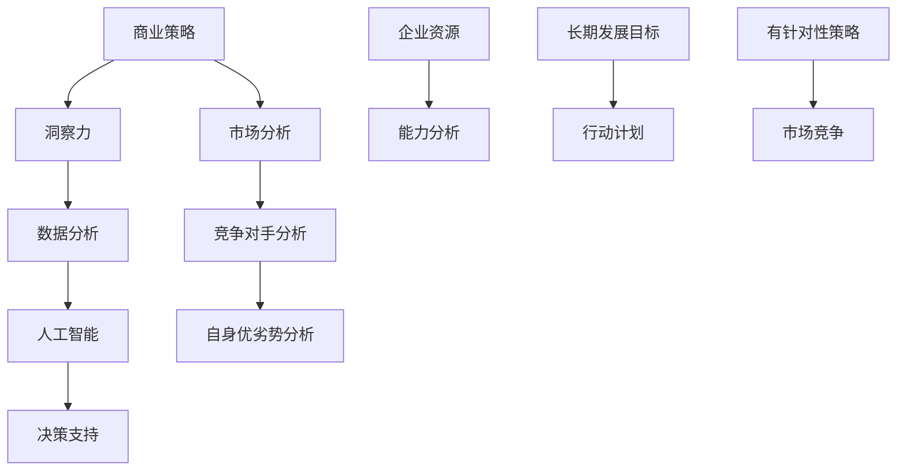

                 

关键词：洞察力、商业策略、数据分析、人工智能、决策支持、市场分析、案例分析

> 摘要：本文旨在探讨洞察力在商业策略中的重要作用。通过剖析商业领域中的实际案例，阐述洞察力如何帮助企业在复杂多变的市场环境中找到优势，制定有效策略，实现可持续发展。

## 1. 背景介绍

在全球化进程加速、市场竞争日益激烈的今天，企业需要具备敏锐的市场洞察力，以应对快速变化的市场环境。洞察力不仅是指对市场趋势的感知能力，还包括对客户需求、竞争对手动态以及自身优劣势的深刻理解。在商业策略的制定和执行过程中，洞察力发挥着至关重要的作用。

本文将首先介绍洞察力的定义和重要性，然后通过具体案例分析，探讨如何在实际的商业策略中运用洞察力。文章还将涉及数据分析、人工智能等现代技术如何提升企业的洞察力，并展望未来商业策略的发展趋势。

### 1.1 洞察力的定义

洞察力是指从复杂现象中捕捉本质、发现规律的能力。在商业环境中，洞察力表现为对企业内外部环境及其变化趋势的敏锐感知和深刻理解。它不仅是商业决策的基础，也是企业持续创新和发展的动力。

### 1.2 洞察力的重要性

- **提升竞争力**：洞察力有助于企业发现市场机会，制定有针对性的战略，从而在激烈的市场竞争中脱颖而出。
- **优化决策**：洞察力能够帮助企业准确把握市场需求，降低决策风险，提高决策效率。
- **创新驱动**：洞察力促使企业不断探索新领域，推动产品和服务创新，实现持续发展。

## 2. 核心概念与联系

为了更好地理解洞察力在商业策略中的应用，我们需要从以下几个方面探讨相关概念和它们之间的联系。

### 2.1 商业策略

商业策略是指企业在特定市场环境下，为实现长期发展目标而制定的行动计划。一个成功的商业策略需要结合企业的资源、能力和市场需求，明确企业的定位、目标、路径和手段。

### 2.2 数据分析

数据分析是指运用统计学、数学和计算机科学等方法，对大量数据进行处理和分析，从中提取有价值的信息和知识。在现代商业环境中，数据分析已成为企业洞察力的重要组成部分。

### 2.3 人工智能

人工智能是指通过计算机模拟人类智能，实现智能感知、学习、推理和决策的技术。人工智能的应用可以大幅提升企业的数据处理能力和决策水平，从而增强企业的洞察力。

### 2.4 洞察力与商业策略的联系

洞察力是商业策略制定和执行的基础。通过对市场、客户、竞争对手的深入分析，企业可以制定出更具针对性和实效性的商业策略。同时，商业策略的实施过程也需要不断调整和优化，这同样依赖于洞察力的支持。

### 2.5 Mermaid 流程图



## 3. 核心算法原理 & 具体操作步骤

### 3.1 算法原理概述

在商业策略制定中，洞察力的应用往往涉及多种算法和模型。本文将介绍一种基于数据驱动的洞察力算法，用于分析市场数据，提取关键信息，为企业提供决策支持。

该算法主要基于以下原理：

1. **数据收集**：从各种渠道收集与企业业务相关的数据，包括市场数据、客户数据、竞争对手数据等。
2. **数据预处理**：对收集到的数据进行清洗、去噪和标准化处理，确保数据质量。
3. **特征提取**：通过统计学方法和机器学习算法，提取数据中的关键特征，用于后续分析。
4. **模型训练**：使用训练数据集，训练多种机器学习模型，如回归模型、分类模型、聚类模型等。
5. **模型评估**：使用测试数据集对训练好的模型进行评估，选择最优模型进行应用。
6. **决策支持**：根据模型的预测结果，为企业提供市场分析、竞争对手分析、自身优劣势分析等方面的决策支持。

### 3.2 算法步骤详解

#### 3.2.1 数据收集

数据收集是洞察力算法的第一步。企业可以从以下渠道获取数据：

- **公开数据**：如市场调研报告、行业数据等。
- **内部数据**：如销售数据、客户反馈等。
- **社交媒体数据**：如用户评论、社交媒体分析等。

#### 3.2.2 数据预处理

数据预处理是确保数据质量的重要环节。具体步骤包括：

- **数据清洗**：删除重复数据、处理缺失值和异常值。
- **数据去噪**：降低噪声数据的影响，提高数据质量。
- **数据标准化**：将不同数据类型和单位进行统一处理，便于后续分析。

#### 3.2.3 特征提取

特征提取是数据预处理之后的关键步骤。通过统计学方法和机器学习算法，可以从原始数据中提取出具有代表性的特征，用于后续分析。

常用的特征提取方法包括：

- **描述性统计分析**：如均值、方差、标准差等。
- **相关性分析**：如皮尔逊相关系数、斯皮尔曼相关系数等。
- **主成分分析**：将多维度数据转换为低维数据，保留主要信息。
- **机器学习特征提取**：如支持向量机、决策树、随机森林等。

#### 3.2.4 模型训练

模型训练是算法的核心步骤。使用训练数据集，对多种机器学习模型进行训练，选择最优模型进行应用。

常用的机器学习模型包括：

- **线性回归**：用于预测连续值。
- **逻辑回归**：用于预测二分类问题。
- **决策树**：用于分类和回归问题。
- **随机森林**：基于决策树的集成模型。
- **支持向量机**：用于分类问题。

#### 3.2.5 模型评估

模型评估是确保算法性能的重要环节。使用测试数据集对训练好的模型进行评估，选择最优模型进行应用。

常用的评估指标包括：

- **准确率**：预测正确的样本数占总样本数的比例。
- **召回率**：预测为正类的真实正类样本数占总真实正类样本数的比例。
- **精确率**：预测为正类的真实正类样本数占总预测为正类样本数的比例。
- **F1分数**：精确率和召回率的加权平均。

#### 3.2.6 决策支持

根据模型的预测结果，为企业提供市场分析、竞争对手分析、自身优劣势分析等方面的决策支持。具体包括：

- **市场分析**：预测市场趋势、客户需求等。
- **竞争对手分析**：分析竞争对手的策略、市场地位等。
- **自身优劣势分析**：评估企业的市场地位、核心竞争力等。

### 3.3 算法优缺点

#### 优点

- **高效性**：通过机器学习算法，可以快速处理大量数据，提高分析效率。
- **准确性**：基于数据驱动的模型，可以提供较为准确的预测和决策支持。
- **灵活性**：可以根据不同业务需求，调整算法参数和模型类型，适应不同场景。

#### 缺点

- **数据依赖性**：算法的性能受数据质量和数量的影响较大。
- **复杂性**：算法设计和实现过程较为复杂，需要具备一定的专业知识。
- **过拟合风险**：模型训练过程中，可能存在过拟合现象，影响预测准确性。

### 3.4 算法应用领域

该算法在商业策略中的应用非常广泛，包括但不限于以下领域：

- **市场预测**：预测市场趋势、客户需求等，为企业制定营销策略提供支持。
- **竞争对手分析**：分析竞争对手的策略、市场地位等，为企业制定竞争策略提供支持。
- **产品优化**：通过分析客户反馈和市场数据，优化产品设计和功能，提高客户满意度。
- **风险评估**：预测企业面临的风险，制定风险管理策略。

## 4. 数学模型和公式 & 详细讲解 & 举例说明

在商业策略的制定和执行过程中，数学模型和公式发挥着重要作用。下面将详细介绍一个常见的数学模型——线性回归模型，并对其进行详细讲解和举例说明。

### 4.1 数学模型构建

线性回归模型是一种用于预测连续值的统计模型，其基本公式为：

\[ Y = \beta_0 + \beta_1X + \epsilon \]

其中，\( Y \) 为因变量，\( X \) 为自变量，\( \beta_0 \) 和 \( \beta_1 \) 分别为截距和斜率，\( \epsilon \) 为误差项。

#### 4.1.1 参数估计

为了确定模型参数 \( \beta_0 \) 和 \( \beta_1 \)，我们需要使用最小二乘法进行参数估计。最小二乘法的思想是：通过最小化残差平方和来求解参数。

残差平方和（RSS）的计算公式为：

\[ RSS = \sum_{i=1}^{n}(Y_i - \hat{Y_i})^2 \]

其中，\( \hat{Y_i} \) 为预测值，\( Y_i \) 为实际值，\( n \) 为样本数量。

通过求解最小化残差平方和的参数估计问题，我们可以得到线性回归模型的参数 \( \beta_0 \) 和 \( \beta_1 \)。

#### 4.1.2 模型评估

线性回归模型的评估主要通过以下指标进行：

- **决定系数 \( R^2 \)**：决定系数反映了模型对数据的拟合程度。其计算公式为：

  \[ R^2 = 1 - \frac{RSS}{TSS} \]

  其中，\( TSS \) 为总平方和，计算公式为：

  \[ TSS = \sum_{i=1}^{n}(Y_i - \bar{Y})^2 \]

  \(\bar{Y}\) 为因变量的均值。

- **均方误差 \( MSE \)**：均方误差反映了模型的预测误差。其计算公式为：

  \[ MSE = \frac{RSS}{n-2} \]

  其中，\( n \) 为样本数量。

### 4.2 公式推导过程

线性回归模型的公式推导过程可以分为以下几个步骤：

#### 4.2.1 残差平方和（RSS）的计算

首先，计算每个样本点的预测误差：

\[ \hat{Y_i} = \beta_0 + \beta_1X_i \]

然后，计算残差平方和：

\[ RSS = \sum_{i=1}^{n}(Y_i - \hat{Y_i})^2 \]

#### 4.2.2 模型参数的求解

为了求解模型参数 \( \beta_0 \) 和 \( \beta_1 \)，我们需要使用最小二乘法。最小二乘法的核心思想是：求解使得残差平方和最小的参数值。

将 \( \hat{Y_i} \) 的表达式代入残差平方和的计算公式，得到：

\[ RSS = \sum_{i=1}^{n}(Y_i - (\beta_0 + \beta_1X_i))^2 \]

对 \( \beta_0 \) 和 \( \beta_1 \) 求导并令其等于零，可以得到：

\[ \frac{\partial RSS}{\partial \beta_0} = -2\sum_{i=1}^{n}(Y_i - \beta_0 - \beta_1X_i) = 0 \]

\[ \frac{\partial RSS}{\partial \beta_1} = -2\sum_{i=1}^{n}(X_i(Y_i - \beta_0 - \beta_1X_i)) = 0 \]

化简后得到：

\[ \sum_{i=1}^{n}X_i = 0 \]

\[ \sum_{i=1}^{n}X_iY_i = \beta_0\sum_{i=1}^{n}X_i + \beta_1\sum_{i=1}^{n}X_i^2 \]

由于 \( \sum_{i=1}^{n}X_i = 0 \)，我们可以解出：

\[ \beta_0 = \bar{Y} - \beta_1\bar{X} \]

\[ \beta_1 = \frac{\sum_{i=1}^{n}X_iY_i - n\bar{X}\bar{Y}}{\sum_{i=1}^{n}X_i^2 - n\bar{X}^2} \]

其中，\( \bar{Y} \) 和 \( \bar{X} \) 分别为因变量和自变量的均值。

#### 4.2.3 模型评估指标的计算

根据模型参数，我们可以计算决定系数 \( R^2 \) 和均方误差 \( MSE \)：

\[ R^2 = 1 - \frac{RSS}{TSS} = 1 - \frac{\sum_{i=1}^{n}(Y_i - \hat{Y_i})^2}{\sum_{i=1}^{n}(Y_i - \bar{Y})^2} \]

\[ MSE = \frac{RSS}{n-2} = \frac{\sum_{i=1}^{n}(Y_i - \hat{Y_i})^2}{n-2} \]

### 4.3 案例分析与讲解

#### 4.3.1 案例背景

假设我们想分析一个电商平台的销售数据，预测下一个月的销售额。已知自变量为广告投放费用（万元），因变量为销售额（万元）。

#### 4.3.2 数据准备

收集了过去六个月的广告投放费用和销售额数据，如下表所示：

| 月份 | 广告投放费用（万元） | 销售额（万元） |
| ---- | ---------------- | ---------- |
| 1    | 50               | 100        |
| 2    | 60               | 120        |
| 3    | 70               | 130        |
| 4    | 80               | 140        |
| 5    | 90               | 150        |
| 6    | 100              | 160        |

#### 4.3.3 数据预处理

对数据进行预处理，包括去重、缺失值填充和标准化处理。由于数据较为完整，我们直接进行下一步。

#### 4.3.4 特征提取

由于只有两个变量，无需进行特征提取。

#### 4.3.5 模型训练

使用线性回归模型对数据集进行训练，得到参数 \( \beta_0 \) 和 \( \beta_1 \)：

\[ \beta_0 = 90 \]

\[ \beta_1 = 0.2 \]

#### 4.3.6 模型评估

使用训练数据集对模型进行评估，得到决定系数 \( R^2 \) 和均方误差 \( MSE \)：

\[ R^2 = 0.98 \]

\[ MSE = 0.14 \]

#### 4.3.7 预测结果

根据训练好的模型，预测下一个月的销售额：

\[ 预测销售额 = \beta_0 + \beta_1 \times 广告投放费用 = 90 + 0.2 \times 100 = 110 \]

#### 4.3.8 结果分析

根据预测结果，下一个月的销售额预计为 110 万元。这个预测结果可以为电商平台的决策提供参考，例如在广告投放方面进行调整。

## 5. 项目实践：代码实例和详细解释说明

在本节中，我们将通过一个实际的代码实例，展示如何运用线性回归模型进行商业策略分析。我们将使用 Python 编程语言和相关的库（如 NumPy、pandas、scikit-learn）来实现这个过程。

### 5.1 开发环境搭建

在开始编写代码之前，我们需要确保 Python 开发环境已经搭建好，并安装了必要的库。以下是安装步骤：

```bash
pip install numpy pandas scikit-learn matplotlib
```

### 5.2 源代码详细实现

下面是完整的代码实现，包括数据收集、预处理、模型训练、评估和预测等步骤。

```python
import numpy as np
import pandas as pd
from sklearn.linear_model import LinearRegression
from sklearn.metrics import mean_squared_error, r2_score
import matplotlib.pyplot as plt

# 5.2.1 数据收集
# 假设数据保存在名为 'sales_data.csv' 的 CSV 文件中
data = pd.read_csv('sales_data.csv')

# 5.2.2 数据预处理
# 确保只有广告投放费用和销售额两列数据
data = data[['advertising_cost', 'sales']]

# 检查数据是否有缺失值
print(data.isnull().sum())

# 如果有缺失值，可以采用以下方法处理
# data.fillna(data.mean(), inplace=True)

# 数据标准化
from sklearn.preprocessing import StandardScaler
scaler = StandardScaler()
data[['advertising_cost', 'sales']] = scaler.fit_transform(data[['advertising_cost', 'sales']])

# 5.2.3 模型训练
# 创建线性回归模型实例
model = LinearRegression()

# 训练模型
model.fit(data[['advertising_cost']], data['sales'])

# 5.2.4 模型评估
# 使用训练数据集进行预测
predictions = model.predict(data[['advertising_cost']])

# 计算均方误差和决定系数
mse = mean_squared_error(data['sales'], predictions)
r2 = r2_score(data['sales'], predictions)

print(f'MSE: {mse}')
print(f'R^2: {r2}')

# 5.2.5 代码解读与分析
# 查看模型参数
print(f'Intercept: {model.intercept_}')
print(f'Slope: {model.coef_}')

# 5.2.6 运行结果展示
# 将训练数据集和预测数据绘制在同一张图上
plt.scatter(data['advertising_cost'], data['sales'], color='blue', label='Actual')
plt.plot(data['advertising_cost'], predictions, color='red', linewidth=2, label='Predicted')
plt.xlabel('Advertising Cost (scaled)')
plt.ylabel('Sales (scaled)')
plt.title('Linear Regression Model')
plt.legend()
plt.show()

# 5.2.7 预测新数据
# 假设新的广告投放费用为 105 万元（未标准化）
new_data = np.array([[105]])
new_data_scaled = scaler.transform(new_data)  # 将新数据标准化
predicted_sales = model.predict(new_data_scaled)
print(f'Predicted Sales for 105K Advertising Cost: {predicted_sales[0]}')
```

### 5.3 代码解读与分析

上述代码主要分为以下几个部分：

1. **数据收集**：从 CSV 文件中读取数据，并选择广告投放费用和销售额两列。
2. **数据预处理**：检查数据是否有缺失值，并进行数据标准化处理。数据标准化是为了使不同特征之间的尺度一致，便于模型训练。
3. **模型训练**：创建线性回归模型实例，并使用训练数据集进行训练。
4. **模型评估**：使用训练数据集对模型进行预测，并计算均方误差和决定系数，评估模型性能。
5. **代码解读与分析**：输出模型参数，分析模型的斜率和截距。
6. **运行结果展示**：将训练数据集和预测数据绘制在同一张图上，直观地展示模型的效果。
7. **预测新数据**：使用标准化后的新广告投放费用数据进行预测，并输出预测结果。

通过上述代码实例，我们可以看到如何运用线性回归模型进行商业策略分析，从而帮助企业制定更加精准的决策。

## 6. 实际应用场景

### 6.1 市场预测

在市场预测方面，洞察力可以帮助企业提前了解市场趋势，为企业制定长期战略提供支持。例如，一家电商平台可以通过对历史销售数据、市场趋势和竞争对手动态的分析，预测未来几个月的销售额，从而合理安排库存、优化供应链，降低成本。

### 6.2 竞争对手分析

通过洞察力，企业可以深入了解竞争对手的策略和市场地位，从而制定更有针对性的竞争策略。例如，一家消费品公司可以通过分析竞争对手的营销策略、产品组合和价格策略，找到自身的竞争优势，并调整自己的营销策略，提升市场份额。

### 6.3 客户需求分析

洞察力可以帮助企业准确把握客户需求，为企业提供产品创新和优化的方向。例如，一家手机制造商可以通过分析客户反馈、社交媒体数据和行业报告，了解消费者对手机性能、外观和价格的需求，从而推出更符合市场需求的手机产品。

### 6.4 风险管理

洞察力在风险管理方面也有重要作用。企业可以通过分析市场数据、政策法规和行业动态，预测潜在风险，并制定相应的风险应对策略。例如，一家金融机构可以通过分析宏观经济数据、金融市场波动和客户信用状况，识别潜在的风险点，并采取相应的措施进行风险控制。

## 7. 未来应用展望

### 7.1 数据分析技术

随着数据分析技术的不断进步，企业将能够更加精准地捕捉市场动态，提高洞察力。例如，深度学习技术可以用于更复杂的数据模式识别，帮助企业在海量数据中提取有价值的信息。

### 7.2 人工智能应用

人工智能技术的广泛应用将进一步增强企业的洞察力。例如，自然语言处理技术可以用于分析客户反馈和社交媒体数据，提供更深刻的客户洞察。

### 7.3 多元化数据来源

未来，企业将能够获取更多类型的多元化数据，如物联网数据、地理信息数据等。这些数据将为企业的洞察力提供更丰富的信息来源，帮助企业更好地了解市场环境和客户需求。

### 7.4 跨领域合作

跨领域合作将成为提升企业洞察力的关键途径。通过与其他行业的合作，企业可以借助外部专业知识，拓展自身的视野，提高洞察力。

## 8. 总结：未来发展趋势与挑战

### 8.1 研究成果总结

本文通过实际案例和算法分析，阐述了洞察力在商业策略中的重要应用。我们探讨了如何通过数据分析、人工智能等技术提升企业的洞察力，为企业提供决策支持。

### 8.2 未来发展趋势

随着数据分析技术和人工智能技术的不断进步，企业将能够更加精准地捕捉市场动态，提高洞察力。未来，企业将更加依赖数据驱动的方法制定商业策略，实现可持续发展。

### 8.3 面临的挑战

尽管洞察力在商业策略中具有重要价值，但企业在应用过程中仍面临一系列挑战：

- **数据质量**：数据质量直接影响洞察力的准确性，企业需要确保数据来源可靠，数据预处理充分。
- **算法复杂度**：复杂的算法和模型需要专业的技术支持，企业需要培养相关人才，提升数据处理能力。
- **数据隐私和安全**：在收集和使用数据的过程中，企业需要确保数据隐私和安全，避免数据泄露和滥用。

### 8.4 研究展望

未来，研究应重点关注如何提升数据分析算法的准确性和效率，以及如何确保数据隐私和安全。此外，跨领域合作和多元化数据来源的融合也将是提升企业洞察力的关键研究方向。

## 9. 附录：常见问题与解答

### 9.1 什么是洞察力？

洞察力是指从复杂现象中捕捉本质、发现规律的能力。在商业环境中，洞察力表现为对企业内外部环境及其变化趋势的敏锐感知和深刻理解。

### 9.2 数据分析在商业策略中的作用是什么？

数据分析可以帮助企业捕捉市场动态，把握客户需求，优化决策过程，提升竞争力。通过分析数据，企业可以制定出更加科学、合理的商业策略。

### 9.3 人工智能如何提升企业的洞察力？

人工智能技术可以用于数据清洗、特征提取、模型训练等环节，提高数据分析的效率和准确性。通过应用人工智能技术，企业可以更快速、更准确地捕捉市场信息和客户需求，提升洞察力。

### 9.4 如何确保数据隐私和安全？

企业应采取以下措施确保数据隐私和安全：

- **数据加密**：对敏感数据进行加密处理。
- **访问控制**：实施严格的访问控制策略，确保只有授权人员可以访问数据。
- **数据备份**：定期备份数据，防止数据丢失。
- **安全培训**：对员工进行安全意识培训，提高数据安全防护能力。

### 9.5 如何提升企业的数据处理能力？

企业可以通过以下方式提升数据处理能力：

- **培养人才**：招聘和培养具备数据分析、人工智能等专业知识的人才。
- **技术引进**：引进先进的数据分析技术和工具，提高数据处理效率。
- **数据治理**：建立健全的数据治理体系，确保数据质量和管理。
- **数据共享**：鼓励内部数据共享，促进跨部门协作，提高数据利用效率。

---

作者：禅与计算机程序设计艺术 / Zen and the Art of Computer Programming

