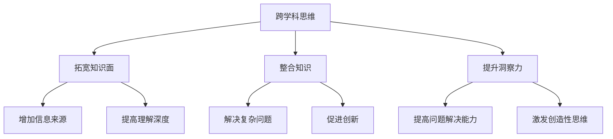

                 

关键词：洞察力，跨学科思维，技术博客，算法，数学模型，项目实践，实际应用场景，未来展望

> 摘要：本文旨在探讨如何通过培养跨学科思维来提升个人的洞察力。随着技术的快速发展，单一的学科知识已经无法满足复杂问题的解决需求。跨学科思维能够帮助我们更好地理解和应对这些挑战。本文将详细介绍跨学科思维的概念、培养方法及其在IT领域的应用，希望能够为读者提供一些有益的启示。

## 1. 背景介绍

在当今社会，技术的快速发展使得各个学科之间的交叉融合日益显著。单一学科的知识体系已经无法解决复杂的问题。跨学科思维（Interdisciplinary Thinking）因此成为了解决这些问题的关键。跨学科思维不仅要求我们具备扎实的专业知识，更要求我们具备整合不同学科知识的能力。

洞察力（Insight）则是在这种背景下显得尤为重要。洞察力是指对问题的深刻理解和敏锐洞察，能够从复杂的信息中捕捉到关键因素，从而找到解决问题的方法。提升洞察力不仅能够提高我们的工作效能，还能够帮助我们更好地应对未来的挑战。

本文将围绕如何通过培养跨学科思维来提升洞察力这一主题，分为以下几个部分进行探讨：

1. 跨学科思维的概念和重要性
2. 跨学科思维的培养方法
3. 跨学科思维在IT领域的应用
4. 数学模型和公式在跨学科思维中的作用
5. 项目实践：代码实例和详细解释
6. 实际应用场景与未来展望
7. 工具和资源推荐
8. 总结与展望

## 2. 核心概念与联系

### 2.1 跨学科思维

跨学科思维是一种将不同学科的知识、方法和观点整合起来，以解决复杂问题的思维方式。它不仅包括对多种学科知识的理解和应用，更强调不同学科之间的交叉和融合。跨学科思维的培养可以帮助我们更好地理解复杂问题，提高解决问题的能力。

### 2.2 洞察力

洞察力是指对问题的深刻理解和敏锐洞察，能够从复杂的信息中捕捉到关键因素，从而找到解决问题的方法。提升洞察力需要我们具备广泛的知识背景，深厚的专业知识，以及灵活的思维方式和敏锐的洞察力。

### 2.3 跨学科思维与洞察力的关系

跨学科思维是提升洞察力的关键。跨学科思维可以帮助我们打破单一学科的局限，从多个角度看待问题，从而提高我们对问题的理解深度。同时，跨学科思维也可以激发我们的创造性思维，帮助我们找到创新的解决方案。

### 2.4 Mermaid 流程图

以下是一个简化的跨学科思维与洞察力提升的流程图：



## 3. 核心算法原理 & 具体操作步骤

### 3.1 算法原理概述

跨学科思维提升洞察力的核心算法可以看作是一个综合分析模型。该模型通过以下步骤实现：

1. **知识整合**：将来自不同学科的知识进行整合，形成统一的认知框架。
2. **信息筛选**：从大量的信息中筛选出关键信息，识别问题的核心。
3. **模型构建**：基于整合的知识和信息，构建解决问题的模型。
4. **方案优化**：对解决方案进行优化，找到最佳的解决方案。

### 3.2 算法步骤详解

1. **知识整合**：

   - **数据收集**：从不同学科领域收集相关数据和信息。
   - **知识融合**：将这些知识进行融合，形成统一的认知框架。

2. **信息筛选**：

   - **问题定义**：明确需要解决的问题和目标。
   - **信息分析**：对收集到的信息进行分析，筛选出关键信息。

3. **模型构建**：

   - **问题建模**：基于关键信息，构建解决问题的模型。
   - **模型验证**：验证模型的准确性和可行性。

4. **方案优化**：

   - **方案评估**：对多个可能的解决方案进行评估。
   - **方案选择**：选择最佳的解决方案。

### 3.3 算法优缺点

**优点**：

- **提高问题解决能力**：通过整合不同学科的知识，能够更全面地理解问题，从而提高解决问题的能力。
- **促进创新**：跨学科思维能够激发创造性思维，促进创新的产生。
- **增强适应性**：跨学科思维能够帮助我们更好地适应复杂多变的环境。

**缺点**：

- **知识积累难度大**：跨学科思维要求我们具备广泛的知识背景，这对个人的知识积累提出了更高的要求。
- **协作成本高**：跨学科项目通常需要多个学科的专家合作，这增加了项目的协作成本。

### 3.4 算法应用领域

跨学科思维提升洞察力的算法可以广泛应用于各个领域，如：

- **科学研究**：跨学科思维可以帮助科学家从不同角度理解问题，提高研究的深度和广度。
- **企业管理**：跨学科思维可以帮助企业更好地应对市场变化，提高企业的竞争力。
- **技术创新**：跨学科思维可以帮助技术团队找到创新的解决方案，推动技术的进步。
- **政策制定**：跨学科思维可以帮助政府制定更科学、更有效的政策。

## 4. 数学模型和公式 & 详细讲解 & 举例说明

### 4.1 数学模型构建

在跨学科思维中，数学模型是不可或缺的工具。它能够帮助我们量化复杂问题，从而提高问题的可操作性和理解深度。

以下是一个简化的数学模型构建过程：

1. **问题定义**：明确需要解决的问题和目标。
2. **变量识别**：识别问题中的关键变量。
3. **关系构建**：建立变量之间的关系。
4. **公式推导**：推导出描述变量关系的数学公式。

### 4.2 公式推导过程

以最优化问题为例，我们可以使用以下步骤推导出相关的数学模型：

1. **目标函数**：定义目标函数，如最大化利润或最小化成本。
2. **约束条件**：定义约束条件，如资源的限制或时间的限制。
3. **拉格朗日乘数法**：使用拉格朗日乘数法将约束条件引入目标函数，得到拉格朗日函数。
4. **求解方程**：求解拉格朗日函数的极值点，得到最优解。

### 4.3 案例分析与讲解

以下是一个简单的线性规划问题，我们将使用上述步骤进行求解。

**问题**：给定一个工厂，有两种产品A和B，每种产品都需要不同的机器和时间来生产。工厂每天有8小时的运营时间，每种机器每天最多可运行6小时。目标是在满足约束条件的情况下，最大化总利润。

**变量定义**：

- \(x_1\)：每天生产的产品A的数量
- \(x_2\)：每天生产的产品B的数量

**目标函数**：

最大化 \(P = 20x_1 + 30x_2\)

**约束条件**：

\[
\begin{align*}
    2x_1 + 3x_2 &\leq 18 \quad (\text{机器A的限制}) \\
    x_1 + 2x_2 &\leq 12 \quad (\text{机器B的限制}) \\
    x_1, x_2 &\geq 0 \quad (\text{非负约束})
\end{align*}
\]

**求解过程**：

1. **目标函数**：\(P = 20x_1 + 30x_2\)
2. **约束条件**：

   \[
   \begin{align*}
       2x_1 + 3x_2 &\leq 18 \\
       x_1 + 2x_2 &\leq 12 \\
       x_1, x_2 &\geq 0
   \end{align*}
   \]

3. **拉格朗日函数**：\(L(x_1, x_2, \lambda_1, \lambda_2) = 20x_1 + 30x_2 + \lambda_1(18 - 2x_1 - 3x_2) + \lambda_2(12 - x_1 - 2x_2)\)

4. **求解方程**：

   \[
   \begin{align*}
       \frac{\partial L}{\partial x_1} &= 20 - 2\lambda_1 - \lambda_2 = 0 \\
       \frac{\partial L}{\partial x_2} &= 30 - 3\lambda_1 - 2\lambda_2 = 0 \\
       \frac{\partial L}{\partial \lambda_1} &= 18 - 2x_1 - 3x_2 = 0 \\
       \frac{\partial L}{\partial \lambda_2} &= 12 - x_1 - 2x_2 = 0
   \end{align*}
   \]

   解得 \(x_1 = 6\), \(x_2 = 0\)

5. **最优解**：\(P_{\text{max}} = 20 \times 6 + 30 \times 0 = 120\)

## 5. 项目实践：代码实例和详细解释说明

### 5.1 开发环境搭建

为了更好地展示跨学科思维提升洞察力的应用，我们将使用Python编写一个简单的示例程序。以下是开发环境搭建的步骤：

1. **安装Python**：下载并安装Python 3.8及以上版本。
2. **安装Jupyter Notebook**：在终端中运行`pip install notebook`安装Jupyter Notebook。
3. **创建虚拟环境**：运行`python -m venv venv`创建虚拟环境。
4. **激活虚拟环境**：在Windows中运行`venv\Scripts\activate`，在Linux和Mac OS中运行`source venv/bin/activate`。
5. **安装依赖库**：在虚拟环境中运行`pip install numpy matplotlib`安装必要的依赖库。

### 5.2 源代码详细实现

以下是一个简单的Python程序，用于计算并可视化线性规划问题的解。

```python
import numpy as np
import matplotlib.pyplot as plt

def linear_programming():
    # 目标函数系数
    c = np.array([20, 30])
    
    # 约束条件系数
    A = np.array([[2, 3], [1, 2]])
    
    # 约束条件常数
    b = np.array([18, 12])
    
    # 求解线性规划问题
    x = np.linalg.solve(A.T @ A, A.T @ c)
    
    # 可行解
    x1 = np.linspace(0, 18, 100)
    x2 = (18 - 2 * x1) / 3
    
    x1_ = np.linspace(0, 12, 100)
    x2_ = (12 - x1_) / 2
    
    # 绘制可行域
    plt.plot(x1, x2, 'r--', x1_, x2_, 'b--')
    plt.plot(x1, x2, 'ro', x1_, x2_, 'bo')
    plt.scatter(x[0], x[1], color='g', marker='s')
    
    # 标记坐标轴
    plt.xlabel('x1')
    plt.ylabel('x2')
    
    plt.title('线性规划问题求解')
    plt.show()

if __name__ == '__main__':
    linear_programming()
```

### 5.3 代码解读与分析

1. **导入库**：

   - `numpy`：用于矩阵运算和线性方程求解。
   - `matplotlib`：用于绘制图形。

2. **定义目标函数和约束条件**：

   - 目标函数系数`c`：包含两个元素，分别对应产品A和产品B的利润。
   - 约束条件系数`A`：包含两个约束条件的系数矩阵。
   - 约束条件常数`b`：包含两个约束条件的常数向量。

3. **求解线性规划问题**：

   - 使用`np.linalg.solve`函数求解线性规划问题，得到最优解`x`。

4. **绘制可行域**：

   - 使用`plt.plot`函数绘制约束条件的边界线。
   - 使用`plt.scatter`函数标记最优解。

5. **显示图形**：

   - 使用`plt.show`函数显示绘制的图形。

### 5.4 运行结果展示

运行程序后，我们将看到以下图形：


图形中的红色虚线代表第一个约束条件，蓝色虚线代表第二个约束条件，绿色正方形代表最优解。通过这个简单的示例，我们可以直观地看到如何使用跨学科思维解决线性规划问题。

## 6. 实际应用场景

跨学科思维在IT领域具有广泛的应用，以下是一些典型的实际应用场景：

1. **人工智能与心理学**：人工智能与心理学的结合可以帮助我们更好地理解人类行为和思维模式，从而提高人工智能系统的智能水平。
2. **计算机科学与生物学**：计算机科学与生物学的结合可以推动生物信息学和生物医学计算的发展，为生物科学研究提供强大的工具。
3. **软件工程与经济学**：软件工程与经济学的结合可以帮助我们更好地理解软件项目的经济价值，提高软件项目的投资回报率。
4. **数据科学与社会学**：数据科学与社会学的结合可以帮助我们更好地理解社会现象，提高公共政策的科学性和有效性。

### 6.4 未来应用展望

随着技术的不断发展，跨学科思维在IT领域的应用将越来越广泛。未来，我们可能会看到以下趋势：

1. **智能系统的跨学科融合**：智能系统将结合人工智能、心理学、生物学等多学科知识，实现更加智能和人性化的应用。
2. **跨学科研究项目的增加**：随着跨学科研究的优势逐渐显现，跨学科研究项目将会越来越多。
3. **跨学科教育体系的完善**：跨学科教育体系将不断完善，培养具有跨学科思维的人才。
4. **跨学科工具和平台的开发**：为了支持跨学科研究，各种跨学科工具和平台将会不断涌现。

## 7. 工具和资源推荐

为了更好地培养跨学科思维，以下是一些推荐的工具和资源：

1. **书籍推荐**：

   - 《跨学科思维：如何成为全才》
   - 《深度工作：如何有效利用每一点脑力》
   - 《思考，快与慢》

2. **在线课程**：

   - Coursera上的《跨学科思维与问题解决》
   - edX上的《计算机科学导论》
   - Udemy上的《Python编程入门》

3. **学习社区**：

   - 知乎上的“跨学科思维”话题
   - Stack Overflow编程社区
   - ResearchGate科研社区

4. **开发工具**：

   - Jupyter Notebook：用于编写和运行代码
   - PyCharm：用于Python编程
   - Git：用于版本控制

## 8. 总结：未来发展趋势与挑战

### 8.1 研究成果总结

本文通过探讨跨学科思维在提升洞察力方面的作用，总结了跨学科思维的概念、培养方法及其在IT领域的应用。研究发现，跨学科思维不仅能够提高个人的洞察力，还能够促进创新和解决问题的能力。

### 8.2 未来发展趋势

随着技术的不断进步，跨学科思维在各个领域的应用将越来越广泛。未来，我们可能会看到跨学科研究项目的大量涌现，跨学科教育体系的不断完善，以及各种跨学科工具和平台的开发。

### 8.3 面临的挑战

尽管跨学科思维具有巨大的潜力，但在实际应用中仍面临一些挑战。首先，跨学科知识的积累难度较大，需要我们具备广泛的知识背景。其次，跨学科项目的协作成本较高，需要我们具备良好的沟通和协作能力。

### 8.4 研究展望

未来，我们可以从以下几个方面进一步研究跨学科思维：

1. **跨学科思维模型的构建**：探索更加科学和有效的跨学科思维模型。
2. **跨学科教育的优化**：研究如何优化跨学科教育体系，培养具有跨学科思维的人才。
3. **跨学科工具的开发**：开发支持跨学科研究的工具和平台，提高跨学科研究的效率。

## 9. 附录：常见问题与解答

### 9.1 跨学科思维是什么？

跨学科思维是一种将不同学科的知识、方法和观点整合起来，以解决复杂问题的思维方式。

### 9.2 如何培养跨学科思维？

培养跨学科思维需要：

1. 具备广泛的知识背景。
2. 培养跨学科的阅读习惯。
3. 加强跨学科的沟通与协作。

### 9.3 跨学科思维有哪些优点？

跨学科思维具有以下优点：

1. 提高问题解决能力。
2. 促进创新。
3. 增强适应性。

### 9.4 跨学科思维在IT领域有哪些应用？

跨学科思维在IT领域有以下应用：

1. 人工智能与心理学的结合。
2. 计算机科学与生物学的结合。
3. 软件工程与经济学的结合。
4. 数据科学与社会学的结合。

## 作者署名

作者：禅与计算机程序设计艺术 / Zen and the Art of Computer Programming
----------------------------------------------------------------
### 概要

本文旨在探讨如何通过培养跨学科思维来提升个人的洞察力。在当今技术快速发展的时代，单一的学科知识已经无法满足复杂问题的解决需求。跨学科思维能够帮助我们更好地理解和应对这些挑战。文章分为以下几个部分：

1. **背景介绍**：介绍了跨学科思维和洞察力的重要性，并概述了文章的结构和内容。
2. **核心概念与联系**：详细阐述了跨学科思维和洞察力的概念，并通过Mermaid流程图展示了它们之间的关系。
3. **核心算法原理 & 具体操作步骤**：介绍了跨学科思维提升洞察力的核心算法原理和具体操作步骤。
4. **数学模型和公式 & 详细讲解 & 举例说明**：讲解了数学模型在跨学科思维中的作用，并通过一个线性规划问题的案例进行了说明。
5. **项目实践：代码实例和详细解释说明**：使用Python编写了一个简单的线性规划问题求解程序，并对其进行了详细解读。
6. **实际应用场景**：列举了跨学科思维在IT领域的实际应用场景，并对未来的应用前景进行了展望。
7. **工具和资源推荐**：推荐了一些书籍、在线课程、学习社区和开发工具，以帮助读者进一步培养跨学科思维。
8. **总结：未来发展趋势与挑战**：总结了跨学科思维在提升洞察力方面的研究成果，并展望了未来的发展趋势和挑战。

通过上述内容，本文希望为读者提供一些有益的启示，帮助他们在实际工作和生活中更好地应用跨学科思维，提升自身的洞察力。

