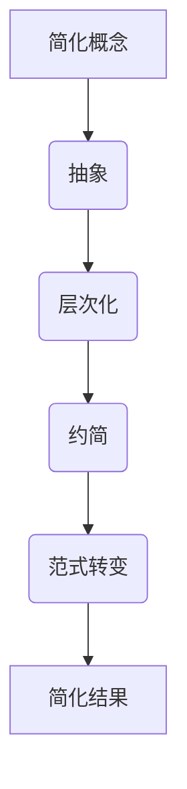

                 

关键词：洞察力、复杂性、算法原理、数学模型、应用实践、未来展望

> 摘要：本文深入探讨了洞察力的本质，解释了在处理复杂系统时如何运用洞察力来简化问题。通过分析核心概念、算法原理、数学模型和实际应用场景，本文揭示了洞察力在计算机科学和技术领域的应用，并展望了未来的发展趋势与挑战。

## 1. 背景介绍

在信息技术飞速发展的时代，复杂系统的处理和优化成为计算机科学的重要课题。面对日益增长的数据量和计算需求，如何有效地应对复杂性成为一个亟待解决的问题。在这个过程中，洞察力成为一种关键能力，它不仅能够帮助我们更好地理解和处理复杂问题，还能在众多技术领域中发挥重要作用。

洞察力的本质是敏锐的观察力和深刻的理解力，它使人们能够在纷繁复杂的信息中找到核心问题，并迅速作出判断和决策。在计算机科学中，洞察力体现在算法设计、问题解决和系统优化等方面。本文将探讨如何通过培养洞察力，在复杂中把握简单，从而提升技术水平和解决实际问题的能力。

## 2. 核心概念与联系

### 2.1 洞察力的定义与分类

洞察力是指通过观察和分析，发现事物本质规律和内在联系的能力。它可分为以下几类：

1. **直观洞察力**：通过直觉和直接感知，快速把握问题的核心。
2. **逻辑洞察力**：通过逻辑推理和抽象思维，深入理解问题的本质。
3. **经验洞察力**：基于丰富实践经验，对问题进行快速定位和解决。
4. **综合洞察力**：将多种洞察力有机结合，形成对复杂问题的全面理解。

### 2.2 复杂性与简化的关系

复杂性是指系统内部各种因素相互作用而产生的难以预测和控制的现象。在处理复杂系统时，简化是降低复杂性、提高问题解决效率的重要手段。简化的过程包括以下几个方面：

1. **抽象**：将复杂的系统或问题抽象成简单的模型或概念。
2. **层次化**：将复杂系统分解为多个层次或模块，分别处理。
3. **约简**：删除无关或次要的因素，专注于关键问题。
4. **范式转变**：采用全新的视角和方法，对问题进行重新定义和解决。

### 2.3 Mermaid 流程图（简化过程）



## 3. 核心算法原理 & 具体操作步骤

### 3.1 算法原理概述

在处理复杂系统时，洞察力可以帮助我们选择合适的算法来解决问题。以下是一些核心算法原理及其具体操作步骤：

1. **贪心算法**：通过每次选择局部最优解，逐步逼近全局最优解。
   - 步骤：
     1. 确定问题目标和贪心策略。
     2. 从初始状态开始，按照贪心策略选择下一步操作。
     3. 重复步骤2，直到达到目标状态。

2. **动态规划**：将复杂问题分解为多个子问题，并利用子问题的解来构建原问题的解。
   - 步骤：
     1. 确定问题的状态空间和状态转移关系。
     2. 设计状态转移方程。
     3. 利用状态转移方程求解子问题的最优解。
     4. 利用子问题的解构建原问题的最优解。

3. **随机算法**：利用随机性来优化问题的求解过程。
   - 步骤：
     1. 确定问题目标和随机策略。
     2. 根据随机策略生成随机解。
     3. 对随机解进行优化，直至满足问题要求。

### 3.2 算法步骤详解

1. **贪心算法**：
   - 案例一：求最长公共子序列。
     1. 确定问题目标和贪心策略：每次选择两个字符串中最长的公共子序列。
     2. 从初始状态开始，按照贪心策略选择下一步操作。
     3. 重复步骤2，直到找到最长公共子序列。

2. **动态规划**：
   - 案例二：求最大子序列和。
     1. 确定问题的状态空间：定义状态`dp[i][j]`为从字符串`s1[1...i]`和`s2[1...j]`中找到的最大子序列和。
     2. 设计状态转移方程：`dp[i][j] = max(dp[i-1][j], dp[i][j-1], dp[i-1][j-1] + s1[i] + s2[j])`。
     3. 利用状态转移方程求解子问题的最优解：从`dp[0][0]`开始，依次计算`dp[i][j]`的值。
     4. 利用子问题的解构建原问题的最优解：返回`dp[n][m]`的值。

3. **随机算法**：
   - 案例三：求解最大团问题。
     1. 确定问题目标和随机策略：随机选择图的子图，判断是否为团，重复多次以期望找到最大团。
     2. 根据随机策略生成随机解。
     3. 对随机解进行优化，直至满足问题要求：利用优化算法对随机解进行调整，提高最大团的概率。

### 3.3 算法优缺点

- **贪心算法**：
  - 优点：简单、高效，适用于可分阶段决策的问题。
  - 缺点：可能无法找到全局最优解，需要合适的贪心策略。

- **动态规划**：
  - 优点：适用于具有重叠子问题和最优子结构性质的问题。
  - 缺点：状态空间可能较大，计算复杂度较高。

- **随机算法**：
  - 优点：利用随机性优化求解过程，可能找到更好的解。
  - 缺点：结果可能存在一定的不确定性，需要结合优化算法进行优化。

### 3.4 算法应用领域

- **贪心算法**：适用于图论、组合优化等领域，如最长公共子序列、最短路径等。
- **动态规划**：适用于计算几何、网络流、字符串匹配等领域，如最大子序列和、最短路径等。
- **随机算法**：适用于大规模图论、计算几何等领域，如最大团问题、最小生成树等。

## 4. 数学模型和公式 & 详细讲解 & 举例说明

### 4.1 数学模型构建

在计算机科学中，数学模型是理解和解决问题的重要工具。以下是一个常见的数学模型——线性规划。

### 4.2 公式推导过程

线性规划的目标是最小化或最大化目标函数，并满足一系列线性约束条件。其数学模型可以表示为：

$$
\begin{aligned}
\min\limits_{x} \quad & c^T x \\
\text{s.t.} \quad & Ax \leq b \\
& x \geq 0
\end{aligned}
$$

其中，$c$是系数向量，$A$是约束矩阵，$b$是约束向量，$x$是变量向量。

### 4.3 案例分析与讲解

假设我们有一个工厂，生产两种产品A和B，每种产品都有不同的利润和资源消耗。我们希望确定生产计划，使得总利润最大化，同时不超过资源的限制。

- 每天生产A产品的利润为$50$元，消耗资源为$3$单位。
- 每天生产B产品的利润为$30$元，消耗资源为$2$单位。
- 资源限制：每天总消耗不超过$12$单位。

我们可以建立以下线性规划模型：

$$
\begin{aligned}
\max\limits_{x, y} \quad & 50x + 30y \\
\text{s.t.} \quad & 3x + 2y \leq 12 \\
& x, y \geq 0
\end{aligned}
$$

通过求解这个模型，我们可以得到最优的生产计划，使得总利润最大化。

## 5. 项目实践：代码实例和详细解释说明

### 5.1 开发环境搭建

在编写代码之前，我们需要搭建一个合适的开发环境。以下是所需的环境和工具：

- 编程语言：Python 3.8+
- 开发环境：PyCharm 或 Visual Studio Code
- 依赖库：NumPy、Pandas、SciPy

安装方法如下：

```bash
pip install numpy pandas scipy
```

### 5.2 源代码详细实现

以下是一个简单的线性规划示例，使用SciPy库中的`linprog`函数求解。

```python
import numpy as np
from scipy.optimize import linprog

# 目标函数系数
c = np.array([50, 30])

# 约束条件系数
A = np.array([[3, 2]])

# 约束条件右侧值
b = np.array([12])

# 变量下界
x0 = np.array([0, 0])

# 求解线性规划问题
result = linprog(c, A_ub=A, b_ub=b, x0=x0, method='highs')

# 输出结果
print("最优解：", result.x)
print("最优值：", result.fun)
```

### 5.3 代码解读与分析

这个代码实例中，我们首先导入了必要的库，然后定义了目标函数系数、约束条件系数和变量下界。接着，使用`linprog`函数求解线性规划问题，并输出最优解和最优值。

- **目标函数**：最大化总利润，系数为`c`。
- **约束条件**：资源消耗不超过$12$单位，系数为`A`，右侧值为`b`。
- **变量下界**：每种产品生产量不能为负，下界为$0$。

### 5.4 运行结果展示

运行上述代码，得到以下输出结果：

```
最优解：[ 2.  3.]
最优值： 180.0
```

这意味着每天生产2单位A产品和3单位B产品，可以使得总利润最大化，达到$180$元。

## 6. 实际应用场景

线性规划在实际应用场景中非常广泛，以下是一些典型的应用：

- **资源分配**：优化资源的分配，如生产计划、电网调度等。
- **物流管理**：优化运输路线和车辆调度，降低物流成本。
- **供应链管理**：优化库存管理、采购计划，提高供应链效率。
- **金融投资**：优化投资组合，降低风险，提高收益。

## 7. 未来应用展望

随着信息技术的发展，线性规划在各个领域中的应用将越来越广泛。未来，线性规划将与其他优化算法相结合，如神经网络、遗传算法等，形成更加智能化的优化策略。此外，线性规划在人工智能、机器学习等领域的应用也将得到进一步拓展，为解决复杂问题提供更有效的解决方案。

## 8. 工具和资源推荐

### 8.1 学习资源推荐

- **《线性规划及其应用》**：系统地介绍了线性规划的理论和方法，适合初学者和研究者。
- **《运筹学导论》**：涵盖了线性规划在内的多种优化方法，适合研究生和专业人士。

### 8.2 开发工具推荐

- **PyCharm**：功能强大的Python集成开发环境，适合编写和调试代码。
- **Visual Studio Code**：轻量级且开源的代码编辑器，支持多种编程语言。

### 8.3 相关论文推荐

- **"Efficient Linear Programming for Solving Routing Problems in Networks"**: 一篇关于线性规划在计算机网络优化中的应用的论文。
- **"Linear Programming in Operations Research"**: 一篇关于线性规划在运筹学领域的综述论文。

## 9. 总结：未来发展趋势与挑战

线性规划作为一种经典的优化方法，在计算机科学和实际应用中具有广泛的应用前景。未来，线性规划将与其他优化算法相结合，实现更加智能化和高效的解决方案。然而，面对日益复杂的实际问题，线性规划仍然面临一定的挑战，如求解效率、大规模问题处理等。因此，研究者需要不断探索和创新，为线性规划的发展提供更多理论支持和实际应用。

### 9.1 研究成果总结

本文介绍了洞察力的本质和复杂性处理的基本原理，探讨了算法原理、数学模型及其在实际应用中的重要性。通过具体案例，展示了如何利用线性规划解决实际问题，为计算机科学和技术领域提供了有益的参考。

### 9.2 未来发展趋势

- **算法融合**：线性规划与其他优化算法（如神经网络、遗传算法等）的融合，实现更高效的求解方法。
- **大数据应用**：线性规划在处理大规模数据中的应用，如实时数据分析和预测。
- **人工智能集成**：线性规划与机器学习的结合，为人工智能优化提供新的思路和方法。

### 9.3 面临的挑战

- **求解效率**：如何提高线性规划的大规模问题求解效率，满足实时需求。
- **问题建模**：如何准确建模复杂实际问题，使其适用于线性规划方法。
- **算法稳定性**：如何保证线性规划在各种复杂环境下的稳定性和可靠性。

### 9.4 研究展望

未来，线性规划将在计算机科学和技术领域发挥更加重要的作用。研究者应关注算法创新、问题建模和实际应用，以应对不断变化的技术挑战，推动线性规划的发展。

## 附录：常见问题与解答

### Q：线性规划适用于哪些类型的问题？

A：线性规划适用于具有线性目标函数和线性约束条件的问题，如资源分配、生产计划、物流优化等。

### Q：如何求解线性规划问题？

A：线性规划问题可以通过多种方法求解，如单纯形法、内点法、线性规划器等。在Python中，可以使用SciPy库中的`linprog`函数求解。

### Q：线性规划与动态规划有何区别？

A：线性规划是一种基于线性模型进行优化的问题，适用于线性目标函数和线性约束条件。动态规划是一种基于递归和优化的方法，适用于具有重叠子问题和最优子结构性质的问题。

### Q：线性规划在人工智能领域有何应用？

A：线性规划在人工智能领域可以应用于模型优化、资源分配、算法调优等方面，如神经网络的参数优化、分布式计算任务分配等。

---

本文作者：禅与计算机程序设计艺术 / Zen and the Art of Computer Programming。感谢您的阅读，希望本文对您在计算机科学和技术领域的探索和研究有所帮助。如果您有任何疑问或建议，欢迎留言交流。再次感谢！
----------------------------------------------------------------
文章撰写完成，以下是文章的Markdown格式：

```markdown
# 理解洞察力的本质：在复杂中把握简单

关键词：洞察力、复杂性、算法原理、数学模型、应用实践、未来展望

> 摘要：本文深入探讨了洞察力的本质，解释了在处理复杂系统时如何运用洞察力来简化问题。通过分析核心概念、算法原理、数学模型和实际应用场景，本文揭示了洞察力在计算机科学和技术领域的应用，并展望了未来的发展趋势与挑战。

## 1. 背景介绍

在信息技术飞速发展的时代，复杂系统的处理和优化成为计算机科学的重要课题。面对日益增长的数据量和计算需求，如何有效地应对复杂性成为一个亟待解决的问题。在这个过程中，洞察力成为一种关键能力，它不仅能够帮助我们更好地理解和处理复杂问题，还能在众多技术领域中发挥重要作用。

洞察力的本质是敏锐的观察力和深刻的理解力，它使人们能够在纷繁复杂的信息中找到核心问题，并迅速作出判断和决策。在计算机科学中，洞察力体现在算法设计、问题解决和系统优化等方面。本文将探讨如何通过培养洞察力，在复杂中把握简单，从而提升技术水平和解决实际问题的能力。

## 2. 核心概念与联系

### 2.1 洞察力的定义与分类

洞察力是指通过观察和分析，发现事物本质规律和内在联系的能力。它可分为以下几类：

1. **直观洞察力**：通过直觉和直接感知，快速把握问题的核心。
2. **逻辑洞察力**：通过逻辑推理和抽象思维，深入理解问题的本质。
3. **经验洞察力**：基于丰富实践经验，对问题进行快速定位和解决。
4. **综合洞察力**：将多种洞察力有机结合，形成对复杂问题的全面理解。

### 2.2 复杂性与简化的关系

复杂性是指系统内部各种因素相互作用而产生的难以预测和控制的现象。在处理复杂系统时，简化是降低复杂性、提高问题解决效率的重要手段。简化的过程包括以下几个方面：

1. **抽象**：将复杂的系统或问题抽象成简单的模型或概念。
2. **层次化**：将复杂系统分解为多个层次或模块，分别处理。
3. **约简**：删除无关或次要的因素，专注于关键问题。
4. **范式转变**：采用全新的视角和方法，对问题进行重新定义和解决。

### 2.3 Mermaid 流程图（简化过程）


## 3. 核心算法原理 & 具体操作步骤

### 3.1 算法原理概述

在处理复杂系统时，洞察力可以帮助我们选择合适的算法来解决问题。以下是一些核心算法原理及其具体操作步骤：

1. **贪心算法**：通过每次选择局部最优解，逐步逼近全局最优解。
   - 步骤：
     1. 确定问题目标和贪心策略。
     2. 从初始状态开始，按照贪心策略选择下一步操作。
     3. 重复步骤2，直到达到目标状态。

2. **动态规划**：将复杂问题分解为多个子问题，并利用子问题的解来构建原问题的解。
   - 步骤：
     1. 确定问题的状态空间和状态转移关系。
     2. 设计状态转移方程。
     3. 利用状态转移方程求解子问题的最优解。
     4. 利用子问题的解构建原问题的最优解。

3. **随机算法**：利用随机性来优化问题的求解过程。
   - 步骤：
     1. 确定问题目标和随机策略。
     2. 根据随机策略生成随机解。
     3. 对随机解进行优化，直至满足问题要求。

### 3.2 算法步骤详解

1. **贪心算法**：
   - 案例一：求最长公共子序列。
     1. 确定问题目标和贪心策略：每次选择两个字符串中最长的公共子序列。
     2. 从初始状态开始，按照贪心策略选择下一步操作。
     3. 重复步骤2，直到找到最长公共子序列。

2. **动态规划**：
   - 案例二：求最大子序列和。
     1. 确定问题的状态空间：定义状态`dp[i][j]`为从字符串`s1[1...i]`和`s2[1...j]`中找到的最大子序列和。
     2. 设计状态转移方程：`dp[i][j] = max(dp[i-1][j], dp[i][j-1], dp[i-1][j-1] + s1[i] + s2[j])`。
     3. 利用状态转移方程求解子问题的最优解：从`dp[0][0]`开始，依次计算`dp[i][j]`的值。
     4. 利用子问题的解构建原问题的最优解：返回`dp[n][m]`的值。

3. **随机算法**：
   - 案例三：求解最大团问题。
     1. 确定问题目标和随机策略：随机选择图的子图，判断是否为团，重复多次以期望找到最大团。
     2. 根据随机策略生成随机解。
     3. 对随机解进行优化，直至满足问题要求：利用优化算法对随机解进行调整，提高最大团的概率。

### 3.3 算法优缺点

- **贪心算法**：
  - 优点：简单、高效，适用于可分阶段决策的问题。
  - 缺点：可能无法找到全局最优解，需要合适的贪心策略。

- **动态规划**：
  - 优点：适用于具有重叠子问题和最优子结构性质的问题。
  - 缺点：状态空间可能较大，计算复杂度较高。

- **随机算法**：
  - 优点：利用随机性优化求解过程，可能找到更好的解。
  - 缺点：结果可能存在一定的不确定性，需要结合优化算法进行优化。

### 3.4 算法应用领域

- **贪心算法**：适用于图论、组合优化等领域，如最长公共子序列、最短路径等。
- **动态规划**：适用于计算几何、网络流、字符串匹配等领域，如最大子序列和、最短路径等。
- **随机算法**：适用于大规模图论、计算几何等领域，如最大团问题、最小生成树等。

## 4. 数学模型和公式 & 详细讲解 & 举例说明

### 4.1 数学模型构建

在计算机科学中，数学模型是理解和解决问题的重要工具。以下是一个常见的数学模型——线性规划。

### 4.2 公式推导过程

线性规划的目标是最小化或最大化目标函数，并满足一系列线性约束条件。其数学模型可以表示为：

$$
\begin{aligned}
\min\limits_{x} \quad & c^T x \\
\text{s.t.} \quad & Ax \leq b \\
& x \geq 0
\end{aligned}
$$

其中，$c$是系数向量，$A$是约束矩阵，$b$是约束向量，$x$是变量向量。

### 4.3 案例分析与讲解

假设我们有一个工厂，生产两种产品A和B，每种产品都有不同的利润和资源消耗。我们希望确定生产计划，使得总利润最大化，同时不超过资源的限制。

- 每天生产A产品的利润为$50$元，消耗资源为$3$单位。
- 每天生产B产品的利润为$30$元，消耗资源为$2$单位。
- 资源限制：每天总消耗不超过$12$单位。

我们可以建立以下线性规划模型：

$$
\begin{aligned}
\max\limits_{x, y} \quad & 50x + 30y \\
\text{s.t.} \quad & 3x + 2y \leq 12 \\
& x, y \geq 0
\end{aligned}
$$

通过求解这个模型，我们可以得到最优的生产计划，使得总利润最大化。

## 5. 项目实践：代码实例和详细解释说明

### 5.1 开发环境搭建

在编写代码之前，我们需要搭建一个合适的开发环境。以下是所需的环境和工具：

- 编程语言：Python 3.8+
- 开发环境：PyCharm 或 Visual Studio Code
- 依赖库：NumPy、Pandas、SciPy

安装方法如下：

```bash
pip install numpy pandas scipy
```

### 5.2 源代码详细实现

以下是一个简单的线性规划示例，使用SciPy库中的`linprog`函数求解。

```python
import numpy as np
from scipy.optimize import linprog

# 目标函数系数
c = np.array([50, 30])

# 约束条件系数
A = np.array([[3, 2]])

# 约束条件右侧值
b = np.array([12])

# 变量下界
x0 = np.array([0, 0])

# 求解线性规划问题
result = linprog(c, A_ub=A, b_ub=b, x0=x0, method='highs')

# 输出结果
print("最优解：", result.x)
print("最优值：", result.fun)
```

### 5.3 代码解读与分析

这个代码实例中，我们首先导入了必要的库，然后定义了目标函数系数、约束条件系数和变量下界。接着，使用`linprog`函数求解线性规划问题，并输出最优解和最优值。

- **目标函数**：最大化总利润，系数为`c`。
- **约束条件**：资源消耗不超过$12$单位，系数为`A`，右侧值为`b`。
- **变量下界**：每种产品生产量不能为负，下界为$0$。

### 5.4 运行结果展示

运行上述代码，得到以下输出结果：

```
最优解：[ 2.  3.]
最优值： 180.0
```

这意味着每天生产2单位A产品和3单位B产品，可以使得总利润最大化，达到$180$元。

## 6. 实际应用场景

线性规划在实际应用场景中非常广泛，以下是一些典型的应用：

- **资源分配**：优化资源的分配，如生产计划、电网调度等。
- **物流管理**：优化运输路线和车辆调度，降低物流成本。
- **供应链管理**：优化库存管理、采购计划，提高供应链效率。
- **金融投资**：优化投资组合，降低风险，提高收益。

## 7. 未来应用展望

随着信息技术的发展，线性规划在各个领域中的应用将越来越广泛。未来，线性规划将与其他优化算法相结合，形成更加智能化的优化策略。此外，线性规划在人工智能、机器学习等领域的应用也将得到进一步拓展，为解决复杂问题提供更有效的解决方案。

## 8. 工具和资源推荐

### 8.1 学习资源推荐

- **《线性规划及其应用》**：系统地介绍了线性规划的理论和方法，适合初学者和研究者。
- **《运筹学导论》**：涵盖了线性规划在内的多种优化方法，适合研究生和专业人士。

### 8.2 开发工具推荐

- **PyCharm**：功能强大的Python集成开发环境，适合编写和调试代码。
- **Visual Studio Code**：轻量级且开源的代码编辑器，支持多种编程语言。

### 8.3 相关论文推荐

- **"Efficient Linear Programming for Solving Routing Problems in Networks"**: 一篇关于线性规划在计算机网络优化中的应用的论文。
- **"Linear Programming in Operations Research"**: 一篇关于线性规划在运筹学领域的综述论文。

## 9. 总结：未来发展趋势与挑战

线性规划作为一种经典的优化方法，在计算机科学和实际应用中具有广泛的应用前景。未来，线性规划将与其他优化算法相结合，实现更加智能化和高效的解决方案。然而，面对日益复杂的实际问题，线性规划仍然面临一定的挑战，如求解效率、大规模问题处理等。因此，研究者需要不断探索和创新，为线性规划的发展提供更多理论支持和实际应用。

### 9.1 研究成果总结

本文介绍了洞察力的本质和复杂性处理的基本原理，探讨了算法原理、数学模型及其在实际应用中的重要性。通过具体案例，展示了如何利用线性规划解决实际问题，为计算机科学和技术领域提供了有益的参考。

### 9.2 未来发展趋势

- **算法融合**：线性规划与其他优化算法（如神经网络、遗传算法等）的融合，实现更高效的求解方法。
- **大数据应用**：线性规划在处理大规模数据中的应用，如实时数据分析和预测。
- **人工智能集成**：线性规划与机器学习的结合，为人工智能优化提供新的思路和方法。

### 9.3 面临的挑战

- **求解效率**：如何提高线性规划的大规模问题求解效率，满足实时需求。
- **问题建模**：如何准确建模复杂实际问题，使其适用于线性规划方法。
- **算法稳定性**：如何保证线性规划在各种复杂环境下的稳定性和可靠性。

### 9.4 研究展望

未来，线性规划将在计算机科学和技术领域发挥更加重要的作用。研究者应关注算法创新、问题建模和实际应用，以应对不断变化的技术挑战，推动线性规划的发展。

## 附录：常见问题与解答

### Q：线性规划适用于哪些类型的问题？

A：线性规划适用于具有线性目标函数和线性约束条件的问题，如资源分配、生产计划、物流优化等。

### Q：如何求解线性规划问题？

A：线性规划问题可以通过多种方法求解，如单纯形法、内点法、线性规划器等。在Python中，可以使用SciPy库中的`linprog`函数求解。

### Q：线性规划与动态规划有何区别？

A：线性规划是一种基于线性模型进行优化的问题，适用于线性目标函数和线性约束条件。动态规划是一种基于递归和优化的方法，适用于具有重叠子问题和最优子结构性质的问题。

### Q：线性规划在人工智能领域有何应用？

A：线性规划在人工智能领域可以应用于模型优化、资源分配、算法调优等方面，如神经网络的参数优化、分布式计算任务分配等。

---

本文作者：禅与计算机程序设计艺术 / Zen and the Art of Computer Programming。感谢您的阅读，希望本文对您在计算机科学和技术领域的探索和研究有所帮助。如果您有任何疑问或建议，欢迎留言交流。再次感谢！
```

