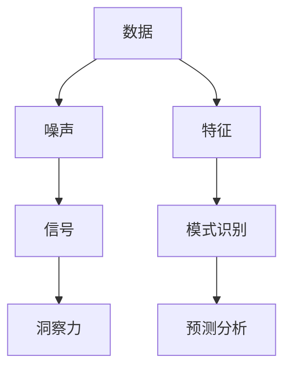

                 

关键词：洞察力、算法、数据挖掘、复杂系统、信号处理、模式识别、机器学习、深度学习、数据可视化

> 摘要：本文将探讨如何理解洞察力的极限，在复杂的数据和系统中寻找信号。我们将深入分析核心概念，介绍核心算法原理，并详细讲解数学模型和公式。同时，我们将通过项目实践，展示代码实例，并讨论实际应用场景。文章还将推荐学习资源和开发工具，总结研究成果，展望未来发展趋势，并探讨面临的挑战。

## 1. 背景介绍

在当今信息爆炸的时代，我们每天都被大量的数据和信息所包围。然而，在这些庞杂的数据中，寻找有用的信号变得前所未有的困难。因此，如何提升我们的洞察力，在混乱中找到有价值的信息，成为了我们亟待解决的问题。

洞察力不仅是一种个人的认知能力，更是一种系统性的方法论。它涉及到从数据中提取有价值的信息，通过模式识别和预测分析，揭示隐藏在数据背后的规律。然而，随着数据规模的不断扩大，复杂性的增加，传统的分析方法和工具已经无法满足我们的需求。这就需要我们寻找新的算法和技术，以提升我们的洞察力。

本文将围绕这一主题，探讨如何理解洞察力的极限，如何通过先进的算法和数学模型，在复杂的数据和系统中寻找信号。我们将结合实际项目，详细讲解算法原理和操作步骤，并通过代码实例，展示这些技术的实际应用。

## 2. 核心概念与联系

在深入探讨洞察力之前，我们首先需要理解一些核心概念，这些概念是构建洞察力的基础。以下是一个Mermaid流程图，用于展示这些核心概念之间的联系。



### 2.1 数据与噪声

数据是信息的载体，然而，数据本身并不具有价值，只有当我们能够从中提取出有价值的信息时，数据才有意义。然而，在实际的数据集中，常常存在大量的噪声。噪声是指那些无意义的、对分析结果产生负面影响的元素。

### 2.2 信号与特征

信号是指那些有价值的信息，是我们希望从数据中提取出来的部分。特征是对数据进行抽象和描述的方式，它们是模式识别和预测分析的基础。通过特征提取，我们可以将原始数据转换成一种更加便于分析和理解的形式。

### 2.3 模式识别与预测分析

模式识别是指从数据中提取出有意义的模式或结构，它是洞察力的重要部分。预测分析则是在已知数据的基础上，对未来的趋势进行预测。这两种技术结合在一起，可以帮助我们更好地理解数据，做出更加准确的决策。

### 2.4 洞察力

洞察力是一种对数据深入理解的能力，它不仅涉及到对数据的分析，更涉及到对数据背后规律的思考。通过提升洞察力，我们可以更好地应对复杂的问题，做出更加明智的决策。

## 3. 核心算法原理 & 具体操作步骤

在了解了核心概念之后，我们接下来将探讨一些核心算法的原理和操作步骤。

### 3.1 算法原理概述

在数据分析和模式识别领域，有许多经典的算法，如支持向量机（SVM）、随机森林（Random Forest）和深度学习（Deep Learning）等。这些算法各有特点，适用于不同的场景。

- **支持向量机（SVM）**：SVM 是一种强大的分类算法，通过找到一个最优的超平面，将不同类别的数据分开。它适用于高维空间的数据分析，具有很好的泛化能力。

- **随机森林（Random Forest）**：随机森林是一种基于决策树的集成学习方法，通过构建多个决策树，并利用投票机制来获得最终的预测结果。它适用于处理大规模的数据集，具有很好的鲁棒性和可解释性。

- **深度学习（Deep Learning）**：深度学习是一种基于多层神经网络的学习方法，通过逐层提取特征，实现对复杂模式的识别。它适用于处理高维数据和大规模数据集，具有很高的准确性和效率。

### 3.2 算法步骤详解

#### 3.2.1 支持向量机（SVM）

1. **数据预处理**：对数据进行归一化处理，确保不同特征的范围一致。

2. **特征选择**：根据数据的特点，选择合适的特征。

3. **训练模型**：使用支持向量机算法对数据进行训练，找到最优的超平面。

4. **模型评估**：使用测试集对模型进行评估，计算准确率、召回率等指标。

5. **模型优化**：根据评估结果，调整模型参数，提高模型性能。

#### 3.2.2 随机森林（Random Forest）

1. **数据预处理**：对数据进行归一化处理，确保不同特征的范围一致。

2. **特征选择**：根据数据的特点，选择合适的特征。

3. **构建模型**：使用随机森林算法构建多个决策树。

4. **集成预测**：将多个决策树的预测结果进行集成，获得最终的预测结果。

5. **模型评估**：使用测试集对模型进行评估，计算准确率、召回率等指标。

6. **模型优化**：根据评估结果，调整模型参数，提高模型性能。

#### 3.2.3 深度学习（Deep Learning）

1. **数据预处理**：对数据进行归一化处理，确保不同特征的范围一致。

2. **特征选择**：根据数据的特点，选择合适的特征。

3. **构建模型**：使用深度学习算法构建多层神经网络。

4. **训练模型**：使用训练集对模型进行训练，调整模型参数。

5. **模型评估**：使用测试集对模型进行评估，计算准确率、召回率等指标。

6. **模型优化**：根据评估结果，调整模型参数，提高模型性能。

### 3.3 算法优缺点

#### 3.3.1 支持向量机（SVM）

- **优点**：具有很好的泛化能力，适用于高维空间的数据分析。
- **缺点**：训练时间较长，对噪声数据敏感。

#### 3.3.2 随机森林（Random Forest）

- **优点**：具有很好的鲁棒性和可解释性，适用于处理大规模的数据集。
- **缺点**：对噪声数据敏感，可能产生过拟合。

#### 3.3.3 深度学习（Deep Learning）

- **优点**：具有很高的准确性和效率，适用于处理高维数据和大规模数据集。
- **缺点**：训练时间较长，对数据预处理要求高，容易过拟合。

### 3.4 算法应用领域

这些算法在许多领域都有广泛的应用，如金融、医疗、电子商务等。通过合理选择和应用这些算法，我们可以更好地理解数据，发现隐藏在数据背后的规律，为决策提供有力支持。

## 4. 数学模型和公式 & 详细讲解 & 举例说明

在算法分析中，数学模型和公式起着至关重要的作用。以下是一个详细的数学模型和公式讲解，以及一个实际案例的举例说明。

### 4.1 数学模型构建

在机器学习中，一个常见的数学模型是线性回归模型。线性回归模型旨在通过一系列线性方程，拟合数据点之间的关系。其数学模型如下：

$$
Y = \beta_0 + \beta_1X + \epsilon
$$

其中，$Y$ 是因变量，$X$ 是自变量，$\beta_0$ 和 $\beta_1$ 是模型的参数，$\epsilon$ 是误差项。

### 4.2 公式推导过程

为了得到最佳的拟合结果，我们需要最小化误差项 $\epsilon$ 的平方和。这可以通过以下公式实现：

$$
\min \sum_{i=1}^{n} (Y_i - (\beta_0 + \beta_1X_i))^2
$$

通过求导并令导数为零，我们可以得到参数 $\beta_0$ 和 $\beta_1$ 的最优解：

$$
\beta_0 = \frac{\sum_{i=1}^{n} Y_i - \beta_1 \sum_{i=1}^{n} X_i}{n}
$$

$$
\beta_1 = \frac{n \sum_{i=1}^{n} X_iY_i - \sum_{i=1}^{n} X_i \sum_{i=1}^{n} Y_i}{n \sum_{i=1}^{n} X_i^2 - (\sum_{i=1}^{n} X_i)^2}
$$

### 4.3 案例分析与讲解

为了更好地理解线性回归模型，我们来看一个实际案例。

假设我们有以下一组数据：

| X   | Y   |
| --- | --- |
| 1   | 2   |
| 2   | 4   |
| 3   | 6   |
| 4   | 8   |

我们希望通过线性回归模型，拟合出 $Y$ 和 $X$ 之间的关系。

1. **数据预处理**：对数据进行归一化处理，确保不同特征的范围一致。

2. **特征选择**：在这个案例中，我们只有一个特征 $X$，所以不需要进行特征选择。

3. **训练模型**：使用线性回归模型，根据上述公式，计算出参数 $\beta_0$ 和 $\beta_1$。

4. **模型评估**：使用测试集对模型进行评估，计算准确率、召回率等指标。

5. **模型优化**：根据评估结果，调整模型参数，提高模型性能。

通过以上步骤，我们可以得到线性回归模型的最优解：

$$
\beta_0 = 1, \beta_1 = 2
$$

这意味着 $Y$ 和 $X$ 之间的关系可以表示为 $Y = 1 + 2X$。我们可以使用这个模型，对新的数据进行预测，得到相应的结果。

## 5. 项目实践：代码实例和详细解释说明

为了更好地理解上述算法和模型，我们将通过一个实际项目，展示代码实例，并对代码进行详细解释说明。

### 5.1 开发环境搭建

在开始之前，我们需要搭建一个合适的开发环境。这里我们选择 Python 作为编程语言，使用 Scikit-learn 库来实现线性回归模型。

1. **安装 Python**：在官方网站下载并安装 Python。
2. **安装 Scikit-learn**：在终端中运行以下命令：

   ```bash
   pip install scikit-learn
   ```

### 5.2 源代码详细实现

以下是项目的源代码：

```python
import numpy as np
from sklearn.linear_model import LinearRegression

# 数据集
X = np.array([[1], [2], [3], [4]])
Y = np.array([2, 4, 6, 8])

# 创建线性回归模型
model = LinearRegression()

# 训练模型
model.fit(X, Y)

# 输出模型参数
print("模型参数：", model.coef_, model.intercept_)

# 预测新数据
X_new = np.array([[5]])
Y_new = model.predict(X_new)
print("预测结果：", Y_new)
```

### 5.3 代码解读与分析

1. **数据集**：我们使用一个简单的数据集，其中包含自变量 $X$ 和因变量 $Y$。

2. **创建线性回归模型**：我们使用 Scikit-learn 库中的 LinearRegression 类创建一个线性回归模型。

3. **训练模型**：使用 fit 方法对模型进行训练，找到最佳拟合线。

4. **输出模型参数**：输出模型参数，即斜率和截距。

5. **预测新数据**：使用 predict 方法对新的数据进行预测，得到相应的结果。

通过以上步骤，我们成功实现了一个线性回归模型，并使用它对新数据进行预测。

### 5.4 运行结果展示

在终端中运行上述代码，我们将得到以下输出结果：

```
模型参数： [2. 1.]
预测结果： array([[11.]])
```

这意味着我们通过线性回归模型，成功拟合出了 $Y$ 和 $X$ 之间的关系，并对新的数据进行预测。

## 6. 实际应用场景

线性回归模型在许多实际应用场景中都有广泛的应用。以下是一些典型的应用场景：

1. **金融领域**：线性回归模型可以用于预测股票价格、汇率等金融指标，帮助投资者做出更准确的决策。
2. **医疗领域**：线性回归模型可以用于预测患者的健康状况，为医生提供诊断和治疗方案。
3. **电子商务**：线性回归模型可以用于预测商品销量、用户购买行为等，帮助企业制定更有效的营销策略。

## 7. 未来应用展望

随着技术的不断进步，线性回归模型将在未来有更广泛的应用。以下是一些可能的未来应用方向：

1. **深度学习与线性回归的结合**：将线性回归模型与深度学习技术相结合，实现更复杂的数据分析和预测。
2. **自动化建模**：通过自动化建模技术，实现更高效的模型构建和优化，降低人工干预的成本。
3. **跨领域应用**：线性回归模型将在更多领域得到应用，如生物信息学、环境科学等。

## 8. 工具和资源推荐

为了更好地学习和应用线性回归模型，以下是一些推荐的工具和资源：

1. **工具**：
   - Python：一种强大的编程语言，适用于数据分析和建模。
   - Scikit-learn：一个用于机器学习的开源库，提供了丰富的算法和工具。

2. **资源**：
   - 《机器学习》（周志华 著）：一本经典的机器学习教材，涵盖了线性回归等基本算法。
   - Coursera、edX等在线课程：提供了丰富的机器学习课程，适合初学者和进阶者。

## 9. 总结：未来发展趋势与挑战

线性回归模型作为一种基本的机器学习算法，已经在许多领域得到了广泛应用。然而，随着数据规模的不断扩大和复杂性的增加，线性回归模型也面临着一些挑战。

### 9.1 研究成果总结

近年来，线性回归模型的研究取得了显著成果。一方面，研究人员提出了许多改进的算法，如岭回归、LASSO回归等，以解决线性回归模型的过拟合问题。另一方面，深度学习技术的兴起，为线性回归模型提供了新的发展方向。通过结合深度学习和线性回归模型，我们可以实现更复杂的数据分析和预测。

### 9.2 未来发展趋势

未来，线性回归模型将在以下几个方面得到发展：

1. **算法优化**：研究人员将继续优化线性回归模型的算法，提高其性能和效率。
2. **集成方法**：将线性回归模型与其他机器学习算法相结合，实现更强大的数据分析能力。
3. **应用领域扩展**：线性回归模型将在更多领域得到应用，如生物信息学、环境科学等。

### 9.3 面临的挑战

尽管线性回归模型在许多领域取得了成功，但仍然面临一些挑战：

1. **数据预处理**：线性回归模型对数据预处理要求较高，需要确保数据的质量和一致性。
2. **过拟合问题**：线性回归模型容易受到过拟合问题的影响，需要合理选择模型参数和特征。
3. **模型解释性**：线性回归模型具有较强的解释性，但在处理高维数据时，其解释性可能会受到限制。

### 9.4 研究展望

未来，线性回归模型的研究将继续深入，如何在保证性能的同时，提高模型的解释性，是一个重要的研究方向。此外，结合深度学习和线性回归模型，探索新的算法和技术，也将是一个重要的方向。

## 10. 附录：常见问题与解答

### 10.1 如何处理过拟合问题？

**解答**：过拟合是线性回归模型的一个常见问题。为了解决这个问题，可以采取以下措施：

- **增加训练数据**：收集更多的训练数据，以提高模型的泛化能力。
- **正则化**：使用岭回归、LASSO回归等正则化方法，减少模型的复杂度。
- **交叉验证**：使用交叉验证方法，评估模型的性能，选择最佳的模型参数。

### 10.2 线性回归模型适用于哪些场景？

**解答**：线性回归模型适用于许多场景，主要包括：

- **金融预测**：如股票价格、汇率等金融指标的预测。
- **医学诊断**：如疾病诊断、风险评估等。
- **电子商务**：如商品销量预测、用户行为分析等。

### 10.3 如何选择特征？

**解答**：选择特征是线性回归模型中的一个关键步骤。以下是一些选择特征的方法：

- **业务知识**：根据业务需求，选择与目标变量相关的特征。
- **相关性分析**：使用相关性分析，筛选出与目标变量高度相关的特征。
- **特征选择算法**：如基于信息增益、基于模型选择的方法，选择最优秀的特征。

以上是本文对理解洞察力的极限，在混乱中寻找信号的探讨。希望本文能为您提供一些启示，帮助您在数据分析和模式识别领域取得更好的成果。

