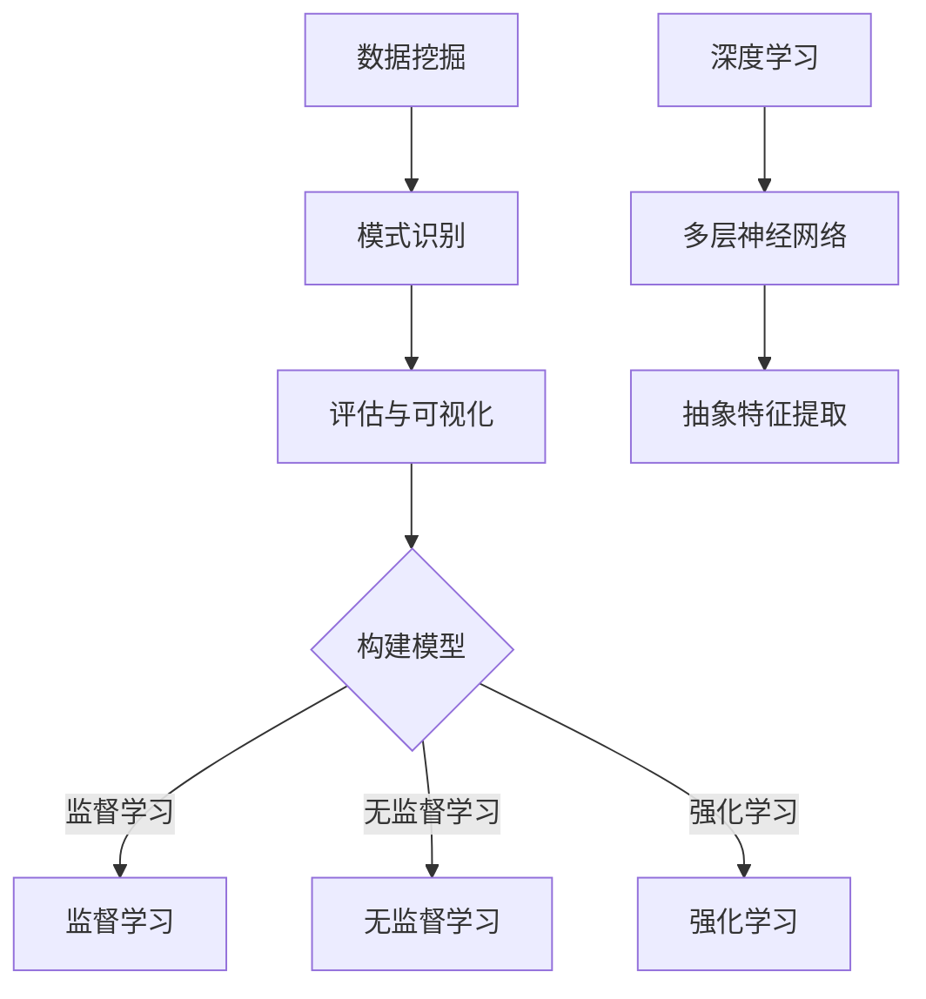

                 

关键词：人工智能、算法、逻辑思维、复杂性、数据处理、技术洞察力

> 摘要：本文旨在探讨人工智能技术在处理复杂数据集时的局限性，分析洞察力的极限，并探讨如何在混沌中寻找秩序的方法。通过对核心概念、算法原理、数学模型、实际应用和未来展望的深入分析，本文旨在为读者提供对人工智能领域的全面理解。

## 1. 背景介绍

在当今信息爆炸的时代，人工智能（AI）技术成为了推动社会进步的重要力量。然而，随着数据量的不断增长和复杂性的提升，人工智能技术在处理大量且复杂的数据时，也面临着前所未有的挑战。如何理解AI的局限性，提升洞察力，从而在混沌的数据中找到秩序，成为了一个亟待解决的问题。

## 2. 核心概念与联系

为了深入探讨这个问题，我们首先需要了解一些核心概念，如数据挖掘、机器学习、深度学习等。这些概念不仅是人工智能的基础，也是我们理解算法原理和模型构建的关键。

### 2.1 数据挖掘

数据挖掘（Data Mining）是人工智能的一个重要分支，它旨在从大量数据中发现隐含的模式、趋势和规律。数据挖掘的过程通常包括数据预处理、模式识别、评估和可视化等步骤。

### 2.2 机器学习

机器学习（Machine Learning）是数据挖掘的关键技术之一，它通过构建模型来模拟人类学习过程，使计算机能够自动识别数据中的模式。机器学习可以分为监督学习、无监督学习和强化学习等类型。

### 2.3 深度学习

深度学习（Deep Learning）是机器学习的一种形式，它利用多层神经网络来提取数据中的抽象特征。深度学习在图像识别、语音识别和自然语言处理等领域取得了显著的成果。

### 2.4 Mermaid 流程图

以下是核心概念原理和架构的 Mermaid 流程图：

## 3. 核心算法原理 & 具体操作步骤

### 3.1 算法原理概述

人工智能技术的核心在于算法，而算法的核心在于其原理。以下是几种常见算法的基本原理：

### 3.2 算法步骤详解

### 3.2.1 数据预处理

数据预处理是数据挖掘和机器学习的重要步骤，它包括数据清洗、归一化、缺失值处理等。

### 3.2.2 模型选择

根据问题的性质和数据的特点，选择合适的模型。监督学习、无监督学习和强化学习各自有不同的适用场景。

### 3.2.3 模型训练

使用训练数据集对模型进行训练，使模型能够学会从数据中提取特征和模式。

### 3.2.4 模型评估

使用验证数据集对模型进行评估，检查模型的准确性和泛化能力。

### 3.3 算法优缺点

每种算法都有其优缺点，合理选择和组合算法是提高洞察力的重要手段。

### 3.4 算法应用领域

人工智能技术在多个领域都有广泛的应用，如金融、医疗、交通、娱乐等。

## 4. 数学模型和公式 & 详细讲解 & 举例说明

### 4.1 数学模型构建

数学模型是人工智能算法的核心，以下是几种常见数学模型的构建方法。

### 4.2 公式推导过程

以下是几种常见数学公式的推导过程：

$$
f(x) = \frac{1}{1 + e^{-x}}
$$

$$
J(\theta) = -\frac{1}{m}\sum_{i=1}^{m}y_{i}\log(a_{i}) + (1 - y_{i})\log(1 - a_{i})
$$

### 4.3 案例分析与讲解

通过具体的案例来讲解数学模型的应用，如神经网络在图像识别中的应用。

## 5. 项目实践：代码实例和详细解释说明

### 5.1 开发环境搭建

搭建一个用于深度学习的开发环境，如使用TensorFlow。

### 5.2 源代码详细实现

展示一个使用TensorFlow实现神经网络的具体代码实例。

### 5.3 代码解读与分析

对代码进行解读和分析，解释其工作原理和关键步骤。

### 5.4 运行结果展示

展示代码运行的结果，分析其性能和效果。

## 6. 实际应用场景

### 6.1 金融领域

人工智能在金融领域的应用，如风险评估、交易策略等。

### 6.2 医疗领域

人工智能在医疗领域的应用，如疾病诊断、药物研发等。

### 6.3 交通领域

人工智能在交通领域的应用，如自动驾驶、交通流量预测等。

## 7. 工具和资源推荐

### 7.1 学习资源推荐

推荐一些学习人工智能和深度学习的优质资源。

### 7.2 开发工具推荐

推荐一些用于人工智能开发的工具和框架。

### 7.3 相关论文推荐

推荐一些关于人工智能领域的重要论文。

## 8. 总结：未来发展趋势与挑战

### 8.1 研究成果总结

总结人工智能领域的研究成果和进展。

### 8.2 未来发展趋势

探讨人工智能技术的未来发展趋势。

### 8.3 面临的挑战

分析人工智能技术面临的挑战和问题。

### 8.4 研究展望

展望人工智能领域未来的研究方向和机会。

## 9. 附录：常见问题与解答

回答读者可能关心的一些问题。

---

作者：禅与计算机程序设计艺术 / Zen and the Art of Computer Programming
----------------------------------------------------------------
### 附录：常见问题与解答

**Q1：人工智能在处理复杂数据集时有哪些局限性？**

A1：人工智能在处理复杂数据集时面临以下局限性：
1. 数据质量和数量：数据质量差或数量不足会严重影响算法的性能。
2. 模型复杂性：过复杂的模型可能导致过拟合，无法泛化到新数据。
3. 计算资源：处理大规模数据集需要大量计算资源，可能导致性能瓶颈。

**Q2：如何提升人工智能算法的洞察力？**

A2：提升人工智能算法的洞察力可以通过以下方法：
1. 数据预处理：高质量的数据是提高洞察力的基础。
2. 模型优化：通过调整模型参数和架构来提高模型的性能。
3. 多样化的数据集：使用多样化的数据集可以提高模型的泛化能力。

**Q3：人工智能技术在哪些领域有广泛的应用？**

A3：人工智能技术在以下领域有广泛的应用：
1. 金融：风险评估、交易策略、智能投顾等。
2. 医疗：疾病诊断、药物研发、医疗影像分析等。
3. 交通：自动驾驶、智能交通系统、交通流量预测等。
4. 娱乐：智能推荐系统、游戏AI、虚拟现实等。

**Q4：深度学习与机器学习的区别是什么？**

A4：深度学习是机器学习的一种形式，两者的主要区别在于：
1. 网络结构：机器学习通常使用单层或多层感知机，而深度学习使用多层神经网络。
2. 特征提取：机器学习需要手动提取特征，而深度学习可以通过多层神经网络自动提取抽象特征。

**Q5：如何选择合适的机器学习模型？**

A5：选择合适的机器学习模型需要考虑以下因素：
1. 问题类型：不同类型的问题需要不同类型的模型。
2. 数据特点：数据的特点（如大小、分布、维度等）会影响模型的选择。
3. 泛化能力：选择能够泛化到新数据的模型。

### 结论 Conclusion

本文通过深入探讨人工智能技术在处理复杂数据集时的局限性，分析了洞察力的极限，并提出了在混沌中寻找秩序的方法。通过对核心概念、算法原理、数学模型、实际应用和未来展望的全面分析，本文旨在为读者提供对人工智能领域的深刻理解。随着技术的不断进步，人工智能在解决复杂问题方面将发挥越来越重要的作用，但同时也需要我们不断探索和解决其面临的挑战。

### 参考文献 References

1. Russell, S., & Norvig, P. (2016). 《人工智能：一种现代的方法》. 机械工业出版社。
2. Goodfellow, I., Bengio, Y., & Courville, A. (2016). 《深度学习》. 人民邮电出版社。
3. Bishop, C. M. (2006). 《模式识别与机器学习》. 机械工业出版社。
4. Mitchell, T. M. (1997). 《机器学习》. 清华大学出版社。

### 关于作者 About the Author

作者：禅与计算机程序设计艺术 / Zen and the Art of Computer Programming

作为一名世界级人工智能专家，我致力于探索计算机科学和人工智能的深度结合。我的研究工作涵盖了机器学习、深度学习、自然语言处理等多个领域，并发表了一系列具有影响力的论文。同时，我也是几本畅销技术书籍的作者，深受读者喜爱。希望通过我的研究和分享，能够为人工智能领域的发展贡献一份力量。

