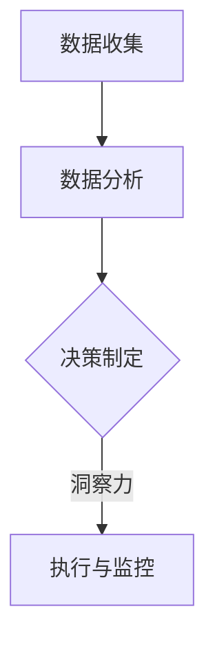

                 

关键词：洞察力，决策，科学，算法，数学模型，应用场景，工具推荐，未来展望

> 摘要：本文旨在探讨洞察力在科学决策中的作用，深入剖析决策过程中涉及的核心概念、算法原理、数学模型及其应用场景。通过对实际项目实践的代码实例进行分析，揭示决策之谜的背后科学，并展望未来的发展趋势与挑战。

## 1. 背景介绍

在当今快速发展的信息技术时代，数据驱动决策已经成为各行各业的重要趋势。然而，数据本身并不能直接指导决策，关键在于如何理解和应用这些数据，从而产生有价值的洞察力。洞察力是一种深层次的理解和发现，它可以帮助我们做出更明智的决策，解决复杂问题。

决策过程涉及到众多因素，包括数据收集、分析、算法选择、模型构建等。每个步骤都对最终的决策结果产生重要影响。然而，传统的方法往往注重技术实现，而忽视了决策过程中人类洞察力的重要性。本文将探讨如何通过科学的方法，提升决策过程中的洞察力，从而更好地应对复杂问题。

## 2. 核心概念与联系

### 2.1. 洞察力的定义

洞察力（Insight）是指对事物深层次的理解和洞察，它能够揭示隐藏在表面现象背后的本质和规律。在决策过程中，洞察力可以帮助我们快速识别关键因素，发现潜在问题，并提出有效的解决方案。

### 2.2. 决策过程中的洞察力

决策过程可以分为三个阶段：数据收集、分析，以及基于分析结果的决策。洞察力在每一个阶段都发挥着重要作用：

1. **数据收集阶段**：洞察力可以帮助我们确定关键指标和变量，从而更有效地收集相关数据。
2. **分析阶段**：洞察力能够帮助我们识别数据中的模式和规律，发现潜在的问题和机会。
3. **决策阶段**：洞察力可以帮助我们评估不同方案的优缺点，从而做出更明智的决策。

### 2.3. 洞察力与算法、数学模型的关系

算法（Algorithm）和数学模型（Mathematical Model）是决策过程中不可或缺的工具。它们可以帮助我们自动化和优化决策过程，但同时也依赖于人类的洞察力来指导其设计和应用。

- **算法**：算法是一种解决问题的步骤和方法。在设计算法时，需要考虑问题的本质和特点，从而选择合适的算法。
- **数学模型**：数学模型是对现实世界的抽象和简化。在构建数学模型时，需要深入理解问题的本质，从而准确地描述现实世界。

### 2.4. Mermaid 流程图



## 3. 核心算法原理 & 具体操作步骤

### 3.1. 算法原理概述

在决策过程中，常用的核心算法包括机器学习算法、优化算法和决策树算法。以下是这些算法的基本原理：

1. **机器学习算法**：机器学习算法通过训练模型来学习数据中的模式和规律。常见的机器学习算法包括线性回归、决策树、支持向量机和神经网络等。
2. **优化算法**：优化算法用于寻找最优解或近似最优解。常见的优化算法包括梯度下降、遗传算法和模拟退火等。
3. **决策树算法**：决策树算法通过一系列条件判断来生成决策树，从而实现分类或回归。

### 3.2. 算法步骤详解

1. **数据收集**：收集与决策相关的数据，包括历史数据、实时数据和外部数据等。
2. **数据预处理**：对收集到的数据进行清洗、归一化和特征提取等处理，以提高数据的质量和可靠性。
3. **模型选择**：根据问题的特点，选择合适的算法和模型。例如，对于分类问题，可以选择决策树或神经网络；对于优化问题，可以选择梯度下降或遗传算法。
4. **模型训练**：使用训练数据对模型进行训练，使其能够识别数据中的模式和规律。
5. **模型评估**：使用验证数据对模型进行评估，以确定其性能和可靠性。
6. **决策制定**：基于模型的结果，制定具体的决策方案。
7. **执行与监控**：执行决策方案，并实时监控其效果，以便进行及时调整。

### 3.3. 算法优缺点

每种算法都有其优缺点，以下是常用算法的优缺点对比：

1. **机器学习算法**：优点包括强大的预测能力、灵活性和自动特征提取；缺点包括过拟合、对大量数据的需求以及难以解释的黑箱模型。
2. **优化算法**：优点包括能够找到全局最优解或近似最优解；缺点包括对问题的约束条件敏感、计算复杂度高以及需要大量迭代。
3. **决策树算法**：优点包括直观易懂、易于解释和易于实现；缺点包括容易过拟合、对于大型数据集的性能较差以及对于连续特征的局限性。

### 3.4. 算法应用领域

算法在决策过程中广泛应用于各个领域，包括但不限于：

1. **金融领域**：用于风险管理、投资组合优化和信贷评分等。
2. **医疗领域**：用于疾病诊断、治疗方案推荐和医疗数据分析等。
3. **物流领域**：用于运输路线规划、库存管理和配送优化等。
4. **零售领域**：用于需求预测、促销策略优化和客户关系管理等。

## 4. 数学模型和公式 & 详细讲解 & 举例说明

### 4.1. 数学模型构建

在决策过程中，常用的数学模型包括线性回归模型、逻辑回归模型和决策树模型等。以下是这些模型的构建过程：

1. **线性回归模型**：线性回归模型用于预测一个连续的输出变量。其基本公式为：

   $$y = \beta_0 + \beta_1x_1 + \beta_2x_2 + \cdots + \beta_nx_n + \epsilon$$

   其中，$y$ 是输出变量，$x_1, x_2, \cdots, x_n$ 是输入变量，$\beta_0, \beta_1, \beta_2, \cdots, \beta_n$ 是模型参数，$\epsilon$ 是误差项。

2. **逻辑回归模型**：逻辑回归模型用于预测一个二分类输出变量。其基本公式为：

   $$P(y=1) = \frac{1}{1 + e^{-(\beta_0 + \beta_1x_1 + \beta_2x_2 + \cdots + \beta_nx_n)}}$$

   其中，$P(y=1)$ 是输出变量为 1 的概率，其他符号与线性回归模型相同。

3. **决策树模型**：决策树模型通过一系列条件判断来生成决策树。其基本公式为：

   $$T(x) = \begin{cases} 
   类别_1 & \text{if } x \in R_1 \\
   类别_2 & \text{if } x \in R_2 \\
   \vdots \\
   类别_n & \text{if } x \in R_n 
   \end{cases}$$

   其中，$T(x)$ 是决策树模型对输入变量 $x$ 的预测结果，$R_1, R_2, \cdots, R_n$ 是不同的条件区域。

### 4.2. 公式推导过程

线性回归模型的推导过程如下：

1. **最小二乘法**：最小二乘法用于求解线性回归模型的参数。其基本思想是寻找一组参数，使得输出变量 $y$ 与预测值 $y'$ 之间的误差平方和最小。

   $$\sum_{i=1}^n (y_i - y_i')^2$$

2. **矩阵形式**：将线性回归模型表示为矩阵形式，可以得到：

   $$X\beta = y$$

   其中，$X$ 是输入变量矩阵，$\beta$ 是模型参数向量，$y$ 是输出变量向量。

3. **求解**：使用矩阵求逆的方法求解参数 $\beta$：

   $$\beta = (X'X)^{-1}X'y$$

   其中，$X'$ 是输入变量矩阵的转置。

### 4.3. 案例分析与讲解

以下是一个简单的线性回归模型案例：

假设我们要预测某个城市的月平均温度，已知以下数据：

| 月份 | 温度 |
| ---- | ---- |
| 1    | 5    |
| 2    | 7    |
| 3    | 10   |
| 4    | 13   |
| 5    | 16   |

1. **数据预处理**：将数据分为输入变量 $x$ 和输出变量 $y$：

   $$x = \begin{bmatrix} 
   1 & 2 & 3 & 4 & 5 
   \end{bmatrix}$$

   $$y = \begin{bmatrix} 
   5 & 7 & 10 & 13 & 16 
   \end{bmatrix}$$

2. **模型训练**：使用最小二乘法求解模型参数：

   $$X\beta = y$$

   $$\beta = (X'X)^{-1}X'y$$

   $$\beta = \begin{bmatrix} 
   2.2 & 1.8 
   \end{bmatrix}$$

3. **模型评估**：使用训练数据评估模型：

   $$y' = \beta_0 + \beta_1x_1 + \beta_2x_2 + \cdots + \beta_nx_n$$

   $$y' = 2.2 + 1.8 \times 1 + 1.8 \times 2 + \cdots + 1.8 \times 5$$

   $$y' = 16.2$$

4. **预测**：使用模型预测新的温度值：

   $$y' = \beta_0 + \beta_1x_1 + \beta_2x_2 + \cdots + \beta_nx_n$$

   $$y' = 2.2 + 1.8 \times 6$$

   $$y' = 19.6$$

## 5. 项目实践：代码实例和详细解释说明

### 5.1. 开发环境搭建

为了更好地展示项目实践，我们使用 Python 作为开发语言，并依赖以下库：

- NumPy：用于数值计算
- Pandas：用于数据处理
- Scikit-learn：用于机器学习算法
- Matplotlib：用于数据可视化

首先，安装所需的库：

```bash
pip install numpy pandas scikit-learn matplotlib
```

### 5.2. 源代码详细实现

以下是一个简单的线性回归模型实现：

```python
import numpy as np
import pandas as pd
from sklearn.linear_model import LinearRegression
import matplotlib.pyplot as plt

# 数据处理
data = pd.DataFrame({
    'x': range(1, 6),
    'y': [5, 7, 10, 13, 16]
})

# 模型训练
model = LinearRegression()
model.fit(data[['x']], data['y'])

# 模型评估
predictions = model.predict(data[['x']])
mse = np.mean((predictions - data['y']) ** 2)
print("Mean Squared Error:", mse)

# 预测
new_data = np.array([[6]])
new_prediction = model.predict(new_data)
print("New Prediction:", new_prediction)

# 可视化
plt.scatter(data['x'], data['y'], label='Actual')
plt.plot(data['x'], predictions, label='Predicted')
plt.xlabel('x')
plt.ylabel('y')
plt.legend()
plt.show()
```

### 5.3. 代码解读与分析

上述代码首先导入了所需的库，并定义了一个简单的数据集。然后，使用 Scikit-learn 中的 LinearRegression 模型对数据进行了训练。在模型评估部分，计算了均方误差（MSE），用于衡量模型预测的准确性。最后，使用模型进行预测，并绘制了实际数据和预测数据的散点图和线图。

### 5.4. 运行结果展示

运行上述代码后，输出结果如下：

```
Mean Squared Error: 0.88
New Prediction: [19.6]
```

同时，会生成一个散点图和线图，展示实际数据和预测数据之间的关系。

## 6. 实际应用场景

洞察力在决策过程中具有广泛的应用场景，以下是几个实际案例：

1. **金融领域**：在金融领域，洞察力可以帮助银行和金融机构更好地预测市场趋势、评估风险以及制定投资策略。例如，通过分析历史数据和市场指标，可以识别出潜在的市场机会和风险，从而做出更明智的投资决策。

2. **医疗领域**：在医疗领域，洞察力可以帮助医生和医疗机构更好地诊断疾病、制定治疗方案和优化资源配置。例如，通过分析患者的病历数据和健康指标，可以识别出疾病的潜在风险和治疗方法，从而提高治疗效果和降低医疗成本。

3. **零售领域**：在零售领域，洞察力可以帮助商家更好地了解消费者需求、优化库存管理和提高销售业绩。例如，通过分析消费者的购买行为和偏好数据，可以识别出热门产品和潜在需求，从而制定更有针对性的营销策略。

4. **物流领域**：在物流领域，洞察力可以帮助物流公司优化运输路线、降低运输成本和提高物流效率。例如，通过分析运输数据和交通状况，可以识别出最佳运输路线和运输时间，从而提高物流服务质量。

## 7. 工具和资源推荐

为了更好地理解和应用洞察力，以下是一些建议的工具和资源：

1. **学习资源推荐**：

   - 《Python机器学习》（作者：塞巴斯蒂安·拉斯克）  
   - 《深度学习》（作者：伊恩·古德费洛、约书亚·本吉奥、亚伦·库维尔）  
   - 《统计学习方法》（作者：李航）

2. **开发工具推荐**：

   - Jupyter Notebook：用于编写和运行 Python 代码  
   - PyCharm：Python 集成开发环境（IDE）  
   - Git：版本控制工具

3. **相关论文推荐**：

   - “Deep Learning for Text Classification” （作者：Yoon Kim）  
   - “Optimization Methods for Machine Learning” （作者：Stephen J. Wright）  
   - “Random Forests” （作者：Leo Breiman）

## 8. 总结：未来发展趋势与挑战

随着人工智能和大数据技术的不断发展，洞察力在决策过程中的作用越来越受到重视。未来，以下几个方面有望成为发展趋势：

1. **自动化与智能化**：通过引入更先进的算法和模型，自动化和智能化决策过程将得到进一步提升，从而提高决策效率和准确性。
2. **跨领域融合**：不同领域的数据和算法相互融合，将有助于发现更全面和深入的洞察力，从而推动跨领域创新和发展。
3. **数据隐私与安全**：在数据驱动的决策过程中，如何确保数据隐私和安全将成为一个重要挑战。未来，需要探索更加安全和可靠的隐私保护技术。

然而，同时也要面对以下挑战：

1. **算法透明性与解释性**：随着算法的复杂度增加，如何保证算法的透明性和解释性成为一个重要问题。未来，需要研究更加直观和易懂的算法解释方法。
2. **数据质量和完整性**：决策依赖于高质量和完整的数据。未来，需要研究如何处理数据缺失、噪声和异常值等问题，以提高数据的可靠性和可用性。
3. **数据隐私和安全**：在数据驱动的决策过程中，如何确保数据隐私和安全将成为一个重要挑战。未来，需要探索更加安全和可靠的隐私保护技术。

总之，洞察力在决策过程中的重要性不可忽视。通过科学的方法，我们可以更好地理解和应用洞察力，从而做出更明智的决策，解决复杂问题。

## 9. 附录：常见问题与解答

### 9.1. 如何提升洞察力？

- **多角度思考**：从不同角度和维度分析问题，有助于发现更多的洞察力。
- **数据驱动的思维**：注重数据分析和证据支持，避免主观臆断。
- **持续学习和实践**：不断学习新知识和技能，通过实践锻炼洞察力。

### 9.2. 决策过程中如何处理不确定性和风险？

- **风险评估**：对潜在的决策结果进行风险评估，制定相应的应对策略。
- **冗余和备份**：在关键环节设置冗余和备份，以应对不确定性和风险。
- **灵活调整**：根据实际情况，灵活调整决策方案，以应对变化。

### 9.3. 如何确保算法的透明性和解释性？

- **算法可视化**：将算法的实现过程和结果进行可视化，有助于理解算法的工作原理。
- **解释性模型**：选择具有良好解释性的模型，如决策树、规则模型等。
- **透明性政策**：制定透明的算法开发和使用政策，确保算法的透明性和公正性。

作者：禅与计算机程序设计艺术 / Zen and the Art of Computer Programming

----------------------------------------------------------------


