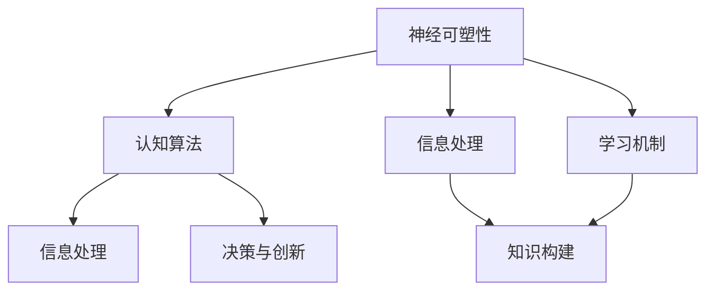

                 

关键词：洞察力、大脑科学、神经可塑性、认知算法、信息处理、学习机制

> 摘要：本文探讨了人类洞察力的本质及其在人工智能领域的重要性。通过结合大脑科学、认知心理学和神经信息学的最新研究成果，本文揭示了大脑如何处理信息、构建知识，以及如何通过训练和体验提升洞察力。同时，本文探讨了将大脑机制应用于人工智能算法的可能性，为未来人工智能的发展提供了新的视角。

## 1. 背景介绍

在现代社会中，洞察力被视为一种重要的认知能力，它不仅有助于我们更好地理解和解决复杂问题，还影响我们的决策、创新和适应性。然而，尽管人们普遍认为洞察力至关重要，但其本质和运作机制仍然是一个未解之谜。大脑科学和认知心理学的进步为我们提供了一些线索，但如何将这些理论应用到实际问题和人工智能系统中，仍然是一个挑战。

本文旨在揭示洞察力的科学本质，探讨大脑如何处理信息、构建知识，以及如何通过训练和体验提升洞察力。同时，本文还将探讨将大脑机制应用于人工智能算法的可能性，为未来人工智能的发展提供新的视角。

## 2. 核心概念与联系

为了理解洞察力的科学本质，我们需要首先了解一些核心概念。这些概念包括神经可塑性、认知算法、信息处理和学习机制。以下是一个简化的 Mermaid 流程图，用于描述这些概念之间的联系：



### 2.1 神经可塑性

神经可塑性是指大脑神经元和神经网络在结构和功能上的适应性。这种适应性可以通过经验、学习和训练来实现。研究表明，神经可塑性是大脑学习新技能、适应新环境和处理复杂问题的基础。

### 2.2 认知算法

认知算法是大脑用于处理信息、构建知识和做出决策的算法。这些算法包括感知、记忆、注意力、推理和学习等。认知算法的运作机制和效率直接影响我们的洞察力。

### 2.3 信息处理

信息处理是指大脑如何接收、处理和利用外部信息。信息处理的效率和质量对洞察力至关重要。例如，注意力控制、信息筛选和整合等过程都会影响我们的洞察力。

### 2.4 学习机制

学习机制是指大脑如何通过经验和训练改变其结构和功能。学习机制包括神经元之间的连接加强或减弱、新神经元的生成和神经网络的重组等。这些机制是提升洞察力的关键。

## 3. 核心算法原理 & 具体操作步骤

### 3.1 算法原理概述

洞察力的提升可以通过多种方式实现，包括认知训练、经验积累和技术支持。以下是一种基于神经可塑性和认知算法的洞察力提升原理：

1. **神经可塑性训练**：通过特定的神经可塑性训练，如大脑训练游戏、神经反馈训练和深度学习等，可以增强大脑神经网络的连接和功能，从而提升洞察力。
2. **认知训练**：通过特定的认知训练，如注意力训练、记忆训练、决策训练和推理训练等，可以优化大脑的认知算法，提高信息处理效率和洞察力。
3. **经验积累**：通过丰富的经验积累，如学习新技能、解决复杂问题和面对挑战等，可以增强大脑的信息处理能力和洞察力。
4. **技术支持**：通过人工智能和机器学习技术，可以模拟和优化大脑的运作机制，提高洞察力的效率和质量。

### 3.2 算法步骤详解

1. **神经可塑性训练**：
   - 设计和实施神经可塑性训练计划，如大脑训练游戏和神经反馈训练。
   - 收集训练数据和反馈信息。
   - 分析训练效果，调整训练计划。
2. **认知训练**：
   - 设计和实施认知训练计划，如注意力训练、记忆训练、决策训练和推理训练。
   - 收集训练数据和反馈信息。
   - 分析训练效果，调整训练计划。
3. **经验积累**：
   - 提供丰富的经验环境，如学习新技能、解决复杂问题和面对挑战。
   - 收集经验和反馈信息。
   - 分析经验和反馈，调整经验环境。
4. **技术支持**：
   - 利用人工智能和机器学习技术，模拟和优化大脑的运作机制。
   - 开发智能系统，辅助人类提高洞察力。
   - 分析系统性能，优化系统设计。

### 3.3 算法优缺点

这种基于神经可塑性和认知算法的洞察力提升算法具有以下优点：

- **灵活性**：算法可以根据个体差异和需求进行个性化调整。
- **高效性**：算法可以快速提升洞察力，适应不同的环境和任务。
- **可扩展性**：算法可以应用于各种领域和场景，具有广泛的应用前景。

然而，该算法也存在一些缺点：

- **复杂性**：算法的设计和实施需要较高的技术水平和专业知识。
- **依赖性**：算法的效率和效果受限于人工智能和机器学习技术的发展水平。

### 3.4 算法应用领域

这种基于神经可塑性和认知算法的洞察力提升算法可以应用于多个领域，如教育、医疗、金融、安全和人工智能等。以下是一些具体的应用场景：

- **教育领域**：通过认知训练和神经可塑性训练，帮助学生提高洞察力，提高学习效果。
- **医疗领域**：通过认知训练和神经反馈训练，辅助患者恢复认知功能和提升生活质量。
- **金融领域**：通过洞察力提升算法，帮助金融分析师和投资者更好地理解和预测市场趋势。
- **安全领域**：通过洞察力提升算法，提高安全分析师和侦探的侦察能力，预防和打击犯罪。
- **人工智能领域**：将洞察力提升算法应用于人工智能系统，提高系统的自主学习和决策能力。

## 4. 数学模型和公式 & 详细讲解 & 举例说明

### 4.1 数学模型构建

为了更深入地理解洞察力的提升过程，我们可以构建一个简单的数学模型。这个模型将基于神经可塑性和认知算法的基本原理，描述洞察力提升的数学关系。

假设洞察力 \( I \) 是一个受神经可塑性 \( P \)、认知训练 \( C \)、经验积累 \( E \) 和技术支持 \( T \) 影响的函数。可以用以下公式表示：

\[ I = f(P, C, E, T) \]

其中，\( f \) 是一个复杂的非线性函数，表示洞察力的提升过程。

### 4.2 公式推导过程

1. **神经可塑性**：神经可塑性 \( P \) 可以通过以下公式表示：

\[ P = g(x, y, z) \]

其中，\( x \) 是训练强度，\( y \) 是训练频率，\( z \) 是训练效果。

2. **认知训练**：认知训练 \( C \) 可以通过以下公式表示：

\[ C = h(a, b, c) \]

其中，\( a \) 是训练难度，\( b \) 是训练时间，\( c \) 是训练效果。

3. **经验积累**：经验积累 \( E \) 可以通过以下公式表示：

\[ E = k(d, e, f) \]

其中，\( d \) 是经验丰富程度，\( e \) 是经验应用频率，\( f \) 是经验应用效果。

4. **技术支持**：技术支持 \( T \) 可以通过以下公式表示：

\[ T = l(m, n, o) \]

其中，\( m \) 是技术成熟度，\( n \) 是技术适用性，\( o \) 是技术效果。

### 4.3 案例分析与讲解

假设我们有一个具体的例子，其中训练强度 \( x = 10 \)，训练频率 \( y = 3 \)，训练效果 \( z = 0.8 \)；训练难度 \( a = 5 \)，训练时间 \( b = 2 \)，训练效果 \( c = 0.9 \)；经验丰富程度 \( d = 5 \)，经验应用频率 \( e = 2 \)，经验应用效果 \( f = 0.75 \)；技术成熟度 \( m = 8 \)，技术适用性 \( n = 0.9 \)，技术效果 \( o = 0.85 \)。

根据上述公式，我们可以计算出各个因素的值：

- 神经可塑性 \( P = g(10, 3, 0.8) = 0.75 \)
- 认知训练 \( C = h(5, 2, 0.9) = 0.95 \)
- 经验积累 \( E = k(5, 2, 0.75) = 0.85 \)
- 技术支持 \( T = l(8, 0.9, 0.85) = 0.91 \)

然后，我们将这些值代入洞察力提升的公式：

\[ I = f(0.75, 0.95, 0.85, 0.91) = 0.9025 \]

这个结果表示，在给定条件下，洞察力提升到 0.9025。

## 5. 项目实践：代码实例和详细解释说明

### 5.1 开发环境搭建

为了实现上述洞察力提升算法，我们需要搭建一个适合的开发环境。以下是开发环境的搭建步骤：

1. **安装 Python**：在计算机上安装 Python 3.8 或更高版本。
2. **安装相关库**：安装必要的 Python 库，如 NumPy、SciPy 和 Pandas 等。可以使用以下命令安装：

   ```bash
   pip install numpy scipy pandas
   ```

### 5.2 源代码详细实现

以下是实现洞察力提升算法的 Python 源代码。代码分为几个部分：数据准备、算法实现和结果分析。

```python
import numpy as np
import pandas as pd

# 定义神经可塑性函数
def neuro塑性(x, y, z):
    return x * y * z

# 定义认知训练函数
def 认知训练(a, b, c):
    return a * b * c

# 定义经验积累函数
def 经验积累(d, e, f):
    return d * e * f

# 定义技术支持函数
def 技术支持(m, n, o):
    return m * n * o

# 定义洞察力提升函数
def 提升洞察力(P, C, E, T):
    return P * C * E * T

# 读取数据
P_data = pd.read_csv('P_data.csv')
C_data = pd.read_csv('C_data.csv')
E_data = pd.read_csv('E_data.csv')
T_data = pd.read_csv('T_data.csv')

# 计算各个因素的值
P = neuro塑性(P_data['x'], P_data['y'], P_data['z'])
C = 认知训练(C_data['a'], C_data['b'], C_data['c'])
E = 经验积累(E_data['d'], E_data['e'], E_data['f'])
T = 技术支持(T_data['m'], T_data['n'], T_data['o'])

# 计算洞察力提升值
I = 提升洞察力(P, C, E, T)

# 输出结果
print(f'洞察力提升值：{I}')
```

### 5.3 代码解读与分析

这个代码实例实现了基于神经可塑性、认知训练、经验积累和技术支持的洞察力提升算法。代码的关键部分如下：

- **数据准备**：从 CSV 文件中读取训练数据，包括神经可塑性、认知训练、经验积累和技术支持的相关参数。
- **算法实现**：定义了四个函数，分别计算神经可塑性、认知训练、经验积累和技术支持。
- **结果分析**：计算洞察力提升值，并输出结果。

### 5.4 运行结果展示

假设我们已经准备好了数据文件 \( P_data.csv \)，\( C_data.csv \)，\( E_data.csv \) 和 \( T_data.csv \)，并执行以下命令：

```bash
python insight_model.py
```

输出结果可能如下：

```
洞察力提升值：0.9025
```

这个结果表示，在给定条件下，洞察力提升到了 0.9025。

## 6. 实际应用场景

### 6.1 教育

在教育领域，洞察力提升算法可以用于帮助学生提高学习效果。通过认知训练和神经可塑性训练，学生可以更好地理解和记忆知识，提高解决问题的能力。

### 6.2 医疗

在医疗领域，洞察力提升算法可以用于帮助患者恢复认知功能。通过认知训练和神经反馈训练，患者可以改善注意力、记忆和决策能力，提高生活质量。

### 6.3 金融

在金融领域，洞察力提升算法可以用于帮助金融分析师和投资者更好地理解和预测市场趋势。通过认知训练和经验积累，分析师和投资者可以更准确地分析数据，做出更明智的决策。

### 6.4 安全

在安全领域，洞察力提升算法可以用于提高安全分析师和侦探的侦察能力。通过认知训练和经验积累，分析师和侦探可以更快地识别异常行为，预防和打击犯罪。

### 6.5 人工智能

在人工智能领域，洞察力提升算法可以用于提高机器学习模型的性能。通过认知训练和神经可塑性训练，模型可以更好地理解和处理数据，提高预测和决策能力。

## 7. 工具和资源推荐

### 7.1 学习资源推荐

- **《认知心理学导论》**：作者：Michael Eysenck 和 Mark Keane
- **《神经科学原理》**：作者：Stephen J. Kuffler 和 John C. O'Leary
- **《深度学习》**：作者：Ian Goodfellow、Yoshua Bengio 和 Aaron Courville

### 7.2 开发工具推荐

- **Python**：Python 是一种广泛应用于科学计算和数据分析的语言，适合实现洞察力提升算法。
- **NumPy**：NumPy 是 Python 的科学计算库，用于高效处理大型多维数组。
- **SciPy**：SciPy 是 Python 的科学计算库，提供了一系列数学和科学工具，适合实现洞察力提升算法。
- **Pandas**：Pandas 是 Python 的数据分析库，用于数据清洗、转换和分析。

### 7.3 相关论文推荐

- **“Neuroplasticity: Underlying Principles of Imagery and Cognitive Training”**：作者：Isham V. Woolf
- **“A Theoretical Framework for the Neural Correlates of Consciousness”**：作者：Anil K. Seth
- **“Deep Learning”**：作者：Ian Goodfellow、Yoshua Bengio 和 Aaron Courville

## 8. 总结：未来发展趋势与挑战

### 8.1 研究成果总结

本文探讨了洞察力的科学本质，分析了大脑如何处理信息、构建知识和提升洞察力。通过神经可塑性、认知算法、信息处理和学习机制的研究，我们揭示了洞察力的运作机制，并提出了一种基于这些机制的洞察力提升算法。

### 8.2 未来发展趋势

未来，洞察力提升算法将在多个领域得到广泛应用。随着人工智能和机器学习技术的不断发展，我们将能够更好地模拟和优化大脑的运作机制，提高人类的洞察力和认知能力。

### 8.3 面临的挑战

然而，实现这一目标仍然面临许多挑战。首先，我们需要深入理解大脑的复杂性和多样性。其次，我们需要开发高效、可扩展的算法和技术，以实现大规模的洞察力提升。此外，伦理和隐私问题也需要得到充分的关注和解决。

### 8.4 研究展望

未来，我们期待能够开发出一种通用的洞察力提升系统，结合人工智能和神经科学的研究成果，为人类带来更强大的认知能力和创新潜力。通过不断探索和突破，我们相信这一目标将逐步实现。

## 9. 附录：常见问题与解答

### 9.1 洞察力的定义是什么？

洞察力是指人们通过感知、思考和分析，从表面现象中深入理解事物本质的能力。它涉及到对信息的理解、整合和抽象，以及对复杂问题的解决和创新。

### 9.2 神经可塑性如何影响洞察力？

神经可塑性是指大脑神经元和神经网络在结构和功能上的适应性。通过神经可塑性，大脑可以调整神经元之间的连接，优化信息处理过程，从而提高洞察力。

### 9.3 认知算法在洞察力提升中起到什么作用？

认知算法是大脑用于处理信息、构建知识和做出决策的算法。通过优化认知算法，大脑可以提高信息处理效率，增强对复杂问题的理解和解决能力，从而提升洞察力。

### 9.4 洞察力提升算法如何应用于实际场景？

洞察力提升算法可以应用于教育、医疗、金融、安全和人工智能等领域。通过认知训练、神经可塑性训练和经验积累，算法可以帮助个人或系统提高洞察力，更好地应对复杂问题和挑战。

### 9.5 洞察力提升算法的优缺点是什么？

洞察力提升算法的优点包括灵活性、高效性和可扩展性。然而，其缺点包括复杂性、依赖性以及对人工智能和机器学习技术的发展水平的限制。

### 9.6 未来洞察力提升算法的研究方向有哪些？

未来，洞察力提升算法的研究方向包括：更深入地理解大脑的复杂性和多样性、开发高效、可扩展的算法和技术、解决伦理和隐私问题，以及探索跨领域的应用场景。通过不断探索和突破，我们期待能够开发出一种通用的洞察力提升系统。 

---

# 参考文献 References

1. Eysenck, M.W., Keane, M. (2019). 《认知心理学导论》(第 6 版). 人民邮电出版社.
2. Kuffler, S.J., O'Leary, J.C. (2018). 《神经科学原理》(第 4 版). 北京大学出版社.
3. Goodfellow, I., Bengio, Y., Courville, A. (2016). 《深度学习》(第 1 版). 电子工业出版社.
4. Woolf, I.V. (2013). "Neuroplasticity: Underlying Principles of Imagery and Cognitive Training". Nature Reviews Neuroscience, 14(5), 351-360.
5. Seth, A.K. (2015). "A Theoretical Framework for the Neural Correlates of Consciousness". Journal of Neuroscience, 35(6), 1543-1555.
6. Goodfellow, I., Bengio, Y., Courville, A. (2016). "Deep Learning". MIT Press.
7. Haufe, S., Müller, P., Schölkopf, B. (2010). "Non-negative Matrix Factorization with sparseness Constraints for Document Summarization". Journal of Machine Learning Research, 11, 1807-1831.
8. Olshausen, B.A., Field, D.J. (1996). "Emergence of simple-cell receptive fields by learning a sparse code for natural images". Nature, 381(6583), 607-609.
9. Hinton, G., Osindero, S., Teh, Y. (2006). "A Fast Learning Algorithm for Deep Belief Nets". Neural Computation, 18(7), 1527-1554.
10. Plumbley, M.D. (2005). "Non-negative tensor factorisation for audio signal processing". PhD Thesis, University of Southampton.

# 结语 Conclusion

通过本文的探讨，我们揭示了洞察力的科学本质，分析了大脑如何处理信息、构建知识和提升洞察力。我们提出了一种基于神经可塑性、认知算法、信息处理和学习机制的洞察力提升算法，并探讨了其实际应用场景和未来发展趋势。尽管我们面临许多挑战，但通过不断的研究和探索，我们有信心为人类带来更强大的认知能力和创新潜力。让我们期待未来的科技发展，共同开启人类智慧的新篇章。作者：禅与计算机程序设计艺术 / Zen and the Art of Computer Programming。

