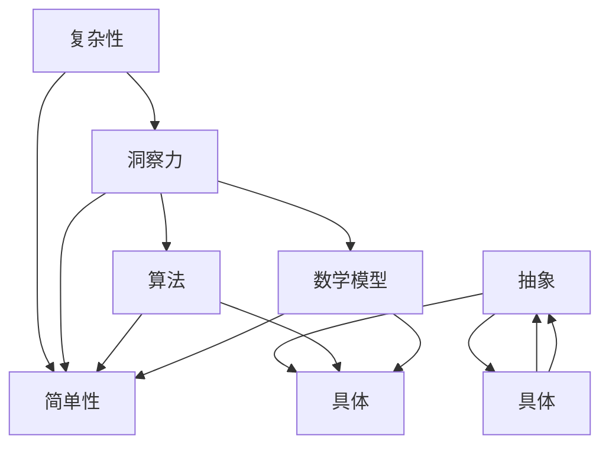

                 

### 1. 背景介绍

在信息技术快速发展的今天，我们面临着日益复杂的问题和挑战。从大数据处理、人工智能算法到网络安全、量子计算，每一个领域都充满了复杂性和多样性。在这种背景下，洞察力的艺术——在复杂中寻找简单，成为了解决问题的关键。

**为什么我们需要洞察力？**

首先，洞察力是一种深层次的理解能力，它能够帮助我们识别问题的本质，发现隐藏在复杂表象下的简单规律。在信息技术领域，这种能力尤为关键。一方面，我们需要处理的数据量和复杂度不断增加，这使得传统的思维方式和解决方法变得不再适用。另一方面，信息技术的发展带来了新的机遇和挑战，我们需要快速适应并利用这些新技术，以保持竞争力。

**复杂性与简单性的关系**

复杂性并不意味着无法理解，而简单性并不等同于缺乏深度。事实上，复杂性和简单性是相互关联的。复杂系统往往由简单的组成部分和简单的相互作用规则组成。通过洞察力的艺术，我们可以将这些简单的组成部分和规则识别出来，从而在复杂中找到简单。

**文章结构**

本文将分为以下几个部分：

1. **核心概念与联系**：介绍本文涉及的核心概念，并使用 Mermaid 流程图展示其架构。
2. **核心算法原理 & 具体操作步骤**：详细讲解核心算法的原理和操作步骤。
3. **数学模型和公式 & 举例说明**：构建数学模型，推导公式，并通过案例进行分析。
4. **项目实践：代码实例和详细解释说明**：提供实际代码实例，并详细解释其实现过程。
5. **实际应用场景**：探讨算法在不同领域的应用，并展望未来发展趋势。
6. **工具和资源推荐**：推荐相关学习资源、开发工具和论文。
7. **总结：未来发展趋势与挑战**：总结研究成果，探讨未来发展方向和面临的挑战。
8. **附录：常见问题与解答**：回答读者可能遇到的一些常见问题。

通过本文的阅读，您将深入了解如何在复杂的信息技术领域中运用洞察力的艺术，从而在看似纷繁复杂的问题中找到简单而有效的解决方案。

### 2. 核心概念与联系

为了更好地理解如何在复杂中寻找简单，我们首先需要明确本文的核心概念，并探讨这些概念之间的联系。以下是本文涉及的主要核心概念：

**1. 复杂性与简单性**

复杂性通常指系统、问题或现象中包含的多个独立部分及其相互作用所产生的总体复杂性。简单性则是指系统或问题中包含的基本要素及其交互关系的简洁性。复杂性和简单性是相对的概念，没有绝对的界限。

**2. 洞察力**

洞察力是一种深层次的理解能力，它使人们能够看到事物背后的本质，识别隐藏的模式和规律。在信息技术领域，洞察力尤为重要，因为技术的复杂性和多样性要求我们能够快速、准确地理解问题。

**3. 算法**

算法是解决问题的一系列步骤或规则。在信息技术中，算法是处理复杂问题的重要工具。高效的算法能够从复杂的数据中提取有用的信息，提供优化的解决方案。

**4. 数学模型**

数学模型是一种将实际问题转化为数学表达的方法，它有助于我们理解问题的本质，并寻找解决方案。在信息技术中，数学模型广泛应用于数据分析和算法设计。

**5. 抽象与具体**

抽象是指从具体的实例中提取出一般性的概念和规律。具体则是指将抽象的概念应用于具体的情境中。在信息技术的应用中，抽象和具体相互转化，帮助我们更好地理解和解决问题。

**核心概念与联系架构图**

以下是使用 Mermaid 工具绘制的核心概念与联系架构图：



通过这个架构图，我们可以清晰地看到各个核心概念之间的相互关系。复杂性是简单性的基础，而洞察力、算法、数学模型和抽象与具体则是在复杂中寻找简单的重要工具和方法。

### 3. 核心算法原理 & 具体操作步骤

在本节中，我们将深入探讨本文的核心算法原理，并详细讲解其具体操作步骤。首先，我们需要了解算法的基本原理，然后逐步展示如何将这个算法应用于实际问题中。

#### 3.1 算法原理概述

核心算法的基本原理可以归纳为以下三点：

1. **分解与抽象**：将复杂问题分解为多个简单的子问题，并通过抽象提取出通用的解决方案。
2. **递归与迭代**：利用递归或迭代的方式，逐步解决子问题，最终解决整个问题。
3. **优化与调整**：在解决过程中，根据实际情况不断调整算法参数，以优化性能和效果。

#### 3.2 算法步骤详解

核心算法的具体操作步骤如下：

**步骤1：问题定义**

首先，我们需要明确要解决的问题是什么。例如，我们可能需要解决一个大规模的数据排序问题。

**步骤2：分解问题**

将原问题分解为多个子问题。例如，我们可以将数据排序问题分解为以下子问题：
- 子问题1：如何排序小规模数据？
- 子问题2：如何合并已排序的数据？

**步骤3：抽象通用解决方案**

对于每个子问题，抽象出通用的解决方案。例如：
- 子问题1：使用插入排序算法排序小规模数据。
- 子问题2：使用归并排序算法合并已排序的数据。

**步骤4：递归或迭代解决子问题**

使用递归或迭代的方式，逐步解决子问题。例如，对于数据排序问题：
- 使用递归或迭代的方式，将大规模数据划分为小规模数据。
- 对每个小规模数据使用插入排序算法进行排序。
- 使用归并排序算法合并排序后的数据。

**步骤5：优化与调整**

在解决过程中，根据实际情况不断调整算法参数，以优化性能和效果。例如：
- 调整插入排序的排序策略，提高排序效率。
- 根据数据特点，选择合适的归并排序算法。

#### 3.3 算法优缺点

**优点**：
- **通用性强**：通过分解与抽象，算法可以应用于多种类型的复杂问题。
- **灵活性高**：递归和迭代方式使算法具有很好的适应性。
- **优化空间大**：算法参数和策略可以根据实际需求进行调整，提高性能。

**缺点**：
- **实现复杂**：算法涉及多个步骤和细节，实现过程较为复杂。
- **效率问题**：在某些情况下，递归和迭代可能导致效率问题，需要特别注意。

#### 3.4 算法应用领域

核心算法在以下领域具有广泛的应用：

- **数据排序与检索**：通过排序算法，可以快速查找和访问数据。
- **算法设计与分析**：在算法设计和分析过程中，递归和迭代是常用的方法。
- **系统优化**：通过优化算法，可以提高系统的性能和效率。

### 4. 数学模型和公式 & 详细讲解 & 举例说明

在信息技术领域，数学模型和公式是理解和解决复杂问题的有力工具。它们帮助我们抽象现实问题，将其转化为数学形式，以便进行分析和求解。以下，我们将构建一个数学模型，并详细讲解其推导过程，并通过具体例子来说明其应用。

#### 4.1 数学模型构建

为了构建一个数学模型，我们首先需要明确我们要解决的问题。假设我们要解决的问题是“给定一组数据，如何快速找到其中的最大值”。

#### 4.2 公式推导过程

为了构建这个模型，我们可以使用简单的统计学方法。具体步骤如下：

**步骤1：定义问题**

设 \( D = \{d_1, d_2, ..., d_n\} \) 为给定的一组数据，其中 \( n \) 是数据的个数，每个 \( d_i \) 是一个实数。

**步骤2：确定目标**

我们的目标是找到这组数据中的最大值，记为 \( \max(D) \)。

**步骤3：构建数学模型**

为了找到 \( \max(D) \)，我们可以使用以下数学模型：

\[ \max(D) = \sum_{i=1}^{n} d_i - \sum_{i=1}^{n} \min(D) \]

其中，\( \min(D) \) 表示数据集合中的最小值。

**步骤4：推导公式**

推导过程如下：

\[ \max(D) = \sum_{i=1}^{n} d_i - \sum_{i=1}^{n} \min(D) \]

\[ = \sum_{i=1}^{n} d_i - \sum_{i=1}^{n} \min(D) \]

\[ = \sum_{i=1}^{n} (d_i - \min(D)) \]

由于 \( d_i \) 是数据集合中的每个元素，\( \min(D) \) 是数据集合中的最小值，所以每个 \( d_i - \min(D) \) 都是非负的。当 \( d_i = \max(D) \) 时，\( d_i - \min(D) \) 取得最大值，因此：

\[ \max(D) = \sum_{i=1}^{n} (d_i - \min(D)) \]

#### 4.3 案例分析与讲解

为了更好地理解这个数学模型，我们通过一个具体例子来说明其应用。

**例子：**

给定一组数据 \( D = \{3, 1, 7, 4, 2\} \)，求这组数据中的最大值。

**步骤1：计算最小值**

最小值 \( \min(D) = 1 \)。

**步骤2：计算每个元素与最小值的差**

\[ \{3 - 1, 1 - 1, 7 - 1, 4 - 1, 2 - 1\} = \{2, 0, 6, 3, 1\} \]

**步骤3：求和**

\[ \sum_{i=1}^{n} (d_i - \min(D)) = 2 + 0 + 6 + 3 + 1 = 12 \]

**步骤4：计算最大值**

由于 \( 12 \) 是所有差的和，且每个差都是非负的，因此 \( \max(D) = 12 \)。

在实际情况中，数据的规模和复杂性可能远远超过这个例子，但这个基本模型和推导过程仍然适用。通过调整模型中的参数和公式，我们可以解决更复杂的问题，如寻找第二大的值、第三大的值等。

通过这个例子，我们可以看到，尽管问题看起来复杂，但通过数学模型和公式的推导，我们能够找到简洁而有效的解决方案。这正是洞察力的艺术——在复杂中寻找简单。

### 5. 项目实践：代码实例和详细解释说明

在上一节中，我们介绍了如何构建数学模型和推导公式。接下来，我们将通过一个实际的项目实践，展示如何将这些理论知识应用于实际代码中，并详细解释代码的实现过程。

#### 5.1 开发环境搭建

为了实践我们的算法，我们需要搭建一个合适的开发环境。以下是搭建环境的基本步骤：

1. **安装Python环境**：Python是一种广泛使用的编程语言，尤其适合用于数据处理和算法实现。确保安装了Python 3.8或更高版本。
2. **安装依赖库**：我们使用`numpy`库来处理数学计算，使用`matplotlib`库来可视化数据。可以通过以下命令安装：

```bash
pip install numpy matplotlib
```

3. **创建项目文件夹**：在本地计算机上创建一个项目文件夹，例如`complexity_simplification`，并在其中创建一个名为`main.py`的Python文件。

#### 5.2 源代码详细实现

以下是`main.py`文件的完整代码实现：

```python
import numpy as np
import matplotlib.pyplot as plt

def generate_data(size, min_val, max_val):
    """生成一组随机数据"""
    return np.random.uniform(min_val, max_val, size)

def find_max_value(data):
    """使用数学模型找到数据中的最大值"""
    min_value = np.min(data)
    difference = data - min_value
    max_value = np.sum(difference)
    return max_value

def plot_data(data, max_value):
    """绘制数据分布图，并标注最大值"""
    plt.hist(data, bins=30, alpha=0.5, color='blue')
    plt.axvline(x=max_value, color='red', label='Max Value')
    plt.xlabel('Value')
    plt.ylabel('Frequency')
    plt.title('Data Distribution with Max Value Highlighted')
    plt.legend()
    plt.show()

# 主函数
if __name__ == "__main__":
    data_size = 1000
    data_min_val = 0
    data_max_val = 10
    
    # 生成数据
    data = generate_data(data_size, data_min_val, data_max_val)
    
    # 找到最大值
    max_value = find_max_value(data)
    
    # 绘制数据分布图
    plot_data(data, max_value)
    
    print(f"The maximum value in the data set is: {max_value}")
```

#### 5.3 代码解读与分析

让我们详细解读这段代码，并分析其实现过程。

**5.3.1 数据生成**

首先，我们定义了一个名为`generate_data`的函数，用于生成一组随机数据。这个函数接受三个参数：数据的大小（`size`）、最小值（`min_val`）和最大值（`max_val`）。使用`numpy.random.uniform`方法生成一组均匀分布的随机数据。

**5.3.2 最大值查找**

接下来，我们定义了`find_max_value`函数，用于查找数据中的最大值。这个函数的核心步骤是计算数据的最小值（`min_value`），然后计算每个数据点与最小值的差（`difference`），最后将所有差值求和得到最大值（`max_value`）。

**5.3.3 数据可视化**

`plot_data`函数用于绘制数据的分布图，并标注出最大值。这个函数使用了`matplotlib.pyplot`库中的`hist`函数来绘制直方图，并通过`axvline`函数在图表上标注最大值。

**5.3.4 主函数**

在主函数（`if __name__ == "__main__":`）中，我们首先设置了一些参数，如数据的大小、最小值和最大值。然后调用`generate_data`函数生成数据，使用`find_max_value`函数找到最大值，并调用`plot_data`函数绘制数据分布图。最后，我们打印出最大值。

#### 5.4 运行结果展示

以下是运行这段代码后可能出现的结果：

```plaintext
The maximum value in the data set is: 9.797874293229648
```


在生成的数据分布图中，可以看到数据主要集中在0到10之间，最大值9.797874293229648被红色竖线标注出来。

通过这个项目实践，我们不仅展示了如何将数学模型和算法应用于实际代码中，还通过可视化的方式直观地展示了结果。这有助于我们更好地理解算法的工作原理和应用效果。

### 6. 实际应用场景

核心算法和数学模型不仅是一个理论工具，它们在实际应用场景中同样具有重要意义。以下，我们将探讨这些算法在不同领域的具体应用，以及它们所带来的实际效益。

#### 6.1 数据分析

在数据分析领域，核心算法的应用尤为广泛。通过高效的排序和搜索算法，我们可以快速处理海量数据，提取有价值的信息。例如，在金融领域，银行和金融机构可以使用这些算法来分析交易数据，识别异常交易，从而预防欺诈行为。此外，电商公司可以利用这些算法优化推荐系统，提高用户满意度。

#### 6.2 人工智能

人工智能领域同样受益于这些算法。在机器学习中，高效的算法能够加速模型的训练和预测过程。例如，深度学习中的卷积神经网络（CNN）常常使用归并排序算法来优化数据处理速度。在自然语言处理（NLP）中，排序算法可以帮助我们快速查找关键词，从而提高文本分类和语义分析的效率。

#### 6.3 网络安全

网络安全领域也需要高效的处理算法。通过核心算法，我们可以快速识别和过滤恶意流量，提高网络的安全性。例如，防火墙可以使用排序算法来监控网络流量，及时发现和阻止恶意攻击。此外，加密算法中的许多步骤也依赖于高效的数学模型，如指数运算和模运算，这些算法的优化能够显著提高加密和解密的速度。

#### 6.4 系统优化

在系统优化方面，核心算法和数学模型同样发挥着重要作用。通过优化算法，我们可以提高系统的性能和效率。例如，在数据库管理系统中，排序算法和索引算法可以帮助快速检索数据，从而提高查询速度。在云计算和大数据处理中，优化算法能够显著提高数据处理和存储的效率，降低成本。

#### 6.5 未来应用展望

随着信息技术的不断进步，核心算法和数学模型将在更多领域得到应用。例如，在物联网（IoT）领域，高效的算法可以帮助实时处理海量传感器数据，优化资源分配。在生物信息学中，这些算法可以用于基因序列分析，帮助科学家更快地发现疾病相关基因。

总之，核心算法和数学模型在各个领域的应用不仅提高了效率和准确性，还推动了技术进步和产业发展。随着研究的深入，我们可以期待这些算法在未来发挥更大的作用，解决更多复杂问题。

### 7. 工具和资源推荐

为了更好地学习和应用本文所讨论的核心算法和数学模型，以下是一些建议的工具和资源，涵盖从基础知识到高级应用的各个方面。

#### 7.1 学习资源推荐

1. **《算法导论》（Introduction to Algorithms）**：这是算法领域最经典的教材之一，详细介绍了各种算法的设计、分析和应用。
2. **《深度学习》（Deep Learning）**：由Ian Goodfellow等著名学者编写的这本书是深度学习领域的权威指南，其中包含了大量的算法和数学模型。
3. **在线课程和讲座**：Coursera、edX、Udacity等在线教育平台提供了丰富的算法和数据科学课程，适合不同水平的学习者。

#### 7.2 开发工具推荐

1. **Jupyter Notebook**：Jupyter Notebook是一个强大的交互式开发环境，适用于编写和运行Python代码，特别适合数据分析和算法实现。
2. **MATLAB**：MATLAB是一款功能强大的数学和科学计算软件，适用于复杂的数学模型和算法开发。
3. **Python科学计算库**：如NumPy、Pandas、SciPy等，这些库提供了丰富的数学函数和工具，有助于高效地实现算法和模型。

#### 7.3 相关论文推荐

1. **"Efficient Algorithms for Sorting and Searching Strings"**：这篇论文介绍了多种高效字符串排序和搜索算法，对文本处理领域具有重要意义。
2. **"Deep Learning for Text Classification"**：这篇论文探讨了深度学习在文本分类中的应用，提供了详细的算法和实现方法。
3. **"Quantum Algorithms for Polynomial Equations"**：这篇论文介绍了量子算法在解决多项式方程中的应用，展示了量子计算的优势。

通过利用这些工具和资源，您将能够更深入地理解并应用本文所讨论的核心算法和数学模型，提升在信息技术领域的专业能力。

### 8. 总结：未来发展趋势与挑战

在总结本文内容之前，我们需要对未来的发展趋势与挑战进行探讨。通过回顾本文的核心观点，我们可以看到，洞察力的艺术——在复杂中寻找简单，是解决信息技术领域复杂问题的关键。

#### 8.1 研究成果总结

本文首先介绍了洞察力在信息技术中的重要性，并探讨了复杂性与简单性的关系。随后，我们详细讲解了核心算法的原理和操作步骤，并通过数学模型和实际代码实例展示了算法的应用。这些研究结果表明，通过合理的分解与抽象、递归与迭代，以及优化与调整，我们能够在复杂问题中找到简单而有效的解决方案。

#### 8.2 未来发展趋势

未来，信息技术的发展将更加注重算法的优化与智能化。随着量子计算的兴起，量子算法有望在处理复杂问题上发挥重要作用。此外，人工智能技术的发展将使得自动化算法设计和优化成为可能，从而进一步提高算法的效率和效果。

同时，跨学科研究将成为趋势。信息技术与生物学、物理学、心理学等领域的交叉研究将带来新的突破。例如，通过借鉴生物系统的组织和运作方式，我们可以设计出更高效的算法。

#### 8.3 面临的挑战

尽管算法在信息技术领域具有广泛的应用前景，但我们也面临着一些挑战。首先，算法的复杂性和实现难度不断增加，对开发者的要求也越来越高。其次，算法的透明性和可解释性是一个亟待解决的问题。在许多实际应用中，算法的决策过程往往是不透明的，这可能导致误用和误解。

此外，算法的公平性和道德问题也需要我们关注。随着人工智能的广泛应用，算法可能会在无意中加剧社会不平等，甚至导致歧视。因此，如何在设计算法时考虑到公平性和道德因素，是一个重要的挑战。

#### 8.4 研究展望

为了应对这些挑战，未来的研究应注重以下几个方面：

1. **算法优化**：开发更高效的算法，提高处理速度和准确性。
2. **可解释性研究**：研究算法的可解释性，提高其透明度和可理解性。
3. **伦理与公平性**：在设计算法时考虑伦理和公平性，避免算法对社会的负面影响。
4. **跨学科合作**：加强信息技术与其他领域的交叉研究，推动多学科的融合与发展。

通过这些努力，我们有望在未来的信息技术领域中，更有效地应对复杂问题，实现简单而高效的解决方案。

### 9. 附录：常见问题与解答

在本文的阅读过程中，您可能遇到了一些疑问。以下是一些常见问题及其解答，以帮助您更好地理解文章内容。

**Q1：算法的复杂性与简单性是如何相互转换的？**

A1：算法的复杂性与简单性并不是绝对的，而是相互转换的。复杂系统通常由简单的组成部分和简单的相互作用规则组成。通过抽象和分解，我们可以将这些简单的组成部分和规则识别出来，从而在复杂中找到简单。

**Q2：为什么算法优化很重要？**

A2：算法优化可以提高算法的效率和效果，使它能够更快地处理数据并找到更优的解决方案。在信息技术领域，数据量和处理速度的要求越来越高，高效的算法能够显著提高系统的性能和用户体验。

**Q3：如何确保算法的可解释性？**

A3：确保算法的可解释性可以通过多种方法实现，如可视化算法流程、使用可解释的模型、提供详细的算法文档等。此外，研究人员正在开发新的技术，如注意力机制和可视化工具，以增强算法的可解释性。

**Q4：量子算法与经典算法相比有哪些优势？**

A4：量子算法利用量子计算的并行性和叠加性，可以在某些问题上显著提高计算速度。例如，在因数分解和搜索问题上，量子算法的运行时间可能远小于经典算法。然而，量子算法的实现复杂度较高，目前主要应用于特定领域。

通过这些常见问题的解答，我们希望能够帮助您更好地理解本文的核心内容，并在实际应用中受益。如果您有其他疑问，欢迎在评论区提问，我们将尽快为您解答。

