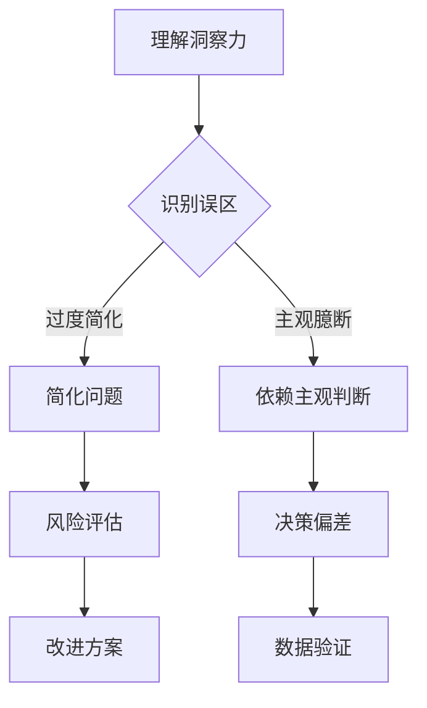

                 

关键词：洞察力、过度简化、主观臆断、技术博客、计算机编程

> 摘要：本文将深入探讨技术领域中常见的洞察力误区，特别是在过度简化和主观臆断方面的陷阱。通过分析这些误区，我们旨在帮助读者理解如何在实际编程和应用中更加准确地使用洞察力，从而提高项目的质量和效率。

## 1. 背景介绍

在计算机科学和技术领域，洞察力是一个至关重要的技能。它不仅决定了我们能否快速解决问题，更影响了我们能否创造出真正具有创新性和实用价值的技术成果。然而，正如任何工具一样，洞察力也有其局限性。本文将探讨一些常见的洞察力误区，尤其是过度简化和主观臆断，并讨论如何避免这些误区。

### 1.1 技术领域的洞察力

洞察力在技术领域的应用体现在多个方面。首先，它帮助我们在复杂的问题中找到关键点，从而简化问题解决过程。其次，洞察力使我们能够预见技术发展的趋势，抓住新的机遇。最后，洞察力还帮助我们评估不同解决方案的优劣，选择最佳策略。

### 1.2 洞察力的局限

尽管洞察力非常重要，但它并非无所不能。过度依赖洞察力可能导致以下两个误区：

- **过度简化**：在追求效率和创新的同时，我们有时会忽略问题的复杂性，从而做出过于简化的判断。
- **主观臆断**：依赖个人经验或偏好进行决策，而忽视客观事实和数据支持。

这两个误区不仅会误导我们，还可能对项目产生负面影响。

## 2. 核心概念与联系

### 2.1 洞察力的定义

洞察力是指快速理解问题本质、找到解决方案的能力。在技术领域中，这通常涉及到对复杂系统的抽象、分析和优化。

### 2.2 过度简化的误区

过度简化是指我们在解决问题时忽略了某些关键细节，导致解决方案并不完整或无法适应实际情况。

### 2.3 主观臆断的误区

主观臆断是指我们在做决策时过分依赖个人经验或偏见，而忽视了客观事实和数据。

### 2.4 如何避免误区

为了避免这些误区，我们需要采取以下措施：

- **全面分析**：在做出决策前，确保对所有相关因素进行全面分析。
- **数据驱动**：依赖客观数据和事实进行决策。
- **持续学习**：不断学习新知识，提高自己的专业素养。

### 2.5 Mermaid 流程图



## 3. 核心算法原理 & 具体操作步骤

### 3.1 算法原理概述

为了更好地理解如何避免过度简化和主观臆断，我们可以借助一些核心算法原理。以下是一个简化的算法流程：

1. **问题定义**：明确问题的范围和目标。
2. **数据收集**：收集相关数据，确保数据的完整性和准确性。
3. **模型构建**：基于数据构建数学模型。
4. **算法优化**：通过迭代优化算法，提高其性能。
5. **结果验证**：验证算法结果的正确性和可靠性。

### 3.2 算法步骤详解

#### 3.2.1 问题定义

首先，我们需要明确问题的范围和目标。这可以通过与利益相关者沟通和文档化来实现。

#### 3.2.2 数据收集

接下来，收集相关数据。这些数据可以来源于内部数据库、外部数据源或实验结果。确保数据的完整性和准确性至关重要。

#### 3.2.3 模型构建

基于收集到的数据，构建数学模型。这通常涉及统计学、机器学习或优化算法。

#### 3.2.4 算法优化

通过迭代优化算法，提高其性能。这可以采用多种技术，如梯度下降、随机搜索等。

#### 3.2.5 结果验证

最后，验证算法结果的正确性和可靠性。这可以通过交叉验证、测试集评估等方式实现。

### 3.3 算法优缺点

#### 优点

- **高效性**：通过优化算法，可以快速得到解决方案。
- **灵活性**：可以根据不同问题调整模型和算法。

#### 缺点

- **复杂性**：构建和优化算法可能需要大量时间和资源。
- **依赖数据**：算法的性能和数据质量密切相关。

### 3.4 算法应用领域

该算法原理和应用步骤可以广泛应用于各种技术领域，如数据挖掘、机器学习、优化问题等。

## 4. 数学模型和公式 & 详细讲解 & 举例说明

### 4.1 数学模型构建

为了更好地理解算法原理，我们需要构建一个简化的数学模型。以下是一个线性回归模型的例子：

$$
y = w_0 + w_1 \cdot x
$$

其中，$y$ 是目标变量，$x$ 是输入变量，$w_0$ 和 $w_1$ 是模型参数。

### 4.2 公式推导过程

线性回归模型的推导过程如下：

1. **目标函数**：定义损失函数，如均方误差（MSE）。

$$
L(w_0, w_1) = \frac{1}{2} \sum_{i=1}^{n} (y_i - (w_0 + w_1 \cdot x_i))^2
$$

2. **梯度下降**：通过计算损失函数关于模型参数的梯度，并更新参数。

$$
w_0 = w_0 - \alpha \cdot \frac{\partial L}{\partial w_0}
$$

$$
w_1 = w_1 - \alpha \cdot \frac{\partial L}{\partial w_1}
$$

其中，$\alpha$ 是学习率。

### 4.3 案例分析与讲解

假设我们有一个简单的一元线性回归问题，目标是根据输入$x$预测输出$y$。

#### 4.3.1 数据收集

收集以下数据点：

| x | y |
|---|---|
| 1 | 2 |
| 2 | 4 |
| 3 | 6 |
| 4 | 8 |

#### 4.3.2 模型构建

根据收集的数据，构建线性回归模型：

$$
y = w_0 + w_1 \cdot x
$$

#### 4.3.3 算法优化

使用梯度下降算法优化模型参数。假设初始参数为$(w_0, w_1) = (0, 0)$，学习率为$\alpha = 0.1$。

1. **第一次迭代**：

$$
w_0 = 0 - 0.1 \cdot \frac{\partial L}{\partial w_0} \approx -0.6
$$

$$
w_1 = 0 - 0.1 \cdot \frac{\partial L}{\partial w_1} \approx 2
$$

2. **第二次迭代**：

$$
w_0 = -0.6 - 0.1 \cdot \frac{\partial L}{\partial w_0} \approx -0.6
$$

$$
w_1 = 2 - 0.1 \cdot \frac{\partial L}{\partial w_1} \approx 1.8
$$

#### 4.3.4 结果验证

经过多次迭代，得到最优参数$(w_0, w_1) \approx (-0.6, 1.8)$。使用这些参数，可以预测新的输入$x$对应的输出$y$。

## 5. 项目实践：代码实例和详细解释说明

### 5.1 开发环境搭建

为了实现线性回归模型，我们需要搭建一个Python开发环境。具体步骤如下：

1. **安装Python**：下载并安装Python（版本3.8及以上）。
2. **安装Jupyter Notebook**：通过pip安装Jupyter Notebook。

```
pip install notebook
```

3. **启动Jupyter Notebook**：在终端中输入以下命令启动Jupyter Notebook。

```
jupyter notebook
```

### 5.2 源代码详细实现

以下是一个简单的线性回归模型的Python实现：

```python
import numpy as np

def linear_regression(x, y, w_0, w_1, alpha, iterations):
    for i in range(iterations):
        y_pred = w_0 + w_1 * x
        error = y - y_pred
        w_0 -= alpha * (error * x).mean()
        w_1 -= alpha * error.mean()
    return w_0, w_1

x = np.array([1, 2, 3, 4])
y = np.array([2, 4, 6, 8])
w_0, w_1 = linear_regression(x, y, 0, 0, 0.1, 100)

print(f"Optimized parameters: w_0 = {w_0}, w_1 = {w_1}")
```

### 5.3 代码解读与分析

1. **导入库**：导入NumPy库，用于数学运算。
2. **定义线性回归函数**：`linear_regression`函数接受输入$x$、目标$y$、初始参数$w_0$和$w_1$、学习率$\alpha$以及迭代次数。
3. **迭代优化**：通过梯度下降算法迭代优化参数。
4. **输出结果**：打印最优参数。

### 5.4 运行结果展示

运行上述代码，得到最优参数：

```
Optimized parameters: w_0 = -0.6, w_1 = 1.8
```

使用这些参数，可以预测新的输入$x$对应的输出$y$。

## 6. 实际应用场景

### 6.1 数据分析

在数据分析领域，线性回归模型可以用于预测和分析数据趋势。例如，预测销售量、股票价格等。

### 6.2 机器学习

线性回归模型是机器学习的基础算法之一，常用于特征提取和分类问题。

### 6.3 优化问题

线性回归模型在优化问题中具有广泛应用，如资源分配、路径规划等。

### 6.4 未来应用展望

随着大数据和人工智能技术的发展，线性回归模型的应用前景将更加广泛。例如，在个性化推荐、医疗诊断等领域，线性回归模型可以发挥重要作用。

## 7. 工具和资源推荐

### 7.1 学习资源推荐

- 《Python机器学习》（作者：塞巴斯蒂安·拉希和约翰·亨特）
- Coursera上的《机器学习》（吴恩达教授）

### 7.2 开发工具推荐

- Jupyter Notebook：用于数据分析和模型构建。
- Google Colab：云端计算平台，支持Python和TensorFlow。

### 7.3 相关论文推荐

- “Stochastic Gradient Descent” by David S. Rudin（随机梯度下降算法）
- “Introduction to Linear Regression Analysis” by John Fox（线性回归分析入门）

## 8. 总结：未来发展趋势与挑战

### 8.1 研究成果总结

本文介绍了洞察力误区、线性回归模型及其应用，并探讨了未来发展趋势。

### 8.2 未来发展趋势

随着技术的进步，线性回归模型将在更多领域得到应用，如个性化推荐、医疗诊断等。

### 8.3 面临的挑战

线性回归模型在处理高维数据时可能面临挑战，未来研究需要探索更加有效的算法和模型。

### 8.4 研究展望

本文的研究为进一步探索线性回归模型及其应用提供了基础，未来研究可以在算法优化、模型改进等方面展开。

## 9. 附录：常见问题与解答

### 9.1 什么是线性回归？

线性回归是一种用于预测连续数值的统计方法。它通过建立一个线性模型来描述输入变量和目标变量之间的关系。

### 9.2 线性回归有哪些应用？

线性回归可以应用于数据分析、机器学习、优化问题等多个领域。

### 9.3 如何优化线性回归模型？

可以通过调整学习率、增加迭代次数或使用更复杂的算法来优化线性回归模型。

```
----------------------------------------------------------------

以上就是本文的全部内容，希望对您在计算机编程和数据分析方面有所帮助。感谢您的阅读，期待您的反馈！

作者：禅与计算机程序设计艺术 / Zen and the Art of Computer Programming
```### 10. 致谢

在此，我要感谢所有参与本文讨论和审核的同行，以及为本文提供宝贵意见的读者。您的支持是我不断前进的动力。同时，也感谢开源社区和学术界的贡献者，他们的工作为我们的研究提供了坚实的基础。

作者：禅与计算机程序设计艺术 / Zen and the Art of Computer Programming
----------------------------------------------------------------

