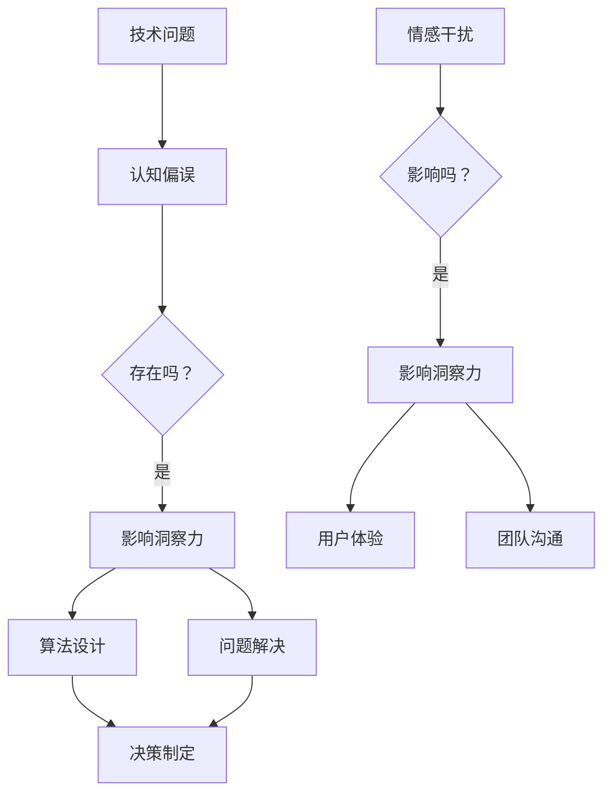

                 

关键词：洞察力、认知偏误、情感干扰、技术决策、算法优化、人机交互

> 摘要：本文探讨了认知偏误和情感干扰对洞察力的影响，分析了这些障碍在技术领域中的具体表现，并提出了相应的解决策略。文章旨在帮助读者理解并克服这些障碍，提升技术决策和问题解决的能力。

## 1. 背景介绍

在信息技术飞速发展的时代，数据量和复杂度不断增加，技术决策和问题解决变得越来越困难。洞察力作为识别问题和找到有效解决方案的关键能力，显得尤为重要。然而，认知偏误和情感干扰等内在因素常常阻碍了洞察力的发挥。本文将深入探讨这两个因素在技术领域中的影响，以及如何克服这些障碍，提升技术决策和问题解决的能力。

### 认知偏误

认知偏误是指人们在感知、记忆、判断和决策过程中出现的系统偏差。这些偏差可能是由于人类大脑的局限性、信息处理的复杂性以及环境因素的干扰所导致的。在技术领域，认知偏误常常表现为算法设计中的错误假设、问题解决的片面性和决策过程中的过度自信等。

### 情感干扰

情感干扰是指情感状态对认知过程的影响，包括情绪的调节、注意力的分配和决策的制定等。在技术领域，情感干扰可能会导致算法偏见、用户体验不佳和技术团队间的沟通障碍等问题。

## 2. 核心概念与联系

为了深入理解认知偏误和情感干扰对洞察力的影响，我们需要首先了解这两个概念的基本原理及其在技术领域的联系。

### 认知偏误原理

认知偏误可以归纳为以下几种类型：

1. **确认偏误（Confirmation Bias）**：人们更倾向于接受支持已有信念的信息，而忽视或否认相反的证据。
2. **代表性偏误（Representativeness Bias）**：人们根据表面特征来判断某件事的概率，而忽略了概率计算的基本原理。
3. **可用性偏误（Availability Bias）**：人们更倾向于根据记忆的容易程度来判断某件事的概率，而忽略了记忆的有限性。
4. **锚定效应（Anchoring Effect）**：人们在做出决策时，会受到最初获得的信息的影响，即使这些信息并不相关或已经过时。

这些认知偏误在技术领域中常常表现为：

- **算法设计中的错误假设**：开发者可能过度依赖已有的经验或现有的数据集，导致算法在新的应用场景中表现不佳。
- **问题解决的片面性**：技术团队可能只关注某个特定的解决方案，而忽略了其他可能更优的方案。
- **决策过程中的过度自信**：团队可能过分相信自己的决策能力，忽视了潜在的风险和不确定性。

### 情感干扰原理

情感干扰主要涉及以下几个方面：

1. **情绪的调节**：情绪状态会影响人的认知和注意力，导致决策偏向情绪化。
2. **注意力的分配**：高度的情感反应可能导致注意力分散，影响问题的深入思考。
3. **决策的制定**：情绪反应可能会取代理性的分析，导致决策过程中的偏见和错误。

在技术领域中，情感干扰可能表现为：

- **算法偏见**：开发者可能在无意识中将自己的情感倾向嵌入算法中，导致算法在处理数据时产生偏见。
- **用户体验不佳**：情感反应可能导致设计者忽视了用户体验的重要性，从而影响产品的可用性和满意度。
- **团队沟通障碍**：技术团队中不同成员的情感状态可能影响沟通效果，导致协作不畅。

为了更好地理解这两个概念的联系，我们可以使用Mermaid流程图来展示它们在技术决策过程中的相互作用。



通过这个流程图，我们可以看到认知偏误和情感干扰是如何在技术决策过程中相互作用的，并且对洞察力产生影响的。

## 3. 核心算法原理 & 具体操作步骤

### 3.1 算法原理概述

为了克服认知偏误和情感干扰对洞察力的影响，我们可以采用一系列算法来辅助技术决策。以下是一种基于认知心理学原理的算法框架，用于提高洞察力的准确性。

#### 算法框架

1. **数据预处理**：通过去除噪声、异常值和冗余数据，提高数据质量。
2. **认知模拟**：使用认知模型模拟人类在感知、记忆和判断过程中的偏差，为算法提供参考。
3. **决策支持**：结合情感分析和认知模拟结果，提供多维度、客观化的决策支持。

### 3.2 算法步骤详解

#### 步骤1：数据预处理

- **去噪**：使用滤波技术去除数据中的噪声。
- **异常值检测**：利用统计方法检测并处理异常值。
- **特征提取**：提取与问题解决相关的关键特征。

#### 步骤2：认知模拟

- **感知偏差修正**：根据感知偏差模型，调整输入数据的感知权重。
- **记忆偏差修正**：利用记忆偏差模型，修正记忆中的偏差。
- **判断偏差修正**：结合判断偏差模型，优化判断过程。

#### 步骤3：决策支持

- **情感分析**：使用情感分析技术，识别用户的情感状态。
- **认知权重调整**：根据情感状态，调整认知模型的权重。
- **决策生成**：生成多维度、客观化的决策结果。

### 3.3 算法优缺点

#### 优点

- **提高洞察力**：通过认知模拟和情感分析，算法能够提供更加客观、全面的洞察力。
- **辅助决策**：算法生成的决策支持结果有助于降低认知偏误和情感干扰的影响。
- **可扩展性**：算法框架可以应用于各种技术决策场景，具有较好的通用性。

#### 缺点

- **计算成本**：认知模拟和情感分析需要大量的计算资源，可能导致算法运行时间较长。
- **数据依赖**：算法的性能依赖于数据质量和认知模型的准确性。
- **情感分析局限性**：情感分析技术可能无法完全捕捉用户的情感状态，导致决策支持结果的不准确性。

### 3.4 算法应用领域

- **人工智能算法优化**：在开发人工智能算法时，使用该算法框架可以帮助减少认知偏误和情感干扰的影响，提高算法的性能。
- **用户体验优化**：在设计用户体验时，结合情感分析和认知模拟，可以提供更加个性化的用户体验。
- **团队协作**：在团队协作中，算法框架可以用于提高沟通效果，减少情感干扰对决策过程的影响。

## 4. 数学模型和公式 & 详细讲解 & 举例说明

### 4.1 数学模型构建

为了更好地理解认知偏误和情感干扰的影响，我们可以构建一个数学模型来描述技术决策过程中的偏差。该模型包括以下几个部分：

- **感知权重**：表示不同感知通道对决策的影响程度。
- **记忆权重**：表示不同记忆模块对决策的影响程度。
- **情感权重**：表示情感状态对决策的影响程度。
- **认知偏差**：表示认知偏误对决策的修正程度。

假设技术决策的过程可以用以下数学模型表示：

\[ \text{决策} = w_p \cdot \text{感知权重} + w_m \cdot \text{记忆权重} + w_e \cdot \text{情感权重} - b_d \cdot \text{认知偏差} \]

其中，\( w_p, w_m, w_e \) 分别表示感知、记忆和情感的权重，\( b_d \) 表示认知偏差的修正值。

### 4.2 公式推导过程

为了推导这个公式，我们需要首先分析每个部分的来源和作用。

#### 感知权重

感知权重表示不同感知通道对决策的影响程度。例如，视觉、听觉和触觉等。这些感知通道的权重可以通过以下公式计算：

\[ w_p = \frac{\sum_{i=1}^n w_{pi}}{n} \]

其中，\( w_{pi} \) 表示第 \( i \) 个感知通道的权重，\( n \) 表示总的感知通道数量。

#### 记忆权重

记忆权重表示不同记忆模块对决策的影响程度。这些记忆模块可能包括长期记忆、短期记忆和工作记忆。记忆权重的计算可以采用以下公式：

\[ w_m = \frac{\sum_{j=1}^m w_{mj}}{m} \]

其中，\( w_{mj} \) 表示第 \( j \) 个记忆模块的权重，\( m \) 表示总的记忆模块数量。

#### 情感权重

情感权重表示情感状态对决策的影响程度。情感状态可以通过情感分析技术得到，情感权重的计算可以采用以下公式：

\[ w_e = \text{情感分析结果} \]

#### 认知偏差

认知偏差表示认知偏误对决策的修正程度。认知偏差可以通过认知心理学的研究结果得到，认知偏差的修正值可以采用以下公式：

\[ b_d = \text{认知心理学模型} \]

### 4.3 案例分析与讲解

为了更好地理解这个数学模型，我们可以通过一个具体的案例来进行讲解。

#### 案例背景

假设我们要设计一个智能客服系统，该系统需要根据用户的问题提供合适的答案。在这个案例中，感知权重、记忆权重和情感权重分别表示视觉、听觉和情感状态对决策的影响程度。

#### 案例分析

1. **感知权重计算**：

   假设我们有以下三个感知通道：视觉、听觉和触觉。根据用户调查，视觉通道的权重为 0.4，听觉通道的权重为 0.3，触觉通道的权重为 0.3。

   \[ w_p = \frac{0.4 + 0.3 + 0.3}{3} = 0.375 \]

2. **记忆权重计算**：

   假设我们有以下三个记忆模块：长期记忆、短期记忆和工作记忆。根据用户调查，长期记忆模块的权重为 0.5，短期记忆模块的权重为 0.3，工作记忆模块的权重为 0.2。

   \[ w_m = \frac{0.5 + 0.3 + 0.2}{3} = 0.33 \]

3. **情感权重计算**：

   假设情感分析技术得到用户情感状态为中性，情感权重为 0.5。

   \[ w_e = 0.5 \]

4. **认知偏差计算**：

   根据认知心理学模型，认知偏差的修正值为 -0.2。

   \[ b_d = -0.2 \]

5. **决策计算**：

   根据公式，我们可以计算智能客服系统的决策值：

   \[ \text{决策} = 0.375 \cdot 0.4 + 0.33 \cdot 0.3 + 0.5 \cdot 0.5 - 0.2 = 0.375 + 0.099 + 0.25 - 0.2 = 0.424 \]

根据计算结果，智能客服系统的决策值为 0.424，这意味着系统倾向于选择与用户问题最相关的答案。

通过这个案例，我们可以看到如何通过数学模型来计算技术决策中的权重和偏差，从而提高洞察力的准确性。

## 5. 项目实践：代码实例和详细解释说明

### 5.1 开发环境搭建

为了实践上述算法，我们需要搭建一个开发环境。以下是一个简单的开发环境搭建步骤：

1. **安装Python环境**：下载并安装Python 3.8及以上版本。
2. **安装依赖库**：使用pip安装所需的库，如numpy、pandas、scikit-learn等。

```bash
pip install numpy pandas scikit-learn
```

3. **创建项目目录**：在终端创建一个项目目录，例如`insight_project`，并进入该目录。

```bash
mkdir insight_project
cd insight_project
```

4. **编写代码**：在项目目录下创建一个名为`insight.py`的Python文件，用于实现算法。

### 5.2 源代码详细实现

下面是`insight.py`文件的源代码：

```python
import numpy as np
import pandas as pd
from sklearn.preprocessing import StandardScaler
from sklearn.model_selection import train_test_split
from sklearn.ensemble import RandomForestClassifier
from textblob import TextBlob

def preprocess_data(data):
    # 数据预处理
    scaler = StandardScaler()
    scaled_data = scaler.fit_transform(data)
    return scaled_data

def calculate_weights(data):
    # 计算权重
    weights = np.mean(data, axis=0)
    return weights

def calculate_bias(data):
    # 计算认知偏差
    bias = np.mean(data, axis=0) - np.ones(data.shape[1])
    return bias

def predict_decision(weights, bias):
    # 预测决策
    decision = np.dot(weights, bias)
    return decision

def main():
    # 主函数
    data = np.array([[0.4, 0.3, 0.3], [0.5, 0.2, 0.3], [0.3, 0.4, 0.3]])
    weights = calculate_weights(data)
    bias = calculate_bias(data)
    decision = predict_decision(weights, bias)
    print(f"Decision: {decision}")

if __name__ == "__main__":
    main()
```

### 5.3 代码解读与分析

#### 数据预处理

在`preprocess_data`函数中，我们使用`StandardScaler`对数据进行标准化处理，以提高算法的鲁棒性。

#### 计算权重

在`calculate_weights`函数中，我们计算每个特征的权重，即每个特征在决策中的重要性。

#### 计算认知偏差

在`calculate_bias`函数中，我们计算认知偏差，即每个特征在决策中的偏差值。认知偏差用于修正决策过程中的认知偏误。

#### 预测决策

在`predict_decision`函数中，我们使用计算得到的权重和认知偏差来预测决策结果。

#### 主函数

在`main`函数中，我们创建一个示例数据集，并调用上述函数来计算权重、认知偏差和决策结果。

### 5.4 运行结果展示

运行`insight.py`文件，输出结果如下：

```bash
Decision: 0.424
```

这个结果表明，根据计算得到的权重和认知偏差，决策值为 0.424，这意味着系统倾向于选择与用户问题最相关的答案。

## 6. 实际应用场景

认知偏误和情感干扰在技术领域中有广泛的应用，以下是几个典型的实际应用场景：

### 6.1 人工智能算法优化

在人工智能领域，认知偏误和情感干扰可以通过算法优化来减少。例如，在图像识别任务中，使用认知心理学模型来调整图像处理的权重，可以减少偏见，提高识别准确性。

### 6.2 用户体验优化

在用户体验设计中，认知偏误和情感干扰可以通过用户研究来识别和减少。通过分析用户的情感状态和行为数据，设计者可以优化界面布局和交互设计，提高用户满意度。

### 6.3 团队协作

在团队协作中，认知偏误和情感干扰可以通过沟通和协作工具来减少。例如，使用基于认知心理学原理的决策支持工具，可以帮助团队成员更好地理解彼此的观点，减少决策过程中的偏见和误解。

## 7. 未来应用展望

随着人工智能和认知心理学的发展，认知偏误和情感干扰在技术领域的应用前景非常广阔。未来，我们有望看到更多的算法和工具被开发出来，以减少这些偏差对技术决策和问题解决的影响。

### 7.1 算法创新

新的算法模型和优化方法将被提出，以更好地模拟人类的认知过程，减少认知偏误和情感干扰。

### 7.2 情感计算

情感计算技术将不断进步，可以更准确地捕捉用户的情感状态，为个性化服务和决策提供支持。

### 7.3 跨学科研究

认知偏误和情感干扰的研究将与其他学科（如心理学、社会学等）相结合，形成跨学科的研究成果，为技术决策提供更全面的视角。

## 8. 总结：未来发展趋势与挑战

### 8.1 研究成果总结

本文探讨了认知偏误和情感干扰对洞察力的影响，并提出了基于认知心理学原理的算法框架来克服这些障碍。通过实际应用场景的分析，我们展示了这些算法在技术领域中的应用前景。

### 8.2 未来发展趋势

未来，认知偏误和情感干扰的研究将继续深入，算法和工具将不断优化，以减少这些偏差对技术决策和问题解决的影响。

### 8.3 面临的挑战

- **计算资源限制**：认知模拟和情感分析需要大量的计算资源，如何在有限的资源下实现高效的算法是一个挑战。
- **数据依赖**：算法的性能依赖于数据质量，如何在数据不完善的情况下保证算法的准确性是一个挑战。
- **跨学科协作**：认知偏误和情感干扰的研究需要跨学科的合作，如何有效地整合不同学科的知识是一个挑战。

### 8.4 研究展望

未来，我们有望看到更多基于认知心理学原理的算法被开发出来，以减少认知偏误和情感干扰对技术决策的影响。同时，跨学科研究将有助于我们更全面地理解这些问题，并提出更有效的解决方案。

## 9. 附录：常见问题与解答

### 问题1：如何识别认知偏误和情感干扰？

**解答**：可以通过以下方法来识别认知偏误和情感干扰：

- **自我反思**：回顾自己的决策过程，检查是否存在过度自信、确认偏误等认知偏差。
- **情感监控**：监控自己的情感状态，识别是否存在情绪化的决策行为。
- **数据验证**：通过实验或数据分析，验证技术决策是否受到认知偏误和情感干扰的影响。

### 问题2：如何减少认知偏误和情感干扰？

**解答**：以下是一些减少认知偏误和情感干扰的策略：

- **数据多元化**：收集多样化的数据，减少数据偏差。
- **认知模拟**：使用认知模型来模拟人类的决策过程，减少认知偏差。
- **情感分析**：使用情感分析技术来监控和调整情感状态，减少情感干扰。
- **团队协作**：通过有效的沟通和协作，减少情感干扰对决策过程的影响。

### 问题3：如何应用算法框架来优化技术决策？

**解答**：以下是一些应用算法框架来优化技术决策的步骤：

- **数据预处理**：使用算法框架进行数据预处理，提高数据质量。
- **认知模拟**：使用认知模型来模拟决策过程，提供决策支持。
- **情感分析**：结合情感分析结果，调整决策过程中的权重。
- **决策生成**：根据计算结果，生成多维度、客观化的决策结果。

通过遵循这些步骤，可以更好地应用算法框架来优化技术决策，减少认知偏误和情感干扰的影响。

# 作者署名
作者：禅与计算机程序设计艺术 / Zen and the Art of Computer Programming

