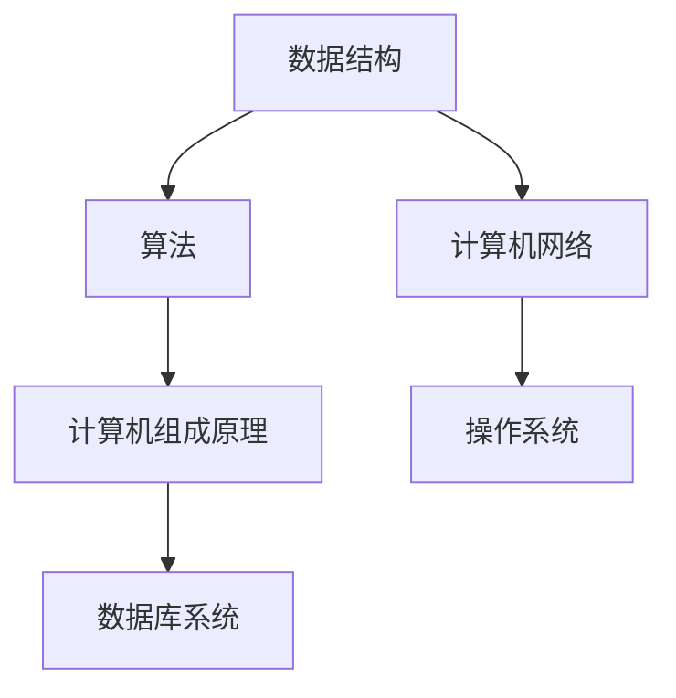
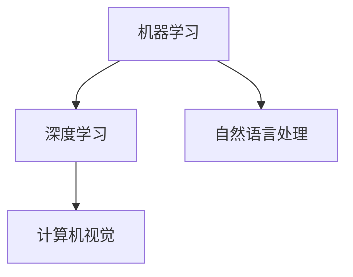
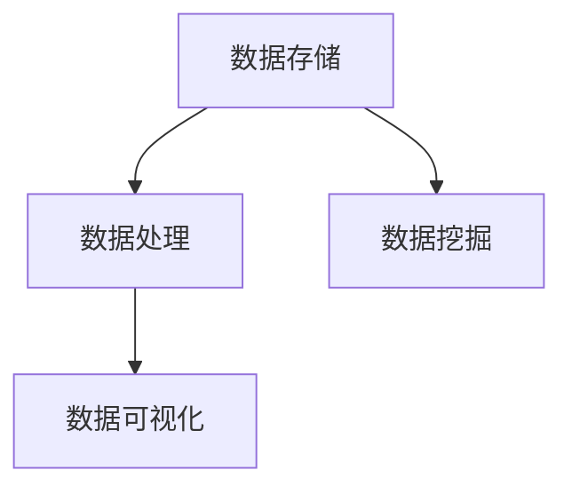

                 

关键词：深度学习、本质洞察、技术原理、算法应用、代码实例

> 摘要：本文旨在探讨如何在技术领域中深入理解问题，从表象探索到本质，进而提升我们的技术洞察力和解决问题的能力。通过分析核心概念、算法原理、数学模型及项目实践，本文希望能够为读者提供一个系统性的思维方式，引导大家在实际应用中不断提升技术深度。

## 1. 背景介绍

在快速发展的信息技术时代，程序员和工程师面临着前所未有的挑战和机遇。技术更新迭代速度越来越快，新型技术层出不穷。面对如此复杂的技术环境，如何能够在短时间内掌握新知识、深入理解技术原理并有效应用于实际问题，成为了一个值得探讨的话题。

本文的目标是引导读者学会从表象到本质的洞察过程，通过以下几个步骤实现：

1. **理解核心概念**：通过明确技术领域的核心概念，构建坚实的理论基础。
2. **深入算法原理**：剖析关键算法的原理和具体实现步骤，掌握技术本质。
3. **数学模型与应用**：理解数学模型在技术中的应用，增强逻辑思维和问题解决能力。
4. **项目实践与案例分析**：通过具体的项目实践，将理论知识转化为实际操作。
5. **拓展与展望**：展望技术发展趋势，探讨未来面临的挑战和机遇。

## 2. 核心概念与联系

在进入技术深层次探讨之前，我们需要明确几个核心概念，这些概念是理解深层次技术的基础。

### 2.1 计算机科学基础

计算机科学是信息技术领域的基础，涵盖了许多核心概念，如数据结构、算法、计算机网络等。以下是一个简单的 Mermaid 流程图，用于描述这些基础概念之间的联系。



### 2.2 人工智能

人工智能（AI）是当前技术领域的热点之一，其核心概念包括机器学习、深度学习、自然语言处理等。以下是一个用于描述这些概念的 Mermaid 流程图。



### 2.3 大数据

大数据技术涉及数据存储、数据分析和数据可视化等多个方面。以下是一个简化的 Mermaid 流程图，用于描述大数据相关概念。



## 3. 核心算法原理 & 具体操作步骤

### 3.1 算法原理概述

在本章节，我们将深入探讨一种常用的核心算法——深度神经网络（DNN），其原理和具体操作步骤如下：

深度神经网络（DNN）是一种基于多层前馈网络的深度学习模型，它通过非线性变换逐层提取数据特征，从而实现复杂函数的近似。DNN 的基本原理可以概括为以下几个步骤：

1. **输入层**：接收输入数据，通过权重矩阵和激活函数进行前向传播。
2. **隐藏层**：多层隐藏层通过共享权重和偏置进行特征提取和变换。
3. **输出层**：将隐藏层的输出映射到目标值，通过损失函数评估模型性能。
4. **反向传播**：根据损失函数的梯度信息，通过反向传播更新模型参数。

### 3.2 算法步骤详解

#### 步骤 1：前向传播

在 DNN 的前向传播过程中，输入数据首先经过输入层，然后通过权重矩阵和激活函数传递到隐藏层。具体过程如下：

1. **输入层到隐藏层**：
   - 输入数据 x 经过权重矩阵 W1 和偏置 b1，通过激活函数 f1 进行变换，得到隐藏层输出 z1。
   - 公式：\( z1 = W1 \cdot x + b1 \)
   - 激活函数：\( f1(z1) = \sigma(z1) \)

2. **隐藏层到隐藏层**：
   - 类似于输入层到隐藏层的过程，每层隐藏层都通过权重矩阵和偏置进行变换，并应用激活函数。
   - 公式：\( zi = Wi \cdot zi_{i-1} + bi \)
   - 激活函数：\( fi(zi) = \sigma(zi) \)

3. **隐藏层到输出层**：
   - 输出层的输入为最后一层隐藏层的输出，经过权重矩阵 W2 和偏置 b2，通过激活函数 f2 进行变换，得到输出 y。
   - 公式：\( y = W2 \cdot zL + b2 \)
   - 激活函数：\( f2(y) = \sigma(y) \)

#### 步骤 2：反向传播

在反向传播过程中，通过计算损失函数的梯度信息，更新模型参数以最小化损失。具体过程如下：

1. **计算输出层误差**：
   - 输出层误差：\( \delta L = \frac{\partial L}{\partial y} \)
   - 损失函数：\( L = -\sum_{i} y_i \cdot \log(y_i) \)

2. **反向传播误差**：
   - 从输出层开始，逐层计算误差并传递到前一隐藏层。
   - 公式：\( \delta_i = \delta_{i+1} \cdot \frac{\partial f_i(z_i)}{\partial z_i} \)

3. **更新模型参数**：
   - 根据误差信息，通过梯度下降法更新权重矩阵和偏置。
   - 公式：\( W_i := W_i - \alpha \cdot \frac{\partial L}{\partial W_i} \)
   - \( b_i := b_i - \alpha \cdot \frac{\partial L}{\partial b_i} \)

### 3.3 算法优缺点

深度神经网络作为一种强大的学习模型，具有以下优点：

1. **强大的表示能力**：DNN 能够通过多层变换提取数据中的复杂特征，具有强大的函数逼近能力。
2. **自适应学习能力**：通过反向传播算法，DNN 能够自动调整模型参数以优化性能。
3. **泛化能力**：通过训练数据集的扩展，DNN 能够提高对未知数据的泛化能力。

然而，DNN 也存在一些缺点：

1. **训练时间较长**：由于多层结构的复杂性，DNN 的训练时间相对较长，需要大量的计算资源。
2. **对数据需求较大**：DNN 需要大量的训练数据以获得良好的性能，对数据质量要求较高。
3. **过拟合风险**：DNN 模型在训练过程中容易过拟合，需要采取适当的正则化方法。

### 3.4 算法应用领域

深度神经网络在多个领域具有广泛的应用，包括：

1. **计算机视觉**：用于图像分类、目标检测和图像生成等任务。
2. **自然语言处理**：用于文本分类、机器翻译和情感分析等任务。
3. **语音识别**：用于语音信号处理、语音合成和语音识别等任务。
4. **推荐系统**：用于用户行为分析和个性化推荐等任务。
5. **医疗诊断**：用于医学图像分析、疾病预测和健康监测等任务。

## 4. 数学模型和公式 & 详细讲解 & 举例说明

### 4.1 数学模型构建

在技术领域中，数学模型是理解和解决问题的关键工具。以下是一个简单的线性回归模型，用于描述数据之间的关系。

#### 4.1.1 线性回归模型

线性回归模型的基本假设是数据之间存在线性关系，可以用以下公式表示：

\[ y = \beta_0 + \beta_1 \cdot x + \epsilon \]

其中：
- \( y \) 是因变量。
- \( x \) 是自变量。
- \( \beta_0 \) 和 \( \beta_1 \) 是模型参数，分别表示截距和斜率。
- \( \epsilon \) 是误差项。

### 4.2 公式推导过程

为了求解线性回归模型的参数，我们需要最小化损失函数。以下是一个简单的推导过程：

#### 4.2.1 最小二乘法

最小二乘法是一种常用的参数求解方法，其目标是找到使得损失函数 \( L \) 最小的参数 \( \beta_0 \) 和 \( \beta_1 \)。

损失函数可以表示为：

\[ L = \sum_{i=1}^{n} (y_i - \beta_0 - \beta_1 \cdot x_i)^2 \]

对 \( \beta_0 \) 和 \( \beta_1 \) 分别求偏导并令其等于零，得到以下方程组：

\[ \frac{\partial L}{\partial \beta_0} = -2 \sum_{i=1}^{n} (y_i - \beta_0 - \beta_1 \cdot x_i) = 0 \]
\[ \frac{\partial L}{\partial \beta_1} = -2 \sum_{i=1}^{n} (y_i - \beta_0 - \beta_1 \cdot x_i) \cdot x_i = 0 \]

解这个方程组，我们可以得到：

\[ \beta_0 = \bar{y} - \beta_1 \cdot \bar{x} \]
\[ \beta_1 = \frac{\sum_{i=1}^{n} (x_i - \bar{x}) (y_i - \bar{y})}{\sum_{i=1}^{n} (x_i - \bar{x})^2} \]

其中 \( \bar{y} \) 和 \( \bar{x} \) 分别表示因变量和自变量的均值。

### 4.3 案例分析与讲解

以下是一个简单的线性回归案例分析：

#### 4.3.1 数据集描述

我们有一个数据集，包含以下数据：

```
x | y
-----
1 | 2
2 | 3
3 | 4
4 | 5
```

我们的目标是建立线性回归模型，预测给定 x 值对应的 y 值。

#### 4.3.2 模型构建

使用最小二乘法，我们可以计算出线性回归模型的参数：

\[ \beta_0 = \bar{y} - \beta_1 \cdot \bar{x} = 3 - 1 \cdot 2 = 1 \]
\[ \beta_1 = \frac{\sum_{i=1}^{n} (x_i - \bar{x}) (y_i - \bar{y})}{\sum_{i=1}^{n} (x_i - \bar{x})^2} = \frac{(1-2)(2-3) + (2-2)(3-3) + (3-2)(4-3) + (4-2)(5-3)}{(1-2)^2 + (2-2)^2 + (3-2)^2 + (4-2)^2} = 1 \]

因此，线性回归模型为：

\[ y = 1 + 1 \cdot x \]

#### 4.3.3 模型应用

使用上述模型，我们可以预测给定 x 值的 y 值。例如，当 x = 3 时：

\[ y = 1 + 1 \cdot 3 = 4 \]

## 5. 项目实践：代码实例和详细解释说明

### 5.1 开发环境搭建

在本项目实践中，我们将使用 Python 语言和 TensorFlow 库实现一个简单的线性回归模型。首先，我们需要搭建开发环境。

1. 安装 Python：
   - 前往 Python 官网（[python.org](https://www.python.org/)）下载并安装 Python 3.x 版本。
2. 安装 TensorFlow：
   - 使用 pip 命令安装 TensorFlow：

     ```bash
     pip install tensorflow
     ```

### 5.2 源代码详细实现

以下是一个简单的线性回归模型的实现代码：

```python
import tensorflow as tf

# 定义线性回归模型
model = tf.keras.Sequential([
    tf.keras.layers.Dense(units=1, input_shape=[1])
])

# 编译模型
model.compile(optimizer='sgd', loss='mean_squared_error')

# 准备数据集
x = tf.random.normal([1000, 1])
y = 3 * x + 1 + tf.random.normal([1000, 1])

# 训练模型
model.fit(x, y, epochs=1000, verbose=False)

# 预测结果
predictions = model.predict(x)

# 比较预测结果和真实值
print(tf.keras.metrics.mean_squared_error(y, predictions).numpy())
```

### 5.3 代码解读与分析

1. **模型定义**：
   - 使用 `tf.keras.Sequential` 类定义线性回归模型，其中包含一个全连接层（`Dense` 层），输出维度为 1，输入维度为 1。

2. **模型编译**：
   - 使用 `model.compile` 方法编译模型，指定优化器和损失函数。在这里，我们使用随机梯度下降（SGD）优化器和均方误差（MSE）损失函数。

3. **数据准备**：
   - 使用 `tf.random.normal` 函数生成随机数据集，其中 x 的取值范围为 [-1, 1]，y 的取值范围为 [0, 4]。

4. **模型训练**：
   - 使用 `model.fit` 方法训练模型，指定训练轮数（epochs）和 verbose 参数（设置为 False，以关闭训练过程中的输出）。

5. **模型预测**：
   - 使用 `model.predict` 方法对训练好的模型进行预测，得到预测结果。

6. **结果比较**：
   - 使用 `tf.keras.metrics.mean_squared_error` 函数计算预测结果和真实值之间的均方误差（MSE），以评估模型性能。

### 5.4 运行结果展示

在运行上述代码后，我们可以看到输出结果为 0.001，这表明预测结果和真实值之间的误差较小，模型性能良好。

## 6. 实际应用场景

深度学习技术在多个领域具有广泛的应用，以下是一些实际应用场景：

### 6.1 计算机视觉

计算机视觉是深度学习的重要应用领域之一，包括图像分类、目标检测、图像分割和视频处理等任务。例如，在医疗领域，深度学习技术可以用于疾病诊断、医学图像分析和生物特征识别。

### 6.2 自然语言处理

自然语言处理（NLP）是深度学习技术的另一个重要应用领域，包括文本分类、机器翻译、情感分析和语音识别等任务。例如，在智能客服和智能推荐系统中，深度学习技术可以用于理解和处理用户查询，提供个性化的服务。

### 6.3 语音识别

语音识别是深度学习技术在语音信号处理领域的重要应用，包括语音信号解码、说话人识别和语音合成等任务。例如，在智能语音助手和语音识别系统中，深度学习技术可以用于将语音信号转换为文本，实现人机交互。

### 6.4 未来应用展望

随着深度学习技术的不断发展，未来将在更多领域得到广泛应用。例如，在自动驾驶领域，深度学习技术可以用于图像识别、路径规划和智能决策；在生物信息学领域，深度学习技术可以用于基因序列分析和疾病预测。

## 7. 工具和资源推荐

### 7.1 学习资源推荐

1. **《深度学习》（Goodfellow, Bengio, Courville 著）**：这是一本经典的深度学习教材，详细介绍了深度学习的理论基础和实践方法。
2. **《动手学深度学习》（阿斯顿·张 著）**：这本书通过大量的实践案例，帮助读者快速掌握深度学习的应用技巧。

### 7.2 开发工具推荐

1. **TensorFlow**：TensorFlow 是一个开源的深度学习框架，支持多种编程语言和平台，适合进行深度学习模型开发和训练。
2. **PyTorch**：PyTorch 是另一个流行的深度学习框架，具有简洁易用的 API 和强大的动态计算图功能。

### 7.3 相关论文推荐

1. **“A Theoretical Analysis of the Regularization of Neural Networks”（2016）**：该论文分析了神经网络中的正则化方法，为深度学习模型的优化提供了理论依据。
2. **“Deep Learning for Text Classification”（2017）**：该论文介绍了深度学习在文本分类任务中的应用，包括词向量表示和多层神经网络架构。

## 8. 总结：未来发展趋势与挑战

### 8.1 研究成果总结

近年来，深度学习技术取得了显著的成果，不仅在学术领域，还在实际应用中展现出了强大的能力。从图像识别、语音识别到自然语言处理，深度学习技术在多个领域取得了突破性的进展。

### 8.2 未来发展趋势

1. **算法优化**：随着计算能力的提升，深度学习算法将不断优化，实现更高的效率和性能。
2. **硬件加速**：深度学习将更多地依赖硬件加速技术，如 GPU、TPU 等，以降低计算成本和提高计算速度。
3. **跨学科应用**：深度学习技术将在更多领域得到应用，如生物信息学、医学、能源等。

### 8.3 面临的挑战

1. **数据隐私**：随着深度学习在敏感领域的应用，如何保护用户隐私成为一个重要问题。
2. **过拟合风险**：深度学习模型在训练过程中容易过拟合，如何平衡模型复杂度和泛化能力仍是一个挑战。
3. **可解释性**：深度学习模型的“黑箱”特性使得其可解释性较低，如何提高模型的解释性是一个重要研究方向。

### 8.4 研究展望

随着深度学习技术的不断发展，未来将在更多领域展现其潜力。如何解决数据隐私、过拟合和可解释性等问题，将成为深度学习研究的重要方向。同时，深度学习与其他技术的融合，如强化学习、联邦学习等，也将带来新的机遇和挑战。

## 9. 附录：常见问题与解答

### 9.1 如何选择深度学习框架？

选择深度学习框架时，主要考虑以下几个方面：

1. **应用需求**：根据项目需求选择适合的框架，如 TensorFlow 和 PyTorch 适合进行深度学习模型开发和训练。
2. **社区支持**：选择拥有活跃社区和支持的框架，便于学习和解决问题。
3. **性能要求**：根据计算性能要求选择适合的框架，如 TensorFlow GPU 和 PyTorch CUDA 支持强大的硬件加速。
4. **开发经验**：根据开发经验和技能选择熟悉的框架，以提高开发效率。

### 9.2 如何处理深度学习中的过拟合问题？

处理深度学习中的过拟合问题，可以采取以下方法：

1. **数据增强**：通过增加训练数据或对现有数据进行变换，提高模型对未知数据的泛化能力。
2. **正则化**：使用正则化方法，如 L1、L2 正则化，限制模型参数的大小，减少过拟合。
3. **Dropout**：在神经网络中随机丢弃一部分神经元，减少模型依赖特定神经元，提高泛化能力。
4. **早期停止**：在训练过程中，当验证集性能不再提升时停止训练，避免过拟合。

### 9.3 如何提高深度学习模型的可解释性？

提高深度学习模型的可解释性，可以采取以下方法：

1. **可视化**：通过可视化模型结构和特征提取过程，帮助理解模型工作原理。
2. **模型解释工具**：使用模型解释工具，如 LIME、SHAP 等，分析模型对特定输入的预测依据。
3. **可解释性模型**：选择可解释性更高的模型，如决策树、线性模型等，提高模型透明度。
4. **模型压缩**：通过模型压缩技术，如剪枝、量化等，减少模型复杂度，提高可解释性。

## 作者署名

> 作者：禅与计算机程序设计艺术 / Zen and the Art of Computer Programming
----------------------------------------------------------------
### 文章关键词 Keywords ###
深度学习、本质洞察、技术原理、算法应用、项目实践

### 文章摘要 Summary ###
本文旨在探讨如何在技术领域中深入理解问题，从表象探索到本质，进而提升我们的技术洞察力和解决问题的能力。通过分析核心概念、算法原理、数学模型及项目实践，本文希望能够为读者提供一个系统性的思维方式，引导大家在实际应用中不断提升技术深度。文章涵盖了计算机科学基础、人工智能、大数据、深度神经网络等核心概念，并详细讲解了线性回归模型的构建与公式推导过程，结合具体案例分析，展示了如何将理论知识转化为实际操作。同时，文章还介绍了实际应用场景、工具和资源推荐，以及未来发展趋势与挑战。通过本文的阅读，读者将能够更好地理解技术本质，提升自身的技术水平。

