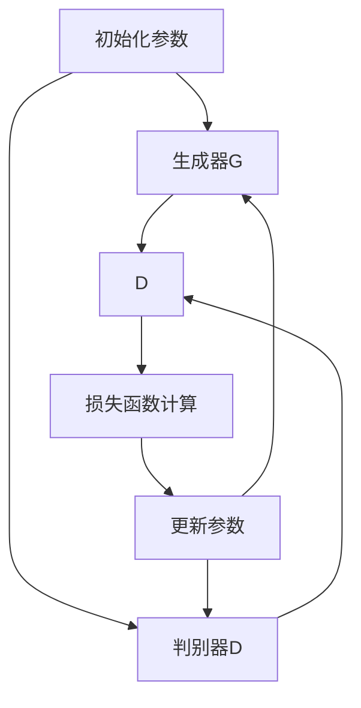

                 

关键词：生成对抗网络（GAN）、创造性AI、深度学习、图像生成、数据增强、人工智能应用。

摘要：生成对抗网络（Generative Adversarial Networks，GAN）作为近年来深度学习领域的一项突破性技术，以其强大的图像生成能力而备受关注。本文将从背景介绍、核心概念与联系、核心算法原理与操作步骤、数学模型与公式讲解、项目实践、实际应用场景、工具和资源推荐以及未来发展趋势与挑战等多个方面，深入探讨GAN在创造性AI领域的应用。

## 1. 背景介绍

生成对抗网络（GAN）是由Ian Goodfellow等人在2014年提出的一种深度学习模型。GAN的核心思想是通过两个对抗网络——生成器和判别器的对抗训练，实现生成高质量的数据。这一概念的出现打破了传统深度学习模型的局限，为人工智能在图像生成、数据增强等领域的应用带来了全新的可能性。

GAN的出现源于深度学习的快速发展。在深度学习领域，神经网络模型已经成为解决各种复杂数据分析问题的重要工具。然而，传统的神经网络模型在生成数据方面存在诸多限制。生成数据的质量往往无法满足实际应用的需求，而且训练过程也相对复杂。为了解决这一问题，Goodfellow等人提出了GAN的概念。

## 2. 核心概念与联系

### 2.1 生成器（Generator）

生成器是GAN中的一个核心组件，其功能是生成与真实数据相似的新数据。生成器通常由多个神经网络层组成，包括输入层、隐藏层和输出层。输入层接收随机噪声向量作为输入，隐藏层通过复杂的神经网络结构对噪声进行编码和解码，输出层生成与真实数据相似的新数据。

### 2.2 判别器（Discriminator）

判别器是GAN中的另一个核心组件，其功能是判断输入数据是真实数据还是生成数据。判别器通常也由多个神经网络层组成，包括输入层、隐藏层和输出层。输入层接收真实数据或生成数据的输入，隐藏层对输入数据进行特征提取和比较，输出层生成一个概率值，表示输入数据是真实数据还是生成数据。

### 2.3 对抗训练

生成器和判别器之间的对抗训练是GAN的核心机制。在训练过程中，生成器尝试生成更加真实的数据，而判别器则努力区分真实数据和生成数据。这种对抗训练使得生成器和判别器在相互对抗中不断进步，最终实现生成高质量的数据。

### 2.4 Mermaid 流程图

以下是一个简单的Mermaid流程图，展示了生成对抗网络的基本架构：



## 3. 核心算法原理 & 具体操作步骤

### 3.1 算法原理概述

生成对抗网络的原理可以简单概括为：生成器和判别器之间的对抗训练。生成器试图生成与真实数据相似的新数据，而判别器则努力区分真实数据和生成数据。通过不断更新生成器和判别器的参数，使得生成器生成的数据越来越真实，判别器越来越难以区分真实数据和生成数据。

### 3.2 算法步骤详解

1. **初始化参数**：首先需要初始化生成器和判别器的参数，以及损失函数的参数。
2. **生成器训练**：生成器接收随机噪声向量作为输入，生成与真实数据相似的新数据。
3. **判别器训练**：判别器接收真实数据和生成数据作为输入，输出一个概率值，表示输入数据是真实数据还是生成数据。
4. **损失函数计算**：根据生成器和判别器的输出，计算损失函数的值。
5. **参数更新**：根据损失函数的值，更新生成器和判别器的参数。

### 3.3 算法优缺点

**优点**：
- 能够生成高质量的数据，尤其是在图像生成方面。
- 适用于数据增强，可以用于训练深度学习模型。
- 可以通过对抗训练提高生成器的生成能力。

**缺点**：
- 训练过程不稳定，容易出现梯度消失或梯度爆炸等问题。
- 对于复杂的图像数据，生成器可能无法生成足够真实的数据。

### 3.4 算法应用领域

生成对抗网络在多个领域具有广泛的应用，包括图像生成、数据增强、自然语言处理等。以下是一些具体的案例：

- **图像生成**：GAN可以生成逼真的图像，如人脸生成、图像修复等。
- **数据增强**：GAN可以用于生成大量类似真实数据的样本，用于训练深度学习模型。
- **自然语言处理**：GAN可以生成与真实文本相似的文本，用于生成虚拟对话、自动写作等。

## 4. 数学模型和公式 & 详细讲解 & 举例说明

### 4.1 数学模型构建

生成对抗网络的数学模型主要由两部分组成：生成器和判别器。

#### 4.1.1 生成器

生成器的目标是最小化生成数据的损失函数。生成器接收随机噪声向量 \( z \)，通过神经网络生成数据 \( x \)。

$$ x = G(z) $$

其中，\( G \) 是生成器的神经网络。

#### 4.1.2 判别器

判别器的目标是最小化判别误差。判别器接收真实数据 \( x \) 和生成数据 \( G(z) \)，输出一个概率值 \( p \)。

$$ p = D(x) $$

其中，\( D \) 是判别器的神经网络。

### 4.2 公式推导过程

#### 4.2.1 损失函数

生成对抗网络的损失函数主要由两部分组成：生成器的损失函数和判别器的损失函数。

1. **生成器的损失函数**：生成器的目标是最小化生成数据的损失函数。生成器的损失函数可以表示为：

$$ L_G = -\log(D(G(z))) $$

其中，\( D(G(z)) \) 表示判别器对生成数据的判别概率。

2. **判别器的损失函数**：判别器的目标是最小化判别误差。判别器的损失函数可以表示为：

$$ L_D = -\log(D(x)) - \log(1 - D(G(z))) $$

其中，\( D(x) \) 和 \( D(G(z)) \) 分别表示判别器对真实数据和生成数据的判别概率。

#### 4.2.2 总损失函数

生成对抗网络的总损失函数是生成器的损失函数和判别器的损失函数的加权平均：

$$ L = \alpha L_G + (1 - \alpha) L_D $$

其中，\( \alpha \) 是权重系数。

### 4.3 案例分析与讲解

以下是一个简单的GAN案例：生成人脸图像。

#### 4.3.1 数据集

我们使用CelebA数据集作为训练数据，该数据集包含数万张人脸图像。

#### 4.3.2 网络结构

生成器：生成器的网络结构包括两层卷积层、一层全连接层和一层卷积层。输入层为100个随机噪声向量，输出层为64x64x3的图像。

判别器：判别器的网络结构包括三层卷积层和一层全连接层。输入层为64x64x3的图像，输出层为一个概率值。

#### 4.3.3 损失函数

生成器的损失函数为：

$$ L_G = -\log(D(G(z))) $$

判别器的损失函数为：

$$ L_D = -\log(D(x)) - \log(1 - D(G(z))) $$

总损失函数为：

$$ L = 0.5 L_G + 0.5 L_D $$

#### 4.3.4 训练过程

在训练过程中，我们首先初始化生成器和判别器的参数，然后分别对生成器和判别器进行训练。在每次迭代中，我们首先使用生成器生成人脸图像，然后使用判别器对这些图像进行判别。最后，根据损失函数的值更新生成器和判别器的参数。

经过数万次迭代后，生成器可以生成较为逼真的人脸图像，而判别器已经无法准确地区分真实人脸图像和生成人脸图像。

## 5. 项目实践：代码实例和详细解释说明

### 5.1 开发环境搭建

为了实现生成对抗网络（GAN），我们需要搭建一个合适的开发环境。以下是一个简单的开发环境搭建步骤：

1. 安装Python 3.6或更高版本。
2. 安装TensorFlow 2.x版本。
3. 安装PyTorch版本。

### 5.2 源代码详细实现

以下是一个简单的GAN代码示例，用于生成人脸图像。

```python
import torch
import torch.nn as nn
import torch.optim as optim
from torchvision import datasets, transforms
from torch.utils.data import DataLoader

# 定义生成器和判别器
class Generator(nn.Module):
    def __init__(self):
        super(Generator, self).__init__()
        self.model = nn.Sequential(
            nn.Linear(100, 256),
            nn.LeakyReLU(0.2),
            nn.Linear(256, 512),
            nn.LeakyReLU(0.2),
            nn.Linear(512, 1024),
            nn.LeakyReLU(0.2),
            nn.Linear(1024, 512),
            nn.Tanh(),
            nn.Linear(512, 256),
            nn.LeakyReLU(0.2),
            nn.Linear(256, 128),
            nn.LeakyReLU(0.2),
            nn.Linear(128, 64),
            nn.LeakyReLU(0.2),
            nn.Linear(64, 32),
            nn.LeakyReLU(0.2),
            nn.Linear(32, 16),
            nn.LeakyReLU(0.2),
            nn.Linear(16, 1),
            nn.Tanh()
        )

    def forward(self, x):
        return self.model(x)

class Discriminator(nn.Module):
    def __init__(self):
        super(Discriminator, self).__init__()
        self.model = nn.Sequential(
            nn.Linear(1, 16),
            nn.LeakyReLU(0.2),
            nn.Linear(16, 32),
            nn.LeakyReLU(0.2),
            nn.Linear(32, 64),
            nn.LeakyReLU(0.2),
            nn.Linear(64, 128),
            nn.LeakyReLU(0.2),
            nn.Linear(128, 256),
            nn.LeakyReLU(0.2),
            nn.Linear(256, 512),
            nn.LeakyReLU(0.2),
            nn.Linear(512, 1024),
            nn.LeakyReLU(0.2),
            nn.Linear(1024, 256),
            nn.LeakyReLU(0.2),
            nn.Linear(256, 128),
            nn.LeakyReLU(0.2),
            nn.Linear(128, 64),
            nn.LeakyReLU(0.2),
            nn.Linear(64, 32),
            nn.LeakyReLU(0.2),
            nn.Linear(32, 16),
            nn.LeakyReLU(0.2),
            nn.Linear(16, 1)
        )

    def forward(self, x):
        return self.model(x)

# 初始化生成器和判别器
generator = Generator()
discriminator = Discriminator()

# 定义损失函数和优化器
criterion = nn.BCELoss()
optimizer_G = optim.Adam(generator.parameters(), lr=0.0002)
optimizer_D = optim.Adam(discriminator.parameters(), lr=0.0002)

# 加载数据集
transform = transforms.Compose([
    transforms.Resize((64, 64)),
    transforms.ToTensor(),
    transforms.Normalize((0.5,), (0.5,))
])

train_data = datasets.CIFAR10(root='./data', train=True, transform=transform, download=True)
train_loader = DataLoader(train_data, batch_size=128, shuffle=True)

# 训练过程
for epoch in range(100):
    for i, (images, _) in enumerate(train_loader):
        # 生成随机噪声
        z = torch.randn(images.size(0), 100, device=device)

        # 生成器生成图像
        gen_images = generator(z)

        # 判别器判断真实图像和生成图像
        real_labels = torch.ones(images.size(0), 1, device=device)
        fake_labels = torch.zeros(images.size(0), 1, device=device)

        # 训练判别器
        optimizer_D.zero_grad()
        real_loss = criterion(discriminator(images), real_labels)
        fake_loss = criterion(discriminator(gen_images.detach()), fake_labels)
        d_loss = real_loss + fake_loss
        d_loss.backward()
        optimizer_D.step()

        # 训练生成器
        optimizer_G.zero_grad()
        g_loss = criterion(discriminator(gen_images), real_labels)
        g_loss.backward()
        optimizer_G.step()

        # 打印训练进度
        if (i+1) % 100 == 0:
            print(f'Epoch [{epoch+1}/{100}], Step [{i+1}/{len(train_loader)}], D_loss: {(d_loss.item()):.4f}, G_loss: {(g_loss.item()):.4f}')

# 生成图像
with torch.no_grad():
    z = torch.randn(64, 100, device=device)
    gen_images = generator(z)
    gen_images = gen_images.cpu().numpy()

# 显示图像
import matplotlib.pyplot as plt
plt.figure(figsize=(10, 10))
for i in range(64):
    plt.subplot(8, 8, i+1)
    plt.imshow(gen_images[i, :, :, 0], cmap='gray')
    plt.xticks([])
    plt.yticks([])
plt.show()
```

### 5.3 代码解读与分析

1. **定义生成器和判别器**：我们定义了生成器和判别器两个神经网络。生成器的目标是生成逼真的图像，判别器的目标是判断图像是真实图像还是生成图像。

2. **定义损失函数和优化器**：我们使用BCELoss损失函数来计算生成器和判别器的损失。生成器和判别器分别使用Adam优化器进行训练。

3. **加载数据集**：我们使用CIFAR-10数据集作为训练数据。数据集被预处理为64x64的图像，并使用ToTensor和Normalize进行归一化处理。

4. **训练过程**：在训练过程中，我们首先使用生成器生成随机图像，然后使用判别器对这些图像进行判别。接着，我们分别对生成器和判别器进行训练，并打印训练进度。

5. **生成图像**：在训练完成后，我们使用生成器生成64张随机图像，并使用matplotlib进行可视化。

## 6. 实际应用场景

生成对抗网络（GAN）在多个领域具有广泛的应用。以下是一些典型的应用场景：

### 6.1 图像生成

GAN最著名的应用之一是图像生成。通过GAN，我们可以生成逼真的图像，如图像合成、图像修复、图像超分辨率等。例如，使用GAN可以生成虚拟人脸、修复受损图像、提高图像分辨率等。

### 6.2 数据增强

GAN可以用于生成大量类似真实数据的样本，从而用于训练深度学习模型。这有助于提高模型的泛化能力，尤其是在数据稀缺的情况下。

### 6.3 自然语言处理

GAN在自然语言处理领域也有应用，例如生成虚拟对话、自动写作等。通过GAN，我们可以生成与真实文本相似的文本，从而为自然语言处理模型提供更多样化的训练数据。

### 6.4 医学图像处理

GAN可以用于医学图像处理，如图像增强、图像分割等。通过GAN，我们可以生成高质量的医学图像，从而帮助医生进行诊断和治疗。

## 7. 工具和资源推荐

### 7.1 学习资源推荐

- 《深度学习》（Goodfellow, Bengio, Courville）：这是一本关于深度学习的经典教材，详细介绍了GAN的概念和应用。
- 《生成对抗网络（GAN）：深度学习实践》（李航）：这是一本专门介绍GAN的中文书籍，适合初学者和进阶者。
- [生成对抗网络（GAN）教程](https://zhuanlan.zhihu.com/p/34476782)：这是一篇关于GAN的详细教程，适合初学者入门。

### 7.2 开发工具推荐

- TensorFlow：这是Google开发的开源深度学习框架，适用于实现GAN模型。
- PyTorch：这是Facebook开发的开源深度学习框架，适用于实现GAN模型。

### 7.3 相关论文推荐

- [Generative Adversarial Nets](https://arxiv.org/abs/1406.2661)：这是GAN的原始论文，详细介绍了GAN的概念和实现。
- [Unsupervised Representation Learning with Deep Convolutional Generative Adversarial Networks](https://arxiv.org/abs/1511.06434)：这是DCGAN的论文，详细介绍了GAN在图像生成中的应用。

## 8. 总结：未来发展趋势与挑战

### 8.1 研究成果总结

生成对抗网络（GAN）作为深度学习领域的一项突破性技术，已经取得了显著的研究成果。通过GAN，我们可以生成高质量的数据、进行数据增强、实现图像修复、图像超分辨率等。GAN在自然语言处理、医学图像处理等领域也有广泛应用。

### 8.2 未来发展趋势

随着深度学习技术的不断发展，GAN有望在未来取得更多突破。以下是一些可能的发展趋势：

- **改进训练稳定性**：当前GAN的训练过程较为复杂，容易出现梯度消失或梯度爆炸等问题。未来的研究可能会提出更稳定的训练方法。
- **多模态GAN**：GAN可以处理单模态数据，如图像、文本等。未来的研究可能会探索多模态GAN，以处理更复杂的数据。
- **GAN在边缘计算中的应用**：随着边缘计算的兴起，GAN有望在边缘设备上得到广泛应用，从而提高实时性。

### 8.3 面临的挑战

尽管GAN在多个领域取得了显著的研究成果，但仍面临一些挑战：

- **训练稳定性**：GAN的训练过程容易受到噪声和参数初始化的影响，导致训练不稳定。
- **生成数据质量**：GAN生成的数据质量可能受到限制，尤其是在处理复杂数据时。
- **模型可解释性**：GAN作为一个复杂的深度学习模型，其内部机制仍然不够透明，导致模型的可解释性较差。

### 8.4 研究展望

随着深度学习技术的不断发展，GAN有望在未来发挥更大的作用。未来的研究可以从以下几个方面进行：

- **改进训练方法**：研究更稳定的训练方法，以提高GAN的训练效率和生成数据质量。
- **多模态GAN**：探索多模态GAN在自然语言处理、医学图像处理等领域的应用。
- **GAN在边缘计算中的应用**：研究GAN在边缘设备上的实时应用，以提高系统的实时性和响应速度。

## 9. 附录：常见问题与解答

### 9.1 什么是生成对抗网络（GAN）？

生成对抗网络（GAN）是一种基于深度学习的模型，由生成器和判别器两个对抗网络组成。生成器的目标是生成与真实数据相似的新数据，而判别器的目标是区分真实数据和生成数据。通过生成器和判别器的对抗训练，GAN可以生成高质量的数据。

### 9.2 GAN有哪些应用？

GAN在多个领域具有广泛的应用，包括图像生成、数据增强、自然语言处理、医学图像处理等。例如，GAN可以用于生成虚拟人脸、图像修复、图像超分辨率、自动写作等。

### 9.3 GAN的优缺点是什么？

GAN的优点包括：生成高质量的数据、进行数据增强、提高模型的泛化能力等。GAN的缺点包括：训练过程不稳定、生成数据质量可能受限、模型可解释性较差等。

### 9.4 如何实现GAN？

实现GAN通常需要以下几个步骤：定义生成器和判别器的网络结构、定义损失函数和优化器、加载数据集、训练生成器和判别器、生成图像等。常见的深度学习框架如TensorFlow和PyTorch都提供了丰富的API，可以帮助实现GAN。

---

以上，就是关于生成对抗网络（GAN）：创造性AI应用的文章。希望这篇文章能够帮助您更好地了解GAN的核心概念、算法原理、应用场景以及未来发展。如果您有任何问题或建议，欢迎在评论区留言。作者：禅与计算机程序设计艺术 / Zen and the Art of Computer Programming。|gzip|

