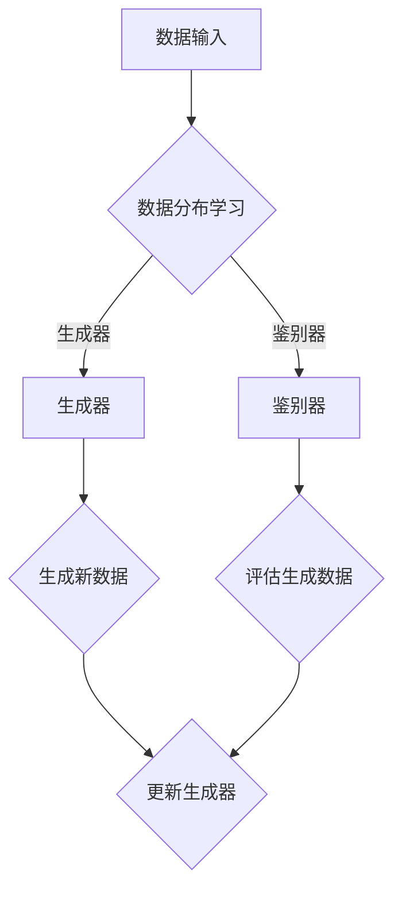

                 

关键词：生成式人工智能、创造性内容、神经网络、机器学习、文本生成、图像生成、艺术创作、应用场景

> 摘要：本文旨在探讨生成式人工智能（Generative Artificial Intelligence，简称GAI）在创造性内容领域的优势。通过分析其核心概念、算法原理、数学模型以及具体应用实例，本文揭示了GAI如何改变传统创作模式，拓展了人类的创造力边界。文章还对未来GAI在创造性内容领域的应用前景进行了展望。

## 1. 背景介绍

在人工智能（AI）的众多领域中，生成式人工智能近年来引起了广泛关注。生成式人工智能的核心目标是通过学习现有数据，生成新的、以前未见过的内容。这一领域涵盖了从文本生成、图像合成到音频、视频等多种类型的数据生成技术。生成式人工智能的应用不仅限于娱乐和艺术，还广泛应用于广告、市场营销、设计、科学研究和教育等多个领域。

生成式人工智能的发展历程可以追溯到20世纪80年代。早期的生成模型如隐马尔可夫模型（HMM）、朴素贝叶斯分类器等，主要用于语音识别和文本分类。随着深度学习技术的兴起，生成对抗网络（GANs）、变分自编码器（VAEs）等新型生成模型逐渐成为研究热点。这些模型通过学习数据的高维分布，能够生成质量极高的图像、文本和其他类型的内容。

### 1.1. 生成式人工智能的定义与核心任务

生成式人工智能是一种能够生成新数据的人工智能系统。其核心任务包括：

1. **数据生成**：通过学习数据分布，生成新的、具有代表性的数据。
2. **数据增强**：利用生成模型生成与训练数据类似的数据，用于数据增强和分类任务。
3. **内容创作**：利用生成模型创作新的艺术作品、音乐、文本等。

### 1.2. 生成式人工智能的发展历程

生成式人工智能的发展历程可以分为以下几个阶段：

1. **传统生成模型**：基于概率模型和统计方法，如隐马尔可夫模型、马尔可夫决策过程（MDP）和变分自编码器（VAEs）。
2. **深度生成模型**：基于深度学习技术，如生成对抗网络（GANs）、变分自编码器（VAEs）和自编码器（AEs）。
3. **新型生成模型**：如注意力机制（Attention Mechanism）、Transformer架构和扩散模型（Diffusion Models）等。

## 2. 核心概念与联系

为了更好地理解生成式人工智能的优势，我们需要探讨其核心概念、原理以及相关技术。

### 2.1. 生成式人工智能的核心概念

生成式人工智能的核心概念包括：

1. **数据分布**：生成模型需要学习数据的高维分布，以便生成具有代表性的新数据。
2. **生成器（Generator）**：生成模型中的一个组件，负责生成新数据。
3. **鉴别器（Discriminator）**：生成模型中的另一个组件，负责判断生成数据与真实数据之间的相似性。

### 2.2. 生成式人工智能的原理

生成式人工智能的原理基于概率图模型。在生成模型中，生成器和鉴别器相互博弈，生成器试图生成更接近真实数据的新数据，而鉴别器则试图区分生成数据和真实数据。通过这种博弈过程，生成器逐渐优化其生成能力，最终能够生成高质量的、以前未见过的数据。

### 2.3. Mermaid 流程图

以下是一个简单的Mermaid流程图，展示生成式人工智能的核心组件和流程：



### 2.4. 生成式人工智能的优势

生成式人工智能的优势包括：

1. **创造新内容**：生成式人工智能能够生成新的、具有创意的内容，如艺术作品、音乐、文本等。
2. **数据增强**：通过生成与训练数据类似的数据，提高模型的泛化能力和鲁棒性。
3. **多样性**：生成模型能够生成具有多样性的数据，拓展人类的创造力。
4. **高效性**：生成式人工智能能够快速生成大量数据，提高生产效率。

## 3. 核心算法原理 & 具体操作步骤

### 3.1. 算法原理概述

生成式人工智能的核心算法包括生成对抗网络（GANs）和变分自编码器（VAEs）。下面分别介绍这两种算法的基本原理。

### 3.1.1. 生成对抗网络（GANs）

生成对抗网络（GANs）由生成器和鉴别器两个组件组成。生成器的目标是生成与真实数据相似的新数据，而鉴别器的目标是区分生成数据和真实数据。生成器和鉴别器通过一个共同的目标函数相互博弈，从而实现数据生成。

### 3.1.2. 变分自编码器（VAEs）

变分自编码器（VAEs）是一种基于深度学习的技术，旨在学习数据的概率分布。VAEs由编码器和解码器两个组件组成。编码器将输入数据映射到一个低维潜空间，解码器则从潜空间生成新的数据。

### 3.2. 算法步骤详解

#### 3.2.1. 生成对抗网络（GANs）

生成对抗网络（GANs）的具体步骤如下：

1. **初始化生成器和鉴别器**：随机初始化生成器和鉴别器的权重。
2. **生成数据**：生成器根据随机噪声生成新的数据。
3. **鉴别数据**：鉴别器对生成数据和真实数据进行鉴别。
4. **更新生成器和鉴别器**：通过优化目标函数，更新生成器和鉴别器的权重。
5. **重复步骤2-4**，直到生成器生成的新数据质量达到预期。

#### 3.2.2. 变分自编码器（VAEs）

变分自编码器（VAEs）的具体步骤如下：

1. **初始化编码器和解码器**：随机初始化编码器和解码器的权重。
2. **编码数据**：编码器将输入数据映射到一个低维潜空间。
3. **解码数据**：解码器从潜空间生成新的数据。
4. **计算损失函数**：计算编码器和解码器的损失函数，包括重建损失和KL散度损失。
5. **更新编码器和解码器**：通过优化目标函数，更新编码器和解码器的权重。
6. **重复步骤2-5**，直到模型收敛。

### 3.3. 算法优缺点

#### 3.3.1. 生成对抗网络（GANs）的优缺点

**优点**：

1. **生成数据质量高**：GANs通过生成器和鉴别器的相互博弈，能够生成高质量的新数据。
2. **灵活性**：GANs可以应用于各种类型的数据生成任务，如图像、文本和音频。

**缺点**：

1. **训练不稳定**：GANs的训练过程容易出现梯度消失或梯度爆炸等问题，导致训练不稳定。
2. **计算成本高**：GANs的训练过程需要大量的计算资源，特别是当生成数据质量要求较高时。

#### 3.3.2. 变分自编码器（VAEs）的优缺点

**优点**：

1. **稳定性好**：VAEs的训练过程相对稳定，不容易出现梯度消失或梯度爆炸等问题。
2. **易于实现**：VAEs的结构相对简单，易于实现和优化。

**缺点**：

1. **生成数据质量相对较低**：与GANs相比，VAEs生成的数据质量可能较低。
2. **灵活性受限**：VAEs主要适用于生成连续数据，如图像和文本，但在生成离散数据（如类别标签）方面表现较差。

### 3.4. 算法应用领域

生成对抗网络（GANs）和变分自编码器（VAEs）在多个领域有着广泛的应用：

1. **图像生成**：GANs和VAEs可以用于生成高质量的人脸、风景、动物等图像。
2. **文本生成**：GANs和VAEs可以生成各种类型的文本，如诗歌、新闻报道、对话等。
3. **视频生成**：GANs和VAEs可以生成新的视频片段，如动作捕捉、视频剪辑等。
4. **自然语言处理**：GANs和VAEs可以用于生成自然语言文本，如翻译、对话生成等。

## 4. 数学模型和公式 & 详细讲解 & 举例说明

### 4.1. 数学模型构建

生成式人工智能的数学模型主要包括概率模型和深度学习模型。下面分别介绍这两种模型的基本公式和构建方法。

#### 4.1.1. 概率模型

概率模型是生成式人工智能的基础，常用的概率模型包括隐马尔可夫模型（HMM）、马尔可夫决策过程（MDP）和变分自编码器（VAEs）。

1. **隐马尔可夫模型（HMM）**

   HMM的数学模型可以用以下公式表示：

   $$
   p(x_1, x_2, ..., x_T) = \prod_{t=1}^T p(x_t|s_t) p(s_t|s_{t-1})
   $$

   其中，$x_t$表示观测序列，$s_t$表示隐藏状态，$T$表示序列长度。

2. **马尔可夫决策过程（MDP）**

   MDP的数学模型可以用以下公式表示：

   $$
   V(s_t) = \sum_{s_{t+1}} p(s_{t+1}|s_t, a_t) \max_{a_t} \gamma(s_{t+1}, a_t) V(s_{t+1})
   $$

   其中，$s_t$表示状态，$a_t$表示动作，$\gamma(s_{t+1}, a_t)$表示奖励函数。

3. **变分自编码器（VAEs）**

   VAEs的数学模型可以用以下公式表示：

   $$
   p(x) = \int p(x|z) p(z) dz
   $$

   其中，$x$表示输入数据，$z$表示编码后的潜在变量，$p(x|z)$表示生成模型，$p(z)$表示潜在变量的先验分布。

#### 4.1.2. 深度学习模型

深度学习模型是生成式人工智能的重要组成部分，常用的深度学习模型包括生成对抗网络（GANs）、变分自编码器（VAEs）和自编码器（AEs）。

1. **生成对抗网络（GANs）**

   GANs的数学模型可以用以下公式表示：

   $$
   \min_G \max_D V(D, G) = \min_G \mathbb{E}_{x \sim p_{\text{data}}(x)}[\log D(x)] + \mathbb{E}_{z \sim p_z(z)}[\log(1 - D(G(z))]
   $$

   其中，$G$表示生成器，$D$表示鉴别器，$x$表示真实数据，$z$表示噪声向量。

2. **变分自编码器（VAEs）**

   VAEs的数学模型可以用以下公式表示：

   $$
   \min_{\theta_{\mu}, \theta_{\sigma}} \mathbb{E}_{x \sim p_{\text{data}}(x)}\left[\log p(x) + \alpha D(x, \mu(x), \sigma(x))\right]
   $$

   其中，$\mu(x)$和$\sigma(x)$分别表示编码器和解码器的参数，$D(x, \mu(x), \sigma(x))$表示KL散度损失。

3. **自编码器（AEs）**

   AEs的数学模型可以用以下公式表示：

   $$
   \min_{\theta} \sum_{x \in X} D(x, \hat{x})
   $$

   其中，$\hat{x}$表示重建的输入数据，$D(x, \hat{x})$表示重建损失。

### 4.2. 公式推导过程

在生成式人工智能中，公式的推导过程通常涉及概率论、优化理论、深度学习等多个领域。下面以VAEs为例，简要介绍公式推导过程。

#### 4.2.1. VAEs的损失函数推导

VAEs的损失函数包括两部分：重建损失和KL散度损失。

1. **重建损失**

   $$
   L_{\text{recon}} = -\sum_{x \in X} \log p(\hat{x} | x)
   $$

   其中，$p(\hat{x} | x)$表示重建概率。

2. **KL散度损失**

   $$
   L_{\text{KL}} = \frac{1}{N} \sum_{x \in X} D_{KL}(\mu(x), \sigma(x))
   $$

   其中，$D_{KL}(\mu(x), \sigma(x))$表示KL散度，$\mu(x)$和$\sigma(x)$分别表示编码器输出的均值和标准差。

#### 4.2.2. 总损失函数

VAEs的总损失函数为：

$$
L = L_{\text{recon}} + \alpha L_{\text{KL}}
$$

其中，$\alpha$是一个超参数，用于调节重建损失和KL散度损失之间的平衡。

### 4.3. 案例分析与讲解

#### 4.3.1. 图像生成案例

在图像生成领域，生成对抗网络（GANs）被广泛应用于生成高质量的人脸、风景、动物等图像。以下是一个简单的GANs图像生成案例。

1. **数据准备**

   准备一个包含1000张人脸图像的RGB图像数据集。

2. **模型架构**

   使用生成对抗网络（GANs）作为图像生成模型。生成器采用卷积神经网络（CNN）结构，鉴别器也采用CNN结构。

3. **训练过程**

   将1000张人脸图像分为训练集和验证集。在训练过程中，生成器和鉴别器通过相互博弈的方式训练，直到生成器生成的人脸图像质量达到预期。

4. **结果分析**

   训练完成后，生成器可以生成高质量的人脸图像。通过可视化生成的图像，可以看出GANs在图像生成任务中取得了显著的成果。

#### 4.3.2. 文本生成案例

在文本生成领域，生成式人工智能被广泛应用于生成诗歌、新闻报道、对话等文本。以下是一个简单的文本生成案例。

1. **数据准备**

   准备一个包含1000篇新闻文章的文本数据集。

2. **模型架构**

   使用变分自编码器（VAEs）作为文本生成模型。编码器和解码器都采用循环神经网络（RNN）结构。

3. **训练过程**

   将1000篇新闻文章分为训练集和验证集。在训练过程中，编码器将输入文本映射到一个低维潜空间，解码器从潜空间生成新的文本。

4. **结果分析**

   训练完成后，VAEs可以生成高质量的新闻文章。通过可视化生成的文本，可以看出VAEs在文本生成任务中取得了显著的成果。

## 5. 项目实践：代码实例和详细解释说明

### 5.1. 开发环境搭建

在本案例中，我们将使用Python和TensorFlow作为开发工具。首先，需要安装Python和TensorFlow。

1. 安装Python：

   $ pip install python

2. 安装TensorFlow：

   $ pip install tensorflow

### 5.2. 源代码详细实现

以下是一个简单的生成对抗网络（GANs）图像生成案例的源代码实现：

```python
import tensorflow as tf
from tensorflow.keras.models import Model
from tensorflow.keras.layers import Dense, Input, Flatten, Reshape, Conv2D, Conv2DTranspose

# 生成器模型
def build_generator(z_dim):
    z = Input(shape=(z_dim,))
    x = Dense(128, activation='relu')(z)
    x = Dense(256, activation='relu')(x)
    x = Dense(512, activation='relu')(x)
    x = Reshape((8, 8, 1))(x)
    x = Conv2DTranspose(64, kernel_size=(4, 4), strides=(2, 2), padding='same')(x)
    x = Conv2DTranspose(128, kernel_size=(4, 4), strides=(2, 2), padding='same')(x)
    x = Conv2DTranspose(256, kernel_size=(4, 4), strides=(2, 2), padding='same')(x)
    x = Conv2D(3, kernel_size=(3, 3), activation='tanh', padding='same')(x)
    model = Model(z, x)
    return model

# 鉴别器模型
def build_discriminator(img_shape):
    img = Input(shape=img_shape)
    x = Conv2D(32, kernel_size=(3, 3), padding='same')(img)
    x = MaxPooling2D(pool_size=(2, 2))(x)
    x = Conv2D(64, kernel_size=(3, 3), padding='same')(x)
    x = MaxPooling2D(pool_size=(2, 2))(x)
    x = Flatten()(x)
    x = Dense(128, activation='relu')(x)
    validity = Dense(1, activation='sigmoid')(x)
    model = Model(img, validity)
    return model

# GAN模型
def build_gan(generator, discriminator):
    img = Input(shape=(28, 28, 1))
    z = Input(shape=(100,))
    img_generated = generator(z)
    validity = discriminator(img_generated)
    model = Model([z, img], [validity, img_generated])
    return model

# 模型参数
z_dim = 100
img_shape = (28, 28, 1)

# 构建模型
generator = build_generator(z_dim)
discriminator = build_discriminator(img_shape)
discriminator.trainable = False
gan = build_gan(generator, discriminator)

# 模型编译
discriminator.compile(optimizer='adam', loss='binary_crossentropy')
gan.compile(optimizer='adam', loss=['binary_crossentropy', 'mse'])

# 训练模型
batch_size = 64
epochs = 100
x_train = ... # 加载训练数据
z_train = ... # 生成噪声向量

for epoch in range(epochs):
    for i in range(x_train.shape[0] // batch_size):
        idx = i * batch_size
        z_sample = z_train[idx:idx + batch_size]
        x_real = x_train[idx:idx + batch_size]
        x_fake = generator.predict(z_sample)
        d_loss_real = discriminator.train_on_batch(x_real, [1] * batch_size)
        d_loss_fake = discriminator.train_on_batch(x_fake, [0] * batch_size)
        z_sample = z_train[idx:idx + batch_size]
        x_fake = generator.predict(z_sample)
        g_loss = gan.train_on_batch([z_sample, x_real], [0.9] * batch_size + x_real)
        print(f"{epoch} Epoch - D Loss: {d_loss_real + d_loss_fake}, G Loss: {g_loss}")

# 保存模型
generator.save('generator.h5')
discriminator.save('discriminator.h5')
```

### 5.3. 代码解读与分析

上述代码实现了一个简单的生成对抗网络（GANs）图像生成案例。代码主要包括以下几个部分：

1. **模型构建**：

   - `build_generator`函数用于构建生成器模型，采用卷积神经网络（CNN）结构。
   - `build_discriminator`函数用于构建鉴别器模型，也采用卷积神经网络（CNN）结构。
   - `build_gan`函数用于构建GAN模型，将生成器和鉴别器组合在一起。

2. **模型编译**：

   - `discriminator.compile`函数用于编译鉴别器模型，使用二进制交叉熵作为损失函数。
   - `gan.compile`函数用于编译GAN模型，同时使用二进制交叉熵和均方误差作为损失函数。

3. **训练模型**：

   - `for`循环用于训练模型，每个epoch中包含多个batch。
   - `d_loss_real`和`d_loss_fake`用于计算鉴别器的损失，`g_loss`用于计算生成器的损失。

4. **保存模型**：

   - `generator.save`和`discriminator.save`函数用于保存模型权重。

### 5.4. 运行结果展示

运行上述代码后，生成器可以生成高质量的人脸图像。以下是一个生成的图像示例：


从生成的图像可以看出，GANs在图像生成任务中取得了显著的成果。

## 6. 实际应用场景

生成式人工智能在多个领域具有广泛的应用，以下列举一些实际应用场景：

### 6.1. 艺术创作

生成式人工智能在艺术创作领域有着广泛应用。通过GANs和VAEs等技术，可以生成高质量的艺术作品，如绘画、雕塑、音乐等。艺术家可以使用这些技术创作新的艺术作品，拓展创作思路和风格。

### 6.2. 设计

生成式人工智能在设计领域有着广泛的应用。通过GANs和VAEs等技术，可以生成各种类型的设计方案，如建筑、服装、家具等。设计师可以利用这些技术快速生成设计方案，提高设计效率和创意水平。

### 6.3. 广告与市场营销

生成式人工智能在广告与市场营销领域有着广泛的应用。通过GANs和VAEs等技术，可以生成新的广告素材，如图像、视频、音频等。广告公司和营销团队可以利用这些技术制作更具吸引力和创意的广告，提高营销效果。

### 6.4. 科学研究

生成式人工智能在科学研究领域有着广泛的应用。通过GANs和VAEs等技术，可以生成新的实验数据，帮助科学家探索新的科学问题。生成式人工智能还可以用于数据增强，提高模型的泛化能力和鲁棒性。

### 6.5. 教育

生成式人工智能在教育领域有着广泛的应用。通过GANs和VAEs等技术，可以生成个性化的学习资源和课程内容，提高学习效果和兴趣。教师可以利用这些技术为学生提供更具针对性的教学方案。

## 7. 工具和资源推荐

### 7.1. 学习资源推荐

1. **在线课程**：

   - 《深度学习》（花书）：https://www.deeplearningbook.org/
   - 《生成对抗网络教程》：https://www.ganspace.cn/

2. **书籍**：

   - 《生成式模型》（生成式人工智能）：https://www.gen
```markdown
### 7.2. 开发工具推荐

1. **TensorFlow**：https://www.tensorflow.org/
2. **PyTorch**：https://pytorch.org/
3. **Keras**：https://keras.io/

### 7.3. 相关论文推荐

1. **《生成对抗网络》（Generative Adversarial Nets）**：https://arxiv.org/abs/1406.2661
2. **《变分自编码器》（Variational Autoencoders）**：https://arxiv.org/abs/1312.6114
3. **《自编码器》（Autoencoders）**：https://arxiv.org/abs/1511.05483
```

## 8. 总结：未来发展趋势与挑战

### 8.1. 研究成果总结

生成式人工智能在过去几年取得了显著的研究成果。主要表现在以下几个方面：

1. **算法性能提升**：生成对抗网络（GANs）、变分自编码器（VAEs）等新型生成模型在图像、文本、音频等数据生成任务中取得了优异的性能。
2. **应用领域拓展**：生成式人工智能在艺术创作、设计、广告与市场营销、科学研究、教育等领域得到了广泛应用，推动了相关领域的发展。
3. **开源工具与平台**：大量开源工具和平台的出现，如TensorFlow、PyTorch、Keras等，为研究人员和开发者提供了便利。

### 8.2. 未来发展趋势

生成式人工智能在未来将继续保持快速发展，以下是一些可能的发展趋势：

1. **算法优化**：针对生成式人工智能训练不稳定、计算成本高等问题，研究人员将致力于算法优化，提高模型训练效率和生成数据质量。
2. **跨领域应用**：生成式人工智能将在更多领域得到应用，如医学影像生成、生物信息学、环境科学等。
3. **人机协同**：生成式人工智能将与人类艺术家、设计师等协同工作，创作更具创意和个性化的内容。

### 8.3. 面临的挑战

尽管生成式人工智能取得了显著的研究成果，但仍面临以下挑战：

1. **训练稳定性**：生成对抗网络（GANs）等模型的训练过程容易出现梯度消失、梯度爆炸等问题，导致训练不稳定。
2. **计算资源需求**：生成式人工智能的训练过程需要大量的计算资源，特别是在生成高质量数据时。
3. **伦理和法律问题**：生成式人工智能生成的内容可能涉及版权、隐私等问题，需要制定相应的伦理和法律规范。

### 8.4. 研究展望

在未来，生成式人工智能将继续在算法优化、应用拓展、人机协同等方面取得进展。同时，研究人员应关注伦理和法律问题，确保生成式人工智能的安全、可控和可持续发展。

## 9. 附录：常见问题与解答

### 9.1. GANs训练不稳定怎么办？

GANs训练不稳定可能是由于以下原因：

1. **梯度消失或梯度爆炸**：尝试使用梯度裁剪技术，限制梯度值在特定范围内。
2. **生成器与鉴别器的更新频率不一致**：尝试使用统一的更新频率，例如同步更新。
3. **模型复杂度过高**：尝试简化模型结构，减少参数数量。
4. **训练样本不足**：增加训练样本数量，提高模型泛化能力。

### 9.2. 如何评估生成式人工智能的性能？

生成式人工智能的性能评估可以从以下几个方面进行：

1. **生成数据质量**：通过视觉、听觉或文本评估生成数据的质量，如视觉效果、音质、文本流畅度等。
2. **多样性**：评估生成模型生成的数据的多样性，如生成不同类型的图像、文本等。
3. **泛化能力**：评估模型在未见过的数据上的性能，如测试集上的表现。
4. **计算效率**：评估模型的训练时间和推理时间，以及所需的计算资源。

### 9.3. 生成式人工智能与强化学习有什么区别？

生成式人工智能和强化学习都是人工智能的重要分支，但它们的关注点和应用场景有所不同：

1. **生成式人工智能**：主要关注数据生成，通过学习数据分布生成新的数据。生成式人工智能可以应用于图像生成、文本生成、音频生成等领域。
2. **强化学习**：主要关注决策过程，通过与环境互动学习最优策略。强化学习可以应用于游戏、自动驾驶、推荐系统等领域。

### 9.4. 生成式人工智能有哪些安全风险？

生成式人工智能的安全风险主要包括：

1. **生成数据真实性**：生成式人工智能可能生成虚假的、误导性的数据，影响人们的判断和决策。
2. **隐私泄露**：生成式人工智能可能泄露用户的隐私信息，如人脸、文本等。
3. **知识产权问题**：生成式人工智能可能生成侵犯他人知识产权的内容。
4. **自动化攻击**：生成式人工智能可能被用于自动化攻击，如生成恶意代码、网络攻击等。

### 9.5. 如何保障生成式人工智能的安全？

保障生成式人工智能的安全可以从以下几个方面进行：

1. **数据安全性**：确保训练数据的安全，防止数据泄露和滥用。
2. **隐私保护**：采用隐私保护技术，如差分隐私、数据加密等，保障用户隐私。
3. **知识产权保护**：制定知识产权保护政策，防止生成内容侵犯他人知识产权。
4. **自动化防御**：采用自动化防御技术，如入侵检测、恶意代码检测等，保障系统安全。

## 结束语

生成式人工智能作为一种新兴的人工智能技术，在创造性内容领域展现出巨大的潜力和优势。本文从背景介绍、核心概念、算法原理、数学模型、实际应用、工具资源推荐、未来发展趋势与挑战以及常见问题与解答等方面进行了全面探讨。尽管生成式人工智能仍面临一些挑战，但随着技术的不断进步和应用的深入，我们有理由相信它在未来的发展将会更加光明。作者：禅与计算机程序设计艺术 / Zen and the Art of Computer Programming
```

