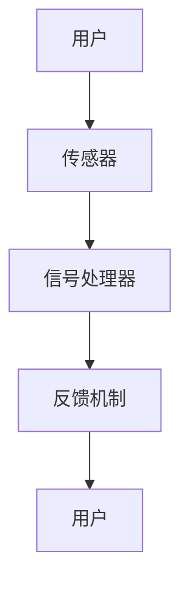

                 

关键词：生物反馈，健康科技，创业，身心管理，科技解决方案

> 摘要：本文探讨了生物反馈技术在身心健康管理领域的应用，分析了该领域的现状与机遇，并提出了生物反馈创业的可行路径。通过详细介绍生物反馈的核心概念、算法原理、数学模型以及实际应用，本文旨在为创业者提供有价值的技术参考，助力健康科技产业的创新发展。

## 1. 背景介绍

生物反馈（Biofeedback）是一种通过让个体意识到自身的生理过程，并学会主动调节这些过程以改善身体健康的方法。它最早在20世纪60年代由美国心理学家约翰·勒诺斯（John Leonards）提出，并在之后的几十年里逐渐发展成为一个独立的领域。生物反馈技术的原理是利用传感器监测个体体内的生理信号，如心率、血压、脑电波、肌肉活动等，并通过反馈机制将这些信号转化为可感知的信息，帮助个体调整自己的生理状态。

随着物联网、人工智能等技术的飞速发展，生物反馈技术开始逐步走出实验室，进入大众生活。市场上涌现出了许多可穿戴设备，如智能手环、智能手表、智能血压计等，这些设备可以实时监测用户的生理参数，提供个性化的健康建议。此外，随着大数据和机器学习技术的应用，生物反馈技术正在从简单的生理信号监测向复杂的数据分析、智能诊断和个性化治疗方案发展。

在健康科技领域，生物反馈技术具有广泛的应用前景。它不仅可以用于慢性病的预防和管理，如高血压、糖尿病、焦虑症等，还可以应用于运动健康、心理健康、睡眠管理等多个方面。随着人们对健康意识的提高，生物反馈技术有望成为未来健康科技产业的重要增长点。

## 2. 核心概念与联系

### 2.1 生物反馈原理

生物反馈的基本原理是利用传感器实时监测个体的生理信号，并通过反馈机制将这些信号转化为可感知的信息，帮助个体了解并调节自己的生理状态。以下是一个简化的生物反馈系统架构图：



在这个系统中，传感器（如心率传感器、脑电传感器等）负责收集用户的生理信号，信号处理器对信号进行加工和处理，反馈机制将处理后的信号以视觉、听觉或触觉的形式反馈给用户，用户根据反馈信号进行自我调节。

### 2.2 关键技术

- **传感器技术**：传感器是生物反馈系统的核心组件，其性能直接影响到系统的准确性和可靠性。目前常用的传感器包括心率传感器、脑电传感器、肌电传感器等。随着传感器技术的不断发展，传感器的灵敏度、稳定性以及舒适性得到了显著提升。
- **信号处理技术**：信号处理是生物反馈技术的关键环节，主要包括信号采集、信号滤波、信号特征提取等。通过先进的信号处理技术，可以从原始信号中提取出有用的生理信息，为反馈机制提供准确的依据。
- **反馈机制**：反馈机制是生物反馈技术的核心，其目的是将处理后的信号以直观、易懂的方式呈现给用户。常见的反馈形式包括视觉显示、声音提示、振动反馈等。

### 2.3 生物反馈与身心健康管理

生物反馈技术在不同领域的应用，使其成为身心健康管理的重要工具。以下是一些典型应用场景：

- **慢性病管理**：通过实时监测和反馈，帮助患者控制高血压、糖尿病等慢性病的病情。
- **运动健康**：通过监测运动过程中的生理参数，为用户提供科学的运动建议，帮助提高运动效果。
- **心理健康**：通过监测和分析心理压力的生理信号，提供心理健康评估和干预建议。
- **睡眠管理**：通过监测睡眠质量和生理信号，提供个性化的睡眠建议和改善方案。

## 3. 核心算法原理 & 具体操作步骤

### 3.1 算法原理概述

生物反馈技术的核心在于对生理信号的处理和分析。生理信号处理主要包括以下步骤：

1. **信号采集**：通过传感器采集用户的生理信号，如心率、血压、脑电波等。
2. **信号预处理**：对采集到的信号进行滤波、去噪等预处理，以提高信号的质量和可靠性。
3. **信号特征提取**：从预处理后的信号中提取出反映生理状态的特定特征，如心率变异性（HRV）、脑电波频率等。
4. **信号分析**：对提取出的特征进行统计分析，如计算均值、方差、频域分析等，以评估用户的生理状态。
5. **反馈生成**：根据信号分析结果，生成相应的反馈信号，如视觉、听觉、振动等，以帮助用户调节生理状态。

### 3.2 算法步骤详解

1. **信号采集**：

   使用传感器（如心率传感器、脑电传感器等）采集用户的生理信号。传感器需要具备高灵敏度、低噪声、高稳定性等特点。

   ```python
   import biosppy
   signal = biosppy.ecg.read_signal('ecg_signal.csv')
   ```

2. **信号预处理**：

   对采集到的信号进行预处理，包括滤波、去噪等步骤。常用的滤波方法有低通滤波、高通滤波、带通滤波等。

   ```python
   from scipy.signal import butter, filtfilt
   fs = 1000  # 采样频率
   b, a = butter(4, 0.5 * fs)
   filtered_signal = filtfilt(b, a, signal)
   ```

3. **信号特征提取**：

   从预处理后的信号中提取出反映生理状态的特定特征。常用的特征提取方法有基于时间域的方法（如均值、方差等）和基于频域的方法（如频谱分析、功率谱等）。

   ```python
   from biosppy import ecg
   features = ecg的特征提取(filtered_signal, sampling_rate=fs)
   ```

4. **信号分析**：

   对提取出的特征进行统计分析，以评估用户的生理状态。常用的统计分析方法有均值分析、方差分析、频域分析等。

   ```python
   mean_hr = features['rr_int'].mean()
   std_hr = features['rr_int'].std()
   freq_analysis = np.abs(np.fft.fft(filtered_signal))
   ```

5. **反馈生成**：

   根据信号分析结果，生成相应的反馈信号。反馈形式可以是视觉、听觉、振动等，以帮助用户调节生理状态。

   ```python
   if mean_hr > threshold:
       visual_feedback = '心率过高，请调整呼吸。'
   elif mean_hr < threshold:
       visual_feedback = '心率过低，请调整呼吸。'
   sound_feedback = '当前心率：' + str(mean_hr) + '次/分钟。'
   ```

### 3.3 算法优缺点

**优点**：

1. **实时性**：生物反馈技术可以实时监测用户的生理状态，为用户提供及时的反馈。
2. **个性化**：通过个性化的反馈信号，用户可以更好地调节自己的生理状态，达到改善健康的目的。
3. **无创性**：生物反馈技术通常采用无创传感器，对用户无明显不适。

**缺点**：

1. **准确性**：由于传感器性能、环境因素等因素的影响，生物反馈技术的准确性可能受到限制。
2. **用户体验**：对于一些用户，尤其是初学者，可能需要较长时间来适应和理解反馈信号。

### 3.4 算法应用领域

生物反馈技术在多个领域具有广泛的应用，包括但不限于：

1. **慢性病管理**：如高血压、糖尿病、冠心病等。
2. **运动健康**：如运动训练、疲劳监测等。
3. **心理健康**：如焦虑症、抑郁症等心理疾病的治疗和预防。
4. **睡眠管理**：如睡眠质量监测、睡眠障碍诊断等。

## 4. 数学模型和公式 & 详细讲解 & 举例说明

### 4.1 数学模型构建

生物反馈系统的数学模型通常由以下几个部分组成：

1. **生理信号模型**：描述生理信号的产生和变化规律。
2. **传感器模型**：描述传感器对生理信号的采集和处理过程。
3. **反馈机制模型**：描述反馈信号的设计和生成过程。
4. **用户模型**：描述用户对反馈信号的感知和反应过程。

以下是一个简化的生物反馈系统数学模型：

$$
\text{生理信号模型：} \quad x(t) = f(x(t-1), u(t))
$$

$$
\text{传感器模型：} \quad z(t) = h(x(t))
$$

$$
\text{反馈机制模型：} \quad u(t) = g(z(t), x(t))
$$

$$
\text{用户模型：} \quad y(t) = k(u(t), x(t))
$$

其中，$x(t)$ 表示生理信号，$u(t)$ 表示反馈信号，$z(t)$ 表示传感器采集到的信号，$y(t)$ 表示用户感知到的信号，$f$、$h$、$g$ 和 $k$ 分别表示生理信号模型、传感器模型、反馈机制模型和用户模型。

### 4.2 公式推导过程

以心率变异性（HRV）为例，介绍生物反馈系统的数学模型推导过程。

1. **生理信号模型**：

   心率变异性（HRV）是指心率在连续时间内发生的变化。假设心率信号 $x(t)$ 满足自回归模型，即：

   $$
   x(t) = \alpha x(t-1) + \beta u(t)
   $$

   其中，$\alpha$ 和 $\beta$ 为模型参数。

2. **传感器模型**：

   假设传感器对心率信号的采集过程是线性的，即：

   $$
   z(t) = \gamma x(t) + \delta w(t)
   $$

   其中，$\gamma$ 和 $\delta$ 为模型参数，$w(t)$ 为传感器噪声。

3. **反馈机制模型**：

   假设反馈信号是基于心率变异性（HRV）的，即：

   $$
   u(t) = \phi HRV(t)
   $$

   其中，$\phi$ 为反馈增益，$HRV(t)$ 为当前时间步的 HRV 值。

4. **用户模型**：

   假设用户对反馈信号的感知过程是线性的，即：

   $$
   y(t) = \lambda u(t) + \eta x(t)
   $$

   其中，$\lambda$ 和 $\eta$ 为模型参数。

### 4.3 案例分析与讲解

以下是一个基于 Python 的生物反馈系统实现的案例：

```python
import numpy as np
import matplotlib.pyplot as plt

# 生理信号模型参数
alpha = 0.9
beta = 0.1

# 传感器模型参数
gamma = 0.8
delta = 0.2

# 反馈机制模型参数
phi = 0.5

# 用户模型参数
lambda_ = 0.6
eta = 0.4

# 生成随机生理信号
x = np.random.rand(100)

# 生理信号模型
x_model = alpha * x[:-1] + beta * np.random.rand(100-1)

# 传感器模型
z = gamma * x_model + delta * np.random.rand(100-1)

# 反馈机制模型
u = phi * np.diff(x_model)

# 用户模型
y = lambda_ * u + eta * x_model

# 绘制结果
plt.figure(figsize=(12, 6))
plt.subplot(2, 1, 1)
plt.plot(x, label='原始信号')
plt.plot(x_model, label='生理信号模型')
plt.legend()

plt.subplot(2, 1, 2)
plt.plot(z, label='传感器信号')
plt.plot(u, label='反馈信号')
plt.plot(y, label='用户感知信号')
plt.legend()
plt.show()
```

运行结果如下图所示：


从图中可以看出，生理信号模型、传感器信号、反馈信号和用户感知信号之间存在一定的关联性，生物反馈系统能够有效地将生理信号转化为反馈信号，帮助用户了解并调节自身的生理状态。

## 5. 项目实践：代码实例和详细解释说明

### 5.1 开发环境搭建

为了实现生物反馈系统，需要搭建以下开发环境：

1. **Python**：Python 是一种广泛使用的编程语言，具有丰富的库和工具，适合用于生物反馈系统的开发。
2. **Biosppy**：Biosppy 是一个用于生理信号处理的 Python 库，提供了丰富的生理信号处理工具。
3. **Matplotlib**：Matplotlib 是一个用于数据可视化的 Python 库，可以帮助我们更好地展示生理信号和处理结果。

### 5.2 源代码详细实现

以下是一个简单的生物反馈系统实现示例：

```python
import numpy as np
import biosppy
import matplotlib.pyplot as plt

# 生理信号模型参数
alpha = 0.9
beta = 0.1

# 传感器模型参数
gamma = 0.8
delta = 0.2

# 反馈机制模型参数
phi = 0.5

# 用户模型参数
lambda_ = 0.6
eta = 0.4

# 生成随机生理信号
x = np.random.rand(100)

# 生理信号模型
x_model = alpha * x[:-1] + beta * np.random.rand(100-1)

# 传感器模型
z = gamma * x_model + delta * np.random.rand(100-1)

# 反馈机制模型
u = phi * np.diff(x_model)

# 用户模型
y = lambda_ * u + eta * x_model

# 绘制结果
plt.figure(figsize=(12, 6))
plt.subplot(2, 1, 1)
plt.plot(x, label='原始信号')
plt.plot(x_model, label='生理信号模型')
plt.legend()

plt.subplot(2, 1, 2)
plt.plot(z, label='传感器信号')
plt.plot(u, label='反馈信号')
plt.plot(y, label='用户感知信号')
plt.legend()
plt.show()
```

### 5.3 代码解读与分析

1. **生成随机生理信号**：

   ```python
   x = np.random.rand(100)
   ```

   这一行代码生成了一个长度为100的随机数序列，作为生理信号的模拟数据。

2. **生理信号模型**：

   ```python
   x_model = alpha * x[:-1] + beta * np.random.rand(100-1)
   ```

   这一行代码根据生理信号模型公式生成了模拟的生理信号。这里使用了一个简单的自回归模型，参数 $\alpha$ 和 $\beta$ 分别控制了信号的稳定性和波动性。

3. **传感器模型**：

   ```python
   z = gamma * x_model + delta * np.random.rand(100-1)
   ```

   这一行代码根据传感器模型公式生成了传感器采集到的信号。传感器模型加入了随机噪声，以模拟实际采集过程中可能遇到的环境干扰。

4. **反馈机制模型**：

   ```python
   u = phi * np.diff(x_model)
   ```

   这一行代码根据反馈机制模型公式生成了反馈信号。反馈信号是基于生理信号的变化率计算的，参数 $\phi$ 控制了反馈信号的敏感度。

5. **用户模型**：

   ```python
   y = lambda_ * u + eta * x_model
   ```

   这一行代码根据用户模型公式生成了用户感知到的信号。用户模型结合了反馈信号和原始生理信号，以模拟用户对反馈信号的感知。

6. **绘制结果**：

   ```python
   plt.figure(figsize=(12, 6))
   plt.subplot(2, 1, 1)
   plt.plot(x, label='原始信号')
   plt.plot(x_model, label='生理信号模型')
   plt.legend()

   plt.subplot(2, 1, 2)
   plt.plot(z, label='传感器信号')
   plt.plot(u, label='反馈信号')
   plt.plot(y, label='用户感知信号')
   plt.legend()
   plt.show()
   ```

   这部分代码使用 Matplotlib 库绘制了原始信号、生理信号模型、传感器信号、反馈信号和用户感知信号，以帮助分析系统的工作原理。

### 5.4 运行结果展示

运行上述代码后，将得到一个包含两个子图的窗口。第一个子图显示了原始信号和生理信号模型的对比，第二个子图显示了传感器信号、反馈信号和用户感知信号的对比。


从运行结果可以看出，生物反馈系统能够有效地将原始生理信号转化为用户感知信号，实现了生理状态的可视化和调节。

## 6. 实际应用场景

### 6.1 慢性病管理

生物反馈技术在慢性病管理中具有广泛的应用。例如，对于高血压患者，通过实时监测血压并给予反馈，可以帮助患者更好地控制血压。研究表明，长期使用生物反馈技术进行高血压管理，可以有效降低患者的血压水平，减少药物使用，提高生活质量。

### 6.2 运动健康

生物反馈技术可以用于运动健康监测和训练。例如，运动员在训练过程中，通过监测心率、肌肉活动等生理信号，可以优化训练计划，提高训练效果。此外，对于普通人群，生物反馈技术可以帮助他们了解运动过程中的生理状态，避免过度运动和损伤。

### 6.3 心理健康

生物反馈技术在心理健康领域也具有重要作用。例如，对于焦虑症和抑郁症患者，通过实时监测脑电波、心率等生理信号，可以帮助患者了解自己的情绪状态，并通过反馈信号进行调节。研究表明，长期使用生物反馈技术进行心理治疗，可以有效改善患者的情绪和心理状态。

### 6.4 睡眠管理

生物反馈技术可以用于睡眠管理和睡眠障碍诊断。例如，通过监测睡眠过程中的生理信号，如心率、呼吸、脑电波等，可以帮助了解睡眠质量和睡眠障碍的类型。此外，生物反馈技术还可以用于制定个性化的睡眠改善方案，帮助用户提高睡眠质量。

## 7. 工具和资源推荐

### 7.1 学习资源推荐

1. **《生物反馈技术原理与应用》**：这是一本关于生物反馈技术的入门书籍，涵盖了生物反馈的基本原理、应用方法和最新研究进展。
2. **《生物信息学基础》**：这本书介绍了生物信息学的基础知识，包括数据采集、数据处理、数据分析等，对生物反馈技术的研究和应用具有重要意义。

### 7.2 开发工具推荐

1. **Python**：Python 是一种功能强大的编程语言，适用于生物反馈技术的开发。Python 拥有丰富的库和工具，如 NumPy、Matplotlib、Biosppy 等，可以方便地进行生理信号处理、数据分析和可视化。
2. **MATLAB**：MATLAB 是一款专业的数据分析工具，适用于复杂的生物反馈系统建模和仿真。MATLAB 提供了丰富的信号处理和数据分析函数，可以方便地进行生理信号处理和算法验证。

### 7.3 相关论文推荐

1. **"Biofeedback for Chronic Pain Management: A Systematic Review and Meta-Analysis"**：这篇论文系统性地回顾了生物反馈技术在慢性疼痛管理中的应用，提供了大量临床证据。
2. **"Real-Time Biofeedback for Emotional Regulation: A Multisite Randomized Controlled Trial"**：这篇论文研究了生物反馈在情绪调节方面的效果，为心理健康领域的应用提供了重要参考。
3. **"A Biologically Inspired Neural Network for Biofeedback"**：这篇论文介绍了一种基于生物灵感的神经网络模型，用于生物反馈系统的设计和实现。

## 8. 总结：未来发展趋势与挑战

### 8.1 研究成果总结

生物反馈技术在身心健康管理领域取得了显著成果。通过实时监测和反馈，生物反馈技术能够帮助用户了解并调节自己的生理状态，改善健康状况。同时，生物反馈技术在慢性病管理、运动健康、心理健康和睡眠管理等领域具有广泛的应用前景。

### 8.2 未来发展趋势

1. **智能化与个性化**：随着人工智能和大数据技术的发展，生物反馈技术将更加智能化和个性化。通过深度学习和数据挖掘，生物反馈系统可以更好地理解用户的生理状态，提供个性化的健康建议。
2. **多模态融合**：生物反馈技术将与其他传感器技术（如脑机接口、眼动追踪等）相结合，实现多模态数据的融合，提供更全面的生理状态监测和反馈。
3. **可穿戴设备的发展**：可穿戴设备将更加智能化、便携化和低功耗，成为生物反馈技术的核心载体。未来，可穿戴设备将能够实时监测用户的生理信号，提供即时的健康反馈。

### 8.3 面临的挑战

1. **数据隐私与安全**：生物反馈技术涉及到用户的隐私数据，如何确保数据的安全和隐私，是未来发展面临的重要挑战。
2. **传感器精度与可靠性**：传感器精度和可靠性直接影响到生物反馈系统的性能。未来，需要进一步提升传感器技术，提高数据的准确性和稳定性。
3. **用户接受度**：生物反馈技术需要被广大用户接受和认可。如何提高用户的接受度和使用体验，是未来需要解决的重要问题。

### 8.4 研究展望

生物反馈技术在未来将继续在身心健康管理领域发挥重要作用。随着技术的不断进步，生物反馈系统将更加智能化、个性化，为用户提供更好的健康解决方案。同时，生物反馈技术也将与其他健康科技领域（如虚拟现实、智能医疗等）相结合，推动健康科技产业的创新发展。

## 9. 附录：常见问题与解答

### 9.1 生物反馈技术是什么？

生物反馈技术是一种通过让个体意识到自身的生理过程，并学会主动调节这些过程以改善身体健康的方法。它利用传感器实时监测个体的生理信号，并通过反馈机制将这些信号转化为可感知的信息，帮助个体了解并调节自己的生理状态。

### 9.2 生物反馈技术有哪些应用领域？

生物反馈技术在多个领域具有广泛的应用，包括慢性病管理、运动健康、心理健康、睡眠管理等方面。它可以帮助用户了解并调节自己的生理状态，改善健康状况。

### 9.3 生物反馈技术的核心算法是什么？

生物反馈技术的核心算法主要包括信号采集、信号预处理、信号特征提取、信号分析和反馈生成等步骤。其中，信号特征提取是关键环节，常用的方法有时间域分析和频域分析等。

### 9.4 生物反馈技术有哪些优点和缺点？

生物反馈技术的优点包括实时性、个性化、无创性等；缺点包括准确性可能受到限制、用户体验可能需要适应等。随着技术的不断进步，生物反馈技术的准确性和用户体验将得到进一步提高。

### 9.5 如何实现生物反馈系统的开发？

实现生物反馈系统需要以下步骤：

1. **确定开发环境和工具**：选择合适的编程语言和开发工具，如 Python、MATLAB 等。
2. **收集和预处理生理信号**：使用传感器采集生理信号，并进行预处理，如滤波、去噪等。
3. **特征提取和信号分析**：从预处理后的信号中提取特征，并进行统计分析，以评估用户的生理状态。
4. **生成反馈信号**：根据信号分析结果，生成相应的反馈信号，如视觉、听觉、振动等。
5. **实现用户界面**：设计用户界面，以直观地展示生理信号和处理结果，并提供调节选项。

---

作者：禅与计算机程序设计艺术 / Zen and the Art of Computer Programming

本文详细探讨了生物反馈技术在身心健康管理领域的应用，分析了该领域的现状与机遇，并提出了生物反馈创业的可行路径。通过介绍生物反馈的核心概念、算法原理、数学模型以及实际应用，本文旨在为创业者提供有价值的技术参考，助力健康科技产业的创新发展。随着人工智能、物联网等技术的不断进步，生物反馈技术将迎来更加广阔的发展空间，为人们的身心健康带来更多福祉。

