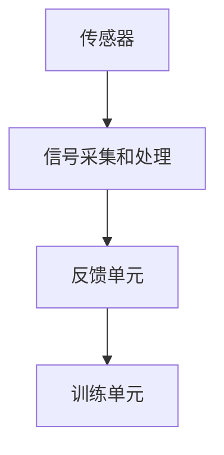

                 

生物反馈是一种通过科技手段监测和分析个体生理和心理状态，并对其进行调节和优化的方法。随着人工智能和大数据技术的不断发展，生物反馈在身心健康管理中的应用前景愈发广阔。本文将探讨生物反馈在身心健康管理中的重要性，核心概念与联系，以及相关算法、数学模型、实际应用案例和未来发展趋势。

## 关键词

生物反馈、身心健康、人工智能、大数据、科技解决方案

## 摘要

本文旨在探讨生物反馈技术在身心健康管理中的应用。通过介绍生物反馈的核心概念，解析其在人工智能和大数据背景下的技术原理和实现方法，本文还分析了生物反馈在不同领域的实际应用，并对其未来发展趋势进行了展望。

### 1. 背景介绍

### 1.1 生物反馈的概念

生物反馈是一种利用电子仪器将个体的生理或心理活动转化为可感知的信号，并通过训练使其发生改变的反馈过程。这种技术最早应用于上世纪50年代的医学领域，主要针对压力管理、疼痛控制等方面。随着科技的进步，生物反馈技术逐渐扩展到心理健康、运动康复、睡眠优化等多个领域。

### 1.2 人工智能与大数据对生物反馈的赋能

人工智能和大数据技术的迅猛发展，为生物反馈提供了强大的技术支持。通过深度学习算法，可以对海量的生物信号数据进行实时分析，提取有价值的信息。而大数据技术则可以帮助我们建立更为全面的健康档案，实现个性化健康管理和预测。

### 2. 核心概念与联系

#### 2.1 生物反馈原理

生物反馈的基本原理是利用传感器采集个体的生理信号，如心率、血压、脑电波等，通过电子仪器将这些信号转化为可以感知的信号，如声音、视觉等。个体通过训练，学会调节自己的生理状态，以达到改善身心健康的目的。

#### 2.2 生物反馈架构

生物反馈系统通常由传感器、信号采集和处理单元、反馈单元和训练单元组成。传感器负责采集个体的生理信号，信号采集和处理单元对信号进行放大、滤波、数字化等处理，反馈单元将处理后的信号以可视化或听觉形式呈现给个体，训练单元则根据个体的反馈调整训练策略。

#### 2.3 Mermaid 流程图



### 3. 核心算法原理 & 具体操作步骤

#### 3.1 算法原理概述

生物反馈的核心算法主要包括信号采集、信号处理和反馈调节三个方面。信号采集主要通过传感器实现，信号处理则利用滤波、特征提取等算法对采集到的信号进行处理，反馈调节则根据处理结果对个体进行训练。

#### 3.2 算法步骤详解

1. **信号采集**：利用传感器采集个体的生理信号，如心率、血压、脑电波等。
2. **信号处理**：对采集到的信号进行滤波、放大、数字化等处理，提取有用的生理特征。
3. **反馈调节**：根据处理结果，以可视化或听觉形式反馈给个体，引导个体进行相应的调节训练。

#### 3.3 算法优缺点

**优点**：

- **个性化**：根据个体的生理特征，提供个性化的健康管理和指导。
- **无创性**：通过非侵入性手段获取生理信号，对个体无伤害。
- **实时性**：实时监测和反馈个体生理状态，及时调整训练策略。

**缺点**：

- **复杂性**：生物反馈系统涉及多个学科领域，技术复杂度高。
- **依赖性**：个体需要一定的时间和训练，才能掌握反馈调节的方法。

#### 3.4 算法应用领域

生物反馈技术在身心健康管理中的应用领域广泛，包括但不限于以下方面：

- **心理健康**：用于治疗焦虑、抑郁等心理问题。
- **运动康复**：帮助运动员进行运动康复和训练。
- **睡眠优化**：监测和改善睡眠质量。
- **慢性病管理**：监测和改善慢性病患者的健康状况。

### 4. 数学模型和公式 & 详细讲解 & 举例说明

#### 4.1 数学模型构建

生物反馈系统的数学模型通常包括信号处理模型和反馈调节模型。

1. **信号处理模型**：

$$
X_t = A_s \cdot X_{t-1} + B_s \cdot W_t
$$

其中，$X_t$ 表示当前时刻的信号，$A_s$ 表示信号传递函数，$B_s$ 表示噪声传递函数，$W_t$ 表示噪声。

2. **反馈调节模型**：

$$
Y_t = C_f \cdot X_t + D_f \cdot U_t
$$

其中，$Y_t$ 表示反馈信号，$C_f$ 表示反馈传递函数，$D_f$ 表示调节函数，$U_t$ 表示调节输入。

#### 4.2 公式推导过程

信号处理模型的推导基于信号传递函数和噪声传递函数。假设原始信号 $X_t$ 和噪声 $W_t$ 分别经过信号传递函数 $A_s$ 和噪声传递函数 $B_s$ 的作用，得到当前时刻的信号 $X_t$。

对于反馈调节模型，假设反馈信号 $Y_t$ 经过反馈传递函数 $C_f$ 和调节函数 $D_f$ 的作用，得到调节输入 $U_t$。

#### 4.3 案例分析与讲解

以心率变异性（HRV）为例，分析生物反馈在心理健康中的应用。

1. **信号采集**：利用心率传感器采集个体在不同情绪状态下的心率信号。

2. **信号处理**：对心率信号进行滤波和特征提取，提取出HRV指标，如标准差（SDNN）、频率域指标等。

3. **反馈调节**：根据HRV指标，通过生物反馈系统，引导个体调整呼吸、放松身体，以达到调节情绪的目的。

### 5. 项目实践：代码实例和详细解释说明

#### 5.1 开发环境搭建

1. **硬件环境**：一台装有心率传感器的设备。
2. **软件环境**：Python 3.8及以上版本，matplotlib、numpy等库。

#### 5.2 源代码详细实现

```python
import numpy as np
import matplotlib.pyplot as plt

def heart_rate_variation(x):
    # 心率变异性计算
    sdnn = np.std(x)
    freq_domain = np.abs(np.fft.fft(x))
    freq_domain = 2 * np.pi * freq_domain / len(x)
    return sdnn, freq_domain

def plot_hrv(sdnn, freq_domain):
    # HRV指标可视化
    plt.figure(figsize=(10, 5))
    plt.subplot(1, 2, 1)
    plt.plot(sdnn)
    plt.title('HRV - Standard Deviation of NN Intervals')
    plt.xlabel('Time (s)')
    plt.ylabel('SDNN (ms)')

    plt.subplot(1, 2, 2)
    plt.plot(freq_domain)
    plt.title('HRV - Frequency Domain')
    plt.xlabel('Frequency (Hz)')
    plt.ylabel('Amplitude')
    plt.show()

# 示例数据
x = np.random.normal(60, 10, 1000)
sdnn, freq_domain = heart_rate_variation(x)
plot_hrv(sdnn, freq_domain)
```

#### 5.3 代码解读与分析

上述代码实现了一个简单的HRV计算和可视化工具。首先，我们定义了一个名为`heart_rate_variation`的函数，用于计算心率变异性指标。接着，我们定义了一个名为`plot_hrv`的函数，用于可视化HRV指标。最后，我们使用示例数据进行计算和可视化。

### 6. 实际应用场景

#### 6.1 心理健康

生物反馈技术在心理健康领域的应用主要包括焦虑、抑郁等心理问题的治疗。例如，通过调节呼吸、放松身体，可以帮助患者缓解焦虑和抑郁情绪。

#### 6.2 运动康复

生物反馈技术在运动康复中的应用主要表现在运动员的训练和康复过程中。通过实时监测和反馈运动员的生理状态，可以帮助教练和运动员调整训练方案，提高训练效果。

#### 6.3 睡眠优化

生物反馈技术在睡眠优化中的应用包括监测睡眠质量、分析睡眠周期等。通过实时反馈，可以帮助用户调整睡眠习惯，改善睡眠质量。

### 7. 未来应用展望

随着人工智能和大数据技术的不断发展，生物反馈在身心健康管理中的应用前景十分广阔。未来，生物反馈技术有望在以下几个方向得到进一步发展：

- **个性化健康评估**：通过更精准的生理信号采集和分析，实现个性化健康评估和预警。
- **智能健康管理**：结合人工智能技术，实现智能化的健康管理和指导。
- **远程医疗**：利用生物反馈技术，实现远程医疗诊断和治疗。

### 8. 工具和资源推荐

#### 8.1 学习资源推荐

- 《生物反馈技术与应用》
- 《人工智能与身心健康管理》
- 《大数据技术基础》

#### 8.2 开发工具推荐

- Python
- MATLAB
- TensorFlow

#### 8.3 相关论文推荐

- “Application of Biofeedback in Mental Health”
- “Artificial Intelligence for Health and Healthcare”
- “Big Data in Health Informatics”

### 9. 总结：未来发展趋势与挑战

#### 9.1 研究成果总结

生物反馈技术在身心健康管理中取得了显著成果，已成为一种有效的健康干预手段。随着人工智能和大数据技术的不断进步，生物反馈技术将迎来更多的发展机遇。

#### 9.2 未来发展趋势

- **个性化健康评估**：利用深度学习和大数据技术，实现更加精准的健康评估。
- **智能健康管理**：结合智能设备和人工智能技术，实现智能化的健康管理和指导。
- **跨学科融合**：生物反馈技术与其他学科领域的融合，推动身心健康管理的发展。

#### 9.3 面临的挑战

- **技术复杂度**：生物反馈系统涉及多个学科领域，技术复杂度高。
- **数据隐私**：生物信号数据的采集和处理，需要保护用户隐私。
- **用户接受度**：提高用户对生物反馈技术的接受度和使用频率。

#### 9.4 研究展望

未来，生物反馈技术将在身心健康管理领域发挥更为重要的作用。通过跨学科合作，不断探索和创新，生物反馈技术将为人们带来更健康、更智能的生活方式。

### 10. 附录：常见问题与解答

#### 10.1 生物反馈技术是什么？

生物反馈技术是一种利用科技手段监测和分析个体生理和心理状态，并对其进行调节和优化的方法。

#### 10.2 生物反馈技术有哪些应用领域？

生物反馈技术在心理健康、运动康复、睡眠优化、慢性病管理等多个领域有广泛应用。

#### 10.3 生物反馈技术的优势是什么？

生物反馈技术的优势包括个性化、无创性、实时性等。

#### 10.4 生物反馈技术的未来发展前景如何？

随着人工智能和大数据技术的不断进步，生物反馈技术在身心健康管理领域的应用前景十分广阔。未来，生物反馈技术有望在个性化健康评估、智能健康管理等方面取得重大突破。

# 作者署名

作者：禅与计算机程序设计艺术 / Zen and the Art of Computer Programming
----------------------------------------------------------------


