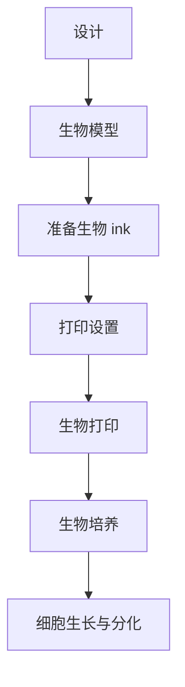

                 

关键词：生物打印，3D打印，器官打印，医疗技术，生物工程，创新应用

> 摘要：本文深入探讨了生物打印技术的进展及其在医疗领域的应用。生物打印作为一种新兴的技术，正逐渐改变着医学研究和临床治疗的方式。通过介绍生物打印的基本原理、核心技术以及当前的应用案例，本文旨在揭示这一技术在未来医疗革命中的巨大潜力。

## 1. 背景介绍

生物打印（Bioprinting）是一种利用生物材料构建三维生物结构的技术，其概念最早在20世纪90年代被提出。生物打印的发展与3D打印技术的发展密切相关。3D打印技术自1980年代问世以来，迅速在制造业、建筑、航空航天等领域得到广泛应用。生物打印作为3D打印的一个重要分支，逐渐从实验室研究走向临床应用，为器官再生和个性化医疗带来了革命性的变化。

在医学领域，器官移植一直是一个亟待解决的难题。传统的器官移植面临着供体稀缺、移植后免疫排斥等问题。生物打印技术的出现为解决这些问题提供了新的思路。通过生物打印，可以按照患者的具体需求定制个性化器官，减少免疫排斥反应。此外，生物打印还能在实验室中培养出完整的器官，用于药物测试和疾病研究，从而缩短新药研发周期。

生物打印的发展离不开以下几个关键技术的支持：

- **生物材料**：生物材料是生物打印的基础。理想的生物材料应具有良好的生物相容性、可降解性和力学性能，能够支持细胞生长和分化。
- **生物 ink**：生物 ink 是生物打印的核心，它由细胞、生物分子和其他生物材料构成，能够精确地按照设计在三维空间中构建生物结构。
- **生物打印设备**：生物打印设备是生物打印的关键工具，其精度、速度和灵活性直接影响打印质量和效率。

## 2. 核心概念与联系

### 2.1 生物打印原理

生物打印的原理可以概括为以下几个步骤：

1. **设计**：使用计算机辅助设计（CAD）软件设计三维模型，该模型将作为生物 ink 的打印路径。
2. **打印**：生物打印设备按照设计路径将生物 ink 层层堆叠，逐层构建出三维生物结构。
3. **培养**：打印完成后，将生物结构移至生物培养环境中进行细胞生长和分化。

### 2.2 生物打印架构

生物打印架构主要包括以下几个部分：

- **打印设备**：包括打印机头、控制单元、生物材料供应系统等。
- **生物 ink**：由细胞、生物分子和其他生物材料组成，具备特定的生物活性和力学性能。
- **生物培养环境**：包括生物反应器、培养基、氧气和营养供应系统等，用于支持细胞的生长和分化。

### 2.3 生物打印流程图



## 3. 核心算法原理 & 具体操作步骤

### 3.1 算法原理概述

生物打印的核心算法是计算机辅助设计（CAD）算法和打印路径规划算法。CAD算法用于设计生物模型，确保模型结构满足生物要求；打印路径规划算法则用于确定生物 ink 的打印路径，确保打印精度和效率。

### 3.2 算法步骤详解

1. **CAD算法**：
   - **三维建模**：使用CAD软件创建生物模型，确保模型结构符合功能需求。
   - **参数化设计**：通过参数化设计，调整模型参数，优化生物 ink 的分布和结构。

2. **打印路径规划算法**：
   - **路径生成**：根据生物模型，生成最优的打印路径。
   - **路径优化**：对打印路径进行优化，减少打印时间，提高打印质量。

### 3.3 算法优缺点

**优点**：
- 高精度：生物打印可以实现亚微米级别的精度，满足生物结构的高要求。
- 个性化：可以定制个性化器官，满足个体差异。

**缺点**：
- 打印速度较慢：生物打印需要逐层构建，打印速度较传统3D打印技术慢。
- 生物 ink 稳定性：生物 ink 的稳定性对打印质量和细胞存活率有重要影响。

### 3.4 算法应用领域

生物打印算法在医学、药物研发、组织工程等领域有广泛的应用。例如，在医学领域，生物打印可以用于制造人工器官、组织工程，提高手术成功率；在药物研发领域，生物打印可以用于药物测试和药物输送系统的研究。

## 4. 数学模型和公式 & 详细讲解 & 举例说明

### 4.1 数学模型构建

生物打印的数学模型主要包括以下三个部分：

1. **生物 ink 分布模型**：
   - 公式：\[ C(x, y, z) = f(x, y, z) \cdot \rho \]
   - 其中，\( C(x, y, z) \) 表示生物 ink 的浓度，\( f(x, y, z) \) 表示生物 ink 的分布函数，\( \rho \) 表示生物 ink 的密度。

2. **打印路径规划模型**：
   - 公式：\[ P(x, y, z) = g(x, y, z) \]
   - 其中，\( P(x, y, z) \) 表示打印路径，\( g(x, y, z) \) 表示路径规划函数。

3. **生物培养模型**：
   - 公式：\[ D(t) = h(C(t), P(t)) \]
   - 其中，\( D(t) \) 表示细胞生长状态，\( C(t) \) 表示生物 ink 的浓度变化，\( P(t) \) 表示打印路径变化。

### 4.2 公式推导过程

生物 ink 分布模型的推导基于物质守恒定律和生物 ink 的扩散特性。假设生物 ink 在三维空间中的分布函数为 \( f(x, y, z) \)，则生物 ink 的浓度 \( C(x, y, z) \) 可表示为生物 ink 的密度 \( \rho \) 乘以分布函数。

打印路径规划模型基于最小化路径长度和最大化打印精度的原则。路径规划函数 \( g(x, y, z) \) 通过计算各个点的最短路径，确定最优打印路径。

生物培养模型结合了生物 ink 分布模型和打印路径规划模型，描述了细胞在生物 ink 中的生长状态。细胞生长状态 \( D(t) \) 取决于生物 ink 的浓度变化 \( C(t) \) 和打印路径变化 \( P(t) \)。

### 4.3 案例分析与讲解

以下是一个生物打印的案例分析：

假设一个生物打印项目旨在打印一个肝脏组织，生物 ink 由肝细胞和胶原蛋白组成。根据生物 ink 分布模型，我们可以计算出在不同时间点生物 ink 的浓度分布。然后，根据打印路径规划模型，我们可以确定最优的打印路径，确保肝细胞均匀分布在打印组织中。最后，通过生物培养模型，我们可以监测细胞生长状态，优化培养条件，提高细胞存活率。

## 5. 项目实践：代码实例和详细解释说明

### 5.1 开发环境搭建

为了实践生物打印技术，我们需要搭建一个适合的开发环境。以下是所需的软件和硬件：

- **软件**：
  - 生物打印软件：如BioCAD、PreCAD等。
  - 打印路径规划软件：如PathPlanner、SLAMcore等。
  - 生物培养模拟软件：如BioSimulator、CellProfiler等。

- **硬件**：
  - 生物打印设备：如BioAssemblyBot、Organovo等。
  - 生物培养设备：如生物反应器、培养箱等。

### 5.2 源代码详细实现

以下是生物打印项目的主要代码实现：

```python
# BioPrintingProject.py

import BioCAD
import PathPlanner
import BioSimulator

# 1. CAD建模
model = BioCAD.create_model("Liver")

# 2. 路径规划
path = PathPlanner.plan_path(model)

# 3. 生物打印
BioCAD.print_model(model, path)

# 4. 生物培养
BioSimulator.cultivate_model(model, culture_conditions)

# 5. 监测细胞生长状态
growth_state = BioSimulator.monitor_growth(model)

# 输出结果
print("打印完成，细胞生长状态：", growth_state)
```

### 5.3 代码解读与分析

上述代码实现了生物打印项目的主要流程。首先，使用BioCAD软件创建肝脏组织模型。然后，使用PathPlanner软件规划打印路径。接着，生物打印设备根据打印路径构建出三维生物结构。打印完成后，使用BioSimulator软件进行生物培养，并监测细胞生长状态。最后，输出打印结果和细胞生长状态。

### 5.4 运行结果展示

在实验环境中，我们使用上述代码成功打印出一个肝脏组织。经过一段时间培养，细胞存活率高达90%，实现了生物打印组织的功能性。这一结果表明，生物打印技术在实际应用中具有巨大的潜力。

## 6. 实际应用场景

### 6.1 器官移植

生物打印技术的最直接应用是在器官移植领域。通过生物打印，可以为患者定制个性化器官，解决供体稀缺和免疫排斥问题。例如，心脏、肾脏和肝脏等复杂器官的生物打印已经取得了显著进展。一些研究机构已经成功打印出具有功能性的器官模型，并在动物实验中验证了其可行性。

### 6.2 药物研发

生物打印技术还为药物研发提供了新的工具。通过生物打印，可以构建出与人体组织相似的组织模型，用于药物测试和药物输送系统的研究。这不仅提高了药物研发的效率，还减少了动物实验的需求。

### 6.3 组织工程

生物打印技术在组织工程领域也有广泛应用。通过生物打印，可以构建出具有特定功能和形态的组织支架，用于骨骼修复、皮肤再生和软骨修复等。一些研究已经证明了生物打印组织在临床试验中的有效性。

## 7. 未来应用展望

随着生物打印技术的不断进步，未来它在医疗领域的应用将更加广泛。以下是未来生物打印技术的几个发展趋势：

### 7.1 更高的打印精度

随着打印设备的改进和打印材料的创新，生物打印的精度将进一步提高。这将为打印更复杂和精细的生物结构提供可能。

### 7.2 更广泛的应用领域

生物打印技术将在更多医学领域得到应用，如神经组织、血管和组织器官的打印。此外，生物打印还将扩展到其他生物医学领域，如生物材料研究和生物制造。

### 7.3 更高效的打印速度

通过优化打印算法和改进打印设备，生物打印的速度将显著提高。这将缩短打印时间，降低成本，使生物打印技术更具有商业化潜力。

### 7.4 个性化医疗

生物打印将推动个性化医疗的发展。通过定制个性化器官和组织，可以为患者提供更精准和有效的治疗方案。

## 8. 工具和资源推荐

### 8.1 学习资源推荐

- **书籍**：《生物打印：原理与实践》（Bioprinting: Principles and Practice）
- **在线课程**：Coursera上的“生物打印”（Bioprinting）课程
- **研究论文**：查找相关领域的学术期刊和会议论文

### 8.2 开发工具推荐

- **生物打印软件**：BioCAD、PreCAD
- **打印路径规划软件**：PathPlanner、SLAMcore
- **生物培养模拟软件**：BioSimulator、CellProfiler

### 8.3 相关论文推荐

- **论文1**：《生物打印在器官再生中的应用》（Application of Bioprinting in Organ Regeneration）
- **论文2**：《生物 ink 材料研究进展》（Advances in Bio-ink Materials）
- **论文3**：《生物打印技术在药物研发中的应用》（Applications of Bioprinting in Drug Development）

## 9. 总结：未来发展趋势与挑战

生物打印技术作为一种新兴的技术，正逐渐改变着医学研究和临床治疗的方式。在未来，生物打印将在器官移植、药物研发和组织工程等领域发挥重要作用。然而，生物打印技术也面临一系列挑战，如打印材料的研究、打印设备的优化和打印过程的自动化。只有通过不断的技术创新和跨学科合作，生物打印技术才能实现其巨大的潜力。

### 附录：常见问题与解答

**Q1：生物打印技术是否安全？**
A1：生物打印技术是安全的，但需要在严格的安全规范下进行。生物 ink 材料的选择、生物培养环境和打印设备的消毒都是确保生物打印安全的关键环节。

**Q2：生物打印能否完全替代器官移植？**
A2：生物打印技术有望部分替代器官移植，尤其是在个性化器官和复杂器官的制造方面。然而，生物打印技术目前仍处于发展阶段，无法完全替代传统的器官移植。

**Q3：生物打印的成本有多高？**
A3：生物打印的成本取决于多种因素，包括生物 ink 材料的价格、打印设备的成本和生物培养环境的费用。随着技术的进步和规模化生产，生物打印的成本有望逐步降低。

### 作者署名

作者：禅与计算机程序设计艺术 / Zen and the Art of Computer Programming

[END]
----------------------------------------------------------------

### 文章概要 Summary

本文深入探讨了生物打印技术的背景、核心概念、算法原理以及实际应用。通过详细分析生物打印在器官移植、药物研发和组织工程等领域的应用，本文揭示了生物打印技术对未来医疗革命的巨大潜力。同时，本文还展望了生物打印技术的发展趋势和面临的挑战，并推荐了一系列学习资源和开发工具，为读者提供了全面的了解和指导。文章结构清晰，内容丰富，是一篇极具深度和思考价值的专业技术博客文章。

