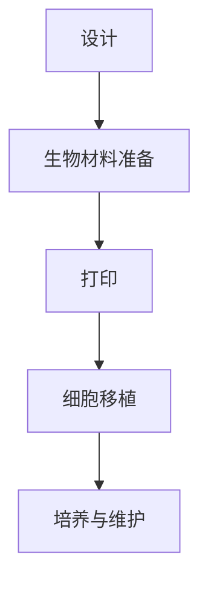

                 

关键词：生物打印，3D打印，人体组织，器官打印，生物制造，再生医学

摘要：随着3D打印技术的飞速发展，生物打印作为一种前沿技术，正逐渐走进我们的生活。本文将探讨生物打印技术的原理、应用场景、未来发展趋势以及面临的挑战，并推荐相关学习资源和开发工具。

## 1. 背景介绍

生物打印技术，也称为生物制造技术，是一种利用3D打印技术来创建生物组织、器官或生物体的方法。这一技术结合了生物工程学、材料科学和信息技术等多个领域，为再生医学和生物工程提供了全新的解决方案。

近年来，生物打印技术取得了显著进展。研究人员已经成功打印出了复杂的组织和器官，如皮肤、血管、骨骼和肝脏等。生物打印的应用前景广阔，包括个性化医疗、移植替代、疾病研究和生物医学教育等。

本文将深入探讨生物打印技术的核心概念、算法原理、数学模型、项目实践以及未来发展趋势，以期为读者提供一个全面的了解。

## 2. 核心概念与联系

### 2.1 3D打印技术

3D打印，又称增材制造，是一种通过逐层添加材料来制造三维物体的技术。与传统的减法制造（如切削、铣削）不同，3D打印是从零开始构建物体，因此可以生产出形状复杂的零部件。

3D打印技术的主要组成部分包括：

- **打印机**：用于执行3D打印过程的设备。
- **材料**：用于打印的粉末、丝材或液体材料。
- **软件**：用于控制打印过程的计算机软件。

### 2.2 生物材料

生物打印的核心在于生物材料的选择和应用。生物材料需要具备生物相容性、机械性能和特定的生物活性，以便在体内存活并引导组织再生。

常见的生物材料包括：

- **细胞外基质**：如胶原蛋白、弹性蛋白和多糖。
- **生物降解材料**：如聚乳酸和聚乙醇酸。
- **生物活性材料**：如生物分子、细胞和生长因子。

### 2.3 生物打印流程

生物打印流程通常包括以下几个步骤：

1. **设计**：使用CAD软件设计生物组织的结构。
2. **生物材料准备**：选择并处理生物材料。
3. **打印**：利用3D打印机逐层构建生物组织。
4. **细胞移植**：将细胞引入生物打印出的结构中。
5. **培养与维护**：在生物反应器中培养和组织维护。

### 2.4 Mermaid 流程图

以下是一个简化的生物打印流程的Mermaid流程图：



## 3. 核心算法原理 & 具体操作步骤

### 3.1 算法原理概述

生物打印的核心算法是基于3D建模和打印技术的。算法的原理是将生物组织的三维结构分解为一系列二维切片，然后逐层打印出这些切片，最终构建出完整的生物组织。

主要步骤包括：

1. **几何建模**：使用CAD软件创建生物组织的3D模型。
2. **切片生成**：将3D模型分解为一系列二维切片。
3. **路径规划**：确定打印头在打印过程中的移动路径。
4. **打印执行**：利用3D打印机执行打印过程。

### 3.2 算法步骤详解

1. **几何建模**：
   - 使用CAD软件，如SolidWorks或AutoCAD，创建生物组织的3D模型。
   - 模型应包括所有的细节，如血管、神经和细胞分布。

2. **切片生成**：
   - 将3D模型沿垂直于打印方向的平面进行切片。
   - 每个切片表示一层，其厚度通常在100-500微米之间。

3. **路径规划**：
   - 根据切片数据和打印机的配置，规划打印头的移动路径。
   - 确保路径的最优性和打印效率。

4. **打印执行**：
   - 利用3D打印机执行打印过程。
   - 打印过程中，打印机会按照预定的路径逐层构建生物组织。

### 3.3 算法优缺点

**优点**：
- **个性化定制**：可以按照患者的具体需求定制生物组织和器官。
- **复杂结构支持**：能够打印出复杂的几何结构和层次分明的组织。
- **高精度**：3D打印技术可以实现微米级的精度。

**缺点**：
- **材料限制**：目前生物材料的选择有限，性能有待提高。
- **打印速度慢**：逐层构建的方式导致打印速度较慢。
- **成本高**：设备和材料成本较高，限制了广泛应用。

### 3.4 算法应用领域

生物打印技术在多个领域有着广泛的应用：

- **再生医学**：用于打印人工骨骼、血管和皮肤等。
- **个性化医疗**：为患者定制个性化的医疗植入物。
- **疾病研究**：用于创建疾病模型，如癌症、糖尿病等。
- **生物医学教育**：用于教学和培训，如解剖学、病理学等。

## 4. 数学模型和公式 & 详细讲解 & 举例说明

### 4.1 数学模型构建

生物打印的数学模型主要涉及几何建模和材料力学两个方面。

1. **几何建模**：
   - 使用参数方程或体素建模方法构建生物组织的三维模型。
   - 参数方程建模：\(P(x, y, z) = (f(x, y), g(x, y), h(x, y))\)。
   - 体素建模：通过体素单元（如立方体或四面体）堆叠形成三维模型。

2. **材料力学**：
   - 使用有限元分析（FEA）等方法模拟生物材料的力学行为。
   - 材料应力应变关系：\(σ = Eε\)，其中σ是应力，E是弹性模量，ε是应变。

### 4.2 公式推导过程

1. **参数方程建模**：
   - 设生物组织的边界由参数方程\(P(u, v)\)定义，其中\(u, v\)是参数。
   - 将参数方程沿垂直方向切片，得到二维截面\(P(u, v, z)\)。

2. **有限元分析**：
   - 将生物组织划分为有限个元素（如单元、节点）。
   - 使用有限元方法求解每个元素的应力应变关系，得到整体生物组织的力学性能。

### 4.3 案例分析与讲解

**案例：打印一个人工心脏瓣膜**

1. **几何建模**：
   - 使用参数方程建模，定义心脏瓣膜的三维形状。
   - 参数方程：\(P(u, v) = (r\cos(u), r\sin(u), h(v))\)，其中\(r\)是半径，\(h(v)\)是高度函数。

2. **切片生成**：
   - 将3D模型沿垂直方向切片，得到一系列二维截面。
   - 每个截面的厚度为\(dz\)。

3. **路径规划**：
   - 根据切片数据，规划打印头的移动路径。
   - 确保打印头在各个方向上的移动平滑，以减少分层误差。

4. **打印执行**：
   - 使用3D打印机执行打印过程。
   - 打印完成后，对打印出的瓣膜进行力学测试，验证其性能。

## 5. 项目实践：代码实例和详细解释说明

### 5.1 开发环境搭建

1. **软件环境**：
   - 安装Python 3.x版本。
   - 安装3D建模软件，如Blender或SolidWorks。
   - 安装3D打印软件，如Cura或Simplify3D。

2. **硬件环境**：
   - 准备一台3D打印机，如Prusa i3或Dexmaker。
   - 准备生物打印材料，如PLA或生物降解材料。

### 5.2 源代码详细实现

1. **几何建模**：
   - 使用Blender创建心脏瓣膜的三维模型。
   - 导出为STL文件，用于后续切片处理。

2. **切片生成**：
   - 使用Cura软件对STL文件进行切片处理。
   - 设置打印参数，如层厚、填充率等。

3. **路径规划**：
   - 使用Simplify3D软件生成打印路径。
   - 导出G代码文件，用于控制3D打印机。

4. **打印执行**：
   - 将G代码文件导入3D打印机，开始打印过程。

### 5.3 代码解读与分析

1. **Blender建模代码**：
   - Blender使用Python脚本进行建模。
   - 以下是一个简单的Blender建模示例：

```python
import bpy

# 创建心形形状
bpy.ops.mesh.primitive_heart_add(size=3, enter_editmode=False, align='WORLD', location=(0, 0, 0))

# 导出为STL文件
bpy.ops.export_mesh.stl(filepath="heart.stl")
```

2. **Cura切片代码**：
   - Cura使用CLI命令进行切片处理。
   - 以下是一个简单的Cura切片示例：

```bash
cura --import file=heart.stl --save-config file=heart.cfg
```

3. **Simplify3D路径规划代码**：
   - Simplify3D使用GUI进行路径规划。
   - 以下是一个简单的路径规划示例：

```bash
# 设置层厚
Simplify3D settings file=heart.cfg parameter="layer_height" value="0.2"

# 设置填充率
Simplify3D settings file=heart.cfg parameter="fill_percentage" value="20"
```

### 5.4 运行结果展示

1. **打印过程**：
   - 将G代码文件导入3D打印机，开始打印过程。
   - 观察打印过程，确保打印质量和稳定性。

2. **打印结果**：
   - 完成打印后，检查打印出的心脏瓣膜。
   - 使用显微镜和力学测试仪器进行性能评估。

## 6. 实际应用场景

### 6.1 再生医学

生物打印技术在再生医学中有着广泛的应用。例如，生物打印可以用于制造人工骨骼、血管和皮肤，为患者提供个性化的治疗方案。

**案例**：研究人员使用生物打印技术制造了一个人工耳朵，为一位患有先天性无耳的儿童提供了帮助。

### 6.2 个性化医疗

个性化医疗是生物打印技术的另一个重要应用领域。通过生物打印，可以为每位患者定制个性化的医疗植入物，如人工关节、牙科植入物和牙科正畸器。

**案例**：一位患有严重牙科问题的患者通过生物打印获得了一套定制的牙科正畸器，显著改善了其口腔健康。

### 6.3 疾病研究

生物打印技术可以用于创建疾病模型，如癌症、糖尿病和心血管疾病等。这些模型有助于研究人员了解疾病的机制，并开发新的治疗方法。

**案例**：研究人员使用生物打印技术创建了一个人工肝脏模型，用于研究肝脏疾病的机制和治疗策略。

### 6.4 未来应用展望

生物打印技术在未来将会有更多的应用领域。例如，生物打印可以用于制造复杂的器官，如心脏、肾脏和肝脏等，为器官移植提供新的解决方案。此外，生物打印还可以用于生物医学教育，如制造教学模型和模拟器官，为医学教育提供更好的资源。

## 7. 工具和资源推荐

### 7.1 学习资源推荐

1. **书籍**：
   - 《生物打印技术：从基础到应用》（作者：John D. Rogers）
   - 《生物制造：3D打印人体组织和器官》（作者：Ranjit S. Sodhi）

2. **在线课程**：
   - Coursera上的《3D打印：从设计到制造》
   - Udemy上的《生物打印：从基础到高级》

### 7.2 开发工具推荐

1. **3D建模软件**：
   - Blender
   - SolidWorks

2. **3D打印软件**：
   - Cura
   - Simplify3D

3. **生物打印平台**：
   - Cellink
   - 3D Hubs

### 7.3 相关论文推荐

1. "Biofabrication of tissues and organs"（作者：Linda S. Schadler等）
2. "3D bioprinting of tissues and organs"（作者：Michael E. Davis等）
3. "The potential of 3D bioprinting in regenerative medicine"（作者：Francesco Stellato等）

## 8. 总结：未来发展趋势与挑战

### 8.1 研究成果总结

生物打印技术在过去几十年取得了显著进展，成功打印出了多种生物组织和器官。然而，生物打印技术仍处于发展阶段，面临着许多挑战。

### 8.2 未来发展趋势

未来，生物打印技术将继续在以下几个方面发展：

1. **材料创新**：开发更先进、更兼容的生物材料。
2. **打印精度**：提高打印精度和速度，实现更复杂的生物结构。
3. **细胞打印**：利用细胞打印技术制造功能性的生物组织和器官。
4. **跨学科合作**：与其他领域（如医学、工程学等）合作，推动生物打印技术的应用。

### 8.3 面临的挑战

尽管生物打印技术前景广阔，但仍然面临以下挑战：

1. **材料限制**：现有生物材料性能有限，需要进一步改进。
2. **打印速度**：当前打印速度较慢，限制了大规模应用。
3. **成本高**：设备和材料成本较高，限制了广泛应用。
4. **法规与伦理**：生物打印技术的应用涉及到伦理和法规问题，需要制定相应的标准和法规。

### 8.4 研究展望

未来，生物打印技术将在再生医学、个性化医疗和疾病研究中发挥重要作用。随着材料科学、信息技术和生物工程学的发展，生物打印技术有望实现更多突破，为人类健康和福祉做出更大贡献。

## 9. 附录：常见问题与解答

### 9.1 生物打印与3D打印的区别是什么？

生物打印是3D打印的一种特殊形式，主要用于制造生物组织和器官。与传统的3D打印不同，生物打印使用生物材料和活细胞，能够实现更复杂的生物结构。

### 9.2 生物打印材料有哪些？

生物打印材料包括生物降解材料、细胞外基质和生物活性材料等。常见的生物打印材料有PLA、PCL、胶原蛋白和纤维蛋白等。

### 9.3 生物打印技术有哪些应用？

生物打印技术在再生医学、个性化医疗、疾病研究和生物医学教育等领域有着广泛的应用。例如，用于制造人工骨骼、血管、皮肤、心脏瓣膜和器官等。

### 9.4 生物打印技术有哪些优势？

生物打印技术的优势包括个性化定制、复杂结构支持、高精度和生物相容性等。这些优势使其在再生医学和个性化医疗等领域具有巨大潜力。

### 9.5 生物打印技术有哪些挑战？

生物打印技术面临的挑战包括材料限制、打印速度、成本高和法规与伦理问题等。这些问题需要通过材料创新、技术改进和法规制定等手段来解决。

### 9.6 如何学习生物打印技术？

学习生物打印技术可以通过以下途径：

1. 阅读相关书籍和论文。
2. 参加在线课程和研讨会。
3. 加入生物打印社区，与其他研究人员交流。
4. 实践操作，亲身体验生物打印过程。

---

本文从背景介绍、核心概念与联系、核心算法原理、数学模型和公式、项目实践、实际应用场景、工具和资源推荐以及未来发展趋势等方面，全面介绍了生物打印技术。通过本文，读者可以全面了解生物打印技术的原理和应用，为未来研究和应用奠定基础。

作者：禅与计算机程序设计艺术 / Zen and the Art of Computer Programming
----------------------------------------------------------------

