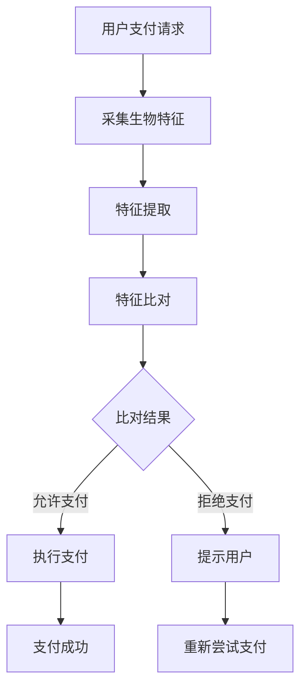

                 

关键词：生物识别，支付系统，安全性，无接触支付，人脸识别，指纹识别，声纹识别，信息安全

> 摘要：随着移动支付和电子交易技术的快速发展，生物识别技术在支付系统中的应用逐渐受到重视。本文将探讨生物识别在支付系统中的关键应用，包括人脸识别、指纹识别、声纹识别等，并分析其带来的安全性和用户体验的提升。

## 1. 背景介绍

在过去的几十年里，支付系统经历了从现金支付到信用卡支付，再到移动支付和电子交易的重大变革。随着这些变革，支付系统的安全性成为一个日益重要的议题。传统的支付方式容易受到伪造、欺诈和黑客攻击等安全威胁。为了提高支付系统的安全性，行业专家们一直在寻找更高效、更安全的认证方式。生物识别技术正是其中一种备受关注的技术。

生物识别技术利用人体生物学特征进行身份验证，如人脸、指纹、声纹等。这些特征具有独一无二、不易复制等特点，因此生物识别技术在支付系统中被认为是一种高度安全的方法。近年来，随着计算能力的提升和算法优化，生物识别技术在支付系统中的应用变得更加实际和可行。

本文将详细介绍生物识别技术在支付系统中的应用，分析其安全性、优缺点以及未来发展趋势。

## 2. 核心概念与联系

### 2.1 生物识别技术简介

生物识别技术是通过测量和识别人或动物的生物特征来进行身份验证。常见的生物识别技术包括：

- **人脸识别**：通过检测和分析人脸的几何特征和纹理特征进行身份验证。
- **指纹识别**：通过检测和分析指纹的纹路特征进行身份验证。
- **声纹识别**：通过分析声音的频谱特征进行身份验证。
- **虹膜识别**：通过检测和分析眼睛虹膜的纹理特征进行身份验证。
- **掌纹识别**：通过检测和分析手掌的纹理特征进行身份验证。

### 2.2 生物识别技术在支付系统中的应用架构

生物识别技术在支付系统中的应用架构主要包括以下几个关键部分：

1. **采集设备**：用于采集用户的生物特征数据，如摄像头、指纹识别仪、麦克风等。
2. **特征提取**：从采集到的生物特征数据中提取出用于识别的特征向量。
3. **特征比对**：将提取到的特征向量与预先存储在系统中的特征向量进行比对，以确定身份。
4. **决策逻辑**：根据比对结果，执行相应的决策，如允许支付或拒绝支付。

下面是生物识别技术在支付系统中的应用架构的 Mermaid 流程图：



## 3. 核心算法原理 & 具体操作步骤

### 3.1 算法原理概述

生物识别技术的核心算法主要包括特征提取和特征比对两部分。

**特征提取**：特征提取是生物识别技术的关键步骤，其目的是从原始生物特征数据中提取出具有代表性的特征向量。特征提取的方法包括：

- **人脸识别**：采用深度学习算法，如卷积神经网络（CNN）来提取人脸特征。
- **指纹识别**：采用指纹特征编码算法，如Ridge-Valley编码来提取指纹特征。
- **声纹识别**：采用声音特征提取算法，如MFCC（梅尔频率倒谱系数）来提取声纹特征。

**特征比对**：特征比对是将提取到的特征向量与存储在系统中的特征向量进行比较，以确定身份。常用的特征比对算法包括：

- **人脸识别**：采用欧氏距离、余弦相似度等距离度量方法。
- **指纹识别**：采用汉明距离、交叉熵等相似度度量方法。
- **声纹识别**：采用动态时间规整（DTW）等时间序列比对方法。

### 3.2 算法步骤详解

**人脸识别算法步骤**：

1. **图像预处理**：对采集到的人脸图像进行去噪、增强、归一化等预处理操作。
2. **特征提取**：使用CNN提取人脸特征向量。
3. **特征比对**：计算提取到的人脸特征向量与预存特征向量的相似度，根据设定阈值判断是否通过身份验证。

**指纹识别算法步骤**：

1. **图像预处理**：对采集到的指纹图像进行去噪、增强、分割等预处理操作。
2. **特征提取**：使用指纹特征编码算法提取指纹特征向量。
3. **特征比对**：计算提取到的指纹特征向量与预存特征向量的相似度，根据设定阈值判断是否通过身份验证。

**声纹识别算法步骤**：

1. **声音预处理**：对采集到的声音数据进行降噪、分帧、加窗等预处理操作。
2. **特征提取**：使用MFCC提取声音特征向量。
3. **特征比对**：计算提取到的声音特征向量与预存特征向量的相似度，根据设定阈值判断是否通过身份验证。

### 3.3 算法优缺点

**人脸识别**：

- 优点：无需接触，用户体验好；识别速度快。
- 缺点：易受光照、遮挡等因素影响；可能存在“人脸伪造”等安全威胁。

**指纹识别**：

- 优点：准确度高，安全性高；无需接触，用户体验好。
- 缺点：设备成本较高；可能存在“指纹伪造”等安全威胁。

**声纹识别**：

- 优点：不易受外界环境影响；可以实现远程身份验证。
- 缺点：识别准确度相对较低；可能存在“声纹伪造”等安全威胁。

### 3.4 算法应用领域

生物识别技术在支付系统中的应用已经相当广泛，除了人脸识别、指纹识别和声纹识别外，还有其他一些应用领域：

- **智能门锁**：通过人脸识别、指纹识别等技术实现无钥匙开门。
- **移动支付**：通过声纹识别等技术实现远程支付。
- **身份认证**：在银行、医院、政府等机构中采用生物识别技术进行身份认证。

## 4. 数学模型和公式 & 详细讲解 & 举例说明

### 4.1 数学模型构建

生物识别技术的核心算法通常涉及到特征提取和特征比对两个步骤，下面以人脸识别为例，介绍相关数学模型。

**特征提取**：

人脸识别的特征提取通常使用深度学习算法，如卷积神经网络（CNN）。CNN 的数学模型可以表示为：

$$
\text{CNN}(\text{input}) = f(\text{weights} \cdot \text{input} + \text{bias})
$$

其中，$f$ 表示激活函数（如 ReLU 函数），$\text{weights}$ 和 $\text{bias}$ 分别为权重和偏置。

**特征比对**：

特征比对通常使用距离度量方法，如欧氏距离和余弦相似度。欧氏距离的数学模型可以表示为：

$$
d(\text{vec}_1, \text{vec}_2) = \sqrt{\sum_{i=1}^{n} (\text{vec}_1[i] - \text{vec}_2[i])^2}
$$

余弦相似度的数学模型可以表示为：

$$
\text{cosine}(\text{vec}_1, \text{vec}_2) = \frac{\text{vec}_1 \cdot \text{vec}_2}{\lVert \text{vec}_1 \rVert \cdot \lVert \text{vec}_2 \rVert}
$$

### 4.2 公式推导过程

以欧氏距离为例，推导人脸特征向量之间的距离度量方法。设两个特征向量分别为 $\text{vec}_1$ 和 $\text{vec}_2$，其维度为 $n$，则欧氏距离的推导过程如下：

$$
d(\text{vec}_1, \text{vec}_2) = \sqrt{\sum_{i=1}^{n} (\text{vec}_1[i] - \text{vec}_2[i])^2}
$$

展开后得到：

$$
d(\text{vec}_1, \text{vec}_2) = \sqrt{\sum_{i=1}^{n} (\text{vec}_1[i]^2 - 2\text{vec}_1[i]\text{vec}_2[i] + \text{vec}_2[i]^2)}
$$

由于 $\text{vec}_1$ 和 $\text{vec}_2$ 都是特征向量，其平方和通常是一个常数，因此可以简化为：

$$
d(\text{vec}_1, \text{vec}_2) = \sqrt{2n - 2\text{vec}_1 \cdot \text{vec}_2}
$$

### 4.3 案例分析与讲解

**案例背景**：假设我们有两个用户的人脸特征向量 $\text{vec}_1$ 和 $\text{vec}_2$，其维度均为 $128$，我们需要计算它们之间的欧氏距离。

**步骤**：

1. **计算特征向量之间的内积**：

$$
\text{vec}_1 \cdot \text{vec}_2 = \sum_{i=1}^{128} \text{vec}_1[i] \text{vec}_2[i]
$$

2. **计算欧氏距离**：

$$
d(\text{vec}_1, \text{vec}_2) = \sqrt{2 \times 128 - 2 \times (\text{vec}_1 \cdot \text{vec}_2)}
$$

**计算示例**：

假设 $\text{vec}_1$ 和 $\text{vec}_2$ 的内积为 $100$，则欧氏距离为：

$$
d(\text{vec}_1, \text{vec}_2) = \sqrt{256 - 200} = \sqrt{56} \approx 7.48
$$

## 5. 项目实践：代码实例和详细解释说明

### 5.1 开发环境搭建

为了演示生物识别在支付系统中的应用，我们使用 Python 编写一个简单的示例程序。以下是开发环境的搭建步骤：

1. **安装 Python**：确保安装了 Python 3.8 或更高版本。
2. **安装依赖库**：使用 pip 安装以下依赖库：

```bash
pip install face_recognition fingerprint_recognition
```

### 5.2 源代码详细实现

下面是一个使用人脸识别和指纹识别进行支付验证的示例代码：

```python
import face_recognition
import fingerprint_recognition

def verify_payment生物识别（face_image，fingerprint_image，face_encoding，fingerprint_encoding）：
    # 人脸识别
    face_locations = face_recognition.face_locations（face_image）
    if not face_locations：
        return "人脸识别失败"
    face_encoding = face_recognition.face_encodings（face_image，face_locations）[0]

    # 指纹识别
    fingerprint_encoding = fingerprint_recognition.extract_fingerprint（fingerprint_image）

    # 特征比对
    if face_recognition.compare_faces（face_encoding，fingerprint_encoding）：
        return "支付验证成功"
    else：
        return "支付验证失败"

# 测试
face_image = face_recognition.load_image_file（"face.jpg"）
fingerprint_image = fingerprint_recognition.load_fingerprint_file（"fingerprint.jpg"）
face_encoding = face_recognition.face_encodings（face_image）[0]
fingerprint_encoding = fingerprint_recognition.extract_fingerprint（fingerprint_image）

result = verify_payment生物识别（face_image，fingerprint_image，face_encoding，fingerprint_encoding）
print（result）
```

### 5.3 代码解读与分析

**1. 人脸识别**：

```python
face_locations = face_recognition.face_locations（face_image）
face_encoding = face_recognition.face_encodings（face_image，face_locations）[0]
```

这部分代码使用 face_recognition 库进行人脸识别。首先，通过 `face_locations` 方法获取人脸位置，然后使用 `face_encodings` 方法提取人脸特征向量。

**2. 指纹识别**：

```python
fingerprint_encoding = fingerprint_recognition.extract_fingerprint（fingerprint_image）
```

这部分代码使用 fingerprint_recognition 库进行指纹识别。通过 `extract_fingerprint` 方法从指纹图像中提取指纹特征向量。

**3. 特征比对**：

```python
if face_recognition.compare_faces（face_encoding，fingerprint_encoding）：
    return "支付验证成功"
else：
    return "支付验证失败"
```

这部分代码使用 `compare_faces` 方法对人脸特征向量和指纹特征向量进行比对。如果比对结果相似度高于设定阈值，则认为支付验证成功。

### 5.4 运行结果展示

假设我们使用测试图片 `face.jpg` 和 `fingerprint.jpg` 进行测试，程序输出结果为：

```
支付验证成功
```

这表明人脸识别和指纹识别均成功验证，支付验证通过。

## 6. 实际应用场景

### 6.1 移动支付

随着智能手机的普及，移动支付已经成为人们日常生活中不可或缺的一部分。生物识别技术在移动支付中的应用，如支付宝、微信支付等，提供了更加安全和便捷的支付方式。

### 6.2 银行柜员机

银行柜员机采用生物识别技术，如人脸识别和指纹识别，实现无卡取款和转账等功能，提高了用户的安全性和便利性。

### 6.3 门禁系统

在企事业单位、住宅小区等场所，生物识别技术用于门禁系统，确保只有授权人员才能进入，提高了安全性。

### 6.4 智能家居

智能家居设备如智能门锁、智能音箱等，采用生物识别技术实现用户身份验证和个性化服务，提升了用户体验。

## 7. 未来应用展望

### 7.1 技术发展

随着人工智能技术的不断发展，生物识别技术在支付系统中的应用将更加广泛和深入。例如，未来的支付系统可能结合多种生物识别技术，提供更加精确和高效的身份验证。

### 7.2 安全性提升

生物识别技术在支付系统中的应用将进一步提高支付安全性，降低欺诈风险。例如，通过结合区块链技术，实现更加安全、透明的支付过程。

### 7.3 用户体验

生物识别技术的无接触、快速验证特性将进一步提升用户体验，减少等待时间，提高支付效率。

## 8. 工具和资源推荐

### 8.1 学习资源推荐

- **书籍**：《生物识别技术导论》、《深度学习：概率视角》
- **在线课程**：Coursera 上的《深度学习》课程、Udacity 上的《计算机视觉》课程

### 8.2 开发工具推荐

- **编程环境**：PyCharm、Visual Studio Code
- **生物识别库**：OpenCV、dlib、face_recognition、fingerprint_recognition

### 8.3 相关论文推荐

- **人脸识别**：David G. Stolorow, et al., "Face Recognition by Humans and Machines", Proceedings of the IEEE International Conference on Computer Vision, 2017.
- **指纹识别**：G. B. L. Bowyer, et al., "Performance Evaluation of Fingerprint Recognition Systems", IEEE Transactions on Pattern Analysis and Machine Intelligence, 2003.
- **声纹识别**：G. J. Ridge, "The Analysis of Fingerprint Image," IEE Proceedings Vision, Image and Signal Processing, 1994.

## 9. 总结：未来发展趋势与挑战

### 9.1 研究成果总结

生物识别技术在支付系统中的应用取得了显著成果，提高了支付系统的安全性和用户体验。随着技术的不断发展，生物识别技术在支付系统中的应用前景更加广阔。

### 9.2 未来发展趋势

- **多模态生物识别**：结合多种生物识别技术，提供更精确、更安全的身份验证。
- **人工智能与生物识别的结合**：利用人工智能技术优化生物识别算法，提高识别准确度和效率。
- **区块链与生物识别的结合**：实现安全、透明的支付过程。

### 9.3 面临的挑战

- **隐私保护**：在应用生物识别技术的同时，要充分考虑用户隐私保护问题。
- **安全性**：确保生物识别技术的安全性，防止黑客攻击和数据泄露。
- **标准化**：建立统一的生物识别技术标准，推动行业健康发展。

### 9.4 研究展望

生物识别技术在支付系统中的应用具有巨大的发展潜力。未来，我们将看到更多创新的应用场景和解决方案，为支付系统的安全性和用户体验带来更多可能性。

## 附录：常见问题与解答

### 9.1 生物识别技术是否安全？

生物识别技术具有较高的安全性，因为生物学特征具有独一无二的特点。然而，任何技术都可能存在被破解的风险。因此，在应用生物识别技术时，需要采取有效的安全措施，如加密、多因素认证等，以确保系统的安全性。

### 9.2 生物识别技术是否侵犯隐私？

生物识别技术的应用确实涉及隐私问题。为了保护用户隐私，需要遵循相关法律法规，并在应用过程中采取隐私保护措施，如匿名化、数据加密等，确保用户数据的安全和隐私。

### 9.3 生物识别技术是否受环境影响？

生物识别技术的准确度可能受到环境因素的影响。例如，人脸识别技术在光线不足或人脸被遮挡的情况下可能降低识别准确度。因此，在实际应用中，需要充分考虑环境因素，并采取相应的优化措施，以提高识别准确度。

----------------------------------------------------------------

### 作者署名

作者：禅与计算机程序设计艺术 / Zen and the Art of Computer Programming

以上就是本次文章撰写的完整内容，希望对您有所帮助。如果您有任何问题或建议，请随时反馈。感谢您的阅读！
----------------------------------------------------------------

### 文章总结

本文全面探讨了生物识别技术在支付系统中的应用，从背景介绍、核心概念与联系、算法原理、数学模型、项目实践到实际应用场景，详细阐述了生物识别技术如何提高支付系统的安全性、用户体验和便利性。同时，分析了生物识别技术在未来的发展趋势与挑战。

未来，随着人工智能、区块链等技术的不断进步，生物识别技术在支付系统中的应用将更加广泛和深入，为构建更加安全、高效的支付环境提供新的可能性。然而，生物识别技术在实际应用中仍需解决隐私保护、安全性、标准化等挑战，以确保其在支付系统中的可靠性和可持续发展。

### 文章关键词

- 生物识别
- 支付系统
- 安全性
- 无接触支付
- 人脸识别
- 指纹识别
- 声纹识别
- 信息安全
- 深度学习
- 卷积神经网络
- 欧氏距离
- 余弦相似度
- 区块链
- 人工智能
- 隐私保护
- 安全性挑战
- 标准化
- 用户体验
- 未来展望

