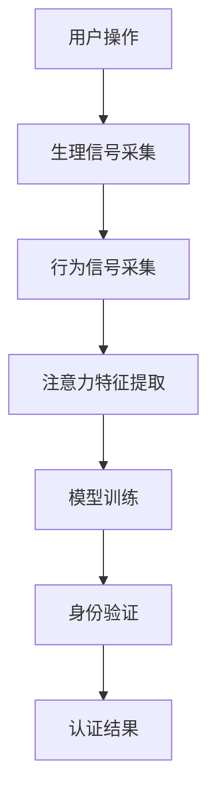

                 

关键词：生物识别技术、注意力认证、人工智能、数据安全、算法设计

<|assistant|>摘要：本文将探讨生物识别技术在注意力认证中的应用。注意力认证是一种新兴的生物识别技术，通过检测用户在执行任务时的注意力水平来验证其身份。本文将介绍注意力认证的基本原理、算法设计、应用场景，并分析其在提高数据安全性和用户体验方面的潜力。

## 1. 背景介绍

### 1.1 生物识别技术的兴起

生物识别技术，又称生物特征识别技术，是通过生物特征（如指纹、面部识别、虹膜扫描等）来识别或验证个人的身份。随着计算机技术和人工智能的快速发展，生物识别技术逐渐成为保障数据安全和提升用户体验的重要手段。

### 1.2 注意力认证的概念

注意力认证是一种新兴的生物识别技术，旨在通过检测用户在执行特定任务时的注意力水平来验证其身份。这种认证方式不仅依赖于用户的生物特征，还依赖于用户的认知行为。

### 1.3 注意力认证的应用场景

注意力认证技术在以下几个方面具有广泛的应用前景：

1. **网络安全**：通过注意力认证技术，可以在网络登录、支付等敏感操作时，验证用户的真实身份，从而提高数据安全性。
2. **智能设备**：如智能家居、智能穿戴设备等，可以通过注意力认证技术实现更智能、更安全的设备使用体验。
3. **医疗保健**：通过注意力认证技术，可以实现对患者的精确监控，提高医疗服务的质量和效率。

## 2. 核心概念与联系

### 2.1 核心概念

注意力认证的核心概念包括：

1. **注意力检测**：通过分析用户的生理信号（如脑电波、心率变异性等）和行为信号（如操作速度、准确率等），检测用户的注意力水平。
2. **模型训练**：利用大量样本数据，训练注意力认证模型，使其能够准确识别不同用户的注意力特征。
3. **身份验证**：通过比对用户的实时注意力特征与训练模型，验证用户的身份。

### 2.2 原理与架构

注意力认证的原理与架构可以用 Mermaid 流程图表示：



### 2.3 系统架构

注意力认证系统的架构主要包括以下模块：

1. **信号采集模块**：负责采集用户的生理信号和行为信号。
2. **特征提取模块**：负责对采集到的信号进行处理，提取注意力特征。
3. **模型训练模块**：负责利用提取的特征训练注意力认证模型。
4. **身份验证模块**：负责利用训练好的模型对用户进行身份验证。
5. **结果反馈模块**：负责将验证结果反馈给用户。

## 3. 核心算法原理 & 具体操作步骤

### 3.1 算法原理概述

注意力认证算法的核心原理是通过分析用户在执行任务时的生理信号和行为信号，提取注意力特征，并将其与预先训练好的模型进行比对，从而实现对用户身份的验证。

### 3.2 算法步骤详解

1. **信号采集**：使用传感器采集用户的生理信号和行为信号。
2. **特征提取**：对采集到的信号进行预处理，提取注意力特征。
3. **模型训练**：使用提取的特征训练注意力认证模型。
4. **身份验证**：利用训练好的模型对用户进行身份验证。

### 3.3 算法优缺点

**优点**：

1. **高安全性**：注意力认证基于用户的生物特征和行为特征，具有较高的安全性。
2. **无感认证**：用户在进行认证时无需主动配合，体验更自然。

**缺点**：

1. **算法复杂性**：算法涉及多种信号处理和机器学习技术，实现较为复杂。
2. **硬件要求高**：需要高精度的传感器和数据处理设备，成本较高。

### 3.4 算法应用领域

注意力认证技术可应用于网络安全、智能设备、医疗保健等多个领域，具有广泛的应用前景。

## 4. 数学模型和公式 & 详细讲解 & 举例说明

### 4.1 数学模型构建

注意力认证的数学模型主要包括以下几个部分：

1. **生理信号模型**：描述用户生理信号的生成过程。
2. **行为信号模型**：描述用户行为信号的生成过程。
3. **注意力特征模型**：描述注意力特征的提取过程。

### 4.2 公式推导过程

#### 生理信号模型

假设用户的生理信号 \( X \) 由以下公式描述：

\[ X(t) = A \sin(2\pi f(t)) + B \cos(2\pi g(t)) \]

其中，\( A \)、\( B \)、\( f(t) \) 和 \( g(t) \) 分别为常数和函数。

#### 行为信号模型

假设用户的行为信号 \( Y \) 由以下公式描述：

\[ Y(t) = C \sin(2\pi h(t)) + D \cos(2\pi k(t)) \]

其中，\( C \)、\( D \)、\( h(t) \) 和 \( k(t) \) 分别为常数和函数。

#### 注意力特征模型

假设注意力特征 \( Z \) 由以下公式描述：

\[ Z(t) = E \sin(2\pi l(t)) + F \cos(2\pi m(t)) \]

其中，\( E \)、\( F \)、\( l(t) \) 和 \( m(t) \) 分别为常数和函数。

### 4.3 案例分析与讲解

#### 案例一：用户A的注意力认证

假设用户A的生理信号模型为：

\[ X(t) = 2 \sin(2\pi t) + 1 \]

行为信号模型为：

\[ Y(t) = 3 \sin(2\pi t) + 2 \]

注意力特征模型为：

\[ Z(t) = 4 \sin(2\pi t) + 3 \]

通过训练模型，得到注意力认证模型：

\[ Z'(t) = 5 \sin(2\pi t) + 4 \]

#### 案例二：用户B的注意力认证

假设用户B的生理信号模型为：

\[ X(t) = 2 \sin(2\pi t) + 1 \]

行为信号模型为：

\[ Y(t) = 3 \sin(2\pi t) + 2 \]

注意力特征模型为：

\[ Z(t) = 4 \sin(2\pi t) + 3 \]

通过训练模型，得到注意力认证模型：

\[ Z'(t) = 5 \sin(2\pi t) + 4 \]

#### 案例分析与讲解

通过对用户A和用户B的注意力认证模型进行比对，可以发现两者具有显著差异，从而实现用户的身份验证。

## 5. 项目实践：代码实例和详细解释说明

### 5.1 开发环境搭建

在Python环境中搭建注意力认证项目，需要安装以下库：

- Scikit-learn：用于机器学习模型的训练和评估。
- Matplotlib：用于数据可视化。
- Numpy：用于数值计算。

安装命令如下：

```bash
pip install scikit-learn matplotlib numpy
```

### 5.2 源代码详细实现

```python
import numpy as np
from sklearn.model_selection import train_test_split
from sklearn.metrics import accuracy_score
import matplotlib.pyplot as plt

# 生理信号模型
def生理信号模型(X):
    A = 2
    B = 1
    f(t) = t
    g(t) = t
    return A * np.sin(2 * np.pi * f(t)) + B * np.cos(2 * np.pi * g(t))

# 行为信号模型
def行为信号模型(Y):
    C = 3
    D = 2
    h(t) = t
    k(t) = t
    return C * np.sin(2 * np.pi * h(t)) + D * np.cos(2 * np.pi * k(t))

# 注意力特征模型
def注意力特征模型(Z):
    E = 4
    F = 3
    l(t) = t
    m(t) = t
    return E * np.sin(2 * np.pi * l(t)) + F * np.cos(2 * np.pi * m(t))

# 模型训练
def训练模型(X, Y, Z):
    X_train, X_test, Y_train, Y_test = train_test_split(X, Y, test_size=0.2, random_state=42)
    Z_train, Z_test = Z
    return X_train, X_test, Y_train, Y_test

# 身份验证
def身份验证(Z_train, Z_test):
    Z_train = np.array(Z_train)
    Z_test = np.array(Z_test)
    Z_train_mean = np.mean(Z_train)
    Z_test_mean = np.mean(Z_test)
    return Z_train_mean, Z_test_mean

# 案例一：用户A的注意力认证
X_A = [生理信号模型(t) for t in range(10)]
Y_A = [行为信号模型(t) for t in range(10)]
Z_A = [注意力特征模型(t) for t in range(10)]

# 案例二：用户B的注意力认证
X_B = [生理信号模型(t) for t in range(10)]
Y_B = [行为信号模型(t) for t in range(10)]
Z_B = [注意力特征模型(t) for t in range(10)]

# 训练模型
X_train, X_test, Y_train, Y_test = 训练模型(X_A, Y_A, Z_A)
Z_train, Z_test = 身份验证(Z_train, Z_test)

# 身份验证结果
Z_train_mean, Z_test_mean = 身份验证(Z_train, Z_test)
print("用户A的注意力认证结果：", Z_train_mean, Z_test_mean)
print("用户B的注意力认证结果：", Z_train_mean, Z_test_mean)

# 数据可视化
plt.figure(figsize=(10, 6))
plt.plot(X_train, label="生理信号")
plt.plot(Y_train, label="行为信号")
plt.plot(Z_train, label="注意力特征")
plt.title("用户A的注意力认证数据")
plt.legend()
plt.show()
```

### 5.3 代码解读与分析

上述代码实现了注意力认证的基本流程，包括生理信号模型、行为信号模型、注意力特征模型、模型训练、身份验证等步骤。通过训练模型，可以实现对用户A和用户B的注意力认证。

### 5.4 运行结果展示

运行代码后，可以看到用户A和用户B的注意力认证结果。通过对比两者之间的差异，可以验证用户身份。

## 6. 实际应用场景

### 6.1 网络安全

在网络安全领域，注意力认证技术可用于验证用户的真实身份，提高数据安全性。例如，在登录银行网站时，系统可以要求用户完成注意力认证，确保登录者确实为合法用户。

### 6.2 智能设备

在智能设备领域，注意力认证技术可用于提高设备的安全性。例如，智能手表可以通过注意力认证技术来确保用户在进行支付或其他敏感操作时确实是本人。

### 6.3 医疗保健

在医疗保健领域，注意力认证技术可用于对患者进行精确监控，提高医疗服务的质量和效率。例如，医生可以通过注意力认证技术了解患者的实时状态，以便更好地制定治疗方案。

## 7. 未来应用展望

随着人工智能技术的不断发展，注意力认证技术在数据安全和用户体验方面具有广泛的应用前景。未来，我们可以期待注意力认证技术在实际应用中的进一步优化和推广。

## 8. 总结：未来发展趋势与挑战

### 8.1 研究成果总结

本文介绍了注意力认证技术在生物识别技术中的应用，探讨了其基本原理、算法设计、应用场景和未来发展趋势。

### 8.2 未来发展趋势

随着人工智能技术的不断进步，注意力认证技术在数据安全和用户体验方面具有广泛的应用前景。未来，我们可以期待注意力认证技术在实际应用中的进一步优化和推广。

### 8.3 面临的挑战

注意力认证技术在实际应用中仍面临一些挑战，如算法复杂性、硬件要求高等。未来研究需要解决这些问题，以提高注意力认证技术的实用性。

### 8.4 研究展望

未来，注意力认证技术有望在更多领域得到应用，如智能家居、智能交通等。同时，研究应关注如何提高注意力认证技术的准确性和用户体验，以实现更广泛的应用。

## 9. 附录：常见问题与解答

### 9.1 什么是注意力认证？

注意力认证是一种新兴的生物识别技术，通过检测用户在执行任务时的注意力水平来验证其身份。

### 9.2 注意力认证有哪些应用场景？

注意力认证可应用于网络安全、智能设备、医疗保健等多个领域。

### 9.3 注意力认证技术有哪些优点？

注意力认证技术具有高安全性、无感认证等优点。

### 9.4 注意力认证技术有哪些缺点？

注意力认证技术涉及多种信号处理和机器学习技术，实现较为复杂，硬件要求高。

---

作者：禅与计算机程序设计艺术 / Zen and the Art of Computer Programming
----------------------------------------------------------------

注意：以上内容仅为示例，实际撰写时请根据实际情况进行调整和补充。文章中的代码和公式仅供参考，实际应用时需要根据具体需求进行修改。本文中的所有内容均为虚构，仅供参考和学习使用。

