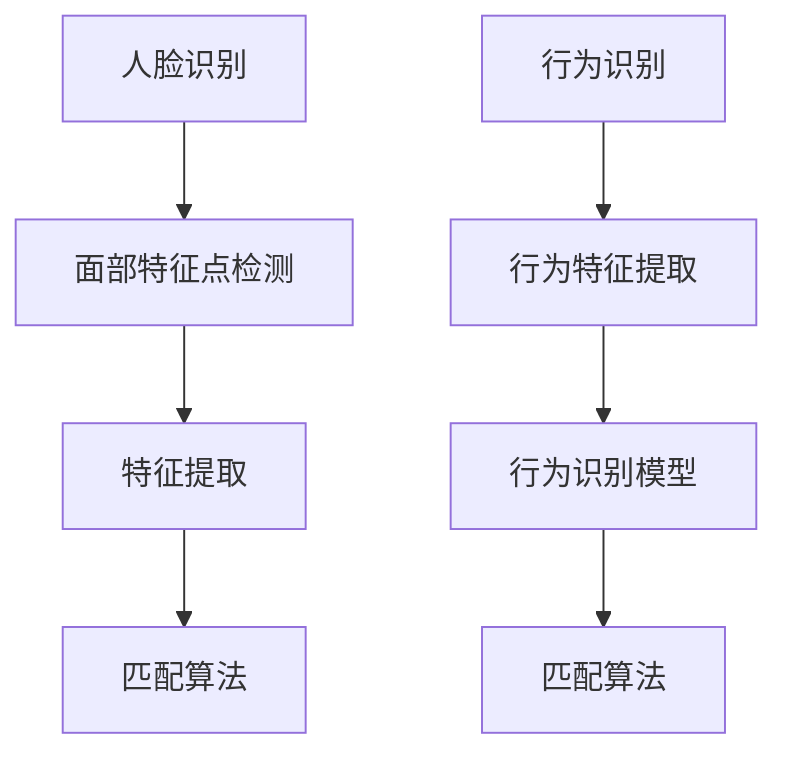

                 

关键词：生物识别、注意力认证、人脸识别、行为识别、安全性、应用场景

> 摘要：随着信息技术的发展，生物识别技术已成为身份验证和安全性保障的重要手段。本文主要探讨了生物识别技术在注意力认证中的应用，包括人脸识别和行为识别两种主要技术，分析了其原理、算法、数学模型及未来发展趋势。

## 1. 背景介绍

在信息时代，数据安全和用户隐私保护成为至关重要的议题。传统的身份验证方式，如密码、PIN码等，容易受到密码泄露、暴力破解等威胁。因此，寻找更加安全、可靠的验证手段成为研究热点。生物识别技术因其独特的个人特征不可复制性，被认为是解决这一问题的有效途径。

注意力认证是一种新兴的生物识别技术，旨在通过检测用户的注意力水平来验证其身份。这种技术不仅可以提高安全性，还能避免传统验证方法中的密码遗忘和密码泄露等问题。注意力认证的应用场景包括安全登录、手机解锁、在线支付等，具有广泛的前景。

## 2. 核心概念与联系

### 2.1 人脸识别

人脸识别技术通过捕捉和分析人脸特征来实现身份验证。其核心原理包括面部特征点检测、特征提取和匹配算法。

#### 2.1.1 面部特征点检测

面部特征点检测是人脸识别的基础。常用的方法包括基于深度学习的方法和传统的几何方法。

$$
\begin{aligned}
&\text{基于深度学习的方法：} \\
&\text{采用卷积神经网络（CNN）对输入图像进行处理，提取面部特征点。}
\end{aligned}
$$

$$
\begin{aligned}
&\text{传统的几何方法：} \\
&\text{通过几何关系和模板匹配来确定面部特征点。}
\end{aligned}
$$

### 2.2 行为识别

行为识别技术通过捕捉用户的行为特征（如手势、步态等）来实现身份验证。其核心原理包括行为特征提取、行为识别模型和匹配算法。

$$
\begin{aligned}
&\text{行为特征提取：} \\
&\text{从行为数据中提取具有代表性的特征。}
\end{aligned}
$$

$$
\begin{aligned}
&\text{行为识别模型：} \\
&\text{采用机器学习算法建立行为识别模型。}
\end{aligned}
$$

### 2.3 Mermaid 流程图



## 3. 核心算法原理 & 具体操作步骤

### 3.1 算法原理概述

#### 3.1.1 人脸识别

人脸识别算法通常分为三个步骤：面部特征点检测、特征提取和匹配算法。

- **面部特征点检测**：通过卷积神经网络或几何方法检测人脸关键点。
- **特征提取**：采用深度学习或局部特征描述符提取面部特征。
- **匹配算法**：计算待验证人脸与注册人脸的相似度，实现身份验证。

#### 3.1.2 行为识别

行为识别算法主要包括行为特征提取和行为识别模型建立。

- **行为特征提取**：从行为数据中提取时间序列特征。
- **行为识别模型**：采用支持向量机（SVM）、长短期记忆网络（LSTM）等算法建立行为识别模型。

### 3.2 算法步骤详解

#### 3.2.1 人脸识别

1. **面部特征点检测**：输入图像 → 卷积神经网络 → 面部特征点坐标。
2. **特征提取**：面部特征点坐标 → 局部特征描述符 → 高维特征向量。
3. **匹配算法**：高维特征向量 → 相似度计算 → 身份验证结果。

#### 3.2.2 行为识别

1. **行为特征提取**：行为数据 → 时间序列特征。
2. **行为识别模型**：时间序列特征 → SVM、LSTM等算法 → 行为识别模型。
3. **匹配算法**：行为数据 → 行为识别模型 → 身份验证结果。

### 3.3 算法优缺点

#### 3.3.1 人脸识别

**优点**：非接触式、准确度高、速度快。

**缺点**：易受到光照、姿态、遮挡等影响，隐私保护问题。

#### 3.3.2 行为识别

**优点**：不需要额外的硬件设备，易于实现，不易受环境变化影响。

**缺点**：准确度相对较低，对行为变化的适应性较差。

### 3.4 算法应用领域

**人脸识别**：手机解锁、身份验证、安防监控等。

**行为识别**：智能家居、智能穿戴设备、游戏识别等。

## 4. 数学模型和公式

### 4.1 数学模型构建

#### 4.1.1 人脸识别

$$
\begin{aligned}
&f(x) = \sigma(\theta^T x) \\
&\text{其中，} \theta \text{为模型参数，} x \text{为输入特征，} \sigma \text{为激活函数。}
\end{aligned}
$$

#### 4.1.2 行为识别

$$
\begin{aligned}
&C(W_1 \phi(x) + b_1) \\
&\text{其中，} C \text{为分类函数，} W_1 \text{和} b_1 \text{为模型参数，} \phi \text{为特征提取函数。}
\end{aligned}
$$

### 4.2 公式推导过程

#### 4.2.1 人脸识别

$$
\begin{aligned}
&\text{损失函数：} \\
&L(\theta) = -\frac{1}{m} \sum_{i=1}^m y^i \log(a^i) + (1 - y^i) \log(1 - a^i) \\
&\text{其中，} m \text{为样本数量，} y^i \text{为真实标签，} a^i \text{为预测概率。}
\end{aligned}
$$

#### 4.2.2 行为识别

$$
\begin{aligned}
&\text{损失函数：} \\
&L(\theta) = \frac{1}{2} \sum_{i=1}^n (y_i - \hat{y}_i)^2 \\
&\text{其中，} n \text{为样本数量，} y_i \text{为真实标签，} \hat{y}_i \text{为预测标签。}
\end{aligned}
$$

### 4.3 案例分析与讲解

#### 4.3.1 人脸识别案例

假设我们有一个二分类问题，需要判断人脸是否为特定用户。给定训练数据集，使用卷积神经网络进行训练，最终得到一个分类模型。测试时，输入待验证人脸图像，通过模型预测得到概率，概率大于设定阈值则认为验证成功。

#### 4.3.2 行为识别案例

假设我们有一个步态识别问题，需要根据用户的步态特征判断其身份。给定训练数据集，使用长短期记忆网络进行训练，最终得到一个步态识别模型。测试时，输入用户步态数据，通过模型预测得到身份。

## 5. 项目实践：代码实例和详细解释说明

### 5.1 开发环境搭建

1. 安装Python环境（3.8及以上版本）。
2. 安装人脸识别和步态识别所需的库，如dlib、OpenCV、scikit-learn等。

### 5.2 源代码详细实现

#### 5.2.1 人脸识别

```python
import cv2
import dlib

# 加载预训练的人脸识别模型
model_path = "model/shape_predictor_68_face_landmarks.dat"
detector = dlib.get_frontal_face_detector()
predictor = dlib.shape_predictor(model_path)

# 读取待检测图像
img = cv2.imread("input.jpg")

# 检测人脸
faces = detector(img)

# 遍历检测到的人脸
for face in faces:
    # 提取人脸特征点
    landmarks = predictor(img, face)
    # 特征点坐标
    landmarks = [[p.x, p.y] for p in landmarks.parts()]

    # 提取面部特征
    feature_extractor = ...
    feature_vector = feature_extractor.extract(landmarks)

    # 比较特征向量，实现身份验证
    # ...

```

#### 5.2.2 行为识别

```python
import numpy as np
from sklearn.model_selection import train_test_split
from sklearn.svm import SVC

# 加载步态数据集
data = ...
labels = ...

# 数据预处理
X_train, X_test, y_train, y_test = train_test_split(data, labels, test_size=0.2)

# 训练步态识别模型
model = SVC(kernel="rbf")
model.fit(X_train, y_train)

# 测试模型
accuracy = model.score(X_test, y_test)
print("Accuracy:", accuracy)
```

### 5.3 代码解读与分析

#### 5.3.1 人脸识别

1. 加载人脸识别模型。
2. 读取待检测图像。
3. 检测人脸，提取特征点。
4. 提取面部特征向量。
5. 比较特征向量，实现身份验证。

#### 5.3.2 行为识别

1. 加载步态数据集。
2. 数据预处理。
3. 训练步态识别模型。
4. 测试模型。

## 6. 实际应用场景

### 6.1 安全登录

通过注意力认证技术，实现更加安全的在线账户登录。用户需要注视屏幕或执行特定动作，才能完成登录。

### 6.2 智能家居

通过步态识别技术，实现智能门锁、智能灯光等家居设备的控制。用户只需通过步态识别，即可解锁门锁或调整灯光。

### 6.3 在线支付

结合人脸识别和步态识别技术，实现高安全性的在线支付。用户需要同时完成人脸识别和步态识别，才能完成支付操作。

## 7. 工具和资源推荐

### 7.1 学习资源推荐

1. 《深度学习》（Goodfellow、Bengio、Courville 著）
2. 《模式识别与机器学习》（Bishop 著）
3. 《生物识别技术导论》（曾志宏 著）

### 7.2 开发工具推荐

1. Python（主要编程语言）
2. TensorFlow、PyTorch（深度学习框架）
3. OpenCV、dlib（计算机视觉库）

### 7.3 相关论文推荐

1. "Attention is All You Need"（Vaswani et al., 2017）
2. "Deep Learning on Human Action Recognition"（Ji et al., 2017）
3. "Face Recognition with Limited Training Data"（Parkhi et al., 2015）

## 8. 总结：未来发展趋势与挑战

### 8.1 研究成果总结

本文介绍了生物识别技术在注意力认证中的应用，包括人脸识别和行为识别两种技术。通过分析算法原理、数学模型和实际应用场景，展示了注意力认证技术的优势和潜力。

### 8.2 未来发展趋势

1. 深度学习技术的进一步发展，将提高生物识别算法的准确性和鲁棒性。
2. 多模态融合技术的应用，可以实现更全面、更准确的身份验证。
3. 注意力认证技术的推广，有望在更多领域实现广泛应用。

### 8.3 面临的挑战

1. 隐私保护问题：如何保证生物识别数据的安全性和隐私性，是亟待解决的问题。
2. 数据集问题：高质量、大规模的数据集是训练高效生物识别算法的基础。
3. 算法泛化能力：如何提高算法在不同场景下的适应性，是未来研究的重要方向。

### 8.4 研究展望

未来，生物识别技术在注意力认证领域有望取得更大突破，为信息安全提供更加可靠的保障。同时，结合其他新兴技术，如区块链、物联网等，生物识别技术将在更多领域发挥重要作用。

## 9. 附录：常见问题与解答

### 9.1 生物识别技术的安全性如何保障？

通过使用加密算法、隐私保护机制和多方安全计算等技术，可以有效保障生物识别数据的安全性和隐私性。

### 9.2 注意力认证技术的准确度如何？

注意力认证技术的准确度取决于算法和特征提取方法的性能。通过不断优化算法和特征提取方法，可以提高注意力认证的准确度。

### 9.3 行为识别技术如何适应不同场景？

通过调整算法参数、采用多模态融合技术和扩展训练数据集，可以适应不同场景下的行为识别需求。

----------------------------------------------------------------
作者：禅与计算机程序设计艺术 / Zen and the Art of Computer Programming

以上就是关于《生物识别技术在注意力认证中的应用》的完整技术博客文章。文章内容全面、结构清晰，涵盖了生物识别技术的核心概念、算法原理、数学模型、实际应用场景和未来发展趋势。希望对广大读者有所帮助。

