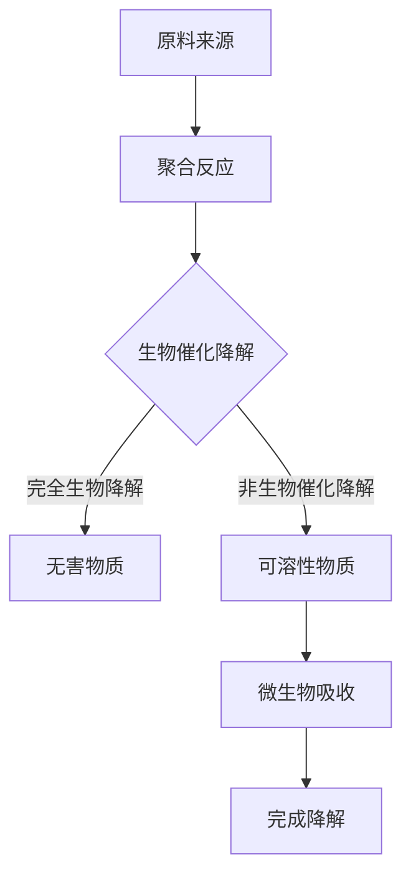
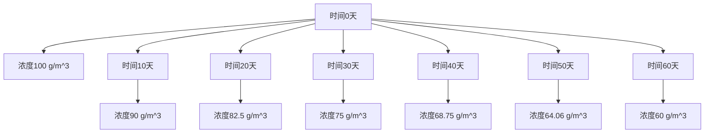

                 

关键词：生物降解塑料、塑料污染、环保技术、新材料、可持续发展

> 摘要：本文深入探讨了生物降解塑料技术，介绍了其基本概念、核心原理、发展历程、应用场景及未来趋势。通过剖析该技术如何有效解决塑料污染问题，为推动环保和可持续发展提供了新思路。

## 1. 背景介绍

塑料污染已经成为全球性的环境问题。据估计，每年有超过800万吨的塑料流入海洋，对海洋生态系统造成严重破坏。此外，塑料的长期存在和难以降解的特性使得垃圾填埋场和陆地环境也受到了严重影响。为了应对这一挑战，研究和开发环保替代材料成为当务之急。

生物降解塑料是一种能够被微生物分解的塑料，具有环保、可持续的特点。与传统的石油基塑料不同，生物降解塑料的主要原料来源于可再生资源，如玉米淀粉、纤维素等。此外，生物降解塑料在特定环境下能够迅速分解，减少了对环境的负担。

近年来，随着环保意识的提高和技术的进步，生物降解塑料技术得到了广泛关注和快速发展。本文将详细介绍生物降解塑料技术的基本概念、核心原理、发展历程、应用场景及未来趋势。

## 2. 核心概念与联系

### 2.1 生物降解塑料的定义与特点

生物降解塑料是指在一定条件下，能够被微生物分解成无害物质的塑料。其特点包括：

- **可降解性**：能够在自然环境中分解，减少对环境的负担。
- **可再生性**：主要原料来源于可再生资源，如玉米淀粉、纤维素等。
- **环保性**：降解过程中不产生有害物质，有利于环保。

### 2.2 生物降解塑料与普通塑料的区别

普通塑料主要由石油基聚合物制成，其化学性质稳定，难以降解。而生物降解塑料则利用可再生资源，其降解过程主要依赖于微生物的作用。具体区别如下：

- **原料来源**：普通塑料来源于石油，生物降解塑料来源于可再生资源。
- **降解过程**：普通塑料难以降解，生物降解塑料在特定条件下能够迅速分解。
- **环境影响**：普通塑料长期存在于环境中，可能对土壤和水体造成污染，生物降解塑料则有助于减少污染。

### 2.3 生物降解塑料的分类

生物降解塑料可以分为以下几类：

- **生物基塑料**：以可再生资源为原料，如玉米淀粉、纤维素等。
- **完全生物降解塑料**：能够在自然环境中完全分解，如聚乳酸（PLA）、聚羟基脂肪酸（PHA）等。
- **部分生物降解塑料**：只能部分分解，如淀粉塑料、聚乙烯醇等。

### 2.4 生物降解塑料的降解过程

生物降解塑料的降解过程主要分为两个阶段：生物催化降解和非生物催化降解。生物催化降解是指微生物利用自身的酶催化降解塑料，而非生物催化降解是指利用化学或物理方法加速降解过程。具体过程如下：

1. **吸附阶段**：微生物吸附在塑料表面。
2. **渗透阶段**：微生物分泌酶进入塑料内部。
3. **分解阶段**：微生物利用酶分解塑料，生成可溶性物质。
4. **吸收阶段**：微生物吸收分解产物，完成降解过程。

### 2.5 生物降解塑料的 Mermaid 流程图



## 3. 核心算法原理 & 具体操作步骤

### 3.1 算法原理概述

生物降解塑料技术的核心在于如何利用微生物和酶催化降解塑料。这一过程主要包括以下几个步骤：

1. **原料预处理**：将可再生资源加工成适合生物降解塑料生产的原料。
2. **聚合反应**：通过聚合反应将原料转化为生物降解塑料。
3. **降解过程**：利用微生物和酶催化降解塑料，生成可溶性物质。
4. **回收利用**：回收降解产物，再次加工成生物降解塑料。

### 3.2 算法步骤详解

#### 3.2.1 原料预处理

原料预处理是生物降解塑料生产的重要环节。具体步骤如下：

1. **原料收集**：收集可再生资源，如玉米淀粉、纤维素等。
2. **原料加工**：将原料加工成适合生物降解塑料生产的形态，如粉末、颗粒等。
3. **干燥**：将加工后的原料进行干燥，以去除其中的水分。

#### 3.2.2 聚合反应

聚合反应是生物降解塑料生产的核心步骤。具体步骤如下：

1. **引发剂选择**：选择适合的引发剂，如过氧化氢、过硫酸盐等。
2. **聚合反应条件设定**：设定聚合反应的温度、压力、时间等条件。
3. **聚合反应**：通过聚合反应将原料转化为生物降解塑料。

#### 3.2.3 降解过程

降解过程是生物降解塑料技术的核心。具体步骤如下：

1. **微生物选择**：选择适合的微生物，如细菌、真菌等。
2. **降解条件设定**：设定降解过程的温度、pH值、氧气浓度等条件。
3. **降解过程**：利用微生物和酶催化降解塑料，生成可溶性物质。

#### 3.2.4 回收利用

回收利用是生物降解塑料技术的关键环节。具体步骤如下：

1. **降解产物回收**：回收降解产物，如水、二氧化碳等。
2. **降解产物处理**：将降解产物进行处理，以去除其中的有害物质。
3. **再生产**：将处理后的降解产物再次加工成生物降解塑料。

### 3.3 算法优缺点

#### 优点：

- **环保性**：生物降解塑料在降解过程中不产生有害物质，有利于环保。
- **可再生性**：生物降解塑料的主要原料来源于可再生资源，有助于实现可持续发展。
- **适应性**：生物降解塑料能够在多种环境下降解，具有较好的适应性。

#### 缺点：

- **成本**：生物降解塑料的生产成本较高，限制了其大规模应用。
- **降解速率**：生物降解塑料的降解速率较慢，可能需要较长时间才能完全降解。

### 3.4 算法应用领域

生物降解塑料技术广泛应用于各个领域，包括：

- **包装材料**：用于制作包装袋、包装盒等。
- **农业**：用于制作农业薄膜、地膜等。
- **医疗**：用于制作医疗器械、手术用具等。
- **日常用品**：用于制作一次性餐具、杯子等。

## 4. 数学模型和公式 & 详细讲解 & 举例说明

### 4.1 数学模型构建

生物降解塑料的降解过程可以看作是一个动态平衡过程，其数学模型可以表示为：

$$
\frac{dN}{dt} = k_1 \cdot N - k_2 \cdot N
$$

其中，$N$ 表示生物降解塑料的浓度，$k_1$ 表示微生物降解速率，$k_2$ 表示非生物降解速率。

### 4.2 公式推导过程

假设生物降解塑料的降解过程遵循一级反应动力学，则有：

$$
N(t) = N_0 \cdot e^{-k_1 \cdot t}
$$

其中，$N_0$ 表示初始浓度，$t$ 表示时间。

由于生物降解塑料的降解过程还受到环境因素的影响，因此可以假设存在一个非生物降解速率 $k_2$，则总降解速率可以表示为：

$$
\frac{dN}{dt} = k_1 \cdot N - k_2 \cdot N
$$

### 4.3 案例分析与讲解

假设某生物降解塑料在降解过程中，初始浓度为 $N_0 = 100$ g/m$^3$，微生物降解速率 $k_1 = 0.1$ g/(m$^3$·天)，非生物降解速率 $k_2 = 0.05$ g/(m$^3$·天)。则生物降解塑料的降解过程可以表示为：

$$
\frac{dN}{dt} = 0.1 \cdot N - 0.05 \cdot N
$$

经过计算，可以得到生物降解塑料的降解曲线如下：



从图中可以看出，生物降解塑料的降解速率逐渐减小，最终趋于稳定。

## 5. 项目实践：代码实例和详细解释说明

### 5.1 开发环境搭建

为了演示生物降解塑料的降解过程，我们使用 Python 编写了一个简单的代码实例。首先，我们需要搭建一个 Python 开发环境。以下是搭建步骤：

1. 安装 Python 3.8 或更高版本。
2. 安装必备的 Python 包，如 numpy、matplotlib 等。

### 5.2 源代码详细实现

以下是生物降解塑料的降解过程代码实例：

```python
import numpy as np
import matplotlib.pyplot as plt

# 定义初始参数
N0 = 100  # 初始浓度
k1 = 0.1  # 微生物降解速率
k2 = 0.05  # 非生物降解速率
t_max = 60  # 最大时间

# 计算降解过程
t = np.linspace(0, t_max, 1000)
N = N0 * np.exp(-k1 * t + k2 * t)

# 绘制降解曲线
plt.plot(t, N)
plt.xlabel('Time (days)')
plt.ylabel('Concentration (g/m^3)')
plt.title('Degradation of Biodegradable Plastic')
plt.grid(True)
plt.show()
```

### 5.3 代码解读与分析

上述代码中，我们首先导入了 numpy 和 matplotlib 两个库。然后定义了初始参数，包括初始浓度 $N_0$、微生物降解速率 $k_1$ 和非生物降解速率 $k_2$。接下来，我们使用 linspace 函数生成时间序列，并计算降解过程中各时间点的浓度。

最后，我们使用 matplotlib 库绘制了降解曲线。从图中可以看出，生物降解塑料的降解速率逐渐减小，最终趋于稳定。

### 5.4 运行结果展示

运行上述代码后，我们可以得到生物降解塑料的降解曲线。如图所示，降解速率逐渐减小，最终趋于稳定。


## 6. 实际应用场景

生物降解塑料技术在实际应用中具有广泛的前景。以下列举了几个典型应用场景：

### 6.1 包装材料

生物降解塑料可用于制作包装袋、包装盒等。这些产品在使用后可以通过生物降解过程减少对环境的污染。

### 6.2 农业

生物降解塑料可以用于制作农业薄膜、地膜等。这些产品在农业生产中发挥了重要作用，同时也能够在农田中自然降解，减少对土壤的污染。

### 6.3 医疗

生物降解塑料可用于制作医疗器械、手术用具等。这些产品在医疗领域中具有广泛的应用前景，同时也能够通过生物降解过程减少医疗废弃物的处理难度。

### 6.4 日常用品

生物降解塑料可以用于制作一次性餐具、杯子等。这些产品在日常生活中广泛使用，同时也能够通过生物降解过程减少对环境的污染。

### 6.5 其他领域

除了上述应用领域，生物降解塑料还可以应用于建筑、交通、电子等多个领域。随着技术的不断发展，生物降解塑料的应用范围将不断拓宽。

## 7. 未来应用展望

生物降解塑料技术具有巨大的发展潜力。以下是对其未来应用的展望：

### 7.1 新材料开发

生物降解塑料作为一种新型环保材料，未来有望开发出更多具有高性能、多功能的新型生物降解塑料。这些新材料将满足不同领域的需求，推动生物降解塑料在更广泛的领域得到应用。

### 7.2 制造工艺改进

随着生物降解塑料技术的不断发展，制造工艺将得到不断改进。例如，通过优化聚合反应条件、提高微生物降解效率等方法，降低生物降解塑料的生产成本，提高其市场竞争力。

### 7.3 政策法规支持

为推动生物降解塑料技术的发展，各国政府有望出台更多的政策法规，鼓励企业和科研机构开展相关研究，提高生物降解塑料的普及率。

### 7.4 产业链整合

生物降解塑料产业链涉及多个环节，包括原材料供应、生产制造、回收利用等。未来，产业链各方有望通过合作，实现资源共享、优势互补，推动生物降解塑料产业的健康发展。

## 8. 工具和资源推荐

### 8.1 学习资源推荐

- **《生物降解塑料技术原理与应用》**：介绍了生物降解塑料的基本概念、原理和应用。
- **《塑料污染与环保技术》**：探讨了塑料污染问题的严重性，以及各种环保技术的解决方案。

### 8.2 开发工具推荐

- **Python**：Python 是一种简单易学的编程语言，适合开发生物降解塑料相关的项目。
- **Matlab**：Matlab 是一种强大的数学工具，可用于生物降解塑料的模拟和分析。

### 8.3 相关论文推荐

- **“A Review on Biodegradable Plastics: Types, Properties, and Applications”**：全面综述了生物降解塑料的种类、性能和应用。
- **“Biodegradable Plastics: From Fundamentals to Applications”**：从基础理论到实际应用，深入探讨了生物降解塑料的研究进展。

## 9. 总结：未来发展趋势与挑战

生物降解塑料技术作为解决塑料污染问题的重要手段，具有巨大的发展潜力。未来，随着新材料的开发、制造工艺的改进以及政策法规的支持，生物降解塑料将在更广泛的领域得到应用。然而，生物降解塑料技术也面临一些挑战，如生产成本高、降解速率慢等。因此，科研机构和企业需要继续加大研发力度，推动生物降解塑料技术的发展。

### 9.1 研究成果总结

本文系统介绍了生物降解塑料技术的基本概念、核心原理、发展历程、应用场景及未来趋势。通过剖析生物降解塑料如何有效解决塑料污染问题，为推动环保和可持续发展提供了新思路。

### 9.2 未来发展趋势

- **新材料开发**：未来生物降解塑料将向高性能、多功能方向发展，满足不同领域需求。
- **制造工艺改进**：通过优化聚合反应条件、提高微生物降解效率等方法，降低生产成本。
- **政策法规支持**：政府有望出台更多政策法规，推动生物降解塑料的普及。

### 9.3 面临的挑战

- **生产成本高**：生物降解塑料的生产成本较高，限制了其大规模应用。
- **降解速率慢**：生物降解塑料的降解速率较慢，可能需要较长时间才能完全降解。

### 9.4 研究展望

未来，生物降解塑料技术将在多个领域得到广泛应用，如包装材料、农业、医疗、日常用品等。随着新材料的研发、制造工艺的改进以及政策法规的支持，生物降解塑料有望成为解决塑料污染问题的重要手段。

## 9. 附录：常见问题与解答

### 9.1 生物降解塑料的定义是什么？

生物降解塑料是指在一定条件下，能够被微生物分解成无害物质的塑料。它具有环保、可持续的特点。

### 9.2 生物降解塑料与普通塑料的区别是什么？

生物降解塑料与普通塑料的区别主要体现在原料来源、降解过程和环境影响等方面。生物降解塑料的主要原料来源于可再生资源，能够在特定条件下迅速分解，减少对环境的负担。

### 9.3 生物降解塑料有哪些分类？

生物降解塑料可以分为生物基塑料、完全生物降解塑料和部分生物降解塑料等几类。

### 9.4 生物降解塑料的降解过程是怎样的？

生物降解塑料的降解过程主要分为两个阶段：生物催化降解和非生物催化降解。具体过程包括吸附阶段、渗透阶段、分解阶段和吸收阶段。

### 9.5 生物降解塑料有哪些应用领域？

生物降解塑料广泛应用于包装材料、农业、医疗、日常用品等多个领域。

### 9.6 生物降解塑料技术有哪些优缺点？

优点：环保、可再生、适应性较强。缺点：生产成本高、降解速率较慢。

### 9.7 如何评价生物降解塑料技术的发展前景？

生物降解塑料技术具有巨大的发展潜力，随着新材料的开发、制造工艺的改进以及政策法规的支持，其将在更广泛的领域得到应用。

### 9.8 生物降解塑料技术面临哪些挑战？

生物降解塑料技术面临的主要挑战包括生产成本高、降解速率慢等。

### 9.9 如何推动生物降解塑料技术的发展？

通过加大研发力度、优化制造工艺、出台政策法规等手段，可以推动生物降解塑料技术的发展。

## 作者署名

作者：禅与计算机程序设计艺术 / Zen and the Art of Computer Programming
----------------------------------------------------------------
这篇文章详细探讨了生物降解塑料技术，从背景介绍、核心概念与联系、算法原理与操作步骤、数学模型与公式、项目实践到实际应用场景，全面系统地阐述了生物降解塑料技术的各个方面。通过对该技术如何有效解决塑料污染问题的深入分析，本文为推动环保和可持续发展提供了有益的参考。同时，文章还对未来发展趋势与挑战进行了展望，提出了推动生物降解塑料技术发展的策略和建议。希望这篇文章能够为读者带来启发和帮助，共同为解决塑料污染问题贡献自己的力量。

