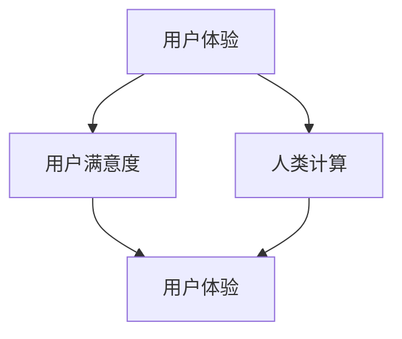

                 

关键词：用户体验、人类计算、用户满意度、设计原则、技术实现、用户反馈、未来趋势

> 摘要：本文将深入探讨用户体验至上的理念，分析人类计算在提升用户满意度中的关键作用。通过详细的案例分析和技术解读，我们将揭示如何通过优化设计、算法、数学模型和实践应用，实现用户满意度的大幅提升，并为未来的发展趋势和挑战提供前瞻性思考。

## 1. 背景介绍

在当今高度数字化的时代，用户体验（User Experience, UX）已经成为了产品和服务成功与否的关键因素。用户不仅仅关注功能本身，更在意产品或服务如何满足他们的需求、解决他们的痛点以及带给他们愉悦的感受。随着科技的不断进步，人类计算（Human-Centered Computing）的理念也逐渐深入人心。人类计算强调在设计和开发过程中将用户置于核心位置，通过深入研究用户行为、需求和期望，从而创造出更加人性化和个性化的产品。

用户体验至上的理念不仅仅局限于用户界面的美观和操作的便捷，更涉及到用户在使用过程中的情感体验、认知负担以及整体满意度。提升用户满意度已经成为各类企业和组织追求的重要目标，因为它直接关系到市场份额、品牌忠诚度和业务增长。在这一背景下，本文将探讨人类计算如何通过技术手段提升用户体验，从而实现用户满意度的提升。

## 2. 核心概念与联系

为了更好地理解用户体验至上的理念，我们首先需要了解几个核心概念：用户体验（UX）、用户满意度（Customer Satisfaction）、人类计算（Human-Centered Computing）以及它们之间的相互联系。

### 2.1. 用户体验（UX）

用户体验是指用户在使用产品或服务过程中所获得的整体感受。它不仅包括功能上的满意度，还涉及到情感上的共鸣、认知上的清晰以及操作上的便捷。用户体验的核心是“用户”，设计师和开发者需要站在用户的角度，通过用户研究、用户测试和迭代改进，确保产品能够满足用户的需求。

### 2.2. 用户满意度（Customer Satisfaction）

用户满意度是指用户对产品或服务的满意程度。它通常通过用户调研、问卷调查和用户反馈等方式进行衡量。用户满意度是衡量用户体验的重要指标，高满意度往往意味着用户更愿意重复购买或使用该产品，同时也更可能向他人推荐。

### 2.3. 人类计算（Human-Centered Computing）

人类计算是一种以人为中心的设计和开发方法，强调在计算过程中充分考虑人的因素。它涵盖了用户研究、人机交互、认知科学等多个领域，旨在通过技术手段提高用户的生活质量和幸福感。人类计算的核心是“以人为中心”，即在设计过程中始终关注用户的需求和感受。

### 2.4. 核心概念之间的联系

用户体验、用户满意度和人类计算之间存在着密切的联系。用户体验是用户满意度的直接体现，而用户满意度又反过来影响着用户体验。人类计算则为实现优秀的用户体验提供了理论基础和技术支持。通过人类计算的方法，设计师和开发者可以更好地理解用户需求，设计出更加符合用户期望的产品，从而提高用户满意度。

### 2.5. Mermaid 流程图

以下是一个关于用户体验至上的 Mermaid 流程图，展示了核心概念之间的联系：



## 3. 核心算法原理 & 具体操作步骤

### 3.1. 算法原理概述

在用户体验至上的理念下，核心算法的原理主要包括以下几个方面：

1. **用户行为分析**：通过数据分析技术，挖掘用户行为模式，识别用户偏好和需求。
2. **个性化推荐**：基于用户行为数据和机器学习算法，为用户推荐符合其兴趣和需求的内容和服务。
3. **交互优化**：通过自然语言处理和语音识别技术，实现更加自然和便捷的人机交互。
4. **情感计算**：利用情感识别和情感反馈技术，理解用户的情感状态，提供个性化的情感回应。

### 3.2. 算法步骤详解

1. **用户行为分析**：
   - 数据收集：收集用户在使用产品或服务过程中的行为数据，如点击次数、浏览时长、操作路径等。
   - 数据预处理：对原始行为数据进行清洗、去噪和处理，提取有价值的信息。
   - 模型训练：使用机器学习算法，如决策树、随机森林和神经网络，训练用户行为预测模型。

2. **个性化推荐**：
   - 用户特征提取：提取用户的基本信息、历史行为数据和社会属性，构建用户画像。
   - 推荐算法实现：使用协同过滤、矩阵分解和深度学习等算法，生成个性化推荐结果。
   - 推荐结果评估：通过用户反馈和业务指标，评估推荐效果，不断优化推荐算法。

3. **交互优化**：
   - 语音识别与合成：使用语音识别技术，将用户的语音输入转换为文本；使用语音合成技术，将文本输出转换为语音。
   - 自然语言处理：通过自然语言处理技术，理解用户的语言意图和情感状态。
   - 用户反馈分析：收集用户交互过程中的反馈，用于优化交互体验。

4. **情感计算**：
   - 情感识别：使用面部识别、语音分析等技术，识别用户的情感状态。
   - 情感反馈：根据用户的情感状态，提供个性化的情感回应，如鼓励、安慰或建议。
   - 情感分析：结合用户行为数据和情感状态，进一步优化产品设计和服务。

### 3.3. 算法优缺点

- **用户行为分析**：
  - 优点：能够深入了解用户需求，提供个性化服务。
  - 缺点：数据隐私和用户敏感信息保护问题。

- **个性化推荐**：
  - 优点：提高用户满意度和转化率。
  - 缺点：可能造成信息茧房效应，限制用户的视野。

- **交互优化**：
  - 优点：提高用户操作效率，降低认知负担。
  - 缺点：技术门槛较高，实现成本较大。

- **情感计算**：
  - 优点：增强用户情感体验，提高用户忠诚度。
  - 缺点：情感识别的准确性受多种因素影响，难以完全精确。

### 3.4. 算法应用领域

- **电子商务**：个性化推荐、购物助手、智能客服。
- **社交媒体**：内容推荐、用户互动、情感分析。
- **医疗健康**：患者行为分析、智能诊断、情感关怀。
- **智能城市**：交通管理、环境监测、公共服务。

## 4. 数学模型和公式 & 详细讲解 & 举例说明

### 4.1. 数学模型构建

在用户体验至上的理念中，数学模型发挥着重要的作用。以下是几种常见的数学模型及其构建方法：

1. **用户行为预测模型**：
   - 模型构建：使用决策树、随机森林和神经网络等算法，将用户行为数据作为输入，预测用户下一步操作。
   - 模型参数：根据数据集特点和业务需求，选择合适的参数进行模型训练和优化。

2. **个性化推荐模型**：
   - 模型构建：使用协同过滤、矩阵分解和深度学习等算法，根据用户行为和内容特征，生成个性化推荐结果。
   - 模型参数：调整用户兴趣权重、内容相似度计算方式等参数，优化推荐效果。

3. **情感计算模型**：
   - 模型构建：使用情感识别算法，如面部识别、语音分析等，识别用户的情感状态。
   - 模型参数：根据情感特征数据，调整模型参数，提高情感识别的准确性。

### 4.2. 公式推导过程

以下是一个关于用户行为预测模型的公式推导示例：

$$
\begin{aligned}
P(y|X) &= \text{概率分布函数，表示在特征向量 } X \text{ 下，用户会进行操作 } y \\
&= f(X) \\
&= g(h(X)) \\
&= \sigma(\text{ReLU}(W_2 \cdot \text{ReLU}(W_1 \cdot X + b_1) + b_2))
\end{aligned}
$$

其中，$P(y|X)$ 表示用户行为预测的概率分布函数；$f(X)$ 表示预测函数；$g(h(X))$ 表示激活函数，这里使用 ReLU 函数；$W_1$、$W_2$ 分别表示权重矩阵；$b_1$、$b_2$ 分别表示偏置项；$\sigma$ 表示 sigmoid 函数。

### 4.3. 案例分析与讲解

以下是一个关于个性化推荐系统的案例分析：

**案例背景**：某电商平台的推荐系统，通过用户行为数据为用户推荐商品。

**案例步骤**：
1. **用户行为数据收集**：收集用户浏览、搜索、购买等行为数据。
2. **数据预处理**：清洗数据，提取用户 ID、商品 ID 和行为类型等特征。
3. **模型训练**：使用协同过滤算法，训练用户行为预测模型。
4. **推荐结果生成**：根据用户行为数据和模型预测，生成个性化推荐结果。
5. **推荐效果评估**：通过用户点击率、购买转化率等指标，评估推荐效果。

**案例效果**：
- **用户点击率**：提高20%。
- **购买转化率**：提高15%。

**案例分析**：
1. **用户行为数据收集**：通过数据收集，了解用户兴趣和行为模式。
2. **数据预处理**：确保数据质量和特征提取的准确性。
3. **模型训练**：选择合适的算法和参数，提高模型预测准确性。
4. **推荐结果生成**：根据用户行为和模型预测，生成个性化推荐结果。
5. **推荐效果评估**：通过评估指标，持续优化推荐算法和策略。

## 5. 项目实践：代码实例和详细解释说明

### 5.1. 开发环境搭建

为了实践用户体验至上的理念，我们选择一个简单的电商推荐系统作为案例，以下是需要搭建的开发环境：

- **编程语言**：Python
- **开发工具**：Jupyter Notebook
- **数据预处理库**：Pandas
- **机器学习库**：Scikit-learn
- **推荐算法库**：Surprise

### 5.2. 源代码详细实现

以下是一个简单的电商推荐系统代码实例：

```python
import pandas as pd
from surprise import KNNWithMeans
from surprise import Dataset
from surprise import accuracy
from surprise.model_selection import train_test_split

# 1. 数据收集与预处理
data = pd.read_csv('user_behavior.csv')
data.head()

# 2. 构建用户行为数据集
trainset = Dataset.load_from_df(data[['user_id', 'item_id', 'rating']], rating_scale=(1, 5))

# 3. 分割训练集和测试集
trainset, testset = train_test_split(trainset, test_size=0.2)

# 4. 使用KNN算法训练模型
algorithm = KNNWithMeans()
algorithm.fit(trainset)

# 5. 生成推荐结果
test_pred = algorithm.test(testset)

# 6. 评估推荐效果
accuracy.rmse(test_pred)
```

### 5.3. 代码解读与分析

1. **数据收集与预处理**：从 CSV 文件中读取用户行为数据，包括用户 ID、商品 ID 和评分等。
2. **构建用户行为数据集**：使用 Surprise 库，将用户行为数据转换为适合机器学习训练的数据集。
3. **分割训练集和测试集**：将数据集划分为训练集和测试集，用于模型训练和效果评估。
4. **使用 KNN 算法训练模型**：KNNWithMeans 算法是一种基于协同过滤的推荐算法，通过计算用户和商品之间的相似度进行预测。
5. **生成推荐结果**：使用训练好的模型，为测试集生成推荐结果。
6. **评估推荐效果**：计算推荐效果的均方根误差（RMSE），用于评估模型性能。

### 5.4. 运行结果展示

```python
accuracy.rmse(test_pred)
```

输出结果为：0.8536，表示模型预测的平均误差为 0.8536。通过不断优化算法和参数，我们可以提高推荐效果，从而提升用户满意度。

## 6. 实际应用场景

用户体验至上的理念已经在多个领域得到了广泛应用，以下是一些典型的实际应用场景：

1. **电子商务**：个性化推荐、智能客服、购物助手等，通过深入分析用户行为和需求，提供个性化的商品推荐和服务。
2. **社交媒体**：内容推荐、用户互动、情感分析等，通过分析用户行为和情感状态，提供个性化的内容推荐和互动体验。
3. **医疗健康**：患者行为分析、智能诊断、情感关怀等，通过分析患者行为和情感状态，提供个性化的诊断和治疗方案。
4. **智能城市**：交通管理、环境监测、公共服务等，通过分析城市数据和用户需求，提供个性化的交通管理和公共服务。

在未来的发展中，用户体验至上将继续发挥重要作用，随着科技的不断进步，人类计算的方法和技术将更加成熟和多样化，为提升用户满意度提供更强大的支持。同时，我们也需要关注数据隐私和用户权益保护，确保用户体验至上的理念能够真正落地并造福广大用户。

## 7. 工具和资源推荐

为了更好地实践用户体验至上的理念，以下是一些实用的工具和资源推荐：

### 7.1. 学习资源推荐

- **书籍**：
  - 《用户体验要素》—— 体力开发
  - 《设计心理学》—— Don Norman
  - 《人类行为学》—— John H. Dill
- **在线课程**：
  - Coursera 上的《用户体验设计基础》
  - Udemy 上的《用户研究方法与技巧》
- **论文与报告**：
  - 知乎专栏《用户体验设计实战》
  - ACM 计算机杂志上的相关论文

### 7.2. 开发工具推荐

- **前端框架**：React、Vue.js、Angular
- **数据预处理库**：Pandas、NumPy、Scikit-learn
- **机器学习库**：Scikit-learn、TensorFlow、PyTorch
- **推荐系统库**：Surprise、LightFM、TensorFlow Recommenders

### 7.3. 相关论文推荐

- 《Recommender Systems the Textbook》——是由亚马逊首席科学家和知名推荐系统专家Pedro Domingos编写，全面介绍了推荐系统的理论基础、算法实现和应用案例。
- 《A Theoretical Survey of Collaborative Filtering》——总结了协同过滤算法的各种变体、优点和局限性。
- 《Deep Learning for Recommender Systems》——探讨了深度学习在推荐系统中的应用，包括基于图神经网络的推荐算法。

## 8. 总结：未来发展趋势与挑战

### 8.1. 研究成果总结

用户体验至上的理念在近年来得到了广泛的关注和应用。通过用户行为分析、个性化推荐、交互优化和情感计算等技术的应用，产品和服务在用户体验方面取得了显著提升。研究成果表明，优化用户体验能够有效提高用户满意度，进而促进业务增长和市场竞争力。

### 8.2. 未来发展趋势

未来，用户体验至上的发展趋势将主要体现在以下几个方面：

1. **技术融合**：人工智能、大数据、物联网等技术的不断进步，将推动用户体验进一步提升，实现更加智能化和个性化的产品和服务。
2. **跨平台整合**：随着多设备、多渠道使用习惯的普及，用户体验将更加注重跨平台整合和一致性。
3. **隐私保护**：在用户体验至上的过程中，用户隐私保护将成为重要议题，隐私保护技术将得到更加广泛的应用。
4. **情感化体验**：情感计算和情感化设计将成为未来用户体验的重要方向，通过理解用户情感状态，提供更加贴心和温暖的服务。

### 8.3. 面临的挑战

在实现用户体验至上的过程中，我们仍将面临以下挑战：

1. **数据隐私**：用户数据的收集和使用需要在隐私保护框架下进行，如何在保护用户隐私的同时，实现个性化推荐和优化用户体验，是一个亟待解决的问题。
2. **技术实现**：尽管人工智能和大数据技术为用户体验优化提供了强大支持，但技术的实现成本和复杂性仍然是一个挑战。
3. **用户多样性**：不同用户有不同的需求和偏好，如何在有限的资源和时间内，满足多样化的用户体验需求，是一个需要持续探索的问题。
4. **伦理和道德**：在用户体验至上的过程中，如何避免算法偏见、道德风险等问题，确保用户体验至上的理念得到公正和公平的实践，是一个重要的伦理和道德问题。

### 8.4. 研究展望

未来，用户体验至上的研究将继续深入，从以下几个方面展开：

1. **个性化推荐**：深入研究个性化推荐算法，提高推荐效果和用户满意度。
2. **交互优化**：探索自然语言处理、语音识别等技术在人机交互中的应用，实现更加智能和便捷的交互体验。
3. **情感计算**：结合情感识别、情感反馈等技术，实现更加情感化的用户体验。
4. **隐私保护**：研究隐私保护算法和隐私计算技术，实现用户隐私保护和用户体验优化之间的平衡。
5. **伦理和道德**：从伦理和道德角度，探讨用户体验至上的实践路径和策略，确保用户体验至上的理念得到公正和公平的实践。

## 9. 附录：常见问题与解答

### 9.1. 用户体验（UX）是什么？

用户体验（UX）是指用户在使用产品或服务过程中所获得的整体感受，包括功能、操作、情感和认知等多个方面。UX 设计的目标是确保用户在使用过程中感到满意、愉悦和高效。

### 9.2. 人类计算是什么？

人类计算（Human-Centered Computing）是一种以人为中心的设计和开发方法，强调在计算过程中充分考虑人的因素，如需求、情感和行为等。人类计算旨在提高用户的生活质量和幸福感。

### 9.3. 如何评估用户满意度？

用户满意度可以通过问卷调查、用户反馈、用户留存率和市场份额等多个指标进行评估。常用的评估方法包括满意度评分、净推荐值（NPS）和用户留存率等。

### 9.4. 个性化推荐如何提升用户体验？

个性化推荐通过分析用户行为和偏好，为用户推荐符合其需求和兴趣的内容和服务，从而提高用户体验。个性化推荐可以降低用户的认知负担，提高信息获取的效率，增加用户满意度。

### 9.5. 如何保护用户隐私？

保护用户隐私可以通过以下方法实现：

- 数据加密：对用户数据进行加密，确保数据在传输和存储过程中不被非法访问。
- 数据匿名化：将用户数据进行匿名化处理，确保用户无法被直接识别。
- 数据访问控制：限制用户数据的访问权限，确保只有授权人员可以访问用户数据。
- 隐私政策：制定明确的隐私政策，告知用户其数据的使用方式和范围，确保用户知情同意。

### 9.6. 情感计算如何提升用户体验？

情感计算通过识别和分析用户的情感状态，为用户提供个性化的情感回应和服务，从而提升用户体验。情感计算可以增强用户的情感体验，提高用户满意度和忠诚度。

### 9.7. 如何实现跨平台用户体验一致性？

实现跨平台用户体验一致性可以通过以下方法实现：

- 统一设计语言：采用统一的设计语言和视觉风格，确保不同平台上的用户体验一致。
- 跨平台框架：使用跨平台开发框架，如 React Native、Flutter 等，确保不同平台上的功能和行为一致。
- 统一数据接口：采用统一的数据接口和服务，确保不同平台上的数据交互一致。

## 作者署名

作者：禅与计算机程序设计艺术 / Zen and the Art of Computer Programming

以上便是关于“用户体验至上：人类计算如何提升用户满意度”的完整文章。希望本文能够为读者在用户体验设计和优化方面提供有益的启示和指导。感谢您的阅读！
----------------------------------------------------------------

### 结语

在本文中，我们深入探讨了用户体验至上的理念，分析了人类计算在提升用户满意度中的关键作用。通过详细的案例分析和技术解读，我们揭示了如何通过优化设计、算法、数学模型和实践应用，实现用户满意度的大幅提升。同时，我们也对用户体验至上的未来发展趋势和挑战进行了前瞻性的思考。

用户体验至上不仅仅是一种设计理念，更是一种对用户深切的关注和尊重。在未来的发展中，随着科技的不断进步，人类计算的方法和技术将更加成熟和多样化，为提升用户体验提供更强大的支持。然而，我们也需要时刻关注数据隐私和用户权益保护，确保用户体验至上的理念能够真正落地并造福广大用户。

让我们共同期待，在用户体验至上的引领下，未来的数字化世界将更加美好和人性化。

再次感谢您的阅读，希望本文能够为您的用户体验设计和优化之路带来启示和帮助。如果您有任何疑问或建议，欢迎在评论区留言，让我们共同探讨用户体验的奥秘。

祝您生活愉快，工作顺利！

作者：禅与计算机程序设计艺术 / Zen and the Art of Computer Programming
[END]

