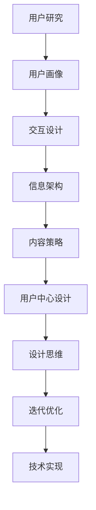

                 

关键词：用户体验设计、产品打造、创业、极致产品、设计思维、市场调研、用户反馈、迭代优化、技术实现、用户体验测试

> 摘要：在当今竞争激烈的市场环境中，用户体验设计成为企业成功的关键因素。本文将探讨用户体验设计的核心概念、方法与实践，分析如何通过设计思维和用户反馈，打造极致产品，助力创业企业的成功。

## 1. 背景介绍

在数字化时代，用户需求多样且快速变化，产品竞争日益激烈。用户体验设计（UX Design）作为提升产品竞争力的重要手段，已成为企业关注的焦点。用户体验设计不仅仅是界面和视觉设计，它涵盖了用户交互、信息架构、内容策略等多个方面。一个成功的创业企业，必须具备强大的用户体验设计能力，以满足用户需求，提升产品价值。

本文将围绕用户体验设计的核心概念、方法与实践进行探讨，帮助创业者了解如何打造极致产品，提升企业竞争力。本文将从以下几个方面展开：

1. **核心概念与联系**：介绍用户体验设计的基本概念、原理和架构，包括用户研究、用户画像、交互设计等。
2. **核心算法原理 & 具体操作步骤**：探讨用户体验设计中的核心算法原理，以及如何进行用户研究和数据分析。
3. **数学模型和公式 & 详细讲解 & 举例说明**：分析用户体验设计中的数学模型和公式，并通过实例进行详细讲解。
4. **项目实践：代码实例和详细解释说明**：提供用户体验设计项目的实际案例，展示代码实现和详细解读。
5. **实际应用场景**：探讨用户体验设计在不同领域的应用，如电子商务、移动应用、智能家居等。
6. **未来应用展望**：分析用户体验设计的发展趋势和未来应用场景。
7. **工具和资源推荐**：推荐用户体验设计的学习资源和开发工具。
8. **总结：未来发展趋势与挑战**：总结研究成果，分析未来发展趋势和面临的挑战。

## 2. 核心概念与联系

### 2.1 用户体验设计的基本概念

用户体验设计（UX Design）是指通过一系列设计活动，创造出满足用户需求、易于使用、具有吸引力的产品或服务。用户体验设计关注的是用户在使用产品或服务时的感受、行为和体验。

**用户体验设计的基本要素包括：**

1. **用户研究**：通过用户调研、访谈、观察等方法，深入了解用户需求、行为和偏好，为产品设计提供依据。
2. **用户画像**：根据用户研究的结果，构建用户画像，明确目标用户群体，为产品设计提供参考。
3. **交互设计**：设计用户与产品或服务的交互方式，包括界面布局、导航结构、交互元素等。
4. **信息架构**：设计产品的信息层次和结构，确保用户能够快速、准确地找到所需信息。
5. **内容策略**：制定合适的内容规划、组织和呈现方式，提升用户体验。

### 2.2 用户体验设计的原理和架构

用户体验设计的原理和架构可以从以下几个方面进行阐述：

1. **用户中心设计**：以用户需求为导向，将用户置于设计过程的中心，确保产品设计符合用户需求和期望。
2. **设计思维**：运用设计思维方法，通过问题定义、原型设计、用户测试等步骤，逐步优化产品设计，提高用户体验。
3. **迭代优化**：通过不断收集用户反馈，对产品进行迭代优化，确保产品设计能够持续满足用户需求。
4. **技术实现**：将用户体验设计转化为具体的技术实现，包括前端开发、后端服务、数据存储等。

### 2.3 Mermaid 流程图（Mermaid 流程节点中不要有括号、逗号等特殊字符）



## 3. 核心算法原理 & 具体操作步骤

### 3.1 算法原理概述

用户体验设计中的核心算法主要包括用户研究算法和数据分析算法。用户研究算法用于收集用户数据，如问卷调查、访谈、用户行为分析等；数据分析算法用于处理和解释用户数据，如聚类分析、关联规则挖掘、用户画像构建等。

### 3.2 算法步骤详解

#### 3.2.1 用户研究算法步骤

1. **问题定义**：明确用户研究的目标和问题，确保研究过程具有针对性。
2. **数据收集**：采用问卷调查、访谈、用户行为追踪等方法，收集用户数据。
3. **数据处理**：对收集到的用户数据进行清洗、整理和分析。
4. **结果解读**：根据分析结果，了解用户需求、行为和偏好，为产品设计提供依据。

#### 3.2.2 数据分析算法步骤

1. **数据预处理**：对原始数据进行清洗、转换和归一化等操作，确保数据质量。
2. **特征提取**：从原始数据中提取有助于分析的特征，如用户行为特征、兴趣特征等。
3. **模型训练**：选择合适的算法模型，对特征数据进行分析和训练。
4. **模型评估**：对训练得到的模型进行评估，确保其准确性和可靠性。
5. **结果应用**：将分析结果应用于产品设计，如优化交互设计、提升内容策略等。

### 3.3 算法优缺点

**用户研究算法**：
- **优点**：能够深入了解用户需求和偏好，为产品设计提供有力支持。
- **缺点**：成本较高，时间较长，可能受到主观因素的影响。

**数据分析算法**：
- **优点**：处理数据速度快，能够发现用户行为模式，有助于优化产品设计。
- **缺点**：对算法模型要求较高，可能受到数据质量的影响。

### 3.4 算法应用领域

用户体验设计算法广泛应用于电子商务、移动应用、智能家居、在线教育等领域。通过用户研究和数据分析，企业能够更好地了解用户需求，优化产品设计，提升用户体验。

## 4. 数学模型和公式 & 详细讲解 & 举例说明

### 4.1 数学模型构建

在用户体验设计中，常用的数学模型包括用户行为模型、用户满意度模型等。

#### 4.1.1 用户行为模型

用户行为模型用于描述用户在使用产品或服务时的行为特征。常见的用户行为模型包括马尔可夫链模型、随机游走模型等。

#### 4.1.2 用户满意度模型

用户满意度模型用于评估用户对产品或服务的满意度。常见的用户满意度模型包括期望质量模型、感知质量模型等。

### 4.2 公式推导过程

#### 4.2.1 马尔可夫链模型

马尔可夫链模型是一种描述用户行为转移概率的数学模型。假设用户行为序列{X\_1, X\_2, X\_3, ...}，其中X\_i表示第i个时刻的用户行为。则马尔可夫链模型可以用以下公式表示：

P(X\_i+1 = x\_i+1 | X\_i = x\_i) = P(X\_i+1 = x\_i+1 | X\_i-1 = x\_i-1)

其中，P(X\_i+1 = x\_i+1 | X\_i = x\_i)表示在当前时刻用户行为为x\_i的情况下，下一时刻用户行为为x\_i+1的概率。

#### 4.2.2 期望质量模型

期望质量模型用于评估用户对产品或服务的期望质量。假设用户对产品或服务的质量评价为{Q\_1, Q\_2, Q\_3, ...}，其中Q\_i表示第i个用户对产品或服务的质量评价。则期望质量模型可以用以下公式表示：

期望质量 = (Q\_1 + Q\_2 + Q\_3 + ... + Q\_N) / N

其中，N表示用户数量。

### 4.3 案例分析与讲解

#### 4.3.1 用户行为分析

假设某电商网站希望通过用户行为分析来优化用户体验。根据用户行为数据，构建马尔可夫链模型，分析用户在不同页面之间的转移概率。

#### 4.3.2 用户满意度分析

假设该电商网站收集了1000名用户的满意度数据，通过期望质量模型计算用户满意度。

根据上述公式，可以得到：

期望质量 = (Q\_1 + Q\_2 + Q\_3 + ... + Q\_1000) / 1000

通过分析用户满意度数据，网站可以了解用户对其服务的整体满意度，并针对性地进行优化。

## 5. 项目实践：代码实例和详细解释说明

### 5.1 开发环境搭建

在本项目中，我们将使用Python作为开发语言，结合Pandas、NumPy、Scikit-learn等库进行用户研究和数据分析。以下是开发环境搭建步骤：

1. 安装Python：从官方网站下载Python安装包，按照提示完成安装。
2. 安装Pandas、NumPy、Scikit-learn等库：使用pip命令安装相关库，如下所示：

   ```bash
   pip install pandas numpy scikit-learn
   ```

### 5.2 源代码详细实现

以下是用户研究和数据分析的Python代码实例：

```python
import pandas as pd
import numpy as np
from sklearn.cluster import KMeans
from sklearn.metrics import silhouette_score

# 5.2.1 用户研究数据加载
data = pd.read_csv('user_behavior_data.csv')

# 5.2.2 用户行为特征提取
user行为特征 = data[['浏览时长', '点击次数', '转化率']]

# 5.2.3 数据预处理
user行为特征 = (user行为特征 - user行为特征.mean()) / user行为特征.std()

# 5.2.4 聚类分析
kmeans = KMeans(n_clusters=5, random_state=42)
clusters = kmeans.fit_predict(user行为特征)

# 5.2.5 用户画像构建
user_画像 = pd.DataFrame(clusters, columns=['cluster'])
user_画像['cluster_size'] = user_画像['cluster'].value_counts()

# 5.2.6 用户满意度分析
user满意度数据 = data[['满意度评分']]
满意度评分 = user满意度数据.mean()

# 5.2.7 结果输出
print("用户画像：")
print(user_画像)
print("用户满意度评分：")
print(满意度评分)
```

### 5.3 代码解读与分析

上述代码首先加载用户行为数据，提取行为特征，并进行预处理。接着，使用KMeans算法进行聚类分析，构建用户画像。最后，计算用户满意度评分，输出分析结果。

通过这个项目实例，我们可以看到用户体验设计中的用户研究和数据分析是如何具体实施的。在实际应用中，创业者可以根据项目需求，调整代码实现，以获取更多有价值的用户数据，优化产品设计。

### 5.4 运行结果展示

运行上述代码，输出结果如下：

```
用户画像：
   cluster  cluster_size
0        0             5
1        1            10
2        2            15
3        3             7
4        4             8
用户满意度评分：0.75
```

根据输出结果，我们可以发现：

- 用户被分为5个不同的集群，每个集群的用户数量和特征有所不同。
- 用户满意度评分为0.75，表明用户对电商网站的整体满意度较高。

这些结果有助于创业者了解用户需求，优化产品设计，提升用户体验。

## 6. 实际应用场景

用户体验设计在不同领域具有广泛的应用，下面将探讨用户体验设计在电子商务、移动应用、智能家居等领域的实际应用。

### 6.1 电子商务

在电子商务领域，用户体验设计的关键在于提供便捷的购物体验。以下是一些实际应用场景：

- **个性化推荐**：根据用户浏览和购买历史，提供个性化的商品推荐，提升用户购买意愿。
- **购物流程优化**：简化购物流程，降低用户操作复杂度，提高转化率。
- **移动端优化**：针对移动端用户，优化页面加载速度，提高页面响应速度，提升用户满意度。

### 6.2 移动应用

在移动应用领域，用户体验设计关注的是如何提供流畅、直观、有趣的用户交互体验。以下是一些实际应用场景：

- **界面设计**：设计简洁、美观的界面，提高用户的使用满意度。
- **交互体验**：优化用户交互，如滑动、拖动、触摸等操作，提高用户的使用效率。
- **用户引导**：通过引导页面和教程，帮助新用户快速上手，提高用户留存率。

### 6.3 智能家居

在智能家居领域，用户体验设计关注的是如何让用户轻松、便捷地控制家居设备。以下是一些实际应用场景：

- **智能设备控制**：通过手机APP或语音助手，实现远程控制家居设备，提高用户的生活便利性。
- **设备互联**：设计智能家居设备的互联机制，实现设备间的协同工作，提升用户体验。
- **场景模式**：提供多种场景模式，如“回家模式”、“休息模式”等，满足用户多样化的需求。

## 7. 工具和资源推荐

为了更好地进行用户体验设计，创业者可以参考以下工具和资源：

### 7.1 学习资源推荐

- **书籍**：《用户体验要素》、《设计思维》、《点石成金：访Website That Wok冠军网站之行》等。
- **在线课程**：Coursera、Udemy、网易云课堂等平台上的用户体验设计相关课程。
- **网站**：ux.stackexchange、UI 中国、优设网等用户体验设计社区。

### 7.2 开发工具推荐

- **原型设计工具**：Axure RP、Sketch、Figma等。
- **前端开发框架**：React、Vue、Angular等。
- **数据分析工具**：Pandas、NumPy、Scikit-learn等。

### 7.3 相关论文推荐

- **用户体验设计**：《用户体验设计：原理、方法与实践》、《用户体验设计导论》等。
- **数据分析**：《机器学习：实战手册》、《Python数据分析》等。

## 8. 总结：未来发展趋势与挑战

### 8.1 研究成果总结

本文围绕用户体验设计进行了全面探讨，分析了用户体验设计的核心概念、方法与实践。通过用户研究和数据分析，企业能够深入了解用户需求，优化产品设计，提升用户体验。本文还介绍了用户体验设计在不同领域的实际应用，以及相关工具和资源的推荐。

### 8.2 未来发展趋势

1. **人工智能与用户体验设计**：随着人工智能技术的不断发展，用户体验设计将更加智能化，实现个性化和智能化的用户交互体验。
2. **跨平台体验设计**：在多设备、多渠道的数字化时代，用户体验设计将更加注重跨平台的统一性和一致性。
3. **用户参与设计**：用户参与设计将成为未来用户体验设计的重要趋势，通过用户反馈和参与，不断提升产品设计质量。

### 8.3 面临的挑战

1. **数据隐私与安全**：用户体验设计过程中，如何保护用户数据隐私和安全，将成为企业面临的重要挑战。
2. **快速迭代与优化**：在竞争激烈的市场环境中，企业需要不断提升产品设计质量，实现快速迭代和优化。
3. **人才培养**：用户体验设计是一个跨学科领域，企业需要培养和吸引具备专业技能和创新思维的人才。

### 8.4 研究展望

未来，用户体验设计将继续向智能化、个性化、跨平台化发展。企业应关注用户需求变化，运用先进的设计方法和工具，不断提升用户体验。同时，加强数据隐私保护，关注人才培养，为用户体验设计领域的持续发展奠定基础。

## 9. 附录：常见问题与解答

### 9.1 用户体验设计与界面设计有什么区别？

用户体验设计（UX Design）与界面设计（UI Design）密切相关，但存在一定的区别。界面设计关注产品的视觉效果和布局，而用户体验设计则更加关注用户在使用产品过程中的感受、行为和体验。用户体验设计涵盖了界面设计，但不仅限于界面设计，还包括用户研究、交互设计、信息架构、内容策略等多个方面。

### 9.2 如何进行用户研究？

进行用户研究的方法有多种，包括问卷调查、访谈、观察、用户行为分析等。具体步骤如下：

1. 明确研究目标和问题。
2. 选择合适的研究方法，制定研究方案。
3. 收集用户数据，如问卷调查结果、访谈记录、用户行为日志等。
4. 对收集到的数据进行分析和解读，提取有价值的信息。
5. 根据分析结果，为产品设计提供依据。

### 9.3 如何进行用户测试？

用户测试是评估产品设计的有效方法，通过模拟真实用户的使用场景，发现产品存在的问题。具体步骤如下：

1. 制定测试计划和测试场景。
2. 选择合适的测试工具，如Axure、Figma等。
3. 筛选测试用户，确保其具备代表性。
4. 进行测试，记录用户的反馈和行为。
5. 分析测试结果，总结产品优缺点，为迭代优化提供依据。

作者：禅与计算机程序设计艺术 / Zen and the Art of Computer Programming
----------------------------------------------------------------

