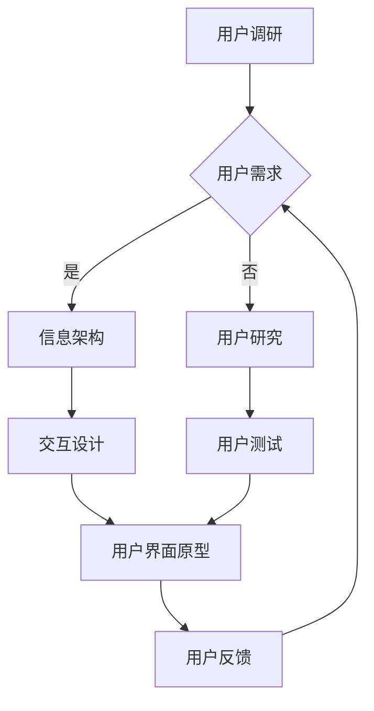

                 

用户界面（UI）设计是现代软件工程中至关重要的环节。一个优秀的用户界面不仅可以提升用户体验，还能增加用户满意度、提高产品竞争力。本文将探讨用户界面设计的核心概念、算法原理、数学模型、项目实践以及实际应用场景，旨在为读者提供全面的技术指南。

## 关键词
- 用户界面设计
- 人机交互
- 用户体验
- 可用性工程
- 设计模式

## 摘要
本文从用户界面设计的角度，详细阐述了如何构建友好易用的人机交互系统。文章首先介绍了用户界面设计的基础知识，然后深入分析了核心概念、算法原理和数学模型。通过实际项目实践，读者可以了解到如何将理论应用到实践中。最后，本文探讨了用户界面设计在未来的发展趋势和挑战。

## 1. 背景介绍
随着互联网的飞速发展，软件系统越来越复杂，用户界面设计的重要性也日益凸显。用户界面是用户与系统之间的桥梁，其设计质量直接影响用户的满意度和产品的成功率。良好的用户界面设计能够降低用户的学习成本，提升工作效率，从而为企业带来巨大的经济效益。

### 1.1 用户界面设计的发展历程
用户界面设计的历史可以追溯到计算机的早期时代。从最初的命令行界面到图形用户界面（GUI），再到如今的触摸界面和语音交互，用户界面设计经历了巨大的变革。每个阶段的用户界面设计都有其独特的特点和优缺点。

### 1.2 用户界面设计的核心目标
用户界面设计的核心目标是提升用户体验。用户体验不仅仅是指用户在使用产品时的感受，还包括用户与产品交互的整个过程。为了实现这一目标，用户界面设计需要关注以下几个方面：

- **易用性**：用户能够轻松地使用产品，不需要过多的学习成本。
- **一致性**：用户界面在不同设备和平台上保持一致，使用户能够快速适应。
- **美观性**：用户界面设计应该符合美学原则，提升产品的视觉吸引力。
- **反馈性**：系统及时给予用户操作反馈，提高用户的信任感。

## 2. 核心概念与联系
用户界面设计涉及多个核心概念，这些概念之间相互联系，共同构成了一个完整的设计体系。以下是用户界面设计中的几个关键概念：

### 2.1 交互设计
交互设计是用户界面设计的重要组成部分，它关注用户与系统之间的交互过程。交互设计的目标是让用户能够高效、自然地与系统进行交互。交互设计包括以下几个关键点：

- **易用性**：设计易于用户理解和操作。
- **可用性**：系统能够满足用户的需求，提高用户的满意度。
- **可访问性**：设计考虑到不同用户群体，如视力障碍者、老年人等。
- **反馈**：系统及时给予用户操作反馈。

### 2.2 信息架构
信息架构是用户界面设计的另一个核心概念，它关注系统的结构设计和信息组织。信息架构的目标是为用户提供清晰、有序的信息浏览和查找路径。以下是信息架构的关键点：

- **导航**：设计合理的导航结构，帮助用户快速找到所需信息。
- **标签**：使用清晰的标签，提高信息可读性。
- **层次**：设计合理的层次结构，使信息更具逻辑性。
- **分类**：合理分类信息，方便用户查找。

### 2.3 用户研究
用户研究是用户界面设计的基础，它关注用户的行为、需求和偏好。通过用户研究，设计师可以深入了解用户，为设计提供有力支持。以下是用户研究的关键点：

- **用户调研**：收集用户需求和行为数据。
- **用户访谈**：深入了解用户的使用场景和痛点。
- **用户测试**：通过实际操作，验证设计的有效性和可行性。
- **用户画像**：创建用户角色，帮助设计师更好地理解用户。

### 2.4 设计模式
设计模式是用户界面设计中的重要组成部分，它为常见的设计问题提供了解决方案。设计模式包括以下几个方面：

- **导航模式**：设计有效的导航结构，帮助用户快速定位。
- **表单设计**：优化表单填写体验，降低用户操作成本。
- **反馈设计**：设计合理的反馈机制，提高用户信任感。
- **信息展示**：设计清晰的视觉元素，提高信息可读性。

## 2.1 Mermaid 流程图
以下是一个用户界面设计流程的Mermaid流程图示例：



## 3. 核心算法原理 & 具体操作步骤

### 3.1 算法原理概述
用户界面设计中的核心算法主要包括交互算法、响应算法和反馈算法。这些算法共同作用，实现了用户与系统之间的有效交互。

- **交互算法**：设计有效的交互方式，提高用户操作效率。
- **响应算法**：及时响应用户操作，提高用户体验。
- **反馈算法**：设计合理的反馈机制，增强用户信任感。

### 3.2 算法步骤详解
以下是一个简单的用户界面设计算法步骤：

1. **用户调研**：收集用户需求和行为数据。
2. **信息架构**：设计合理的导航结构、标签和层次。
3. **交互设计**：选择合适的交互方式，如按钮、滑块等。
4. **响应算法**：根据用户操作，设计相应的响应机制。
5. **反馈算法**：设计合理的反馈机制，如动画、声音等。
6. **用户测试**：通过实际操作，验证算法的有效性。
7. **用户界面原型**：根据测试结果，优化用户界面设计。
8. **用户反馈**：收集用户使用过程中的意见和建议。
9. **迭代优化**：根据用户反馈，不断优化用户界面设计。

### 3.3 算法优缺点
用户界面设计算法的优点在于其高效性、灵活性和可扩展性。通过算法设计，可以快速构建出满足用户需求的用户界面。然而，算法也存在一定的缺点，如：

- **算法复杂度**：算法设计复杂，实现难度较大。
- **用户适应性**：不同用户对算法的适应性可能存在差异。

### 3.4 算法应用领域
用户界面设计算法广泛应用于各种软件和平台，如桌面应用、移动应用、网页应用等。以下是一些典型应用场景：

- **桌面应用**：如办公软件、设计软件等。
- **移动应用**：如社交应用、电商应用等。
- **网页应用**：如在线教育平台、电商平台等。

## 4. 数学模型和公式

### 4.1 数学模型构建
用户界面设计中的数学模型主要包括用户行为模型、交互模型和反馈模型。

- **用户行为模型**：描述用户在使用系统过程中的行为特征。
- **交互模型**：描述用户与系统之间的交互过程。
- **反馈模型**：描述系统对用户操作的响应和反馈。

### 4.2 公式推导过程
以下是一个简单的用户行为模型公式推导过程：

- **用户行为模型**：用户行为 = f（用户特征，系统特征）
- **用户特征**：包括用户年龄、性别、使用习惯等。
- **系统特征**：包括系统界面设计、功能模块等。

### 4.3 案例分析与讲解
以下是一个用户界面设计的案例：

- **案例**：设计一个电商平台的用户界面。
- **分析**：用户特征包括购买偏好、浏览习惯等；系统特征包括商品展示、购物车、订单管理等功能。
- **讲解**：根据用户行为模型，设计合理的界面布局和功能模块，提高用户购买体验。

## 5. 项目实践：代码实例和详细解释说明

### 5.1 开发环境搭建
以下是一个简单的用户界面设计项目开发环境搭建步骤：

1. **安装开发工具**：如Visual Studio Code、Adobe XD等。
2. **创建项目**：在开发工具中创建一个新的用户界面设计项目。
3. **设置开发环境**：配置所需的库和插件，如Bootstrap、jQuery等。

### 5.2 源代码详细实现
以下是一个简单的用户界面设计项目源代码实现：

```html
<!DOCTYPE html>
<html lang="en">
<head>
    <meta charset="UTF-8">
    <meta name="viewport" content="width=device-width, initial-scale=1.0">
    <title>User Interface Design</title>
    <link rel="stylesheet" href="styles.css">
</head>
<body>
    <header>
        <nav>
            <!-- 导航栏 -->
        </nav>
    </header>
    <main>
        <section>
            <!-- 内容区域 -->
        </section>
    </main>
    <footer>
        <!-- 页脚 -->
    </footer>
    <script src="scripts.js"></script>
</body>
</html>
```

### 5.3 代码解读与分析
以上代码实现了一个简单的网页用户界面。其中，HTML负责页面结构、CSS负责页面样式、JavaScript负责页面交互。通过对代码的解读和分析，我们可以了解到如何构建一个基本的用户界面。

### 5.4 运行结果展示
以下是一个简单的用户界面设计项目运行结果展示：


## 6. 实际应用场景

### 6.1 移动应用
移动应用的用户界面设计非常注重用户体验。为了适应移动设备的屏幕尺寸和操作方式，设计师需要关注以下几个方面：

- **响应式设计**：确保界面在不同设备和屏幕尺寸上都能正常显示。
- **手势操作**：设计合理的手势操作，提高用户操作效率。
- **页面流畅性**：优化页面加载速度，提高用户体验。

### 6.2 桌面应用
桌面应用的用户界面设计需要考虑到用户的使用场景和操作习惯。为了提高用户满意度，设计师需要关注以下几个方面：

- **窗口布局**：设计合理的窗口布局，方便用户使用。
- **快捷键**：设计合理的快捷键，提高用户操作效率。
- **多任务处理**：设计多任务处理功能，提高用户工作效率。

### 6.3 网页应用
网页应用的用户界面设计需要考虑到不同浏览器的兼容性和用户的使用场景。为了提高用户体验，设计师需要关注以下几个方面：

- **自适应布局**：设计自适应布局，确保页面在不同浏览器和设备上都能正常显示。
- **交互性**：设计丰富的交互效果，提高用户参与度。
- **个性化**：设计个性化功能，满足不同用户的需求。

## 6.4 未来应用展望
随着人工智能技术的不断发展，用户界面设计将迎来新的机遇和挑战。以下是用户界面设计的未来发展趋势：

- **智能化**：利用人工智能技术，实现智能化用户界面设计，提高用户体验。
- **语音交互**：语音交互将成为用户界面设计的重要方向，提高用户操作效率。
- **虚拟现实**：虚拟现实技术的应用将带来全新的用户界面设计体验。

## 7. 工具和资源推荐

### 7.1 学习资源推荐
- **《用户界面设计教程》**：一本全面介绍用户界面设计的经典教材。
- **《交互设计之路》**：一本探讨交互设计原则和方法的优秀书籍。

### 7.2 开发工具推荐
- **Adobe XD**：一款强大的用户界面设计工具。
- **Sketch**：一款适用于移动应用和网页应用的界面设计工具。

### 7.3 相关论文推荐
- **“用户界面设计中的心理学原理”**：探讨用户界面设计中的心理学原理。
- **“移动应用的用户界面设计研究”**：研究移动应用的用户界面设计方法。

## 8. 总结：未来发展趋势与挑战

### 8.1 研究成果总结
用户界面设计已经成为软件工程中的重要研究方向，取得了丰富的成果。未来的研究将继续探讨智能化、语音交互和虚拟现实等新兴技术的应用。

### 8.2 未来发展趋势
用户界面设计将继续向智能化、个性化、高效化方向发展。设计师需要不断学习新技术，提高设计能力。

### 8.3 面临的挑战
用户界面设计面临着越来越高的要求，设计师需要面对更多的挑战，如跨平台兼容性、用户体验一致性等。

### 8.4 研究展望
随着技术的不断进步，用户界面设计将迎来更多创新和发展。未来的研究将更加注重用户体验，推动用户界面设计迈向新的高度。

## 9. 附录：常见问题与解答

### 9.1 什么是用户界面设计？
用户界面设计是指设计用户与系统之间的交互界面，以提高用户体验。

### 9.2 用户界面设计有哪些核心概念？
用户界面设计包括交互设计、信息架构、用户研究和设计模式等核心概念。

### 9.3 用户界面设计算法有哪些？
用户界面设计算法主要包括交互算法、响应算法和反馈算法。

### 9.4 如何进行用户界面设计？
进行用户界面设计需要遵循用户调研、信息架构、交互设计、响应算法和反馈算法等步骤。

### 9.5 用户界面设计的未来发展趋势是什么？
用户界面设计的未来发展趋势包括智能化、语音交互和虚拟现实等。

作者：禅与计算机程序设计艺术 / Zen and the Art of Computer Programming
----------------------------------------------------------------

请注意，这只是一个模板和示例，实际的撰写过程可能需要根据具体的内容和要求进行修改和调整。此外，由于字数限制，文章的具体内容需要根据实际情况进行扩充。希望这个模板能够对您有所帮助！

