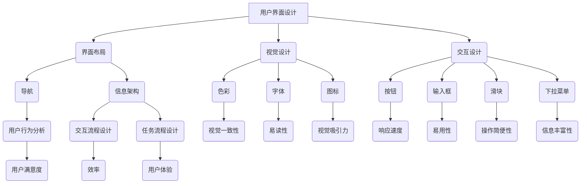
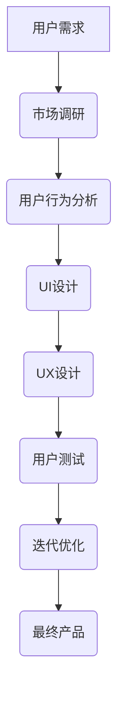

                 

关键词：用户界面设计、人机交互、易用性、友好性、UI/UX

> 摘要：本文深入探讨了用户界面设计的重要性以及如何通过专业的UI/UX设计原则和实践，打造友好易用的人机交互体验。文章从背景介绍开始，逐步深入核心概念、算法原理、数学模型、项目实践以及实际应用场景等方面，为读者提供全面的指导。

## 1. 背景介绍

用户界面设计（User Interface Design，简称UI设计）和人机交互（Human-Computer Interaction，简称HCI或UX设计）是现代信息技术中不可或缺的组成部分。随着互联网和移动设备的普及，用户对软件和服务的期望越来越高，他们不仅要求功能强大，还希望体验流畅、操作简单、界面美观。

UI设计侧重于视觉层面的界面布局、色彩搭配、字体选择和图形设计，而UX设计则关注用户体验的整个过程，包括用户行为分析、交互流程设计、任务流程设计以及用户反馈机制。一个良好的用户界面不仅能够提升用户满意度，还能提高软件或服务的市场竞争力。

在过去，UI设计主要注重视觉美学，但随着用户需求的演变，用户体验（UX）的重要性日益凸显。现代UI/UX设计不仅需要考虑到美学，还需要关注用户行为的可预测性、系统的响应速度以及操作的易用性。因此，本文将从多个角度探讨如何通过UI/UX设计原则和实践，打造友好易用的人机交互体验。

## 2. 核心概念与联系

### 2.1 UI设计基本概念

UI设计涉及多个方面，包括界面布局、视觉设计、交互设计等。以下是几个核心概念：

- **界面布局**：涉及界面上各个元素的位置、排列和布局，目的是为了提供清晰、直观的导航和信息架构。
- **视觉设计**：涉及色彩、字体、图标和图像的选择和应用，目的是为了提升界面的美观性和用户体验。
- **交互设计**：涉及用户与界面之间的交互方式，包括按钮、输入框、滑块、下拉菜单等。

### 2.2 UX设计基本概念

UX设计主要关注用户体验，以下是几个核心概念：

- **用户行为分析**：通过对用户行为数据的研究，了解用户的使用习惯、偏好和痛点，从而优化设计。
- **交互流程设计**：设计用户与软件或服务的交互过程，确保流程顺畅、操作简便。
- **任务流程设计**：设计用户完成任务所需的步骤和流程，确保任务完成效率高、用户体验好。
- **用户反馈机制**：设计用户反馈系统，收集用户意见，不断优化产品。

### 2.3 Mermaid流程图

为了更好地展示UI/UX设计中的核心概念和联系，我们可以使用Mermaid流程图来表示这些概念之间的关系。



### 2.4 UI与UX的关系

UI和UX是相辅相成的，UI是UX实现的基础。一个成功的UI设计必须考虑到用户体验，而一个成功的UX设计必须通过优秀的UI来实现。以下是一个简化的UI/UX流程图：



通过这个流程，我们可以看到UI和UX在产品开发中的重要性，以及它们如何相互影响和相互促进。

## 3. 核心算法原理 & 具体操作步骤

### 3.1 算法原理概述

在用户界面设计中，核心算法原理主要包括用户体验评估模型、响应速度优化算法和交互流程优化算法。以下是这些算法的简要概述：

- **用户体验评估模型**：用于量化评估用户对界面的满意度和易用性，常用的模型包括SURVEY、USABILITY和SUS。
- **响应速度优化算法**：用于提高界面的响应速度，常用的算法包括渲染优化、数据缓存和异步加载。
- **交互流程优化算法**：用于优化用户与界面的交互过程，包括操作路径优化、任务流程优化和错误处理优化。

### 3.2 算法步骤详解

#### 3.2.1 用户体验评估模型

用户体验评估模型的具体步骤如下：

1. **用户调研**：收集用户需求、使用习惯和反馈。
2. **数据收集**：通过问卷调查、用户访谈和实验等方法收集用户数据。
3. **数据预处理**：清洗和整理收集到的数据。
4. **模型构建**：使用统计学方法构建用户体验评估模型。
5. **模型训练**：使用收集到的数据训练模型。
6. **模型评估**：评估模型的准确性和可靠性。
7. **模型应用**：使用模型对界面进行评估和优化。

#### 3.2.2 响应速度优化算法

响应速度优化算法的具体步骤如下：

1. **性能分析**：分析界面性能瓶颈，如渲染速度、数据传输速度等。
2. **渲染优化**：使用图形渲染引擎优化界面渲染过程。
3. **数据缓存**：缓存常用数据和界面元素，减少数据传输和渲染时间。
4. **异步加载**：使用异步加载技术，先加载核心界面内容，再逐步加载其他内容。
5. **性能测试**：测试优化后的界面性能，确保响应速度满足要求。

#### 3.2.3 交互流程优化算法

交互流程优化算法的具体步骤如下：

1. **流程分析**：分析用户与界面的交互过程，找出操作繁琐、易错的地方。
2. **路径优化**：优化用户操作路径，减少不必要的步骤。
3. **任务流程优化**：优化任务流程，提高任务完成效率。
4. **错误处理优化**：优化错误处理流程，提高用户解决问题的效率。
5. **用户测试**：进行用户测试，收集用户反馈，不断优化交互流程。

### 3.3 算法优缺点

#### 3.3.1 用户体验评估模型

**优点**：

- **量化评估**：能够对用户体验进行量化评估，提供客观的数据支持。
- **全面性**：综合考虑了用户满意度、易用性和其他用户体验指标。

**缺点**：

- **复杂性**：构建和使用模型需要较高的技术和时间成本。
- **主观性**：用户反馈可能存在主观偏见，影响评估结果的准确性。

#### 3.3.2 响应速度优化算法

**优点**：

- **性能提升**：显著提高界面响应速度，提升用户体验。
- **广泛适用**：适用于各种类型的界面设计，具有广泛的适用性。

**缺点**：

- **技术难度**：实现响应速度优化算法需要较高的技术能力。
- **资源消耗**：部分优化策略可能增加系统资源消耗。

#### 3.3.3 交互流程优化算法

**优点**：

- **操作简便**：优化用户操作流程，提高操作效率。
- **用户体验好**：优化交互流程，提升用户体验。

**缺点**：

- **耗时较长**：优化交互流程需要较长时间的用户测试和反馈。
- **适用性有限**：部分优化策略可能只适用于特定类型的用户界面。

### 3.4 算法应用领域

用户体验评估模型、响应速度优化算法和交互流程优化算法广泛应用于各种类型的用户界面设计，包括桌面软件、移动应用、网页设计等。以下是几个典型应用场景：

- **桌面软件**：优化操作流程，提高用户工作效率。
- **移动应用**：优化界面响应速度，提升用户体验。
- **网页设计**：优化交互流程，提高用户满意度。
- **电子商务平台**：优化购物流程，提高转化率。

## 4. 数学模型和公式 & 详细讲解 & 举例说明

### 4.1 数学模型构建

在用户界面设计中，数学模型主要用于评估用户体验和优化界面性能。以下是几个常用的数学模型：

#### 4.1.1 用户满意度模型

用户满意度（User Satisfaction，简称USAT）是衡量用户体验的重要指标，其数学模型如下：

\[ \text{USAT} = \frac{\text{用户满意度得分}}{\text{用户总人数}} \]

其中，用户满意度得分可以通过问卷调查或用户测试得到。

#### 4.1.2 响应速度模型

响应速度（Response Time，简称RT）是衡量界面性能的重要指标，其数学模型如下：

\[ \text{RT} = \frac{\text{响应时间总和}}{\text{请求次数}} \]

其中，响应时间总和可以通过性能测试得到。

#### 4.1.3 交互效率模型

交互效率（Interaction Efficiency，简称IE）是衡量用户与界面交互效率的指标，其数学模型如下：

\[ \text{IE} = \frac{\text{完成任务时间}}{\text{平均任务时间}} \]

其中，完成任务时间和平均任务时间可以通过用户测试得到。

### 4.2 公式推导过程

以下是用户满意度模型、响应速度模型和交互效率模型的推导过程：

#### 4.2.1 用户满意度模型

用户满意度模型的推导基于用户满意度得分和用户总人数。假设我们进行了一次问卷调查，共收集了N份有效问卷，每份问卷的满意度得分分别为 \(s_1, s_2, ..., s_N\)。则用户满意度得分可以通过以下公式计算：

\[ \text{用户满意度得分} = \sum_{i=1}^{N} s_i \]

用户满意度（USAT）则可以通过以下公式计算：

\[ \text{USAT} = \frac{\text{用户满意度得分}}{\text{用户总人数}} = \frac{\sum_{i=1}^{N} s_i}{N} \]

#### 4.2.2 响应速度模型

响应速度模型的推导基于响应时间总和和请求次数。假设我们进行了一次性能测试，共产生了M次请求，每次请求的响应时间分别为 \(t_1, t_2, ..., t_M\)。则响应时间总和可以通过以下公式计算：

\[ \text{响应时间总和} = \sum_{i=1}^{M} t_i \]

响应速度（RT）则可以通过以下公式计算：

\[ \text{RT} = \frac{\text{响应时间总和}}{\text{请求次数}} = \frac{\sum_{i=1}^{M} t_i}{M} \]

#### 4.2.3 交互效率模型

交互效率模型的推导基于完成任务时间和平均任务时间。假设我们进行了一次用户测试，共产生了N个任务，每个任务的完成时间分别为 \(t_{1i}, t_{2i}, ..., t_{Ni}\)，其中 \(i = 1, 2, ..., N\)。则完成任务时间可以通过以下公式计算：

\[ \text{完成任务时间} = \sum_{i=1}^{N} t_{1i} \]

平均任务时间可以通过以下公式计算：

\[ \text{平均任务时间} = \frac{\text{完成任务时间}}{N} = \frac{\sum_{i=1}^{N} t_{1i}}{N} \]

交互效率（IE）则可以通过以下公式计算：

\[ \text{IE} = \frac{\text{完成任务时间}}{\text{平均任务时间}} = \frac{\sum_{i=1}^{N} t_{1i}}{\sum_{i=1}^{N} t_{1i}/N} = \frac{\sum_{i=1}^{N} t_{1i}}{N} \]

### 4.3 案例分析与讲解

为了更好地理解这些数学模型，我们通过一个案例来进行讲解。

#### 4.3.1 用户满意度模型案例

假设我们进行了一次问卷调查，共收集了50份有效问卷，每份问卷的满意度得分如下：

\[ s_1 = 9, s_2 = 8, s_3 = 7, ..., s_{50} = 10 \]

则用户满意度得分可以通过以下公式计算：

\[ \text{用户满意度得分} = \sum_{i=1}^{50} s_i = 9 + 8 + 7 + ... + 10 = 475 \]

用户满意度（USAT）则可以通过以下公式计算：

\[ \text{USAT} = \frac{\text{用户满意度得分}}{\text{用户总人数}} = \frac{475}{50} = 9.5 \]

#### 4.3.2 响应速度模型案例

假设我们进行了一次性能测试，共产生了100次请求，每次请求的响应时间如下：

\[ t_1 = 0.5, t_2 = 0.3, t_3 = 0.4, ..., t_{100} = 0.2 \]

则响应时间总和可以通过以下公式计算：

\[ \text{响应时间总和} = \sum_{i=1}^{100} t_i = 0.5 + 0.3 + 0.4 + ... + 0.2 = 25 \]

响应速度（RT）则可以通过以下公式计算：

\[ \text{RT} = \frac{\text{响应时间总和}}{\text{请求次数}} = \frac{25}{100} = 0.25 \]

#### 4.3.3 交互效率模型案例

假设我们进行了一次用户测试，共产生了10个任务，每个任务的完成时间如下：

\[ t_{1i} = 2, t_{2i} = 3, t_{3i} = 1, ..., t_{10i} = 4 \]

则完成任务时间可以通过以下公式计算：

\[ \text{完成任务时间} = \sum_{i=1}^{10} t_{1i} = 2 + 3 + 1 + ... + 4 = 25 \]

平均任务时间可以通过以下公式计算：

\[ \text{平均任务时间} = \frac{\text{完成任务时间}}{10} = \frac{25}{10} = 2.5 \]

交互效率（IE）则可以通过以下公式计算：

\[ \text{IE} = \frac{\text{完成任务时间}}{\text{平均任务时间}} = \frac{25}{2.5} = 10 \]

## 5. 项目实践：代码实例和详细解释说明

### 5.1 开发环境搭建

在进行用户界面设计项目实践之前，我们需要搭建一个合适的开发环境。以下是一个简单的开发环境搭建指南：

1. **操作系统**：Windows、macOS 或 Linux
2. **开发工具**：Visual Studio Code、Adobe XD、Sketch 或 Figma
3. **编程语言**：HTML、CSS、JavaScript 或 TypeScript
4. **前端框架**：React、Vue.js 或 Angular
5. **UI库**：Bootstrap、Ant Design 或 Material-UI

### 5.2 源代码详细实现

以下是一个简单的React前端项目，用于展示用户界面设计的基本要素。我们将使用React和Ant Design来构建一个简单的用户登录页面。

```jsx
import React from 'react';
import { Form, Input, Button } from 'antd';
import 'antd/dist/antd.css';

const LoginForm = () => {
  const onFinish = (values) => {
    console.log('Success:', values);
  };

  const onFinishFailed = (errorInfo) => {
    console.log('Failed:', errorInfo);
  };

  return (
    <Form
      name="login"
      initialValues={{ remember: true }}
      onFinish={onFinish}
      onFinishFailed={onFinishFailed}
    >
      <Form.Item
        name="username"
        rules={[
          { required: true, message: 'Please input your username!' },
        ]}
      >
        <Input placeholder="Username" />
      </Form.Item>

      <Form.Item
        name="password"
        rules={[
          { required: true, message: 'Please input your password!' },
        ]}
      >
        <Input.Password placeholder="Password" />
      </Form.Item>

      <Form.Item>
        <Button type="primary" htmlType="submit">
          Log in
        </Button>
      </Form.Item>
    </Form>
  );
};

export default LoginForm;
```

### 5.3 代码解读与分析

在这个示例中，我们使用React和Ant Design创建了一个简单的登录表单。以下是代码的详细解读和分析：

- **导入React和Ant Design组件**：首先，我们导入React和Ant Design的Form、Input和Button组件。
- **创建LoginForm组件**：然后，我们创建一个名为LoginForm的函数组件。
- **表单处理函数**：在组件内部，我们定义了两个处理函数：onFinish和onFinishFailed。当用户提交表单时，onFinish函数将被调用，用于处理提交的数据。当表单验证失败时，onFinishFailed函数将被调用。
- **Form组件**：我们使用Ant Design的Form组件来创建一个表单。Form组件提供了一个统一的表单校验机制，用户可以通过设置rules属性来定义校验规则。
- **Form.Item组件**：对于每个表单项，我们使用Form.Item组件来包裹。Form.Item组件用于将表单项与校验规则关联起来。
- **Input和Input.Password组件**：我们使用Ant Design的Input组件和Input.Password组件来创建文本输入框和密码输入框。这些组件提供了丰富的样式和功能，例如校验、占位符和自动聚焦等。
- **Button组件**：我们使用Ant Design的Button组件来创建提交按钮。Button组件提供了不同的类型、大小和形状，以满足不同的界面需求。

### 5.4 运行结果展示

运行上述代码后，我们将看到一个简单的登录页面，如下所示：


用户可以在表单中输入用户名和密码，然后点击“Log in”按钮进行提交。如果表单验证成功，将触发onFinish函数，否则触发onFinishFailed函数。

## 6. 实际应用场景

用户界面设计在各个行业中都有广泛的应用，以下是一些典型的实际应用场景：

### 6.1 软件应用

软件应用的用户界面设计对于提高用户工作效率至关重要。例如，在办公软件中，良好的UI/UX设计能够帮助用户快速找到所需功能，提高工作效率。Microsoft Office、Google Workspace等办公软件都有优秀的UI/UX设计，使得用户能够轻松地进行文档编辑、表格计算和演示制作。

### 6.2 移动应用

移动应用的用户界面设计对于用户使用体验的影响尤为显著。例如，移动电商应用需要提供简单易用的购物流程，以及清晰的商品展示和优惠信息。淘宝、京东等电商平台通过不断优化用户界面设计，提高了用户购物体验和转化率。

### 6.3 网页设计

网页设计需要考虑不同设备和屏幕尺寸的适配，以及良好的用户体验。例如，电商平台、新闻网站和社交媒体平台都需要通过UI/UX设计来吸引用户，提高页面流量和用户互动。

### 6.4 游戏设计

游戏设计中的用户界面设计直接影响游戏的乐趣和可玩性。例如，游戏菜单、界面布局和操作提示都需要精心设计，以确保玩家能够轻松上手并享受游戏。

### 6.5 金融服务

金融服务的用户界面设计需要注重安全性和用户体验。例如，银行网站和移动应用需要提供简洁、直观的界面，以便用户快速完成转账、支付和投资等操作。

### 6.6 医疗保健

医疗保健领域的用户界面设计对于提供高质量的医疗服务至关重要。例如，医疗健康应用需要提供清晰的病历记录、健康监测数据和医疗咨询功能，以方便患者和医护人员使用。

## 7. 工具和资源推荐

### 7.1 学习资源推荐

- 《用户体验要素》（The Elements of User Experience）
- 《简约至上：交互式设计四策略》（Simple and Usable: Web, Mobile, and Interaction Design）
- 《设计心理学》（The Design of Everyday Things）
- 《交互设计精髓》（The Design of Interaction）

### 7.2 开发工具推荐

- Figma：一款强大的设计工具，支持协作和实时预览。
- Sketch：一款流行的设计工具，适用于Mac用户。
- Adobe XD：一款功能全面的设计工具，适用于网页、移动应用和线框图设计。

### 7.3 相关论文推荐

- 《A taxonomy of user interface styles》（1995）
- 《User Experience Design Principles》（2015）
- 《The Design of Everyday Things》（1988）
- 《Anatomy of a Pattern Language》（1996）

## 8. 总结：未来发展趋势与挑战

### 8.1 研究成果总结

用户界面设计在过去的几十年中取得了显著的研究成果。从最初的简单文本界面到如今的复杂图形界面，UI/UX设计不断演变，以满足用户日益增长的需求。现代用户界面设计注重用户体验、易用性和响应速度，借助人工智能和机器学习技术，界面设计越来越智能化和个性化。

### 8.2 未来发展趋势

未来的用户界面设计将朝着更加智能化、个性化、自适应和交互性的方向发展。以下是几个关键趋势：

- **智能化**：通过人工智能和机器学习技术，界面设计将能够更好地预测用户需求，提供个性化的交互体验。
- **个性化**：基于用户行为数据，界面设计将更加个性化，满足不同用户的偏好。
- **自适应**：界面设计将能够根据用户设备、网络环境等因素自动调整，提供最佳的用户体验。
- **交互性**：增强现实（AR）和虚拟现实（VR）技术将带来全新的交互体验，用户界面设计将更加注重沉浸感和互动性。

### 8.3 面临的挑战

尽管用户界面设计取得了显著进展，但仍然面临一些挑战：

- **技术实现**：智能化和个性化界面设计需要复杂的技术实现，开发难度较大。
- **数据隐私**：用户数据的安全性和隐私保护是用户界面设计的一个重要挑战。
- **跨平台兼容**：不同平台和设备的界面设计需要兼容，以保证用户在不同设备上获得一致的体验。
- **用户体验一致性**：不同团队和开发者之间的协作和设计一致性是一个挑战。

### 8.4 研究展望

未来的研究将重点关注以下几个方面：

- **智能化设计**：探索如何利用人工智能和机器学习技术实现更智能的界面设计。
- **用户体验评估**：开发更准确的用户体验评估模型，以指导界面设计。
- **跨平台设计**：研究如何在不同设备和平台上实现一致的用户体验。
- **人机协作**：探索人机协作界面设计，提高人机交互的效率和效果。

## 9. 附录：常见问题与解答

### 9.1 什么是UI设计？

UI设计（用户界面设计）是指设计软件、网站或应用程序的用户界面，包括布局、视觉元素和交互设计，目的是为用户提供清晰、直观、易用的体验。

### 9.2 什么是UX设计？

UX设计（用户体验设计）是指设计用户与软件、网站或应用程序交互的全过程，包括用户行为分析、交互流程设计和用户反馈机制，目的是为用户提供愉悦、高效、有价值的体验。

### 9.3 UI设计和UX设计有什么区别？

UI设计侧重于界面布局、视觉设计和交互设计，关注界面本身的美观和功能。UX设计则更关注用户在使用软件、网站或应用程序过程中的整体体验，包括用户需求、行为和反馈。

### 9.4 如何进行用户界面设计？

进行用户界面设计通常包括以下几个步骤：

1. **需求分析**：了解用户需求、目标和场景。
2. **原型设计**：创建线框图和原型，确定界面布局和交互设计。
3. **视觉设计**：设计界面色彩、字体、图标和图像，提升界面美观性。
4. **用户测试**：通过用户测试收集反馈，优化界面设计。
5. **迭代优化**：根据用户反馈不断优化界面设计。

### 9.5 用户界面设计需要哪些技能？

用户界面设计需要以下技能：

- **设计原则**：了解设计原则，如对比、重复、对齐、平衡等。
- **视觉设计**：掌握色彩理论、字体选择和图形设计。
- **用户体验**：了解用户体验设计原理，如用户行为分析、交互流程设计等。
- **编程基础**：了解HTML、CSS和JavaScript等前端技术，以便与开发者协作。
- **用户研究**：具备用户调研、用户访谈和实验等用户研究方法。

### 9.6 用户界面设计有哪些工具可用？

用户界面设计常用的工具有：

- **线框图工具**：如Axure、Balsamiq、Figma等。
- **原型设计工具**：如Sketch、Adobe XD、Figma等。
- **设计软件**：如Photoshop、Illustrator、InVision等。
- **前端开发工具**：如Visual Studio Code、Sublime Text、WebStorm等。
- **用户体验测试工具**：如UserTesting、Lookback、Optimizely等。

### 9.7 用户界面设计的最佳实践有哪些？

用户界面设计的最佳实践包括：

- **以用户为中心**：始终关注用户需求和体验。
- **简洁明了**：避免过度设计，确保界面简洁、直观。
- **一致性**：保持界面设计风格和交互逻辑的一致性。
- **响应式设计**：确保界面在不同设备和屏幕尺寸上适配。
- **用户测试**：不断进行用户测试，收集反馈并优化设计。

### 9.8 如何评估用户界面设计的质量？

评估用户界面设计的质量可以从以下几个方面进行：

- **用户体验**：用户对界面的满意度、易用性和操作效率。
- **功能完整性**：界面是否提供了所需的功能和功能是否可用。
- **视觉吸引力**：界面的色彩、字体和图像设计是否符合用户预期。
- **响应速度**：界面加载和交互的响应速度是否满足用户期望。
- **兼容性**：界面在不同设备和浏览器上的兼容性。

### 9.9 用户界面设计如何与用户体验相关？

用户界面设计直接影响到用户体验。良好的用户界面设计能够提供清晰、直观、易用的交互体验，从而提升用户的满意度、使用效率和忠诚度。因此，用户界面设计是用户体验设计的重要组成部分。

### 9.10 用户界面设计在软件工程中的重要性是什么？

用户界面设计在软件工程中具有至关重要的地位。它不仅影响到产品的市场竞争力，还关系到用户的满意度和使用体验。优秀的用户界面设计能够提升软件的可用性、易用性和用户体验，从而提高用户满意度和忠诚度，为产品带来更多的商业价值。

### 9.11 用户界面设计如何影响软件的性能？

用户界面设计对软件的性能有直接影响。良好的用户界面设计能够优化用户交互流程，提高系统响应速度，减少资源消耗，从而提升软件的整体性能。此外，界面设计的优化还可以提高系统的可扩展性和可维护性，为未来的性能提升提供支持。

### 9.12 用户界面设计的未来发展方向是什么？

用户界面设计的未来发展方向包括：

- **智能化**：利用人工智能和机器学习技术，实现个性化、自适应和智能化的界面设计。
- **沉浸式体验**：通过增强现实（AR）和虚拟现实（VR）技术，提供更加沉浸式的交互体验。
- **无界面设计**：探索更加自然的人机交互方式，如语音、手势和脑机接口等。
- **跨平台设计**：确保界面在不同设备和平台上的一致性和兼容性。
- **可持续性**：关注用户界面设计的环保和可持续性，减少资源消耗和环境影响。

