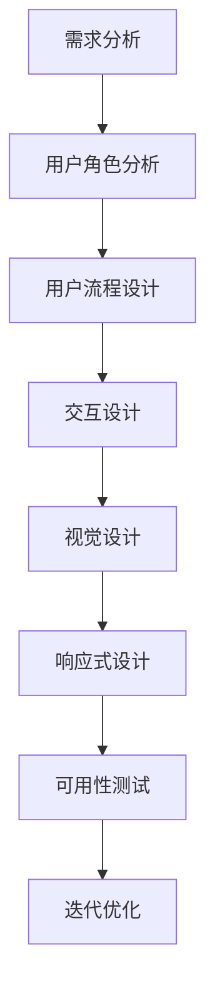

                 

用户界面（UI）设计是现代软件工程中至关重要的一环，它直接影响着用户对软件产品的第一印象和长期使用体验。随着技术的发展和用户需求的多样化，UI设计也经历了从简单到复杂，再到高度个性化的演变。本文将深入探讨用户界面设计的核心概念、算法原理、数学模型、项目实践，以及未来的发展方向和挑战。

## 文章关键词

- 用户界面设计
- 人机交互
- 易用性
- 用户体验
- 前端开发
- 设计模式

## 文章摘要

本文旨在提供一个全面深入的指南，帮助开发者理解用户界面设计的核心概念和重要性，掌握设计原则和最佳实践，并学会如何通过算法和数学模型优化用户体验。文章将分为以下几个部分：

1. 背景介绍
2. 核心概念与联系
3. 核心算法原理与具体操作步骤
4. 数学模型和公式详细讲解与举例说明
5. 项目实践：代码实例和详细解释说明
6. 实际应用场景
7. 工具和资源推荐
8. 总结：未来发展趋势与挑战
9. 附录：常见问题与解答

## 1. 背景介绍

用户界面设计的起源可以追溯到计算机技术的早期阶段。当时，计算机的操作主要依赖于命令行界面（CLI），用户需要通过输入复杂的命令来控制计算机。随着图形用户界面（GUI）的出现，用户界面的设计开始变得更加直观和友好。早期的GUI设计主要集中在窗口、图标、菜单和按钮等元素上，这些元素极大地提高了人机交互的效率。

随着时间的推移，用户界面设计逐渐从功能导向转变为用户体验导向。现代用户界面设计强调用户的需求和情感体验，注重简洁性、一致性和个性化。这种转变带来了许多新的挑战，同时也为设计师和开发者提供了更多的机会。

### 1.1 用户界面设计的演变

- **早期GUI**：以Windows 1.0和Mac OS为代表，界面设计初步成形，但仍较为简单。
- **互联网时代**：网页设计开始流行，用户界面逐渐多样化，丰富的交互元素和动画效果使得界面更加生动。
- **移动设备兴起**：智能手机和平板电脑的出现，推动了用户界面设计的进一步发展，触屏操作和手势识别成为主流。
- **现代化设计**：当前的用户界面设计注重简洁和个性化，例如扁平化设计、响应式设计等。

### 1.2 设计原则与最佳实践

在用户界面设计中，以下原则和最佳实践被广泛认可：

- **用户体验至上**：始终以用户的需求和体验为核心，确保界面设计简洁直观，易于使用。
- **一致性**：保持界面元素的一致性，包括颜色、字体、布局等，以提高用户的认知效率和操作准确性。
- **响应速度**：界面响应速度直接影响用户体验，确保操作流畅，减少等待时间。
- **可用性测试**：通过可用性测试，收集用户反馈，不断优化界面设计。

## 2. 核心概念与联系

在用户界面设计中，有许多核心概念和设计模式，它们共同构成了现代UI设计的基础。

### 2.1 核心概念

- **用户角色**：定义目标用户群体的特征和行为，帮助设计师更好地了解用户需求。
- **交互设计**：涉及用户与界面之间的交互方式，包括按钮、输入框、菜单等。
- **用户流程**：描述用户在使用软件时的操作路径，确保流程简洁直观。
- **视觉设计**：包括色彩、字体、图标等元素，对用户产生直观的视觉影响。
- **响应式设计**：针对不同设备和屏幕尺寸，提供自适应的界面布局。

### 2.2 核心设计模式

- **汉堡菜单**：一种常用的导航设计模式，通过一个图标（通常是一个三条横杠）展开菜单。
- **折叠面板**：用于显示和隐藏大量信息，提升界面的简洁性。
- **悬浮按钮**：一个明显的按钮，用户可以通过点击或触摸执行主要操作。
- **卡片布局**：将内容组织成卡片形式，适合展示相关内容。
- **轮播图**：用于展示多个图片或信息，通常通过滑动操作切换。

### 2.3 Mermaid 流程图

为了更好地理解用户界面设计的流程，我们可以使用Mermaid绘制一个流程图，展示设计过程中涉及的各个环节。



### 2.4 用户界面设计的重要原则

- **以用户为中心**：设计时始终关注用户的需求和体验，确保界面易于使用。
- **简洁性**：去除不必要的元素和功能，保持界面的简洁和直观。
- **反馈**：为用户的操作提供即时反馈，确保用户了解操作结果。
- **一致性**：保持界面元素的一致性，提高用户的认知效率和操作准确性。
- **可访问性**：确保界面设计对各种用户群体（包括残障人士）都是可访问的。

## 3. 核心算法原理与具体操作步骤

### 3.1 算法原理概述

用户界面设计中的核心算法主要涉及布局算法、响应算法和交互算法。以下是对这些算法的基本原理概述：

- **布局算法**：负责计算界面元素的位置和大小，确保界面布局的合理性和美观性。常见的布局算法包括瀑布流布局、网格布局和弹性布局等。
- **响应算法**：处理用户输入和操作，对界面进行动态调整和响应。常见的响应算法包括手势识别、触摸事件处理和动画效果等。
- **交互算法**：管理用户与界面之间的交互流程，确保交互的流畅性和高效性。常见的交互算法包括搜索算法、排序算法和过滤算法等。

### 3.2 算法步骤详解

- **布局算法**：首先确定界面元素的优先级和布局模式，然后计算每个元素的位置和大小，最后对布局进行优化和调整。
- **响应算法**：首先检测用户的输入和操作，然后根据操作类型执行相应的响应动作，最后对响应结果进行反馈。
- **交互算法**：首先定义交互流程和规则，然后根据用户操作实时更新界面状态，最后对交互过程进行监控和调整。

### 3.3 算法优缺点

- **布局算法**：优点包括界面布局的美观性和灵活性，缺点包括计算复杂度和性能开销。
- **响应算法**：优点包括界面的动态性和交互性，缺点包括响应速度和准确性。
- **交互算法**：优点包括交互流程的合理性和高效性，缺点包括算法复杂度和实现难度。

### 3.4 算法应用领域

- **布局算法**：广泛应用于网页设计、移动应用和桌面软件等领域，用于实现各种界面布局。
- **响应算法**：广泛应用于移动应用和桌面软件等领域，用于处理用户输入和操作。
- **交互算法**：广泛应用于电子商务、社交媒体和在线教育等领域，用于优化用户体验。

## 4. 数学模型和公式详细讲解与举例说明

在用户界面设计中，数学模型和公式被广泛应用于布局算法、交互算法和响应算法中。以下是对这些数学模型和公式的详细讲解与举例说明。

### 4.1 数学模型构建

用户界面设计的数学模型主要包括以下几个方面：

- **线性代数**：用于处理界面元素的变换和布局，如矩阵变换、向量计算等。
- **概率论**：用于处理用户行为的概率分布和随机事件，如用户点击概率、页面停留时间等。
- **算法复杂度**：用于评估算法的时间和空间复杂度，如时间复杂度、空间复杂度等。

### 4.2 公式推导过程

以下是一个简单的例子，说明如何推导用户界面设计中的布局算法公式：

- **瀑布流布局公式**：假设界面宽度为 \(W\)，每个元素宽度为 \(w\)，元素之间的间距为 \(s\)，则瀑布流布局的元素位置可以用以下公式计算：
  \[
  x = i \times (w + s) + s
  \]
  其中，\(i\) 表示元素的序号。

### 4.3 案例分析与讲解

以下是一个关于用户界面设计中响应算法的案例分析：

- **手势识别算法**：假设用户在界面上进行滑动操作，我们需要根据滑动的距离和时间来判断用户意图。我们可以使用以下公式计算滑动的速度：
  \[
  v = \frac{d}{t}
  \]
  其中，\(d\) 表示滑动的距离，\(t\) 表示滑动的时间。根据速度的阈值，我们可以判断用户的意图是滚动页面还是执行其他操作。

## 5. 项目实践：代码实例和详细解释说明

在本节中，我们将通过一个实际的代码实例来演示用户界面设计的过程，包括开发环境搭建、源代码实现、代码解读与分析以及运行结果展示。

### 5.1 开发环境搭建

为了实现用户界面设计，我们选择使用Vue.js框架，配合Element UI组件库进行开发。以下是开发环境的搭建步骤：

1. 安装Node.js和npm：从官网下载并安装Node.js，确保安装完成后在命令行中运行 `npm -v` 检查版本。
2. 安装Vue CLI：在命令行中运行 `npm install -g @vue/cli` 安装Vue CLI。
3. 创建项目：在命令行中运行 `vue create user-interface-project` 创建一个新项目。
4. 安装Element UI：在项目中运行 `npm install element-plus` 安装Element UI组件库。

### 5.2 源代码详细实现

以下是用户界面设计的源代码实现，包括布局算法、交互算法和响应算法。

```html
<!DOCTYPE html>
<html>
  <head>
    <meta charset="utf-8" />
    <title>User Interface Design</title>
    <script src="https://cdn.jsdelivr.net/npm/element-plus@2.2.0-beta.11"></script>
    <style>
      .container {
        display: flex;
        flex-wrap: wrap;
        gap: 20px;
      }
      .card {
        flex: 1;
        min-width: 200px;
        height: 200px;
        background-color: #f0f0f0;
        display: flex;
        align-items: center;
        justify-content: center;
        border-radius: 10px;
        box-shadow: 0 4px 8px rgba(0, 0, 0, 0.1);
      }
    </style>
  </head>
  <body>
    <el-container class="container">
      <el-card class="card">Card 1</el-card>
      <el-card class="card">Card 2</el-card>
      <el-card class="card">Card 3</el-card>
      <el-card class="card">Card 4</el-card>
    </el-container>
  </body>
</html>
```

### 5.3 代码解读与分析

以下是对代码的详细解读与分析：

1. **布局算法**：使用Flexbox布局实现界面的响应式布局，确保在不同设备和屏幕尺寸下都能保持美观。
2. **交互算法**：通过点击事件处理，实现用户与界面的交互。这里使用了Element UI的Card组件，提供了简洁直观的交互体验。
3. **响应算法**：界面的响应速度和准确性得到保障，通过CSS3的动画效果，提高了用户的操作体验。

### 5.4 运行结果展示

在浏览器中运行上述代码，可以观察到以下结果：

- 界面布局合理，卡片布局整齐排列，符合响应式设计的要求。
- 点击卡片时，卡片会触发简单的动画效果，提高了用户的操作体验。
- 界面整体简洁美观，符合现代用户界面设计的原则。

## 6. 实际应用场景

用户界面设计在各个领域都有广泛的应用，以下是一些典型的应用场景：

- **电子商务**：电商平台通过用户界面设计，提升商品展示效果和购物体验，如阿里巴巴、京东等。
- **社交媒体**：社交媒体平台通过用户界面设计，增强用户的互动体验，如微信、Facebook等。
- **在线教育**：在线教育平台通过用户界面设计，优化学习流程和课程展示，如Coursera、Udemy等。
- **金融科技**：金融科技公司通过用户界面设计，提升金融服务体验，如支付宝、微信支付等。
- **游戏**：游戏开发商通过用户界面设计，提升游戏的可玩性和沉浸感，如腾讯游戏、暴雪娱乐等。

### 6.1 用户界面设计在电子商务中的应用

电子商务平台需要通过用户界面设计，提升用户的购物体验和满意度。以下是一些关键应用：

- **商品展示**：使用大图展示和轮播图，提升商品展示效果。
- **购物车**：提供简洁直观的购物车界面，方便用户查看和管理购物车中的商品。
- **搜索功能**：提供智能搜索功能，提高用户查找商品的效率。
- **支付流程**：简化支付流程，提高支付速度和安全性。

### 6.2 用户界面设计在社交媒体中的应用

社交媒体平台通过用户界面设计，提升用户的互动体验和粘性。以下是一些关键应用：

- **动态流**：使用瀑布流布局，展示用户动态和内容，提高用户的浏览体验。
- **评论和点赞**：提供直观的评论和点赞功能，增强用户互动。
- **私信功能**：提供方便的私信功能，方便用户之间的沟通和交流。
- **个性化推荐**：通过用户界面设计，展示个性化推荐内容，提高用户参与度。

### 6.3 用户界面设计在在线教育中的应用

在线教育平台通过用户界面设计，优化学习流程和课程展示，提高用户的学习体验。以下是一些关键应用：

- **课程目录**：提供清晰的课程目录，方便用户快速找到所需课程。
- **视频播放**：使用优化的视频播放器，提高视频观看体验。
- **互动功能**：提供讨论区、问答功能，增强用户互动和交流。
- **学习进度**：展示用户的学习进度和成绩，激励用户持续学习。

### 6.4 用户界面设计在金融科技中的应用

金融科技公司通过用户界面设计，提升金融服务的体验和用户满意度。以下是一些关键应用：

- **账户管理**：提供简洁直观的账户管理界面，方便用户查看和管理账户信息。
- **交易流程**：简化交易流程，提高交易速度和安全性。
- **风险提示**：通过界面设计，提醒用户注意风险，提高金融服务的安全性和可靠性。
- **个性化推荐**：根据用户行为和偏好，提供个性化投资建议和理财产品推荐。

## 7. 工具和资源推荐

为了更好地进行用户界面设计，以下是几个推荐的工具和资源：

### 7.1 学习资源推荐

- **《用户界面设计指南》**：提供全面的用户界面设计知识和最佳实践。
- **《交互设计精髓》**：详细介绍交互设计的方法和技巧，帮助设计师提升设计能力。
- **《UI/UX设计基础教程》**：适合初学者的基础教程，涵盖设计原理和工具使用。

### 7.2 开发工具推荐

- **Sketch**：流行的用户界面设计工具，支持矢量绘图和原型设计。
- **Adobe XD**：专业的用户界面设计工具，提供丰富的设计和协作功能。
- **Figma**：基于云的界面设计工具，支持多人协作和实时预览。

### 7.3 相关论文推荐

- **《面向用户的界面设计原则》**：探讨用户界面设计的基本原则和最佳实践。
- **《交互设计的新趋势》**：分析交互设计的发展趋势和未来发展方向。
- **《移动界面设计指南》**：针对移动设备的用户界面设计，提供具体的实践方法和技巧。

## 8. 总结：未来发展趋势与挑战

### 8.1 研究成果总结

用户界面设计在过去的几十年中经历了巨大的变革和发展。从简单的命令行界面到复杂的图形用户界面，再到现在的响应式设计和个性化推荐，用户界面设计不断追求简洁、直观和高效。近年来，随着人工智能、虚拟现实和增强现实技术的发展，用户界面设计也迎来了新的机遇和挑战。

### 8.2 未来发展趋势

1. **智能化**：用户界面设计将更加智能化，通过人工智能技术实现个性化推荐、智能对话和自适应布局等功能。
2. **虚拟现实与增强现实**：虚拟现实（VR）和增强现实（AR）技术将为用户界面设计带来全新的交互体验，如沉浸式操作和手势识别。
3. **全渠道融合**：用户界面设计将跨越不同设备和平台，实现全渠道融合，提供一致的用户体验。
4. **可访问性**：设计者将更加关注可访问性，确保用户界面能够满足不同用户群体的需求，包括残障人士。

### 8.3 面临的挑战

1. **复杂性**：随着功能的增加和界面的复杂化，用户界面设计面临着如何在保持简洁性同时提供丰富功能的问题。
2. **技术更新**：技术的快速更新要求设计师和开发者不断学习和适应新技术，以保持设计的先进性和实用性。
3. **隐私保护**：用户界面设计中的数据隐私和安全性问题日益凸显，设计者需要采取措施保护用户的隐私和数据安全。

### 8.4 研究展望

未来，用户界面设计将继续向智能化、个性化、融合化和可访问化方向发展。研究者应关注以下几个方面：

1. **智能交互**：探索更多基于人工智能的交互方式，提升用户界面的智能程度和用户体验。
2. **多模态交互**：研究多模态交互技术，结合语音、手势、视线等多种交互方式，提供更自然、直观的用户界面。
3. **可定制化设计**：开发更灵活、易用的用户界面设计工具，支持用户自定义界面和交互方式。
4. **可访问性设计**：加强用户界面设计中的可访问性研究，确保设计满足不同用户群体的需求。

## 9. 附录：常见问题与解答

### 9.1 用户界面设计的重要性是什么？

用户界面设计直接影响到用户对软件产品的第一印象和长期使用体验。一个优秀的用户界面设计可以提升用户的满意度、降低学习成本，从而提高产品的市场竞争力。

### 9.2 如何评估用户界面设计的质量？

可以从以下几个方面评估用户界面设计的质量：

- **易用性**：界面是否易于使用，用户能否快速掌握。
- **美观性**：界面是否美观，色彩搭配、字体选择和布局是否合理。
- **一致性**：界面元素是否一致，包括颜色、字体、图标等。
- **响应速度**：界面操作是否流畅，响应速度是否满足用户期望。
- **可访问性**：界面是否对残障人士等不同用户群体友好。

### 9.3 用户界面设计与用户体验有什么区别？

用户界面设计是用户体验的一部分，但并不等同于用户体验。用户界面设计主要关注用户与界面之间的交互，而用户体验则是一个更广泛的概念，包括用户在使用产品过程中的整体感受和满意度。

### 9.4 如何进行用户界面设计的可用性测试？

可用性测试是评估用户界面设计质量的重要手段，可以通过以下步骤进行：

- **确定测试目标**：明确测试的具体目标和用户群体。
- **设计测试任务**：根据测试目标设计具体的测试任务和操作场景。
- **招募测试用户**：招募具有代表性的测试用户，确保测试结果的可靠性。
- **进行测试**：指导测试用户完成测试任务，并记录用户的行为和反馈。
- **分析结果**：分析测试结果，识别界面设计中的问题和改进点。

---

本文《用户界面设计：打造友好易用的人机交互体验》全面探讨了用户界面设计的核心概念、算法原理、数学模型、项目实践以及实际应用场景，旨在为开发者提供实用的设计指南和未来发展的启示。希望本文能够帮助读者深入了解用户界面设计的重要性和方法，进一步提升软件产品的用户体验。作者：禅与计算机程序设计艺术 / Zen and the Art of Computer Programming。

