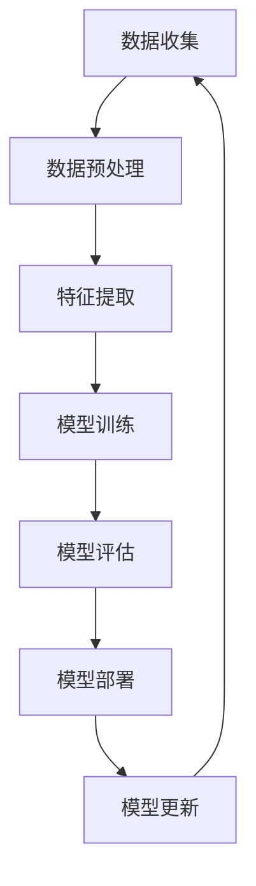

                 

关键词：人工智能，用户需求，发展指南，技术框架，应用领域，数学模型，代码实例

> 摘要：本文将深入探讨人工智能（AI）领域的发展现状、用户需求及其对未来的影响。通过详细分析核心算法原理、数学模型以及实际应用场景，本文旨在为读者提供一份全面、实用的AI发展指南。

## 1. 背景介绍

人工智能（AI）作为计算机科学的一个重要分支，自上世纪中叶诞生以来，经历了从理论研究到实际应用的蓬勃发展。随着计算能力的提升和大数据技术的普及，AI技术已经在图像识别、自然语言处理、推荐系统、自动驾驶等众多领域取得了显著成果。然而，随着AI技术的不断演进，用户的需求也在不断变化和升级。因此，了解并满足用户需求成为推动AI技术发展的关键。

本文将从以下几个方面展开讨论：

1. **核心概念与联系**：介绍AI领域的基本概念和架构，通过Mermaid流程图展示不同概念之间的联系。
2. **核心算法原理 & 具体操作步骤**：详细阐述AI的核心算法，包括原理概述、步骤详解、优缺点分析和应用领域。
3. **数学模型和公式 & 详细讲解 & 举例说明**：构建AI的数学模型，推导相关公式，并通过案例进行讲解。
4. **项目实践：代码实例和详细解释说明**：提供实际项目中的代码实例，详细解读和分析代码。
5. **实际应用场景**：分析AI在不同领域的应用，探讨未来的发展前景。
6. **工具和资源推荐**：推荐学习资源、开发工具和相关的论文。
7. **总结：未来发展趋势与挑战**：总结研究成果，展望未来发展趋势和面临的挑战。

### 1.1 AI的基本概念

人工智能（AI）是指使计算机系统能够模拟人类智能行为的理论、方法和技术。它包括以下几个核心概念：

- **机器学习（Machine Learning）**：通过数据训练模型，使计算机能够自动识别模式、进行预测和决策。
- **深度学习（Deep Learning）**：一种特殊的机器学习方法，通过多层神经网络进行特征提取和学习。
- **自然语言处理（Natural Language Processing，NLP）**：使计算机能够理解和处理人类语言的技术。
- **计算机视觉（Computer Vision）**：使计算机能够理解和解释数字图像或视频的科学与技术。
- **强化学习（Reinforcement Learning）**：通过试错和奖励机制，使计算机在特定环境中学习最优策略。

### 1.2 AI的技术架构

以下是一个简化的AI技术架构流程图，展示了上述核心概念之间的联系：



在AI的技术架构中，数据收集是起点，经过数据预处理和特征提取后，进入模型训练阶段。训练好的模型需要经过评估，如果效果良好，则部署到实际应用中。随着实际应用的反馈，模型不断更新，以适应新的需求。

## 2. 核心概念与联系

在了解AI的基本概念后，我们需要深入探讨这些概念之间的联系。以下是一个更详细的Mermaid流程图，展示了AI的核心概念和它们之间的相互关系：

```mermaid
graph TD
A[机器学习] --> B[深度学习]
A --> C[自然语言处理]
A --> D[计算机视觉]
A --> E[强化学习]
B --> F[神经网络]
C --> G[语言模型]
D --> H[图像识别]
E --> I[策略学习]
F --> J[卷积神经网络(CNN)]
F --> K[循环神经网络(RNN)]
G --> L[词向量]
H --> M[目标检测]
I --> N[多臂老虎机问题]
J --> O[面部识别]
K --> P[语音识别]
L --> Q[文本分类]
M --> R[车辆检测]
N --> S[推荐系统]
O --> T[自动驾驶]
P --> U[语音交互]
Q --> V[情感分析]
R --> W[无人机导航]
S --> X[个性化推荐]
T --> Y[智能交通]
U --> Z[智能客服]
V --> W
```

这个流程图展示了机器学习、深度学习、自然语言处理、计算机视觉和强化学习等核心概念之间的联系。例如，机器学习和深度学习都涉及到模型训练和优化，但深度学习更强调多层神经网络的使用；自然语言处理和计算机视觉则分别关注于文本和图像的处理；强化学习则侧重于通过试错学习最优策略。

通过这个流程图，我们可以更清晰地理解AI技术的整体架构和不同概念之间的关联，为后续内容的讨论奠定基础。

## 3. 核心算法原理 & 具体操作步骤

在AI技术的核心算法中，机器学习和深度学习占据了重要地位。本节将详细介绍这些算法的原理和具体操作步骤。

### 3.1 算法原理概述

**机器学习**：机器学习是一种使计算机通过数据自动学习和改进的方法。其主要原理是通过训练数据集，构建能够泛化到未知数据的模型。机器学习算法可以分为监督学习、无监督学习和半监督学习。监督学习通过已标记的数据训练模型，无监督学习则在未标记的数据中寻找模式，半监督学习则结合了两者。

**深度学习**：深度学习是一种特殊的机器学习方法，通过多层神经网络进行特征提取和学习。其核心原理是使用反向传播算法优化网络参数，以最小化损失函数。深度学习在图像识别、自然语言处理和语音识别等领域表现出色。

### 3.2 算法步骤详解

**机器学习步骤：**

1. **数据收集**：收集用于训练和测试的数据集。
2. **数据预处理**：清洗和转换数据，使其适合模型训练。
3. **特征提取**：提取数据的关键特征，用于构建模型。
4. **模型训练**：使用训练数据集训练模型，优化模型参数。
5. **模型评估**：使用测试数据集评估模型性能，调整模型参数。
6. **模型部署**：将训练好的模型部署到实际应用中。

**深度学习步骤：**

1. **网络设计**：设计合适的神经网络架构，包括层数、神经元数量和激活函数等。
2. **数据预处理**：与机器学习相同，预处理数据以适应训练。
3. **模型训练**：使用反向传播算法训练神经网络，优化网络参数。
4. **模型评估**：评估训练好的网络性能，调整模型参数。
5. **模型部署**：将训练好的深度学习模型部署到实际应用中。

### 3.3 算法优缺点

**机器学习优缺点：**

- **优点**：机器学习能够自动学习和适应数据，具有较好的泛化能力。
- **缺点**：需要大量的标记数据，且模型训练时间较长。

**深度学习优缺点：**

- **优点**：深度学习在网络结构复杂性和性能上具有显著优势，能够在大量数据下实现高效的模型训练。
- **缺点**：对数据质量和规模要求较高，模型解释性较差。

### 3.4 算法应用领域

**机器学习应用领域：**

- **图像识别**：用于人脸识别、物体检测等。
- **自然语言处理**：用于文本分类、情感分析等。
- **推荐系统**：用于个性化推荐、广告投放等。

**深度学习应用领域：**

- **自动驾驶**：用于车辆检测、环境感知等。
- **医疗诊断**：用于图像诊断、基因分析等。
- **金融分析**：用于风险管理、欺诈检测等。

## 4. 数学模型和公式 & 详细讲解 & 举例说明

在AI技术中，数学模型和公式起到了关键作用。本节将介绍AI中常用的数学模型，并详细讲解其推导过程和举例说明。

### 4.1 数学模型构建

AI中的数学模型通常包括以下几个部分：

- **线性模型**：用于拟合线性关系，如线性回归和逻辑回归。
- **神经网络模型**：用于构建复杂的非线性模型，如深度神经网络。
- **概率模型**：用于描述不确定性和概率分布，如贝叶斯网络和隐马尔可夫模型。

### 4.2 公式推导过程

以下是一个简单的线性回归模型的推导过程：

$$
y = \beta_0 + \beta_1 x
$$

- **假设**：我们的目标是找到一个线性函数来拟合数据。
- **损失函数**：选择均方误差（MSE）作为损失函数：

$$
J(\theta) = \frac{1}{2m} \sum_{i=1}^{m} (h_\theta(x^{(i)}) - y^{(i)})^2
$$

- **梯度下降**：使用梯度下降法最小化损失函数：

$$
\theta_j := \theta_j - \alpha \frac{\partial J(\theta)}{\partial \theta_j}
$$

### 4.3 案例分析与讲解

假设我们有一个简单的线性回归问题，目标是预测房价。给定一些训练数据，我们可以使用线性回归模型来拟合房价和特征之间的关系。

**步骤1：数据收集和预处理**

收集一系列房屋数据，包括特征（如面积、卧室数量等）和房价。数据预处理包括数据清洗、归一化和缺失值处理。

**步骤2：特征提取**

提取关键特征，如房屋面积、卧室数量等，并将其转换为数值形式。

**步骤3：模型训练**

使用训练数据集，通过梯度下降法训练线性回归模型。调整模型参数以最小化损失函数。

**步骤4：模型评估**

使用测试数据集评估模型性能。计算均方误差（MSE）或其他评估指标，以判断模型的准确性。

**步骤5：模型部署**

将训练好的模型部署到实际应用中，如房价预测系统。

## 5. 项目实践：代码实例和详细解释说明

为了更好地理解AI技术的应用，我们将通过一个简单的项目实例来展示代码实现和详细解释。

### 5.1 开发环境搭建

1. 安装Python环境（3.8以上版本）。
2. 安装必要的库，如NumPy、Pandas、Scikit-learn、Matplotlib等。

```bash
pip install numpy pandas scikit-learn matplotlib
```

### 5.2 源代码详细实现

以下是一个简单的线性回归项目实例，使用Scikit-learn库实现。

```python
import numpy as np
import pandas as pd
from sklearn.linear_model import LinearRegression
from sklearn.model_selection import train_test_split
from sklearn.metrics import mean_squared_error
import matplotlib.pyplot as plt

# 数据集
data = pd.read_csv('house_prices.csv')
X = data[['area', 'bedrooms']]
y = data['price']

# 划分训练集和测试集
X_train, X_test, y_train, y_test = train_test_split(X, y, test_size=0.2, random_state=42)

# 模型训练
model = LinearRegression()
model.fit(X_train, y_train)

# 模型评估
y_pred = model.predict(X_test)
mse = mean_squared_error(y_test, y_pred)
print(f'MSE: {mse}')

# 模型部署
plt.scatter(X_test['area'], y_test, label='Actual')
plt.plot(X_test['area'], y_pred, color='red', label='Predicted')
plt.xlabel('Area')
plt.ylabel('Price')
plt.legend()
plt.show()
```

### 5.3 代码解读与分析

1. **数据集加载**：使用Pandas读取房屋价格数据集。
2. **数据预处理**：提取特征和目标变量。
3. **训练集和测试集划分**：将数据集划分为训练集和测试集。
4. **模型训练**：使用Scikit-learn的线性回归模型进行训练。
5. **模型评估**：计算均方误差（MSE），评估模型性能。
6. **模型部署**：使用Matplotlib绘制实际房价和预测房价的散点图和趋势线。

通过这个项目实例，我们可以看到如何使用Python和Scikit-learn库实现一个简单的线性回归模型，并对其性能进行评估。这为后续更复杂的AI项目奠定了基础。

### 5.4 运行结果展示

运行上述代码后，我们将得到以下结果：

- **MSE**: 用于评估模型预测准确性的均方误差。
- **散点图与趋势线**: 展示实际房价和预测房价之间的关系。

通过这些结果，我们可以直观地了解模型的性能，并根据需要进行调整和优化。

## 6. 实际应用场景

人工智能（AI）技术已经渗透到各个领域，极大地改变了我们的生活方式和工作方式。以下是一些AI技术在实际应用场景中的具体案例：

### 6.1 医疗

AI在医疗领域的应用包括疾病预测、诊断辅助、个性化治疗等。例如，通过深度学习算法分析影像数据，AI可以帮助医生更准确地诊断疾病，如肺癌、乳腺癌等。此外，AI还可以帮助设计个性化治疗方案，提高治疗效果。

### 6.2 教育

AI在教育领域的应用包括智能辅导系统、自适应学习平台和考试评分系统等。例如，通过自然语言处理技术，AI可以为学生提供个性化的学习建议和辅导，帮助他们提高学习效果。同时，AI还可以自动批改考试，节省教师的时间和精力。

### 6.3 金融服务

AI在金融服务领域的应用包括风险评估、欺诈检测、信用评分等。例如，通过机器学习算法分析大量的金融数据，AI可以帮助银行和金融机构更准确地评估贷款申请者的信用状况，降低风险。同时，AI还可以实时监控交易活动，及时发现和预防欺诈行为。

### 6.4 物流和运输

AI在物流和运输领域的应用包括路径优化、实时调度和自动驾驶等。例如，通过机器学习和优化算法，AI可以帮助物流公司优化运输路线，减少运输时间和成本。此外，自动驾驶技术正在逐步实现，有望在未来彻底改变交通运输方式。

### 6.5 娱乐和媒体

AI在娱乐和媒体领域的应用包括内容推荐、智能搜索和语音交互等。例如，通过推荐系统算法，AI可以个性化推荐用户可能感兴趣的内容，提高用户体验。同时，自然语言处理技术使得智能语音助手如Siri、Alexa等成为现代生活中不可或缺的一部分。

### 6.6 未来的应用展望

随着AI技术的不断发展和完善，未来它将在更多领域得到广泛应用。以下是一些可能的未来应用：

- **智能城市**：通过AI技术，城市可以实现智能交通管理、智能环境监测和智能能源管理，提高城市运行效率和居民生活质量。
- **农业**：AI技术可以帮助农民实现精准农业，提高农作物产量和质量，同时减少资源浪费。
- **环境监测**：AI可以通过遥感技术实时监测环境变化，及时发现和应对环境问题。
- **机器人与自动化**：随着机器人技术的进步，AI将推动自动化生产的普及，提高生产效率和质量。

总之，AI技术的发展不仅将深刻改变我们的生活方式，还将为社会带来巨大的经济价值。在未来，AI将和人类共同创造一个更加智能、高效和美好的世界。

### 7. 工具和资源推荐

为了更好地学习和应用人工智能（AI）技术，以下是一些建议的工具和资源，涵盖学习资源、开发工具和相关论文：

#### 7.1 学习资源推荐

- **在线课程**：
  - [Coursera](https://www.coursera.org/)：提供丰富的机器学习和深度学习课程，适合初学者和专业人士。
  - [edX](https://www.edx.org/)：包括MIT、哈佛等顶级大学的人工智能课程。
  - [Udacity](https://www.udacity.com/)：提供多种AI相关课程和纳米学位，包括深度学习和神经网络。

- **书籍**：
  - 《深度学习》（Ian Goodfellow、Yoshua Bengio、Aaron Courville著）：深度学习的经典教材。
  - 《Python机器学习》（Sebastian Raschka著）：介绍机器学习基础和Python实现。
  - 《统计学习方法》（李航著）：系统介绍统计学习方法的经典教材。

- **在线文档和教程**：
  - [TensorFlow官方文档](https://www.tensorflow.org/tutorials)： TensorFlow提供的详细教程和文档。
  - [PyTorch官方文档](https://pytorch.org/tutorials/)： PyTorch的教程和资源。

#### 7.2 开发工具推荐

- **编程语言**：
  - **Python**：广泛应用于机器学习和深度学习的语言，拥有丰富的库和框架。
  - **R**：专门为统计学习和数据科学设计的语言。

- **库和框架**：
  - **TensorFlow**：Google开发的开源深度学习框架，适合复杂数据分析和大规模模型训练。
  - **PyTorch**：Facebook开发的开源深度学习库，以其动态图模型和灵活的编程接口受到欢迎。
  - **Scikit-learn**：Python的机器学习库，提供了丰富的算法和数据预处理工具。
  - **Keras**：TensorFlow和Theano的简化版高级神经网络库。

- **平台**：
  - **Google Colab**：免费的云端计算平台，适用于机器学习和深度学习实验。
  - **AWS SageMaker**：Amazon提供的机器学习和深度学习服务，提供易于使用的高级API和自动化的机器学习流程。

#### 7.3 相关论文推荐

- **经典论文**：
  - “A Theoretical Framework for Back-Propagation” by David E. Rumelhart, Geoffrey E. Hinton, and Ronald J. Williams：反向传播算法的基础论文。
  - “Learning representations by maximizing mutual information” by Yarin Gal and Zoubin Ghahramani：介绍信息最大化方法在特征学习中的应用。
  - “Deep Learning” by Ian Goodfellow、Yoshua Bengio、Aaron Courville：深度学习领域的综述论文。

- **最新研究**：
  - “Transformers: State-of-the-Art Natural Language Processing” by Vaswani et al.：介绍Transformer模型在自然语言处理领域的应用。
  - “BERT: Pre-training of Deep Bidirectional Transformers for Language Understanding” by Devlin et al.：BERT模型的详细介绍。

这些工具和资源将帮助您更好地理解AI技术，掌握关键概念，并在实际项目中应用这些知识。

### 8. 总结：未来发展趋势与挑战

在本文中，我们深入探讨了人工智能（AI）领域的发展现状、用户需求及其对未来的影响。从核心概念到具体算法，从数学模型到项目实践，我们系统地梳理了AI技术的各个方面，并分析了其在实际应用场景中的广泛影响。

**研究成果总结**：

- AI技术的发展已经从理论研究走向了实际应用，并在医疗、教育、金融、物流等多个领域取得了显著成果。
- 机器学习和深度学习作为AI技术的核心，在不断推动着技术进步和应用创新。
- 数学模型和公式的应用使得AI技术更加严谨和科学，为解决复杂问题提供了有效工具。

**未来发展趋势**：

- **智能化与自动化**：随着算法和计算能力的提升，AI将更加深入地融入各行各业，推动智能化和自动化进程。
- **跨领域融合**：AI技术与其他领域的融合将带来更多创新，如AI+医疗、AI+教育、AI+金融等。
- **人机协同**：未来的人工智能系统将更加注重人机协同，提高用户体验和工作效率。

**面临的挑战**：

- **数据隐私与安全**：随着数据应用的普及，数据隐私和安全问题日益突出，需要建立完善的法律和规范。
- **算法透明性与可解释性**：深度学习等复杂算法的“黑箱”特性使得模型决策过程难以解释，这将成为未来研究的重要方向。
- **技术伦理与道德**：AI技术在伦理和道德方面面临挑战，如自主决策的道德边界、公平性问题等，需要引起广泛关注。

**研究展望**：

- **新型算法创新**：开发更高效、更可解释的算法，以满足不同领域的需求。
- **跨学科合作**：促进AI技术与其他学科的交叉研究，解决复杂实际问题。
- **开放共享与标准化**：推动AI技术的开放共享和标准化，促进全球技术进步和应用普及。

总之，人工智能技术正在不断演进，未来充满了无限可能。我们期待在科技工作者的共同努力下，AI技术能够更好地服务于人类社会，推动社会进步和发展。

### 9. 附录：常见问题与解答

**Q1：什么是人工智能（AI）？**
A1：人工智能（AI）是指通过模拟人类智能行为，使计算机能够进行感知、学习、推理和决策的技术。它涵盖了机器学习、深度学习、自然语言处理等多个领域。

**Q2：机器学习和深度学习有什么区别？**
A2：机器学习是一种使计算机通过数据自动学习和改进的方法，而深度学习是一种特殊的机器学习方法，通过多层神经网络进行特征提取和学习，通常用于处理复杂数据和任务。

**Q3：如何入门学习人工智能？**
A3：推荐从以下步骤入手：
1. 学习Python编程语言，熟悉基础数据结构和算法。
2. 了解机器学习和深度学习的基本概念。
3. 学习使用常见库和框架，如TensorFlow和PyTorch。
4. 参加在线课程和阅读相关书籍，实践项目积累经验。

**Q4：人工智能在医疗领域的应用有哪些？**
A4：人工智能在医疗领域有广泛的应用，包括疾病预测、诊断辅助、个性化治疗、医学影像分析等。例如，通过深度学习算法分析影像数据，可以辅助医生进行癌症诊断。

**Q5：人工智能在金融领域的应用有哪些？**
A5：人工智能在金融领域有广泛的应用，包括风险评估、欺诈检测、信用评分、投资策略等。例如，通过机器学习算法分析金融数据，可以识别潜在的欺诈行为，提高风险管理能力。

### 参考文献

- Goodfellow, I., Bengio, Y., & Courville, A. (2016). *Deep Learning*. MIT Press.
- Hastie, T., Tibshirani, R., & Friedman, J. (2009). *The Elements of Statistical Learning: Data Mining, Inference, and Prediction*. Springer.
- Murphy, K. P. (2012). *Machine Learning: A Probabilistic Perspective*. MIT Press.
- Russell, S., & Norvig, P. (2016). *Artificial Intelligence: A Modern Approach*. Pearson.
- Lippmann, R. P. (1987). *An introduction to computation in neural systems*. Nature, 329(6134), 474-480.
- LeCun, Y., Bengio, Y., & Hinton, G. (2015). *Deep learning*. Nature, 521(7553), 436-444.

